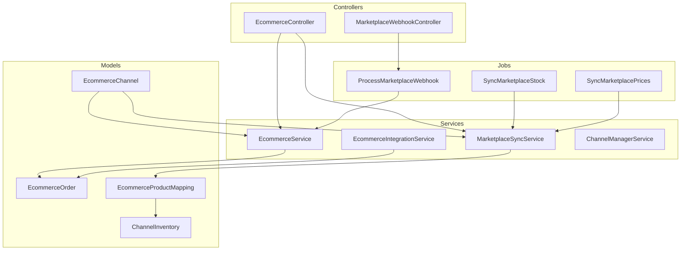
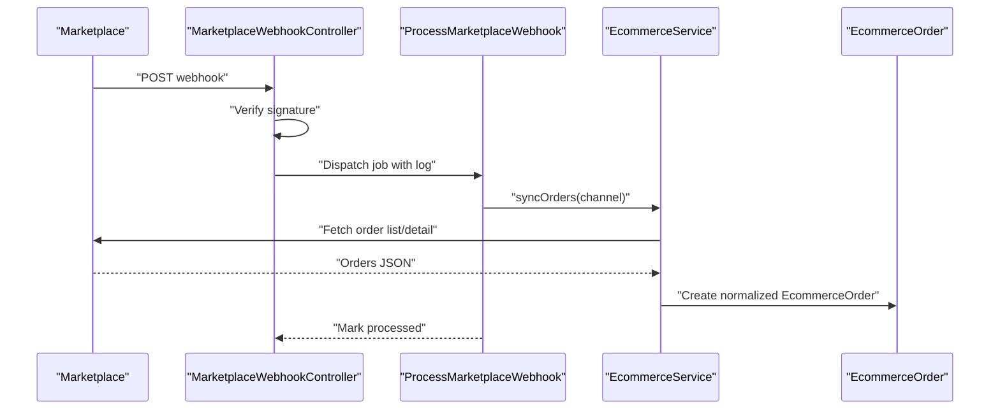
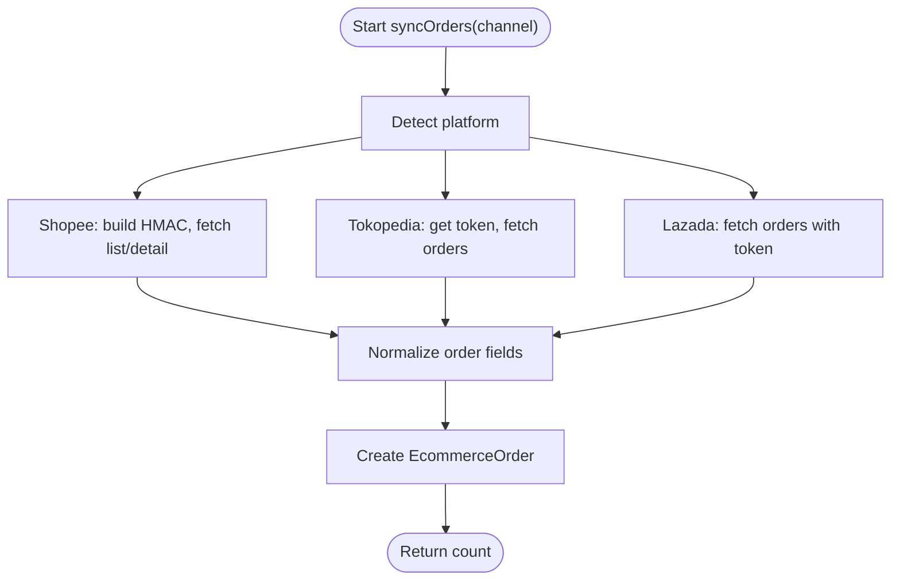
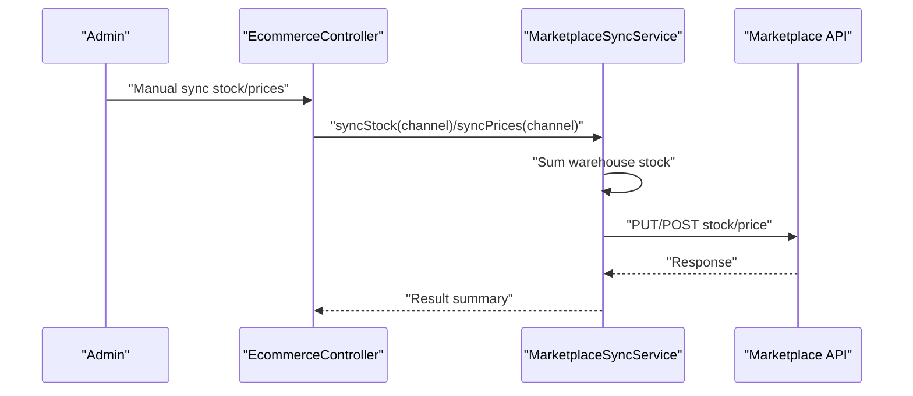
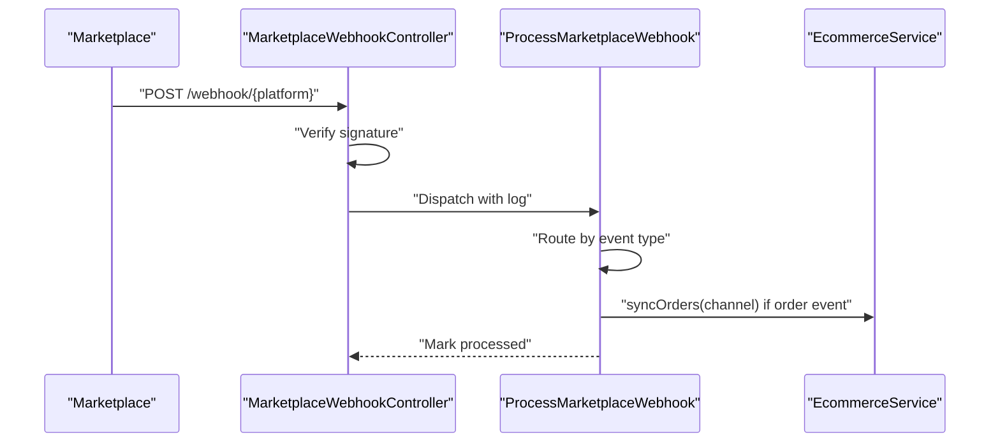
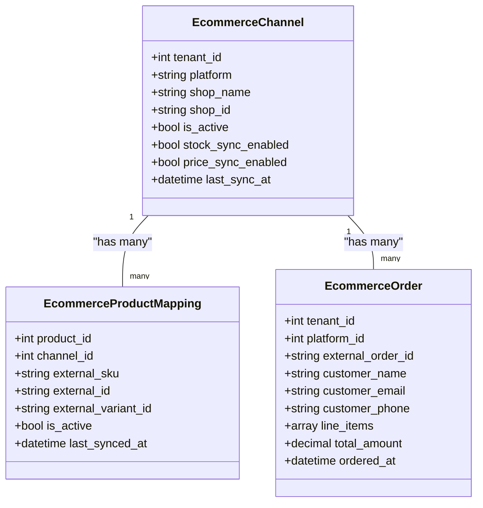
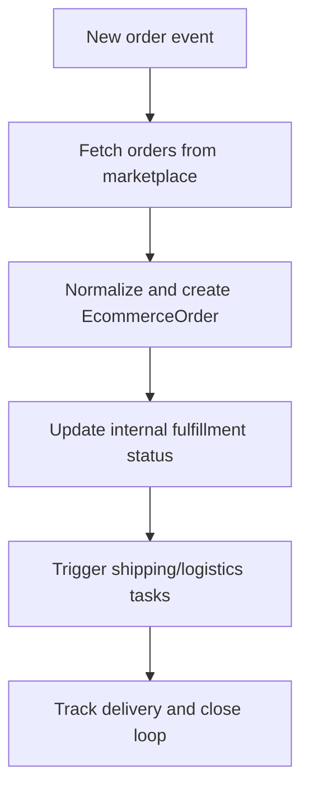
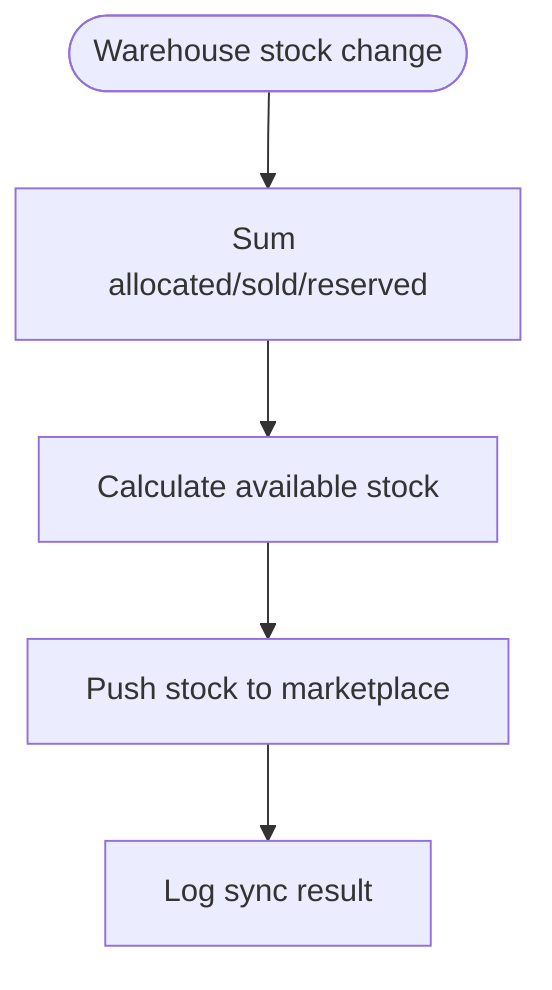
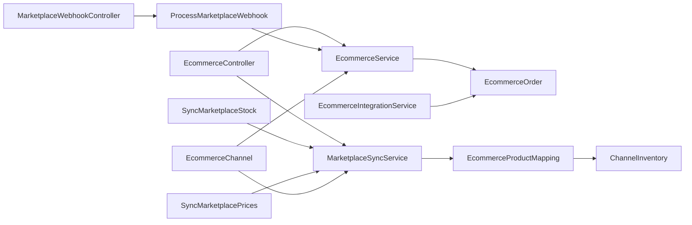

# E-commerce Platform Integration

<cite>
**Referenced Files in This Document**
- [EcommerceService.php](file://app/Services/EcommerceService.php)
- [EcommerceIntegrationService.php](file://app/Services/Integrations/EcommerceIntegrationService.php)
- [MarketplaceSyncService.php](file://app/Services/MarketplaceSyncService.php)
- [MarketplaceWebhookController.php](file://app/Http/Controllers/MarketplaceWebhookController.php)
- [ProcessMarketplaceWebhook.php](file://app/Jobs/ProcessMarketplaceWebhook.php)
- [EcommerceController.php](file://app/Http/Controllers/EcommerceController.php)
- [EcommerceChannel.php](file://app/Models/EcommerceChannel.php)
- [EcommerceOrder.php](file://app/Models/EcommerceOrder.php)
- [EcommerceProductMapping.php](file://app/Models/EcommerceProductMapping.php)
- [ChannelInventory.php](file://app/Models/ChannelInventory.php)
- [SyncMarketplaceStock.php](file://app/Jobs/SyncMarketplaceStock.php)
- [SyncMarketplacePrices.php](file://app/Jobs/SyncMarketplacePrices.php)
- [ChannelManagerService.php](file://app/Services/ChannelManagerService.php)
</cite>

## Table of Contents
1. [Introduction](#introduction)
2. [Project Structure](#project-structure)
3. [Core Components](#core-components)
4. [Architecture Overview](#architecture-overview)
5. [Detailed Component Analysis](#detailed-component-analysis)
6. [Dependency Analysis](#dependency-analysis)
7. [Performance Considerations](#performance-considerations)
8. [Troubleshooting Guide](#troubleshooting-guide)
9. [Conclusion](#conclusion)

## Introduction
This document explains the e-commerce platform integration capabilities of the system, focusing on multi-channel order management, inventory synchronization, product catalog alignment, and webhook-driven orchestration. It covers supported marketplace platforms (Shopee, Tokopedia, Lazada) and broader e-commerce integrations (Shopify, WooCommerce), detailing authentication flows, data normalization, outbound synchronization, and operational reliability.

## Project Structure
The integration spans services, jobs, controllers, and models that collectively manage inbound order imports, outbound inventory/price pushes, and webhook processing.

**Diagram sources**
- [EcommerceController.php:15-243](file://app/Http/Controllers/EcommerceController.php#L15-L243)
- [MarketplaceWebhookController.php:11-137](file://app/Http/Controllers/MarketplaceWebhookController.php#L11-L137)
- [EcommerceService.php:21-402](file://app/Services/EcommerceService.php#L21-L402)
- [MarketplaceSyncService.php:22-439](file://app/Services/MarketplaceSyncService.php#L22-L439)
- [EcommerceIntegrationService.php:10-252](file://app/Services/Integrations/EcommerceIntegrationService.php#L10-L252)
- [ProcessMarketplaceWebhook.php:16-142](file://app/Jobs/ProcessMarketplaceWebhook.php#L16-L142)
- [SyncMarketplaceStock.php:15-66](file://app/Jobs/SyncMarketplaceStock.php#L15-L66)
- [SyncMarketplacePrices.php:15-66](file://app/Jobs/SyncMarketplacePrices.php#L15-L66)
- [EcommerceChannel.php:11-116](file://app/Models/EcommerceChannel.php#L11-L116)
- [EcommerceOrder.php:10-53](file://app/Models/EcommerceOrder.php#L10-L53)
- [EcommerceProductMapping.php:8-88](file://app/Models/EcommerceProductMapping.php#L8-L88)
- [ChannelInventory.php:11-81](file://app/Models/ChannelInventory.php#L11-L81)

**Section sources**
- [EcommerceController.php:19-243](file://app/Http/Controllers/EcommerceController.php#L19-L243)
- [EcommerceService.php:21-402](file://app/Services/EcommerceService.php#L21-L402)
- [MarketplaceSyncService.php:22-439](file://app/Services/MarketplaceSyncService.php#L22-L439)
- [EcommerceIntegrationService.php:10-252](file://app/Services/Integrations/EcommerceIntegrationService.php#L10-L252)
- [MarketplaceWebhookController.php:11-137](file://app/Http/Controllers/MarketplaceWebhookController.php#L11-L137)
- [ProcessMarketplaceWebhook.php:16-142](file://app/Jobs/ProcessMarketplaceWebhook.php#L16-L142)
- [SyncMarketplaceStock.php:15-66](file://app/Jobs/SyncMarketplaceStock.php#L15-L66)
- [SyncMarketplacePrices.php:15-66](file://app/Jobs/SyncMarketplacePrices.php#L15-L66)
- [EcommerceChannel.php:11-116](file://app/Models/EcommerceChannel.php#L11-L116)
- [EcommerceOrder.php:10-53](file://app/Models/EcommerceOrder.php#L10-L53)
- [EcommerceProductMapping.php:8-88](file://app/Models/EcommerceProductMapping.php#L8-L88)
- [ChannelInventory.php:11-81](file://app/Models/ChannelInventory.php#L11-L81)

## Core Components
- EcommerceService: Inbound order import from Shopee, Tokopedia, and Lazada with normalized order records.
- MarketplaceSyncService: Outbound stock and price synchronization to Shopee, Tokopedia, and Lazada.
- EcommerceIntegrationService: Order import and inventory sync for Shopify, WooCommerce, and Tokopedia (platform variants).
- MarketplaceWebhookController and ProcessMarketplaceWebhook: Secure webhook ingestion, signature verification, routing, and event-driven actions.
- EcommerceController: Management UI for channels, mappings, manual sync, and dashboards.
- Supporting models: EcommerceChannel, EcommerceOrder, EcommerceProductMapping, ChannelInventory.

**Section sources**
- [EcommerceService.php:21-402](file://app/Services/EcommerceService.php#L21-L402)
- [MarketplaceSyncService.php:22-439](file://app/Services/MarketplaceSyncService.php#L22-L439)
- [EcommerceIntegrationService.php:10-252](file://app/Services/Integrations/EcommerceIntegrationService.php#L10-L252)
- [MarketplaceWebhookController.php:11-137](file://app/Http/Controllers/MarketplaceWebhookController.php#L11-L137)
- [ProcessMarketplaceWebhook.php:16-142](file://app/Jobs/ProcessMarketplaceWebhook.php#L16-L142)
- [EcommerceController.php:15-243](file://app/Http/Controllers/EcommerceController.php#L15-L243)
- [EcommerceChannel.php:11-116](file://app/Models/EcommerceChannel.php#L11-L116)
- [EcommerceOrder.php:10-53](file://app/Models/EcommerceOrder.php#L10-L53)
- [EcommerceProductMapping.php:8-88](file://app/Models/EcommerceProductMapping.php#L8-L88)
- [ChannelInventory.php:11-81](file://app/Models/ChannelInventory.php#L11-L81)

## Architecture Overview
The system integrates inbound and outbound flows:
- Inbound: Controllers and services fetch orders from marketplace APIs; webhooks trigger immediate order sync.
- Outbound: Jobs and services push stock and price updates to marketplace APIs; mapping ensures SKU alignment.
- Data model: Channels encapsulate credentials and sync preferences; mappings connect ERP products to marketplace SKUs.

**Diagram sources**
- [MarketplaceWebhookController.php:17-54](file://app/Http/Controllers/MarketplaceWebhookController.php#L17-L54)
- [ProcessMarketplaceWebhook.php:22-60](file://app/Jobs/ProcessMarketplaceWebhook.php#L22-L60)
- [EcommerceService.php:27-107](file://app/Services/EcommerceService.php#L27-L107)
- [EcommerceOrder.php:14-32](file://app/Models/EcommerceOrder.php#L14-L32)

## Detailed Component Analysis

### Inbound Order Import (Shopee, Tokopedia, Lazada)
- Authentication and signatures:
  - Shopee: HMAC-SHA256 using partner credentials and shop ID.
  - Tokopedia: OAuth2 client credentials grant; bearer token for requests.
  - Lazada: Bearer token with app key.
- Data normalization:
  - Creates EcommerceOrder with customer info, items, totals, shipping address, and mapped status.
- Status mapping:
  - Shopee, Tokopedia, and Lazada statuses are normalized to unified internal states.

**Diagram sources**
- [EcommerceService.php:27-107](file://app/Services/EcommerceService.php#L27-L107)
- [EcommerceService.php:109-172](file://app/Services/EcommerceService.php#L109-L172)
- [EcommerceService.php:176-241](file://app/Services/EcommerceService.php#L176-L241)
- [EcommerceService.php:243-388](file://app/Services/EcommerceService.php#L243-L388)
- [EcommerceService.php:390-400](file://app/Services/EcommerceService.php#L390-L400)

**Section sources**
- [EcommerceService.php:27-402](file://app/Services/EcommerceService.php#L27-L402)
- [EcommerceOrder.php:14-32](file://app/Models/EcommerceOrder.php#L14-L32)

### Outbound Inventory and Price Synchronization
- Stock sync:
  - Aggregates warehouse quantities per mapped product and pushes to marketplace stock endpoints.
  - Logs successes/failures and schedules retries via sync logs.
- Price sync:
  - Uses override price if present, otherwise product’s selling price.
- Platform specifics:
  - Shopee/Lazada: signed requests with HMAC or bearer tokens.
  - Tokopedia: client credentials token flow for fulfillment endpoints.

**Diagram sources**
- [EcommerceController.php:136-164](file://app/Http/Controllers/EcommerceController.php#L136-L164)
- [MarketplaceSyncService.php:35-93](file://app/Services/MarketplaceSyncService.php#L35-L93)
- [MarketplaceSyncService.php:103-161](file://app/Services/MarketplaceSyncService.php#L103-L161)

**Section sources**
- [MarketplaceSyncService.php:22-439](file://app/Services/MarketplaceSyncService.php#L22-L439)
- [SyncMarketplaceStock.php:15-66](file://app/Jobs/SyncMarketplaceStock.php#L15-L66)
- [SyncMarketplacePrices.php:15-66](file://app/Jobs/SyncMarketplacePrices.php#L15-L66)

### Webhook Handling and Event Routing
- Endpoint handlers:
  - Shopee/Tokopedia/Lazada webhooks verified via HMAC signatures using channel webhook secret.
- Processing:
  - Routes to order/inventory/product events; order events trigger immediate sync; inventory/product events are logged for reconciliation.

**Diagram sources**
- [MarketplaceWebhookController.php:17-135](file://app/Http/Controllers/MarketplaceWebhookController.php#L17-L135)
- [ProcessMarketplaceWebhook.php:22-50](file://app/Jobs/ProcessMarketplaceWebhook.php#L22-L50)
- [EcommerceService.php:27-35](file://app/Services/EcommerceService.php#L27-L35)

**Section sources**
- [MarketplaceWebhookController.php:11-137](file://app/Http/Controllers/MarketplaceWebhookController.php#L11-L137)
- [ProcessMarketplaceWebhook.php:16-142](file://app/Jobs/ProcessMarketplaceWebhook.php#L16-L142)

### Product Catalog and Mapping
- Mapping model:
  - Links ERP product to external SKU and stores metadata; supports price overrides.
- Channel configuration:
  - Stores credentials, tokens, and sync preferences per marketplace channel.
- Manual mapping UI:
  - Admin can create/delete mappings and review price history.

**Diagram sources**
- [EcommerceChannel.php:17-45](file://app/Models/EcommerceChannel.php#L17-L45)
- [EcommerceProductMapping.php:12-28](file://app/Models/EcommerceProductMapping.php#L12-L28)
- [EcommerceOrder.php:14-42](file://app/Models/EcommerceOrder.php#L14-L42)

**Section sources**
- [EcommerceProductMapping.php:8-88](file://app/Models/EcommerceProductMapping.php#L8-L88)
- [EcommerceChannel.php:11-116](file://app/Models/EcommerceChannel.php#L11-L116)
- [EcommerceController.php:69-134](file://app/Http/Controllers/EcommerceController.php#L69-L134)

### Order Management Workflows
- Automatic order import:
  - Scheduled jobs or webhook-triggered sync fetches orders and creates normalized records.
- Status synchronization:
  - Inbound status mapping aligns marketplace statuses to internal states.
- Fulfillment coordination:
  - Pending orders are retrievable for fulfillment; ERP maintains authoritative stock.
- Returns processing:
  - Not implemented in the referenced code; future extension should map return events and reconcile inventory.

[No sources needed since this diagram shows conceptual workflow, not actual code structure]

**Section sources**
- [EcommerceService.php:27-402](file://app/Services/EcommerceService.php#L27-L402)
- [EcommerceOrder.php:14-32](file://app/Models/EcommerceOrder.php#L14-L32)
- [EcommerceController.php:21-67](file://app/Http/Controllers/EcommerceController.php#L21-L67)

### Inventory Synchronization Mechanisms
- Real-time availability:
  - ERP computes stock across warehouses; marketplace stock is pushed from ERP (source of truth).
- Reconciliation:
  - Inventory webhooks log marketplace stock levels for reconciliation; ERP does not auto-decrement from marketplace signals.
- Channel inventory tracking:
  - ChannelInventory model supports allocation, sold, reserved, and available stock calculations.

**Diagram sources**
- [MarketplaceSyncService.php:35-93](file://app/Services/MarketplaceSyncService.php#L35-L93)
- [ChannelInventory.php:34-68](file://app/Models/ChannelInventory.php#L34-L68)

**Section sources**
- [MarketplaceSyncService.php:22-439](file://app/Services/MarketplaceSyncService.php#L22-L439)
- [ChannelInventory.php:11-81](file://app/Models/ChannelInventory.php#L11-L81)
- [ProcessMarketplaceWebhook.php:65-87](file://app/Jobs/ProcessMarketplaceWebhook.php#L65-L87)

### Product Catalog Management and Cross-Channel Pricing
- Price synchronization:
  - Uses price override if configured; otherwise product selling price.
- Promotional campaigns:
  - Not implemented in the referenced code; future extension should coordinate discounts and campaign rules across channels.
- Cross-channel pricing strategies:
  - Mapping supports per-channel price overrides; ERP centralizes pricing logic.

**Section sources**
- [MarketplaceSyncService.php:103-161](file://app/Services/MarketplaceSyncService.php#L103-L161)
- [EcommerceProductMapping.php:12-28](file://app/Models/EcommerceProductMapping.php#L12-L28)

### Shipping Integration, Label Generation, and Logistics Coordination
- Not implemented in the referenced code; future extension should integrate with logistics providers and generate shipping labels from fulfilled orders.

[No sources needed since this section provides general guidance]

### Shopify and WooCommerce Integration
- Order import:
  - Shopify: Bearer token on admin API.
  - WooCommerce: Basic auth with consumer keys.
- Inventory sync:
  - Shopify/WooCommerce endpoints support variant stock updates.
- Tokopedia (platform variant):
  - Separate endpoint flow with bearer token and shop ID.

**Section sources**
- [EcommerceIntegrationService.php:15-252](file://app/Services/Integrations/EcommerceIntegrationService.php#L15-L252)

## Dependency Analysis
- Controllers depend on services for business logic.
- Jobs encapsulate long-running outbound syncs and webhook processing.
- Models define domain entities and relationships.
- Services coordinate HTTP calls, authentication, and data transformations.

**Diagram sources**
- [EcommerceController.php:15-243](file://app/Http/Controllers/EcommerceController.php#L15-L243)
- [EcommerceService.php:21-402](file://app/Services/EcommerceService.php#L21-L402)
- [MarketplaceSyncService.php:22-439](file://app/Services/MarketplaceSyncService.php#L22-L439)
- [EcommerceIntegrationService.php:10-252](file://app/Services/Integrations/EcommerceIntegrationService.php#L10-L252)
- [MarketplaceWebhookController.php:11-137](file://app/Http/Controllers/MarketplaceWebhookController.php#L11-L137)
- [ProcessMarketplaceWebhook.php:16-142](file://app/Jobs/ProcessMarketplaceWebhook.php#L16-L142)
- [SyncMarketplaceStock.php:15-66](file://app/Jobs/SyncMarketplaceStock.php#L15-L66)
- [SyncMarketplacePrices.php:15-66](file://app/Jobs/SyncMarketplacePrices.php#L15-L66)
- [EcommerceChannel.php:11-116](file://app/Models/EcommerceChannel.php#L11-L116)
- [EcommerceOrder.php:10-53](file://app/Models/EcommerceOrder.php#L10-L53)
- [EcommerceProductMapping.php:8-88](file://app/Models/EcommerceProductMapping.php#L8-L88)
- [ChannelInventory.php:11-81](file://app/Models/ChannelInventory.php#L11-L81)

**Section sources**
- [EcommerceController.php:15-243](file://app/Http/Controllers/EcommerceController.php#L15-L243)
- [MarketplaceSyncService.php:22-439](file://app/Services/MarketplaceSyncService.php#L22-L439)
- [EcommerceIntegrationService.php:10-252](file://app/Services/Integrations/EcommerceIntegrationService.php#L10-L252)
- [EcommerceService.php:21-402](file://app/Services/EcommerceService.php#L21-L402)

## Performance Considerations
- Timeouts and retries:
  - HTTP requests use timeouts; webhook failures are logged and retried via scheduled jobs.
- Batch operations:
  - Stock/price updates iterate mapped items; batching per platform reduces API overhead.
- Idempotency:
  - Webhook logs prevent duplicate processing; order creation checks external IDs.

[No sources needed since this section provides general guidance]

## Troubleshooting Guide
- Missing credentials:
  - Channel models encrypt sensitive fields; ensure API keys/secrets are stored and decrypted properly.
- Token expiration:
  - Tokopedia/Lazada may require refreshed tokens; handlers clear cached tokens on 401 and re-fetch.
- Webhook validation:
  - Signature verification must match platform-specific headers; invalid signatures are logged.
- Sync errors:
  - Channel sync_errors capture last failures; admin notifications are generated on partial failures.

**Section sources**
- [EcommerceChannel.php:49-92](file://app/Models/EcommerceChannel.php#L49-L92)
- [MarketplaceWebhookController.php:29-51](file://app/Http/Controllers/MarketplaceWebhookController.php#L29-L51)
- [ProcessMarketplaceWebhook.php:46-49](file://app/Jobs/ProcessMarketplaceWebhook.php#L46-L49)
- [SyncMarketplaceStock.php:40-57](file://app/Jobs/SyncMarketplaceStock.php#L40-L57)
- [SyncMarketplacePrices.php:40-57](file://app/Jobs/SyncMarketplacePrices.php#L40-L57)

## Conclusion
The system provides robust multi-channel e-commerce integration with secure inbound order import, outbound inventory/price synchronization, and webhook-driven orchestration. It maintains ERP as the source of truth while enabling real-time coordination with major Indonesian marketplaces and broader platforms like Shopify and WooCommerce. Future enhancements can expand return processing, promotional campaign support, and shipping label generation.