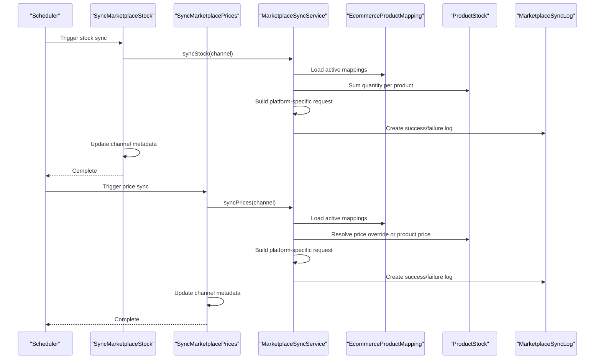
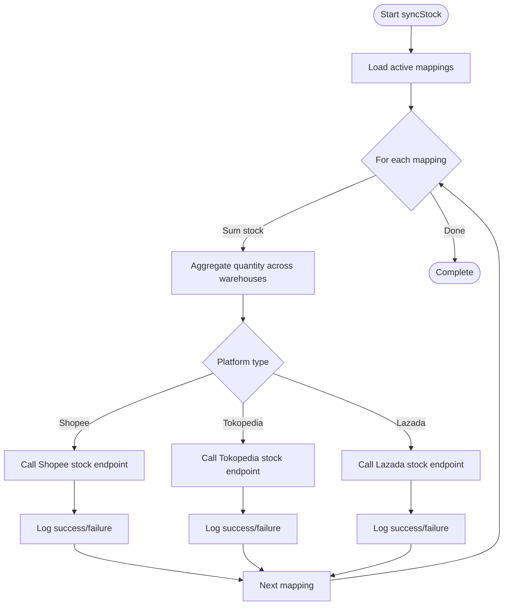
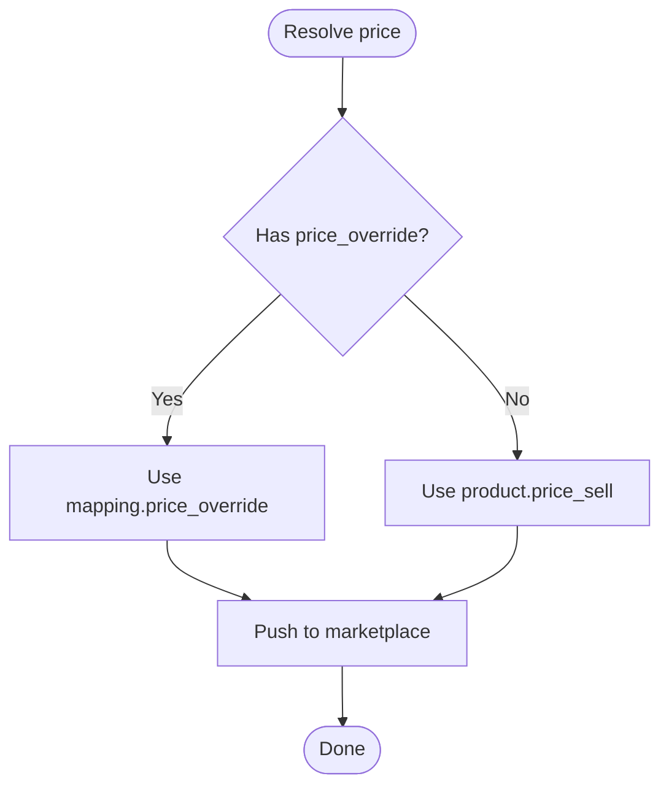
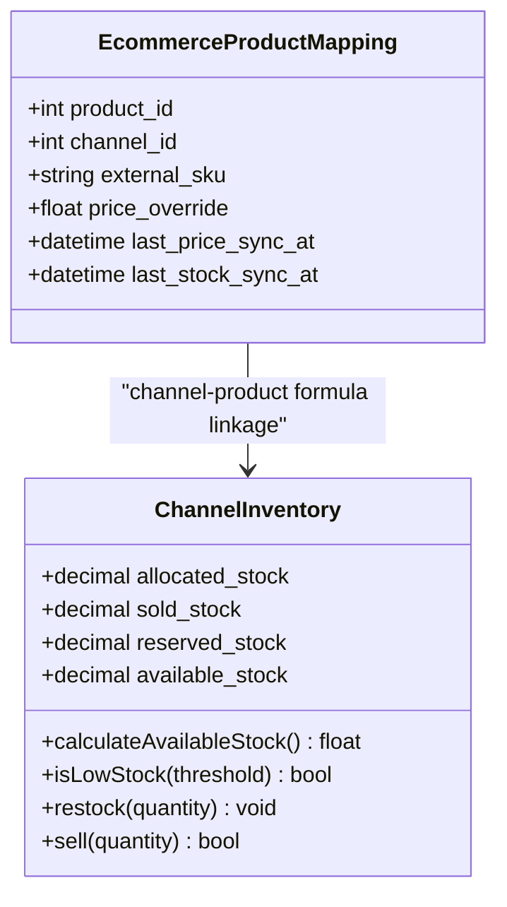
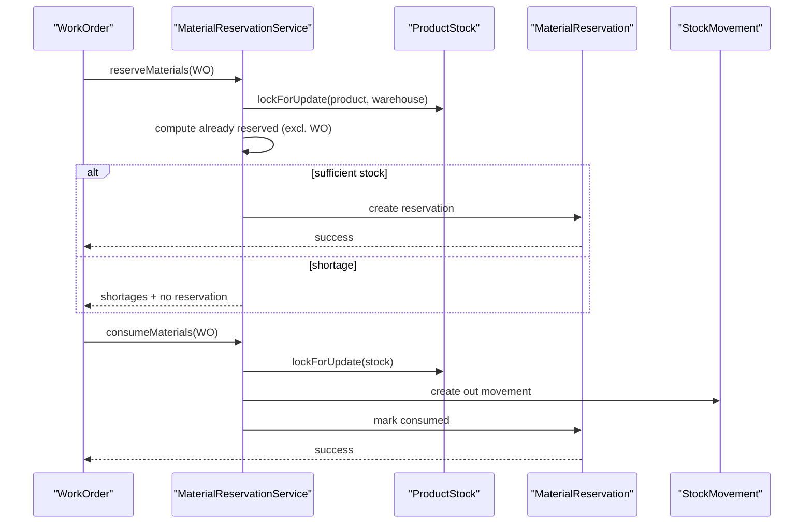
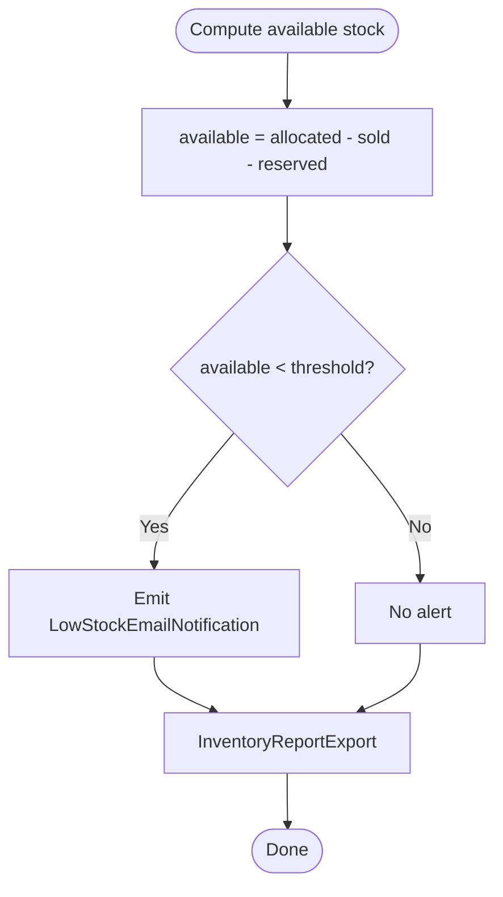
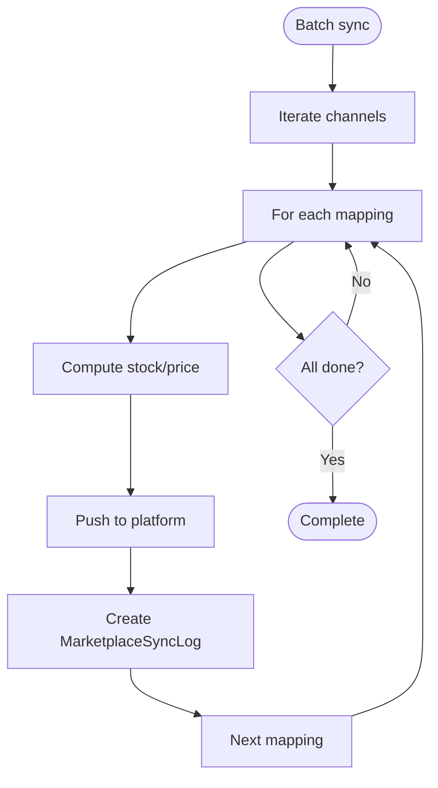
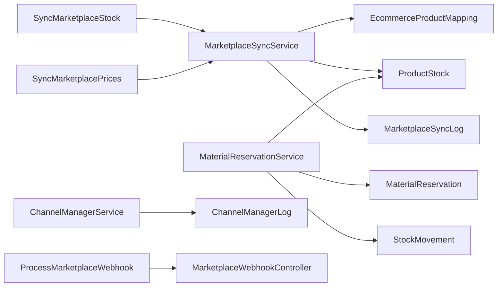

# Inventory Synchronization

<cite>
**Referenced Files in This Document**
- [MarketplaceSyncService.php](file://app/Services/MarketplaceSyncService.php)
- [SyncMarketplaceStock.php](file://app/Jobs/SyncMarketplaceStock.php)
- [SyncMarketplacePrices.php](file://app/Jobs/SyncMarketplacePrices.php)
- [EcommerceProductMapping.php](file://app/Models/EcommerceProductMapping.php)
- [ProductStock.php](file://app/Models/ProductStock.php)
- [ChannelInventory.php](file://app/Models/ChannelInventory.php)
- [VariantInventory.php](file://app/Models/VariantInventory.php)
- [StockMovement.php](file://app/Models/StockMovement.php)
- [MaterialReservationService.php](file://app/Services/MaterialReservationService.php)
- [MaterialReservation.php](file://app/Models/MaterialReservation.php)
- [ChannelManagerService.php](file://app/Services/ChannelManagerService.php)
- [MarketplaceSyncLog.php](file://app/Models/MarketplaceSyncLog.php)
- [ChannelManagerLog.php](file://app/Models/ChannelManagerLog.php)
- [RetryFailedMarketplaceSyncs.php](file://app/Jobs/RetryFailedMarketplaceSyncs.php)
- [ProcessMarketplaceWebhook.php](file://app/Jobs/ProcessMarketplaceWebhook.php)
- [MarketplaceWebhookController.php](file://app/Http/Controllers/MarketplaceWebhookController.php)
- [LowStockEmailNotification.php](file://app/Notifications/LowStockEmailNotification.php)
- [InventoryReportExport.php](file://app/Exports/InventoryReportExport.php)
</cite>

## Table of Contents
1. [Introduction](#introduction)
2. [Project Structure](#project-structure)
3. [Core Components](#core-components)
4. [Architecture Overview](#architecture-overview)
5. [Detailed Component Analysis](#detailed-component-analysis)
6. [Dependency Analysis](#dependency-analysis)
7. [Performance Considerations](#performance-considerations)
8. [Troubleshooting Guide](#troubleshooting-guide)
9. [Conclusion](#conclusion)
10. [Appendices](#appendices)

## Introduction
This document explains the inventory synchronization mechanisms across multiple marketplace platforms and internal channels. It covers real-time stock and price updates, deduplication and allocation strategies, promotional pricing coordination, dynamic pricing integration, stock reservation and backorder handling, low stock alerts, batch synchronization, conflict resolution, data consistency validation, inventory aging and movement tracking, and supply chain visibility. Guidance also includes performance optimization techniques for large catalogs and high-frequency updates.

## Project Structure
The inventory synchronization system spans services, jobs, models, notifications, exports, and webhook processing. Key areas:
- Outbound synchronization to marketplaces (stock and price)
- Internal inventory tracking (product-level stock, variant-level movements, channel-level allocations)
- Material reservation for manufacturing to prevent double allocation
- Channel manager for OTA-style channels (availability/rates)
- Logging and retry mechanisms for resilience
- Alerts and reporting for visibility

```mermaid
graph TB
subgraph "Synchronization Layer"
J1["SyncMarketplaceStock<br/>app/Jobs/SyncMarketplaceStock.php"]
J2["SyncMarketplacePrices<br/>app/Jobs/SyncMarketplacePrices.php"]
S["MarketplaceSyncService<br/>app/Services/MarketplaceSyncService.php"]
M["EcommerceProductMapping<br/>app/Models/EcommerceProductMapping.php"]
PS["ProductStock<br/>app/Models/ProductStock.php"]
end
subgraph "Internal Inventory"
CI["ChannelInventory<br/>app/Models/ChannelInventory.php"]
VI["VariantInventory<br/>app/Models/VariantInventory.php"]
SM["StockMovement<br/>app/Models/StockMovement.php"]
MR["MaterialReservation<br/>app/Models/MaterialReservation.php"]
MRS["MaterialReservationService<br/>app/Services/MaterialReservationService.php"]
end
subgraph "OTA Channels"
CMS["ChannelManagerService<br/>app/Services/ChannelManagerService.php"]
end
subgraph "Observability"
PWS["ProcessMarketplaceWebhook<br/>app/Jobs/ProcessMarketplaceWebhook.php"]
MWHC["MarketplaceWebhookController<br/>app/Http/Controllers/MarketplaceWebhookController.php"]
MSGL["MarketplaceSyncLog<br/>app/Models/MarketplaceSyncLog.php"]
CMGL["ChannelManagerLog<br/>app/Models/ChannelManagerLog.php"]
RFS["RetryFailedMarketplaceSyncs<br/>app/Jobs/RetryFailedMarketplaceSyncs.php"]
LSN["LowStockEmailNotification<br/>app/Notifications/LowStockEmailNotification.php"]
IRE["InventoryReportExport<br/>app/Exports/InventoryReportExport.php"]
end
J1 --> S
J2 --> S
S --> M
S --> PS
S --> MSGL
PWS --> MWHC
CMS --> CMGL
MRS --> MR
MRS --> PS
MRS --> SM
CI --> |"allocation & availability"| CI
VI --> SM
LSN --> |"low stock alerts"| LSN
IRE --> |"aging & movement"| IRE
```

**Diagram sources**
- [MarketplaceSyncService.php:1-439](file://app/Services/MarketplaceSyncService.php#L1-L439)
- [SyncMarketplaceStock.php:1-66](file://app/Jobs/SyncMarketplaceStock.php#L1-L66)
- [SyncMarketplacePrices.php:1-66](file://app/Jobs/SyncMarketplacePrices.php#L1-L66)
- [EcommerceProductMapping.php:1-88](file://app/Models/EcommerceProductMapping.php#L1-L88)
- [ProductStock.php:1-15](file://app/Models/ProductStock.php#L1-L15)
- [ChannelInventory.php:1-81](file://app/Models/ChannelInventory.php#L1-L81)
- [VariantInventory.php:1-72](file://app/Models/VariantInventory.php#L1-L72)
- [StockMovement.php:1-25](file://app/Models/StockMovement.php#L1-L25)
- [MaterialReservationService.php:1-389](file://app/Services/MaterialReservationService.php#L1-L389)
- [MaterialReservation.php:1-54](file://app/Models/MaterialReservation.php#L1-L54)
- [ChannelManagerService.php:1-481](file://app/Services/ChannelManagerService.php#L1-L481)
- [ProcessMarketplaceWebhook.php](file://app/Jobs/ProcessMarketplaceWebhook.php)
- [MarketplaceWebhookController.php](file://app/Http/Controllers/MarketplaceWebhookController.php)
- [MarketplaceSyncLog.php](file://app/Models/MarketplaceSyncLog.php)
- [ChannelManagerLog.php](file://app/Models/ChannelManagerLog.php)
- [RetryFailedMarketplaceSyncs.php](file://app/Jobs/RetryFailedMarketplaceSyncs.php)
- [LowStockEmailNotification.php](file://app/Notifications/LowStockEmailNotification.php)
- [InventoryReportExport.php](file://app/Exports/InventoryReportExport.php)

**Section sources**
- [MarketplaceSyncService.php:1-439](file://app/Services/MarketplaceSyncService.php#L1-L439)
- [SyncMarketplaceStock.php:1-66](file://app/Jobs/SyncMarketplaceStock.php#L1-L66)
- [SyncMarketplacePrices.php:1-66](file://app/Jobs/SyncMarketplacePrices.php#L1-L66)
- [EcommerceProductMapping.php:1-88](file://app/Models/EcommerceProductMapping.php#L1-L88)
- [ProductStock.php:1-15](file://app/Models/ProductStock.php#L1-L15)
- [ChannelInventory.php:1-81](file://app/Models/ChannelInventory.php#L1-L81)
- [VariantInventory.php:1-72](file://app/Models/VariantInventory.php#L1-L72)
- [StockMovement.php:1-25](file://app/Models/StockMovement.php#L1-L25)
- [MaterialReservationService.php:1-389](file://app/Services/MaterialReservationService.php#L1-L389)
- [MaterialReservation.php:1-54](file://app/Models/MaterialReservation.php#L1-L54)
- [ChannelManagerService.php:1-481](file://app/Services/ChannelManagerService.php#L1-L481)
- [ProcessMarketplaceWebhook.php](file://app/Jobs/ProcessMarketplaceWebhook.php)
- [MarketplaceWebhookController.php](file://app/Http/Controllers/MarketplaceWebhookController.php)
- [MarketplaceSyncLog.php](file://app/Models/MarketplaceSyncLog.php)
- [ChannelManagerLog.php](file://app/Models/ChannelManagerLog.php)
- [RetryFailedMarketplaceSyncs.php](file://app/Jobs/RetryFailedMarketplaceSyncs.php)
- [LowStockEmailNotification.php](file://app/Notifications/LowStockEmailNotification.php)
- [InventoryReportExport.php](file://app/Exports/InventoryReportExport.php)

## Core Components
- MarketplaceSyncService: Orchestrates outbound stock and price synchronization to supported platforms (Shopee, Tokopedia, Lazada). It aggregates product-level stock per external SKU, applies price overrides, signs requests, and logs outcomes.
- SyncMarketplaceStock and SyncMarketplacePrices: Queueable jobs that iterate active channels and trigger service methods, updating channel metadata and emitting admin notifications on partial failures.
- EcommerceProductMapping: Links ERP products to external channel SKUs and tracks last sync timestamps and optional price overrides.
- ProductStock: Tracks physical stock per product and warehouse; used to compute aggregated stock for external channels.
- ChannelInventory: Tracks allocated/sold/reserved/available stock per channel-product formula, supports low-stock checks, and restocking.
- VariantInventory and StockMovement: Track variant-level transactions and stock movements for reporting and aging.
- MaterialReservationService and MaterialReservation: Enforce atomic material reservations for work orders, preventing double allocation and race conditions, and recording stock movements.
- ChannelManagerService: Manages OTA channel integrations for availability/rates and stubbed reservation pulls.
- Logs and Retries: MarketplaceSyncLog and ChannelManagerLog capture sync outcomes; RetryFailedMarketplaceSyncs handles transient failures.
- Webhooks: ProcessMarketplaceWebhook and MarketplaceWebhookController process inbound marketplace events.
- Alerts and Reporting: LowStockEmailNotification and InventoryReportExport support low stock alerts and inventory aging/movement reports.

**Section sources**
- [MarketplaceSyncService.php:22-161](file://app/Services/MarketplaceSyncService.php#L22-L161)
- [SyncMarketplaceStock.php:15-66](file://app/Jobs/SyncMarketplaceStock.php#L15-L66)
- [SyncMarketplacePrices.php:15-66](file://app/Jobs/SyncMarketplacePrices.php#L15-L66)
- [EcommerceProductMapping.php:8-88](file://app/Models/EcommerceProductMapping.php#L8-L88)
- [ProductStock.php:8-15](file://app/Models/ProductStock.php#L8-L15)
- [ChannelInventory.php:11-81](file://app/Models/ChannelInventory.php#L11-L81)
- [VariantInventory.php:11-72](file://app/Models/VariantInventory.php#L11-L72)
- [StockMovement.php:10-25](file://app/Models/StockMovement.php#L10-L25)
- [MaterialReservationService.php:24-302](file://app/Services/MaterialReservationService.php#L24-L302)
- [MaterialReservation.php:9-54](file://app/Models/MaterialReservation.php#L9-L54)
- [ChannelManagerService.php:15-481](file://app/Services/ChannelManagerService.php#L15-L481)
- [MarketplaceSyncLog.php](file://app/Models/MarketplaceSyncLog.php)
- [ChannelManagerLog.php](file://app/Models/ChannelManagerLog.php)
- [RetryFailedMarketplaceSyncs.php](file://app/Jobs/RetryFailedMarketplaceSyncs.php)
- [ProcessMarketplaceWebhook.php](file://app/Jobs/ProcessMarketplaceWebhook.php)
- [MarketplaceWebhookController.php](file://app/Http/Controllers/MarketplaceWebhookController.php)
- [LowStockEmailNotification.php](file://app/Notifications/LowStockEmailNotification.php)
- [InventoryReportExport.php](file://app/Exports/InventoryReportExport.php)

## Architecture Overview
The system follows a job-driven architecture:
- Jobs select eligible channels and delegate to a service for platform-specific operations.
- The service computes aggregated stock and price, builds signed requests, and persists logs.
- Internal models track inventory, reservations, and movements for consistency and reporting.
- Webhooks and retries provide bidirectional synchronization and resilience.

**Diagram sources**
- [SyncMarketplaceStock.php:21-63](file://app/Jobs/SyncMarketplaceStock.php#L21-L63)
- [SyncMarketplacePrices.php:21-63](file://app/Jobs/SyncMarketplacePrices.php#L21-L63)
- [MarketplaceSyncService.php:35-161](file://app/Services/MarketplaceSyncService.php#L35-L161)
- [EcommerceProductMapping.php:33-46](file://app/Models/EcommerceProductMapping.php#L33-L46)
- [ProductStock.php:12-13](file://app/Models/ProductStock.php#L12-L13)
- [MarketplaceSyncLog.php](file://app/Models/MarketplaceSyncLog.php)

## Detailed Component Analysis

### Outbound Stock and Price Synchronization
- Stock aggregation: For each channel mapping, the service sums physical stock across warehouses to derive the external quantity.
- Price selection: Uses mapping-level price override if present; otherwise, falls back to product’s sell price.
- Platform adapters: Implement signed requests and payload formats per marketplace, with robust error handling and logging.
- Outcome logging: Creates structured logs with payload, status, and retry hints.

**Diagram sources**
- [MarketplaceSyncService.php:35-93](file://app/Services/MarketplaceSyncService.php#L35-L93)
- [MarketplaceSyncService.php:165-231](file://app/Services/MarketplaceSyncService.php#L165-L231)
- [MarketplaceSyncLog.php](file://app/Models/MarketplaceSyncLog.php)

**Section sources**
- [MarketplaceSyncService.php:35-161](file://app/Services/MarketplaceSyncService.php#L35-L161)
- [SyncMarketplaceStock.php:21-63](file://app/Jobs/SyncMarketplaceStock.php#L21-L63)
- [SyncMarketplacePrices.php:21-63](file://app/Jobs/SyncMarketplacePrices.php#L21-L63)
- [EcommerceProductMapping.php:12-28](file://app/Models/EcommerceProductMapping.php#L12-L28)
- [ProductStock.php:10-13](file://app/Models/ProductStock.php#L10-L13)
- [MarketplaceSyncLog.php](file://app/Models/MarketplaceSyncLog.php)

### Promotional Pricing Coordination and Dynamic Pricing Integration
- Price override precedence: Mapping-level price_override takes priority over product price for marketplace pricing.
- Dynamic pricing: The codebase includes dynamic pricing models and history, enabling future integration with marketplace price updates based on rules and historical trends.

**Diagram sources**
- [MarketplaceSyncService.php:114-123](file://app/Services/MarketplaceSyncService.php#L114-L123)
- [EcommerceProductMapping.php:12-28](file://app/Models/EcommerceProductMapping.php#L12-L28)

**Section sources**
- [MarketplaceSyncService.php:103-161](file://app/Services/MarketplaceSyncService.php#L103-L161)
- [EcommerceProductMapping.php:12-28](file://app/Models/EcommerceProductMapping.php#L12-L28)

### Inventory Deduplication and Allocation Strategies
- Deduplication: EcommerceProductMapping ensures a single ERP product maps to one external SKU per channel, preventing duplicate listings.
- Allocation: ChannelInventory tracks allocated, sold, reserved, and available stock per channel-product formula, with a method to compute available stock and low-stock thresholds.

**Diagram sources**
- [EcommerceProductMapping.php:12-46](file://app/Models/EcommerceProductMapping.php#L12-L46)
- [ChannelInventory.php:15-79](file://app/Models/ChannelInventory.php#L15-L79)

**Section sources**
- [EcommerceProductMapping.php:8-88](file://app/Models/EcommerceProductMapping.php#L8-L88)
- [ChannelInventory.php:34-79](file://app/Models/ChannelInventory.php#L34-L79)

### Stock Reservation Systems and Backorder Handling
- Manufacturing reservations: MaterialReservationService locks stock rows, checks availability excluding other work orders, reserves materials atomically, and records stock movements upon consumption.
- Backorders: If insufficient stock exists for a work order, the service returns shortages; no reservation occurs until stock is replenished.

**Diagram sources**
- [MaterialReservationService.php:34-302](file://app/Services/MaterialReservationService.php#L34-L302)
- [MaterialReservation.php:13-52](file://app/Models/MaterialReservation.php#L13-L52)
- [ProductStock.php:12-13](file://app/Models/ProductStock.php#L12-L13)
- [StockMovement.php:19-23](file://app/Models/StockMovement.php#L19-L23)

**Section sources**
- [MaterialReservationService.php:24-302](file://app/Services/MaterialReservationService.php#L24-L302)
- [MaterialReservation.php:9-54](file://app/Models/MaterialReservation.php#L9-L54)
- [ProductStock.php:8-15](file://app/Models/ProductStock.php#L8-L15)
- [StockMovement.php:10-25](file://app/Models/StockMovement.php#L10-L25)

### Low Stock Alerts and Visibility
- Low stock threshold: ChannelInventory exposes a low-stock check with a configurable threshold.
- Notifications: LowStockEmailNotification can be triggered to inform stakeholders when available stock falls below thresholds.
- Reporting: InventoryReportExport supports generating aging and movement reports for visibility.

**Diagram sources**
- [ChannelInventory.php:42-46](file://app/Models/ChannelInventory.php#L42-L46)
- [LowStockEmailNotification.php](file://app/Notifications/LowStockEmailNotification.php)
- [InventoryReportExport.php](file://app/Exports/InventoryReportExport.php)

**Section sources**
- [ChannelInventory.php:34-79](file://app/Models/ChannelInventory.php#L34-L79)
- [LowStockEmailNotification.php](file://app/Notifications/LowStockEmailNotification.php)
- [InventoryReportExport.php](file://app/Exports/InventoryReportExport.php)

### Batch Synchronization Processes and Conflict Resolution
- Batch processing: Jobs iterate all active channels and process mappings in batches, aggregating results and logging per-item outcomes.
- Conflict resolution: MaterialReservationService uses database row-level locking and transactions to resolve race conditions during reservations and consumption.
- Retry mechanism: RetryFailedMarketplaceSyncs schedules reattempts for failed logs with backoff timing.

**Diagram sources**
- [SyncMarketplaceStock.php:25-63](file://app/Jobs/SyncMarketplaceStock.php#L25-L63)
- [SyncMarketplacePrices.php:25-63](file://app/Jobs/SyncMarketplacePrices.php#L25-L63)
- [MarketplaceSyncService.php:35-161](file://app/Services/MarketplaceSyncService.php#L35-L161)
- [MarketplaceSyncLog.php](file://app/Models/MarketplaceSyncLog.php)
- [RetryFailedMarketplaceSyncs.php](file://app/Jobs/RetryFailedMarketplaceSyncs.php)

**Section sources**
- [SyncMarketplaceStock.php:15-66](file://app/Jobs/SyncMarketplaceStock.php#L15-L66)
- [SyncMarketplacePrices.php:15-66](file://app/Jobs/SyncMarketplacePrices.php#L15-L66)
- [MaterialReservationService.php:43-161](file://app/Services/MaterialReservationService.php#L43-L161)
- [RetryFailedMarketplaceSyncs.php](file://app/Jobs/RetryFailedMarketplaceSyncs.php)

### Data Consistency Validation
- Atomic operations: Stock updates and reservations occur within database transactions and use row-level locks to avoid inconsistent states.
- Logs: MarketplaceSyncLog and ChannelManagerLog capture request/response payloads and statuses for auditing and reconciliation.
- Idempotency: Webhook processing and idempotency helpers exist to prevent duplicate actions on repeated deliveries.

**Section sources**
- [MaterialReservationService.php:43-302](file://app/Services/MaterialReservationService.php#L43-L302)
- [MarketplaceSyncLog.php](file://app/Models/MarketplaceSyncLog.php)
- [ChannelManagerLog.php](file://app/Models/ChannelManagerLog.php)
- [ProcessMarketplaceWebhook.php](file://app/Jobs/ProcessMarketplaceWebhook.php)

### Supply Chain Visibility Features
- Movement tracking: StockMovement records all stock in/out with before/after balances and references.
- Variant-level tracking: VariantInventory captures transaction types and date ranges for detailed tracing.
- Channel-level metrics: ChannelInventory stores allocation and restock dates for supply chain insights.

**Section sources**
- [StockMovement.php:10-25](file://app/Models/StockMovement.php#L10-L25)
- [VariantInventory.php:11-72](file://app/Models/VariantInventory.php#L11-L72)
- [ChannelInventory.php:15-79](file://app/Models/ChannelInventory.php#L15-L79)

## Dependency Analysis

**Diagram sources**
- [SyncMarketplaceStock.php:23-43](file://app/Jobs/SyncMarketplaceStock.php#L23-L43)
- [SyncMarketplacePrices.php:23-43](file://app/Jobs/SyncMarketplacePrices.php#L23-L43)
- [MarketplaceSyncService.php:5-10](file://app/Services/MarketplaceSyncService.php#L5-L10)
- [EcommerceProductMapping.php:33-46](file://app/Models/EcommerceProductMapping.php#L33-L46)
- [ProductStock.php:12-13](file://app/Models/ProductStock.php#L12-L13)
- [MaterialReservationService.php:5-11](file://app/Services/MaterialReservationService.php#L5-L11)
- [MaterialReservation.php:39-52](file://app/Models/MaterialReservation.php#L39-L52)
- [StockMovement.php:19-23](file://app/Models/StockMovement.php#L19-L23)
- [ChannelManagerService.php:5-7](file://app/Services/ChannelManagerService.php#L5-L7)
- [ProcessMarketplaceWebhook.php](file://app/Jobs/ProcessMarketplaceWebhook.php)
- [MarketplaceWebhookController.php](file://app/Http/Controllers/MarketplaceWebhookController.php)

**Section sources**
- [MarketplaceSyncService.php:5-10](file://app/Services/MarketplaceSyncService.php#L5-L10)
- [MaterialReservationService.php:5-11](file://app/Services/MaterialReservationService.php#L5-L11)
- [ChannelManagerService.php:5-7](file://app/Services/ChannelManagerService.php#L5-L7)

## Performance Considerations
- Batch aggregation: Aggregate stock per product per channel to minimize API calls.
- Row-level locking: Use lockForUpdate during reservations/consumption to avoid contention.
- Asynchronous processing: Offload sync to queues with concurrency limits and exponential backoff.
- Idempotent writes: Ensure logs and webhook handlers tolerate duplicates.
- Pagination and chunking: For large catalogs, process mappings in chunks and paginate API responses.
- Caching tokens: Cache access tokens for platforms with short-lived credentials and refresh on expiration.

[No sources needed since this section provides general guidance]

## Troubleshooting Guide
- Partial sync failures: Inspect MarketplaceSyncLog entries for error messages and payload details; use RetryFailedMarketplaceSyncs to reattempt.
- Authentication errors: Verify platform credentials and token validity; the service handles token refresh for some platforms.
- Webhook mismatches: Confirm webhook signatures and idempotency keys; reconcile discrepancies via logs.
- Stock discrepancies: Review StockMovement and MaterialReservation records; confirm warehouse assignments and reservation exclusions.
- Low stock alerts: Validate ChannelInventory thresholds and notification delivery.

**Section sources**
- [MarketplaceSyncLog.php](file://app/Models/MarketplaceSyncLog.php)
- [RetryFailedMarketplaceSyncs.php](file://app/Jobs/RetryFailedMarketplaceSyncs.php)
- [ProcessMarketplaceWebhook.php](file://app/Jobs/ProcessMarketplaceWebhook.php)
- [StockMovement.php:10-25](file://app/Models/StockMovement.php#L10-L25)
- [MaterialReservation.php:13-52](file://app/Models/MaterialReservation.php#L13-L52)
- [ChannelInventory.php:42-46](file://app/Models/ChannelInventory.php#L42-L46)

## Conclusion
The system provides a robust, job-driven inventory synchronization pipeline to multiple marketplaces with strong consistency guarantees, atomic reservations, and comprehensive logging. It supports promotional pricing, dynamic pricing readiness, low stock alerts, movement tracking, and reporting. Extending OTA channel support and webhook-driven reconciliation further enhances supply chain visibility and operational resilience.

[No sources needed since this section summarizes without analyzing specific files]

## Appendices
- API and model references:
  - [MarketplaceSyncService.php:22-439](file://app/Services/MarketplaceSyncService.php#L22-L439)
  - [SyncMarketplaceStock.php:15-66](file://app/Jobs/SyncMarketplaceStock.php#L15-L66)
  - [SyncMarketplacePrices.php:15-66](file://app/Jobs/SyncMarketplacePrices.php#L15-L66)
  - [EcommerceProductMapping.php:8-88](file://app/Models/EcommerceProductMapping.php#L8-L88)
  - [ProductStock.php:8-15](file://app/Models/ProductStock.php#L8-L15)
  - [ChannelInventory.php:11-81](file://app/Models/ChannelInventory.php#L11-L81)
  - [VariantInventory.php:11-72](file://app/Models/VariantInventory.php#L11-L72)
  - [StockMovement.php:10-25](file://app/Models/StockMovement.php#L10-L25)
  - [MaterialReservationService.php:24-389](file://app/Services/MaterialReservationService.php#L24-L389)
  - [MaterialReservation.php:9-54](file://app/Models/MaterialReservation.php#L9-L54)
  - [ChannelManagerService.php:15-481](file://app/Services/ChannelManagerService.php#L15-L481)
  - [MarketplaceSyncLog.php](file://app/Models/MarketplaceSyncLog.php)
  - [ChannelManagerLog.php](file://app/Models/ChannelManagerLog.php)
  - [RetryFailedMarketplaceSyncs.php](file://app/Jobs/RetryFailedMarketplaceSyncs.php)
  - [ProcessMarketplaceWebhook.php](file://app/Jobs/ProcessMarketplaceWebhook.php)
  - [MarketplaceWebhookController.php](file://app/Http/Controllers/MarketplaceWebhookController.php)
  - [LowStockEmailNotification.php](file://app/Notifications/LowStockEmailNotification.php)
  - [InventoryReportExport.php](file://app/Exports/InventoryReportExport.php)