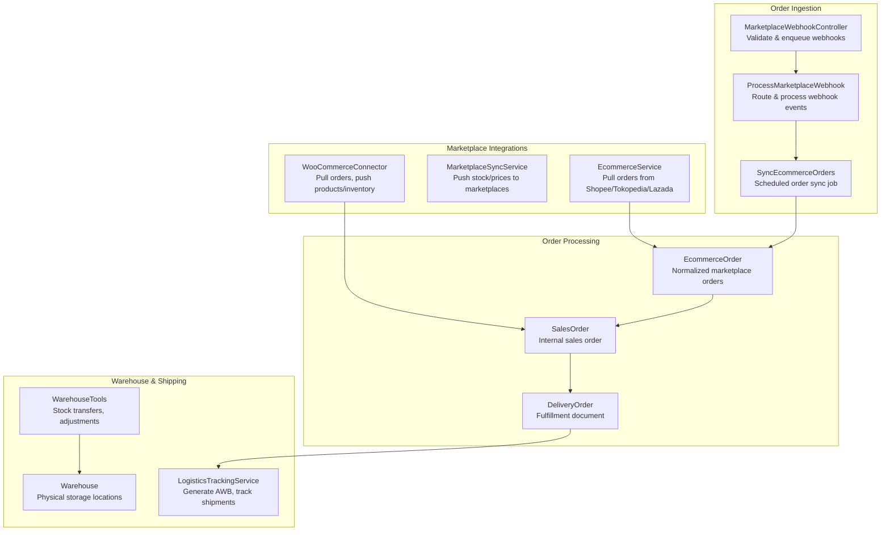
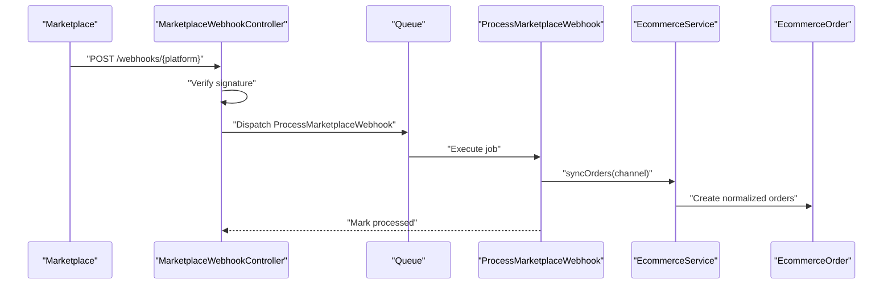
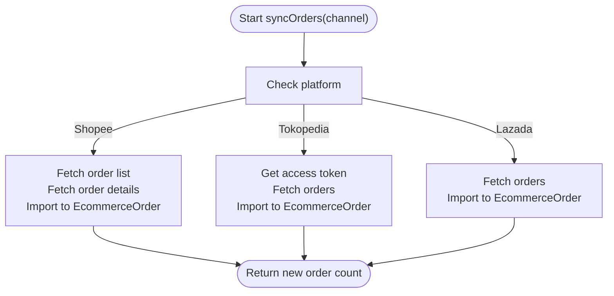
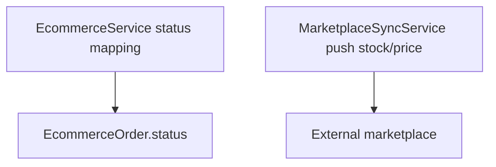
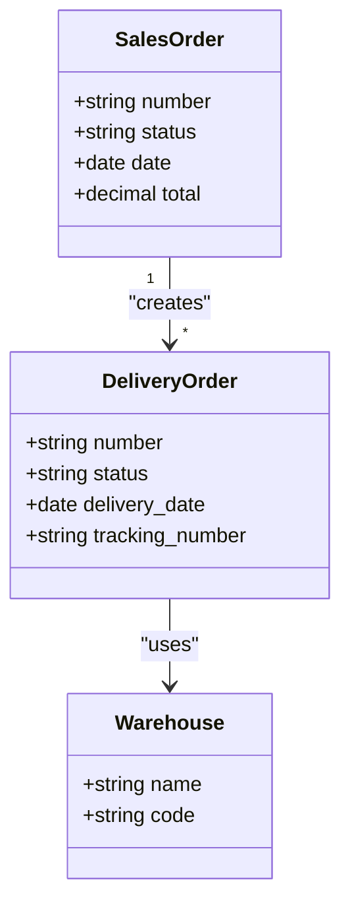
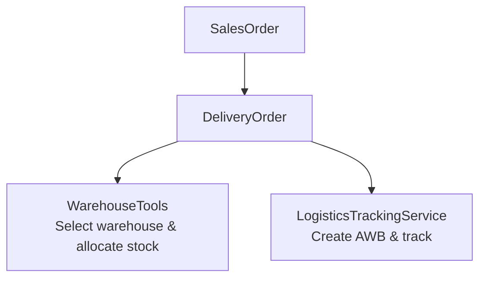
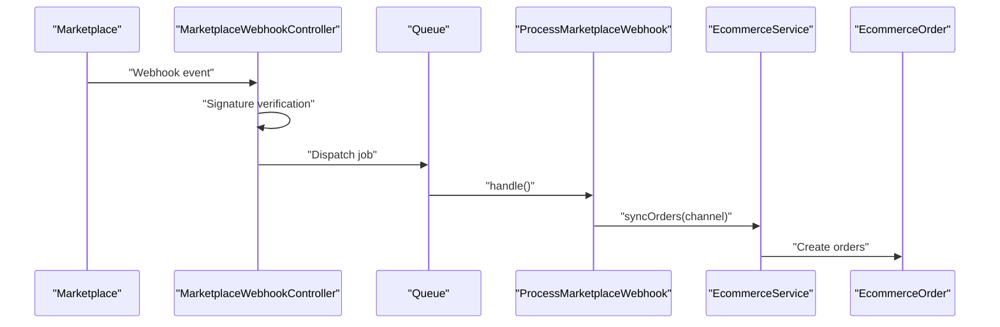
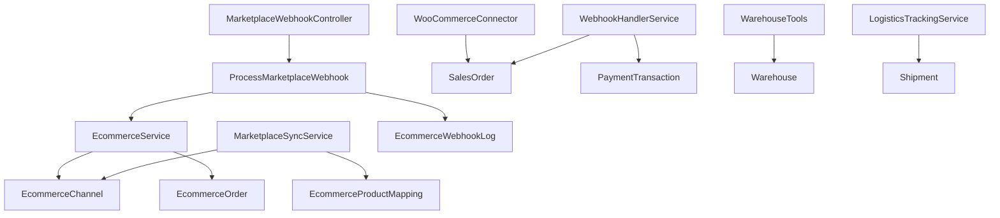

# Order Management

<cite>
**Referenced Files in This Document**
- [EcommerceService.php](file://app/Services/EcommerceService.php)
- [SyncEcommerceOrders.php](file://app/Jobs/SyncEcommerceOrders.php)
- [MarketplaceWebhookController.php](file://app/Http/Controllers/MarketplaceWebhookController.php)
- [ProcessMarketplaceWebhook.php](file://app/Jobs/ProcessMarketplaceWebhook.php)
- [EcommerceChannel.php](file://app/Models/EcommerceChannel.php)
- [EcommerceOrder.php](file://app/Models/EcommerceOrder.php)
- [EcommerceWebhookLog.php](file://app/Models/EcommerceWebhookLog.php)
- [MarketplaceSyncService.php](file://app/Services/MarketplaceSyncService.php)
- [WooCommerceConnector.php](file://app/Services/Integrations/WooCommerceConnector.php)
- [WebhookHandlerService.php](file://app/Services/WebhookHandlerService.php)
- [SalesOrder.php](file://app/Models/SalesOrder.php)
- [DeliveryOrder.php](file://app/Models/DeliveryOrder.php)
- [WarehouseTools.php](file://app/Services/ERP/WarehouseTools.php)
- [Warehouse.php](file://app/Models/Warehouse.php)
- [LogisticsTrackingService.php](file://app/Services/Integrations/LogisticsTrackingService.php)
- [2026_04_06_070000_create_integration_tables.php](file://database/migrations/2026_04_06_070000_create_integration_tables.php)
- [2026_04_08_000013_create_webhook_subscriptions_table.php](file://database/migrations/2026_04_08_000013_create_webhook_subscriptions_table.php)
- [2026_03_26_000006_create_wms_tables.php](file://database/migrations/2026_03_26_000006_create_wms_tables.php)
- [SalesOrderController.php](file://app/Http/Controllers/SalesOrderController.php)
- [MarketplaceSyncTest.php](file://tests/Feature/MarketplaceSyncTest.php)
</cite>

## Table of Contents
1. [Introduction](#introduction)
2. [Project Structure](#project-structure)
3. [Core Components](#core-components)
4. [Architecture Overview](#architecture-overview)
5. [Detailed Component Analysis](#detailed-component-analysis)
6. [Dependency Analysis](#dependency-analysis)
7. [Performance Considerations](#performance-considerations)
8. [Troubleshooting Guide](#troubleshooting-guide)
9. [Conclusion](#conclusion)

## Introduction
This document describes the e-commerce order management workflows in the system, covering automatic order import from marketplace platforms, order status synchronization, fulfillment coordination, and integration with warehouse management and shipping providers. It documents data mapping, field transformations, validation rules, webhook processing for real-time updates, cancellation handling, refunds, order splitting, multi-location fulfillment, shipping label generation, order history tracking, audit trails, and exception handling for failed order imports.

## Project Structure
The order management system spans services, jobs, controllers, models, and migrations that orchestrate marketplace integrations, order ingestion, warehouse operations, and shipping logistics.

**Diagram sources**
- [EcommerceService.php:27-35](file://app/Services/EcommerceService.php#L27-L35)
- [MarketplaceSyncService.php:35-93](file://app/Services/MarketplaceSyncService.php#L35-L93)
- [WooCommerceConnector.php:281-335](file://app/Services/Integrations/WooCommerceConnector.php#L281-L335)
- [MarketplaceWebhookController.php:17-94](file://app/Http/Controllers/MarketplaceWebhookController.php#L17-L94)
- [ProcessMarketplaceWebhook.php:55-60](file://app/Jobs/ProcessMarketplaceWebhook.php#L55-L60)
- [SyncEcommerceOrders.php:27-49](file://app/Jobs/SyncEcommerceOrders.php#L27-L49)
- [EcommerceOrder.php:14-32](file://app/Models/EcommerceOrder.php#L14-L32)
- [SalesOrder.php:17-53](file://app/Models/SalesOrder.php#L17-L53)
- [DeliveryOrder.php:16-20](file://app/Models/DeliveryOrder.php#L16-L20)
- [WarehouseTools.php:165-311](file://app/Services/ERP/WarehouseTools.php#L165-L311)
- [Warehouse.php:15](file://app/Models/Warehouse.php#L15)
- [LogisticsTrackingService.php:15-59](file://app/Services/Integrations/LogisticsTrackingService.php#L15-L59)

**Section sources**
- [EcommerceService.php:27-35](file://app/Services/EcommerceService.php#L27-L35)
- [MarketplaceSyncService.php:35-93](file://app/Services/MarketplaceSyncService.php#L35-L93)
- [WooCommerceConnector.php:281-335](file://app/Services/Integrations/WooCommerceConnector.php#L281-L335)
- [MarketplaceWebhookController.php:17-94](file://app/Http/Controllers/MarketplaceWebhookController.php#L17-L94)
- [ProcessMarketplaceWebhook.php:55-60](file://app/Jobs/ProcessMarketplaceWebhook.php#L55-L60)
- [SyncEcommerceOrders.php:27-49](file://app/Jobs/SyncEcommerceOrders.php#L27-L49)
- [EcommerceOrder.php:14-32](file://app/Models/EcommerceOrder.php#L14-L32)
- [SalesOrder.php:17-53](file://app/Models/SalesOrder.php#L17-L53)
- [DeliveryOrder.php:16-20](file://app/Models/DeliveryOrder.php#L16-L20)
- [WarehouseTools.php:165-311](file://app/Services/ERP/WarehouseTools.php#L165-L311)
- [Warehouse.php:15](file://app/Models/Warehouse.php#L15)
- [LogisticsTrackingService.php:15-59](file://app/Services/Integrations/LogisticsTrackingService.php#L15-L59)

## Core Components
- EcommerceService: Pulls orders from Indonesian marketplaces (Shopee, Tokopedia, Lazada) and normalizes them into EcommerceOrder records.
- MarketplaceSyncService: Pushes stock and price updates from ERP to marketplace channels.
- MarketplaceWebhookController: Validates webhook signatures and enqueues processing jobs.
- ProcessMarketplaceWebhook: Routes webhook events to appropriate handlers (orders, inventory, products).
- SyncEcommerceOrders: Scheduled job to sync orders for all active channels.
- EcommerceChannel: Stores marketplace credentials and sync settings.
- EcommerceOrder: Normalized order entity for marketplace orders.
- SalesOrder: Internal sales order created from marketplace orders.
- DeliveryOrder: Fulfillment document linked to SalesOrder.
- WarehouseTools: Manages inter-warehouse transfers, adjustments, and visibility.
- LogisticsTrackingService: Creates shipping labels and tracks packages.

**Section sources**
- [EcommerceService.php:27-35](file://app/Services/EcommerceService.php#L27-L35)
- [MarketplaceSyncService.php:35-93](file://app/Services/MarketplaceSyncService.php#L35-L93)
- [MarketplaceWebhookController.php:17-94](file://app/Http/Controllers/MarketplaceWebhookController.php#L17-L94)
- [ProcessMarketplaceWebhook.php:55-60](file://app/Jobs/ProcessMarketplaceWebhook.php#L55-L60)
- [SyncEcommerceOrders.php:27-49](file://app/Jobs/SyncEcommerceOrders.php#L27-L49)
- [EcommerceChannel.php:17-45](file://app/Models/EcommerceChannel.php#L17-L45)
- [EcommerceOrder.php:14-32](file://app/Models/EcommerceOrder.php#L14-L32)
- [SalesOrder.php:17-53](file://app/Models/SalesOrder.php#L17-L53)
- [DeliveryOrder.php:16-20](file://app/Models/DeliveryOrder.php#L16-L20)
- [WarehouseTools.php:165-311](file://app/Services/ERP/WarehouseTools.php#L165-L311)
- [LogisticsTrackingService.php:15-59](file://app/Services/Integrations/LogisticsTrackingService.php#L15-L59)

## Architecture Overview
The system integrates external marketplaces via two primary mechanisms:
- Scheduled pull: SyncEcommerceOrders iterates active channels and delegates to EcommerceService to fetch recent orders.
- Real-time push: Webhooks are validated and routed to ProcessMarketplaceWebhook, which triggers immediate order sync.

**Diagram sources**
- [MarketplaceWebhookController.php:17-94](file://app/Http/Controllers/MarketplaceWebhookController.php#L17-L94)
- [ProcessMarketplaceWebhook.php:55-60](file://app/Jobs/ProcessMarketplaceWebhook.php#L55-L60)
- [EcommerceService.php:27-35](file://app/Services/EcommerceService.php#L27-L35)
- [EcommerceOrder.php:14-32](file://app/Models/EcommerceOrder.php#L14-L32)

**Section sources**
- [MarketplaceWebhookController.php:17-94](file://app/Http/Controllers/MarketplaceWebhookController.php#L17-L94)
- [ProcessMarketplaceWebhook.php:55-60](file://app/Jobs/ProcessMarketplaceWebhook.php#L55-L60)
- [EcommerceService.php:27-35](file://app/Services/EcommerceService.php#L27-L35)
- [EcommerceOrder.php:14-32](file://app/Models/EcommerceOrder.php#L14-L32)

## Detailed Component Analysis

### Automatic Order Import from Marketplace Platforms
- Shopee: EcommerceService fetches orders using HMAC-SHA256 signed requests, maps statuses, and imports items with address and tracking data.
- Tokopedia: Uses OAuth2 client credentials to obtain tokens, then pulls orders and maps statuses.
- Lazada: Uses bearer token to fetch orders and map statuses.

**Diagram sources**
- [EcommerceService.php:27-35](file://app/Services/EcommerceService.php#L27-L35)
- [EcommerceService.php:39-107](file://app/Services/EcommerceService.php#L39-L107)
- [EcommerceService.php:176-241](file://app/Services/EcommerceService.php#L176-L241)
- [EcommerceService.php:311-387](file://app/Services/EcommerceService.php#L311-L387)

**Section sources**
- [EcommerceService.php:27-35](file://app/Services/EcommerceService.php#L27-L35)
- [EcommerceService.php:39-107](file://app/Services/EcommerceService.php#L39-L107)
- [EcommerceService.php:176-241](file://app/Services/EcommerceService.php#L176-L241)
- [EcommerceService.php:311-387](file://app/Services/EcommerceService.php#L311-L387)

### Order Status Synchronization
- EcommerceService maps marketplace statuses to internal normalized statuses for each platform.
- MarketplaceSyncService pushes stock and price updates to marketplaces with per-channel authentication and request signing.

**Diagram sources**
- [EcommerceService.php:161-172](file://app/Services/EcommerceService.php#L161-L172)
- [EcommerceService.php:295-307](file://app/Services/EcommerceService.php#L295-L307)
- [EcommerceService.php:390-400](file://app/Services/EcommerceService.php#L390-L400)
- [MarketplaceSyncService.php:35-93](file://app/Services/MarketplaceSyncService.php#L35-L93)

**Section sources**
- [EcommerceService.php:161-172](file://app/Services/EcommerceService.php#L161-L172)
- [EcommerceService.php:295-307](file://app/Services/EcommerceService.php#L295-L307)
- [EcommerceService.php:390-400](file://app/Services/EcommerceService.php#L390-L400)
- [MarketplaceSyncService.php:35-93](file://app/Services/MarketplaceSyncService.php#L35-L93)

### Fulfillment Coordination and Order Splitting
- SalesOrder is created from normalized marketplace orders and linked to customers.
- DeliveryOrder captures fulfillment details including warehouse, courier, and tracking number.
- WarehouseTools supports inter-warehouse transfers and stock adjustments to support split fulfillment across multiple locations.

**Diagram sources**
- [SalesOrder.php:17-53](file://app/Models/SalesOrder.php#L17-L53)
- [DeliveryOrder.php:16-20](file://app/Models/DeliveryOrder.php#L16-L20)
- [Warehouse.php:15](file://app/Models/Warehouse.php#L15)

**Section sources**
- [SalesOrder.php:17-53](file://app/Models/SalesOrder.php#L17-L53)
- [DeliveryOrder.php:16-20](file://app/Models/DeliveryOrder.php#L16-L20)
- [Warehouse.php:15](file://app/Models/Warehouse.php#L15)
- [WarehouseTools.php:165-311](file://app/Services/ERP/WarehouseTools.php#L165-L311)

### Multi-Location Fulfillment and Shipping Label Generation
- WarehouseTools manages stock movements and inter-warehouse transfers.
- LogisticsTrackingService creates AWBs and tracks shipments for supported providers.

**Diagram sources**
- [WarehouseTools.php:165-311](file://app/Services/ERP/WarehouseTools.php#L165-L311)
- [LogisticsTrackingService.php:15-59](file://app/Services/Integrations/LogisticsTrackingService.php#L15-L59)
- [DeliveryOrder.php:16-20](file://app/Models/DeliveryOrder.php#L16-L20)

**Section sources**
- [WarehouseTools.php:165-311](file://app/Services/ERP/WarehouseTools.php#L165-L311)
- [LogisticsTrackingService.php:15-59](file://app/Services/Integrations/LogisticsTrackingService.php#L15-L59)
- [DeliveryOrder.php:16-20](file://app/Models/DeliveryOrder.php#L16-L20)

### Webhook Processing for Real-Time Updates, Cancellations, and Refunds
- MarketplaceWebhookController validates signatures for Shopee and Tokopedia, logs events, and dispatches ProcessMarketplaceWebhook.
- ProcessMarketplaceWebhook routes order, inventory, and product events; order events trigger immediate sync.
- WebhookHandlerService processes payment provider webhooks (Midtrans, Xendit), maps statuses, updates PaymentTransaction and SalesOrder, and performs atomic stock deductions.

**Diagram sources**
- [MarketplaceWebhookController.php:17-94](file://app/Http/Controllers/MarketplaceWebhookController.php#L17-L94)
- [ProcessMarketplaceWebhook.php:55-60](file://app/Jobs/ProcessMarketplaceWebhook.php#L55-L60)
- [EcommerceService.php:27-35](file://app/Services/EcommerceService.php#L27-L35)
- [EcommerceOrder.php:14-32](file://app/Models/EcommerceOrder.php#L14-L32)

**Section sources**
- [MarketplaceWebhookController.php:17-94](file://app/Http/Controllers/MarketplaceWebhookController.php#L17-L94)
- [ProcessMarketplaceWebhook.php:55-60](file://app/Jobs/ProcessMarketplaceWebhook.php#L55-L60)
- [EcommerceService.php:27-35](file://app/Services/EcommerceService.php#L27-L35)
- [EcommerceOrder.php:14-32](file://app/Models/EcommerceOrder.php#L14-L32)

### Order Data Mapping, Field Transformations, and Validation Rules
- EcommerceService transforms marketplace-specific fields into standardized EcommerceOrder attributes (customer info, items, amounts, addresses, couriers, tracking).
- WooCommerceConnector maps WooCommerce order fields to SalesOrder fields and handles status normalization.
- Validation includes signature verification, presence checks for required fields, and error logging with structured sync logs.

**Section sources**
- [EcommerceService.php:109-159](file://app/Services/EcommerceService.php#L109-L159)
- [EcommerceService.php:243-293](file://app/Services/EcommerceService.php#L243-L293)
- [EcommerceService.php:359-382](file://app/Services/EcommerceService.php#L359-L382)
- [WooCommerceConnector.php:357-384](file://app/Services/Integrations/WooCommerceConnector.php#L357-L384)
- [MarketplaceSyncService.php:35-93](file://app/Services/MarketplaceSyncService.php#L35-L93)

### Order History Tracking and Audit Trails
- EcommerceChannel stores sync timestamps and flags for stock/price sync.
- EcommerceWebhookLog captures webhook payloads, signatures, validity, and processing outcomes.
- Audit trails are maintained via model traits and activity logging in related services.

**Section sources**
- [EcommerceChannel.php:17-45](file://app/Models/EcommerceChannel.php#L17-L45)
- [EcommerceWebhookLog.php:12-28](file://app/Models/EcommerceWebhookLog.php#L12-L28)

### Exception Handling for Failed Order Imports
- Jobs and services wrap external API calls with try-catch blocks, logging errors and updating logs.
- SyncEcommerceOrders notifies administrators on failures and records error counts.
- WebhookHandlerService ensures idempotency and retries failed callbacks.

**Section sources**
- [SyncEcommerceOrders.php:73-92](file://app/Jobs/SyncEcommerceOrders.php#L73-L92)
- [WebhookHandlerService.php:401-440](file://app/Services/WebhookHandlerService.php#L401-L440)

## Dependency Analysis
The following diagram highlights key dependencies among order management components.

**Diagram sources**
- [EcommerceService.php:27-35](file://app/Services/EcommerceService.php#L27-L35)
- [EcommerceChannel.php:96-114](file://app/Models/EcommerceChannel.php#L96-L114)
- [EcommerceOrder.php:44-51](file://app/Models/EcommerceOrder.php#L44-L51)
- [MarketplaceSyncService.php:35-93](file://app/Services/MarketplaceSyncService.php#L35-L93)
- [MarketplaceWebhookController.php:17-94](file://app/Http/Controllers/MarketplaceWebhookController.php#L17-L94)
- [ProcessMarketplaceWebhook.php:55-60](file://app/Jobs/ProcessMarketplaceWebhook.php#L55-L60)
- [WooCommerceConnector.php:281-335](file://app/Services/Integrations/WooCommerceConnector.php#L281-L335)
- [WebhookHandlerService.php:89-139](file://app/Services/WebhookHandlerService.php#L89-L139)
- [WarehouseTools.php:165-311](file://app/Services/ERP/WarehouseTools.php#L165-L311)
- [LogisticsTrackingService.php:15-59](file://app/Services/Integrations/LogisticsTrackingService.php#L15-L59)

**Section sources**
- [EcommerceService.php:27-35](file://app/Services/EcommerceService.php#L27-L35)
- [EcommerceChannel.php:96-114](file://app/Models/EcommerceChannel.php#L96-L114)
- [EcommerceOrder.php:44-51](file://app/Models/EcommerceOrder.php#L44-L51)
- [MarketplaceSyncService.php:35-93](file://app/Services/MarketplaceSyncService.php#L35-L93)
- [MarketplaceWebhookController.php:17-94](file://app/Http/Controllers/MarketplaceWebhookController.php#L17-L94)
- [ProcessMarketplaceWebhook.php:55-60](file://app/Jobs/ProcessMarketplaceWebhook.php#L55-L60)
- [WooCommerceConnector.php:281-335](file://app/Services/Integrations/WooCommerceConnector.php#L281-L335)
- [WebhookHandlerService.php:89-139](file://app/Services/WebhookHandlerService.php#L89-L139)
- [WarehouseTools.php:165-311](file://app/Services/ERP/WarehouseTools.php#L165-L311)
- [LogisticsTrackingService.php:15-59](file://app/Services/Integrations/LogisticsTrackingService.php#L15-L59)

## Performance Considerations
- Queue-based processing: Webhooks and order syncs are queued to prevent blocking requests and to batch work efficiently.
- Atomic stock updates: WebhookHandlerService uses row-level locking and conditional updates to avoid race conditions during stock deduction.
- Idempotency: WebhookHandlerService prevents duplicate processing of payment webhooks.
- Retry mechanisms: Failed callbacks can be retried programmatically.

[No sources needed since this section provides general guidance]

## Troubleshooting Guide
Common issues and resolutions:
- Webhook signature verification failures: Validate platform-specific headers and secrets; ensure correct timestamp/signature computation.
- Missing marketplace credentials: Channels require API keys/secrets and access tokens; ensure encryption/decryption works and tokens are refreshed.
- Insufficient stock during payment webhook: The system logs warnings and avoids partial fulfillment; reconcile stock discrepancies.
- Failed order sync jobs: Review logs and error notifications; check external API responses and rate limits.

**Section sources**
- [MarketplaceWebhookController.php:29-35](file://app/Http/Controllers/MarketplaceWebhookController.php#L29-L35)
- [EcommerceChannel.php:49-92](file://app/Models/EcommerceChannel.php#L49-L92)
- [WebhookHandlerService.php:340-396](file://app/Services/WebhookHandlerService.php#L340-L396)
- [SyncEcommerceOrders.php:73-92](file://app/Jobs/SyncEcommerceOrders.php#L73-L92)

## Conclusion
The order management system provides robust, cross-platform order ingestion, real-time webhook processing, and end-to-end fulfillment with warehouse and shipping integrations. It emphasizes data normalization, atomic operations, and auditability to maintain reliability across marketplace and internal workflows.