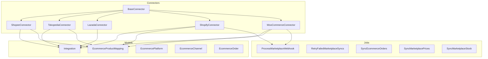
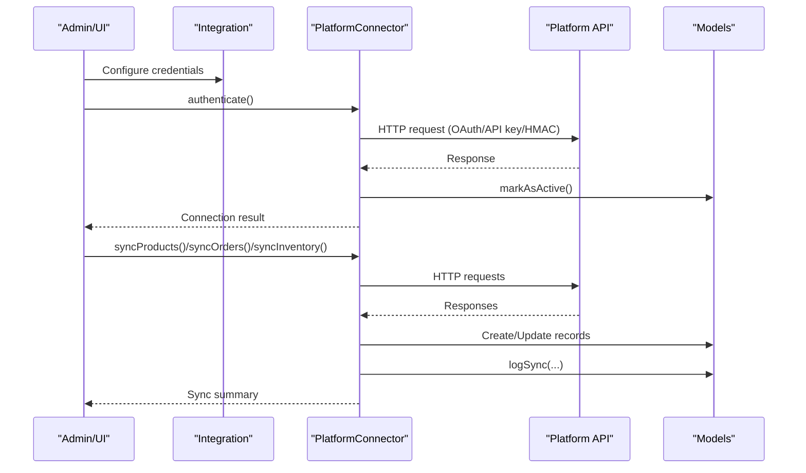
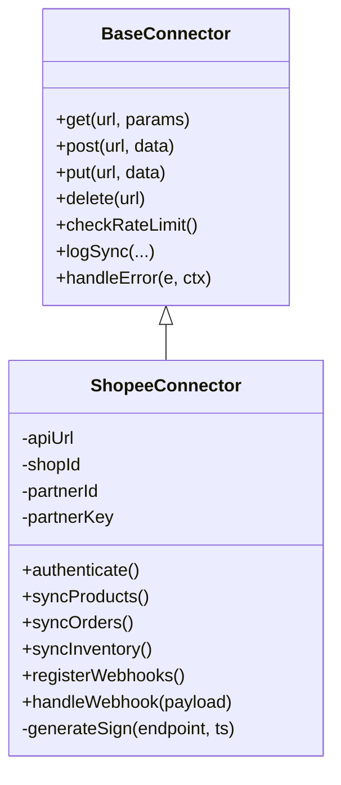
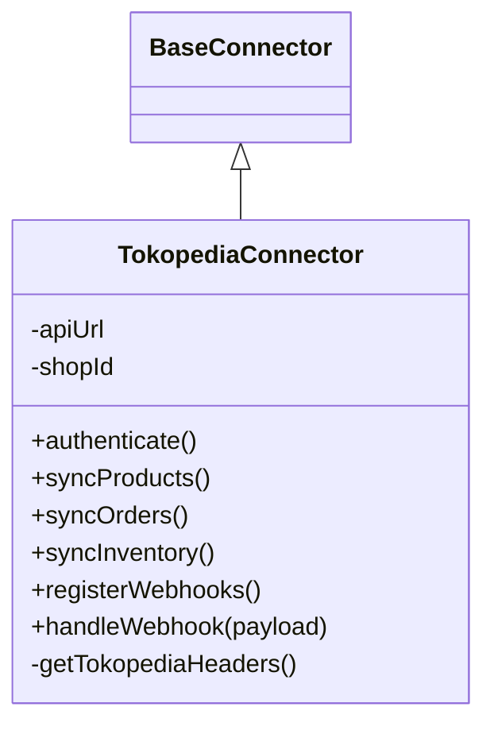
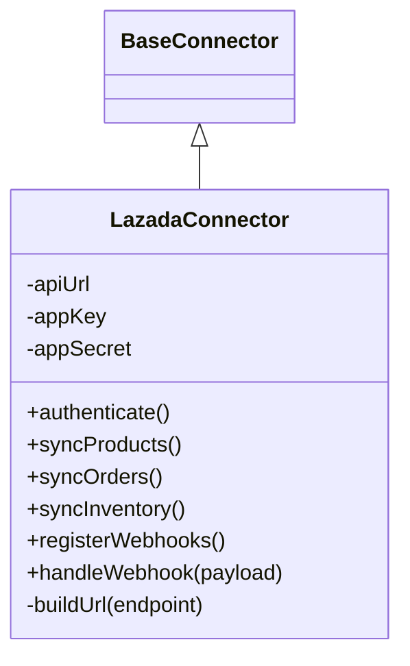
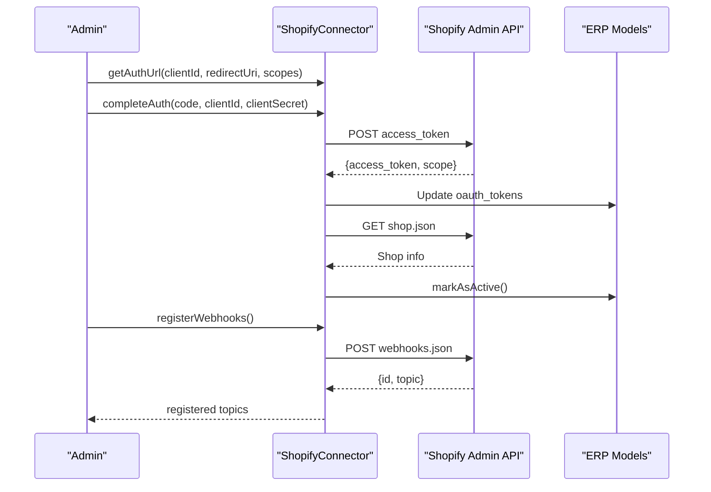
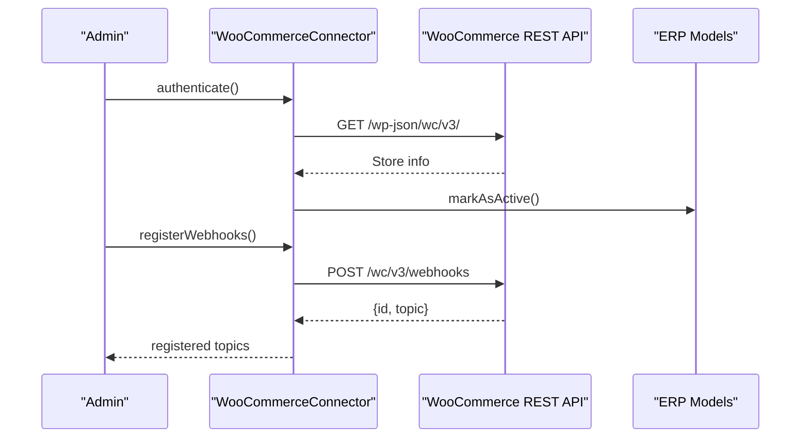
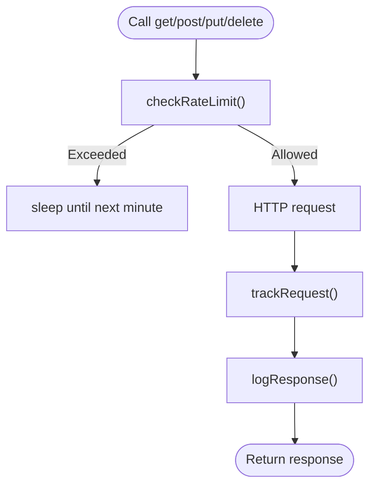
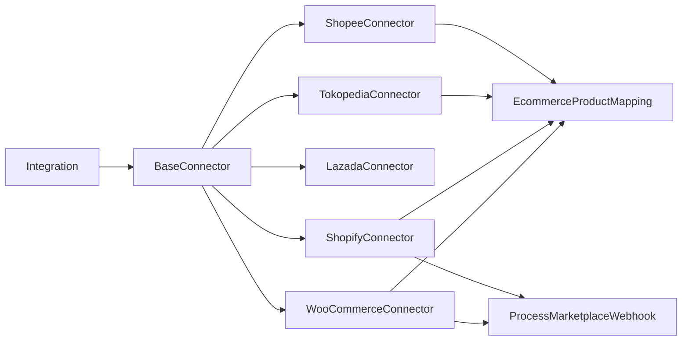

# Platform Connectors

<cite>
**Referenced Files in This Document**
- [BaseConnector.php](file://app/Services/Integrations/BaseConnector.php)
- [ShopeeConnector.php](file://app/Services/Integrations/ShopeeConnector.php)
- [TokopediaConnector.php](file://app/Services/Integrations/TokopediaConnector.php)
- [LazadaConnector.php](file://app/Services/Integrations/LazadaConnector.php)
- [ShopifyConnector.php](file://app/Services/Integrations/ShopifyConnector.php)
- [WooCommerceConnector.php](file://app/Services/Integrations/WooCommerceConnector.php)
- [Integration.php](file://app/Models/Integration.php)
- [EcommerceProductMapping.php](file://app/Models/EcommerceProductMapping.php)
- [EcommercePlatform.php](file://app/Models/EcommercePlatform.php)
- [EcommerceChannel.php](file://app/Models/EcommerceChannel.php)
- [EcommerceOrder.php](file://app/Models/EcommerceOrder.php)
- [ProcessMarketplaceWebhook.php](file://app/Jobs/ProcessMarketplaceWebhook.php)
- [RetryFailedMarketplaceSyncs.php](file://app/Jobs/RetryFailedMarketplaceSyncs.php)
- [SyncEcommerceOrders.php](file://app/Jobs/SyncEcommerceOrders.php)
- [SyncMarketplacePrices.php](file://app/Jobs/SyncMarketplacePrices.php)
- [SyncMarketplaceStock.php](file://app/Jobs/SyncMarketplaceStock.php)
- [MarketplaceSyncLog.php](file://app/Models/MarketplaceSyncLog.php)
</cite>

## Table of Contents
1. [Introduction](#introduction)
2. [Project Structure](#project-structure)
3. [Core Components](#core-components)
4. [Architecture Overview](#architecture-overview)
5. [Detailed Component Analysis](#detailed-component-analysis)
6. [Dependency Analysis](#dependency-analysis)
7. [Performance Considerations](#performance-considerations)
8. [Troubleshooting Guide](#troubleshooting-guide)
9. [Conclusion](#conclusion)

## Introduction
This document explains the platform connector architecture for major e-commerce platforms integrated in the system: Shopee, Tokopedia, Lazada, Shopify, and WooCommerce. It covers authentication mechanisms, API rate limiting, token management, request/response handling, error codes and retry logic, platform-specific features (order status mapping, product attributes, shipping), webhook registration and processing, configuration examples, troubleshooting, and performance optimization.

## Project Structure
The connector implementations are organized under a shared base class and platform-specific subclasses. Data models support integration configuration, product mappings, and synchronization logs. Background jobs orchestrate asynchronous sync and webhook processing.

**Diagram sources**
- [BaseConnector.php:18-370](file://app/Services/Integrations/BaseConnector.php#L18-L370)
- [ShopeeConnector.php:16-393](file://app/Services/Integrations/ShopeeConnector.php#L16-L393)
- [TokopediaConnector.php:16-406](file://app/Services/Integrations/TokopediaConnector.php#L16-L406)
- [LazadaConnector.php:15-197](file://app/Services/Integrations/LazadaConnector.php#L15-L197)
- [ShopifyConnector.php:17-637](file://app/Services/Integrations/ShopifyConnector.php#L17-L637)
- [WooCommerceConnector.php:17-583](file://app/Services/Integrations/WooCommerceConnector.php#L17-L583)
- [Integration.php:9-175](file://app/Models/Integration.php#L9-L175)
- [EcommerceProductMapping.php:8-88](file://app/Models/EcommerceProductMapping.php#L8-L88)
- [ProcessMarketplaceWebhook.php](file://app/Jobs/ProcessMarketplaceWebhook.php)
- [RetryFailedMarketplaceSyncs.php](file://app/Jobs/RetryFailedMarketplaceSyncs.php)
- [SyncEcommerceOrders.php](file://app/Jobs/SyncEcommerceOrders.php)
- [SyncMarketplacePrices.php](file://app/Jobs/SyncMarketplacePrices.php)
- [SyncMarketplaceStock.php](file://app/Jobs/SyncMarketplaceStock.php)

**Section sources**
- [BaseConnector.php:18-370](file://app/Services/Integrations/BaseConnector.php#L18-L370)
- [Integration.php:9-175](file://app/Models/Integration.php#L9-L175)
- [EcommerceProductMapping.php:8-88](file://app/Models/EcommerceProductMapping.php#L8-L88)

## Core Components
- BaseConnector: Defines the common HTTP client, rate limiting, retries, logging, and abstract contract for all platform connectors. Provides helpers for product/order transformation and mapping retrieval.
- Platform Connectors: Implement platform-specific authentication, endpoints, signatures, headers, and data transformations.
- Models: Integration stores credentials and OAuth tokens; EcommerceProductMapping tracks ERP ↔ marketplace IDs; EcommercePlatform/Channel describe platform metadata; EcommerceOrder holds normalized order data.
- Jobs: Asynchronous processing for webhooks and retries; dedicated jobs for orders/prices/stock sync.

Key capabilities:
- Authentication: OAuth 2.0 (Shopify, WooCommerce via API keys/secrets), HMAC signing (Shopee), bearer tokens (Tokopedia), and direct API keys (Lazada).
- Rate limiting: Per-minute request throttling with sleep on limit.
- Retry logic: Configurable attempts with millisecond delays.
- Webhooks: Registration and handler dispatch per platform; signature verification for Shopify and WooCommerce.
- Logging: Structured logs for API calls and sync outcomes.

**Section sources**
- [BaseConnector.php:18-370](file://app/Services/Integrations/BaseConnector.php#L18-L370)
- [Integration.php:9-175](file://app/Models/Integration.php#L9-L175)
- [EcommerceProductMapping.php:8-88](file://app/Models/EcommerceProductMapping.php#L8-L88)

## Architecture Overview
The connectors extend a base class that encapsulates HTTP transport, rate limiting, and logging. Each platform subclass implements authentication, endpoint construction, and data transformation. Background jobs coordinate periodic syncs and webhook processing.

**Diagram sources**
- [BaseConnector.php:18-370](file://app/Services/Integrations/BaseConnector.php#L18-L370)
- [Integration.php:9-175](file://app/Models/Integration.php#L9-L175)
- [ShopeeConnector.php:73-96](file://app/Services/Integrations/ShopeeConnector.php#L73-L96)
- [TokopediaConnector.php:64-83](file://app/Services/Integrations/TokopediaConnector.php#L64-L83)
- [LazadaConnector.php:29-43](file://app/Services/Integrations/LazadaConnector.php#L29-L43)
- [ShopifyConnector.php:74-100](file://app/Services/Integrations/ShopifyConnector.php#L74-L100)
- [WooCommerceConnector.php:61-87](file://app/Services/Integrations/WooCommerceConnector.php#L61-L87)

## Detailed Component Analysis

### Shopee Connector
- Authentication: Uses HMAC-SHA256 signature built from partner_id, endpoint, and timestamp; includes shop_id and partner_id in URL query.
- API: Base URL for Shopee Open Platform; endpoints for shop info, product CRUD, order retrieval, and stock updates.
- Data mapping:
  - Product: Transforms price to smallest currency unit, weight to kg, condition/status flags.
  - Order: Maps order_sn to external_id, amount normalization, payment/pending statuses.
- Rate limiting: Enforced via BaseConnector’s per-minute counter and sleep.
- Webhooks: Placeholder registration and handler present.
- Token management: No OAuth; relies on partner credentials.

**Diagram sources**
- [BaseConnector.php:18-370](file://app/Services/Integrations/BaseConnector.php#L18-L370)
- [ShopeeConnector.php:16-393](file://app/Services/Integrations/ShopeeConnector.php#L16-L393)

**Section sources**
- [ShopeeConnector.php:16-393](file://app/Services/Integrations/ShopeeConnector.php#L16-L393)

### Tokopedia Connector
- Authentication: Bearer token via Authorization header; Shop-Id header required.
- API: Base URL for Tokopedia Open API; product CRUD, orders retrieval, stock updates.
- Data mapping:
  - Product: Category, price, weight in grams, condition, min order.
  - Order: Buyer info mapping, total amounts, paid status.
- Rate limiting: Enforced via BaseConnector’s per-minute counter and sleep.
- Webhooks: Placeholder registration and handler present.

**Diagram sources**
- [BaseConnector.php:18-370](file://app/Services/Integrations/BaseConnector.php#L18-L370)
- [TokopediaConnector.php:16-406](file://app/Services/Integrations/TokopediaConnector.php#L16-L406)

**Section sources**
- [TokopediaConnector.php:16-406](file://app/Services/Integrations/TokopediaConnector.php#L16-L406)

### Lazada Connector
- Authentication: Direct API calls with app_key/app_secret; basic endpoint validation.
- API: Base URL for Lazada Open Platform; product create/update, orders retrieval.
- Data mapping:
  - Product: Attributes include category, SKUs with price/quantity, brand, name/description.
- Rate limiting: Enforced via BaseConnector’s per-minute counter and sleep.
- Webhooks: Placeholder registration and handler present.

**Diagram sources**
- [BaseConnector.php:18-370](file://app/Services/Integrations/BaseConnector.php#L18-L370)
- [LazadaConnector.php:15-197](file://app/Services/Integrations/LazadaConnector.php#L15-L197)

**Section sources**
- [LazadaConnector.php:15-197](file://app/Services/Integrations/LazadaConnector.php#L15-L197)

### Shopify Connector
- Authentication: OAuth 2.0 with X-Shopify-Access-Token header; optional authorize/completion endpoints.
- API: Admin REST API v2024-01; products/orders/inventory endpoints; webhook registration.
- Data mapping:
  - Product: Variants with SKU, price, inventory policy; tags, vendor, type.
  - Order: Customer creation, financial status mapping to internal status, taxes/shipping totals.
- Webhooks: Registers topics for orders/products; verifies HMAC-SHA256 signature using webhook secret.
- Token management: Stores access_token; tokens do not expire in this implementation.

**Diagram sources**
- [ShopifyConnector.php:74-154](file://app/Services/Integrations/ShopifyConnector.php#L74-L154)
- [ShopifyConnector.php:547-592](file://app/Services/Integrations/ShopifyConnector.php#L547-L592)

**Section sources**
- [ShopifyConnector.php:17-637](file://app/Services/Integrations/ShopifyConnector.php#L17-L637)

### WooCommerce Connector
- Authentication: OAuth 1.0a-style via consumer_key/consumer_secret appended as query parameters.
- API: REST API v3; product CRUD, orders retrieval, inventory updates, webhook registration.
- Data mapping:
  - Product: Categories, images, manage_stock, stock_quantity, stock_status, publish/draft status.
  - Order: Billing address mapping, tax/shipping totals, payment method as status indicator.
- Webhooks: Registers topics for order/product events; verifies HMAC-SHA256 signature using webhook secret.
- Token management: Stores consumer credentials; no OAuth refresh flow.

**Diagram sources**
- [WooCommerceConnector.php:61-87](file://app/Services/Integrations/WooCommerceConnector.php#L61-L87)
- [WooCommerceConnector.php:497-520](file://app/Services/Integrations/WooCommerceConnector.php#L497-L520)

**Section sources**
- [WooCommerceConnector.php:17-583](file://app/Services/Integrations/WooCommerceConnector.php#L17-L583)

### Shared BaseConnector Behavior
- HTTP client: Default JSON headers, timeout, retry configuration.
- Rate limiting: Tracks requests per minute and sleeps until next window.
- Logging: Logs API calls and sync outcomes; structured error handling.
- Transformation hooks: Overridable methods for product/order mapping.
- Mapping helpers: Retrieve external IDs and vice versa via EcommerceProductMapping.

**Diagram sources**
- [BaseConnector.php:180-215](file://app/Services/Integrations/BaseConnector.php#L180-L215)

**Section sources**
- [BaseConnector.php:18-370](file://app/Services/Integrations/BaseConnector.php#L18-L370)

## Dependency Analysis
- Integration model stores platform configuration and OAuth tokens; exposes helpers for decryption and connector class resolution.
- EcommerceProductMapping maintains bidirectional IDs between ERP and marketplace.
- Jobs coordinate async operations for webhooks and retries; dedicated jobs exist for orders/prices/stock.

**Diagram sources**
- [Integration.php:9-175](file://app/Models/Integration.php#L9-L175)
- [EcommerceProductMapping.php:8-88](file://app/Models/EcommerceProductMapping.php#L8-L88)
- [ProcessMarketplaceWebhook.php](file://app/Jobs/ProcessMarketplaceWebhook.php)

**Section sources**
- [Integration.php:9-175](file://app/Models/Integration.php#L9-L175)
- [EcommerceProductMapping.php:8-88](file://app/Models/EcommerceProductMapping.php#L8-L88)

## Performance Considerations
- Rate limiting: Use BaseConnector’s per-minute throttle to avoid platform throttling. For high-volume environments, consider batching and staggered polling.
- Retries: Tune maxRetries and retryDelay based on platform SLAs. Monitor logs for transient failures.
- Async processing: Prefer jobs for long-running syncs (orders/prices/stock) to prevent timeouts.
- Payload shaping: Minimize unnecessary transformations; leverage platform-native fields to reduce overhead.
- Caching: Cache product/category lists where supported to reduce repeated lookups.

[No sources needed since this section provides general guidance]

## Troubleshooting Guide
Common issues and remedies:
- Authentication failures
  - Shopify: Verify access token and scopes; ensure X-Shopify-Access-Token header is set.
  - WooCommerce: Confirm consumer_key/consumer_secret correctness; ensure query parameters are attached to URLs.
  - Shopee: Validate partner_id/partner_key/signature generation; confirm timestamp freshness.
  - Tokopedia: Ensure Authorization Bearer token and Shop-Id header are present.
  - Lazada: Confirm app_key/app_secret and endpoint availability.
- Webhook verification failures
  - Shopify: Compute HMAC-SHA256 using webhook secret and compare signatures.
  - WooCommerce: Compute HMAC-SHA256 using webhook secret and compare signatures.
- Sync errors
  - Review IntegrationSyncLog entries for detailed error messages and timestamps.
  - Use RetryFailedMarketplaceSyncs job to reattempt failed operations.
- Mapping mismatches
  - Validate EcommerceProductMapping entries for correct external_id and SKU alignment.
- Order duplication
  - Check external_id uniqueness before creating SalesOrder records.

**Section sources**
- [ShopifyConnector.php:629-635](file://app/Services/Integrations/ShopifyConnector.php#L629-L635)
- [WooCommerceConnector.php:575-581](file://app/Services/Integrations/WooCommerceConnector.php#L575-L581)
- [MarketplaceSyncLog.php](file://app/Models/MarketplaceSyncLog.php)

## Conclusion
The connector architecture centralizes HTTP handling, rate limiting, and logging while enabling platform-specific implementations. Each connector adheres to a consistent contract for authentication, sync operations, and webhook processing. Robust error handling, mapping utilities, and background jobs support reliable, scalable integrations across Shopee, Tokopedia, Lazada, Shopify, and WooCommerce.