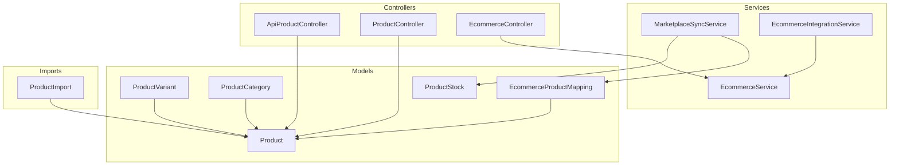
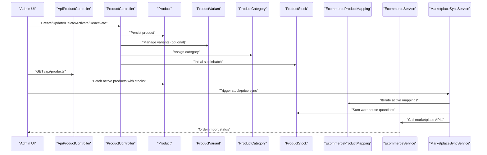
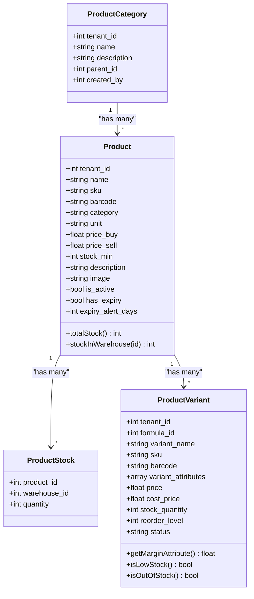
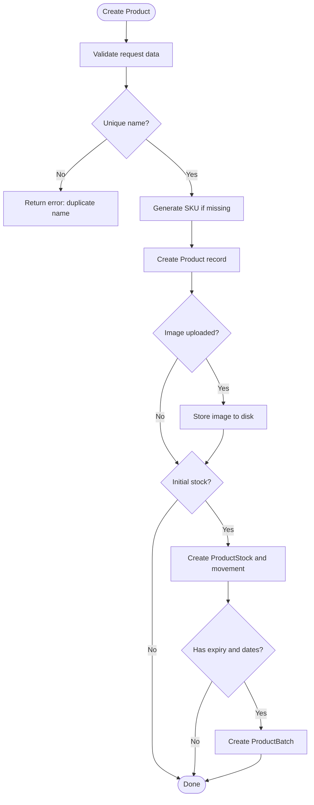
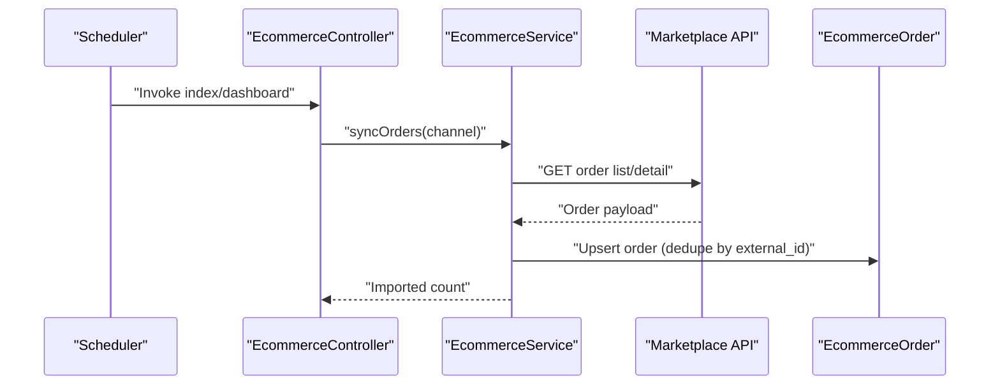
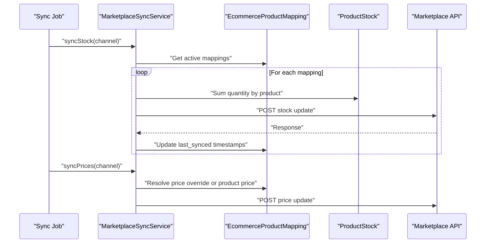
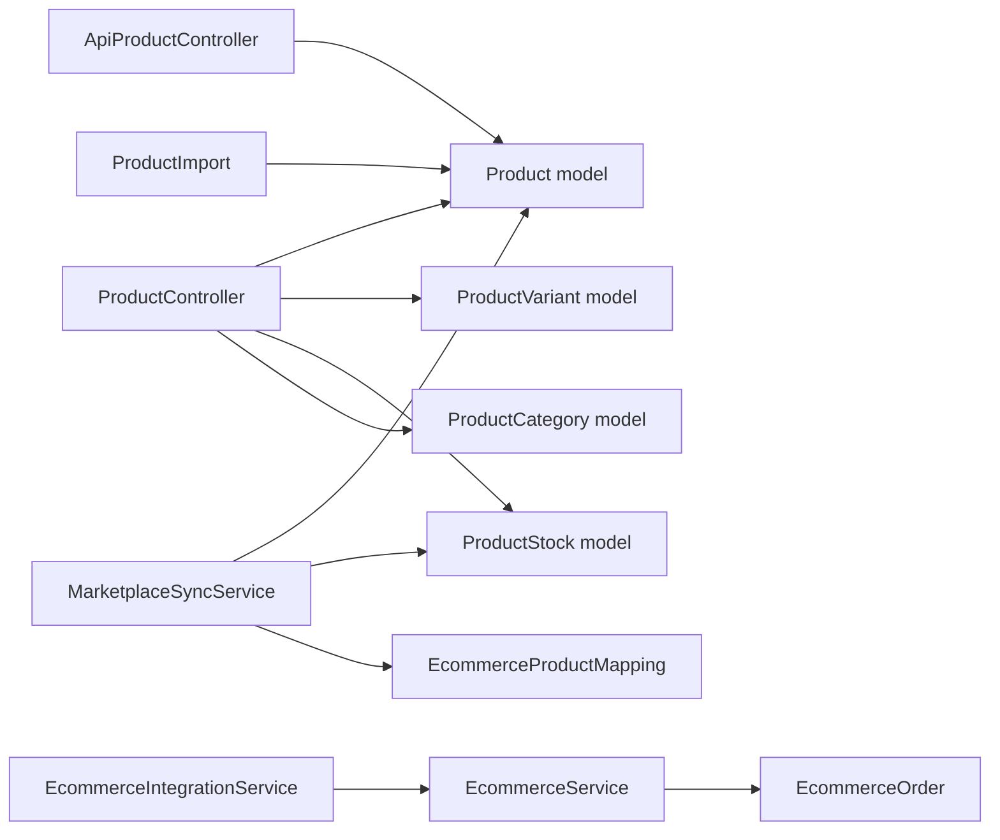

# Product Catalog Management

<cite>
**Referenced Files in This Document**
- [Product.php](file://app/Models/Product.php)
- [ProductVariant.php](file://app/Models/ProductVariant.php)
- [ProductCategory.php](file://app/Models/ProductCategory.php)
- [ProductStock.php](file://app/Models/ProductStock.php)
- [EcommerceProductMapping.php](file://app/Models/EcommerceProductMapping.php)
- [EcommerceService.php](file://app/Services/EcommerceService.php)
- [MarketplaceSyncService.php](file://app/Services/MarketplaceSyncService.php)
- [EcommerceIntegrationService.php](file://app/Services/Integrations/EcommerceIntegrationService.php)
- [ProductImport.php](file://app/Imports/ProductImport.php)
- [ProductController.php](file://app/Http/Controllers/ProductController.php)
- [ApiProductController.php](file://app/Http/Controllers/Api/ProductController.php)
- [EcommerceController.php](file://app/Http/Controllers/EcommerceController.php)
</cite>

## Table of Contents
1. [Introduction](#introduction)
2. [Project Structure](#project-structure)
3. [Core Components](#core-components)
4. [Architecture Overview](#architecture-overview)
5. [Detailed Component Analysis](#detailed-component-analysis)
6. [Dependency Analysis](#dependency-analysis)
7. [Performance Considerations](#performance-considerations)
8. [Troubleshooting Guide](#troubleshooting-guide)
9. [Conclusion](#conclusion)
10. [Appendices](#appendices)

## Introduction
This document describes the product catalog management capabilities within the e-commerce-enabled ERP. It covers product data modeling, attribute standardization, category synchronization, creation and lifecycle workflows, variant management, outbound marketplace synchronization (stock and price), inbound order ingestion from marketplaces, bulk import/export patterns, and error handling. It also outlines deactivation, retirement, and reactivation procedures, along with search and SEO metadata considerations.

## Project Structure
The product catalog spans models, controllers, services, imports, and jobs that orchestrate inbound/outbound integrations with marketplace APIs.

**Diagram sources**
- [Product.php:12-70](file://app/Models/Product.php#L12-L70)
- [ProductVariant.php:13-175](file://app/Models/ProductVariant.php#L13-L175)
- [ProductCategory.php:10-47](file://app/Models/ProductCategory.php#L10-L47)
- [ProductStock.php:8-14](file://app/Models/ProductStock.php#L8-L14)
- [EcommerceProductMapping.php:8-87](file://app/Models/EcommerceProductMapping.php#L8-L87)
- [ApiProductController.php:9-29](file://app/Http/Controllers/Api/ApiProductController.php#L9-L29)
- [ProductController.php:14-304](file://app/Http/Controllers/ProductController.php#L14-L304)
- [EcommerceController.php:15-39](file://app/Http/Controllers/EcommerceController.php#L15-L39)
- [EcommerceService.php:21-401](file://app/Services/EcommerceService.php#L21-L401)
- [MarketplaceSyncService.php:22-438](file://app/Services/MarketplaceSyncService.php#L22-L438)
- [EcommerceIntegrationService.php:10-251](file://app/Services/Integrations/EcommerceIntegrationService.php#L10-L251)
- [ProductImport.php:18-170](file://app/Imports/ProductImport.php#L18-L170)

**Section sources**
- [Product.php:12-70](file://app/Models/Product.php#L12-L70)
- [ProductVariant.php:13-175](file://app/Models/ProductVariant.php#L13-L175)
- [ProductCategory.php:10-47](file://app/Models/ProductCategory.php#L10-L47)
- [ProductStock.php:8-14](file://app/Models/ProductStock.php#L8-L14)
- [EcommerceProductMapping.php:8-87](file://app/Models/EcommerceProductMapping.php#L8-L87)
- [ApiProductController.php:9-29](file://app/Http/Controllers/Api/ApiProductController.php#L9-L29)
- [ProductController.php:14-304](file://app/Http/Controllers/ProductController.php#L14-L304)
- [EcommerceController.php:15-39](file://app/Http/Controllers/EcommerceController.php#L15-L39)
- [EcommerceService.php:21-401](file://app/Services/EcommerceService.php#L21-L401)
- [MarketplaceSyncService.php:22-438](file://app/Services/MarketplaceSyncService.php#L22-L438)
- [EcommerceIntegrationService.php:10-251](file://app/Services/Integrations/EcommerceIntegrationService.php#L10-L251)
- [ProductImport.php:18-170](file://app/Imports/ProductImport.php#L18-L170)

## Core Components
- Product model defines core product fields, casting, tenant scoping, and stock helpers.
- ProductVariant supports variant attributes, pricing, stock transactions, and status labels.
- ProductCategory supports hierarchical categories and product relations.
- ProductStock tracks quantities per warehouse.
- EcommerceProductMapping links internal products to external marketplace identifiers.
- EcommerceService ingests orders from supported marketplaces and normalizes them.
- MarketplaceSyncService pushes stock and price updates to marketplaces.
- EcommerceIntegrationService handles broader platform integrations (Shopify, WooCommerce, Tokopedia).
- ProductImport enables bulk product creation/update from Excel with validation and normalization.
- ProductController exposes CRUD and bulk actions with activity logging and webhook dispatch.
- ApiProductController provides paginated product listings with stock details.

**Section sources**
- [Product.php:12-70](file://app/Models/Product.php#L12-L70)
- [ProductVariant.php:13-175](file://app/Models/ProductVariant.php#L13-L175)
- [ProductCategory.php:10-47](file://app/Models/ProductCategory.php#L10-L47)
- [ProductStock.php:8-14](file://app/Models/ProductStock.php#L8-L14)
- [EcommerceProductMapping.php:8-87](file://app/Models/EcommerceProductMapping.php#L8-L87)
- [EcommerceService.php:21-401](file://app/Services/EcommerceService.php#L21-L401)
- [MarketplaceSyncService.php:22-438](file://app/Services/MarketplaceSyncService.php#L22-L438)
- [EcommerceIntegrationService.php:10-251](file://app/Services/Integrations/EcommerceIntegrationService.php#L10-L251)
- [ProductImport.php:18-170](file://app/Imports/ProductImport.php#L18-L170)
- [ProductController.php:14-304](file://app/Http/Controllers/ProductController.php#L14-L304)
- [ApiProductController.php:9-29](file://app/Http/Controllers/Api/ApiProductController.php#L9-L29)

## Architecture Overview
The system integrates internal product catalogs with external marketplaces through two primary flows:
- Inbound: Marketplace order ingestion normalized into unified order records.
- Outbound: Stock and price synchronization from ERP to marketplace channels.

**Diagram sources**
- [ProductController.php:14-304](file://app/Http/Controllers/ProductController.php#L14-L304)
- [ApiProductController.php:9-29](file://app/Http/Controllers/Api/ApiProductController.php#L9-L29)
- [Product.php:12-70](file://app/Models/Product.php#L12-L70)
- [ProductVariant.php:13-175](file://app/Models/ProductVariant.php#L13-L175)
- [ProductCategory.php:10-47](file://app/Models/ProductCategory.php#L10-L47)
- [ProductStock.php:8-14](file://app/Models/ProductStock.php#L8-L14)
- [EcommerceProductMapping.php:8-87](file://app/Models/EcommerceProductMapping.php#L8-L87)
- [EcommerceService.php:21-401](file://app/Services/EcommerceService.php#L21-L401)
- [MarketplaceSyncService.php:22-438](file://app/Services/MarketplaceSyncService.php#L22-L438)

## Detailed Component Analysis

### Product Data Model and Attributes
- Fields include tenant scoping, name, SKU, barcode, category, unit, buy/sell prices, minimum stock, description, image, activation flag, expiry tracking, and soft deletes.
- Casting ensures numeric precision and boolean semantics.
- Helpers compute total and warehouse-specific stock.

**Diagram sources**
- [Product.php:12-70](file://app/Models/Product.php#L12-L70)
- [ProductStock.php:8-14](file://app/Models/ProductStock.php#L8-L14)
- [ProductCategory.php:10-47](file://app/Models/ProductCategory.php#L10-L47)
- [ProductVariant.php:13-175](file://app/Models/ProductVariant.php#L13-L175)

**Section sources**
- [Product.php:12-70](file://app/Models/Product.php#L12-L70)
- [ProductStock.php:8-14](file://app/Models/ProductStock.php#L8-L14)
- [ProductCategory.php:10-47](file://app/Models/ProductCategory.php#L10-L47)
- [ProductVariant.php:13-175](file://app/Models/ProductVariant.php#L13-L175)

### Attribute Standardization and Normalization
- SKU generation for variants uses deterministic attribute truncation and random suffix.
- Price parsing strips currency symbols and normalizes decimal separators.
- Boolean parsing accepts localized truthy values.
- Category resolution matches by partial name to support flexible taxonomy entry.

**Section sources**
- [ProductVariant.php:63-74](file://app/Models/ProductVariant.php#L63-L74)
- [ProductImport.php:128-156](file://app/Imports/ProductImport.php#L128-L156)
- [ProductImport.php:112-123](file://app/Imports/ProductImport.php#L112-L123)

### Category Synchronization and Hierarchies
- Categories support parent-child relationships and product counts.
- Products are linked to categories via string category name; import resolves to category IDs.

**Section sources**
- [ProductCategory.php:10-47](file://app/Models/ProductCategory.php#L10-L47)
- [ProductImport.php:112-123](file://app/Imports/ProductImport.php#L112-L123)

### Product Creation and Lifecycle Workflows
- Creation validates uniqueness by name, auto-generates SKU if absent, persists image to storage, initializes stock and batch when provided, and logs activity with webhook dispatch.
- Bulk actions include activate/deactivate/delete and price adjustments with tenant verification.
- Deactivation rules prevent deletion of products with prior sales; instead, marks inactive and logs accordingly.

**Diagram sources**
- [ProductController.php:157-244](file://app/Http/Controllers/ProductController.php#L157-L244)

**Section sources**
- [ProductController.php:14-304](file://app/Http/Controllers/ProductController.php#L14-L304)

### Variant Management
- Variants encapsulate attributes, pricing, stock, and status.
- Margin calculation and low/out-of-stock checks aid inventory decisions.
- SKU generation for variants ensures uniqueness and readability.

**Section sources**
- [ProductVariant.php:13-175](file://app/Models/ProductVariant.php#L13-L175)

### Image Synchronization Across Platforms
- Product images are stored under a public disk and referenced via URLs.
- While direct image push to marketplaces is not implemented here, the mapping model supports storing external identifiers and metadata for future extension.

**Section sources**
- [ProductController.php:186-205](file://app/Http/Controllers/ProductController.php#L186-L205)
- [EcommerceProductMapping.php:12-28](file://app/Models/EcommerceProductMapping.php#L12-L28)

### Inbound Order Ingestion (Delta Sync)
- EcommerceService fetches recent orders from Shopee, Tokopedia, and Lazada using platform-specific authentication and signatures.
- Deduplication is performed by checking existing external order IDs before insertion.
- Orders are normalized into unified EcommerceOrder records with mapped statuses.

**Diagram sources**
- [EcommerceController.php:15-39](file://app/Http/Controllers/EcommerceController.php#L15-L39)
- [EcommerceService.php:27-159](file://app/Services/EcommerceService.php#L27-L159)

**Section sources**
- [EcommerceService.php:21-401](file://app/Services/EcommerceService.php#L21-L401)
- [EcommerceController.php:15-39](file://app/Http/Controllers/EcommerceController.php#L15-L39)

### Outbound Synchronization (Stock and Price)
- MarketplaceSyncService iterates active mappings, computes total stock per product, and pushes updates to Shopee, Tokopedia, and Lazada.
- Prices can be overridden per mapping; otherwise, fall back to product selling price.
- Logs success/failure with retry metadata.

**Diagram sources**
- [MarketplaceSyncService.php:35-161](file://app/Services/MarketplaceSyncService.php#L35-L161)

**Section sources**
- [MarketplaceSyncService.php:22-438](file://app/Services/MarketplaceSyncService.php#L22-L438)
- [EcommerceProductMapping.php:12-28](file://app/Models/EcommerceProductMapping.php#L12-L28)

### Cross-Platform Product Associations
- EcommerceProductMapping stores external identifiers and metadata for each channel, enabling cross-platform association and later enrichment (e.g., image URLs, SEO fields).

**Section sources**
- [EcommerceProductMapping.php:8-87](file://app/Models/EcommerceProductMapping.php#L8-L87)

### Bulk Upload/Download Operations
- ProductImport reads Excel rows, validates required fields, parses prices/booleans, deduplicates by SKU, and reports statistics with first N errors.
- API endpoints expose paginated product listings with stock details for downstream systems.

**Section sources**
- [ProductImport.php:18-170](file://app/Imports/ProductImport.php#L18-L170)
- [ApiProductController.php:9-29](file://app/Http/Controllers/Api/ApiProductController.php#L9-L29)

### Product Lifecycle Management
- Activation/inactivation toggles are exposed via UI and API.
- Deletion is prevented for products with prior sales; instead, they are deactivated and logged.
- Reactivation is supported by setting is_active true.

**Section sources**
- [ProductController.php:279-303](file://app/Http/Controllers/ProductController.php#L279-L303)
- [ApiProductController.php:11-19](file://app/Http/Controllers/Api/ApiProductController.php#L11-L19)

### Search and SEO Metadata
- API lists filter by name and SKU; UI supports category and status filters.
- SEO metadata fields are not present in the current models; future enhancements can extend Product with title, meta_description, slug, and tags.

**Section sources**
- [ProductController.php:23-51](file://app/Http/Controllers/ProductController.php#L23-L51)
- [ApiProductController.php:11-19](file://app/Http/Controllers/Api/ApiProductController.php#L11-L19)

## Dependency Analysis
- Controllers depend on models and services for persistence and integration.
- Services encapsulate platform-specific logic and HTTP interactions.
- Imports depend on models and validation traits to enforce data quality.

**Diagram sources**
- [ProductController.php:14-304](file://app/Http/Controllers/ProductController.php#L14-L304)
- [ApiProductController.php:9-29](file://app/Http/Controllers/Api/ApiProductController.php#L9-L29)
- [ProductImport.php:18-170](file://app/Imports/ProductImport.php#L18-L170)
- [MarketplaceSyncService.php:22-438](file://app/Services/MarketplaceSyncService.php#L22-L438)
- [EcommerceService.php:21-401](file://app/Services/EcommerceService.php#L21-L401)
- [EcommerceIntegrationService.php:10-251](file://app/Services/Integrations/EcommerceIntegrationService.php#L10-L251)

**Section sources**
- [ProductController.php:14-304](file://app/Http/Controllers/ProductController.php#L14-L304)
- [ApiProductController.php:9-29](file://app/Http/Controllers/Api/ApiProductController.php#L9-L29)
- [ProductImport.php:18-170](file://app/Imports/ProductImport.php#L18-L170)
- [MarketplaceSyncService.php:22-438](file://app/Services/MarketplaceSyncService.php#L22-L438)
- [EcommerceService.php:21-401](file://app/Services/EcommerceService.php#L21-L401)
- [EcommerceIntegrationService.php:10-251](file://app/Services/Integrations/EcommerceIntegrationService.php#L10-L251)

## Performance Considerations
- Batch operations: Use chunked imports and pagination in API endpoints to avoid memory spikes.
- Deduplication: Maintain external IDs and SKUs indexed to accelerate lookups.
- Warehouse aggregation: Sum stock per product efficiently using grouped queries.
- Logging: Prefer lightweight JSON payloads in sync logs to reduce overhead.

## Troubleshooting Guide
- Malformed product data: ProductImport captures first N errors and reports counts; validate required fields and numeric formats.
- Duplicate detection: SKU/name uniqueness checks prevent duplicates; adjust category resolution to minimize mismatches.
- Data validation rules: ProductController enforces presence of name/unit/price_sell; ProductImport enforces numeric and range constraints.
- Marketplace sync failures: MarketplaceSyncService logs errors and schedules retries; inspect sync logs for platform-specific error messages.
- Order ingestion failures: EcommerceService logs warnings/errors and clears stale tokens when unauthorized; verify credentials and signatures.

**Section sources**
- [ProductImport.php:86-107](file://app/Imports/ProductImport.php#L86-L107)
- [ProductController.php:159-176](file://app/Http/Controllers/ProductController.php#L159-L176)
- [MarketplaceSyncService.php:68-85](file://app/Services/MarketplaceSyncService.php#L68-L85)
- [EcommerceService.php:48-50](file://app/Services/EcommerceService.php#L48-L50)
- [EcommerceService.php:198-206](file://app/Services/EcommerceService.php#L198-L206)

## Conclusion
The system provides a robust foundation for product catalog management with strong data modeling, standardized attribute handling, and integrated marketplace synchronization. Extensions can add SEO metadata, advanced search, and richer variant attributes while maintaining the current separation of concerns between controllers, services, and models.

## Appendices
- API endpoints: Product listing and detail endpoints are available for programmatic access.
- Webhooks: Product creation events trigger webhook dispatch for downstream consumers.

**Section sources**
- [ApiProductController.php:9-29](file://app/Http/Controllers/Api/ApiProductController.php#L9-L29)
- [ProductController.php:209-210](file://app/Http/Controllers/ProductController.php#L209-L210)