# Shipping Integration

<cite>
**Referenced Files in This Document**
- [Shipment.php](file://app/Models/Shipment.php)
- [LogisticsProvider.php](file://app/Models/LogisticsProvider.php)
- [LogisticsTrackingService.php](file://app/Services/Integrations/LogisticsTrackingService.php)
- [ShippingService.php](file://app/Services/ShippingService.php)
- [DeliveryOrder.php](file://app/Models/DeliveryOrder.php)
- [DeliveryOrderItem.php](file://app/Models/DeliveryOrderItem.php)
- [DeliveryOrderController.php](file://app/Http/Controllers/DeliveryOrderController.php)
- [ExportShipment.php](file://app/Models/ExportShipment.php)
- [ConsignmentShipment.php](file://app/Models/ConsignmentShipment.php)
- [WebhookDeliveryService.php](file://app/Services/Integrations/WebhookDeliveryService.php)
</cite>

## Table of Contents
1. [Introduction](#introduction)
2. [Project Structure](#project-structure)
3. [Core Components](#core-components)
4. [Architecture Overview](#architecture-overview)
5. [Detailed Component Analysis](#detailed-component-analysis)
6. [Dependency Analysis](#dependency-analysis)
7. [Performance Considerations](#performance-considerations)
8. [Troubleshooting Guide](#troubleshooting-guide)
9. [Conclusion](#conclusion)

## Introduction
This document explains the shipping integration capabilities implemented in the system. It covers connectivity to logistics providers, rate calculation APIs, label generation workflows, tracking number synchronization, delivery status updates, proof of delivery capture, multi-carrier support, shipping cost optimization, delivery estimation, reverse logistics, return coordination, damaged item handling, shipping rule configuration, carrier selection logic, and international shipping compliance features. The content is grounded in the actual codebase and highlights how shipping data is modeled, processed, and integrated with external carriers.

## Project Structure
The shipping integration spans models, services, controllers, and webhook infrastructure:
- Models define domain entities such as Shipments, Delivery Orders, Export Shipments, and Consignment Shipments, along with provider configuration.
- Services encapsulate carrier-specific integrations (e.g., JNE, J&T, SiCepat via a dedicated tracking service) and national courier rate calculations (RajaOngkir).
- Controllers orchestrate delivery order lifecycle and stock movements.
- Webhook services enable asynchronous notifications to external systems.

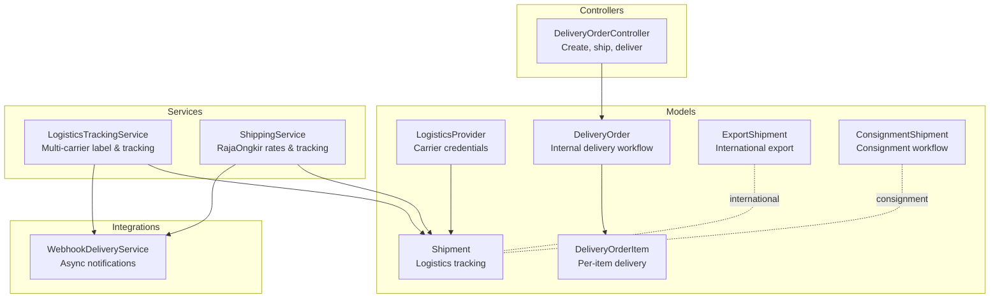

**Diagram sources**
- [Shipment.php:1-49](file://app/Models/Shipment.php#L1-L49)
- [LogisticsProvider.php:1-40](file://app/Models/LogisticsProvider.php#L1-L40)
- [LogisticsTrackingService.php:1-191](file://app/Services/Integrations/LogisticsTrackingService.php#L1-L191)
- [ShippingService.php:1-144](file://app/Services/ShippingService.php#L1-L144)
- [DeliveryOrder.php:1-52](file://app/Models/DeliveryOrder.php#L1-L52)
- [DeliveryOrderItem.php:1-24](file://app/Models/DeliveryOrderItem.php#L1-L24)
- [DeliveryOrderController.php:1-241](file://app/Http/Controllers/DeliveryOrderController.php#L1-L241)
- [ExportShipment.php:1-66](file://app/Models/ExportShipment.php#L1-L66)
- [ConsignmentShipment.php:1-47](file://app/Models/ConsignmentShipment.php#L1-L47)
- [WebhookDeliveryService.php:1-369](file://app/Services/Integrations/WebhookDeliveryService.php#L1-L369)

**Section sources**
- [Shipment.php:1-49](file://app/Models/Shipment.php#L1-L49)
- [LogisticsProvider.php:1-40](file://app/Models/LogisticsProvider.php#L1-L40)
- [LogisticsTrackingService.php:1-191](file://app/Services/Integrations/LogisticsTrackingService.php#L1-L191)
- [ShippingService.php:1-144](file://app/Services/ShippingService.php#L1-L144)
- [DeliveryOrder.php:1-52](file://app/Models/DeliveryOrder.php#L1-L52)
- [DeliveryOrderItem.php:1-24](file://app/Models/DeliveryOrderItem.php#L1-L24)
- [DeliveryOrderController.php:1-241](file://app/Http/Controllers/DeliveryOrderController.php#L1-L241)
- [ExportShipment.php:1-66](file://app/Models/ExportShipment.php#L1-L66)
- [ConsignmentShipment.php:1-47](file://app/Models/ConsignmentShipment.php#L1-L47)
- [WebhookDeliveryService.php:1-369](file://app/Services/Integrations/WebhookDeliveryService.php#L1-L369)

## Core Components
- Shipment model: central entity for tracking, weight, cost, origin/destination, and status with a relationship to the logistics provider.
- LogisticsProvider model: stores carrier credentials and configuration flags.
- LogisticsTrackingService: creates AWBs/labels for JNE and supports tracking for JNE/J&T/SiCepat; also provides service cost estimates.
- ShippingService: integrates with RajaOngkir for domestic rate quotes and optional tracking (Pro tier).
- DeliveryOrder and DeliveryOrderItem: internal delivery workflow with stock movement and invoicing linkage.
- ExportShipment: international export tracking with customs and transport references.
- ConsignmentShipment: consignment-based shipping lifecycle.
- WebhookDeliveryService: robust async delivery with retries, signatures, and monitoring.

**Section sources**
- [Shipment.php:10-48](file://app/Models/Shipment.php#L10-L48)
- [LogisticsProvider.php:10-39](file://app/Models/LogisticsProvider.php#L10-L39)
- [LogisticsTrackingService.php:10-191](file://app/Services/Integrations/LogisticsTrackingService.php#L10-L191)
- [ShippingService.php:8-144](file://app/Services/ShippingService.php#L8-L144)
- [DeliveryOrder.php:12-51](file://app/Models/DeliveryOrder.php#L12-L51)
- [DeliveryOrderItem.php:8-23](file://app/Models/DeliveryOrderItem.php#L8-L23)
- [ExportShipment.php:10-65](file://app/Models/ExportShipment.php#L10-L65)
- [ConsignmentShipment.php:11-46](file://app/Models/ConsignmentShipment.php#L11-L46)
- [WebhookDeliveryService.php:17-369](file://app/Services/Integrations/WebhookDeliveryService.php#L17-L369)

## Architecture Overview
The shipping integration follows a layered pattern:
- Domain models represent real-world entities (Shipments, Delivery Orders, Export Shipments).
- Services encapsulate carrier integrations and rate calculation.
- Controllers manage business workflows (creating delivery orders, updating statuses).
- Webhooks propagate events to external systems asynchronously.

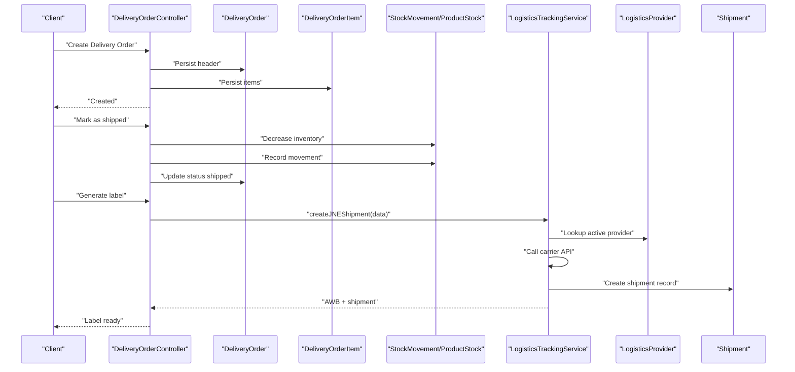

**Diagram sources**
- [DeliveryOrderController.php:64-154](file://app/Http/Controllers/DeliveryOrderController.php#L64-L154)
- [LogisticsTrackingService.php:15-59](file://app/Services/Integrations/LogisticsTrackingService.php#L15-L59)
- [LogisticsProvider.php:14-38](file://app/Models/LogisticsProvider.php#L14-L38)
- [Shipment.php:14-38](file://app/Models/Shipment.php#L14-L38)

## Detailed Component Analysis

### Shipment Tracking and Label Generation
- Label creation: The logistics tracking service supports creating AWBs/labels for JNE and records shipment metadata (tracking number, service type, costs).
- Tracking: Supports tracking for JNE, J&T, and SiCepat; updates shipment status and history.
- Cost estimation: Provides per-provider service tiers and pricing for rate comparison.

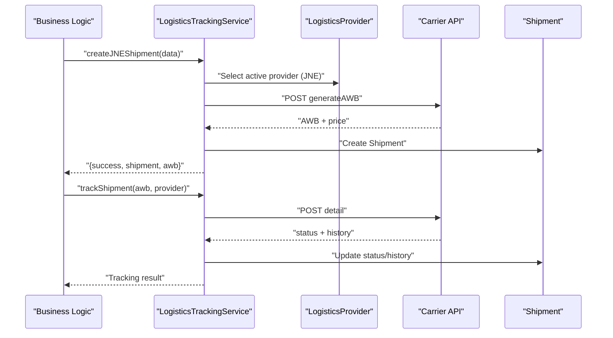

**Diagram sources**
- [LogisticsTrackingService.php:15-89](file://app/Services/Integrations/LogisticsTrackingService.php#L15-L89)
- [LogisticsProvider.php:17-24](file://app/Models/LogisticsProvider.php#L17-L24)
- [Shipment.php:40-47](file://app/Models/Shipment.php#L40-L47)

**Section sources**
- [LogisticsTrackingService.php:15-89](file://app/Services/Integrations/LogisticsTrackingService.php#L15-L89)
- [Shipment.php:14-38](file://app/Models/Shipment.php#L14-L38)

### Domestic Rate Calculation (RajaOngkir)
- Retrieves service rates from RajaOngkir based on origin, destination, weight, and courier.
- Falls back to mock rates when API key is unavailable.
- Optional tracking requires Pro tier.

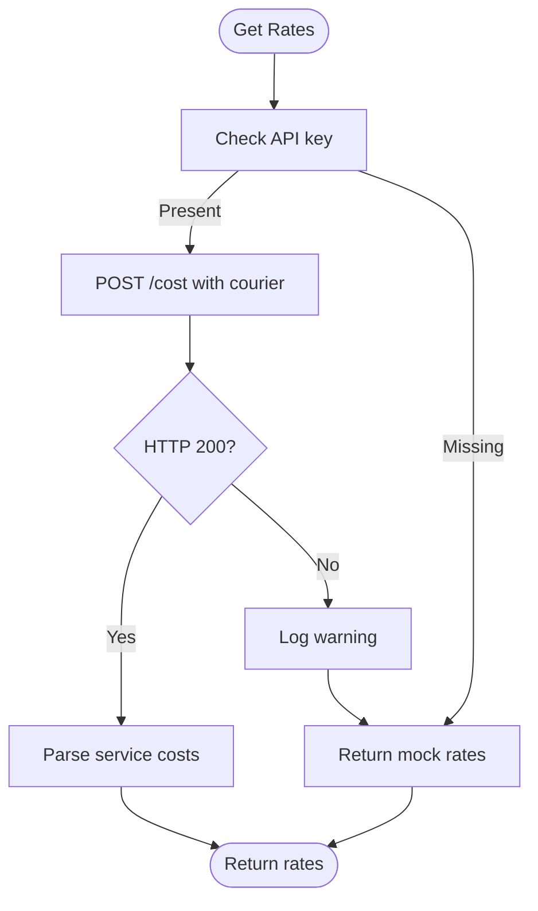

**Diagram sources**
- [ShippingService.php:28-60](file://app/Services/ShippingService.php#L28-L60)

**Section sources**
- [ShippingService.php:28-91](file://app/Services/ShippingService.php#L28-L91)

### Delivery Order Lifecycle and Proof of Delivery
- Creation: Validates and persists delivery order header and items.
- Shipment: Decreases inventory, records stock movements, and updates status.
- Delivery confirmation: Marks delivery order as delivered and logs activity.
- Invoicing: Creates invoices from delivered items with tax and totals.

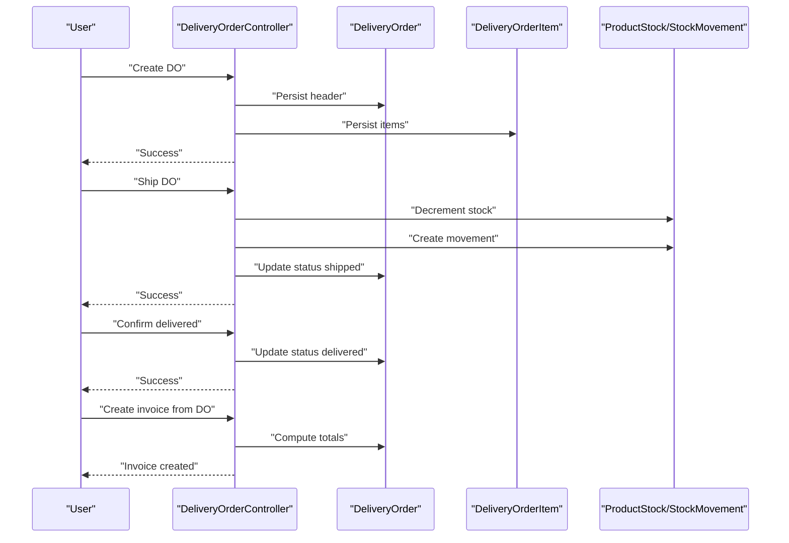

**Diagram sources**
- [DeliveryOrderController.php:64-212](file://app/Http/Controllers/DeliveryOrderController.php#L64-L212)
- [DeliveryOrder.php:24-28](file://app/Models/DeliveryOrder.php#L24-L28)
- [DeliveryOrderItem.php:20-22](file://app/Models/DeliveryOrderItem.php#L20-L22)

**Section sources**
- [DeliveryOrderController.php:64-212](file://app/Http/Controllers/DeliveryOrderController.php#L64-L212)
- [DeliveryOrder.php:12-51](file://app/Models/DeliveryOrder.php#L12-L51)
- [DeliveryOrderItem.php:8-23](file://app/Models/DeliveryOrderItem.php#L8-L23)

### International Shipping Compliance
- ExportShipment captures customs declarations, transport details, ports, Incoterms, and documents.
- Status helpers indicate transit and delivered states for visibility.

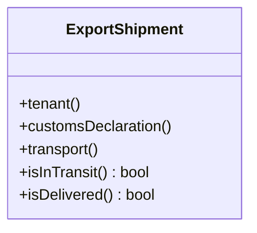

**Diagram sources**
- [ExportShipment.php:10-65](file://app/Models/ExportShipment.php#L10-L65)

**Section sources**
- [ExportShipment.php:14-65](file://app/Models/ExportShipment.php#L14-L65)

### Consignment and Reverse Logistics
- ConsignmentShipment manages consignment lifecycle, numbering, totals, and remaining quantities.
- While explicit return/damaged handling is not present in the code, the consignment model provides a foundation for return workflows (e.g., quantity adjustments and reporting).

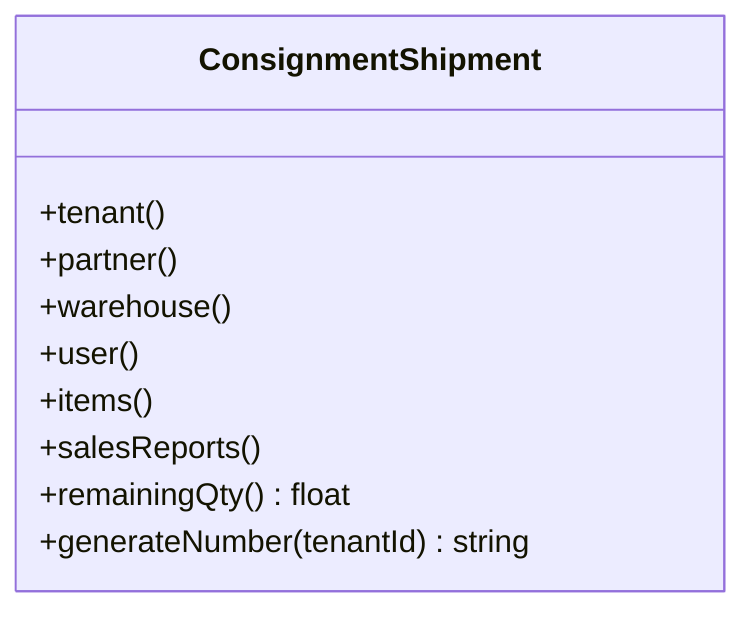

**Diagram sources**
- [ConsignmentShipment.php:11-46](file://app/Models/ConsignmentShipment.php#L11-L46)

**Section sources**
- [ConsignmentShipment.php:14-46](file://app/Models/ConsignmentShipment.php#L14-L46)

### Multi-Carrier Support and Cost Optimization
- Multi-carrier tracking: JNE, J&T, SiCepat supported for tracking and label creation.
- Cost estimation: Per-provider service tiers returned for comparison.
- Cost optimization: Use returned service arrays to select lowest-cost option per ETD constraints.

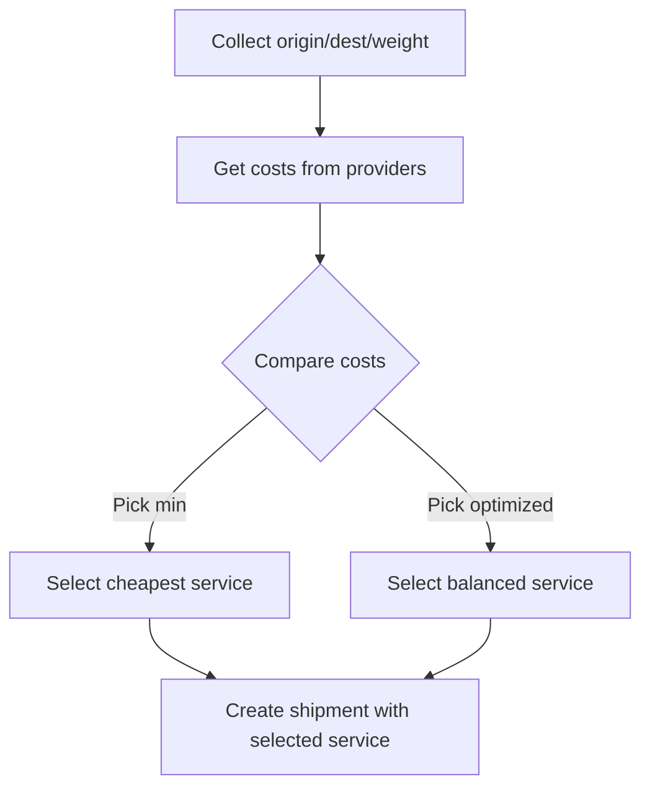

**Diagram sources**
- [LogisticsTrackingService.php:142-154](file://app/Services/Integrations/LogisticsTrackingService.php#L142-L154)
- [LogisticsTrackingService.php:156-189](file://app/Services/Integrations/LogisticsTrackingService.php#L156-L189)

**Section sources**
- [LogisticsTrackingService.php:142-189](file://app/Services/Integrations/LogisticsTrackingService.php#L142-L189)

### Delivery Estimation and Tracking Synchronization
- Estimation: Returned from provider cost queries (ETD strings).
- Synchronization: Tracking updates Shipment status and history; optional estimated delivery field exists on Shipment.

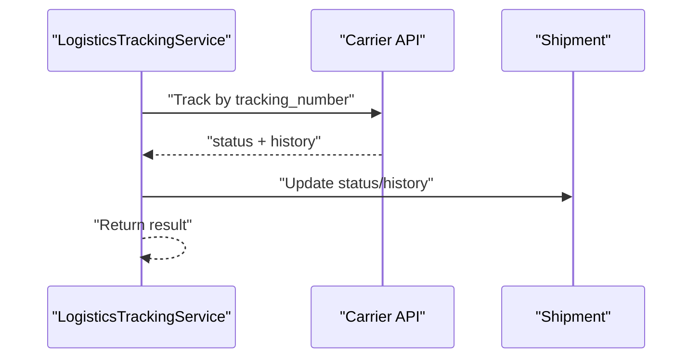

**Diagram sources**
- [LogisticsTrackingService.php:64-89](file://app/Services/Integrations/LogisticsTrackingService.php#L64-L89)
- [Shipment.php:31-38](file://app/Models/Shipment.php#L31-L38)

**Section sources**
- [LogisticsTrackingService.php:64-89](file://app/Services/Integrations/LogisticsTrackingService.php#L64-L89)
- [Shipment.php:28-38](file://app/Models/Shipment.php#L28-L38)

### Shipping Notification Systems
- WebhookDeliveryService handles asynchronous delivery to external subscribers with:
  - Signature generation for authenticity
  - Retry with exponential backoff
  - Delivery tracking and statistics
  - Event scoping by tenant and active subscriptions

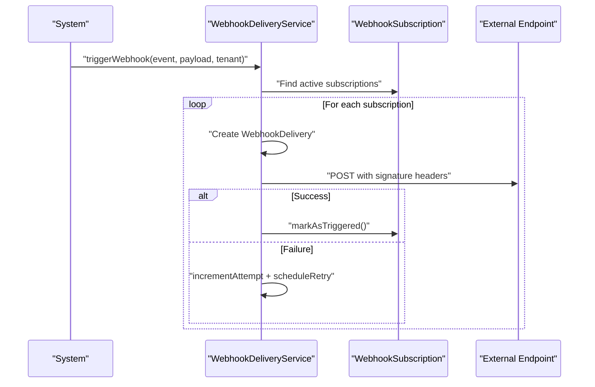

**Diagram sources**
- [WebhookDeliveryService.php:37-136](file://app/Services/Integrations/WebhookDeliveryService.php#L37-L136)
- [WebhookDeliveryService.php:281-302](file://app/Services/Integrations/WebhookDeliveryService.php#L281-L302)

**Section sources**
- [WebhookDeliveryService.php:37-136](file://app/Services/Integrations/WebhookDeliveryService.php#L37-L136)
- [WebhookDeliveryService.php:281-302](file://app/Services/Integrations/WebhookDeliveryService.php#L281-L302)

## Dependency Analysis
- Shipment depends on LogisticsProvider for carrier identity.
- DeliveryOrder and DeliveryOrderItem coordinate stock movements and invoicing.
- LogisticsTrackingService depends on LogisticsProvider and external carrier APIs.
- ShippingService depends on RajaOngkir configuration and tier.
- WebhookDeliveryService coordinates event delivery to external systems.

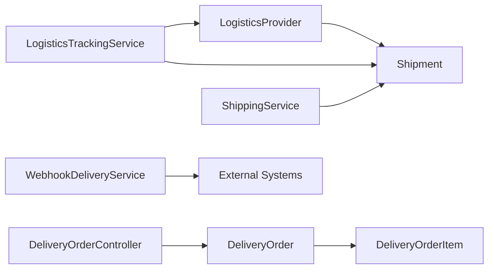

**Diagram sources**
- [LogisticsProvider.php:35-38](file://app/Models/LogisticsProvider.php#L35-L38)
- [Shipment.php:44-47](file://app/Models/Shipment.php#L44-L47)
- [LogisticsTrackingService.php:17-24](file://app/Services/Integrations/LogisticsTrackingService.php#L17-L24)
- [ShippingService.php:14-23](file://app/Services/ShippingService.php#L14-L23)
- [DeliveryOrderController.php:116-154](file://app/Http/Controllers/DeliveryOrderController.php#L116-L154)
- [DeliveryOrder.php:24-28](file://app/Models/DeliveryOrder.php#L24-L28)
- [DeliveryOrderItem.php:20-22](file://app/Models/DeliveryOrderItem.php#L20-L22)
- [WebhookDeliveryService.php:37-53](file://app/Services/Integrations/WebhookDeliveryService.php#L37-L53)

**Section sources**
- [LogisticsProvider.php:35-38](file://app/Models/LogisticsProvider.php#L35-L38)
- [Shipment.php:44-47](file://app/Models/Shipment.php#L44-L47)
- [LogisticsTrackingService.php:17-24](file://app/Services/Integrations/LogisticsTrackingService.php#L17-L24)
- [ShippingService.php:14-23](file://app/Services/ShippingService.php#L14-L23)
- [DeliveryOrderController.php:116-154](file://app/Http/Controllers/DeliveryOrderController.php#L116-L154)
- [DeliveryOrder.php:24-28](file://app/Models/DeliveryOrder.php#L24-L28)
- [DeliveryOrderItem.php:20-22](file://app/Models/DeliveryOrderItem.php#L20-L22)
- [WebhookDeliveryService.php:37-53](file://app/Services/Integrations/WebhookDeliveryService.php#L37-L53)

## Performance Considerations
- Asynchronous notifications: Use WebhookDeliveryService to avoid blocking primary transactions.
- Rate calculation fallback: RajaOngkir mock rates prevent hard failures during development or missing keys.
- Tier-aware tracking: RajaOngkir Pro tier is required for waybill tracking; otherwise return unavailable message.
- Retry strategy: WebhookDeliveryService implements exponential backoff to reduce load spikes.

[No sources needed since this section provides general guidance]

## Troubleshooting Guide
- JNE shipment creation fails: Verify provider configuration and API key; check error logs for failure reasons.
- Tracking errors: Unsupported provider or API failures; confirm provider string and network connectivity.
- RajaOngkir tracking unavailable: Confirm Pro tier configuration; otherwise tracking is unavailable.
- Webhook delivery failures: Inspect delivery attempts, signatures, and endpoint availability; use retry mechanisms.

**Section sources**
- [LogisticsTrackingService.php:55-58](file://app/Services/Integrations/LogisticsTrackingService.php#L55-L58)
- [LogisticsTrackingService.php:85-88](file://app/Services/Integrations/LogisticsTrackingService.php#L85-L88)
- [ShippingService.php:67-73](file://app/Services/ShippingService.php#L67-L73)
- [WebhookDeliveryService.php:132-136](file://app/Services/Integrations/WebhookDeliveryService.php#L132-L136)

## Conclusion
The system provides a robust foundation for shipping integration with:
- Multi-carrier label generation and tracking
- Domestic rate quoting via RajaOngkir
- Internal delivery order lifecycle with stock and invoicing
- International export tracking and compliance
- Webhook-based notifications for external systems
Future enhancements could include explicit return/damaged item handling, advanced carrier selection logic, and expanded provider support.