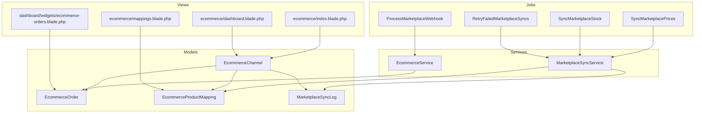
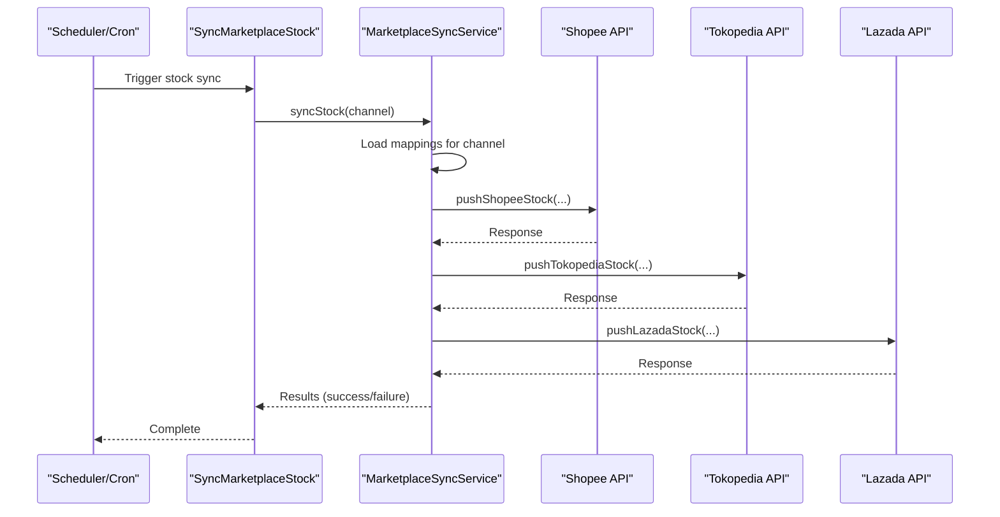
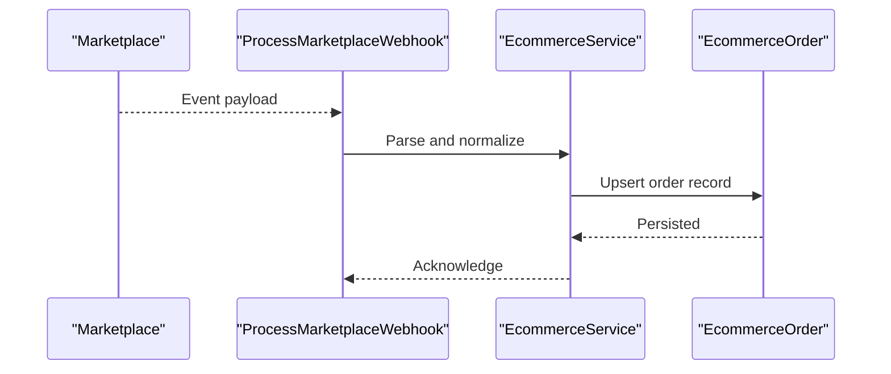
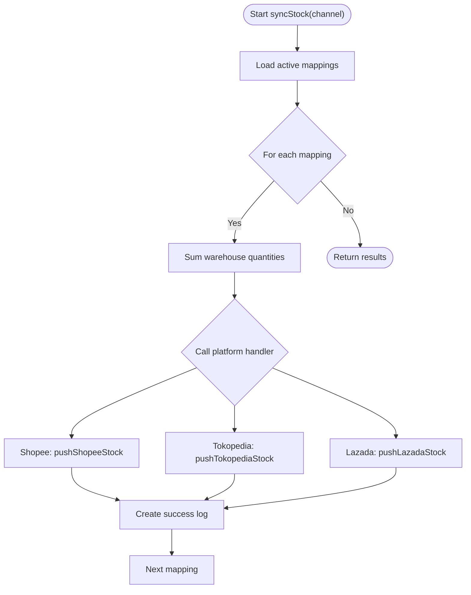
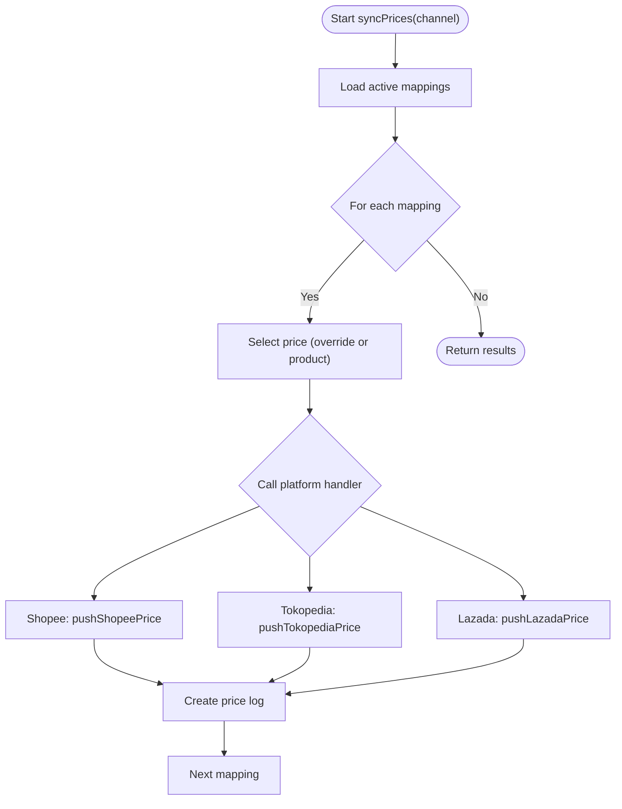
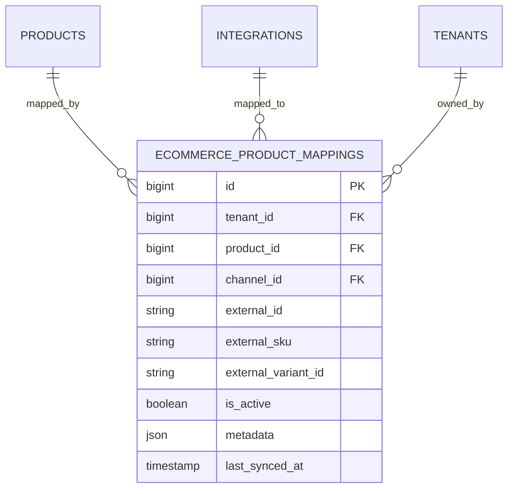
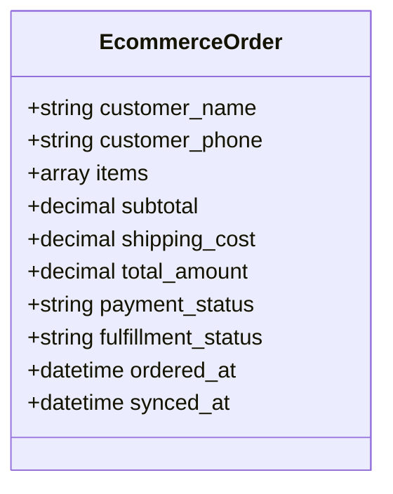
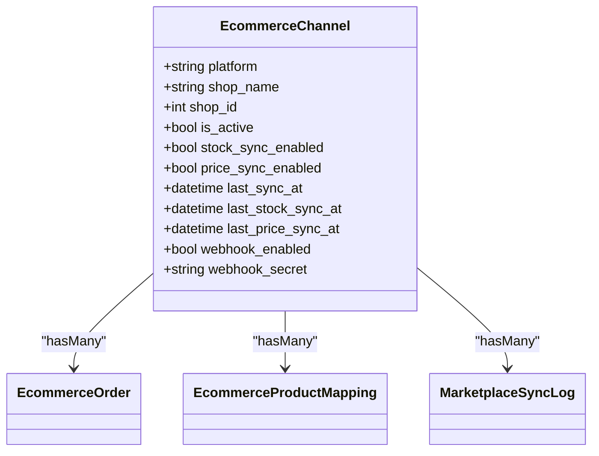
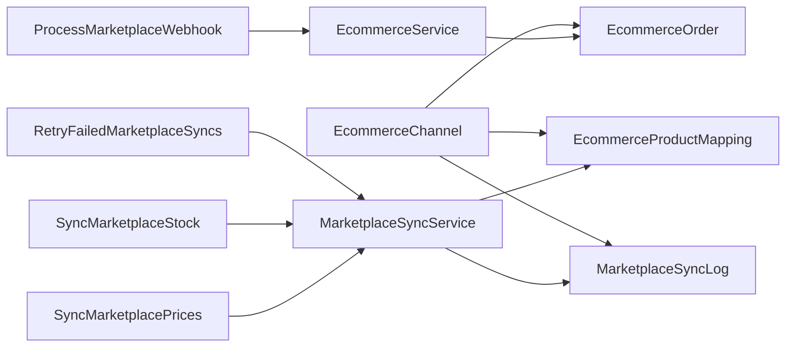
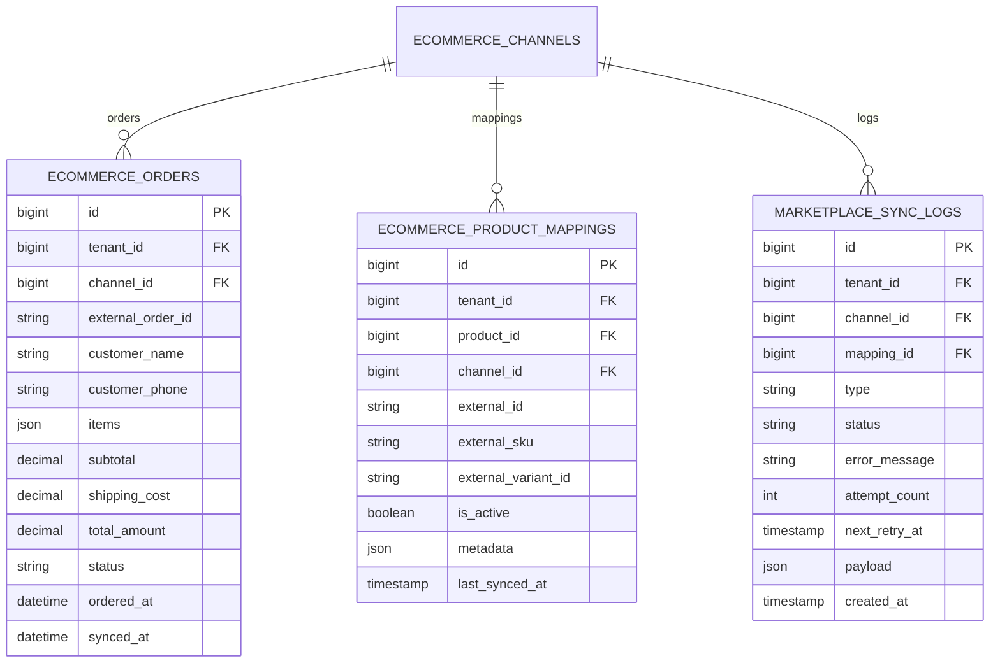

# Marketplace & E-commerce Integration Module

<cite>
**Referenced Files in This Document**
- [MarketplaceSyncService.php](file://app/Services/MarketplaceSyncService.php)
- [EcommerceService.php](file://app/Services/EcommerceService.php)
- [EcommerceChannel.php](file://app/Models/EcommerceChannel.php)
- [EcommerceOrder.php](file://app/Models/EcommerceOrder.php)
- [EcommerceProductMapping.php](file://app/Models/EcommerceProductMapping.php)
- [MarketplaceSyncLog.php](file://app/Models/MarketplaceSyncLog.php)
- [ProcessMarketplaceWebhook.php](file://app/Jobs/ProcessMarketplaceWebhook.php)
- [SyncMarketplacePrices.php](file://app/Jobs/SyncMarketplacePrices.php)
- [SyncMarketplaceStock.php](file://app/Jobs/SyncMarketplaceStock.php)
- [RetryFailedMarketplaceSyncs.php](file://app/Jobs/RetryFailedMarketplaceSyncs.php)
- [2026_04_06_130000_create_marketplace_tables.php](file://database/migrations/2026_04_06_130000_create_marketplace_tables.php)
- [2026_04_08_084802_create_ecommerce_product_mappings_table.php](file://database/migrations/2026_04_08_084802_create_ecommerce_product_mappings_table.php)
- [2026_04_08_100002_fix_ecommerce_product_mappings_structure.php](file://database/migrations/2026_04_08_100002_fix_ecommerce_product_mappings_structure.php)
- [ecommerce/index.blade.php](file://resources/views/ecommerce/index.blade.php)
- [ecommerce/mappings.blade.php](file://resources/views/ecommerce/mappings.blade.php)
- [ecommerce/dashboard.blade.php](file://resources/views/ecommerce/dashboard.blade.php)
- [ecommerce-orders.blade.php](file://resources/views/dashboard/widgets/ecommerce-orders.blade.php)
</cite>

## Table of Contents
1. [Introduction](#introduction)
2. [Project Structure](#project-structure)
3. [Core Components](#core-components)
4. [Architecture Overview](#architecture-overview)
5. [Detailed Component Analysis](#detailed-component-analysis)
6. [Dependency Analysis](#dependency-analysis)
7. [Performance Considerations](#performance-considerations)
8. [Troubleshooting Guide](#troubleshooting-guide)
9. [Conclusion](#conclusion)
10. [Appendices](#appendices)

## Introduction
This document describes the Marketplace & E-commerce Integration Module that connects an internal ERP system to major Indonesian marketplace platforms (Shopee, Tokopedia, Lazada) and enables multi-channel selling. It covers order ingestion, inventory and pricing synchronization, product mapping, webhook processing, channel management, and reporting. The module supports outbound synchronization (pushing stock and price updates to marketplaces) and inbound order synchronization (pulling orders from marketplaces), along with robust logging and retry mechanisms.

## Project Structure
The module spans services, models, jobs, migrations, and views:
- Services orchestrate integrations with marketplace APIs and handle outbound sync and inbound order retrieval.
- Models define channel configuration, order records, product mappings, and sync logs.
- Jobs encapsulate asynchronous tasks for webhook processing, price/stock sync, and retries.
- Migrations define marketplace app ecosystem tables and ecommerce product mapping schema.
- Views provide dashboards and mapping interfaces for channel management.

**Diagram sources**
- [EcommerceService.php:10-402](file://app/Services/EcommerceService.php#L10-L402)
- [MarketplaceSyncService.php:12-439](file://app/Services/MarketplaceSyncService.php#L12-L439)
- [EcommerceChannel.php:11-116](file://app/Models/EcommerceChannel.php#L11-L116)
- [EcommerceOrder.php:10-53](file://app/Models/EcommerceOrder.php#L10-L53)
- [EcommerceProductMapping.php:8-88](file://app/Models/EcommerceProductMapping.php#L8-L88)
- [MarketplaceSyncLog.php](file://app/Models/MarketplaceSyncLog.php)
- [ProcessMarketplaceWebhook.php](file://app/Jobs/ProcessMarketplaceWebhook.php)
- [SyncMarketplacePrices.php](file://app/Jobs/SyncMarketplacePrices.php)
- [SyncMarketplaceStock.php](file://app/Jobs/SyncMarketplaceStock.php)
- [RetryFailedMarketplaceSyncs.php](file://app/Jobs/RetryFailedMarketplaceSyncs.php)
- [ecommerce/index.blade.php](file://resources/views/ecommerce/index.blade.php)
- [ecommerce/mappings.blade.php](file://resources/views/ecommerce/mappings.blade.php)
- [ecommerce/dashboard.blade.php](file://resources/views/ecommerce/dashboard.blade.php)
- [ecommerce-orders.blade.php](file://resources/views/dashboard/widgets/ecommerce-orders.blade.php)

**Section sources**
- [EcommerceService.php:10-402](file://app/Services/EcommerceService.php#L10-L402)
- [MarketplaceSyncService.php:12-439](file://app/Services/MarketplaceSyncService.php#L12-L439)
- [EcommerceChannel.php:11-116](file://app/Models/EcommerceChannel.php#L11-L116)
- [EcommerceOrder.php:10-53](file://app/Models/EcommerceOrder.php#L10-L53)
- [EcommerceProductMapping.php:8-88](file://app/Models/EcommerceProductMapping.php#L8-L88)
- [ProcessMarketplaceWebhook.php](file://app/Jobs/ProcessMarketplaceWebhook.php)
- [SyncMarketplacePrices.php](file://app/Jobs/SyncMarketplacePrices.php)
- [SyncMarketplaceStock.php](file://app/Jobs/SyncMarketplaceStock.php)
- [RetryFailedMarketplaceSyncs.php](file://app/Jobs/RetryFailedMarketplaceSyncs.php)
- [2026_04_06_130000_create_marketplace_tables.php:1-283](file://database/migrations/2026_04_06_130000_create_marketplace_tables.php#L1-L283)
- [2026_04_08_084802_create_ecommerce_product_mappings_table.php:1-42](file://database/migrations/2026_04_08_084802_create_ecommerce_product_mappings_table.php#L1-L42)
- [2026_04_08_100002_fix_ecommerce_product_mappings_structure.php:1-95](file://database/migrations/2026_04_08_100002_fix_ecommerce_product_mappings_structure.php#L1-L95)
- [ecommerce/index.blade.php](file://resources/views/ecommerce/index.blade.php)
- [ecommerce/mappings.blade.php](file://resources/views/ecommerce/mappings.blade.php)
- [ecommerce/dashboard.blade.php](file://resources/views/ecommerce/dashboard.blade.php)
- [ecommerce-orders.blade.php](file://resources/views/dashboard/widgets/ecommerce-orders.blade.php)

## Core Components
- EcommerceService: Pulls orders from Shopee, Tokopedia, and Lazada, normalizes them into EcommerceOrder records, and handles authentication and pagination.
- MarketplaceSyncService: Pushes stock and price updates to supported platforms, with platform-specific handlers and signed requests.
- EcommerceChannel: Stores channel configuration, credentials, and sync toggles; encrypts sensitive fields at rest.
- EcommerceOrder: Represents normalized orders from marketplaces with items, addresses, totals, and timestamps.
- EcommerceProductMapping: Links internal products to external marketplace SKUs and tracks sync metadata.
- MarketplaceSyncLog: Records outcomes of outbound sync operations for auditing and retries.
- Jobs: ProcessMarketplaceWebhook, SyncMarketplacePrices, SyncMarketplaceStock, RetryFailedMarketplaceSyncs.

**Section sources**
- [EcommerceService.php:10-402](file://app/Services/EcommerceService.php#L10-L402)
- [MarketplaceSyncService.php:12-439](file://app/Services/MarketplaceSyncService.php#L12-L439)
- [EcommerceChannel.php:11-116](file://app/Models/EcommerceChannel.php#L11-L116)
- [EcommerceOrder.php:10-53](file://app/Models/EcommerceOrder.php#L10-L53)
- [EcommerceProductMapping.php:8-88](file://app/Models/EcommerceProductMapping.php#L8-L88)
- [MarketplaceSyncLog.php](file://app/Models/MarketplaceSyncLog.php)
- [ProcessMarketplaceWebhook.php](file://app/Jobs/ProcessMarketplaceWebhook.php)
- [SyncMarketplacePrices.php](file://app/Jobs/SyncMarketplacePrices.php)
- [SyncMarketplaceStock.php](file://app/Jobs/SyncMarketplaceStock.php)
- [RetryFailedMarketplaceSyncs.php](file://app/Jobs/RetryFailedMarketplaceSyncs.php)

## Architecture Overview
The module integrates with three major Indonesian marketplaces using their respective APIs. Inbound order synchronization is handled by EcommerceService, while outbound inventory and pricing updates are managed by MarketplaceSyncService. Product mapping ensures accurate linkage between internal SKUs and external marketplace identifiers. Asynchronous jobs process webhooks and periodic syncs, with robust logging and retry logic.

**Diagram sources**
- [SyncMarketplaceStock.php](file://app/Jobs/SyncMarketplaceStock.php)
- [MarketplaceSyncService.php:35-93](file://app/Services/MarketplaceSyncService.php#L35-L93)
- [MarketplaceSyncService.php:165-231](file://app/Services/MarketplaceSyncService.php#L165-L231)

**Section sources**
- [EcommerceService.php:27-35](file://app/Services/EcommerceService.php#L27-L35)
- [MarketplaceSyncService.php:35-161](file://app/Services/MarketplaceSyncService.php#L35-L161)

## Detailed Component Analysis

### Order Management Across Channels
- Inbound order sync: EcommerceService fetches recent orders from each platform, authenticates using platform-specific flows, and imports normalized EcommerceOrder records.
- Status mapping: Orders are mapped to unified statuses (pending, confirmed, processing, shipped, completed, cancelled) for consistent internal handling.
- Webhook processing: ProcessMarketplaceWebhook job handles incoming events to keep orders updated in real time.

**Diagram sources**
- [ProcessMarketplaceWebhook.php](file://app/Jobs/ProcessMarketplaceWebhook.php)
- [EcommerceService.php:109-159](file://app/Services/EcommerceService.php#L109-L159)

**Section sources**
- [EcommerceService.php:27-35](file://app/Services/EcommerceService.php#L27-L35)
- [EcommerceService.php:39-107](file://app/Services/EcommerceService.php#L39-L107)
- [EcommerceService.php:176-241](file://app/Services/EcommerceService.php#L176-L241)
- [EcommerceService.php:311-388](file://app/Services/EcommerceService.php#L311-L388)
- [ProcessMarketplaceWebhook.php](file://app/Jobs/ProcessMarketplaceWebhook.php)

### Inventory Synchronization
- Outbound stock sync aggregates warehouse quantities per product and pushes to Shopee, Tokopedia, and Lazada using platform-specific endpoints.
- Error handling captures failures, logs them, and schedules retries.

**Diagram sources**
- [MarketplaceSyncService.php:35-93](file://app/Services/MarketplaceSyncService.php#L35-L93)
- [MarketplaceSyncService.php:165-231](file://app/Services/MarketplaceSyncService.php#L165-L231)

**Section sources**
- [MarketplaceSyncService.php:35-93](file://app/Services/MarketplaceSyncService.php#L35-L93)

### Pricing Strategy Management
- Outbound price sync reads either overridden price per mapping or product’s sell price and pushes to supported platforms.
- Logs capture successes and failures for monitoring and retries.

**Diagram sources**
- [MarketplaceSyncService.php:103-161](file://app/Services/MarketplaceSyncService.php#L103-L161)
- [MarketplaceSyncService.php:235-298](file://app/Services/MarketplaceSyncService.php#L235-L298)

**Section sources**
- [MarketplaceSyncService.php:103-161](file://app/Services/MarketplaceSyncService.php#L103-L161)

### Product Mapping Between Internal Systems and Marketplace Listings
- EcommerceProductMapping links internal Product to external marketplace identifiers (external_id, external_sku, external_variant_id).
- Migrations define the mapping table and indexes for efficient lookups.

**Diagram sources**
- [EcommerceProductMapping.php:8-88](file://app/Models/EcommerceProductMapping.php#L8-L88)
- [2026_04_08_084802_create_ecommerce_product_mappings_table.php:13-31](file://database/migrations/2026_04_08_084802_create_ecommerce_product_mappings_table.php#L13-L31)
- [2026_04_08_100002_fix_ecommerce_product_mappings_structure.php:14-74](file://database/migrations/2026_04_08_100002_fix_ecommerce_product_mappings_structure.php#L14-L74)

**Section sources**
- [EcommerceProductMapping.php:8-88](file://app/Models/EcommerceProductMapping.php#L8-L88)
- [2026_04_08_084802_create_ecommerce_product_mappings_table.php:13-31](file://database/migrations/2026_04_08_084802_create_ecommerce_product_mappings_table.php#L13-L31)
- [2026_04_08_100002_fix_ecommerce_product_mappings_structure.php:14-74](file://database/migrations/2026_04_08_100002_fix_ecommerce_product_mappings_structure.php#L14-L74)

### Automated Order Fulfillment
- EcommerceService normalizes orders from marketplaces into EcommerceOrder with items, addresses, totals, and timestamps.
- Fulfillment status and payment status are part of the model fillable attributes, enabling downstream fulfillment workflows.

**Diagram sources**
- [EcommerceOrder.php:10-53](file://app/Models/EcommerceOrder.php#L10-L53)

**Section sources**
- [EcommerceOrder.php:14-42](file://app/Models/EcommerceOrder.php#L14-L42)
- [EcommerceService.php:109-159](file://app/Services/EcommerceService.php#L109-L159)
- [EcommerceService.php:243-293](file://app/Services/EcommerceService.php#L243-L293)
- [EcommerceService.php:342-382](file://app/Services/EcommerceService.php#L342-L382)

### Channel Manager Functionality
- EcommerceChannel stores platform credentials, webhook settings, and sync toggles; sensitive fields are encrypted at rest.
- Relationships connect channels to orders, mappings, sync logs, and webhook logs.

**Diagram sources**
- [EcommerceChannel.php:11-116](file://app/Models/EcommerceChannel.php#L11-L116)

**Section sources**
- [EcommerceChannel.php:17-45](file://app/Models/EcommerceChannel.php#L17-L45)
- [EcommerceChannel.php:96-114](file://app/Models/EcommerceChannel.php#L96-L114)

### Multi-Channel Selling Strategies
- Unified order model (EcommerceOrder) allows cross-channel reporting and analytics.
- Product mapping supports variant-level synchronization for SKU differentiation across channels.

**Section sources**
- [EcommerceOrder.php:14-42](file://app/Models/EcommerceOrder.php#L14-L42)
- [EcommerceProductMapping.php:33-46](file://app/Models/EcommerceProductMapping.php#L33-L46)

### E-commerce Compliance Requirements
- Sensitive credential fields are encrypted at rest in EcommerceChannel.
- Audit trails capture changes to channel configurations.

**Section sources**
- [EcommerceChannel.php:49-92](file://app/Models/EcommerceChannel.php#L49-L92)
- [EcommerceChannel.php:13-15](file://app/Models/EcommerceChannel.php#L13-L15)

### Marketplace-Specific Reporting
- MarketplaceSyncLog records outcomes of outbound sync operations for reporting and reconciliation.
- Views provide dashboards for channel management and order widgets for operational visibility.

**Section sources**
- [MarketplaceSyncLog.php](file://app/Models/MarketplaceSyncLog.php)
- [ecommerce/dashboard.blade.php](file://resources/views/ecommerce/dashboard.blade.php)
- [ecommerce-orders.blade.php](file://resources/views/dashboard/widgets/ecommerce-orders.blade.php)

## Dependency Analysis
The module exhibits clear separation of concerns:
- Services depend on models for persistence and on HTTP client for API calls.
- Jobs encapsulate long-running tasks and trigger services.
- Migrations define the schema for marketplace apps and product mappings.

**Diagram sources**
- [EcommerceService.php:10-402](file://app/Services/EcommerceService.php#L10-L402)
- [MarketplaceSyncService.php:12-439](file://app/Services/MarketplaceSyncService.php#L12-L439)
- [EcommerceChannel.php:11-116](file://app/Models/EcommerceChannel.php#L11-L116)
- [EcommerceOrder.php:10-53](file://app/Models/EcommerceOrder.php#L10-L53)
- [EcommerceProductMapping.php:8-88](file://app/Models/EcommerceProductMapping.php#L8-L88)
- [MarketplaceSyncLog.php](file://app/Models/MarketplaceSyncLog.php)
- [ProcessMarketplaceWebhook.php](file://app/Jobs/ProcessMarketplaceWebhook.php)
- [SyncMarketplacePrices.php](file://app/Jobs/SyncMarketplacePrices.php)
- [SyncMarketplaceStock.php](file://app/Jobs/SyncMarketplaceStock.php)
- [RetryFailedMarketplaceSyncs.php](file://app/Jobs/RetryFailedMarketplaceSyncs.php)

**Section sources**
- [EcommerceService.php:10-402](file://app/Services/EcommerceService.php#L10-L402)
- [MarketplaceSyncService.php:12-439](file://app/Services/MarketplaceSyncService.php#L12-L439)
- [EcommerceChannel.php:11-116](file://app/Models/EcommerceChannel.php#L11-L116)
- [EcommerceOrder.php:10-53](file://app/Models/EcommerceOrder.php#L10-L53)
- [EcommerceProductMapping.php:8-88](file://app/Models/EcommerceProductMapping.php#L8-L88)
- [MarketplaceSyncLog.php](file://app/Models/MarketplaceSyncLog.php)
- [ProcessMarketplaceWebhook.php](file://app/Jobs/ProcessMarketplaceWebhook.php)
- [SyncMarketplacePrices.php](file://app/Jobs/SyncMarketplacePrices.php)
- [SyncMarketplaceStock.php](file://app/Jobs/SyncMarketplaceStock.php)
- [RetryFailedMarketplaceSyncs.php](file://app/Jobs/RetryFailedMarketplaceSyncs.php)

## Performance Considerations
- Batch processing: Both inbound order sync and outbound stock/price sync iterate mappings; batching and pagination are used to manage API limits.
- Authentication caching: Access tokens are refreshed and cached per channel to reduce overhead.
- Idempotency: Webhooks and sync jobs should be designed to prevent duplicate processing.
- Logging and retries: MarketplaceSyncLog and RetryFailedMarketplaceSyncs help maintain reliability under transient API failures.

[No sources needed since this section provides general guidance]

## Troubleshooting Guide
Common issues and resolutions:
- Missing credentials: EcommerceService and MarketplaceSyncService check for required credentials and skip syncs when missing; verify channel configuration.
- Token expiration: Tokopedia and Lazada flows refresh or handle 401 responses; ensure access tokens are rotated.
- API errors: Responses are logged; inspect MarketplaceSyncLog for error messages and scheduled retry times.
- Mapping mismatches: Verify EcommerceProductMapping entries for correct external_id and external_sku.

**Section sources**
- [EcommerceService.php:47-50](file://app/Services/EcommerceService.php#L47-L50)
- [EcommerceService.php:182-208](file://app/Services/EcommerceService.php#L182-L208)
- [MarketplaceSyncService.php:317-319](file://app/Services/MarketplaceSyncService.php#L317-L319)
- [MarketplaceSyncService.php:363-384](file://app/Services/MarketplaceSyncService.php#L363-L384)
- [MarketplaceSyncService.php:417-419](file://app/Services/MarketplaceSyncService.php#L417-L419)
- [MarketplaceSyncLog.php](file://app/Models/MarketplaceSyncLog.php)

## Conclusion
The Marketplace & E-commerce Integration Module provides a robust foundation for multi-channel selling in Indonesia. It supports inbound order ingestion, outbound inventory and pricing synchronization, product mapping, webhook processing, and operational reporting. The architecture emphasizes modularity, encryption of sensitive data, and resilient error handling to support scalable e-commerce operations.

[No sources needed since this section summarizes without analyzing specific files]

## Appendices

### API Definitions and Endpoints
- Shopee: Uses Open Platform API v2 with HMAC-SHA256 signing for stock and price updates.
- Tokopedia: Uses OAuth2 Bearer token for Fulfillment Service endpoints; client credentials grant for token acquisition.
- Lazada: Uses Bearer token with app_key for order and product endpoints.

**Section sources**
- [MarketplaceSyncService.php:310-342](file://app/Services/MarketplaceSyncService.php#L310-L342)
- [MarketplaceSyncService.php:351-405](file://app/Services/MarketplaceSyncService.php#L351-L405)
- [MarketplaceSyncService.php:412-437](file://app/Services/MarketplaceSyncService.php#L412-L437)
- [EcommerceService.php:41-107](file://app/Services/EcommerceService.php#L41-L107)
- [EcommerceService.php:176-241](file://app/Services/EcommerceService.php#L176-L241)
- [EcommerceService.php:311-388](file://app/Services/EcommerceService.php#L311-L388)

### Data Models Overview

**Diagram sources**
- [EcommerceOrder.php:10-53](file://app/Models/EcommerceOrder.php#L10-L53)
- [EcommerceProductMapping.php:8-88](file://app/Models/EcommerceProductMapping.php#L8-L88)
- [MarketplaceSyncLog.php](file://app/Models/MarketplaceSyncLog.php)
- [EcommerceChannel.php:11-116](file://app/Models/EcommerceChannel.php#L11-L116)