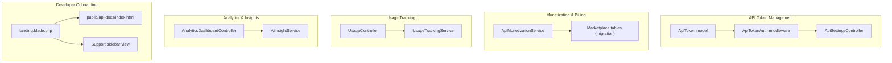
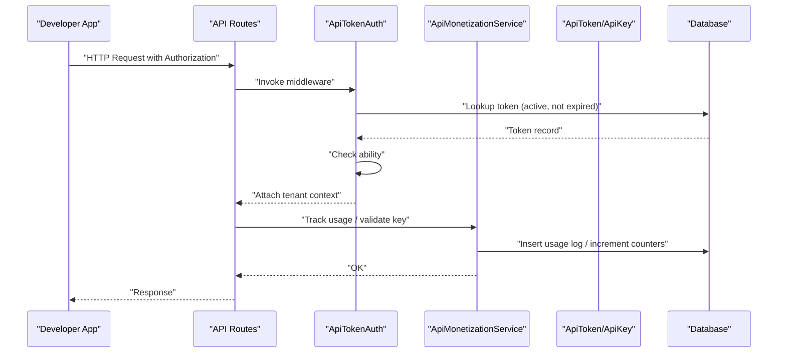
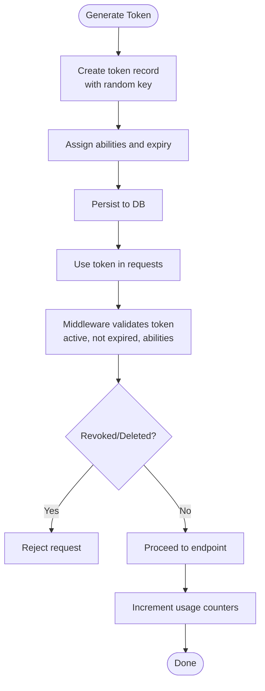
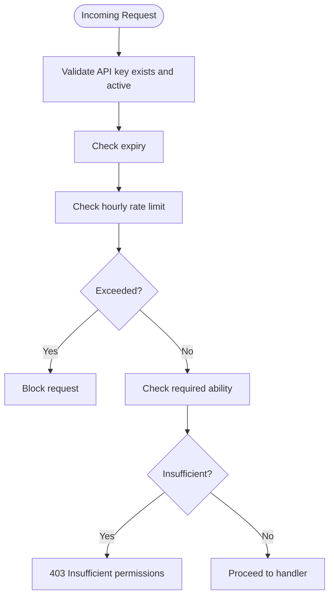
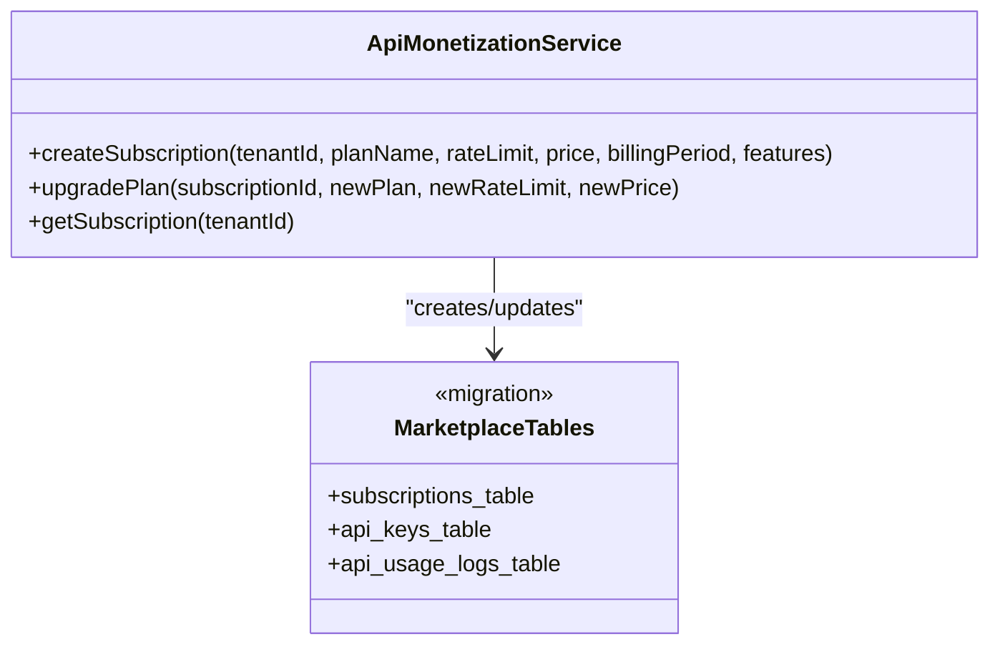
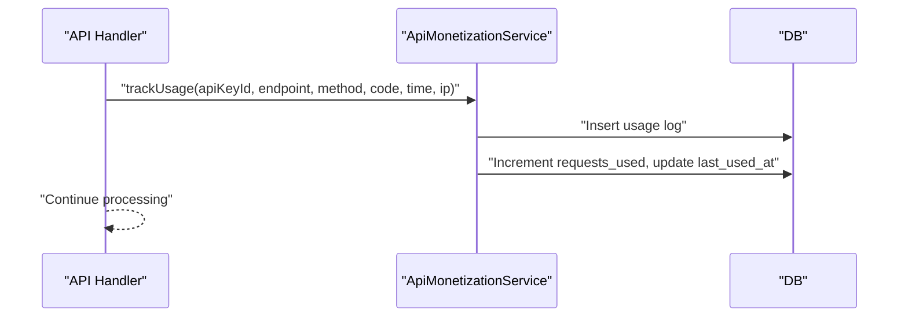
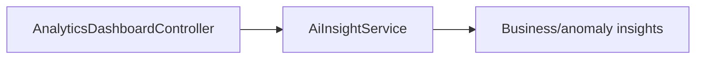
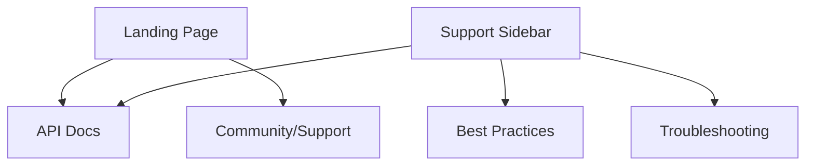
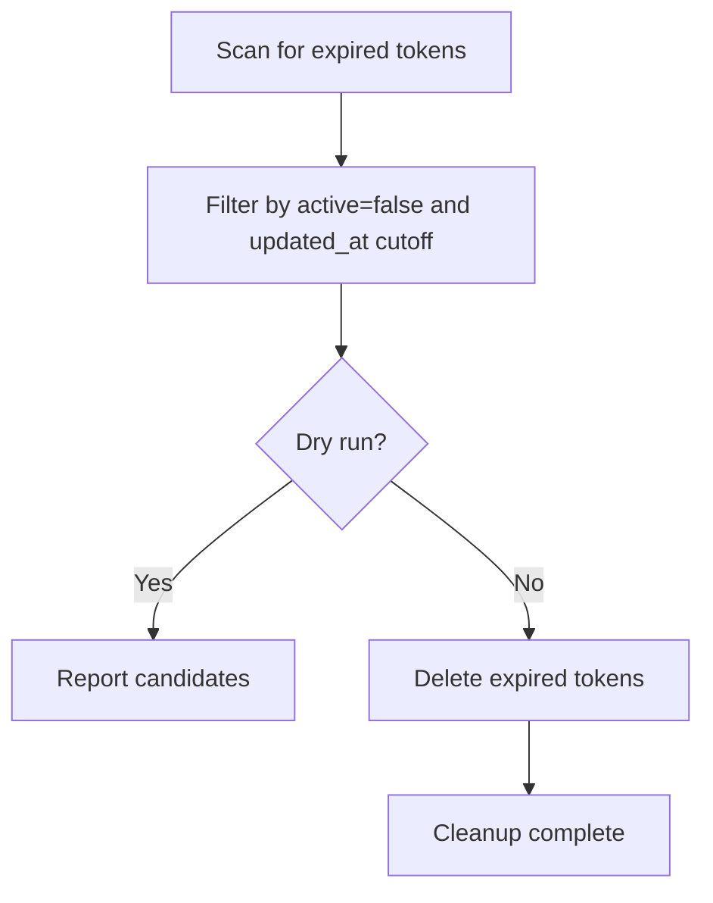
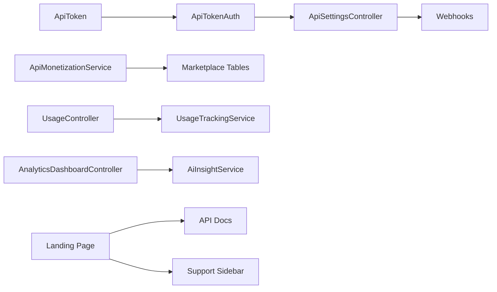

# API Monetization Platform

<cite>
**Referenced Files in This Document**
- [ApiToken.php](file://app/Models/ApiToken.php)
- [ApiTokenAuth.php](file://app/Http/Middleware/ApiTokenAuth.php)
- [ApiSettingsController.php](file://app/Http/Controllers/ApiSettingsController.php)
- [CleanupExpiredApiTokens.php](file://app/Console/Commands/CleanupExpiredApiTokens.php)
- [2026_04_07_000001_add_composite_indexes_to_api_tokens.php](file://database/migrations/2026_04_07_000001_add_composite_indexes_to_api_tokens.php)
- [ApiMonetizationService.php](file://app/Services/Marketplace/ApiMonetizationService.php)
- [2026_04_06_130000_create_marketplace_tables.php](file://database/migrations/2026_04_06_130000_create_marketplace_tables.php)
- [UsageController.php](file://app/Http/Controllers/Api/Telecom/UsageController.php)
- [UsageTrackingService.php](file://app/Services/Telecom/UsageTrackingService.php)
- [AnalyticsDashboardController.php](file://app/Http/Controllers/Analytics/AnalyticsDashboardController.php)
- [AiInsightService.php](file://app/Services/AiInsightService.php)
- [DeveloperAccount.php](file://app/Models/DeveloperAccount.php)
- [index.html](file://public/api-docs/index.html)
- [landing.blade.php](file://resources/views/landing.blade.php)
- [01e1c8375a0474dba66b078ebcd02444.php](file://storage/framework/views/01e1c8375a0474dba66b078ebcd02444.php)
- [api.php](file://routes/api.php)
</cite>

## Table of Contents
1. [Introduction](#introduction)
2. [Project Structure](#project-structure)
3. [Core Components](#core-components)
4. [Architecture Overview](#architecture-overview)
5. [Detailed Component Analysis](#detailed-component-analysis)
6. [Dependency Analysis](#dependency-analysis)
7. [Performance Considerations](#performance-considerations)
8. [Troubleshooting Guide](#troubleshooting-guide)
9. [Conclusion](#conclusion)
10. [Appendices](#appendices)

## Introduction
This document describes the API Monetization Platform within the qalcuityERP codebase. It focuses on the API key generation and management system, rate limiting, permission controls, and security measures. It also documents the subscription and billing system for API access, usage tracking, and automated billing. Additionally, it covers analytics and monitoring capabilities, developer onboarding, documentation integration, and support resources. Finally, it includes integration patterns, best practices, and troubleshooting guidance.

## Project Structure
The platform spans models, middleware, controllers, services, migrations, console commands, and frontend assets. Key areas include:
- API token lifecycle and permissions: models, middleware, and settings controller
- Monetization and usage tracking: marketplace service and usage tracking service
- Analytics and insights: analytics dashboard and AI insight service
- Developer onboarding and documentation: landing page, API docs, and support links
- Infrastructure: migrations for marketplace tables and token indexing

**Diagram sources**
- [ApiToken.php:11-66](file://app/Models/ApiToken.php#L11-L66)
- [ApiTokenAuth.php:10-70](file://app/Http/Middleware/ApiTokenAuth.php#L10-L70)
- [ApiSettingsController.php:13-153](file://app/Http/Controllers/ApiSettingsController.php#L13-L153)
- [ApiMonetizationService.php:10-187](file://app/Services/Marketplace/ApiMonetizationService.php#L10-L187)
- [2026_04_06_130000_create_marketplace_tables.php:233-267](file://database/migrations/2026_04_06_130000_create_marketplace_tables.php#L233-L267)
- [UsageController.php:11-46](file://app/Http/Controllers/Api/Telecom/UsageController.php#L11-L46)
- [UsageTrackingService.php:62-100](file://app/Services/Telecom/UsageTrackingService.php#L62-L100)
- [AnalyticsDashboardController.php:10-48](file://app/Http/Controllers/Analytics/AnalyticsDashboardController.php#L10-L48)
- [AiInsightService.php:39-66](file://app/Services/AiInsightService.php#L39-L66)
- [landing.blade.php:121-1844](file://resources/views/landing.blade.php#L121-L1844)
- [index.html:612-639](file://public/api-docs/index.html#L612-L639)
- [01e1c8375a0474dba66b078ebcd02444.php:140-168](file://storage/framework/views/01e1c8375a0474dba66b078ebcd02444.php#L140-L168)

**Section sources**
- [ApiToken.php:11-66](file://app/Models/ApiToken.php#L11-L66)
- [ApiTokenAuth.php:10-70](file://app/Http/Middleware/ApiTokenAuth.php#L10-L70)
- [ApiSettingsController.php:13-153](file://app/Http/Controllers/ApiSettingsController.php#L13-L153)
- [ApiMonetizationService.php:10-187](file://app/Services/Marketplace/ApiMonetizationService.php#L10-L187)
- [2026_04_06_130000_create_marketplace_tables.php:233-267](file://database/migrations/2026_04_06_130000_create_marketplace_tables.php#L233-L267)
- [UsageController.php:11-46](file://app/Http/Controllers/Api/Telecom/UsageController.php#L11-L46)
- [UsageTrackingService.php:62-100](file://app/Services/Telecom/UsageTrackingService.php#L62-L100)
- [AnalyticsDashboardController.php:10-48](file://app/Http/Controllers/Analytics/AnalyticsDashboardController.php#L10-L48)
- [AiInsightService.php:39-66](file://app/Services/AiInsightService.php#L39-L66)
- [landing.blade.php:121-1844](file://resources/views/landing.blade.php#L121-L1844)
- [index.html:612-639](file://public/api-docs/index.html#L612-L639)
- [01e1c8375a0474dba66b078ebcd02444.php:140-168](file://storage/framework/views/01e1c8375a0474dba66b078ebcd02444.php#L140-L168)

## Core Components
- API Token Model: Defines token attributes, abilities, validity checks, and tenant scoping.
- API Token Authentication Middleware: Extracts tokens from multiple sources, validates active and non-expired state, enforces ability checks, attaches tenant context, and updates last-used timestamps.
- API Settings Controller: Provides UI-backed CRUD for API tokens and webhooks, including revocation and deletion.
- Monetization Service: Generates API keys, validates keys, tracks usage, enforces hourly rate limits, creates subscriptions, upgrades plans, and aggregates usage analytics.
- Usage Tracking: Computes usage summaries and bandwidth metrics for telecom-like subscriptions.
- Analytics and Insights: Aggregates business health metrics and anomaly-driven insights.
- Developer Onboarding: Landing page, API docs, and internal support navigation.

**Section sources**
- [ApiToken.php:11-66](file://app/Models/ApiToken.php#L11-L66)
- [ApiTokenAuth.php:10-70](file://app/Http/Middleware/ApiTokenAuth.php#L10-L70)
- [ApiSettingsController.php:13-153](file://app/Http/Controllers/ApiSettingsController.php#L13-L153)
- [ApiMonetizationService.php:10-187](file://app/Services/Marketplace/ApiMonetizationService.php#L10-L187)
- [UsageTrackingService.php:62-100](file://app/Services/Telecom/UsageTrackingService.php#L62-L100)
- [AnalyticsDashboardController.php:10-48](file://app/Http/Controllers/Analytics/AnalyticsDashboardController.php#L10-L48)
- [AiInsightService.php:39-66](file://app/Services/AiInsightService.php#L39-L66)
- [landing.blade.php:121-1844](file://resources/views/landing.blade.php#L121-L1844)
- [index.html:612-639](file://public/api-docs/index.html#L612-L639)

## Architecture Overview
The platform integrates token-based authentication, monetization, usage tracking, and analytics. Tokens are validated centrally, then used to enforce permissions and rate limits. Subscriptions and billing are modeled and tracked, while usage logs feed analytics and insights.

**Diagram sources**
- [ApiTokenAuth.php:10-70](file://app/Http/Middleware/ApiTokenAuth.php#L10-L70)
- [ApiMonetizationService.php:10-187](file://app/Services/Marketplace/ApiMonetizationService.php#L10-L187)
- [ApiToken.php:11-66](file://app/Models/ApiToken.php#L11-L66)

## Detailed Component Analysis

### API Key Generation and Management
- Generation: Tokens are generated with random strings, optional expiration, and default abilities. They are scoped to tenants.
- Validation: Middleware validates active and non-expired tokens and checks required abilities.
- Permissions: Abilities include read, write, delete, and wildcard access. Middleware enforces ability checks and logs permission denials.
- Lifecycle: Tokens can be revoked (set inactive) or deleted. A scheduled cleanup removes expired tokens.

**Diagram sources**
- [ApiToken.php:36-51](file://app/Models/ApiToken.php#L36-L51)
- [ApiTokenAuth.php:22-68](file://app/Http/Middleware/ApiTokenAuth.php#L22-L68)
- [ApiSettingsController.php:30-64](file://app/Http/Controllers/ApiSettingsController.php#L30-L64)
- [CleanupExpiredApiTokens.php:30-43](file://app/Console/Commands/CleanupExpiredApiTokens.php#L30-L43)

**Section sources**
- [ApiToken.php:11-66](file://app/Models/ApiToken.php#L11-L66)
- [ApiTokenAuth.php:10-70](file://app/Http/Middleware/ApiTokenAuth.php#L10-L70)
- [ApiSettingsController.php:13-153](file://app/Http/Controllers/ApiSettingsController.php#L13-L153)
- [CleanupExpiredApiTokens.php:16-43](file://app/Console/Commands/CleanupExpiredApiTokens.php#L16-L43)

### Rate Limiting and Permission Controls
- Hourly rate limiting: The monetization service resets per-hour counters and compares against configured limits.
- Endpoint-level enforcement: Middleware enforces required abilities per request.
- Database-level safety: Token queries filter by active and non-expired states to avoid loading invalid tokens.

**Diagram sources**
- [ApiMonetizationService.php:76-91](file://app/Services/Marketplace/ApiMonetizationService.php#L76-L91)
- [ApiTokenAuth.php:47-59](file://app/Http/Middleware/ApiTokenAuth.php#L47-L59)

**Section sources**
- [ApiMonetizationService.php:76-91](file://app/Services/Marketplace/ApiMonetizationService.php#L76-L91)
- [ApiTokenAuth.php:47-59](file://app/Http/Middleware/ApiTokenAuth.php#L47-L59)

### Subscription and Billing System
- Subscription creation: Creates tenant-scoped subscriptions with plan name, rate limit, price, billing period, features, and status.
- Plan upgrade: Updates subscription plan and propagates new rate limits to tenant’s API keys.
- Subscription retrieval: Fetches active, non-expired subscriptions for a tenant.

**Diagram sources**
- [ApiMonetizationService.php:96-137](file://app/Services/Marketplace/ApiMonetizationService.php#L96-L137)
- [2026_04_06_130000_create_marketplace_tables.php:233-267](file://database/migrations/2026_04_06_130000_create_marketplace_tables.php#L233-L267)

**Section sources**
- [ApiMonetizationService.php:96-137](file://app/Services/Marketplace/ApiMonetizationService.php#L96-L137)
- [2026_04_06_130000_create_marketplace_tables.php:233-267](file://database/migrations/2026_04_06_130000_create_marketplace_tables.php#L233-L267)

### Usage Tracking and Monitoring
- Usage logging: Records endpoint, method, response code, response time, and IP address; increments request counters and updates last used.
- Usage summary: Computes totals, average response time, error counts, error rates, and top endpoints for a given period.
- Telecom-style usage: Aggregates download/upload/total bytes, peak bandwidth, and quota remaining for active subscriptions.

**Diagram sources**
- [ApiMonetizationService.php:57-71](file://app/Services/Marketplace/ApiMonetizationService.php#L57-L71)

**Section sources**
- [ApiMonetizationService.php:57-71](file://app/Services/Marketplace/ApiMonetizationService.php#L57-L71)
- [ApiMonetizationService.php:142-175](file://app/Services/Marketplace/ApiMonetizationService.php#L142-L175)
- [UsageController.php:20-46](file://app/Http/Controllers/Api/Telecom/UsageController.php#L20-L46)
- [UsageTrackingService.php:76-100](file://app/Services/Telecom/UsageTrackingService.php#L76-L100)

### Analytics and Insights
- Analytics dashboard: Provides business health score and quick stats for tenants.
- AI insights: Aggregates anomalies and financial/business trends into actionable insights.

**Diagram sources**
- [AnalyticsDashboardController.php:10-48](file://app/Http/Controllers/Analytics/AnalyticsDashboardController.php#L10-L48)
- [AiInsightService.php:39-66](file://app/Services/AiInsightService.php#L39-L66)

**Section sources**
- [AnalyticsDashboardController.php:10-48](file://app/Http/Controllers/Analytics/AnalyticsDashboardController.php#L10-L48)
- [AiInsightService.php:39-66](file://app/Services/AiInsightService.php#L39-L66)

### Developer Onboarding, Documentation, and Support
- Landing page: Links to documentation and API docs, and community/support sections.
- API documentation: Static HTML with pricing tiers and usage guidance.
- Internal support navigation: Sidebar with links to API docs, best practices, and troubleshooting.

**Diagram sources**
- [landing.blade.php:121-1844](file://resources/views/landing.blade.php#L121-L1844)
- [index.html:612-639](file://public/api-docs/index.html#L612-L639)
- [01e1c8375a0474dba66b078ebcd02444.php:140-168](file://storage/framework/views/01e1c8375a0474dba66b078ebcd02444.php#L140-L168)

**Section sources**
- [landing.blade.php:121-1844](file://resources/views/landing.blade.php#L121-L1844)
- [index.html:612-639](file://public/api-docs/index.html#L612-L639)
- [01e1c8375a0474dba66b078ebcd02444.php:140-168](file://storage/framework/views/01e1c8375a0474dba66b078ebcd02444.php#L140-L168)

### Security Measures
- Token validation: Database-level filters prevent expired or inactive tokens from being considered valid.
- Ability enforcement: Middleware checks required abilities and logs permission denials.
- Indexing: Composite indexes optimize token lookup performance and security scanning.
- Cleanup: Scheduled command removes expired tokens for hygiene and security.

**Diagram sources**
- [CleanupExpiredApiTokens.php:30-43](file://app/Console/Commands/CleanupExpiredApiTokens.php#L30-L43)
- [2026_04_07_000001_add_composite_indexes_to_api_tokens.php:15-33](file://database/migrations/2026_04_07_000001_add_composite_indexes_to_api_tokens.php#L15-L33)

**Section sources**
- [ApiTokenAuth.php:22-45](file://app/Http/Middleware/ApiTokenAuth.php#L22-L45)
- [ApiTokenAuth.php:47-59](file://app/Http/Middleware/ApiTokenAuth.php#L47-L59)
- [CleanupExpiredApiTokens.php:16-43](file://app/Console/Commands/CleanupExpiredApiTokens.php#L16-L43)
- [2026_04_07_000001_add_composite_indexes_to_api_tokens.php:15-33](file://database/migrations/2026_04_07_000001_add_composite_indexes_to_api_tokens.php#L15-L33)

## Dependency Analysis
- Token model depends on tenant scoping and ability arrays.
- Middleware depends on token model and logs failed attempts.
- Settings controller depends on token model and webhooks.
- Monetization service depends on API keys, usage logs, and subscriptions.
- Usage controller depends on usage tracking service and telecom subscriptions.
- Analytics dashboard depends on advanced analytics and forecasting services.
- Developer onboarding depends on landing page, API docs, and internal navigation.

**Diagram sources**
- [ApiToken.php:11-66](file://app/Models/ApiToken.php#L11-L66)
- [ApiTokenAuth.php:10-70](file://app/Http/Middleware/ApiTokenAuth.php#L10-L70)
- [ApiSettingsController.php:13-153](file://app/Http/Controllers/ApiSettingsController.php#L13-L153)
- [ApiMonetizationService.php:10-187](file://app/Services/Marketplace/ApiMonetizationService.php#L10-L187)
- [UsageController.php:11-46](file://app/Http/Controllers/Api/Telecom/UsageController.php#L11-L46)
- [UsageTrackingService.php:62-100](file://app/Services/Telecom/UsageTrackingService.php#L62-L100)
- [AnalyticsDashboardController.php:10-48](file://app/Http/Controllers/Analytics/AnalyticsDashboardController.php#L10-L48)
- [AiInsightService.php:39-66](file://app/Services/AiInsightService.php#L39-L66)
- [landing.blade.php:121-1844](file://resources/views/landing.blade.php#L121-L1844)
- [index.html:612-639](file://public/api-docs/index.html#L612-L639)
- [01e1c8375a0474dba66b078ebcd02444.php:140-168](file://storage/framework/views/01e1c8375a0474dba66b078ebcd02444.php#L140-L168)

**Section sources**
- [ApiToken.php:11-66](file://app/Models/ApiToken.php#L11-L66)
- [ApiTokenAuth.php:10-70](file://app/Http/Middleware/ApiTokenAuth.php#L10-L70)
- [ApiSettingsController.php:13-153](file://app/Http/Controllers/ApiSettingsController.php#L13-L153)
- [ApiMonetizationService.php:10-187](file://app/Services/Marketplace/ApiMonetizationService.php#L10-L187)
- [UsageController.php:11-46](file://app/Http/Controllers/Api/Telecom/UsageController.php#L11-L46)
- [UsageTrackingService.php:62-100](file://app/Services/Telecom/UsageTrackingService.php#L62-L100)
- [AnalyticsDashboardController.php:10-48](file://app/Http/Controllers/Analytics/AnalyticsDashboardController.php#L10-L48)
- [AiInsightService.php:39-66](file://app/Services/AiInsightService.php#L39-L66)
- [landing.blade.php:121-1844](file://resources/views/landing.blade.php#L121-L1844)
- [index.html:612-639](file://public/api-docs/index.html#L612-L639)
- [01e1c8375a0474dba66b078ebcd02444.php:140-168](file://storage/framework/views/01e1c8375a0474dba66b078ebcd02444.php#L140-L168)

## Performance Considerations
- Token validation performance: Composite indexes on token, active flag, and expiry improve middleware query performance.
- Usage tracking overhead: Logging per request increases I/O; batching or sampling strategies can reduce overhead.
- Analytics aggregation: Filtering by tenant and periods reduces dataset size for reports.
- Cleanup jobs: Scheduled removal of expired tokens keeps DB small and queries fast.

[No sources needed since this section provides general guidance]

## Troubleshooting Guide
Common issues and resolutions:
- Authentication failures: Verify token presence, active status, and non-expired state. Check ability requirements and review logs for denied attempts.
- Rate limit exceeded: Confirm hourly reset behavior and adjust client-side throttling. Review usage logs to identify spikes.
- Subscription not applied: Ensure the active subscription exists and has not expired; confirm plan upgrade propagated to API keys.
- Webhook delivery failures: Use the webhook delivery log to inspect recent deliveries and retry failed events.

**Section sources**
- [ApiTokenAuth.php:32-59](file://app/Http/Middleware/ApiTokenAuth.php#L32-L59)
- [ApiMonetizationService.php:76-91](file://app/Services/Marketplace/ApiMonetizationService.php#L76-L91)
- [ApiMonetizationService.php:114-137](file://app/Services/Marketplace/ApiMonetizationService.php#L114-L137)
- [ApiSettingsController.php:118-152](file://app/Http/Controllers/ApiSettingsController.php#L118-L152)

## Conclusion
The API Monetization Platform integrates robust token management, strict permission controls, and comprehensive usage tracking. Subscriptions and billing are modeled to scale with tenant needs, while analytics and insights provide operational visibility. Developer onboarding is supported by integrated documentation and community resources. Security is reinforced through database-level validations, indexing, and scheduled cleanup.

[No sources needed since this section summarizes without analyzing specific files]

## Appendices

### API Integration Patterns
- Use bearer tokens for server-to-server integrations; include X-API-Token header or query parameter fallback.
- Implement exponential backoff on rate limit errors.
- Track and log request IDs for correlation across services.

[No sources needed since this section provides general guidance]

### Best Practices for API Security
- Rotate tokens regularly and revoke unused tokens.
- Enforce least privilege using granular abilities.
- Monitor and alert on unusual request patterns or repeated failures.
- Store tokens securely and avoid logging sensitive values.

[No sources needed since this section provides general guidance]

### Pricing Plans and Usage Reporting
- Pricing tiers and usage guidance are documented in the API docs.

**Section sources**
- [index.html:612-639](file://public/api-docs/index.html#L612-L639)