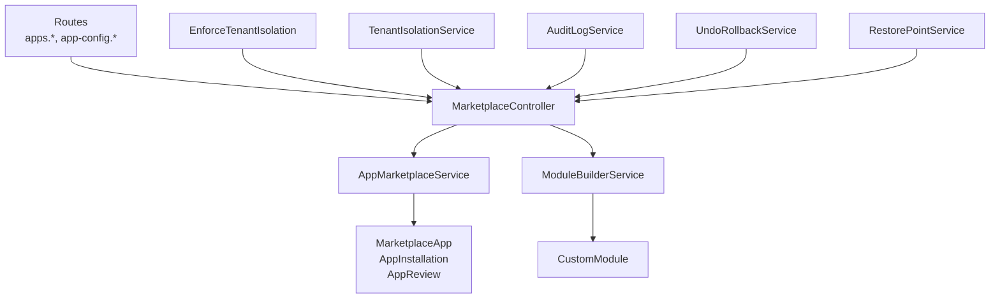
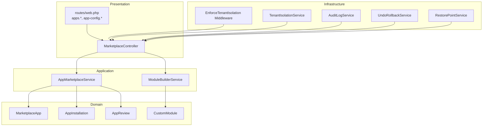
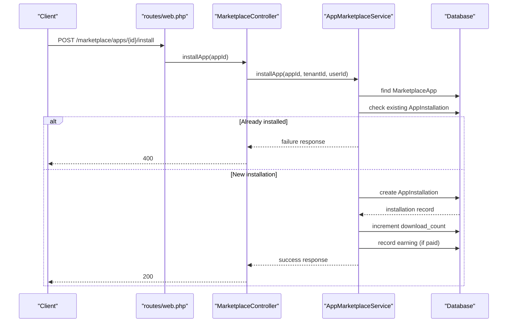
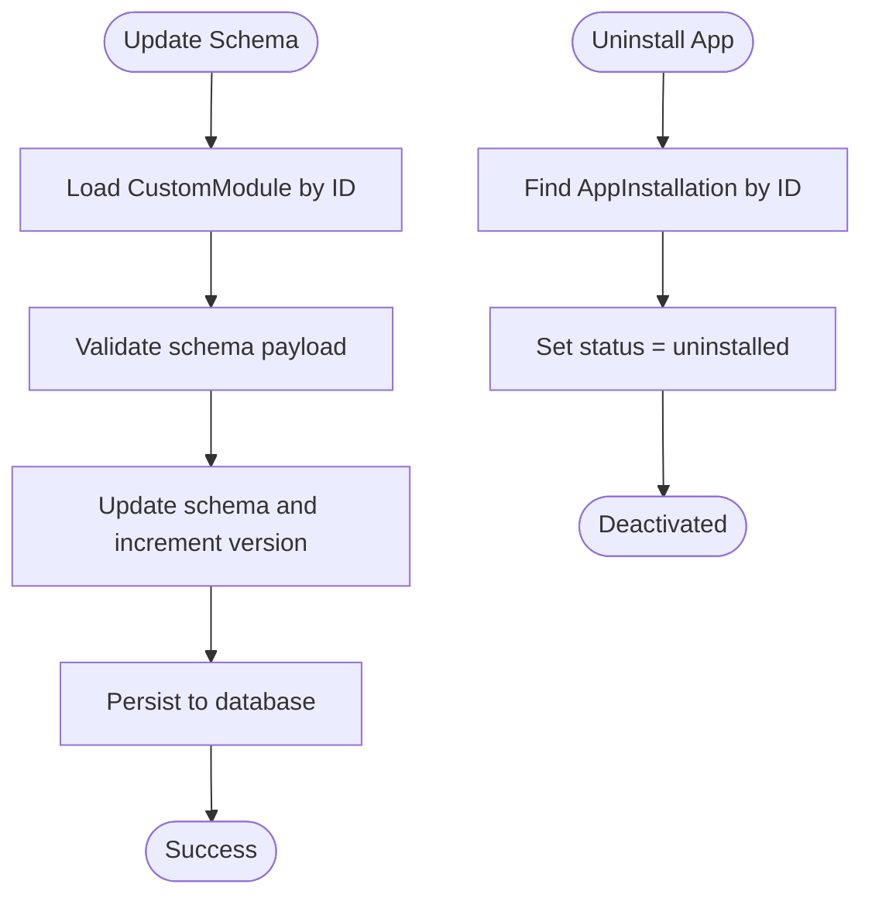
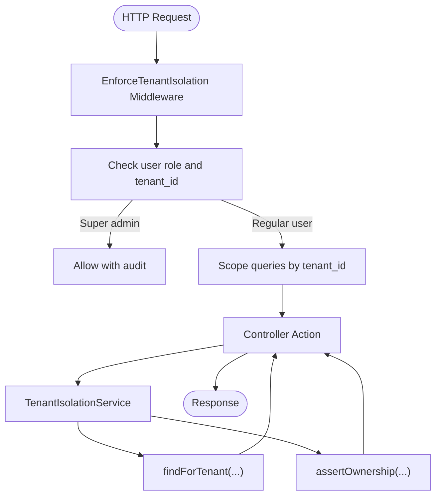
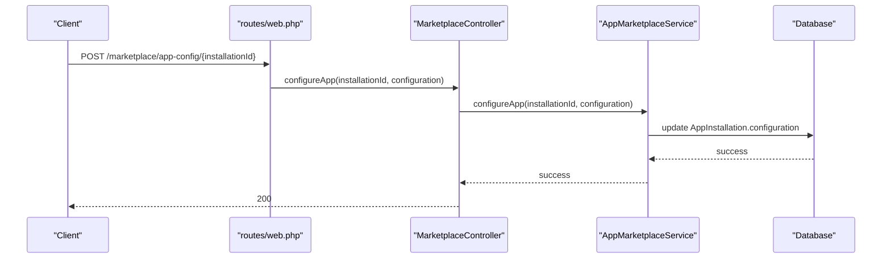
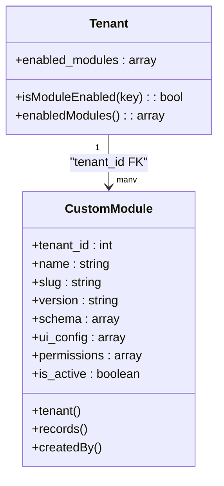
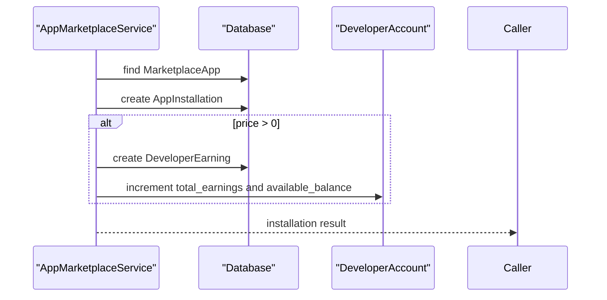
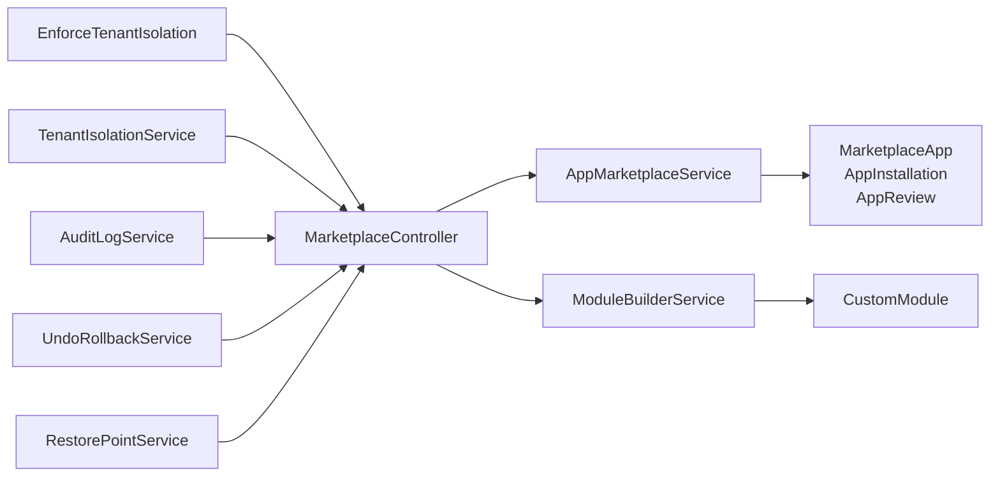

# App Installation & Management

<cite>
**Referenced Files in This Document**
- [web.php](file://routes/web.php)
- [MarketplaceController.php](file://app/Http/Controllers/Marketplace/MarketplaceController.php)
- [AppMarketplaceService.php](file://app/Services/Marketplace/AppMarketplaceService.php)
- [ModuleBuilderService.php](file://app/Services/Marketplace/ModuleBuilderService.php)
- [TenantIsolationService.php](file://app/Services/TenantIsolationService.php)
- [EnforceTenantIsolation.php](file://app/Http/Middleware/EnforceTenantIsolation.php)
- [Tenant.php](file://app/Models/Tenant.php)
- [2026_04_06_130000_create_marketplace_tables.php](file://database/migrations/2026_04_06_130000_create_marketplace_tables.php)
- [2026_03_23_000058_add_enabled_modules_to_tenants.php](file://database/migrations/2026_03_23_000058_add_enabled_modules_to_tenants.php)
- [CustomModule.php](file://app/Models/CustomModule.php)
- [AuditLogService.php](file://app/Services/Security/AuditLogService.php)
- [UndoRollbackService.php](file://app/Services/UndoRollbackService.php)
- [RestorePointService.php](file://app/Services/RestorePointService.php)
- [ErrorHandlingController.php](file://app/Http/Controllers/ErrorHandlingController.php)
</cite>

## Table of Contents
1. [Introduction](#introduction)
2. [Project Structure](#project-structure)
3. [Core Components](#core-components)
4. [Architecture Overview](#architecture-overview)
5. [Detailed Component Analysis](#detailed-component-analysis)
6. [Dependency Analysis](#dependency-analysis)
7. [Performance Considerations](#performance-considerations)
8. [Troubleshooting Guide](#troubleshooting-guide)
9. [Conclusion](#conclusion)

## Introduction
This document describes the App Installation and Management system within the platform. It covers the complete lifecycle from initial download and installation to tenant activation, configuration setup, updates, version control, deactivation, and tenant isolation. It also documents configuration management, permission handling, resource allocation, and provides troubleshooting guidance for installation issues, rollback procedures, and monitoring success rates.

## Project Structure
The App Installation and Management system spans routing, controllers, services, middleware, models, and migrations. Key areas include:
- Marketplace routes and controller actions for browsing, installing, configuring, and uninstalling apps
- Services orchestrating installation, configuration, reviews, and monetization
- Tenant isolation enforcement via middleware and dedicated service helpers
- Custom module builder for tenant-scoped extensions
- Audit and recovery services supporting rollback and restore points

**Diagram sources**
- [web.php:2890-2905](file://routes/web.php#L2890-L2905)
- [MarketplaceController.php:1-673](file://app/Http/Controllers/Marketplace/MarketplaceController.php#L1-L673)
- [AppMarketplaceService.php:1-290](file://app/Services/Marketplace/AppMarketplaceService.php#L1-L290)
- [ModuleBuilderService.php:1-174](file://app/Services/Marketplace/ModuleBuilderService.php#L1-L174)
- [EnforceTenantIsolation.php:1-46](file://app/Http/Middleware/EnforceTenantIsolation.php#L1-L46)
- [TenantIsolationService.php:1-67](file://app/Services/TenantIsolationService.php#L1-L67)
- [AuditLogService.php:1-214](file://app/Services/Security/AuditLogService.php#L1-L214)
- [UndoRollbackService.php:1-154](file://app/Services/UndoRollbackService.php#L1-L154)
- [RestorePointService.php:1-170](file://app/Services/RestorePointService.php#L1-L170)

**Section sources**
- [web.php:2890-2905](file://routes/web.php#L2890-L2905)
- [MarketplaceController.php:1-673](file://app/Http/Controllers/Marketplace/MarketplaceController.php#L1-L673)

## Core Components
- Marketplace routes expose endpoints for browsing apps, installing/uninstalling, configuring, and reviewing apps, as well as managing tenant apps.
- MarketplaceController delegates to AppMarketplaceService for installation, configuration, uninstallation, and reviews; to ModuleBuilderService for custom module creation and schema updates.
- AppMarketplaceService encapsulates installation logic, permission capture, configuration persistence, and monetization recording.
- TenantIsolationService and EnforceTenantIsolation middleware ensure tenant-scoped access and ownership checks.
- CustomModule and ModuleBuilderService support tenant-scoped custom modules with versioning and UI configuration.
- AuditLogService, UndoRollbackService, and RestorePointService provide auditing, undo/rollback, and restore capabilities.

**Section sources**
- [web.php:2890-2905](file://routes/web.php#L2890-L2905)
- [MarketplaceController.php:60-141](file://app/Http/Controllers/Marketplace/MarketplaceController.php#L60-L141)
- [AppMarketplaceService.php:66-157](file://app/Services/Marketplace/AppMarketplaceService.php#L66-L157)
- [TenantIsolationService.php:16-66](file://app/Services/TenantIsolationService.php#L16-L66)
- [EnforceTenantIsolation.php:19-46](file://app/Http/Middleware/EnforceTenantIsolation.php#L19-L46)
- [ModuleBuilderService.php:14-174](file://app/Services/Marketplace/ModuleBuilderService.php#L14-L174)
- [CustomModule.php:10-46](file://app/Models/CustomModule.php#L10-L46)
- [AuditLogService.php:13-81](file://app/Services/Security/AuditLogService.php#L13-L81)
- [UndoRollbackService.php:13-90](file://app/Services/UndoRollbackService.php#L13-L90)
- [RestorePointService.php:14-117](file://app/Services/RestorePointService.php#L14-L117)

## Architecture Overview
The system follows a layered architecture:
- Presentation: HTTP routes and controller actions
- Application: Services coordinating domain operations
- Domain: Models representing marketplace apps, installations, reviews, and custom modules
- Infrastructure: Middleware for tenant isolation and audit/recovery services

**Diagram sources**
- [web.php:2890-2905](file://routes/web.php#L2890-L2905)
- [MarketplaceController.php:13-28](file://app/Http/Controllers/Marketplace/MarketplaceController.php#L13-L28)
- [AppMarketplaceService.php:10-290](file://app/Services/Marketplace/AppMarketplaceService.php#L10-L290)
- [ModuleBuilderService.php:9-174](file://app/Services/Marketplace/ModuleBuilderService.php#L9-L174)
- [TenantIsolationService.php:16-66](file://app/Services/TenantIsolationService.php#L16-L66)
- [EnforceTenantIsolation.php:19-46](file://app/Http/Middleware/EnforceTenantIsolation.php#L19-L46)
- [AuditLogService.php:8-214](file://app/Services/Security/AuditLogService.php#L8-L214)
- [UndoRollbackService.php:8-154](file://app/Services/UndoRollbackService.php#L8-L154)
- [RestorePointService.php:9-170](file://app/Services/RestorePointService.php#L9-L170)

## Detailed Component Analysis

### App Installation Workflow
The installation workflow begins with a user-initiated install request and proceeds through validation, duplication checks, installation record creation, and monetization logging.

**Diagram sources**
- [web.php:2896-2897](file://routes/web.php#L2896-L2897)
- [MarketplaceController.php:68-77](file://app/Http/Controllers/Marketplace/MarketplaceController.php#L68-L77)
- [AppMarketplaceService.php:69-117](file://app/Services/Marketplace/AppMarketplaceService.php#L69-L117)

**Section sources**
- [web.php:2896-2897](file://routes/web.php#L2896-L2897)
- [MarketplaceController.php:68-77](file://app/Http/Controllers/Marketplace/MarketplaceController.php#L68-L77)
- [AppMarketplaceService.php:69-117](file://app/Services/Marketplace/AppMarketplaceService.php#L69-L117)

### App Lifecycle Management: Updates, Version Control, Deactivation
- Updates and version control: Custom modules support schema updates with semantic version increments. The system captures schema changes and increments the patch version upon successful updates.
- Deactivation: Uninstalling sets the installation status to uninstalled, effectively deactivating the app for the tenant.

**Diagram sources**
- [ModuleBuilderService.php:35-45](file://app/Services/Marketplace/ModuleBuilderService.php#L35-L45)
- [ModuleBuilderService.php:164-173](file://app/Services/Marketplace/ModuleBuilderService.php#L164-L173)
- [AppMarketplaceService.php:122-137](file://app/Services/Marketplace/AppMarketplaceService.php#L122-L137)

**Section sources**
- [ModuleBuilderService.php:35-45](file://app/Services/Marketplace/ModuleBuilderService.php#L35-L45)
- [ModuleBuilderService.php:164-173](file://app/Services/Marketplace/ModuleBuilderService.php#L164-L173)
- [AppMarketplaceService.php:122-137](file://app/Services/Marketplace/AppMarketplaceService.php#L122-L137)

### Tenant Isolation Mechanisms
Tenant isolation ensures that all operations remain scoped to the authenticated user’s tenant. The middleware enforces isolation for route-bound models, while the TenantIsolationService provides helper methods for safe retrieval and ownership assertions.

**Diagram sources**
- [EnforceTenantIsolation.php:28-46](file://app/Http/Middleware/EnforceTenantIsolation.php#L28-L46)
- [TenantIsolationService.php:25-65](file://app/Services/TenantIsolationService.php#L25-L65)

**Section sources**
- [EnforceTenantIsolation.php:19-46](file://app/Http/Middleware/EnforceTenantIsolation.php#L19-L46)
- [TenantIsolationService.php:16-66](file://app/Services/TenantIsolationService.php#L16-L66)

### App Configuration Management and Permissions
- Configuration: Installed apps maintain a configuration object stored with the installation record. Configuration updates are applied atomically.
- Permissions: Installation records capture required permissions from the marketplace app definition, enabling policy enforcement and visibility controls.

**Diagram sources**
- [web.php:2904-2905](file://routes/web.php#L2904-L2905)
- [MarketplaceController.php:95-103](file://app/Http/Controllers/Marketplace/MarketplaceController.php#L95-L103)
- [AppMarketplaceService.php:142-157](file://app/Services/Marketplace/AppMarketplaceService.php#L142-L157)

**Section sources**
- [web.php:2904-2905](file://routes/web.php#L2904-L2905)
- [MarketplaceController.php:95-103](file://app/Http/Controllers/Marketplace/MarketplaceController.php#L95-L103)
- [AppMarketplaceService.php:84-93](file://app/Services/Marketplace/AppMarketplaceService.php#L84-L93)
- [AppMarketplaceService.php:142-157](file://app/Services/Marketplace/AppMarketplaceService.php#L142-L157)

### Resource Allocation and Module Enablement
- Tenant module enablement: Tenants can selectively enable modules via a JSON array stored in the tenants table. The Tenant model exposes helpers to check and enumerate enabled modules.
- Custom modules: Each tenant can define custom modules with schema, UI configuration, and permissions. These are tenant-scoped and versioned.

**Diagram sources**
- [Tenant.php:64-75](file://app/Models/Tenant.php#L64-L75)
- [2026_03_23_000058_add_enabled_modules_to_tenants.php:11-14](file://database/migrations/2026_03_23_000058_add_enabled_modules_to_tenants.php#L11-L14)
- [CustomModule.php:10-46](file://app/Models/CustomModule.php#L10-L46)
- [ModuleBuilderService.php:14-30](file://app/Services/Marketplace/ModuleBuilderService.php#L14-L30)

**Section sources**
- [Tenant.php:64-75](file://app/Models/Tenant.php#L64-L75)
- [2026_03_23_000058_add_enabled_modules_to_tenants.php:11-14](file://database/migrations/2026_03_23_000058_add_enabled_modules_to_tenants.php#L11-L14)
- [CustomModule.php:10-46](file://app/Models/CustomModule.php#L10-L46)
- [ModuleBuilderService.php:14-30](file://app/Services/Marketplace/ModuleBuilderService.php#L14-L30)

### Monetization and Reviews
- Earnings: For paid apps, platform and developer earnings are recorded during installation, including platform fees and net amounts credited to developer accounts.
- Reviews: Users who have installed an app can submit reviews; verified purchase flags are set based on installation history.

**Diagram sources**
- [AppMarketplaceService.php:98-101](file://app/Services/Marketplace/AppMarketplaceService.php#L98-L101)
- [AppMarketplaceService.php:263-288](file://app/Services/Marketplace/AppMarketplaceService.php#L263-L288)

**Section sources**
- [AppMarketplaceService.php:98-101](file://app/Services/Marketplace/AppMarketplaceService.php#L98-L101)
- [AppMarketplaceService.php:162-198](file://app/Services/Marketplace/AppMarketplaceService.php#L162-L198)
- [AppMarketplaceService.php:263-288](file://app/Services/Marketplace/AppMarketplaceService.php#L263-L288)

## Dependency Analysis
The system exhibits clear separation of concerns:
- Controllers depend on services for business logic
- Services depend on models and database migrations
- Middleware and isolation services enforce cross-cutting tenant scoping
- Audit and recovery services provide operational safety nets

**Diagram sources**
- [MarketplaceController.php:13-28](file://app/Http/Controllers/Marketplace/MarketplaceController.php#L13-L28)
- [AppMarketplaceService.php:10-290](file://app/Services/Marketplace/AppMarketplaceService.php#L10-L290)
- [ModuleBuilderService.php:9-174](file://app/Services/Marketplace/ModuleBuilderService.php#L9-L174)
- [TenantIsolationService.php:16-66](file://app/Services/TenantIsolationService.php#L16-L66)
- [EnforceTenantIsolation.php:19-46](file://app/Http/Middleware/EnforceTenantIsolation.php#L19-L46)
- [AuditLogService.php:8-214](file://app/Services/Security/AuditLogService.php#L8-L214)
- [UndoRollbackService.php:8-154](file://app/Services/UndoRollbackService.php#L8-L154)
- [RestorePointService.php:9-170](file://app/Services/RestorePointService.php#L9-L170)

**Section sources**
- [MarketplaceController.php:13-28](file://app/Http/Controllers/Marketplace/MarketplaceController.php#L13-L28)
- [AppMarketplaceService.php:10-290](file://app/Services/Marketplace/AppMarketplaceService.php#L10-L290)
- [ModuleBuilderService.php:9-174](file://app/Services/Marketplace/ModuleBuilderService.php#L9-L174)
- [TenantIsolationService.php:16-66](file://app/Services/TenantIsolationService.php#L16-L66)
- [EnforceTenantIsolation.php:19-46](file://app/Http/Middleware/EnforceTenantIsolation.php#L19-L46)
- [AuditLogService.php:8-214](file://app/Services/Security/AuditLogService.php#L8-L214)
- [UndoRollbackService.php:8-154](file://app/Services/UndoRollbackService.php#L8-L154)
- [RestorePointService.php:9-170](file://app/Services/RestorePointService.php#L9-L170)

## Performance Considerations
- Pagination and filtering: Marketplace listings apply filters and pagination to reduce payload sizes and database load.
- Indexing: Migrations include strategic indexes on marketplace tables to accelerate lookups by category, status, rating, and timestamps.
- Minimal ORM overhead: Services keep logic focused on essential operations to avoid N+1 queries and excessive hydration.

[No sources needed since this section provides general guidance]

## Troubleshooting Guide
Common installation issues and resolutions:
- Duplicate installation: If an app is already installed for a tenant, installation is rejected. Uninstall first or reuse configuration.
- Paid app monetization failures: Earnings recording errors are logged; verify pricing model and account balances.
- Configuration update failures: Ensure the installation exists and the configuration payload is valid JSON.
- Tenant isolation violations: Ownership checks prevent cross-tenant access; confirm user tenant context and model scoping.

Rollback and recovery procedures:
- Undo recent actions: Use the undo service to revert user actions within the expiration window.
- Restore points: Create pre-change restore points and restore from them when needed.
- Audit trails: Review audit logs for events, user agents, IP addresses, and metadata to diagnose issues.

Monitoring installation success rates:
- Track installation outcomes and errors via centralized logging and error handling endpoints.
- Use audit logs to monitor user activity and installation-related events.

**Section sources**
- [AppMarketplaceService.php:74-81](file://app/Services/Marketplace/AppMarketplaceService.php#L74-L81)
- [AppMarketplaceService.php:108-116](file://app/Services/Marketplace/AppMarketplaceService.php#L108-L116)
- [AppMarketplaceService.php:149-156](file://app/Services/Marketplace/AppMarketplaceService.php#L149-L156)
- [UndoRollbackService.php:32-59](file://app/Services/UndoRollbackService.php#L32-L59)
- [RestorePointService.php:54-117](file://app/Services/RestorePointService.php#L54-L117)
- [AuditLogService.php:13-32](file://app/Services/Security/AuditLogService.php#L13-L32)
- [ErrorHandlingController.php:12-32](file://app/Http/Controllers/ErrorHandlingController.php#L12-L32)

## Conclusion
The App Installation and Management system integrates marketplace operations, tenant isolation, configuration management, and robust recovery mechanisms. By leveraging services, middleware, and audit/recovery utilities, it ensures secure, auditable, and tenant-scoped app lifecycle management with clear pathways for updates, deactivation, and troubleshooting.