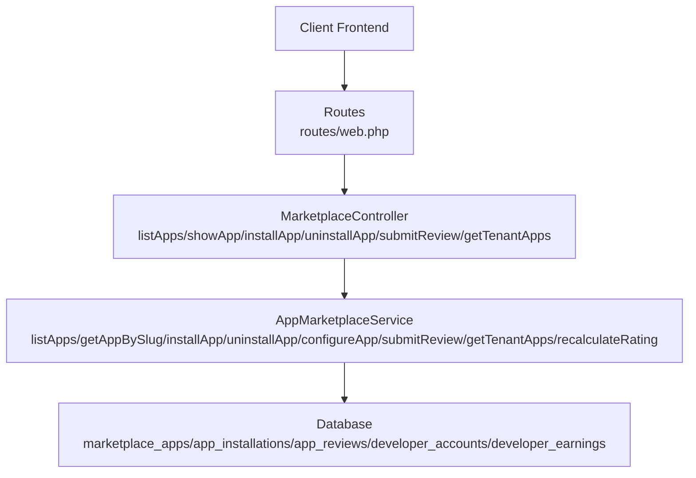
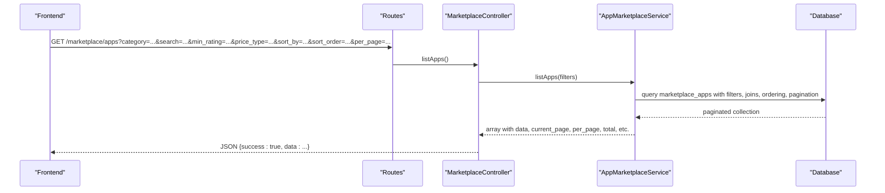
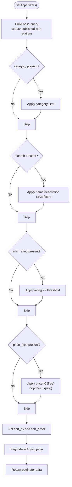
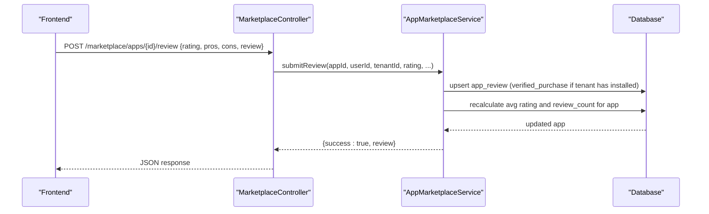
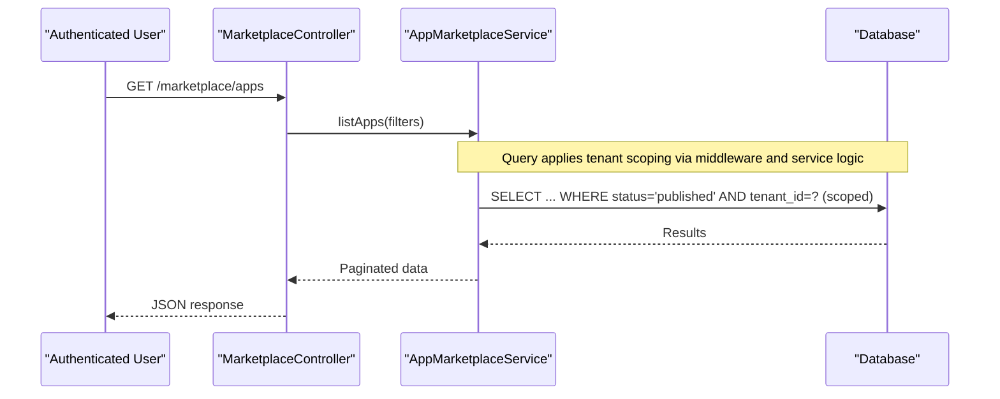
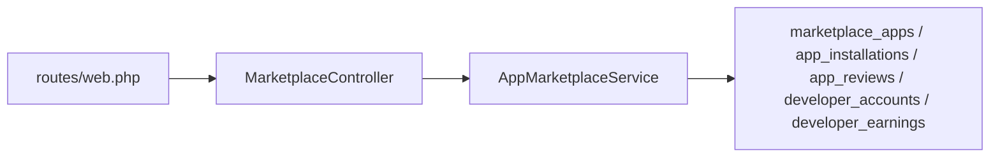

# App Marketplace Discovery

<cite>
**Referenced Files in This Document**
- [AppMarketplaceService.php](file://app/Services/Marketplace/AppMarketplaceService.php)
- [MarketplaceController.php](file://app/Http/Controllers/Marketplace/MarketplaceController.php)
- [create_marketplace_tables.php](file://database/migrations/2026_04_06_130000_create_marketplace_tables.php)
- [web.php](file://routes/web.php)
- [TenantIsolationService.php](file://app/Services/TenantIsolationService.php)
- [MarketplaceSyncTest.php](file://tests/Feature/MarketplaceSyncTest.php)
</cite>

## Table of Contents
1. [Introduction](#introduction)
2. [Project Structure](#project-structure)
3. [Core Components](#core-components)
4. [Architecture Overview](#architecture-overview)
5. [Detailed Component Analysis](#detailed-component-analysis)
6. [Dependency Analysis](#dependency-analysis)
7. [Performance Considerations](#performance-considerations)
8. [Troubleshooting Guide](#troubleshooting-guide)
9. [Conclusion](#conclusion)
10. [Appendices](#appendices)

## Introduction
This document describes the App Marketplace Discovery feature, covering the complete app browsing and filtering system, search functionality, rating systems, sorting mechanisms, pagination, and tenant-based discovery. It also documents the app listing API endpoints, response formats, filtering parameters, and integration patterns for frontend implementations. The backend is implemented in PHP/Laravel with dedicated controller and service layers, backed by relational database tables designed for marketplace apps, installations, reviews, and developer monetization.

## Project Structure
The marketplace discovery feature spans routing, controllers, services, and database schema:

- Routing exposes marketplace endpoints under the marketplace namespace.
- Controllers orchestrate requests and delegate to services.
- Services encapsulate business logic for listing, installing, reviewing, and managing apps.
- Database migrations define marketplace app, installation, review, developer, and monetization tables.

**Diagram sources**
- [web.php:2724-2734](file://routes/web.php#L2724-L2734)
- [MarketplaceController.php:37-141](file://app/Http/Controllers/Marketplace/MarketplaceController.php#L37-L141)
- [AppMarketplaceService.php:15-219](file://app/Services/Marketplace/AppMarketplaceService.php#L15-L219)
- [create_marketplace_tables.php:14-118](file://database/migrations/2026_04_06_130000_create_marketplace_tables.php#L14-L118)

**Section sources**
- [web.php:2724-2734](file://routes/web.php#L2724-L2734)
- [MarketplaceController.php:37-141](file://app/Http/Controllers/Marketplace/MarketplaceController.php#L37-L141)
- [AppMarketplaceService.php:15-219](file://app/Services/Marketplace/AppMarketplaceService.php#L15-L219)
- [create_marketplace_tables.php:14-118](file://database/migrations/2026_04_06_130000_create_marketplace_tables.php#L14-L118)

## Core Components
- AppMarketplaceService: Implements filtering, search, sorting, pagination, app retrieval by slug, installation, uninstallation, configuration, review submission, tenant app listing, and rating recalculation.
- MarketplaceController: Exposes REST endpoints for browsing, viewing, installing, uninstalling, configuring, reviewing, and listing tenant apps.
- Database schema: Defines marketplace_apps, app_installations, app_reviews, developer_accounts, and developer_earnings tables with appropriate indexes and relationships.

Key capabilities:
- Category-based filtering and free/paid price filtering
- Full-text-like search across name and description
- Minimum rating filtering
- Sorting by multiple fields with configurable order
- Pagination with configurable page size
- Tenant-scoped app visibility and isolation
- Review and rating aggregation

**Section sources**
- [AppMarketplaceService.php:15-219](file://app/Services/Marketplace/AppMarketplaceService.php#L15-L219)
- [MarketplaceController.php:37-141](file://app/Http/Controllers/Marketplace/MarketplaceController.php#L37-L141)
- [create_marketplace_tables.php:14-118](file://database/migrations/2026_04_06_130000_create_marketplace_tables.php#L14-L118)

## Architecture Overview
The marketplace discovery follows a layered architecture:
- Presentation: HTTP endpoints in MarketplaceController
- Application: AppMarketplaceService orchestrates domain operations
- Persistence: Eloquent models mapped to marketplace tables
- Tenant isolation: Enforced via middleware and service helpers

**Diagram sources**
- [web.php:2728](file://routes/web.php#L2728)
- [MarketplaceController.php:37-46](file://app/Http/Controllers/Marketplace/MarketplaceController.php#L37-L46)
- [AppMarketplaceService.php:15-52](file://app/Services/Marketplace/AppMarketplaceService.php#L15-L52)

## Detailed Component Analysis

### API Endpoints and Filtering
- Endpoint: GET /marketplace/apps
  - Purpose: Browse published marketplace apps with optional filters and sorting
  - Query parameters:
    - category: string
    - search: string (name or description)
    - min_rating: number (1-5)
    - price_type: string (free | paid)
    - sort_by: string (published_at | rating | download_count | created_at)
    - sort_order: string (asc | desc)
    - per_page: integer (default 20)
  - Response shape:
    - success: boolean
    - data: paginator object containing collection and pagination metadata

- Endpoint: GET /marketplace/apps/{slug}
  - Purpose: Retrieve a single published app by slug with developer and reviews populated

- Endpoint: POST /marketplace/apps/{id}/install
  - Purpose: Install an app for the authenticated user’s tenant
  - Response: success flag and installation details or error message

- Endpoint: DELETE /marketplace/apps/{id}
  - Purpose: Uninstall an app by installation ID

- Endpoint: POST /marketplace/apps/{id}/review
  - Purpose: Submit a review for an app after verifying tenant installation

- Endpoint: GET /marketplace/apps/my-apps
  - Purpose: List tenant’s currently installed apps with configuration and expiry info

**Section sources**
- [web.php:2728-2734](file://routes/web.php#L2728-L2734)
- [MarketplaceController.php:37-141](file://app/Http/Controllers/Marketplace/MarketplaceController.php#L37-L141)
- [AppMarketplaceService.php:15-219](file://app/Services/Marketplace/AppMarketplaceService.php#L15-L219)

### Filtering and Search Algorithm
- Category filter: exact match on category field
- Search filter: name LIKE %term% OR description LIKE %term%
- Minimum rating filter: rating >= threshold
- Price type filter: price = 0 for free, price > 0 for paid
- Sorting: configurable field and direction; defaults to published_at descending
- Pagination: Laravel paginator with configurable per_page

**Diagram sources**
- [AppMarketplaceService.php:15-52](file://app/Services/Marketplace/AppMarketplaceService.php#L15-L52)

**Section sources**
- [AppMarketplaceService.php:15-52](file://app/Services/Marketplace/AppMarketplaceService.php#L15-L52)

### Rating System and Reviews
- Reviews are stored in app_reviews with per-user-per-app uniqueness.
- Verified purchase flag is set when the submitting user has installed the app for the same tenant.
- Average rating and review count are recalculated and persisted to the app record.

**Diagram sources**
- [MarketplaceController.php:108-128](file://app/Http/Controllers/Marketplace/MarketplaceController.php#L108-L128)
- [AppMarketplaceService.php:162-198](file://app/Services/Marketplace/AppMarketplaceService.php#L162-L198)

**Section sources**
- [AppMarketplaceService.php:162-198](file://app/Services/Marketplace/AppMarketplaceService.php#L162-L198)

### Tenant-Based Discovery and Isolation
- Tenant isolation is enforced via middleware and service helpers.
- The tenant ID is used to scope app installations and reviews.
- Tests demonstrate that users from one tenant cannot access another tenant’s marketplace data.

**Diagram sources**
- [web.php:2724](file://routes/web.php#L2724)
- [TenantIsolationService.php:25-43](file://app/Services/TenantIsolationService.php#L25-L43)
- [MarketplaceSyncTest.php:258-282](file://tests/Feature/MarketplaceSyncTest.php#L258-L282)

**Section sources**
- [TenantIsolationService.php:25-43](file://app/Services/TenantIsolationService.php#L25-L43)
- [MarketplaceSyncTest.php:258-282](file://tests/Feature/MarketplaceSyncTest.php#L258-L282)

### App Metadata Structure
The marketplace app entity includes:
- Identity: name, slug, version
- Developer: foreign key to user (developer)
- Categorization: category
- Media: screenshots (JSON array), icon_url
- Pricing: price (decimal), pricing_model (one_time | subscription | freemium), subscription_price, subscription_period
- Descriptive: description, features (JSON array), requirements (JSON array), documentation_url, support_url, repository_url
- Lifecycle: status (pending | approved | rejected | published), rejection_reason, published_at
- Metrics: download_count, rating, review_count
- Auditing: timestamps

Installations include:
- Unique installation_id per tenant per app
- Status (active | inactive | uninstalled)
- Configuration and permissions
- Installed/expiry dates and sync timestamps

Reviews include:
- Unique per app-user
- Rating (1-5), review text, pros/cons arrays
- Verified purchase and approval flags
- Tenant scoping

**Section sources**
- [create_marketplace_tables.php:14-44](file://database/migrations/2026_04_06_130000_create_marketplace_tables.php#L14-L44)
- [create_marketplace_tables.php:46-62](file://database/migrations/2026_04_06_130000_create_marketplace_tables.php#L46-L62)
- [create_marketplace_tables.php:64-80](file://database/migrations/2026_04_06_130000_create_marketplace_tables.php#L64-L80)

### API Responses and Examples
- listApps response:
  - success: boolean
  - data: paginator with collection and metadata (current_page, from, to, last_page, path, per_page, total, data[])
- showApp response:
  - success: boolean
  - data: app object with developer and reviews populated
- installApp/uninstallApp/configureApp/submitReview/getTenantApps responses:
  - success: boolean
  - message or data as applicable

Frontend integration patterns:
- Use category and search query params to filter lists
- Apply min_rating and price_type for refinement
- Use sort_by and sort_order to change ranking
- Use per_page to control batch sizes
- After installation, call my-apps endpoint to refresh the installed apps list

**Section sources**
- [MarketplaceController.php:37-141](file://app/Http/Controllers/Marketplace/MarketplaceController.php#L37-L141)
- [AppMarketplaceService.php:15-219](file://app/Services/Marketplace/AppMarketplaceService.php#L15-L219)

## Dependency Analysis
- Controller depends on AppMarketplaceService for business logic.
- AppMarketplaceService depends on Eloquent models mapped to marketplace tables.
- Routes are grouped under marketplace with auth middleware.
- Tenant isolation is enforced at the route group level and via service helpers.

**Diagram sources**
- [web.php:2724-2734](file://routes/web.php#L2724-L2734)
- [MarketplaceController.php:21-28](file://app/Http/Controllers/Marketplace/MarketplaceController.php#L21-L28)
- [AppMarketplaceService.php:5-8](file://app/Services/Marketplace/AppMarketplaceService.php#L5-L8)

**Section sources**
- [web.php:2724-2734](file://routes/web.php#L2724-L2734)
- [MarketplaceController.php:21-28](file://app/Http/Controllers/Marketplace/MarketplaceController.php#L21-L28)
- [AppMarketplaceService.php:5-8](file://app/Services/Marketplace/AppMarketplaceService.php#L5-L8)

## Performance Considerations
- Indexes on marketplace_apps: category, status, rating, developer_id, published_at
- Indexes on app_installations: tenant_id, status, unique(marketplace_app_id, tenant_id)
- Indexes on app_reviews: rating, unique(marketplace_app_id, user_id)
- Pagination reduces payload size; choose per_page thoughtfully.
- Eager loading of developer and reviews avoids N+1 queries.
- Consider adding composite indexes for frequent filter combinations (e.g., category + status).

[No sources needed since this section provides general guidance]

## Troubleshooting Guide
Common issues and resolutions:
- App not found by slug: Ensure status is published and slug matches exactly.
- Installation fails: Verify tenant_id correctness and that the app is not already installed for the tenant.
- Review submission errors: Ensure the user has installed the app for the tenant; verified_purchase requires a matching installation.
- Pagination anomalies: Confirm per_page is within acceptable limits and current_page aligns with expected range.
- Tenant isolation failures: Confirm auth middleware is applied and tenant_id is correctly derived from the authenticated user.

**Section sources**
- [MarketplaceController.php:51-63](file://app/Http/Controllers/Marketplace/MarketplaceController.php#L51-L63)
- [AppMarketplaceService.php:69-117](file://app/Services/Marketplace/AppMarketplaceService.php#L69-L117)
- [AppMarketplaceService.php:162-198](file://app/Services/Marketplace/AppMarketplaceService.php#L162-L198)
- [MarketplaceSyncTest.php:258-282](file://tests/Feature/MarketplaceSyncTest.php#L258-L282)

## Conclusion
The App Marketplace Discovery feature provides a robust, tenant-aware system for browsing, filtering, and interacting with third-party apps. Its clean separation of concerns, strong indexing, and explicit tenant scoping enable scalable and secure multi-tenant app distribution. Frontend teams can integrate seamlessly using the documented endpoints and parameters.

[No sources needed since this section summarizes without analyzing specific files]

## Appendices

### API Reference Summary
- GET /marketplace/apps
  - Filters: category, search, min_rating, price_type, sort_by, sort_order, per_page
  - Response: success + paginator data
- GET /marketplace/apps/{slug}
  - Response: success + app with developer and reviews
- POST /marketplace/apps/{id}/install
  - Response: success + installation details or error
- DELETE /marketplace/apps/{id}
  - Response: success + message
- POST /marketplace/apps/{id}/review
  - Body: rating (1-5), review (optional), pros (array), cons (array)
  - Response: success + review or error
- GET /marketplace/apps/my-apps
  - Response: success + array of installations with app metadata

**Section sources**
- [web.php:2728-2734](file://routes/web.php#L2728-L2734)
- [MarketplaceController.php:37-141](file://app/Http/Controllers/Marketplace/MarketplaceController.php#L37-L141)