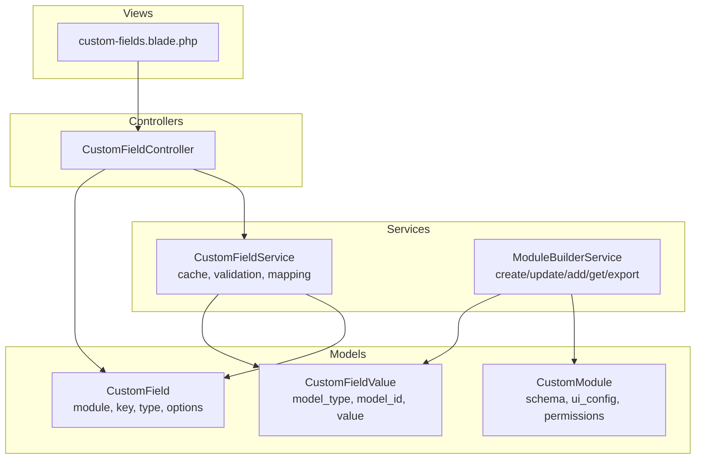
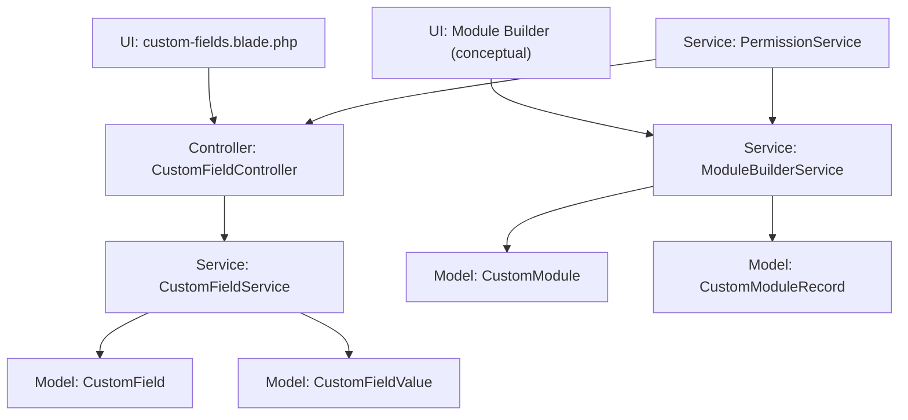
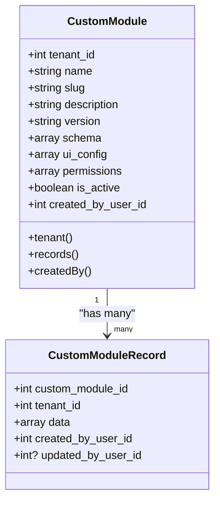
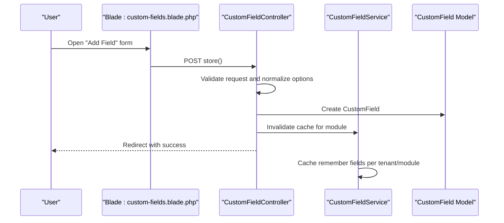
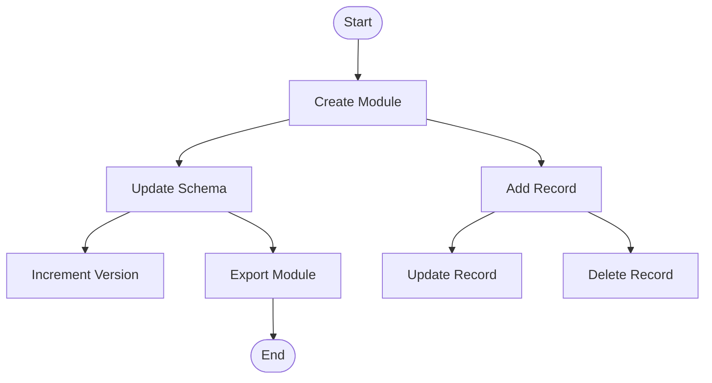
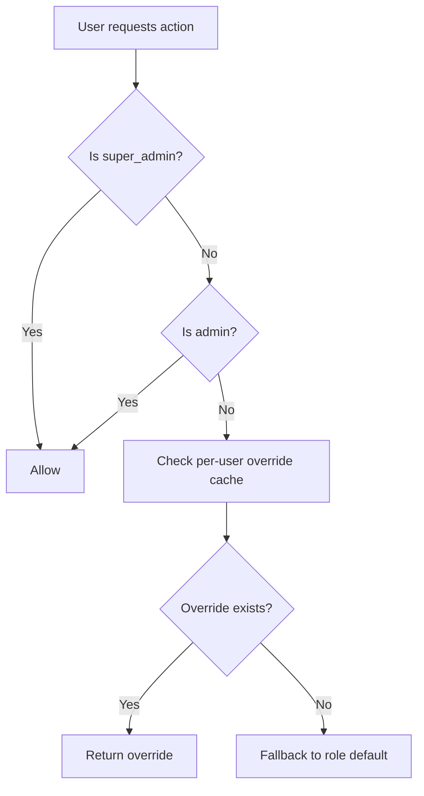
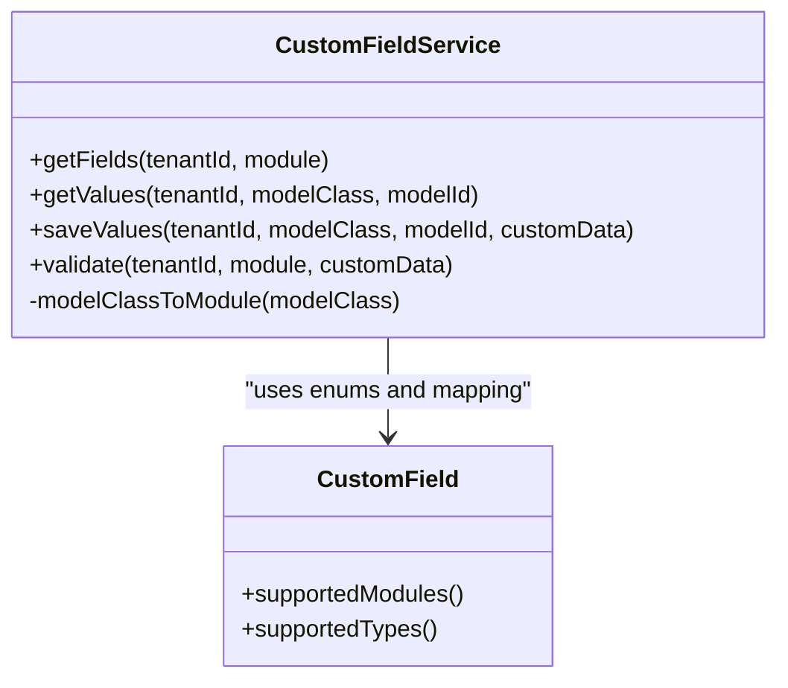
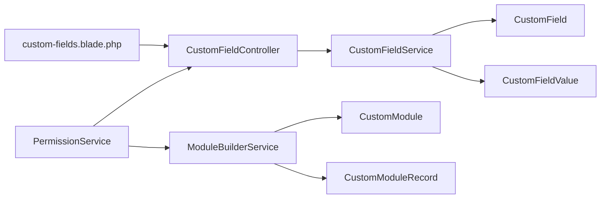

# Custom Module Builder

<cite>
**Referenced Files in This Document**
- [CustomModule.php](file://app/Models/CustomModule.php)
- [CustomField.php](file://app/Models/CustomField.php)
- [CustomFieldValue.php](file://app/Models/CustomFieldValue.php)
- [CustomFieldController.php](file://app/Http/Controllers/CustomFieldController.php)
- [CustomFieldService.php](file://app/Services/CustomFieldService.php)
- [ModuleBuilderService.php](file://app/Services/Marketplace/ModuleBuilderService.php)
- [PermissionService.php](file://app/Services/Security/PermissionService.php)
- [custom-fields.blade.php](file://resources/views/settings/custom-fields.blade.php)
</cite>

## Table of Contents
1. [Introduction](#introduction)
2. [Project Structure](#project-structure)
3. [Core Components](#core-components)
4. [Architecture Overview](#architecture-overview)
5. [Detailed Component Analysis](#detailed-component-analysis)
6. [Dependency Analysis](#dependency-analysis)
7. [Performance Considerations](#performance-considerations)
8. [Troubleshooting Guide](#troubleshooting-guide)
9. [Conclusion](#conclusion)
10. [Appendices](#appendices)

## Introduction
This document explains the Custom Module Builder functionality that enables tenants to define and manage custom modules and dynamic fields within the ERP. It covers the visual module creation interface, schema design tools, UI configuration options, and the end-to-end development workflow from concept to deployment. It also details module lifecycle management (updates, versioning, tenant isolation), export/import capabilities, templates, and reusability patterns. Guidance is included for integrating custom modules with existing ERP modules and establishing robust permission systems.

## Project Structure
The Custom Module Builder spans models, controllers, services, and Blade views:
- Models define domain entities for modules, fields, and values.
- Controllers expose CRUD endpoints for managing custom fields via a UI.
- Services encapsulate business logic for schema updates, records, and exports.
- Views render the visual builder and configuration panels.

**Diagram sources**
- [CustomModule.php:10-46](file://app/Models/CustomModule.php#L10-L46)
- [CustomField.php:11-56](file://app/Models/CustomField.php#L11-L56)
- [CustomFieldValue.php](file://app/Models/CustomFieldValue.php)
- [CustomFieldController.php:9-116](file://app/Http/Controllers/CustomFieldController.php#L9-L116)
- [CustomFieldService.php:14-117](file://app/Services/CustomFieldService.php#L14-L117)
- [ModuleBuilderService.php:9-175](file://app/Services/Marketplace/ModuleBuilderService.php#L9-L175)
- [custom-fields.blade.php:1-155](file://resources/views/settings/custom-fields.blade.php#L1-L155)

**Section sources**
- [CustomModule.php:10-46](file://app/Models/CustomModule.php#L10-L46)
- [CustomField.php:11-56](file://app/Models/CustomField.php#L11-L56)
- [CustomFieldController.php:9-116](file://app/Http/Controllers/CustomFieldController.php#L9-L116)
- [CustomFieldService.php:14-117](file://app/Services/CustomFieldService.php#L14-L117)
- [ModuleBuilderService.php:9-175](file://app/Services/Marketplace/ModuleBuilderService.php#L9-L175)
- [custom-fields.blade.php:1-155](file://resources/views/settings/custom-fields.blade.php#L1-L155)

## Core Components
- CustomModule: Stores module metadata, tenant association, schema, UI configuration, permissions, and activation state.
- CustomField: Defines dynamic attributes per module with type, options, ordering, and activation.
- CustomFieldValue: Stores per-record values for custom fields.
- CustomFieldController: Manages field CRUD with validation, uniqueness, and UI rendering.
- CustomFieldService: Provides caching, validation, and mapping between model classes and modules.
- ModuleBuilderService: Handles module creation, schema updates, record management, filtering, and export.
- PermissionService: Enforces tenant-aware permissions for module access and actions.
- custom-fields.blade.php: Visual UI for creating, editing, and organizing custom fields.

**Section sources**
- [CustomModule.php:14-32](file://app/Models/CustomModule.php#L14-L32)
- [CustomField.php:14-23](file://app/Models/CustomField.php#L14-L23)
- [CustomFieldController.php:15-74](file://app/Http/Controllers/CustomFieldController.php#L15-L74)
- [CustomFieldService.php:19-92](file://app/Services/CustomFieldService.php#L19-L92)
- [ModuleBuilderService.php:14-30](file://app/Services/Marketplace/ModuleBuilderService.php#L14-L30)
- [PermissionService.php:207-227](file://app/Services/Security/PermissionService.php#L207-L227)
- [custom-fields.blade.php:11-55](file://resources/views/settings/custom-fields.blade.php#L11-L55)

## Architecture Overview
The system follows a layered architecture:
- Presentation: Blade views and controller actions.
- Application: Services orchestrate business rules.
- Domain: Eloquent models encapsulate persistence and relationships.
- Tenant Isolation: All entities are scoped to tenant_id.

**Diagram sources**
- [custom-fields.blade.php:1-155](file://resources/views/settings/custom-fields.blade.php#L1-L155)
- [CustomFieldController.php:9-116](file://app/Http/Controllers/CustomFieldController.php#L9-L116)
- [CustomFieldService.php:14-117](file://app/Services/CustomFieldService.php#L14-L117)
- [CustomField.php:11-56](file://app/Models/CustomField.php#L11-L56)
- [CustomFieldValue.php](file://app/Models/CustomFieldValue.php)
- [ModuleBuilderService.php:9-175](file://app/Services/Marketplace/ModuleBuilderService.php#L9-L175)
- [CustomModule.php:10-46](file://app/Models/CustomModule.php#L10-L46)
- [PermissionService.php:207-227](file://app/Services/Security/PermissionService.php#L207-L227)

## Detailed Component Analysis

### Custom Module Schema and Records
- Schema design: Modules store a JSON schema under schema to define typed fields and validation rules.
- UI configuration: ui_config stores presentation hints (labels, layouts, visibility).
- Permissions: permissions defines access policies per module/action.
- Versioning: Semantic version increments on schema updates.
- Records: Each module can have many records stored as JSON in data with tenant scoping.

**Diagram sources**
- [CustomModule.php:14-45](file://app/Models/CustomModule.php#L14-L45)
- [ModuleBuilderService.php:14-66](file://app/Services/Marketplace/ModuleBuilderService.php#L14-L66)

**Section sources**
- [CustomModule.php:14-32](file://app/Models/CustomModule.php#L14-L32)
- [ModuleBuilderService.php:14-30](file://app/Services/Marketplace/ModuleBuilderService.php#L14-L30)
- [ModuleBuilderService.php:35-53](file://app/Services/Marketplace/ModuleBuilderService.php#L35-L53)
- [ModuleBuilderService.php:58-66](file://app/Services/Marketplace/ModuleBuilderService.php#L58-L66)
- [ModuleBuilderService.php:114-126](file://app/Services/Marketplace/ModuleBuilderService.php#L114-L126)
- [ModuleBuilderService.php:131-147](file://app/Services/Marketplace/ModuleBuilderService.php#L131-L147)
- [ModuleBuilderService.php:164-173](file://app/Services/Marketplace/ModuleBuilderService.php#L164-L173)

### Custom Fields: Visual Builder and Validation
- Supported modules and field types are enumerated for discoverability.
- The UI allows selecting module, label, type, options (for select), required flag, sort order, and activation.
- Keys are auto-generated from labels and guaranteed unique per module.
- Options for select fields are parsed from newline-separated values.
- Validation ensures required fields are enforced during save.

**Diagram sources**
- [custom-fields.blade.php:13-55](file://resources/views/settings/custom-fields.blade.php#L13-L55)
- [CustomFieldController.php:29-74](file://app/Http/Controllers/CustomFieldController.php#L29-L74)
- [CustomFieldService.php:19-28](file://app/Services/CustomFieldService.php#L19-L28)

**Section sources**
- [CustomField.php:28-54](file://app/Models/CustomField.php#L28-L54)
- [CustomFieldController.php:15-74](file://app/Http/Controllers/CustomFieldController.php#L15-L74)
- [CustomFieldService.php:19-92](file://app/Services/CustomFieldService.php#L19-L92)
- [custom-fields.blade.php:16-54](file://resources/views/settings/custom-fields.blade.php#L16-L54)

### Module Lifecycle Management
- Creation: Build module metadata, slug, schema, UI config, permissions, and initial version.
- Updates: Modify schema and automatically bump version.
- Records: Add, update, delete, and filter records by JSON fields.
- Export: Package module with current schema and records count for distribution.

**Diagram sources**
- [ModuleBuilderService.php:14-30](file://app/Services/Marketplace/ModuleBuilderService.php#L14-L30)
- [ModuleBuilderService.php:35-53](file://app/Services/Marketplace/ModuleBuilderService.php#L35-L53)
- [ModuleBuilderService.php:58-66](file://app/Services/Marketplace/ModuleBuilderService.php#L58-L66)
- [ModuleBuilderService.php:71-89](file://app/Services/Marketplace/ModuleBuilderService.php#L71-L89)
- [ModuleBuilderService.php:94-109](file://app/Services/Marketplace/ModuleBuilderService.php#L94-L109)
- [ModuleBuilderService.php:131-147](file://app/Services/Marketplace/ModuleBuilderService.php#L131-L147)

**Section sources**
- [ModuleBuilderService.php:14-30](file://app/Services/Marketplace/ModuleBuilderService.php#L14-L30)
- [ModuleBuilderService.php:35-53](file://app/Services/Marketplace/ModuleBuilderService.php#L35-L53)
- [ModuleBuilderService.php:58-66](file://app/Services/Marketplace/ModuleBuilderService.php#L58-L66)
- [ModuleBuilderService.php:71-89](file://app/Services/Marketplace/ModuleBuilderService.php#L71-L89)
- [ModuleBuilderService.php:94-109](file://app/Services/Marketplace/ModuleBuilderService.php#L94-L109)
- [ModuleBuilderService.php:114-126](file://app/Services/Marketplace/ModuleBuilderService.php#L114-L126)
- [ModuleBuilderService.php:131-147](file://app/Services/Marketplace/ModuleBuilderService.php#L131-L147)
- [ModuleBuilderService.php:164-173](file://app/Services/Marketplace/ModuleBuilderService.php#L164-L173)

### Permission Systems
- Role-based defaults per module/action.
- Per-user overrides cached per user.
- Super admin and admin wildcards respected.
- Enforcement via PermissionService.check.

**Diagram sources**
- [PermissionService.php:207-227](file://app/Services/Security/PermissionService.php#L207-L227)
- [PermissionService.php:232-251](file://app/Services/Security/PermissionService.php#L232-L251)
- [PermissionService.php:256-265](file://app/Services/Security/PermissionService.php#L256-L265)

**Section sources**
- [PermissionService.php:207-227](file://app/Services/Security/PermissionService.php#L207-L227)
- [PermissionService.php:232-251](file://app/Services/Security/PermissionService.php#L232-L251)
- [PermissionService.php:256-265](file://app/Services/Security/PermissionService.php#L256-L265)

### Integration with Existing ERP Modules
- CustomFieldService maps model classes to module keys for invoice, product, customer, supplier, employee, sales/purchase orders, and expense.
- This enables consistent field management across built-in and custom modules.

**Diagram sources**
- [CustomFieldService.php:102-115](file://app/Services/CustomFieldService.php#L102-L115)
- [CustomField.php:28-54](file://app/Models/CustomField.php#L28-L54)

**Section sources**
- [CustomFieldService.php:102-115](file://app/Services/CustomFieldService.php#L102-L115)
- [CustomField.php:28-54](file://app/Models/CustomField.php#L28-L54)

## Dependency Analysis
- Controllers depend on Services for business logic.
- Services depend on Models for persistence and relationships.
- Views depend on Controllers for rendering forms and lists.
- Tenant isolation is enforced via BelongsToTenant trait and tenant_id checks.

**Diagram sources**
- [custom-fields.blade.php:1-155](file://resources/views/settings/custom-fields.blade.php#L1-L155)
- [CustomFieldController.php:9-116](file://app/Http/Controllers/CustomFieldController.php#L9-L116)
- [CustomFieldService.php:14-117](file://app/Services/CustomFieldService.php#L14-L117)
- [CustomField.php:11-56](file://app/Models/CustomField.php#L11-L56)
- [CustomFieldValue.php](file://app/Models/CustomFieldValue.php)
- [ModuleBuilderService.php:9-175](file://app/Services/Marketplace/ModuleBuilderService.php#L9-L175)
- [CustomModule.php:10-46](file://app/Models/CustomModule.php#L10-L46)
- [PermissionService.php:207-227](file://app/Services/Security/PermissionService.php#L207-L227)

**Section sources**
- [CustomFieldController.php:11-13](file://app/Http/Controllers/CustomFieldController.php#L11-L13)
- [CustomFieldService.php:5-8](file://app/Services/CustomFieldService.php#L5-L8)
- [ModuleBuilderService.php:5-7](file://app/Services/Marketplace/ModuleBuilderService.php#L5-L7)
- [PermissionService.php:207-227](file://app/Services/Security/PermissionService.php#L207-L227)

## Performance Considerations
- Caching: CustomFieldService caches fields per tenant/module to reduce repeated queries.
- Indexing: Ensure tenant_id and module fields are indexed for efficient lookups.
- JSON filtering: Use whereJsonContains for record filtering to leverage database JSON operators.
- Batch operations: Prefer bulk inserts/updates for large-scale field or record changes.
- UI responsiveness: Keep option lists concise for select fields to minimize rendering overhead.

**Section sources**
- [CustomFieldService.php:21-27](file://app/Services/CustomFieldService.php#L21-L27)
- [ModuleBuilderService.php:120-123](file://app/Services/Marketplace/ModuleBuilderService.php#L120-L123)

## Troubleshooting Guide
- Field not appearing: Verify is_active and sort_order; check cache invalidation after updates.
- Duplicate key errors: Keys are suffixed with timestamp if duplicates exist; ensure unique labels per module.
- Validation failures: Required fields must not be empty; review service validation messages.
- Permission denied: Confirm user role, overrides, and module/action mapping.
- Export issues: Validate module schema and ensure records exist before exporting.

**Section sources**
- [CustomFieldController.php:44-51](file://app/Http/Controllers/CustomFieldController.php#L44-L51)
- [CustomFieldService.php:79-92](file://app/Services/CustomFieldService.php#L79-L92)
- [PermissionService.php:207-227](file://app/Services/Security/PermissionService.php#L207-L227)
- [ModuleBuilderService.php:131-147](file://app/Services/Marketplace/ModuleBuilderService.php#L131-L147)

## Conclusion
The Custom Module Builder provides a flexible, tenant-scoped framework for designing modules and dynamic fields. With schema-driven configuration, UI hints, permission enforcement, and lifecycle management, teams can rapidly prototype and deploy custom capabilities while maintaining compatibility with existing ERP modules. Adopt the recommended patterns for versioning, caching, and tenant isolation to ensure scalability and reliability.

## Appendices

### Common Module Types and Patterns
- CRM enhancement: Leads, Opportunities, Activities with picklist and date fields.
- HR forms: Onboarding tasks, evaluations, compliance checklists.
- Procurement: RFQ templates, vendor scorecards, contracts.
- Manufacturing: BOMs, routings, work orders with quantity and status fields.
- Templates: Define reusable schemas and UI layouts for recurring forms.

### Best Practices for Module Architecture
- Keep schemas minimal and versioned; increment patch versions for backward-compatible changes.
- Use select fields for controlled vocabularies; keep option sets manageable.
- Leverage UI configuration for grouping and visibility rules.
- Encapsulate business logic in services; keep controllers thin.
- Enforce tenant isolation at every layer; validate tenant ownership on writes.
- Cache frequently accessed metadata; invalidate on schema or field changes.

### Integration Tips
- Align custom module keys with existing ERP modules for seamless field reuse.
- Use permissions to mirror ERP roles and actions for consistent UX.
- Export modules to share templates across tenants or environments.