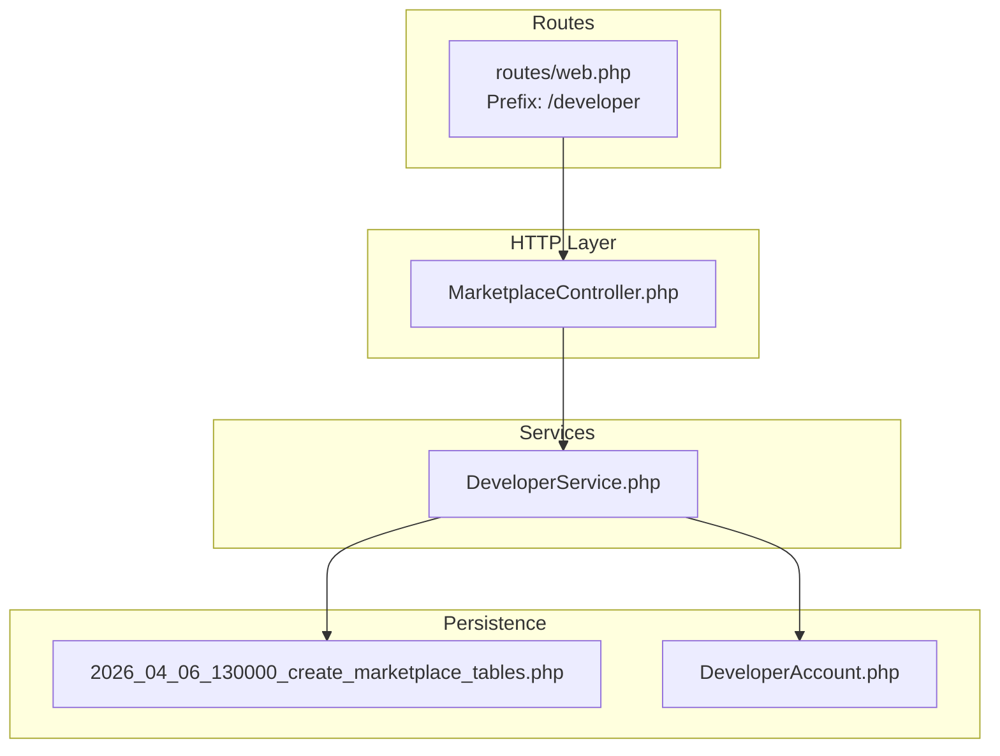
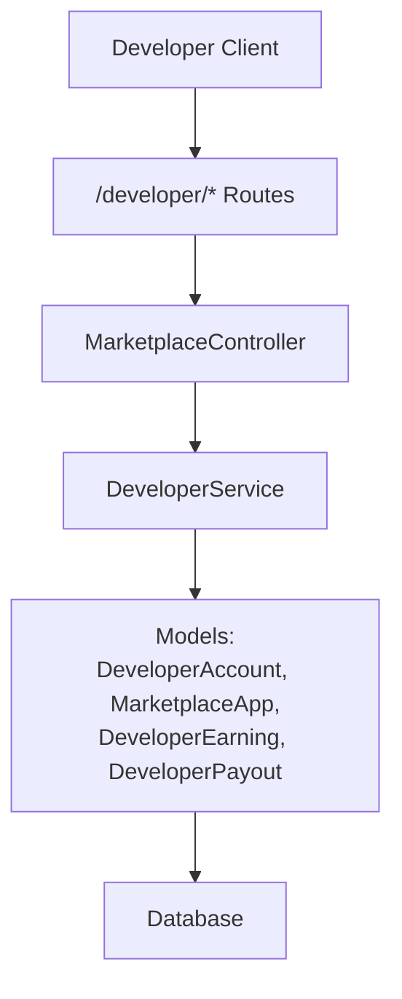
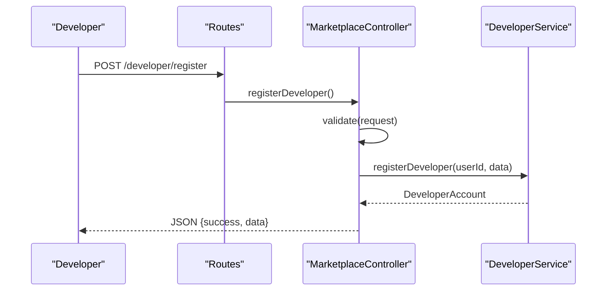
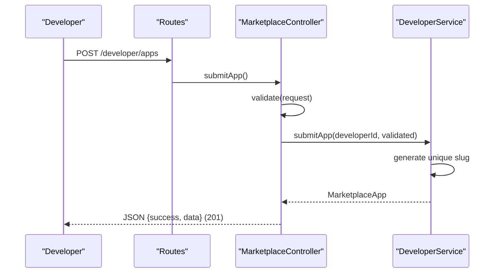
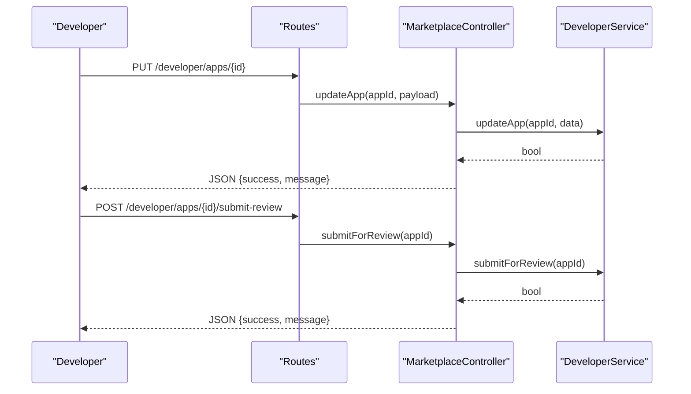
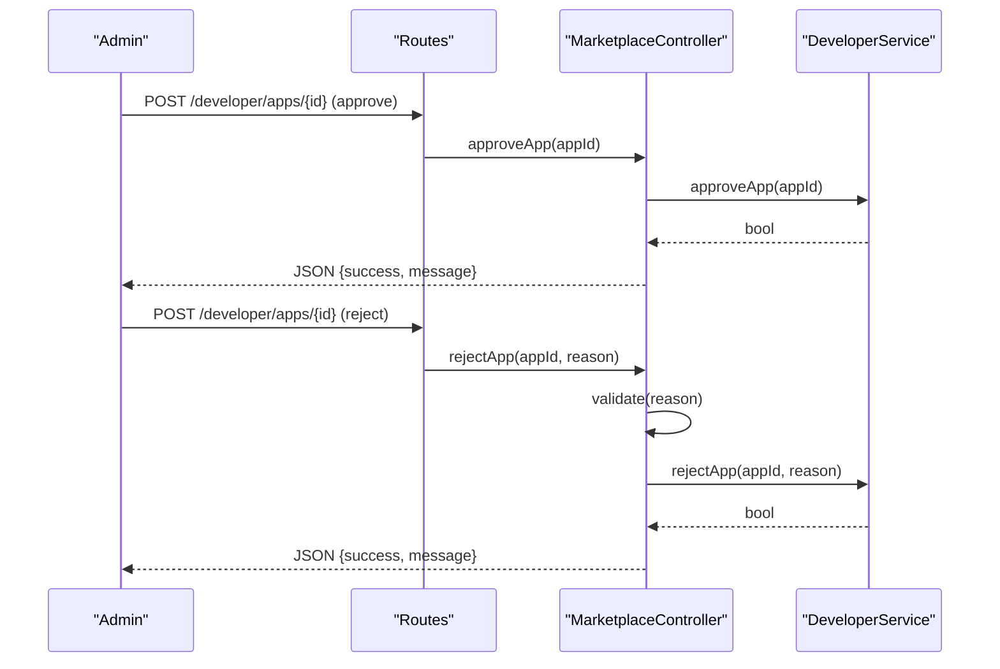
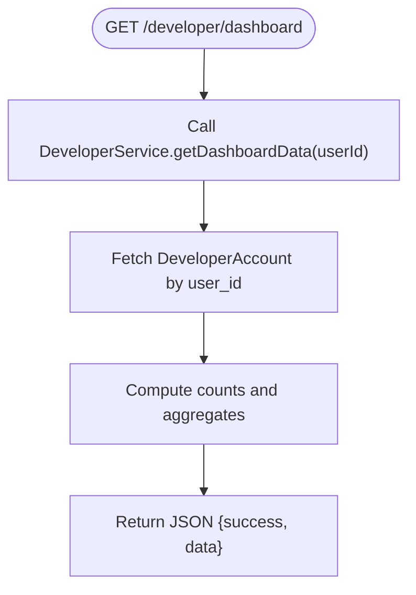
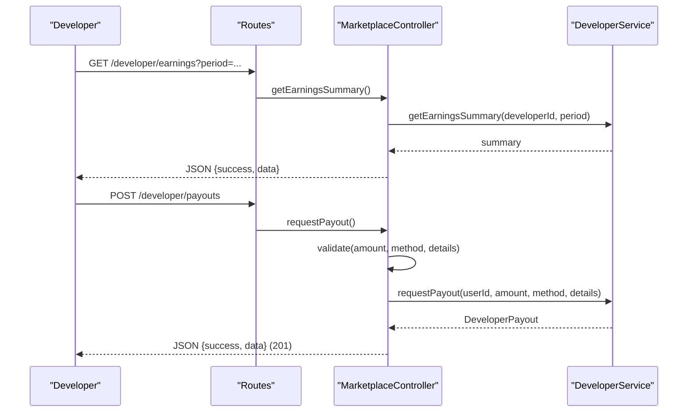
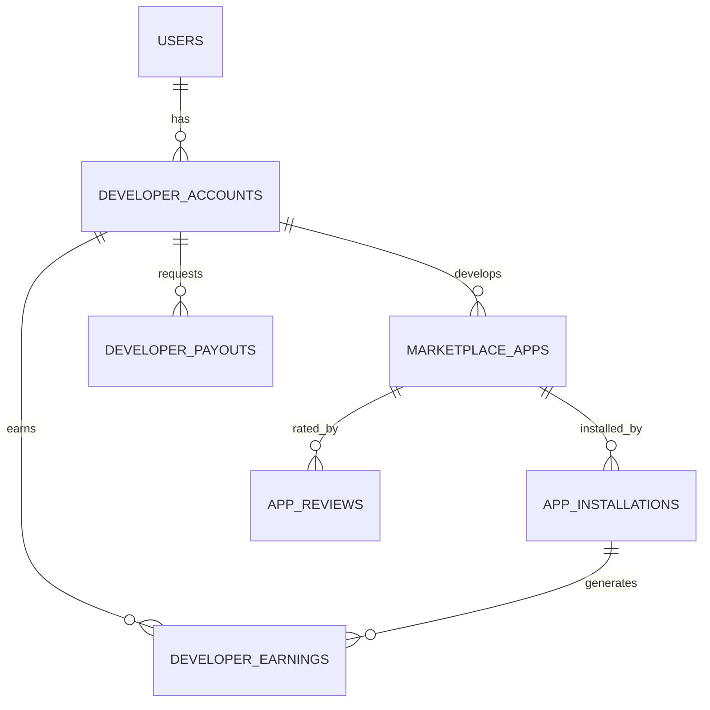
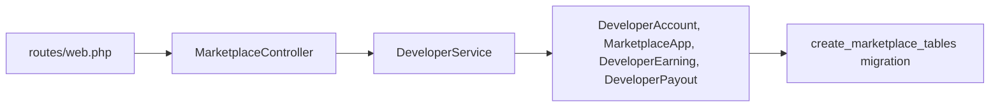

# Developer Portal & App Submission

<cite>
**Referenced Files in This Document**
- [web.php](file://routes/web.php)
- [MarketplaceController.php](file://app\Http\Controllers\Marketplace\MarketplaceController.php)
- [DeveloperService.php](file://app\Services\Marketplace\DeveloperService.php)
- [DeveloperAccount.php](file://app\Models\DeveloperAccount.php)
- [2026_04_06_130000_create_marketplace_tables.php](file://database\migrations\2026_04_06_130000_create_marketplace_tables.php)
</cite>

## Table of Contents
1. [Introduction](#introduction)
2. [Project Structure](#project-structure)
3. [Core Components](#core-components)
4. [Architecture Overview](#architecture-overview)
5. [Detailed Component Analysis](#detailed-component-analysis)
6. [Dependency Analysis](#dependency-analysis)
7. [Performance Considerations](#performance-considerations)
8. [Troubleshooting Guide](#troubleshooting-guide)
9. [Conclusion](#conclusion)
10. [Appendices](#appendices)

## Introduction
This document describes the Developer Portal and App Submission system built into the platform. It covers the complete developer onboarding process (registration, verification, and account setup), the app submission workflow (form validation, metadata requirements, and asset handling), the review and approval system (automated checks, manual review, and rejection handling), and the developer dashboard (managing multiple apps, earnings tracking, and performance analytics). It also outlines submission requirements and compliance expectations aligned with the implemented backend.

## Project Structure
The Developer Portal endpoints are grouped under the developer prefix and handled by a dedicated controller. The controller delegates business logic to a service layer, while persistence is implemented via Eloquent models and database migrations.

**Diagram sources**
- [web.php:2907-2917](file://routes/web.php#L2907-L2917)
- [MarketplaceController.php:13-28](file://app\Http\Controllers\Marketplace\MarketplaceController.php#L13-L28)
- [DeveloperService.php:11-270](file://app\Services\Marketplace\DeveloperService.php#L11-L270)
- [DeveloperAccount.php:8-50](file://app\Models\DeveloperAccount.php#L8-L50)
- [2026_04_06_130000_create_marketplace_tables.php:14-134](file://database\migrations\2026_04_06_130000_create_marketplace_tables.php#L14-L134)

**Section sources**
- [web.php:2907-2917](file://routes\web.php#L2907-L2917)
- [MarketplaceController.php:13-28](file://app\Http\Controllers\Marketplace\MarketplaceController.php#L13-L28)

## Core Components
- Routes: Define the developer portal endpoints for registration, app submission/update, review, listing apps, earnings, payouts, and dashboard.
- Controller: Validates requests, orchestrates service calls, and returns standardized JSON responses.
- Service: Implements business logic for developer onboarding, app lifecycle, earnings/payouts, and dashboard aggregation.
- Models and Migrations: Persist developer accounts, marketplace apps, installations, reviews, earnings, and payouts.

Key responsibilities:
- Registration: Creates a developer profile linked to the authenticated user.
- App Submission: Persists app metadata, enforces slug uniqueness, sets initial status, and prepares for review.
- Review and Approval: Transitions app status through pending, approved, rejected, and published states.
- Earnings and Payouts: Aggregates earnings, validates balances, and manages payout requests and processing.
- Dashboard: Summarizes profile, app metrics, ratings, earnings, and pending payouts.

**Section sources**
- [web.php:2907-2917](file://routes\web.php#L2907-L2917)
- [MarketplaceController.php:147-330](file://app\Http\Controllers\Marketplace\MarketplaceController.php#L147-L330)
- [DeveloperService.php:16-268](file://app\Services\Marketplace\DeveloperService.php#L16-L268)
- [DeveloperAccount.php:12-48](file://app\Models\DeveloperAccount.php#L12-L48)
- [2026_04_06_130000_create_marketplace_tables.php:14-134](file://database\migrations\2026_04_06_130000_create_marketplace_tables.php#L14-L134)

## Architecture Overview
The system follows a layered architecture:
- HTTP layer: Routes define endpoints; controller handles validation and delegation.
- Service layer: Encapsulates business rules and data transformations.
- Persistence layer: Models and migrations define domain entities and relationships.

**Diagram sources**
- [web.php:2907-2917](file://routes\web.php#L2907-L2917)
- [MarketplaceController.php:13-28](file://app\Http\Controllers\Marketplace\MarketplaceController.php#L13-L28)
- [DeveloperService.php:11-270](file://app\Services\Marketplace\DeveloperService.php#L11-L270)
- [DeveloperAccount.php:8-50](file://app\Models\DeveloperAccount.php#L8-L50)

## Detailed Component Analysis

### Developer Onboarding and Account Setup
- Endpoint: POST /developer/register
- Validation: Accepts optional company name, bio, website, GitHub profile, and skills array.
- Behavior: Creates a DeveloperAccount linked to the authenticated user, initializes status as active, and returns the created profile.

**Diagram sources**
- [web.php:2909](file://routes\web.php#L2909)
- [MarketplaceController.php:150-166](file://app\Http\Controllers\Marketplace\MarketplaceController.php#L150-L166)
- [DeveloperService.php:16-27](file://app\Services\Marketplace\DeveloperService.php#L16-L27)

**Section sources**
- [web.php:2909](file://routes\web.php#L2909)
- [MarketplaceController.php:150-166](file://app\Http\Controllers\Marketplace\MarketplaceController.php#L150-L166)
- [DeveloperService.php:16-27](file://app\Services\Marketplace\DeveloperService.php#L16-L27)

### App Submission Workflow
- Endpoint: POST /developer/apps
- Validation: Requires name and category; optional fields include description, version, screenshots, icon_url, price, pricing_model, subscription details, features, requirements, documentation/support/repository URLs.
- Behavior:
  - Generates a slug from the app name and ensures uniqueness.
  - Creates a MarketplaceApp with status set to pending and default values for optional fields.
  - Returns the created app object.

**Diagram sources**
- [web.php:2910](file://routes\web.php#L2910)
- [MarketplaceController.php:171-198](file://app\Http\Controllers\Marketplace\MarketplaceController.php#L171-L198)
- [DeveloperService.php:32-62](file://app\Services\Marketplace\DeveloperService.php#L32-L62)

**Section sources**
- [web.php:2910](file://routes\web.php#L2910)
- [MarketplaceController.php:171-198](file://app\Http\Controllers\Marketplace\MarketplaceController.php#L171-L198)
- [DeveloperService.php:32-62](file://app\Services\Marketplace\DeveloperService.php#L32-L62)

### App Update and Review Submission
- Update app: PUT /developer/apps/{id}
  - Validates and updates app metadata; returns success/failure.
- Submit for review: POST /developer/apps/{id}/submit-review
  - Transitions app status to pending for admin review.

**Diagram sources**
- [web.php:2911](file://routes\web.php#L2911)
- [web.php:2912](file://routes\web.php#L2912)
- [MarketplaceController.php:203-224](file://app\Http\Controllers\Marketplace\MarketplaceController.php#L203-L224)
- [DeveloperService.php:67-102](file://app\Services\Marketplace\DeveloperService.php#L67-L102)

**Section sources**
- [web.php:2911](file://routes\web.php#L2911)
- [web.php:2912](file://routes\web.php#L2912)
- [MarketplaceController.php:203-224](file://app\Http\Controllers\Marketplace\MarketplaceController.php#L203-L224)
- [DeveloperService.php:67-102](file://app\Services\Marketplace\DeveloperService.php#L67-L102)

### Review and Approval System
- Admin endpoints:
  - Approve app: POST /developer/apps/{id} (approveApp)
  - Reject app: POST /developer/apps/{id} with reason (rejectApp)
- Behavior:
  - Approve sets status to published and records published_at.
  - Reject sets status to rejected with a rejection reason.
  - Both return success/failure messages.

**Diagram sources**
- [MarketplaceController.php:229-251](file://app\Http\Controllers\Marketplace\MarketplaceController.php#L229-L251)
- [DeveloperService.php:107-148](file://app\Services\Marketplace\DeveloperService.php#L107-L148)

**Section sources**
- [MarketplaceController.php:229-251](file://app\Http\Controllers\Marketplace\MarketplaceController.php#L229-L251)
- [DeveloperService.php:107-148](file://app\Services\Marketplace\DeveloperService.php#L107-L148)

### Developer Dashboard
- Endpoint: GET /developer/dashboard
- Data returned includes:
  - Profile summary
  - Number of apps
  - Total downloads
  - Average rating
  - Earnings summary
  - Pending payouts count

**Diagram sources**
- [web.php:2916](file://routes\web.php#L2916)
- [MarketplaceController.php:322-330](file://app\Http\Controllers\Marketplace\MarketplaceController.php#L322-L330)
- [DeveloperService.php:252-268](file://app\Services\Marketplace\DeveloperService.php#L252-L268)

**Section sources**
- [web.php:2916](file://routes\web.php#L2916)
- [MarketplaceController.php:322-330](file://app\Http\Controllers\Marketplace\MarketplaceController.php#L322-L330)
- [DeveloperService.php:252-268](file://app\Services\Marketplace\DeveloperService.php#L252-L268)

### Earnings Tracking and Payouts
- Earnings summary: GET /developer/earnings with optional period parameter (this_month, last_month, this_year).
- Payout request: POST /developer/payouts with amount, method, and details; validates sufficient balance and deducts from available balance.
- Admin payout processing: POST /developer/payouts/{id}/process with reference number; marks payout as completed and related earnings as paid.

**Diagram sources**
- [web.php:2914](file://routes\web.php#L2914)
- [web.php:2915](file://routes\web.php#L2915)
- [MarketplaceController.php:270-303](file://app\Http\Controllers\Marketplace\MarketplaceController.php#L270-L303)
- [DeveloperService.php:164-218](file://app\Services\Marketplace\DeveloperService.php#L164-L218)

**Section sources**
- [web.php:2914](file://routes\web.php#L2914)
- [web.php:2915](file://routes\web.php#L2915)
- [MarketplaceController.php:270-303](file://app\Http\Controllers\Marketplace\MarketplaceController.php#L270-L303)
- [DeveloperService.php:164-218](file://app\Services\Marketplace\DeveloperService.php#L164-L218)

### Data Models and Relationships
The system persists developer profiles, marketplace apps, installations, reviews, earnings, and payouts. Key relationships:
- DeveloperAccount belongs to User and has many MarketplaceApp, DeveloperEarning, and DeveloperPayout.
- MarketplaceApp belongs to DeveloperAccount and tracks status, ratings, and metadata.
- DeveloperEarning belongs to DeveloperAccount and MarketplaceApp and tracks earnings lifecycle.
- DeveloperPayout belongs to DeveloperAccount and tracks payout lifecycle.

**Diagram sources**
- [2026_04_06_130000_create_marketplace_tables.php:14-134](file://database\migrations\2026_04_06_130000_create_marketplace_tables.php#L14-L134)
- [DeveloperAccount.php:33-48](file://app\Models\DeveloperAccount.php#L33-L48)

**Section sources**
- [2026_04_06_130000_create_marketplace_tables.php:14-134](file://database\migrations\2026_04_06_130000_create_marketplace_tables.php#L14-L134)
- [DeveloperAccount.php:33-48](file://app\Models\DeveloperAccount.php#L33-L48)

## Dependency Analysis
- Routes depend on MarketplaceController actions.
- MarketplaceController depends on DeveloperService for business logic.
- DeveloperService depends on Eloquent models and database migrations for persistence.
- Models encapsulate relationships and casts for arrays and decimals.

**Diagram sources**
- [web.php:2907-2917](file://routes\web.php#L2907-L2917)
- [MarketplaceController.php:13-28](file://app\Http\Controllers\Marketplace\MarketplaceController.php#L13-L28)
- [DeveloperService.php:11-270](file://app\Services\Marketplace\DeveloperService.php#L11-L270)
- [2026_04_06_130000_create_marketplace_tables.php:14-134](file://database\migrations\2026_04_06_130000_create_marketplace_tables.php#L14-L134)

**Section sources**
- [web.php:2907-2917](file://routes\web.php#L2907-L2917)
- [MarketplaceController.php:13-28](file://app\Http\Controllers\Marketplace\MarketplaceController.php#L13-L28)
- [DeveloperService.php:11-270](file://app\Services\Marketplace\DeveloperService.php#L11-L270)
- [2026_04_06_130000_create_marketplace_tables.php:14-134](file://database\migrations\2026_04_06_130000_create_marketplace_tables.php#L14-L134)

## Performance Considerations
- Indexes on frequently filtered/sorted columns (category, status, rating, developer_id) improve query performance for app listings and filtering.
- Slug generation and uniqueness checks are O(n) in worst-case; consider caching or precomputed slugs for high-volume submissions.
- Earnings aggregation queries use simple aggregations; ensure appropriate indexing on earned_date and developer_account_id for large datasets.
- Logging errors during update/submit/approve/reject operations helps diagnose performance bottlenecks.

[No sources needed since this section provides general guidance]

## Troubleshooting Guide
Common issues and resolutions:
- Insufficient balance for payout: The service throws an exception when requested amount exceeds available balance. Ensure developers top up or adjust payout amounts.
- Update failures: Update operations log exceptions with app ID and error message; check logs for details.
- Slug conflicts: If slug exists, a random suffix is appended; verify uniqueness constraints and slug generation logic.
- Review transitions: Approve/reject operations log errors with app ID and error message; confirm app existence and status transitions.

**Section sources**
- [DeveloperService.php:197-218](file://app\Services\Marketplace\DeveloperService.php#L197-L218)
- [DeveloperService.php:67-82](file://app\Services\Marketplace\DeveloperService.php#L67-L82)
- [DeveloperService.php:87-102](file://app\Services\Marketplace\DeveloperService.php#L87-L102)
- [DeveloperService.php:107-148](file://app\Services\Marketplace\DeveloperService.php#L107-L148)

## Conclusion
The Developer Portal and App Submission system provides a complete lifecycle for developers: onboarding, app creation, review, publishing, and monetization. The controller-service-model pattern cleanly separates concerns, while migrations define robust persistence for apps, earnings, and payouts. Administrators can manage app approvals and payouts, and developers can track earnings and manage their portfolios via the dashboard.

[No sources needed since this section summarizes without analyzing specific files]

## Appendices

### Submission Requirements and Metadata Fields
- Required fields for app submission:
  - name
  - category
- Optional fields:
  - description, version, screenshots, icon_url, price, pricing_model, subscription_price, subscription_period, features, requirements, documentation_url, support_url, repository_url

Validation rules enforced by the controller ensure data integrity and policy alignment.

**Section sources**
- [MarketplaceController.php:173-189](file://app\Http\Controllers\Marketplace\MarketplaceController.php#L173-L189)

### Compliance and Policy Alignment
- Status lifecycle: pending → approved → published; rejected apps carry a rejection reason.
- Payout thresholds: Minimum payout amount is validated to prevent trivial requests.
- Earnings attribution: Earnings are tracked per app and developer account with currency and status fields.

**Section sources**
- [2026_04_06_130000_create_marketplace_tables.php:30-39](file://database\migrations\2026_04_06_130000_create_marketplace_tables.php#L30-L39)
- [MarketplaceController.php:286-290](file://app\Http\Controllers\Marketplace\MarketplaceController.php#L286-L290)
- [DeveloperService.php:164-192](file://app\Services\Marketplace\DeveloperService.php#L164-L192)