# Marketplace Applications

<cite>
**Referenced Files in This Document**
- [MarketplaceController.php](file://app/Http/Controllers/Marketplace/MarketplaceController.php)
- [AppMarketplaceService.php](file://app/Services/Marketplace/AppMarketplaceService.php)
- [DeveloperService.php](file://app/Services/Marketplace/DeveloperService.php)
- [web.php](file://routes/web.php)
- [2026_04_06_130000_create_marketplace_tables.php](file://database/migrations/2026_04_06_130000_create_marketplace_tables.php)
- [DeveloperAccount.php](file://app/Models/DeveloperAccount.php)
</cite>

## Table of Contents
1. [Introduction](#introduction)
2. [Project Structure](#project-structure)
3. [Core Components](#core-components)
4. [Architecture Overview](#architecture-overview)
5. [Detailed Component Analysis](#detailed-component-analysis)
6. [Dependency Analysis](#dependency-analysis)
7. [Performance Considerations](#performance-considerations)
8. [Troubleshooting Guide](#troubleshooting-guide)
9. [Conclusion](#conclusion)

## Introduction
This document describes the Marketplace Applications feature of the system. It covers the app marketplace ecosystem including browsing, filtering, and discovery; the installation and tenant-based management of apps; configuration workflows; the developer portal for app submission, review, and approval; the app rating and review system; monetization via sales and subscription plans; revenue sharing; app categorization and pricing models; and the lifecycle from submission to approval to distribution. It also outlines quality assurance and developer onboarding procedures.

## Project Structure
The Marketplace Applications feature is implemented across controllers, services, routes, and database migrations. The controller exposes endpoints for marketplace browsing, installation/uninstallation, configuration, reviews, and developer portal actions. Services encapsulate business logic for marketplace operations and developer workflows. Routes define the API surface for marketplace and developer functionalities. Migrations define the schema for marketplace apps, installations, reviews, developer accounts, earnings, and payouts.

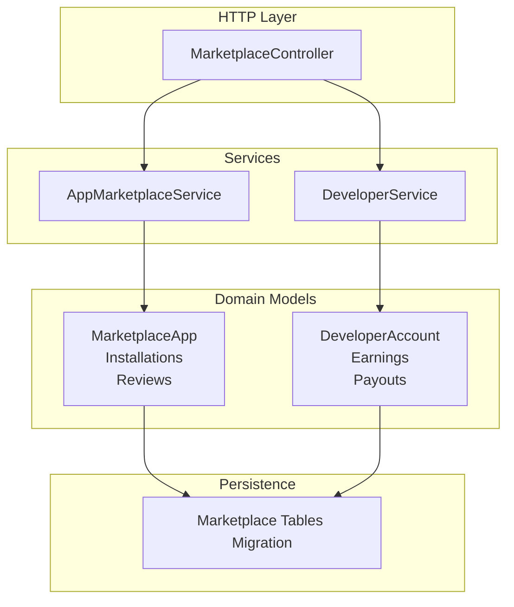

**Diagram sources**
- [MarketplaceController.php:13-28](file://app/Http/Controllers/Marketplace/MarketplaceController.php#L13-L28)
- [AppMarketplaceService.php:1-275](file://app/Services/Marketplace/AppMarketplaceService.php#L1-L275)
- [DeveloperService.php:1-270](file://app/Services/Marketplace/DeveloperService.php#L1-L270)
- [2026_04_06_130000_create_marketplace_tables.php:14-283](file://database/migrations/2026_04_06_130000_create_marketplace_tables.php#L14-L283)

**Section sources**
- [MarketplaceController.php:13-28](file://app/Http/Controllers/Marketplace/MarketplaceController.php#L13-L28)
- [web.php:2726-2917](file://routes/web.php#L2726-L2917)
- [2026_04_06_130000_create_marketplace_tables.php:14-283](file://database/migrations/2026_04_06_130000_create_marketplace_tables.php#L14-L283)

## Core Components
- MarketplaceController: Orchestrates marketplace and developer portal endpoints, validates requests, and delegates to services.
- AppMarketplaceService: Implements marketplace browsing, filtering, installation, uninstallation, configuration, review submission, tenant app retrieval, rating recalculation, subscription expiry calculation, and revenue recording.
- DeveloperService: Manages developer registration, app submission/update, review submission, approval/rejection, earnings summary, payout requests, payout processing, and dashboard metrics.
- Routes: Define marketplace browsing/install/uninstall/review/my-apps, developer registration/apps/list/earnings/payouts/dashboard, and developer portal endpoints.
- Database Migrations: Define marketplace_apps, app_installations, app_reviews, developer_accounts, developer_earnings, developer_payouts, and related indices.

**Section sources**
- [MarketplaceController.php:34-141](file://app/Http/Controllers/Marketplace/MarketplaceController.php#L34-L141)
- [AppMarketplaceService.php:44-275](file://app/Services/Marketplace/AppMarketplaceService.php#L44-L275)
- [DeveloperService.php:16-247](file://app/Services/Marketplace/DeveloperService.php#L16-L247)
- [web.php:2726-2917](file://routes/web.php#L2726-L2917)
- [2026_04_06_130000_create_marketplace_tables.php:14-283](file://database/migrations/2026_04_06_130000_create_marketplace_tables.php#L14-L283)

## Architecture Overview
The marketplace follows a layered architecture:
- HTTP endpoints handled by MarketplaceController
- Business logic in AppMarketplaceService and DeveloperService
- Persistence via Eloquent models backed by marketplace migrations
- Tenant-scoped operations and isolation

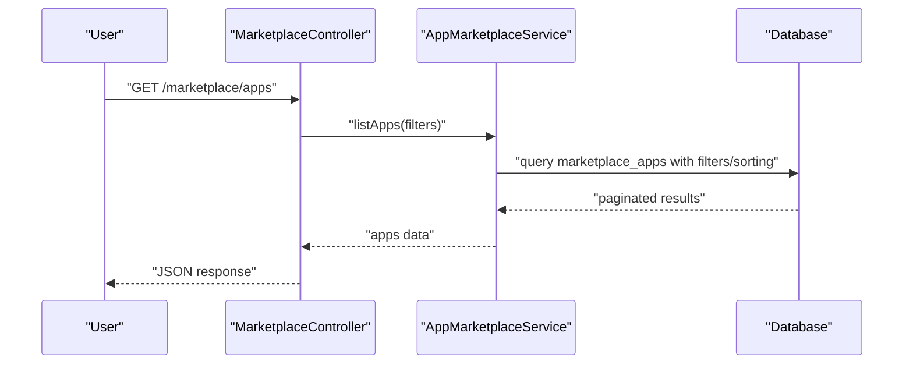

**Diagram sources**
- [MarketplaceController.php:34-46](file://app/Http/Controllers/Marketplace/MarketplaceController.php#L34-L46)
- [AppMarketplaceService.php:44-53](file://app/Services/Marketplace/AppMarketplaceService.php#L44-L53)
- [web.php:2890-2900](file://routes/web.php#L2890-L2900)

## Detailed Component Analysis

### Marketplace Browsing, Filtering, and Discovery
- Endpoint: GET /marketplace/apps
- Filters supported: category, search, min_rating, price_type, sort_by, sort_order, per_page
- Sorting: sortBy and sortOrder applied to queries
- Pagination: perPage controls page size
- Discovery: category and rating indexing enable efficient filtering

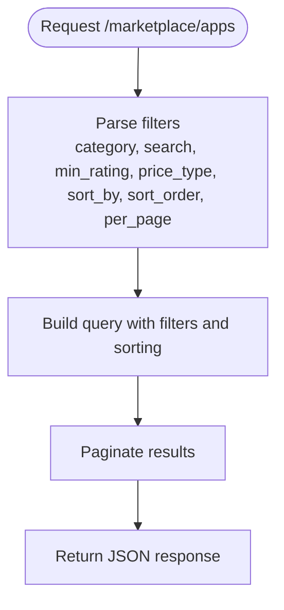

**Diagram sources**
- [MarketplaceController.php:34-46](file://app/Http/Controllers/Marketplace/MarketplaceController.php#L34-L46)
- [AppMarketplaceService.php:44-53](file://app/Services/Marketplace/AppMarketplaceService.php#L44-L53)

**Section sources**
- [MarketplaceController.php:34-46](file://app/Http/Controllers/Marketplace/MarketplaceController.php#L34-L46)
- [AppMarketplaceService.php:44-53](file://app/Services/Marketplace/AppMarketplaceService.php#L44-L53)
- [2026_04_06_130000_create_marketplace_tables.php:41-43](file://database/migrations/2026_04_06_130000_create_marketplace_tables.php#L41-L43)

### App Details and Slug-Based Lookup
- Endpoint: GET /marketplace/apps/{slug}
- Retrieves published app with developer and reviews populated

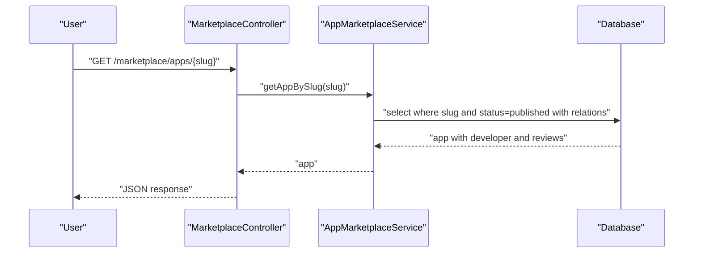

**Diagram sources**
- [MarketplaceController.php:48-63](file://app/Http/Controllers/Marketplace/MarketplaceController.php#L48-L63)
- [AppMarketplaceService.php:56-64](file://app/Services/Marketplace/AppMarketplaceService.php#L56-L64)

**Section sources**
- [MarketplaceController.php:48-63](file://app/Http/Controllers/Marketplace/MarketplaceController.php#L48-L63)
- [AppMarketplaceService.php:56-64](file://app/Services/Marketplace/AppMarketplaceService.php#L56-L64)

### App Installation and Tenant-Based Management
- Endpoint: POST /marketplace/apps/{id}/install
- Validates tenant context and prevents duplicate installs
- Creates AppInstallation with permissions and optional expiry for subscriptions
- Increments download count and records earnings for paid apps

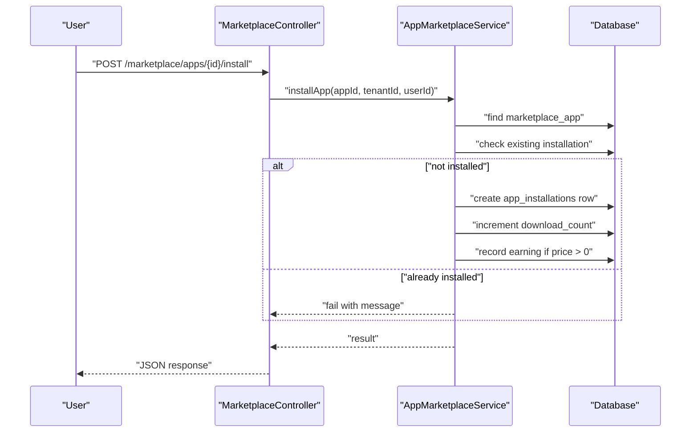

**Diagram sources**
- [MarketplaceController.php:65-77](file://app/Http/Controllers/Marketplace/MarketplaceController.php#L65-L77)
- [AppMarketplaceService.php:66-117](file://app/Services/Marketplace/AppMarketplaceService.php#L66-L117)

**Section sources**
- [MarketplaceController.php:65-77](file://app/Http/Controllers/Marketplace/MarketplaceController.php#L65-L77)
- [AppMarketplaceService.php:66-117](file://app/Services/Marketplace/AppMarketplaceService.php#L66-L117)
- [2026_04_06_130000_create_marketplace_tables.php:46-62](file://database/migrations/2026_04_06_130000_create_marketplace_tables.php#L46-L62)

### App Uninstallation and Configuration
- Uninstall: DELETE /marketplace/apps/{id}
- Configure: POST /marketplace/app-config/{installationId}

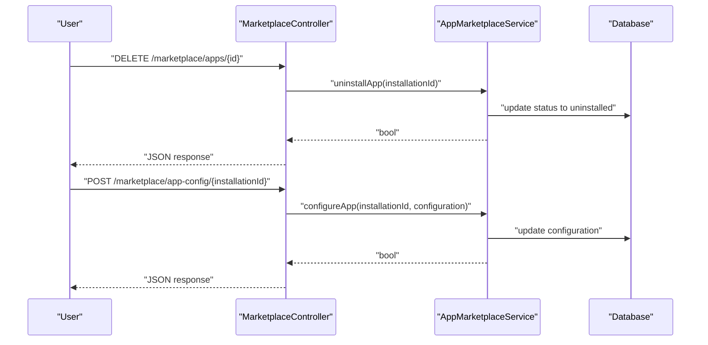

**Diagram sources**
- [MarketplaceController.php:79-103](file://app/Http/Controllers/Marketplace/MarketplaceController.php#L79-L103)
- [AppMarketplaceService.php:119-157](file://app/Services/Marketplace/AppMarketplaceService.php#L119-L157)

**Section sources**
- [MarketplaceController.php:79-103](file://app/Http/Controllers/Marketplace/MarketplaceController.php#L79-L103)
- [AppMarketplaceService.php:119-157](file://app/Services/Marketplace/AppMarketplaceService.php#L119-L157)

### Tenant’s Installed Apps
- Endpoint: GET /marketplace/apps/my-apps
- Returns tenant-scoped installed apps

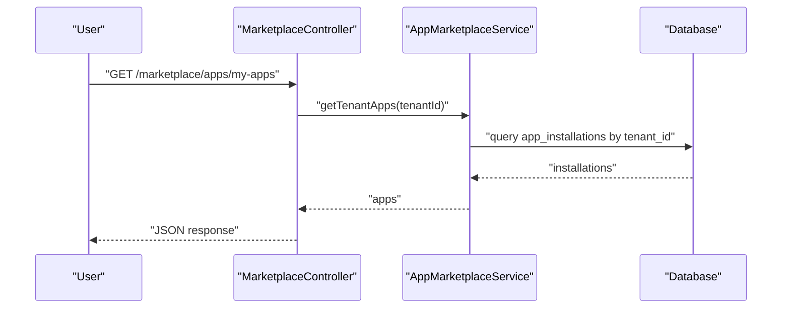

**Diagram sources**
- [MarketplaceController.php:130-141](file://app/Http/Controllers/Marketplace/MarketplaceController.php#L130-L141)
- [AppMarketplaceService.php:200-209](file://app/Services/Marketplace/AppMarketplaceService.php#L200-L209)

**Section sources**
- [MarketplaceController.php:130-141](file://app/Http/Controllers/Marketplace/MarketplaceController.php#L130-L141)
- [AppMarketplaceService.php:200-209](file://app/Services/Marketplace/AppMarketplaceService.php#L200-L209)

### App Rating and Review System
- Endpoint: POST /marketplace/apps/{id}/review
- Verifies purchase (installed by tenant) and auto-approves reviews
- Recalculates average rating and review count

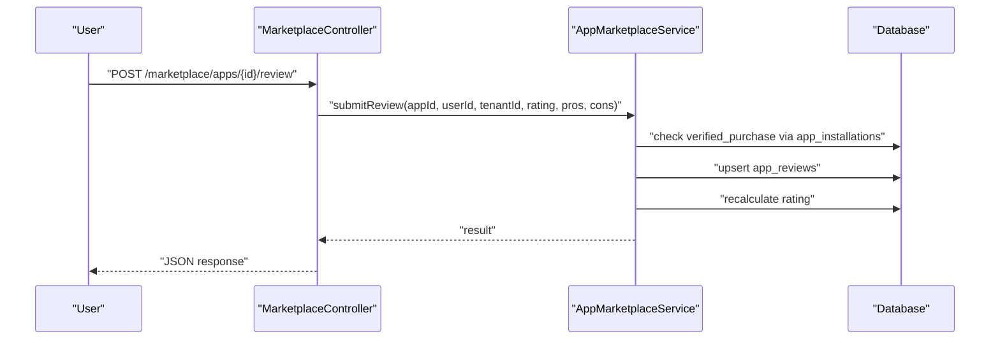

**Diagram sources**
- [MarketplaceController.php:105-128](file://app/Http/Controllers/Marketplace/MarketplaceController.php#L105-L128)
- [AppMarketplaceService.php:159-198](file://app/Services/Marketplace/AppMarketplaceService.php#L159-L198)

**Section sources**
- [MarketplaceController.php:105-128](file://app/Http/Controllers/Marketplace/MarketplaceController.php#L105-L128)
- [AppMarketplaceService.php:159-198](file://app/Services/Marketplace/AppMarketplaceService.php#L159-L198)
- [2026_04_06_130000_create_marketplace_tables.php:64-80](file://database/migrations/2026_04_06_130000_create_marketplace_tables.php#L64-L80)

### Developer Portal: Submission, Review, and Approval
- Register developer: POST /developer/register
- Submit app: POST /developer/apps
- Update app: PUT /developer/apps/{id}
- Submit for review: POST /developer/apps/{id}/submit-review
- Approve app (admin): POST /developer/apps/{id}/approve
- Reject app (admin): POST /developer/apps/{id}/reject
- Developer apps: GET /developer/apps
- Earnings summary: GET /developer/earnings
- Payout request: POST /developer/payouts
- Dashboard: GET /developer/dashboard

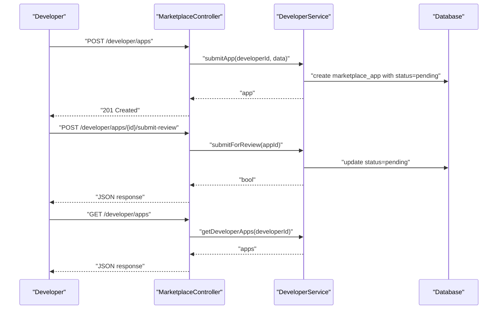

**Diagram sources**
- [MarketplaceController.php:147-265](file://app/Http/Controllers/Marketplace/MarketplaceController.php#L147-L265)
- [DeveloperService.php:30-102](file://app/Services/Marketplace/DeveloperService.php#L30-L102)

**Section sources**
- [MarketplaceController.php:147-265](file://app/Http/Controllers/Marketplace/MarketplaceController.php#L147-L265)
- [DeveloperService.php:30-102](file://app/Services/Marketplace/DeveloperService.php#L30-L102)
- [web.php:2907-2917](file://routes/web.php#L2907-L2917)

### Monetization, Pricing Models, and Revenue Sharing
- Pricing models: one_time, subscription, freemium
- Subscription billing period: monthly, yearly
- Earnings recorded on successful install for paid apps
- Platform fee: 20% fixed rate; net earnings credited to developer
- Payouts: requested when available balance >= amount; admin processes with reference number

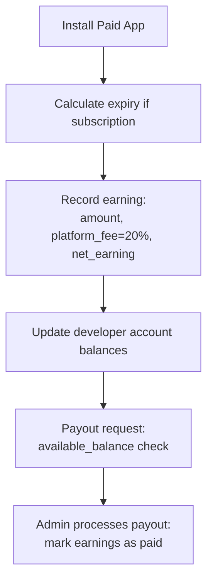

**Diagram sources**
- [AppMarketplaceService.php:244-275](file://app/Services/Marketplace/AppMarketplaceService.php#L244-L275)
- [DeveloperService.php:194-247](file://app/Services/Marketplace/DeveloperService.php#L194-L247)
- [2026_04_06_130000_create_marketplace_tables.php:101-134](file://database/migrations/2026_04_06_130000_create_marketplace_tables.php#L101-L134)

**Section sources**
- [AppMarketplaceService.php:244-275](file://app/Services/Marketplace/AppMarketplaceService.php#L244-L275)
- [DeveloperService.php:194-247](file://app/Services/Marketplace/DeveloperService.php#L194-L247)
- [2026_04_06_130000_create_marketplace_tables.php:24-27](file://database/migrations/2026_04_06_130000_create_marketplace_tables.php#L24-L27)
- [2026_04_06_130000_create_marketplace_tables.php:101-134](file://database/migrations/2026_04_06_130000_create_marketplace_tables.php#L101-L134)

### App Lifecycle: From Submission to Distribution
- Submission: Developer submits app metadata and pricing
- Review: Status transitions to pending; admin approves or rejects
- Publishing: Approved apps become discoverable and installable
- Distribution: Tenants browse, filter, and install apps

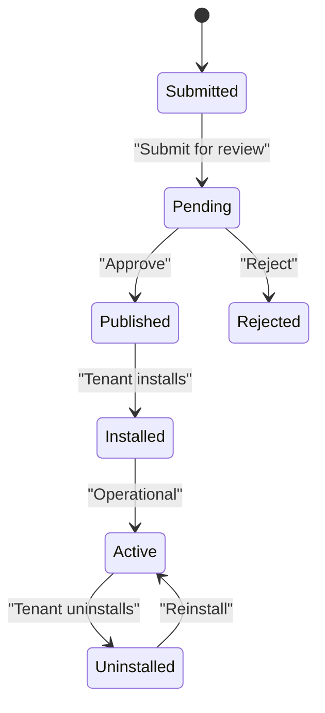

**Diagram sources**
- [DeveloperService.php:84-148](file://app/Services/Marketplace/DeveloperService.php#L84-L148)
- [AppMarketplaceService.php:66-117](file://app/Services/Marketplace/AppMarketplaceService.php#L66-L117)

**Section sources**
- [DeveloperService.php:84-148](file://app/Services/Marketplace/DeveloperService.php#L84-L148)
- [AppMarketplaceService.php:66-117](file://app/Services/Marketplace/AppMarketplaceService.php#L66-L117)

### Developer Onboarding and Quality Assurance
- Onboarding: Developer registers profile; becomes eligible to submit apps
- QA: Admin review process (approve/reject) ensures quality and compliance
- Metrics: Dashboard shows counts, downloads, ratings, earnings, and pending payouts

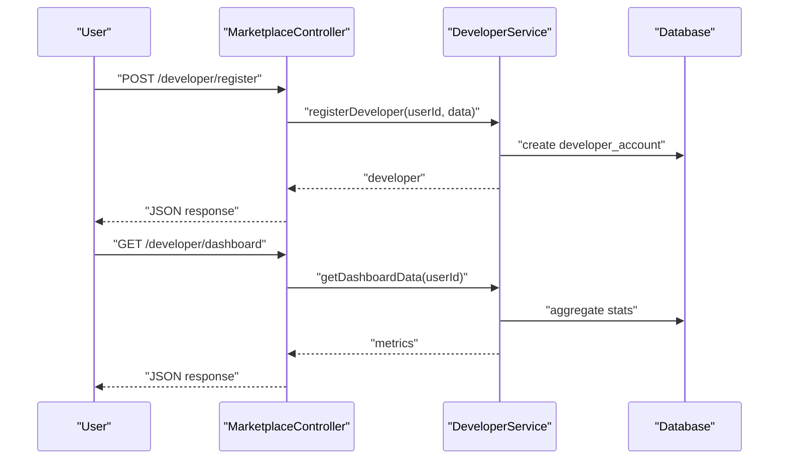

**Diagram sources**
- [MarketplaceController.php:147-166](file://app/Http/Controllers/Marketplace/MarketplaceController.php#L147-L166)
- [DeveloperService.php:14-27](file://app/Services/Marketplace/DeveloperService.php#L14-L27)
- [DeveloperService.php:250-268](file://app/Services/Marketplace/DeveloperService.php#L250-L268)

**Section sources**
- [MarketplaceController.php:147-166](file://app/Http/Controllers/Marketplace/MarketplaceController.php#L147-L166)
- [DeveloperService.php:14-27](file://app/Services/Marketplace/DeveloperService.php#L14-L27)
- [DeveloperService.php:250-268](file://app/Services/Marketplace/DeveloperService.php#L250-L268)

## Dependency Analysis
- Controller depends on AppMarketplaceService and DeveloperService
- Services depend on Eloquent models and database tables defined in the migration
- Routes bind endpoints to controller actions
- DeveloperAccount model connects to User and encapsulates developer financial and profile data

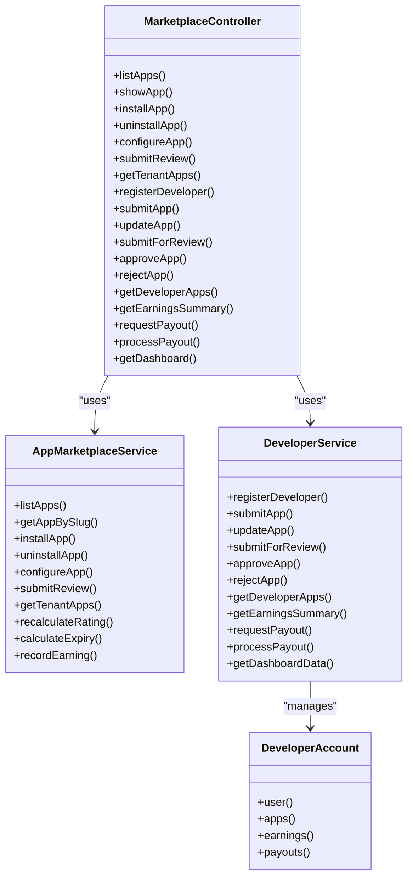

**Diagram sources**
- [MarketplaceController.php:13-28](file://app/Http/Controllers/Marketplace/MarketplaceController.php#L13-L28)
- [AppMarketplaceService.php:1-275](file://app/Services/Marketplace/AppMarketplaceService.php#L1-L275)
- [DeveloperService.php:1-270](file://app/Services/Marketplace/DeveloperService.php#L1-L270)
- [DeveloperAccount.php:8-50](file://app/Models/DeveloperAccount.php#L8-L50)

**Section sources**
- [MarketplaceController.php:13-28](file://app/Http/Controllers/Marketplace/MarketplaceController.php#L13-L28)
- [DeveloperAccount.php:8-50](file://app/Models/DeveloperAccount.php#L8-L50)

## Performance Considerations
- Indexes on marketplace_apps (category, status), developer_id, rating support efficient filtering and sorting.
- Pagination reduces payload sizes for browsing endpoints.
- Eager loading of relations (developer, reviews) minimizes N+1 queries in listings and details.
- Consider caching average ratings and counts for hot paths if traffic demands.

[No sources needed since this section provides general guidance]

## Troubleshooting Guide
- Installation fails: Check duplicate installation and error logging in AppMarketplaceService installApp.
- Uninstall fails: Verify installation ID and error logging in uninstallApp.
- Configuration fails: Confirm installation exists and error logging in configureApp.
- Review submission errors: Validate purchase verification and error logging in submitReview.
- Developer payout errors: Insufficient balance or invalid payout ID; see DeveloperService requestPayout/processPayout.

**Section sources**
- [AppMarketplaceService.php:66-117](file://app/Services/Marketplace/AppMarketplaceService.php#L66-L117)
- [AppMarketplaceService.php:119-157](file://app/Services/Marketplace/AppMarketplaceService.php#L119-L157)
- [AppMarketplaceService.php:159-198](file://app/Services/Marketplace/AppMarketplaceService.php#L159-L198)
- [DeveloperService.php:194-247](file://app/Services/Marketplace/DeveloperService.php#L194-L247)

## Conclusion
The Marketplace Applications feature provides a robust, tenant-scoped ecosystem for discovering, installing, configuring, and rating third-party apps, alongside a developer portal for submission, review, approval, and monetization. The architecture cleanly separates concerns between controllers, services, and persistence, with clear data models and lifecycle states. The system supports multiple pricing models, automated revenue sharing, and developer onboarding with dashboard insights.