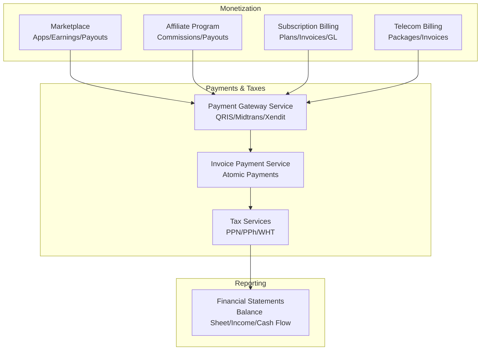
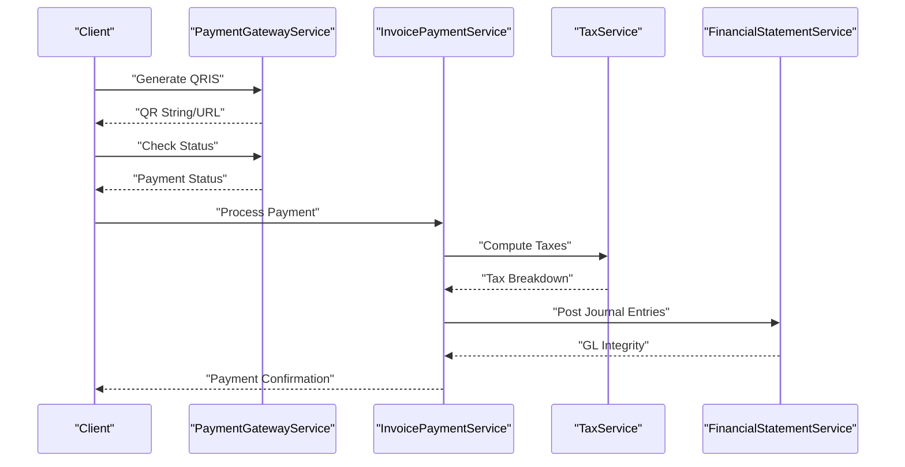
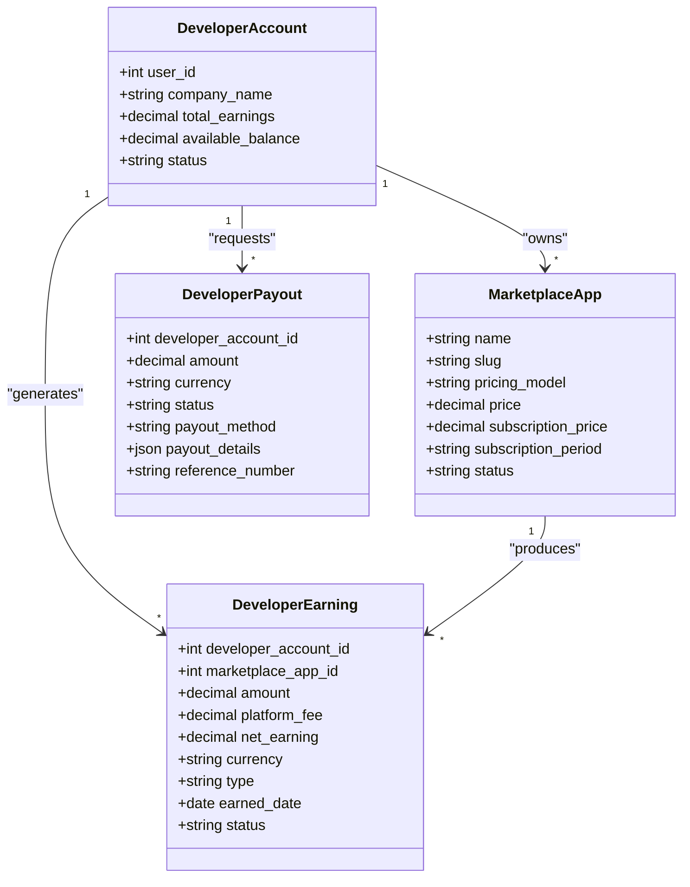
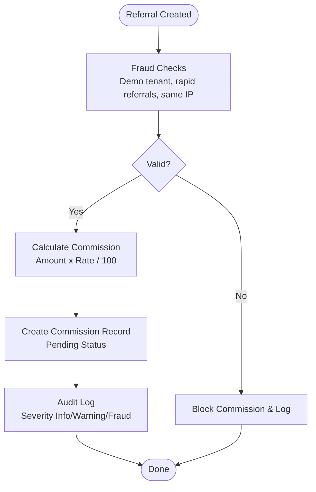
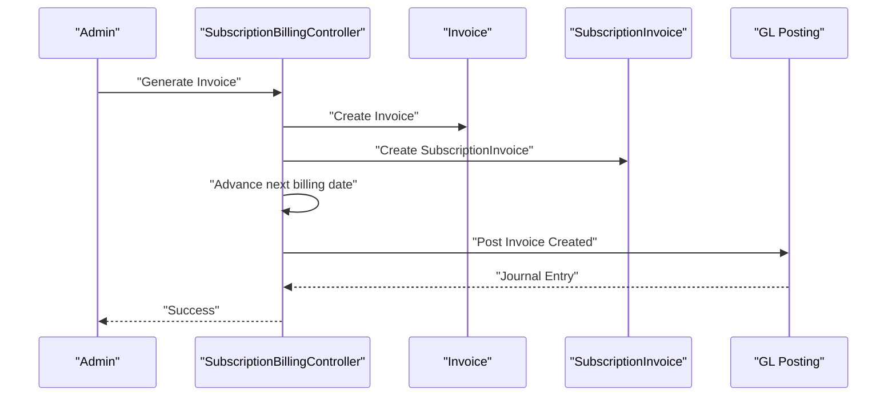
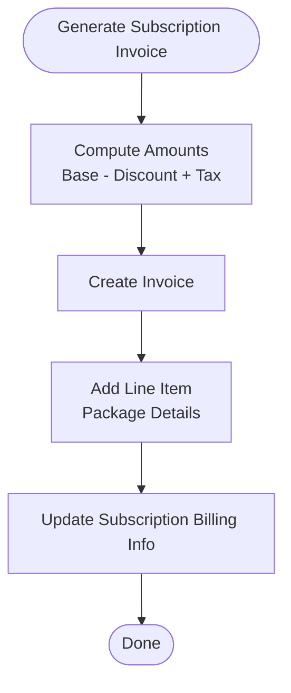
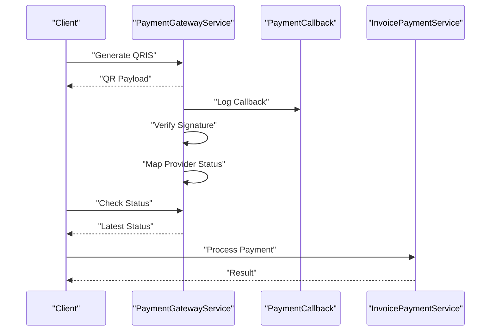
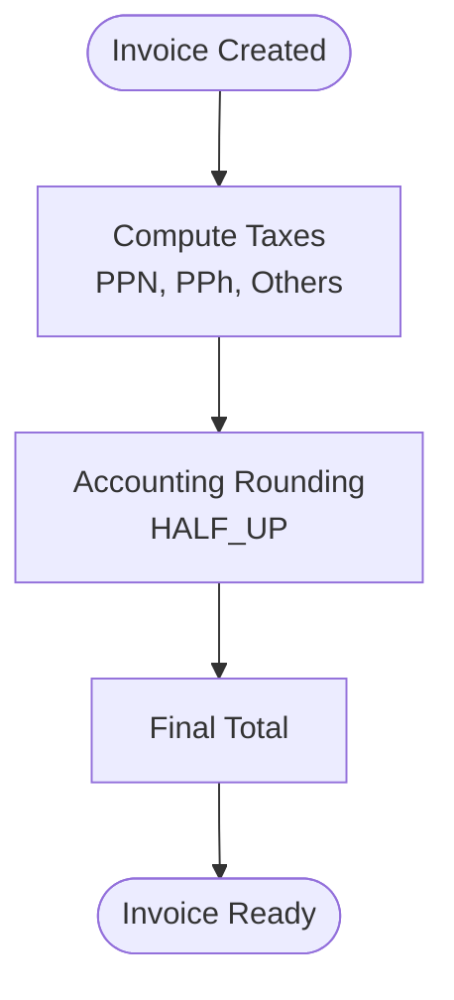
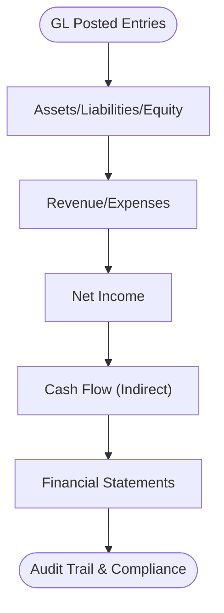
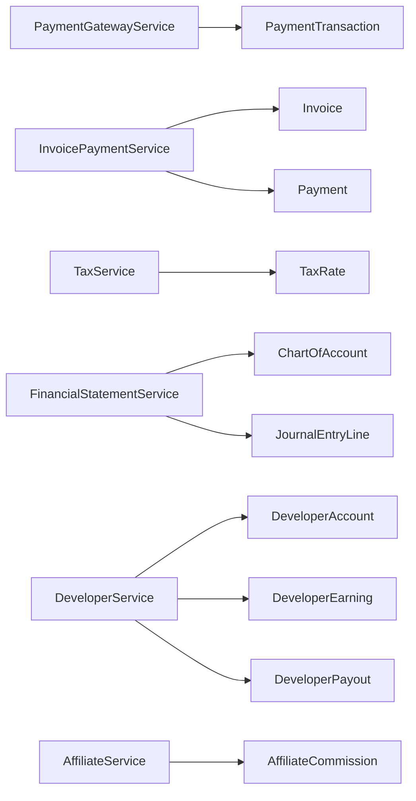

# Monetization & Revenue Sharing

<cite>
**Referenced Files in This Document**
- [AffiliateService.php](file://app/Services/AffiliateService.php)
- [Affiliate.php](file://app/Models/Affiliate.php)
- [AffiliateCommission.php](file://app/Models/AffiliateCommission.php)
- [DeveloperService.php](file://app/Services/Marketplace/DeveloperService.php)
- [2026_04_06_130000_create_marketplace_tables.php](file://database/migrations/2026_04_06_130000_create_marketplace_tables.php)
- [MarketplaceController.php](file://app/Http/Controllers/Marketplace/MarketplaceController.php)
- [PaymentGatewayService.php](file://app/Services/PaymentGatewayService.php)
- [InvoicePaymentService.php](file://app/Services/InvoicePaymentService.php)
- [SubscriptionBillingController.php](file://app/Http/Controllers/SubscriptionBillingController.php)
- [CustomerSubscription.php](file://app/Models/CustomerSubscription.php)
- [CustomerSubscriptionPlan.php](file://app/Models/CustomerSubscriptionPlan.php)
- [TelecomBillingIntegrationService.php](file://app/Services/Telecom/TelecomBillingIntegrationService.php)
- [TaxService.php](file://app/Services/TaxService.php)
- [TaxCalculationService.php](file://app/Services/TaxCalculationService.php)
- [FinancialStatementService.php](file://app/Services/FinancialStatementService.php)
- [InvoicePaymentService.php](file://app/Services/InvoicePaymentService.php)
- [TransactionConsistencyTest.php](file://tests/Feature/TransactionConsistencyTest.php)
</cite>

## Table of Contents
1. [Introduction](#introduction)
2. [Project Structure](#project-structure)
3. [Core Components](#core-components)
4. [Architecture Overview](#architecture-overview)
5. [Detailed Component Analysis](#detailed-component-analysis)
6. [Dependency Analysis](#dependency-analysis)
7. [Performance Considerations](#performance-considerations)
8. [Troubleshooting Guide](#troubleshooting-guide)
9. [Conclusion](#conclusion)

## Introduction
This document describes the Monetization and Revenue Sharing system implemented in the codebase. It covers the revenue model (one-time, subscription, freemium), commission structures, earnings tracking, transaction processing, financial reporting, payout workflows, tax handling, currency support, and compliance considerations. The system integrates marketplace monetization, affiliate commissions, subscription billing, telecom billing, and robust payment processing with tax and financial reporting services.

## Project Structure
The monetization stack spans services, controllers, models, migrations, and tests:
- Marketplace monetization: developer accounts, app listings, earnings, payouts, and API keys
- Affiliate program: affiliate profiles, referral tracking, commission creation, and payouts
- Subscription billing: customer subscriptions, plans, recurring invoicing, and GL posting
- Payments: gateway integrations (QRIS), payment callbacks, and invoice payment processing
- Taxes and reporting: tax calculation helpers and financial statements built on journal entries

**Diagram sources**
- [PaymentGatewayService.php:13-637](file://app/Services/PaymentGatewayService.php#L13-L637)
- [InvoicePaymentService.php:17-219](file://app/Services/InvoicePaymentService.php#L17-L219)
- [TaxService.php:15-168](file://app/Services/TaxService.php#L15-L168)
- [FinancialStatementService.php:22-435](file://app/Services/FinancialStatementService.php#L22-L435)

**Section sources**
- [PaymentGatewayService.php:13-637](file://app/Services/PaymentGatewayService.php#L13-L637)
- [InvoicePaymentService.php:17-219](file://app/Services/InvoicePaymentService.php#L17-L219)
- [TaxService.php:15-168](file://app/Services/TaxService.php#L15-L168)
- [FinancialStatementService.php:22-435](file://app/Services/FinancialStatementService.php#L22-L435)

## Core Components
- Marketplace monetization: developer registration, app submission/approval, earnings tracking, and payout requests
- Affiliate program: referral creation, fraud checks, commission calculation, and payouts
- Subscription billing: plan-based invoicing, recurring billing cycles, and GL posting
- Payments: multi-provider QRIS generation, payment status checks, webhooks, and invoice payment processing
- Taxes: PPN, PPh, and withholding tax calculations with accounting rounding
- Financial reporting: balance sheet, income statement, and cash flow from journal entries

**Section sources**
- [DeveloperService.php:11-270](file://app/Services/Marketplace/DeveloperService.php#L11-L270)
- [AffiliateService.php:36-130](file://app/Services/AffiliateService.php#L36-L130)
- [SubscriptionBillingController.php:15-294](file://app/Http/Controllers/SubscriptionBillingController.php#L15-L294)
- [PaymentGatewayService.php:13-637](file://app/Services/PaymentGatewayService.php#L13-L637)
- [TaxService.php:15-168](file://app/Services/TaxService.php#L15-L168)
- [FinancialStatementService.php:22-435](file://app/Services/FinancialStatementService.php#L22-L435)

## Architecture Overview
The monetization system orchestrates multiple services around a central transactional pipeline:
- Payment gateway service generates and tracks QRIS payments
- Invoice payment service ensures atomic updates to payment records, invoice status, and GL posting
- Tax services compute PPN, PPh, and withholding taxes with precise rounding
- Financial statements derive from journal entries for accurate reporting
- Marketplace and affiliate services manage earnings and payouts

**Diagram sources**
- [PaymentGatewayService.php:31-161](file://app/Services/PaymentGatewayService.php#L31-L161)
- [InvoicePaymentService.php:37-185](file://app/Services/InvoicePaymentService.php#L37-L185)
- [TaxService.php:25-144](file://app/Services/TaxService.php#L25-L144)
- [FinancialStatementService.php:398-433](file://app/Services/FinancialStatementService.php#L398-L433)

## Detailed Component Analysis

### Marketplace Monetization and Revenue Sharing
- Developer registration and app lifecycle (submit, review, approve, publish)
- Earnings tracking by type (sale, subscription, renewal) with platform fees and net earnings
- Payout requests and admin processing with balance adjustments
- API keys and usage logs for metered monetization

**Diagram sources**
- [2026_04_06_130000_create_marketplace_tables.php:82-134](file://database/migrations/2026_04_06_130000_create_marketplace_tables.php#L82-L134)
- [DeveloperService.php:16-270](file://app/Services/Marketplace/DeveloperService.php#L16-L270)

Key workflows:
- Earnings summary and payout request validation
- Admin processing marks related earnings as paid
- Payout method and details stored for audit

**Section sources**
- [2026_04_06_130000_create_marketplace_tables.php:82-134](file://database/migrations/2026_04_06_130000_create_marketplace_tables.php#L82-L134)
- [DeveloperService.php:164-247](file://app/Services/Marketplace/DeveloperService.php#L164-L247)
- [MarketplaceController.php:256-295](file://app/Http/Controllers/Marketplace/MarketplaceController.php#L256-L295)

### Affiliate Revenue Sharing
- Referral creation with fraud checks (same IP detection)
- Commission calculation based on payment amount and affiliate rate
- Audit logging for suspicious activity and commission events

**Diagram sources**
- [AffiliateService.php:69-119](file://app/Services/AffiliateService.php#L69-L119)
- [Affiliate.php:50-59](file://app/Models/Affiliate.php#L50-L59)
- [AffiliateCommission.php:10-34](file://app/Models/AffiliateCommission.php#L10-L34)

**Section sources**
- [AffiliateService.php:36-130](file://app/Services/AffiliateService.php#L36-L130)
- [Affiliate.php:10-61](file://app/Models/Affiliate.php#L10-L61)
- [AffiliateCommission.php:10-34](file://app/Models/AffiliateCommission.php#L10-L34)

### Subscription Billing and Recurring Revenue
- Plan-based billing cycles (monthly, quarterly, semi-annual, annual)
- Invoice generation with period start/end and discount handling
- Next billing date advancement and GL posting upon invoice creation

**Diagram sources**
- [SubscriptionBillingController.php:167-217](file://app/Http/Controllers/SubscriptionBillingController.php#L167-L217)
- [CustomerSubscription.php:40-62](file://app/Models/CustomerSubscription.php#L40-L62)
- [CustomerSubscriptionPlan.php:11-35](file://app/Models/CustomerSubscriptionPlan.php#L11-L35)

**Section sources**
- [SubscriptionBillingController.php:15-294](file://app/Http/Controllers/SubscriptionBillingController.php#L15-L294)
- [CustomerSubscription.php:40-62](file://app/Models/CustomerSubscription.php#L40-L62)
- [CustomerSubscriptionPlan.php:11-35](file://app/Models/CustomerSubscriptionPlan.php#L11-L35)

### Telecom Billing Integration
- Generates invoices for internet subscriptions with tax computation
- Supports multiple billing cycles and default PPN 11%

**Diagram sources**
- [TelecomBillingIntegrationService.php:27-91](file://app/Services/Telecom/TelecomBillingIntegrationService.php#L27-L91)

**Section sources**
- [TelecomBillingIntegrationService.php:13-93](file://app/Services/Telecom/TelecomBillingIntegrationService.php#L13-L93)

### Payment Processing and Transaction Pipeline
- Multi-provider QRIS payment generation (Midtrans, Xendit)
- Payment status checking and webhook handling with signature verification
- Atomic invoice payment processing with GL posting and notifications

**Diagram sources**
- [PaymentGatewayService.php:31-217](file://app/Services/PaymentGatewayService.php#L31-L217)
- [InvoicePaymentService.php:37-185](file://app/Services/InvoicePaymentService.php#L37-L185)

**Section sources**
- [PaymentGatewayService.php:13-637](file://app/Services/PaymentGatewayService.php#L13-L637)
- [InvoicePaymentService.php:17-219](file://app/Services/InvoicePaymentService.php#L17-L219)
- [TransactionConsistencyTest.php:286-316](file://tests/Feature/TransactionConsistencyTest.php#L286-L316)

### Tax Implications and Currency Handling
- PPN (VAT) computed on discounted subtotal
- PPh (withholding) and other taxes supported with accounting rounding
- Default currency set to IDR across monetization components

**Diagram sources**
- [TaxService.php:25-144](file://app/Services/TaxService.php#L25-L144)
- [TaxCalculationService.php:40-42](file://app/Services/TaxCalculationService.php#L40-L42)
- [TelecomBillingIntegrationService.php:34-39](file://app/Services/Telecom/TelecomBillingIntegrationService.php#L34-L39)

**Section sources**
- [TaxService.php:15-168](file://app/Services/TaxService.php#L15-L168)
- [TaxCalculationService.php:1-42](file://app/Services/TaxCalculationService.php#L1-L42)
- [TelecomBillingIntegrationService.php:34-39](file://app/Services/Telecom/TelecomBillingIntegrationService.php#L34-L39)

### Financial Reporting and Compliance
- Balance Sheet, Income Statement, and Cash Flow Statement derived from journal entries
- GL integrity checks to ensure debits equal credits
- Reports exclude raw transaction tables in favor of double-entry ledger for consistency

**Diagram sources**
- [FinancialStatementService.php:26-148](file://app/Services/FinancialStatementService.php#L26-L148)

**Section sources**
- [FinancialStatementService.php:22-435](file://app/Services/FinancialStatementService.php#L22-L435)

## Dependency Analysis
- PaymentGatewayService depends on TenantPaymentGateway and PaymentTransaction models
- InvoicePaymentService coordinates with Invoice, Payment, and GL posting
- TaxService relies on TaxRate configurations per tenant
- FinancialStatementService aggregates from ChartOfAccount and JournalEntryLine
- Marketplace and Affiliate services depend on respective models and migrations

**Diagram sources**
- [PaymentGatewayService.php:5-11](file://app/Services/PaymentGatewayService.php#L5-L11)
- [InvoicePaymentService.php:5-11](file://app/Services/InvoicePaymentService.php#L5-L11)
- [TaxService.php:5-6](file://app/Services/TaxService.php#L5-L6)
- [FinancialStatementService.php:5-9](file://app/Services/FinancialStatementService.php#L5-L9)
- [2026_04_06_130000_create_marketplace_tables.php:82-134](file://database/migrations/2026_04_06_130000_create_marketplace_tables.php#L82-L134)
- [AffiliateService.php:5-11](file://app/Services/AffiliateService.php#L5-L11)

**Section sources**
- [PaymentGatewayService.php:13-637](file://app/Services/PaymentGatewayService.php#L13-L637)
- [InvoicePaymentService.php:17-219](file://app/Services/InvoicePaymentService.php#L17-L219)
- [TaxService.php:15-168](file://app/Services/TaxService.php#L15-L168)
- [FinancialStatementService.php:22-435](file://app/Services/FinancialStatementService.php#L22-L435)
- [2026_04_06_130000_create_marketplace_tables.php:82-134](file://database/migrations/2026_04_06_130000_create_marketplace_tables.php#L82-L134)
- [AffiliateService.php:36-130](file://app/Services/AffiliateService.php#L36-L130)

## Performance Considerations
- Single-pass aggregation of account balances and batch queries minimize N+1 issues in financial reporting
- Accounting rounding avoids floating-point discrepancies in tax computations
- Transactional integrity ensures consistency across payment, invoice, and GL posting
- Webhook signature verification prevents unnecessary processing of invalid callbacks

[No sources needed since this section provides general guidance]

## Troubleshooting Guide
Common issues and resolutions:
- Payment amount exceeds remaining: handled by validation in bulk payment processing; throws a transaction exception when attempting to pay more than the outstanding amount
- Payment status mismatches: use payment status check endpoints to reconcile gateway responses
- Webhook signature failures: verify webhook secret configuration and signature verification logic
- GL imbalance: run GL integrity checks to detect unbalanced journals and differences

**Section sources**
- [TransactionConsistencyTest.php:286-316](file://tests/Feature/TransactionConsistencyTest.php#L286-L316)
- [InvoicePaymentService.php:197-219](file://app/Services/InvoicePaymentService.php#L197-L219)
- [PaymentGatewayService.php:622-635](file://app/Services/PaymentGatewayService.php#L622-L635)
- [FinancialStatementService.php:398-433](file://app/Services/FinancialStatementService.php#L398-L433)

## Conclusion
The Monetization and Revenue Sharing system integrates marketplace and affiliate programs with robust subscription billing, multi-provider payment processing, precise tax computation, and comprehensive financial reporting. The design emphasizes transactional integrity, auditability, and scalability across tenants and currencies, with clear workflows for earnings tracking, payout requests, and compliance reporting.