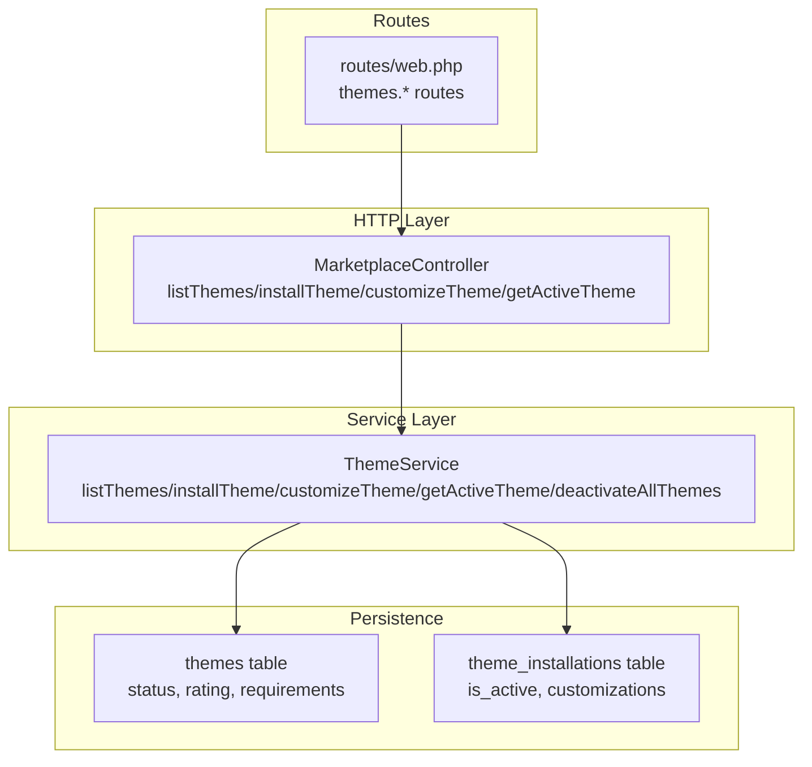
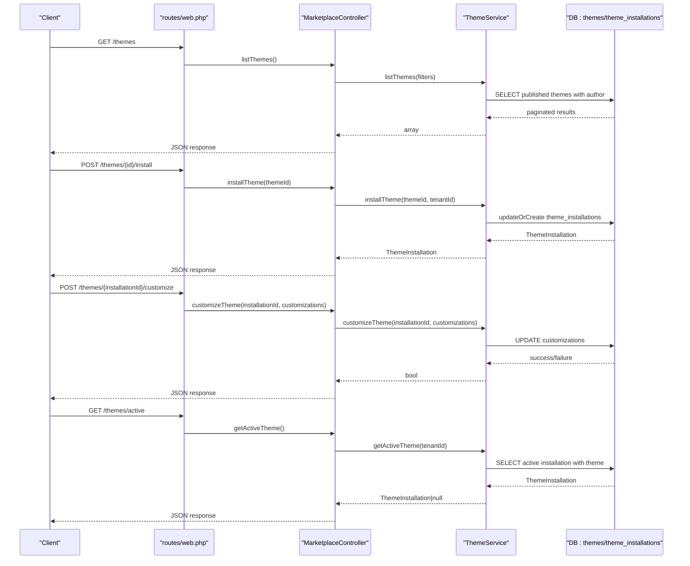
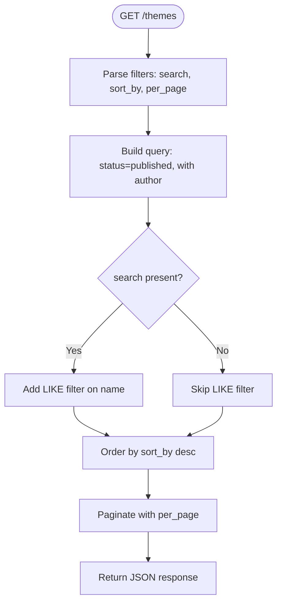
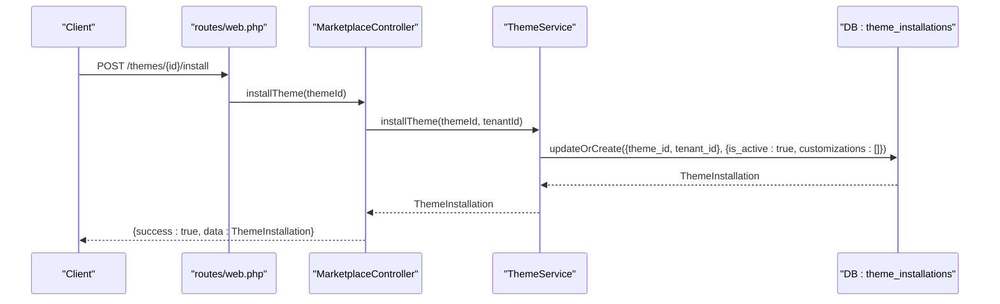
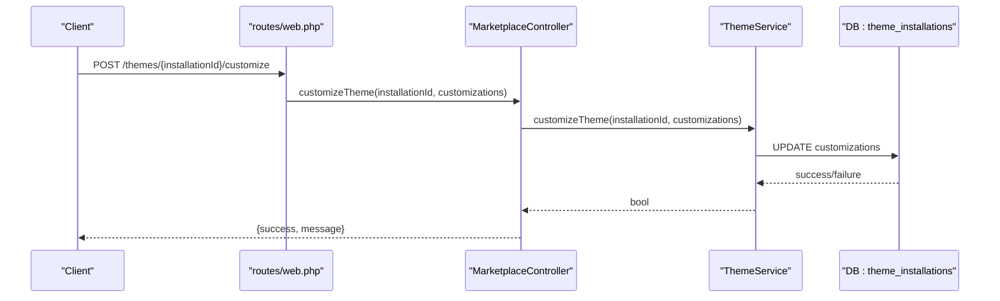
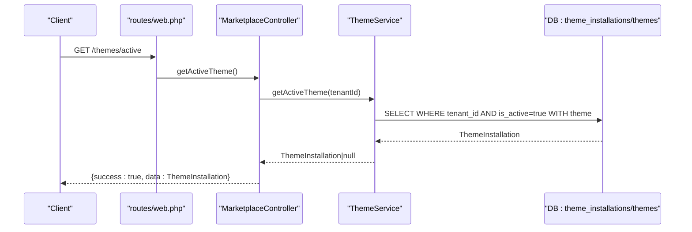
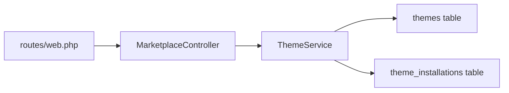

# Theme Marketplace

<cite>
**Referenced Files in This Document**
- [routes/web.php](file://routes/web.php)
- [app/Http/Controllers/Marketplace/MarketplaceController.php](file://app/Http/Controllers/Marketplace/MarketplaceController.php)
- [app/Services/Marketplace/ThemeService.php](file://app/Services/Marketplace/ThemeService.php)
- [database/migrations/2026_04_06_130000_create_marketplace_tables.php](file://database/migrations/2026_04_06_130000_create_marketplace_tables.php)
</cite>

## Table of Contents
1. [Introduction](#introduction)
2. [Project Structure](#project-structure)
3. [Core Components](#core-components)
4. [Architecture Overview](#architecture-overview)
5. [Detailed Component Analysis](#detailed-component-analysis)
6. [Dependency Analysis](#dependency-analysis)
7. [Performance Considerations](#performance-considerations)
8. [Troubleshooting Guide](#troubleshooting-guide)
9. [Conclusion](#conclusion)

## Introduction
This document describes the Theme Marketplace system within the qalcuityERP platform. It covers how tenants browse and select themes, how previews would be handled conceptually, how compatibility is checked via marketplace metadata, and how themes are installed, customized, and activated. It also outlines the theme development framework, CSS architecture, and responsive design principles, and documents the marketplace ecosystem including submission processes, review workflows, and quality standards. Finally, it provides guidance on performance optimization and mobile responsiveness considerations.

## Project Structure
The Theme Marketplace is implemented as part of the Marketplace module. The routing exposes endpoints under the themes namespace, while the controller delegates to a dedicated service that encapsulates theme-related business logic. Persistence is handled by dedicated tables for themes and theme installations.

**Diagram sources**
- [routes/web.php:2942-2948](file://routes/web.php#L2942-L2948)
- [app/Http/Controllers/Marketplace/MarketplaceController.php:466-513](file://app/Http/Controllers/Marketplace/MarketplaceController.php#L466-L513)
- [app/Services/Marketplace/ThemeService.php:13-85](file://app/Services/Marketplace/ThemeService.php#L13-L85)
- [database/migrations/2026_04_06_130000_create_marketplace_tables.php:28-44](file://database/migrations/2026_04_06_130000_create_marketplace_tables.php#L28-L44)
- [database/migrations/2026_04_06_130000_create_marketplace_tables.php:186-195](file://database/migrations/2026_04_06_130000_create_marketplace_tables.php#L186-L195)

**Section sources**
- [routes/web.php:2942-2948](file://routes/web.php#L2942-L2948)
- [app/Http/Controllers/Marketplace/MarketplaceController.php:466-513](file://app/Http/Controllers/Marketplace/MarketplaceController.php#L466-L513)
- [app/Services/Marketplace/ThemeService.php:13-85](file://app/Services/Marketplace/ThemeService.php#L13-L85)
- [database/migrations/2026_04_06_130000_create_marketplace_tables.php:28-44](file://database/migrations/2026_04_06_130000_create_marketplace_tables.php#L28-L44)
- [database/migrations/2026_04_06_130000_create_marketplace_tables.php:186-195](file://database/migrations/2026_04_06_130000_create_marketplace_tables.php#L186-L195)

## Core Components
- Theme browsing and discovery: The controller’s listThemes endpoint queries published themes with optional search and sorting.
- Theme installation: The controller’s installTheme endpoint creates or updates a tenant’s theme installation record and activates it.
- Theme customization: The controller’s customizeTheme endpoint persists user-defined customizations for a given installation.
- Active theme retrieval: The controller’s getActiveTheme endpoint returns the currently active theme for the tenant.
- Persistence: Themes and theme installations are persisted in dedicated tables with indexes for performance and filtering.

Key implementation references:
- [listThemes:466-474](file://app/Http/Controllers/Marketplace/MarketplaceController.php#L466-L474)
- [installTheme:479-487](file://app/Http/Controllers/Marketplace/MarketplaceController.php#L479-L487)
- [customizeTheme:492-500](file://app/Http/Controllers/Marketplace/MarketplaceController.php#L492-L500)
- [getActiveTheme:505-513](file://app/Http/Controllers/Marketplace/MarketplaceController.php#L505-L513)
- [ThemeService::listThemes:13-26](file://app/Services/Marketplace/ThemeService.php#L13-L26)
- [ThemeService::installTheme:31-43](file://app/Services/Marketplace/ThemeService.php#L31-L43)
- [ThemeService::customizeTheme:48-63](file://app/Services/Marketplace/ThemeService.php#L48-L63)
- [ThemeService::getActiveTheme:68-74](file://app/Services/Marketplace/ThemeService.php#L68-L74)

**Section sources**
- [app/Http/Controllers/Marketplace/MarketplaceController.php:466-513](file://app/Http/Controllers/Marketplace/MarketplaceController.php#L466-L513)
- [app/Services/Marketplace/ThemeService.php:13-85](file://app/Services/Marketplace/ThemeService.php#L13-L85)

## Architecture Overview
The Theme Marketplace follows a layered architecture:
- Routing defines the endpoints under the themes namespace.
- The controller handles HTTP concerns and delegates to the ThemeService.
- The ThemeService encapsulates business logic and interacts with persistence models.
- Database migrations define the schema for themes and theme installations.

**Diagram sources**
- [routes/web.php:2942-2948](file://routes/web.php#L2942-L2948)
- [app/Http/Controllers/Marketplace/MarketplaceController.php:466-513](file://app/Http/Controllers/Marketplace/MarketplaceController.php#L466-L513)
- [app/Services/Marketplace/ThemeService.php:13-85](file://app/Services/Marketplace/ThemeService.php#L13-L85)

## Detailed Component Analysis

### Theme Browsing and Selection
- Endpoint: GET /themes
- Filters supported: search, sort_by, per_page
- Behavior: Returns published themes with author eager-loaded, paginated
- Preview capability: Not implemented in the current code; preview could be added by extending the theme model and controller response to include preview assets
- Compatibility checking: Not implemented in the current code; compatibility could leverage the requirements field on themes and compare against tenant runtime (PHP/Laravel versions)

**Diagram sources**
- [app/Services/Marketplace/ThemeService.php:13-26](file://app/Services/Marketplace/ThemeService.php#L13-L26)
- [app/Http/Controllers/Marketplace/MarketplaceController.php:466-474](file://app/Http/Controllers/Marketplace/MarketplaceController.php#L466-L474)

**Section sources**
- [app/Services/Marketplace/ThemeService.php:13-26](file://app/Services/Marketplace/ThemeService.php#L13-L26)
- [app/Http/Controllers/Marketplace/MarketplaceController.php:466-474](file://app/Http/Controllers/Marketplace/MarketplaceController.php#L466-L474)

### Theme Installation Workflow
- Endpoint: POST /themes/{id}/install
- Behavior: Creates or updates a theme installation for the authenticated tenant and activates it
- Activation: The service sets is_active to true for the tenant’s installation
- Deactivation: A helper method exists to deactivate all themes for a tenant

**Diagram sources**
- [routes/web.php:2944](file://routes/web.php#L2944)
- [app/Http/Controllers/Marketplace/MarketplaceController.php:479-487](file://app/Http/Controllers/Marketplace/MarketplaceController.php#L479-L487)
- [app/Services/Marketplace/ThemeService.php:31-43](file://app/Services/Marketplace/ThemeService.php#L31-L43)

**Section sources**
- [app/Http/Controllers/Marketplace/MarketplaceController.php:479-487](file://app/Http/Controllers/Marketplace/MarketplaceController.php#L479-L487)
- [app/Services/Marketplace/ThemeService.php:31-43](file://app/Services/Marketplace/ThemeService.php#L31-L43)

### Theme Customization and Activation
- Endpoint: POST /themes/{installationId}/customize
- Behavior: Persists customizations for the installation; errors are logged and surfaced as failure
- Activation: The service sets is_active to true during installation; deactivating all themes for a tenant is supported by a dedicated method

**Diagram sources**
- [routes/web.php:2946](file://routes/web.php#L2946)
- [app/Http/Controllers/Marketplace/MarketplaceController.php:492-500](file://app/Http/Controllers/Marketplace/MarketplaceController.php#L492-L500)
- [app/Services/Marketplace/ThemeService.php:48-63](file://app/Services/Marketplace/ThemeService.php#L48-L63)

**Section sources**
- [app/Http/Controllers/Marketplace/MarketplaceController.php:492-500](file://app/Http/Controllers/Marketplace/MarketplaceController.php#L492-L500)
- [app/Services/Marketplace/ThemeService.php:48-63](file://app/Services/Marketplace/ThemeService.php#L48-L63)

### Active Theme Retrieval
- Endpoint: GET /themes/active
- Behavior: Returns the tenant’s active theme installation with the associated theme model eager-loaded

**Diagram sources**
- [routes/web.php:2947](file://routes/web.php#L2947)
- [app/Http/Controllers/Marketplace/MarketplaceController.php:505-513](file://app/Http/Controllers/Marketplace/MarketplaceController.php#L505-L513)
- [app/Services/Marketplace/ThemeService.php:68-74](file://app/Services/Marketplace/ThemeService.php#L68-L74)

**Section sources**
- [app/Http/Controllers/Marketplace/MarketplaceController.php:505-513](file://app/Http/Controllers/Marketplace/MarketplaceController.php#L505-L513)
- [app/Services/Marketplace/ThemeService.php:68-74](file://app/Services/Marketplace/ThemeService.php#L68-L74)

### Theme Development Framework, CSS Architecture, and Responsive Design
- Theme development framework: Themes are modeled as marketplace items with a status lifecycle (pending, approved, rejected, published) and metadata such as requirements and ratings. The theme installation record stores per-tenant activation state and customizations.
- CSS architecture: The repository includes Tailwind CSS configuration and UI/UX implementation guides that inform consistent styling and layout patterns across modules. These serve as the foundation for theme styling and component design.
- Responsive design: Mobile responsiveness is documented in dedicated guides, providing standards and patterns for form layouts, grid systems, and toolbar/filter components tailored for mobile devices.

Implementation references:
- [themes table schema:28-44](file://database/migrations/2026_04_06_130000_create_marketplace_tables.php#L28-L44)
- [theme_installations table schema:186-195](file://database/migrations/2026_04_06_130000_create_marketplace_tables.php#L186-L195)
- [Tailwind config](file://tailwind.config.js)
- [Mobile responsive guide](file://docs/MOBILE_RESPONSIVE_IMPLEMENTATION.md)
- [UI/UX implementation guide](file://UI_UX_IMPLEMENTATION_GUIDE.md)

**Section sources**
- [database/migrations/2026_04_06_130000_create_marketplace_tables.php:28-44](file://database/migrations/2026_04_06_130000_create_marketplace_tables.php#L28-L44)
- [database/migrations/2026_04_06_130000_create_marketplace_tables.php:186-195](file://database/migrations/2026_04_06_130000_create_marketplace_tables.php#L186-L195)
- [tailwind.config.js](file://tailwind.config.js)
- [docs/MOBILE_RESPONSIVE_IMPLEMENTATION.md](file://docs/MOBILE_RESPONSIVE_IMPLEMENTATION.md)
- [UI_UX_IMPLEMENTATION_GUIDE.md](file://UI_UX_IMPLEMENTATION_GUIDE.md)

### Theme Marketplace Ecosystem: Submission, Review, and Quality Standards
- Submission: Developers submit themes; the themes table includes fields for documentation, support, and repository URLs, enabling discoverability and transparency.
- Review workflow: The themes table includes status and rejection_reason fields, indicating a structured approval pipeline.
- Quality standards: The requirements field allows specifying PHP and Laravel version compatibility, ensuring themes meet runtime constraints before publication.

References:
- [themes table fields:28-44](file://database/migrations/2026_04_06_130000_create_marketplace_tables.php#L28-L44)

**Section sources**
- [database/migrations/2026_04_06_130000_create_marketplace_tables.php:28-44](file://database/migrations/2026_04_06_130000_create_marketplace_tables.php#L28-L44)

### Examples of Theme Customization, Branding, and ERP Module Integration
- Customization: The theme installation record stores a JSON field for customizations, enabling color schemes, typography overrides, and layout preferences per tenant.
- Branding: Branding capabilities can be achieved by exposing brand-related customization keys (e.g., primary color, logo path) in the customizations payload and rendering them consistently across templates.
- ERP module integration: Themes can integrate with various ERP modules by adhering to shared UI patterns and component libraries defined in the UI/UX guidelines, ensuring consistent navigation, modals, and forms across modules.

References:
- [theme_installations.customizations:186-195](file://database/migrations/2026_04_06_130000_create_marketplace_tables.php#L186-L195)
- [UI/UX implementation guide](file://UI_UX_IMPLEMENTATION_GUIDE.md)

**Section sources**
- [database/migrations/2026_04_06_130000_create_marketplace_tables.php:186-195](file://database/migrations/2026_04_06_130000_create_marketplace_tables.php#L186-L195)
- [UI_UX_IMPLEMENTATION_GUIDE.md](file://UI_UX_IMPLEMENTATION_GUIDE.md)

## Dependency Analysis
The Theme Marketplace depends on:
- Routing layer for endpoint exposure
- Controller for HTTP orchestration
- Service layer for business logic
- Database schema for persistence

**Diagram sources**
- [routes/web.php:2942-2948](file://routes/web.php#L2942-L2948)
- [app/Http/Controllers/Marketplace/MarketplaceController.php:466-513](file://app/Http/Controllers/Marketplace/MarketplaceController.php#L466-L513)
- [app/Services/Marketplace/ThemeService.php:13-85](file://app/Services/Marketplace/ThemeService.php#L13-L85)
- [database/migrations/2026_04_06_130000_create_marketplace_tables.php:28-44](file://database/migrations/2026_04_06_130000_create_marketplace_tables.php#L28-L44)
- [database/migrations/2026_04_06_130000_create_marketplace_tables.php:186-195](file://database/migrations/2026_04_06_130000_create_marketplace_tables.php#L186-L195)

**Section sources**
- [routes/web.php:2942-2948](file://routes/web.php#L2942-L2948)
- [app/Http/Controllers/Marketplace/MarketplaceController.php:466-513](file://app/Http/Controllers/Marketplace/MarketplaceController.php#L466-L513)
- [app/Services/Marketplace/ThemeService.php:13-85](file://app/Services/Marketplace/ThemeService.php#L13-L85)
- [database/migrations/2026_04_06_130000_create_marketplace_tables.php:28-44](file://database/migrations/2026_04_06_130000_create_marketplace_tables.php#L28-L44)
- [database/migrations/2026_04_06_130000_create_marketplace_tables.php:186-195](file://database/migrations/2026_04_06_130000_create_marketplace_tables.php#L186-L195)

## Performance Considerations
- Pagination: The listThemes endpoint paginates results to avoid large payloads.
- Indexing: The themes and app_installations tables include strategic indexes to accelerate filtering and sorting.
- Eager loading: Author data is eagerly loaded to reduce N+1 queries when listing themes.
- Recommendations:
  - Add indexes on themes.status and themes.rating for fast filtering and sorting.
  - Cache frequently accessed theme metadata for anonymous browsing.
  - Use database connection pooling and limit concurrent requests to the marketplace endpoints.

[No sources needed since this section provides general guidance]

## Troubleshooting Guide
- Installation failures: Verify tenant context and that the theme exists. Check logs for exceptions during installation.
- Customization failures: Inspect the installation ID validity and ensure the customizations payload is well-formed JSON.
- Active theme retrieval: Confirm that exactly one installation is marked active for the tenant; otherwise, handle null gracefully.

Operational references:
- [installTheme:479-487](file://app/Http/Controllers/Marketplace/MarketplaceController.php#L479-L487)
- [customizeTheme:492-500](file://app/Http/Controllers/Marketplace/MarketplaceController.php#L492-L500)
- [getActiveTheme:505-513](file://app/Http/Controllers/Marketplace/MarketplaceController.php#L505-L513)
- [ThemeService::customizeTheme error logging:55-62](file://app/Services/Marketplace/ThemeService.php#L55-L62)

**Section sources**
- [app/Http/Controllers/Marketplace/MarketplaceController.php:479-487](file://app/Http/Controllers/Marketplace/MarketplaceController.php#L479-L487)
- [app/Http/Controllers/Marketplace/MarketplaceController.php:492-500](file://app/Http/Controllers/Marketplace/MarketplaceController.php#L492-L500)
- [app/Http/Controllers/Marketplace/MarketplaceController.php:505-513](file://app/Http/Controllers/Marketplace/MarketplaceController.php#L505-L513)
- [app/Services/Marketplace/ThemeService.php:55-62](file://app/Services/Marketplace/ThemeService.php#L55-L62)

## Conclusion
The Theme Marketplace provides a clean separation of concerns with explicit endpoints for browsing, installing, customizing, and activating themes. The underlying schema supports a robust lifecycle and per-tenant customization. Extending the system to include preview functionality, compatibility checks, and a formalized review pipeline would further strengthen the developer and tenant experience. Adhering to the existing UI/UX and responsive design guidelines ensures consistent, accessible themes across modules and devices.