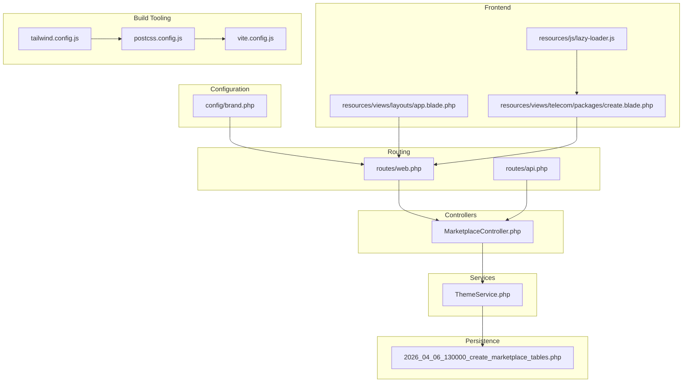
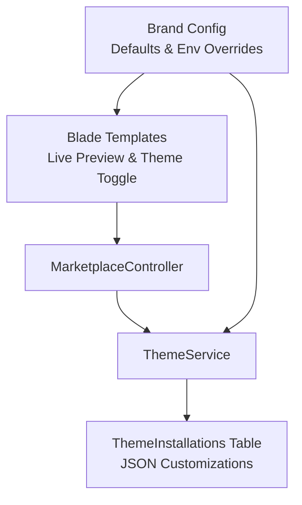
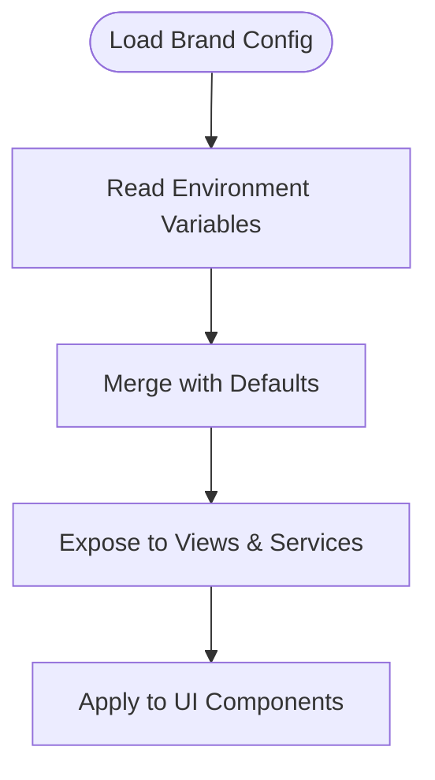
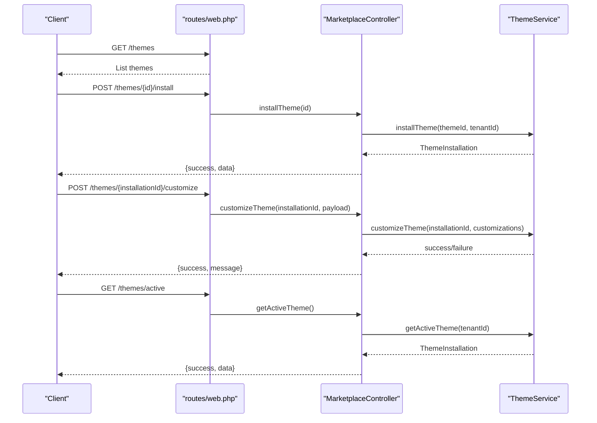
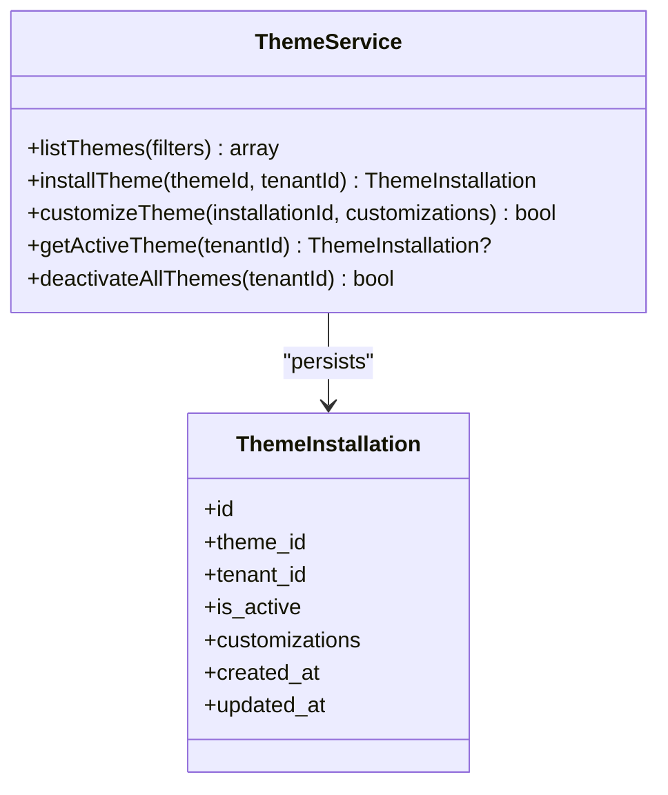
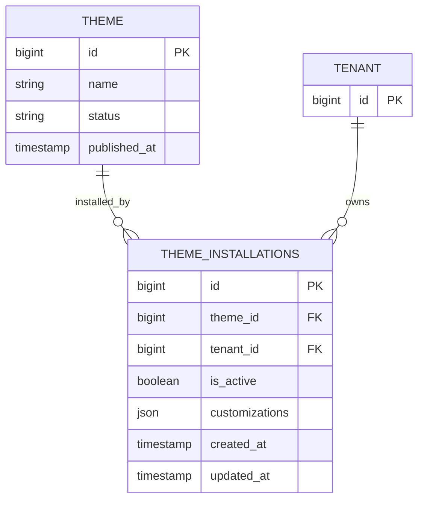
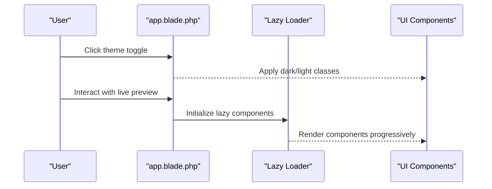
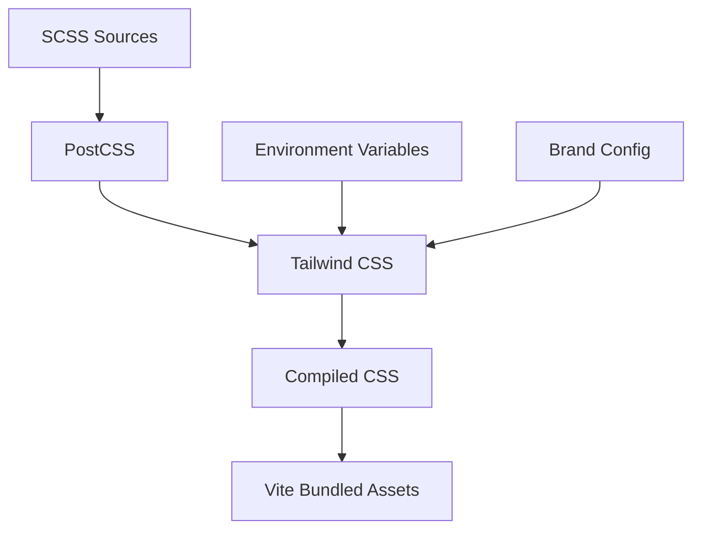
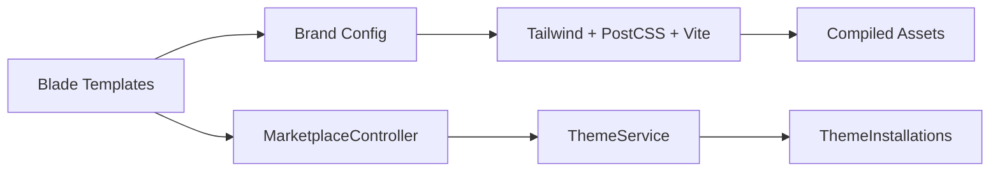

# Theme Customization System

<cite>
**Referenced Files in This Document**
- [brand.php](file://config/brand.php)
- [web.php](file://routes/web.php)
- [api.php](file://routes/api.php)
- [MarketplaceController.php](file://app/Http/Controllers/Marketplace/MarketplaceController.php)
- [ThemeService.php](file://app/Services/Marketplace/ThemeService.php)
- [2026_04_06_130000_create_marketplace_tables.php](file://database/migrations/2026_04_06_130000_create_marketplace_tables.php)
- [app.blade.php](file://resources/views/layouts/app.blade.php)
- [create.blade.php](file://resources/views/telecom/packages/create.blade.php)
- [lazy-loader.js](file://resources/js/lazy-loader.js)
- [tailwind.config.js](file://tailwind.config.js)
- [vite.config.js](file://vite.config.js)
- [postcss.config.js](file://postcss.config.js)
</cite>

## Table of Contents
1. [Introduction](#introduction)
2. [Project Structure](#project-structure)
3. [Core Components](#core-components)
4. [Architecture Overview](#architecture-overview)
5. [Detailed Component Analysis](#detailed-component-analysis)
6. [Dependency Analysis](#dependency-analysis)
7. [Performance Considerations](#performance-considerations)
8. [Troubleshooting Guide](#troubleshooting-guide)
9. [Conclusion](#conclusion)
10. [Appendices](#appendices)

## Introduction
This document describes the theme customization and personalization system in the application. It covers live preview capabilities, customization options (color schemes, typography, layout, branding), the customization API, persistence of tenant-specific preferences, CSS variable injection, SCSS compilation, asset regeneration, validation and security measures, inheritance and fallback mechanisms, default value management, and export/import functionality for theme portability.

## Project Structure
The theme customization system spans configuration, routing, controllers, services, persistence, frontend assets, and build tooling:
- Configuration defines brand defaults and environment overrides.
- Routes expose endpoints for theme marketplace and customization.
- Controllers orchestrate requests and delegate to services.
- Services encapsulate business logic for theme installation, customization, and activation.
- Migrations define persistence schema for theme installations and customizations.
- Blade templates provide live preview and theme toggle UI.
- JavaScript handles dynamic UI updates and lazy loading.
- Tailwind CSS, PostCSS, and Vite manage SCSS compilation and asset generation.

**Diagram sources**
- [brand.php:1-135](file://config/brand.php#L1-L135)
- [web.php:2942-2948](file://routes/web.php#L2942-L2948)
- [api.php:1-477](file://routes/api.php#L1-L477)
- [MarketplaceController.php:474-525](file://app/Http/Controllers/Marketplace/MarketplaceController.php#L474-L525)
- [ThemeService.php:1-86](file://app/Services/Marketplace/ThemeService.php#L1-L86)
- [2026_04_06_130000_create_marketplace_tables.php:178-195](file://database/migrations/2026_04_06_130000_create_marketplace_tables.php#L178-L195)
- [app.blade.php:731-744](file://resources/views/layouts/app.blade.php#L731-L744)
- [create.blade.php:192-212](file://resources/views/telecom/packages/create.blade.php#L192-L212)
- [lazy-loader.js:177-218](file://resources/js/lazy-loader.js#L177-L218)
- [tailwind.config.js](file://tailwind.config.js)
- [postcss.config.js](file://postcss.config.js)
- [vite.config.js](file://vite.config.js)

**Section sources**
- [brand.php:1-135](file://config/brand.php#L1-L135)
- [web.php:2942-2948](file://routes/web.php#L2942-L2948)
- [api.php:1-477](file://routes/api.php#L1-L477)
- [MarketplaceController.php:474-525](file://app/Http/Controllers/Marketplace/MarketplaceController.php#L474-L525)
- [ThemeService.php:1-86](file://app/Services/Marketplace/ThemeService.php#L1-L86)
- [2026_04_06_130000_create_marketplace_tables.php:178-195](file://database/migrations/2026_04_06_130000_create_marketplace_tables.php#L178-L195)
- [app.blade.php:731-744](file://resources/views/layouts/app.blade.php#L731-L744)
- [create.blade.php:192-212](file://resources/views/telecom/packages/create.blade.php#L192-L212)
- [lazy-loader.js:177-218](file://resources/js/lazy-loader.js#L177-L218)
- [tailwind.config.js](file://tailwind.config.js)
- [postcss.config.js](file://postcss.config.js)
- [vite.config.js](file://vite.config.js)

## Core Components
- Brand configuration: Centralized brand defaults and environment overrides for colors, gradients, typography, borders, shadows, logos, receipts, and feature flags.
- Theme marketplace routes: Public endpoints for listing, installing, customizing, and retrieving active themes.
- Marketplace controller: Orchestrates theme lifecycle actions and delegates persistence to ThemeService.
- Theme service: Manages theme installation, customization persistence, and active theme retrieval.
- Persistence schema: Stores theme installations per tenant with JSON customizations and activation flags.
- Frontend live preview: Blade templates demonstrate live preview UI and theme toggle controls.
- Build pipeline: Tailwind CSS, PostCSS, and Vite coordinate SCSS compilation and asset regeneration.

**Section sources**
- [brand.php:14-134](file://config/brand.php#L14-L134)
- [web.php:2942-2948](file://routes/web.php#L2942-L2948)
- [MarketplaceController.php:474-525](file://app/Http/Controllers/Marketplace/MarketplaceController.php#L474-L525)
- [ThemeService.php:1-86](file://app/Services/Marketplace/ThemeService.php#L1-L86)
- [2026_04_06_130000_create_marketplace_tables.php:178-195](file://database/migrations/2026_04_06_130000_create_marketplace_tables.php#L178-L195)
- [app.blade.php:731-744](file://resources/views/layouts/app.blade.php#L731-L744)
- [create.blade.php:192-212](file://resources/views/telecom/packages/create.blade.php#L192-L212)
- [tailwind.config.js](file://tailwind.config.js)
- [postcss.config.js](file://postcss.config.js)
- [vite.config.js](file://vite.config.js)

## Architecture Overview
The system follows a layered architecture:
- Presentation: Blade templates render live previews and theme toggle UI.
- Application: Controllers handle HTTP requests and responses.
- Domain: Services encapsulate theme business logic.
- Persistence: Database stores theme installations and customizations.
- Infrastructure: Build tooling compiles styles and generates assets.

**Diagram sources**
- [app.blade.php:731-744](file://resources/views/layouts/app.blade.php#L731-L744)
- [create.blade.php:192-212](file://resources/views/telecom/packages/create.blade.php#L192-L212)
- [MarketplaceController.php:474-525](file://app/Http/Controllers/Marketplace/MarketplaceController.php#L474-L525)
- [ThemeService.php:1-86](file://app/Services/Marketplace/ThemeService.php#L1-L86)
- [2026_04_06_130000_create_marketplace_tables.php:178-195](file://database/migrations/2026_04_06_130000_create_marketplace_tables.php#L178-L195)
- [brand.php:14-134](file://config/brand.php#L14-L134)

## Detailed Component Analysis

### Brand Configuration and Defaults
- Defines primary and semantic colors, gradient presets, logo settings, typography families, border radius, shadow presets, payment icons, e-wallet branding, receipt preferences, UI text, feature flags, and quick cash amounts.
- Environment variables override defaults for easy tenant customization without code changes.

**Diagram sources**
- [brand.php:14-134](file://config/brand.php#L14-L134)

**Section sources**
- [brand.php:14-134](file://config/brand.php#L14-L134)

### Theme Marketplace Routes
- Provides endpoints for listing themes, installing a theme, customizing an installed theme, and retrieving the active theme for a tenant.
- Uses route groups under a dedicated prefix for theme management.

**Diagram sources**
- [web.php:2942-2948](file://routes/web.php#L2942-L2948)
- [MarketplaceController.php:474-525](file://app/Http/Controllers/Marketplace/MarketplaceController.php#L474-L525)
- [ThemeService.php:13-86](file://app/Services/Marketplace/ThemeService.php#L13-L86)

**Section sources**
- [web.php:2942-2948](file://routes/web.php#L2942-L2948)
- [MarketplaceController.php:474-525](file://app/Http/Controllers/Marketplace/MarketplaceController.php#L474-L525)
- [ThemeService.php:13-86](file://app/Services/Marketplace/ThemeService.php#L13-L86)

### ThemeService: Installation, Customization, Activation
- listThemes: Filters and paginates published themes.
- installTheme: Upserts theme installation for a tenant and activates it.
- customizeTheme: Persists customizations as JSON on the installation record.
- getActiveTheme: Retrieves the tenant’s currently active theme with associated metadata.
- deactivateAllThemes: Ensures only one active theme per tenant.

**Diagram sources**
- [ThemeService.php:1-86](file://app/Services/Marketplace/ThemeService.php#L1-L86)
- [2026_04_06_130000_create_marketplace_tables.php:178-195](file://database/migrations/2026_04_06_130000_create_marketplace_tables.php#L178-L195)

**Section sources**
- [ThemeService.php:1-86](file://app/Services/Marketplace/ThemeService.php#L1-L86)
- [2026_04_06_130000_create_marketplace_tables.php:178-195](file://database/migrations/2026_04_06_130000_create_marketplace_tables.php#L178-L195)

### Persistence Schema: ThemeInstallations
- Stores per-tenant theme installations with activation flag and JSON customizations.
- Enforces uniqueness on theme per tenant to prevent duplicates.

**Diagram sources**
- [2026_04_06_130000_create_marketplace_tables.php:178-195](file://database/migrations/2026_04_06_130000_create_marketplace_tables.php#L178-L195)

**Section sources**
- [2026_04_06_130000_create_marketplace_tables.php:178-195](file://database/migrations/2026_04_06_130000_create_marketplace_tables.php#L178-L195)

### Live Preview and Theme Toggle UI
- Theme toggle button switches between light and dark modes.
- Live preview demonstrates real-time rendering of UI elements with gradient backgrounds and interactive controls.

**Diagram sources**
- [app.blade.php:731-744](file://resources/views/layouts/app.blade.php#L731-L744)
- [lazy-loader.js:177-218](file://resources/js/lazy-loader.js#L177-L218)
- [create.blade.php:192-212](file://resources/views/telecom/packages/create.blade.php#L192-L212)

**Section sources**
- [app.blade.php:731-744](file://resources/views/layouts/app.blade.php#L731-L744)
- [lazy-loader.js:177-218](file://resources/js/lazy-loader.js#L177-L218)
- [create.blade.php:192-212](file://resources/views/telecom/packages/create.blade.php#L192-L212)

### Customization Options
- Color schemes: Primary, secondary, success, warning, error, info palettes.
- Gradients: Header gradient presets.
- Typography: Font family and heading font.
- Layout: Border radius and shadow presets.
- Branding: Logo URL, dimensions, visibility in receipts.
- Payment UI: Icons, e-wallet branding, feature flags, quick cash amounts.
- Receipts: Logo visibility, footer message, QR code, paper width.
- UI text: App name, payment UI title, instructions, success/expired messages.

**Section sources**
- [brand.php:14-134](file://config/brand.php#L14-L134)

### Customization API Endpoints
- GET /themes: List published themes.
- POST /themes/{id}/install: Install a theme for the current tenant and activate it.
- POST /themes/{installationId}/customize: Persist customizations as JSON.
- GET /themes/active: Retrieve the tenant’s active theme.

These endpoints are defined in the routes file and handled by the MarketplaceController, delegating persistence to ThemeService.

**Section sources**
- [web.php:2942-2948](file://routes/web.php#L2942-L2948)
- [MarketplaceController.php:474-525](file://app/Http/Controllers/Marketplace/MarketplaceController.php#L474-L525)
- [ThemeService.php:13-86](file://app/Services/Marketplace/ThemeService.php#L13-L86)

### Customization Persistence
- Customizations are stored as JSON on the ThemeInstallation record.
- The service updates the customizations field atomically and logs errors for failure scenarios.
- Active theme selection ensures only one theme is active per tenant.

**Section sources**
- [ThemeService.php:45-86](file://app/Services/Marketplace/ThemeService.php#L45-L86)
- [2026_04_06_130000_create_marketplace_tables.php:178-195](file://database/migrations/2026_04_06_130000_create_marketplace_tables.php#L178-L195)

### CSS Variable Injection, SCSS Compilation, and Asset Regeneration
- Tailwind CSS and PostCSS process SCSS and generate optimized CSS.
- Vite orchestrates asset bundling and hot module replacement during development.
- The system supports runtime theme switching via CSS classes and environment-driven configuration.

**Diagram sources**
- [tailwind.config.js](file://tailwind.config.js)
- [postcss.config.js](file://postcss.config.js)
- [vite.config.js](file://vite.config.js)
- [brand.php:14-134](file://config/brand.php#L14-L134)

**Section sources**
- [tailwind.config.js](file://tailwind.config.js)
- [postcss.config.js](file://postcss.config.js)
- [vite.config.js](file://vite.config.js)
- [brand.php:14-134](file://config/brand.php#L14-L134)

### Validation, Sanitization, and Security Measures
- Input validation occurs at the controller layer for endpoint payloads.
- Customization persistence uses atomic updates to the customizations JSON field.
- Error logging captures customization failures for diagnostics.
- Access control: Theme marketplace endpoints are publicly addressable; authentication and tenant scoping are enforced in controller actions and service methods.

Recommended improvements:
- Add JSON schema validation for customizations before persistence.
- Sanitize and whitelist allowed customization keys to prevent arbitrary property injection.
- Enforce rate limiting and input size limits for customization payloads.
- Implement signed requests or HMAC verification for external customization triggers.

**Section sources**
- [MarketplaceController.php:474-525](file://app/Http/Controllers/Marketplace/MarketplaceController.php#L474-L525)
- [ThemeService.php:45-86](file://app/Services/Marketplace/ThemeService.php#L45-L86)

### Customization Inheritance, Fallbacks, and Defaults
- Brand configuration provides centralized defaults with environment overrides.
- Frontend components read from configuration and fall back to safe defaults when values are missing.
- Active theme customizations merge with defaults to ensure consistent UI behavior.

**Section sources**
- [brand.php:14-134](file://config/brand.php#L14-L134)
- [ThemeService.php:65-86](file://app/Services/Marketplace/ThemeService.php#L65-L86)

### Default Value Management
- Defaults are defined in the brand configuration file.
- Environment variables override defaults at runtime.
- Services and views consume normalized values to avoid undefined states.

**Section sources**
- [brand.php:14-134](file://config/brand.php#L14-L134)

### Export/Import Functionality for Theme Portability
- Current implementation persists customizations as JSON on ThemeInstallation.
- To enable export/import:
  - Export: Serialize the active theme’s customizations and metadata.
  - Import: Validate schema, normalize values, and apply via the customization endpoint.
  - Consider adding a bulk import/export API and schema versioning for compatibility.

[No sources needed since this section proposes future enhancements]

## Dependency Analysis
The theme customization system exhibits low coupling between presentation and domain layers, with clear separation of concerns:
- Controllers depend on ThemeService.
- ThemeService depends on persistence models.
- Views depend on configuration and services for rendering.
- Build tooling integrates configuration into compiled assets.

**Diagram sources**
- [brand.php:14-134](file://config/brand.php#L14-L134)
- [app.blade.php:731-744](file://resources/views/layouts/app.blade.php#L731-L744)
- [MarketplaceController.php:474-525](file://app/Http/Controllers/Marketplace/MarketplaceController.php#L474-L525)
- [ThemeService.php:1-86](file://app/Services/Marketplace/ThemeService.php#L1-L86)
- [2026_04_06_130000_create_marketplace_tables.php:178-195](file://database/migrations/2026_04_06_130000_create_marketplace_tables.php#L178-L195)
- [tailwind.config.js](file://tailwind.config.js)
- [postcss.config.js](file://postcss.config.js)
- [vite.config.js](file://vite.config.js)

**Section sources**
- [brand.php:14-134](file://config/brand.php#L14-L134)
- [MarketplaceController.php:474-525](file://app/Http/Controllers/Marketplace/MarketplaceController.php#L474-L525)
- [ThemeService.php:1-86](file://app/Services/Marketplace/ThemeService.php#L1-L86)
- [2026_04_06_130000_create_marketplace_tables.php:178-195](file://database/migrations/2026_04_06_130000_create_marketplace_tables.php#L178-L195)
- [tailwind.config.js](file://tailwind.config.js)
- [postcss.config.js](file://postcss.config.js)
- [vite.config.js](file://vite.config.js)

## Performance Considerations
- Keep customization payloads minimal to reduce JSON serialization overhead.
- Cache active theme data per tenant to minimize database queries.
- Use lazy loading for heavy components in live preview to improve perceived performance.
- Optimize Tailwind CSS purging and PostCSS transformations for faster builds.

[No sources needed since this section provides general guidance]

## Troubleshooting Guide
Common issues and resolutions:
- Customization not applied: Verify active theme selection and ensure customizations JSON is valid.
- Live preview not updating: Confirm theme toggle classes and lazy loader initialization.
- Build artifacts outdated: Re-run asset build pipeline after configuration changes.
- Rate limiting or payload size errors: Implement client-side validation and chunked updates.

**Section sources**
- [ThemeService.php:45-86](file://app/Services/Marketplace/ThemeService.php#L45-L86)
- [lazy-loader.js:177-218](file://resources/js/lazy-loader.js#L177-L218)
- [tailwind.config.js](file://tailwind.config.js)
- [postcss.config.js](file://postcss.config.js)
- [vite.config.js](file://vite.config.js)

## Conclusion
The theme customization system provides a robust foundation for tenant-specific UI personalization with live preview, centralized configuration, and modular persistence. Extending it with schema validation, export/import, and enhanced security will further strengthen its reliability and portability.

## Appendices
- API endpoint summary:
  - GET /themes: List themes.
  - POST /themes/{id}/install: Install theme.
  - POST /themes/{installationId}/customize: Apply customizations.
  - GET /themes/active: Get active theme.

**Section sources**
- [web.php:2942-2948](file://routes/web.php#L2942-L2948)
- [MarketplaceController.php:474-525](file://app/Http/Controllers/Marketplace/MarketplaceController.php#L474-L525)