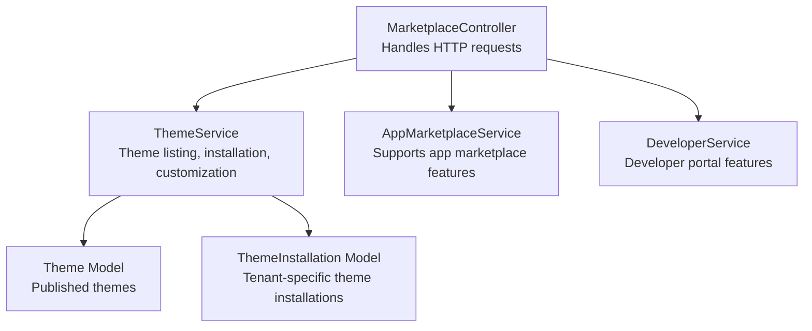
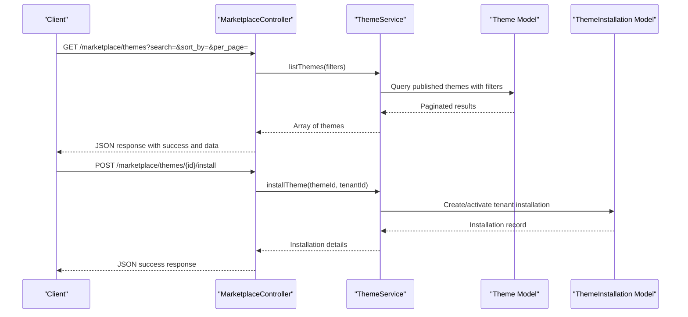
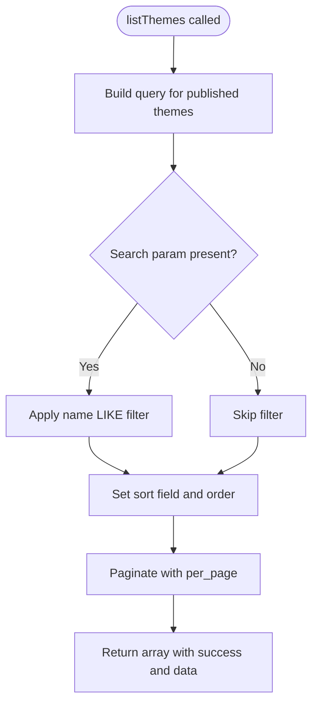
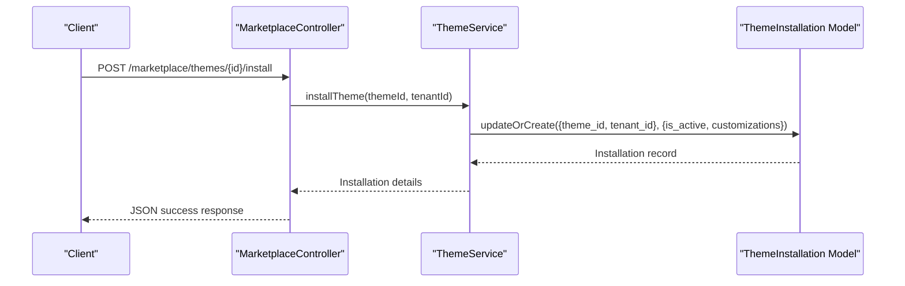
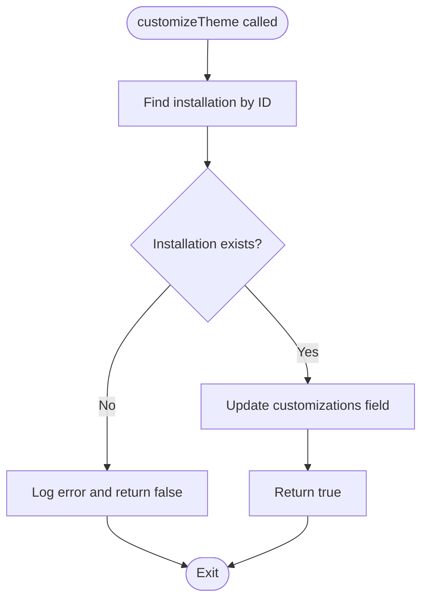
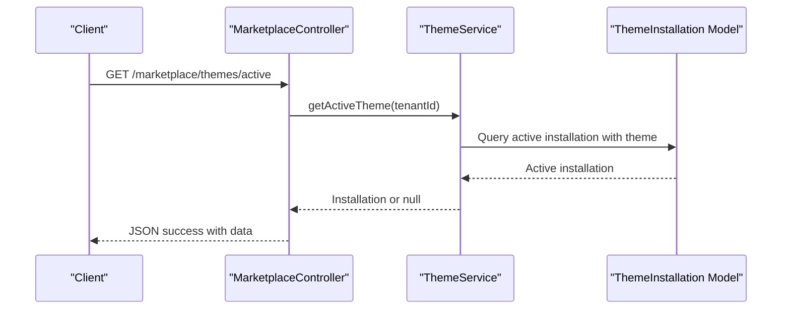
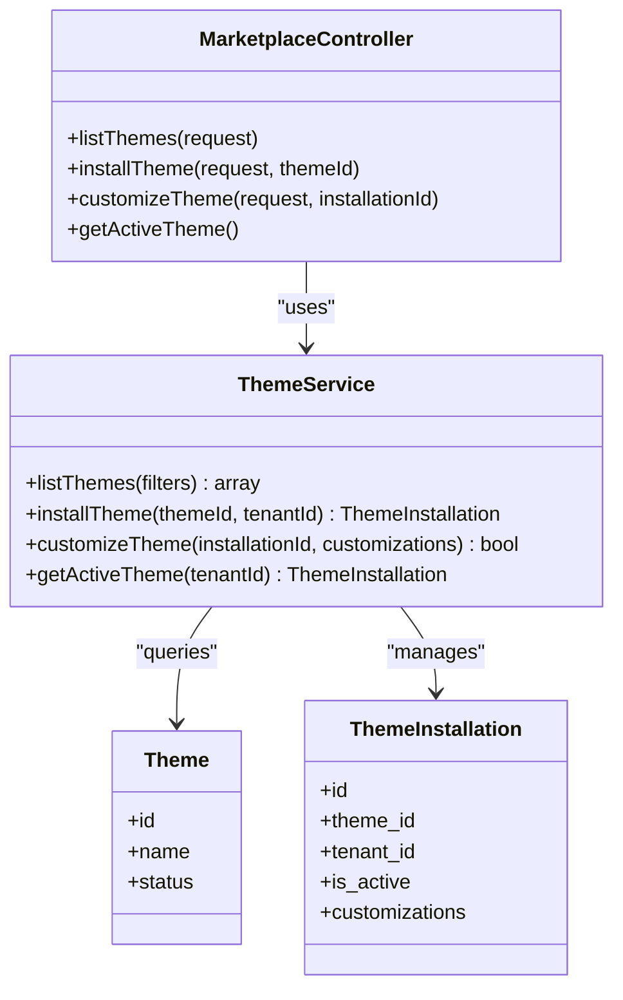

# Theme Discovery & Browsing

<cite>
**Referenced Files in This Document**
- [MarketplaceController.php](file://app/Http/Controllers/Marketplace/MarketplaceController.php)
- [ThemeService.php](file://app/Services/Marketplace/ThemeService.php)
- [AppMarketplaceService.php](file://app/Services/Marketplace/AppMarketplaceService.php)
- [DeveloperService.php](file://app/Services/Marketplace/DeveloperService.php)
- [2026_04_06_130000_create_marketplace_tables.php](file://database/migrations/2026_04_06_130000_create_marketplace_tables.php)
- [MOBILE_RESPONSIVE_IMPLEMENTATION.md](file://docs/MOBILE_RESPONSIVE_IMPLEMENTATION.md)
</cite>

## Table of Contents
1. [Introduction](#introduction)
2. [Project Structure](#project-structure)
3. [Core Components](#core-components)
4. [Architecture Overview](#architecture-overview)
5. [Detailed Component Analysis](#detailed-component-analysis)
6. [Dependency Analysis](#dependency-analysis)
7. [Performance Considerations](#performance-considerations)
8. [Troubleshooting Guide](#troubleshooting-guide)
9. [Conclusion](#conclusion)

## Introduction
This document describes the theme discovery and browsing system within the application's marketplace. It covers the theme marketplace interface, search and filtering capabilities, sorting and pagination, theme listing presentation, preview functionality, metadata display, and the underlying search algorithms and relevance scoring. It also outlines responsive design considerations for mobile browsing and cross-device compatibility.

## Project Structure
The theme discovery and browsing system is implemented through a controller that delegates to a dedicated service layer. The controller exposes endpoints for listing themes, installing themes, customizing themes, and retrieving the active theme per tenant. The service layer encapsulates data access and business logic for theme operations.

**Diagram sources**
- [MarketplaceController.php:13-28](file://app/Http/Controllers/Marketplace/MarketplaceController.php#L13-L28)
- [ThemeService.php:8-26](file://app/Services/Marketplace/ThemeService.php#L8-L26)
- [AppMarketplaceService.php:10-53](file://app/Services/Marketplace/AppMarketplaceService.php#L10-L53)
- [DeveloperService.php:11-27](file://app/Services/Marketplace/DeveloperService.php#L11-L27)

**Section sources**
- [MarketplaceController.php:13-28](file://app/Http/Controllers/Marketplace/MarketplaceController.php#L13-L28)
- [ThemeService.php:8-26](file://app/Services/Marketplace/ThemeService.php#L8-L26)

## Core Components
- MarketplaceController: Provides endpoints for theme browsing, installation, customization, and retrieval of the active theme. It also handles app marketplace operations for comparison and context.
- ThemeService: Implements theme listing with basic search, sorting, and pagination; manages theme installation and customization per tenant; retrieves the active theme.
- Supporting Services: AppMarketplaceService and DeveloperService provide complementary marketplace features that inform the broader ecosystem.

Key responsibilities:
- Theme listing with optional search term and sort order
- Pagination support for scalable browsing
- Tenant-scoped theme installation and activation
- Theme customization persistence
- Active theme resolution for rendering

**Section sources**
- [MarketplaceController.php:466-513](file://app/Http/Controllers/Marketplace/MarketplaceController.php#L466-L513)
- [ThemeService.php:13-26](file://app/Services/Marketplace/ThemeService.php#L13-L26)

## Architecture Overview
The theme discovery and browsing flow follows a layered architecture:
- HTTP layer: Controller receives requests and validates inputs
- Service layer: Applies filters, queries models, and orchestrates domain logic
- Data layer: Uses Eloquent models to persist and retrieve theme and installation data

**Diagram sources**
- [MarketplaceController.php:466-513](file://app/Http/Controllers/Marketplace/MarketplaceController.php#L466-L513)
- [ThemeService.php:13-43](file://app/Services/Marketplace/ThemeService.php#L13-L43)

## Detailed Component Analysis

### Theme Listing and Search
The theme listing endpoint supports:
- Search: Filters themes by name using a LIKE operator against the theme name field.
- Sorting: Orders by a configurable field with descending order by default.
- Pagination: Returns paginated results with a default page size that can be overridden.

Implementation highlights:
- Filters extraction from the request
- Published theme scope
- Name-based search using partial matching
- Sort field selection with default fallback
- Pagination with configurable per-page limit

**Diagram sources**
- [ThemeService.php:13-26](file://app/Services/Marketplace/ThemeService.php#L13-L26)

**Section sources**
- [MarketplaceController.php:466-474](file://app/Http/Controllers/Marketplace/MarketplaceController.php#L466-L474)
- [ThemeService.php:13-26](file://app/Services/Marketplace/ThemeService.php#L13-L26)

### Theme Installation and Activation
The installation process:
- Creates or activates a tenant-specific theme installation
- Sets initial customizations to an empty collection
- Marks the installation as active

**Diagram sources**
- [MarketplaceController.php:479-487](file://app/Http/Controllers/Marketplace/MarketplaceController.php#L479-L487)
- [ThemeService.php:31-43](file://app/Services/Marketplace/ThemeService.php#L31-L43)

**Section sources**
- [MarketplaceController.php:479-487](file://app/Http/Controllers/Marketplace/MarketplaceController.php#L479-L487)
- [ThemeService.php:31-43](file://app/Services/Marketplace/ThemeService.php#L31-L43)

### Theme Customization
Customization allows persisting user-defined theme preferences or overrides:
- Validates installation existence
- Updates the customizations field atomically
- Returns success/failure outcome

**Diagram sources**
- [ThemeService.php:48-63](file://app/Services/Marketplace/ThemeService.php#L48-L63)

**Section sources**
- [MarketplaceController.php:492-500](file://app/Http/Controllers/Marketplace/MarketplaceController.php#L492-L500)
- [ThemeService.php:48-63](file://app/Services/Marketplace/ThemeService.php#L48-L63)

### Active Theme Resolution
Retrieves the currently active theme for a tenant:
- Filters installations by tenant ID and active flag
- Eager loads the associated theme model
- Returns the first match or null if none

**Diagram sources**
- [MarketplaceController.php:505-513](file://app/Http/Controllers/Marketplace/MarketplaceController.php#L505-L513)
- [ThemeService.php:68-74](file://app/Services/Marketplace/ThemeService.php#L68-L74)

**Section sources**
- [MarketplaceController.php:505-513](file://app/Http/Controllers/Marketplace/MarketplaceController.php#L505-L513)
- [ThemeService.php:68-74](file://app/Services/Marketplace/ThemeService.php#L68-L74)

### Theme Metadata and Preview
While the theme listing focuses on name and publication state, the broader marketplace context includes rich metadata for apps that informs similar theme metadata expectations:
- Screenshots and icon URLs for visual previews
- Author/developer information
- Reviews and ratings
- Pricing and availability

These elements guide the design of theme metadata displays, including:
- Screenshots gallery for demonstration
- Feature highlights and compatibility notes
- User reviews and ratings aggregation
- Pricing and installation status indicators

**Section sources**
- [AppMarketplaceService.php:15-53](file://app/Services/Marketplace/AppMarketplaceService.php#L15-L53)
- [AppMarketplaceService.php:58-64](file://app/Services/Marketplace/AppMarketplaceService.php#L58-L64)

### Search Algorithms and Relevance Scoring
Current theme search:
- Name-only matching using a simple LIKE pattern
- No stemming, fuzzy matching, or ranking beyond exact field matches

Recommended enhancements for improved relevance:
- Full-text search indexing for name/description
- Weighted scoring favoring exact matches and prefixes
- Stop-word removal and normalization
- Relevance ranking incorporating popularity metrics

Note: The current implementation does not include advanced ranking or faceted search.

**Section sources**
- [ThemeService.php:18-20](file://app/Services/Marketplace/ThemeService.php#L18-L20)

## Dependency Analysis
The theme discovery system exhibits clean separation of concerns:
- Controller depends on ThemeService for orchestration
- ThemeService depends on Theme and ThemeInstallation models
- Supporting services (AppMarketplaceService, DeveloperService) provide complementary marketplace features

**Diagram sources**
- [MarketplaceController.php:13-28](file://app/Http/Controllers/Marketplace/MarketplaceController.php#L13-L28)
- [ThemeService.php:8-86](file://app/Services/Marketplace/ThemeService.php#L8-L86)

**Section sources**
- [MarketplaceController.php:13-28](file://app/Http/Controllers/Marketplace/MarketplaceController.php#L13-L28)
- [ThemeService.php:8-86](file://app/Services/Marketplace/ThemeService.php#L8-L86)

## Performance Considerations
- Pagination: Implemented via the service layer to prevent large result sets and reduce memory overhead.
- Indexing: Ensure database indexes on frequently filtered/sorted columns (e.g., status, published_at, name) to improve query performance.
- Eager loading: The service uses with() to avoid N+1 queries when loading author or related data.
- Search scope: Current LIKE-based search on name is simple but can be optimized with full-text indices for larger datasets.

[No sources needed since this section provides general guidance]

## Troubleshooting Guide
Common issues and resolutions:
- Installation conflicts: Installing an already-installed theme returns a failure response; verify existing installations before attempting re-installation.
- Customization failures: If customization updates fail, check installation existence and error logs for exceptions.
- Active theme resolution: If no active theme is returned, confirm that an installation exists and is marked active for the tenant.

Operational logging:
- Errors during customization and installation are logged with contextual details for diagnosis.

**Section sources**
- [ThemeService.php:50-62](file://app/Services/Marketplace/ThemeService.php#L50-L62)
- [ThemeService.php:108-116](file://app/Services/Marketplace/ThemeService.php#L108-L116)

## Conclusion
The theme discovery and browsing system provides a focused, extensible foundation for theme exploration, installation, and customization. Its current implementation emphasizes simplicity and clarity, with straightforward search, sorting, and pagination. Future enhancements can introduce advanced search capabilities, richer metadata displays, and refined preview experiences while maintaining the existing layered architecture and tenant-scoped operations.