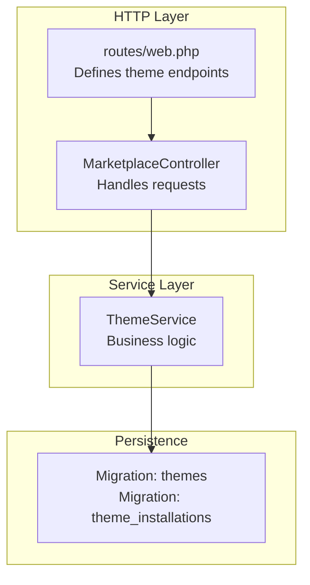
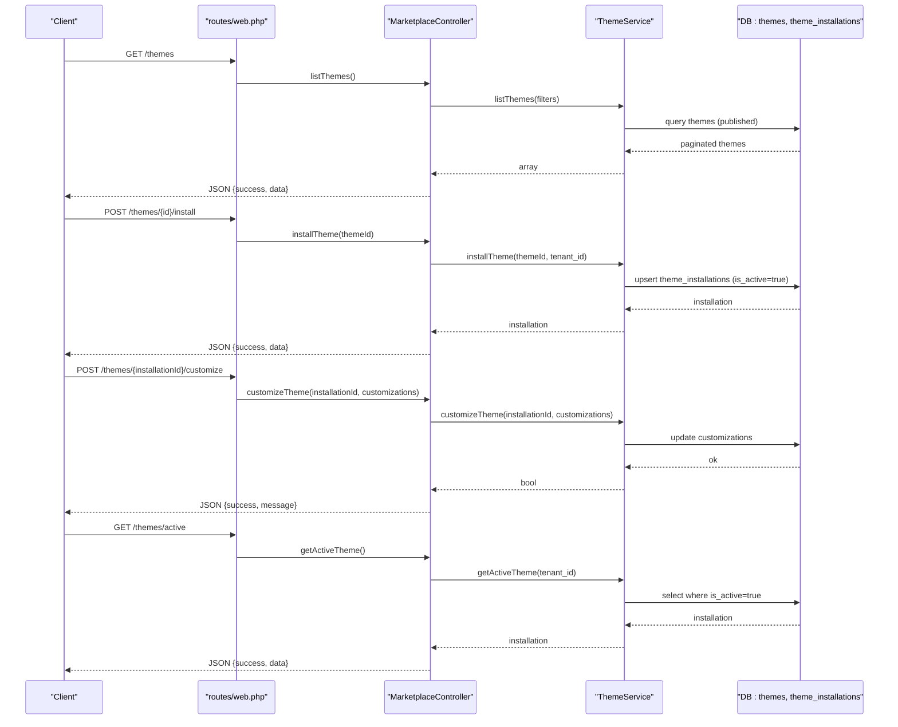
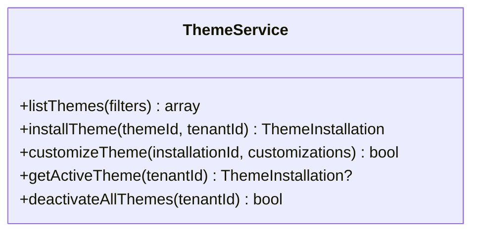
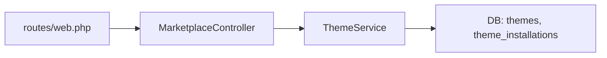

# Theme Installation & Activation

<cite>
**Referenced Files in This Document**
- [routes/web.php](file://routes/web.php)
- [app/Http/Controllers/Marketplace/MarketplaceController.php](file://app/Http/Controllers/Marketplace/MarketplaceController.php)
- [app/Services/Marketplace/ThemeService.php](file://app/Services/Marketplace/ThemeService.php)
- [database/migrations/2026_04_06_130000_create_marketplace_tables.php](file://database/migrations/2026_04_06_130000_create_marketplace_tables.php)
- [vite.config.js](file://vite.config.js)
</cite>

## Table of Contents
1. [Introduction](#introduction)
2. [Project Structure](#project-structure)
3. [Core Components](#core-components)
4. [Architecture Overview](#architecture-overview)
5. [Detailed Component Analysis](#detailed-component-analysis)
6. [Dependency Analysis](#dependency-analysis)
7. [Performance Considerations](#performance-considerations)
8. [Troubleshooting Guide](#troubleshooting-guide)
9. [Conclusion](#conclusion)

## Introduction
This document explains the theme installation and activation workflow in the system. It covers how a tenant selects a theme from the marketplace, installs it, customizes it, and activates it. It also documents the underlying API endpoints, request validation, response handling, tenant isolation, and the asset pipeline used for CSS/JS compilation and caching.

## Project Structure
The theme marketplace feature is organized around:
- Routes that expose theme endpoints under a dedicated group
- A controller that orchestrates requests and delegates to services
- A service layer that encapsulates business logic for listing, installing, customizing, and activating themes
- Database migrations defining theme metadata and tenant-specific installations
- Build configuration for asset compilation and caching



**Diagram sources**
- [routes/web.php:2942-2948](file://routes/web.php#L2942-L2948)
- [app/Http/Controllers/Marketplace/MarketplaceController.php:466-513](file://app/Http/Controllers/Marketplace/MarketplaceController.php#L466-L513)
- [app/Services/Marketplace/ThemeService.php:13-86](file://app/Services/Marketplace/ThemeService.php#L13-L86)
- [database/migrations/2026_04_06_130000_create_marketplace_tables.php:166-195](file://database/migrations/2026_04_06_130000_create_marketplace_tables.php#L166-L195)

**Section sources**
- [routes/web.php:2942-2948](file://routes/web.php#L2942-L2948)
- [app/Http/Controllers/Marketplace/MarketplaceController.php:466-513](file://app/Http/Controllers/Marketplace/MarketplaceController.php#L466-L513)
- [app/Services/Marketplace/ThemeService.php:13-86](file://app/Services/Marketplace/ThemeService.php#L13-L86)
- [database/migrations/2026_04_06_130000_create_marketplace_tables.php:166-195](file://database/migrations/2026_04_06_130000_create_marketplace_tables.php#L166-L195)

## Core Components
- Theme marketplace routes: list themes, install theme, customize theme, get active theme
- MarketplaceController: validates inputs, calls ThemeService, returns JSON responses
- ThemeService: lists themes, installs a theme for a tenant, customizes theme, gets active theme, deactivates all themes for a tenant
- Database schema: themes table stores theme metadata; theme_installations table stores tenant-specific installations and active flags
- Asset pipeline: Vite compiles CSS/JS, produces hashed assets for cache busting

**Section sources**
- [routes/web.php:2942-2948](file://routes/web.php#L2942-L2948)
- [app/Http/Controllers/Marketplace/MarketplaceController.php:466-513](file://app/Http/Controllers/Marketplace/MarketplaceController.php#L466-L513)
- [app/Services/Marketplace/ThemeService.php:13-86](file://app/Services/Marketplace/ThemeService.php#L13-L86)
- [database/migrations/2026_04_06_130000_create_marketplace_tables.php:166-195](file://database/migrations/2026_04_06_130000_create_marketplace_tables.php#L166-L195)
- [vite.config.js:1-99](file://vite.config.js#L1-L99)

## Architecture Overview
The theme workflow follows a layered architecture:
- HTTP routes define endpoints for theme operations
- Controller handles request validation and delegates to ThemeService
- ThemeService performs tenant-scoped operations and persistence
- Database enforces tenant isolation via foreign keys and unique constraints
- Frontend consumes APIs and relies on compiled assets



**Diagram sources**
- [routes/web.php:2942-2948](file://routes/web.php#L2942-L2948)
- [app/Http/Controllers/Marketplace/MarketplaceController.php:466-513](file://app/Http/Controllers/Marketplace/MarketplaceController.php#L466-L513)
- [app/Services/Marketplace/ThemeService.php:13-86](file://app/Services/Marketplace/ThemeService.php#L13-L86)
- [database/migrations/2026_04_06_130000_create_marketplace_tables.php:166-195](file://database/migrations/2026_04_06_130000_create_marketplace_tables.php#L166-L195)

## Detailed Component Analysis

### Theme Endpoints
- List themes: GET /themes
- Install theme: POST /themes/{id}/install
- Customize theme: POST /themes/{installationId}/customize
- Get active theme: GET /themes/active

Validation and behavior:
- List themes supports optional filters (search, sort_by, per_page)
- Install theme creates or updates a tenant-specific installation and marks it active
- Customize theme updates stored customizations for an installation
- Get active theme returns the currently active installation for the tenant

**Section sources**
- [routes/web.php:2942-2948](file://routes/web.php#L2942-L2948)
- [app/Http/Controllers/Marketplace/MarketplaceController.php:466-513](file://app/Http/Controllers/Marketplace/MarketplaceController.php#L466-L513)

### Controller Responsibilities
- Validates request payloads where applicable
- Calls ThemeService methods
- Returns standardized JSON responses with success flags and data/messages
- Uses the authenticated user’s tenant_id for tenant-scoped operations

**Section sources**
- [app/Http/Controllers/Marketplace/MarketplaceController.php:466-513](file://app/Http/Controllers/Marketplace/MarketplaceController.php#L466-L513)

### ThemeService Operations
- listThemes: filters published themes, supports search and sorting, paginates results
- installTheme: tenant-scoped installation; ensures uniqueness; sets is_active true
- customizeTheme: updates customizations JSON for an installation; logs errors and returns boolean
- getActiveTheme: returns the single active installation for the tenant
- deactivateAllThemes: deactivates all theme installations for a tenant



**Diagram sources**
- [app/Services/Marketplace/ThemeService.php:8-86](file://app/Services/Marketplace/ThemeService.php#L8-L86)

**Section sources**
- [app/Services/Marketplace/ThemeService.php:13-86](file://app/Services/Marketplace/ThemeService.php#L13-L86)

### Database Schema for Themes
- themes: stores theme metadata (name, slug, author, pricing, status, ratings, timestamps)
- theme_installations: stores tenant-specific installations with is_active flag and customizations JSON; unique constraint prevents duplicate installations per tenant/theme pair

```mermaid
erDiagram
THEMES {
bigint id PK
string name
string slug UK
bigint author_id FK
string status
decimal price
json custom_fields...
}
THEME_INSTALLATIONS {
bigint id PK
bigint theme_id FK
bigint tenant_id FK
boolean is_active
json customizations
}
THEMES ||--o{ THEME_INSTALLATIONS : "installed by"
```

**Diagram sources**
- [database/migrations/2026_04_06_130000_create_marketplace_tables.php:166-195](file://database/migrations/2026_04_06_130000_create_marketplace_tables.php#L166-L195)

**Section sources**
- [database/migrations/2026_04_06_130000_create_marketplace_tables.php:166-195](file://database/migrations/2026_04_06_130000_create_marketplace_tables.php#L166-L195)

### Asset Pipeline and Cache Behavior
- Vite compiles CSS/JS and emits hashed filenames for cache busting
- Build settings enable code splitting, minification, and compressed asset reporting
- Assets are served from the public directory with hashed names to support long-term caching

**Section sources**
- [vite.config.js:1-99](file://vite.config.js#L1-L99)

## Dependency Analysis
- Routes depend on MarketplaceController methods
- MarketplaceController depends on ThemeService
- ThemeService depends on models persisted by migrations
- Tenant isolation is enforced by foreign keys and unique constraints



**Diagram sources**
- [routes/web.php:2942-2948](file://routes/web.php#L2942-L2948)
- [app/Http/Controllers/Marketplace/MarketplaceController.php:466-513](file://app/Http/Controllers/Marketplace/MarketplaceController.php#L466-L513)
- [app/Services/Marketplace/ThemeService.php:13-86](file://app/Services/Marketplace/ThemeService.php#L13-L86)
- [database/migrations/2026_04_06_130000_create_marketplace_tables.php:166-195](file://database/migrations/2026_04_06_130000_create_marketplace_tables.php#L166-L195)

**Section sources**
- [routes/web.php:2942-2948](file://routes/web.php#L2942-L2948)
- [app/Http/Controllers/Marketplace/MarketplaceController.php:466-513](file://app/Http/Controllers/Marketplace/MarketplaceController.php#L466-L513)
- [app/Services/Marketplace/ThemeService.php:13-86](file://app/Services/Marketplace/ThemeService.php#L13-L86)
- [database/migrations/2026_04_06_130000_create_marketplace_tables.php:166-195](file://database/migrations/2026_04_06_130000_create_marketplace_tables.php#L166-L195)

## Performance Considerations
- Pagination for theme listings reduces payload sizes
- Indexes on status/published_at and tenant_id improve query performance
- Asset hashing enables long-lived caches and efficient invalidation
- Minification and code splitting reduce initial load times

[No sources needed since this section provides general guidance]

## Troubleshooting Guide
Common issues and resolutions:
- Installation conflicts: The unique constraint on theme_installations prevents duplicate installations per tenant/theme. If installation fails due to duplication, verify the tenant/theme combination does not already exist.
- Customization failures: The customize operation returns a boolean; check logs for error entries when customization fails.
- Active theme retrieval: Ensure the tenant has exactly one active installation; if multiple are marked active, deactivate others using the deactivateAllThemes method before reactivating.

**Section sources**
- [database/migrations/2026_04_06_130000_create_marketplace_tables.php:194](file://database/migrations/2026_04_06_130000_create_marketplace_tables.php#L194)
- [app/Services/Marketplace/ThemeService.php:48-63](file://app/Services/Marketplace/ThemeService.php#L48-L63)
- [app/Services/Marketplace/ThemeService.php:79-85](file://app/Services/Marketplace/ThemeService.php#L79-L85)

## Conclusion
The theme marketplace workflow is designed with tenant isolation, clear API boundaries, and a robust asset pipeline. Controllers handle request validation and response formatting, while ThemeService encapsulates business logic for listing, installing, customizing, and activating themes. The database schema enforces uniqueness and active state consistency per tenant, and Vite manages frontend asset compilation and caching.