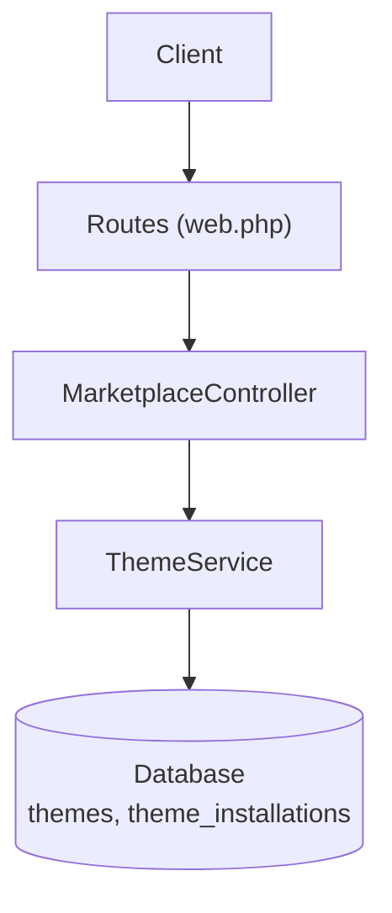
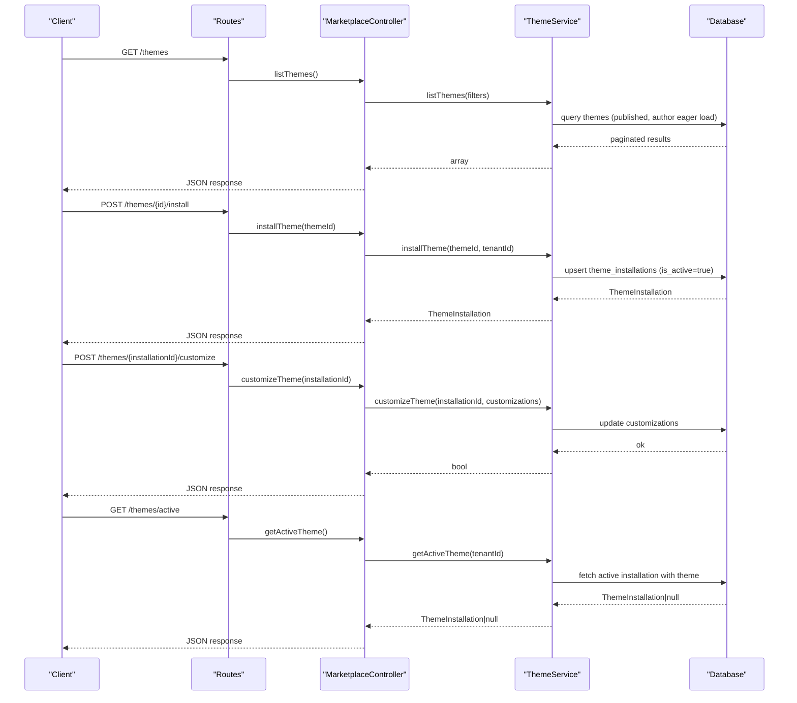
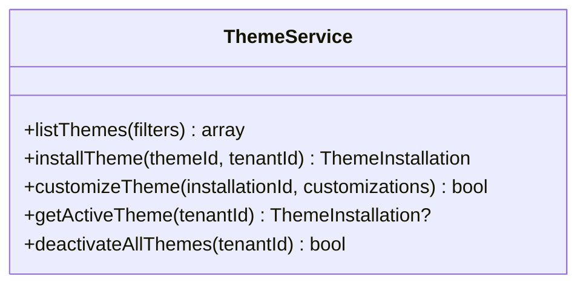
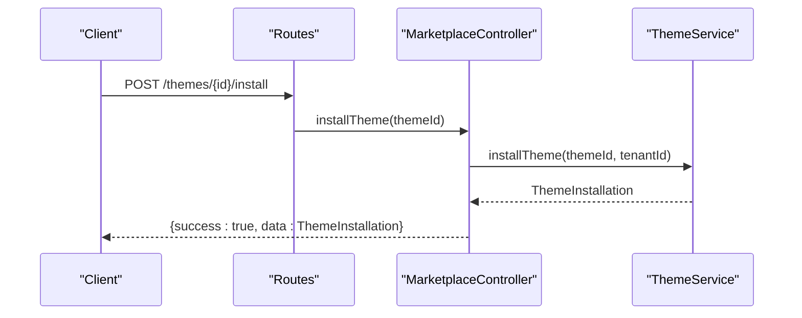
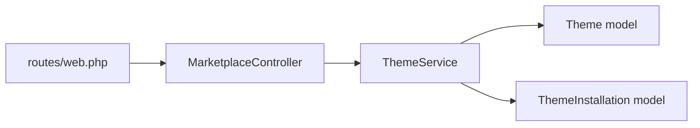

# Theme Management & Lifecycle

<cite>
**Referenced Files in This Document**
- [ThemeService.php](file://app/Services/Marketplace/ThemeService.php)
- [MarketplaceController.php](file://app/Http/Controllers/Marketplace/MarketplaceController.php)
- [web.php](file://routes/web.php)
- [2026_04_06_130000_create_marketplace_tables.php](file://database/migrations/2026_04_06_130000_create_marketplace_tables.php)
</cite>

## Table of Contents
1. [Introduction](#introduction)
2. [Project Structure](#project-structure)
3. [Core Components](#core-components)
4. [Architecture Overview](#architecture-overview)
5. [Detailed Component Analysis](#detailed-component-analysis)
6. [Dependency Analysis](#dependency-analysis)
7. [Performance Considerations](#performance-considerations)
8. [Troubleshooting Guide](#troubleshooting-guide)
9. [Conclusion](#conclusion)
10. [Appendices](#appendices)

## Introduction
This document describes the theme management lifecycle within the application, focusing on the marketplace-driven theme system. It covers discovery, installation, activation, customization, deactivation, and cleanup. It also outlines versioning, update mechanisms, backward compatibility, backup and restore, conflict resolution, dependency management, auditing and rollback, marketplace synchronization, and performance monitoring. Where applicable, the document references the actual implementation present in the repository.

## Project Structure
The theme lifecycle is implemented via:
- A controller that exposes REST endpoints for browsing, installing, customizing, and retrieving the active theme.
- A service layer that encapsulates business logic for listing themes, installing themes per tenant, customizing installations, and deactivating themes.
- Database schema supporting theme metadata and tenant-specific installations with active state and customizations.
- Routes that bind endpoints to controller actions.



**Diagram sources**
- [web.php:2942-2948](file://routes/web.php#L2942-L2948)
- [MarketplaceController.php:463-513](file://app/Http/Controllers/Marketplace/MarketplaceController.php#L463-L513)
- [ThemeService.php:8-86](file://app/Services/Marketplace/ThemeService.php#L8-L86)
- [2026_04_06_130000_create_marketplace_tables.php:178-195](file://database/migrations/2026_04_06_130000_create_marketplace_tables.php#L178-L195)

**Section sources**
- [web.php:2942-2948](file://routes/web.php#L2942-L2948)
- [MarketplaceController.php:463-513](file://app/Http/Controllers/Marketplace/MarketplaceController.php#L463-L513)
- [ThemeService.php:8-86](file://app/Services/Marketplace/ThemeService.php#L8-L86)
- [2026_04_06_130000_create_marketplace_tables.php:178-195](file://database/migrations/2026_04_06_130000_create_marketplace_tables.php#L178-L195)

## Core Components
- ThemeService: Provides theme listing, installation, customization, retrieval of active theme, and deactivation of all themes for a tenant.
- MarketplaceController: Exposes endpoints for listing themes, installing a theme, customizing an installation, and fetching the active theme.
- Database schema: Defines themes and theme_installations tables with appropriate indexes and foreign keys.

Key responsibilities:
- Listing published themes with optional search and sorting.
- Installing a theme for a tenant and marking it active.
- Customizing a tenant’s active theme installation.
- Retrieving the active theme for a tenant.
- Deactivating all theme installations for a tenant.

**Section sources**
- [ThemeService.php:8-86](file://app/Services/Marketplace/ThemeService.php#L8-L86)
- [MarketplaceController.php:463-513](file://app/Http/Controllers/Marketplace/MarketplaceController.php#L463-L513)
- [2026_04_06_130000_create_marketplace_tables.php:178-195](file://database/migrations/2026_04_06_130000_create_marketplace_tables.php#L178-L195)

## Architecture Overview
The theme lifecycle follows a clean separation of concerns:
- Presentation: HTTP endpoints in MarketplaceController.
- Application: ThemeService orchestrates domain operations.
- Persistence: Laravel Eloquent models backed by migrations define the data model.



**Diagram sources**
- [web.php:2942-2948](file://routes/web.php#L2942-L2948)
- [MarketplaceController.php:463-513](file://app/Http/Controllers/Marketplace/MarketplaceController.php#L463-L513)
- [ThemeService.php:13-74](file://app/Services/Marketplace/ThemeService.php#L13-L74)
- [2026_04_06_130000_create_marketplace_tables.php:178-195](file://database/migrations/2026_04_06_130000_create_marketplace_tables.php#L178-L195)

## Detailed Component Analysis

### ThemeService
Responsibilities:
- listThemes: Filters by search term, sorts by a configurable field, and paginates published themes while eager-loading author data.
- installTheme: Upserts a theme installation for a tenant and activates it.
- customizeTheme: Updates the customizations JSON for an existing installation with error logging on failure.
- getActiveTheme: Returns the active installation for a tenant with the associated theme loaded.
- deactivateAllThemes: Sets is_active=false for all installations belonging to a tenant.



**Diagram sources**
- [ThemeService.php:8-86](file://app/Services/Marketplace/ThemeService.php#L8-L86)

**Section sources**
- [ThemeService.php:13-74](file://app/Services/Marketplace/ThemeService.php#L13-L74)

### MarketplaceController
Endpoints:
- GET /themes: Lists published themes with pagination and optional filters.
- POST /themes/{id}/install: Installs a theme for the current tenant and activates it.
- POST /themes/{installationId}/customize: Applies customizations to an active installation.
- GET /themes/active: Retrieves the tenant’s active theme installation.



**Diagram sources**
- [web.php:2942-2948](file://routes/web.php#L2942-L2948)
- [MarketplaceController.php:476-487](file://app/Http/Controllers/Marketplace/MarketplaceController.php#L476-L487)
- [ThemeService.php:31-43](file://app/Services/Marketplace/ThemeService.php#L31-L43)

**Section sources**
- [MarketplaceController.php:463-513](file://app/Http/Controllers/Marketplace/MarketplaceController.php#L463-L513)
- [web.php:2942-2948](file://routes/web.php#L2942-L2948)

### Database Schema
Tables:
- themes: Stores theme metadata including status and publication timestamp.
- theme_installations: Associates tenants with installed themes, tracks activation state, and stores customizations as JSON.

Indexes and constraints:
- Unique constraint on (theme_id, tenant_id) ensures one active installation per tenant.
- Index on (status, published_at) supports efficient listing of published themes.

```mermaid
erDiagram
THEMES {
int id PK
string name
string status
timestamp published_at
int author_id
int install_count
decimal rating
timestamps
}
THEME_INSTALLATIONS {
int id PK
int theme_id FK
int tenant_id FK
boolean is_active
json customizations
timestamps
}
THEMES ||--o{ THEME_INSTALLATIONS : "installed by"
```

**Diagram sources**
- [2026_04_06_130000_create_marketplace_tables.php:178-195](file://database/migrations/2026_04_06_130000_create_marketplace_tables.php#L178-L195)

**Section sources**
- [2026_04_06_130000_create_marketplace_tables.php:178-195](file://database/migrations/2026_04_06_130000_create_marketplace_tables.php#L178-L195)

### Theme Lifecycle Operations

#### Theme Discovery and Listing
- Endpoint: GET /themes
- Behavior: Filters by search term, sorts by a configurable field, and paginates published themes. Author relationship is eager-loaded for richer responses.

**Section sources**
- [MarketplaceController.php:463-474](file://app/Http/Controllers/Marketplace/MarketplaceController.php#L463-L474)
- [ThemeService.php:13-26](file://app/Services/Marketplace/ThemeService.php#L13-L26)

#### Theme Installation
- Endpoint: POST /themes/{id}/install
- Behavior: Creates or updates a theme installation for the current tenant and marks it active. Returns the installation record.

**Section sources**
- [MarketplaceController.php:476-487](file://app/Http/Controllers/Marketplace/MarketplaceController.php#L476-L487)
- [ThemeService.php:31-43](file://app/Services/Marketplace/ThemeService.php#L31-L43)

#### Theme Customization
- Endpoint: POST /themes/{installationId}/customize
- Behavior: Updates the customizations JSON for an existing installation. Errors are logged and surfaced as a boolean result.

**Section sources**
- [MarketplaceController.php:489-500](file://app/Http/Controllers/Marketplace/MarketplaceController.php#L489-L500)
- [ThemeService.php:48-63](file://app/Services/Marketplace/ThemeService.php#L48-L63)

#### Active Theme Retrieval
- Endpoint: GET /themes/active
- Behavior: Returns the tenant’s currently active theme installation with the theme data included.

**Section sources**
- [MarketplaceController.php:502-513](file://app/Http/Controllers/Marketplace/MarketplaceController.php#L502-L513)
- [ThemeService.php:65-74](file://app/Services/Marketplace/ThemeService.php#L65-L74)

#### Theme Deactivation
- Method: deactivateAllThemes(tenantId)
- Behavior: Sets is_active=false for all installations of a tenant. Useful when switching themes or during maintenance.

**Section sources**
- [ThemeService.php:76-85](file://app/Services/Marketplace/ThemeService.php#L76-L85)

#### Theme Uninstallation and Cleanup
- Current implementation: No explicit uninstall endpoint or method exists in the repository.
- Recommended approach: Add an uninstall operation that deletes the theme_installations record for a tenant and performs cleanup of any tenant-scoped customizations stored alongside the installation.

[No sources needed since this section proposes recommended future enhancements not present in the repository]

#### Theme Version Management and Updates
- Current implementation: No versioning or update mechanism is exposed in the repository.
- Recommended approach: Introduce theme versions and update checks, allowing users to upgrade from the marketplace UI or API. Include compatibility checks against the current platform version.

[No sources needed since this section proposes recommended future enhancements not present in the repository]

#### Backward Compatibility Handling
- Current implementation: No explicit compatibility checks are present.
- Recommended approach: Validate theme compatibility with the platform version and tenant configuration before installation or update.

[No sources needed since this section proposes recommended future enhancements not present in the repository]

#### Backup and Restore for Safe Upgrades
- Current implementation: No backup/restore endpoints or methods exist.
- Recommended approach: Provide pre-update backup of theme configurations and post-update restore capability to enable rollbacks.

[No sources needed since this section proposes recommended future enhancements not present in the repository]

#### Conflict Resolution and Dependency Management
- Current implementation: No dependency fields or conflict resolution logic is present.
- Recommended approach: Track theme dependencies and resolve conflicts when multiple themes attempt to modify shared assets or settings.

[No sources needed since this section proposes recommended future enhancements not present in the repository]

#### Theme Removal Procedures
- Current implementation: No explicit removal/uninstall endpoints exist.
- Recommended approach: Implement removal that deletes theme_installations records and cleans up tenant-scoped customizations.

[No sources needed since this section proposes recommended future enhancements not present in the repository]

#### Theme Auditing, Change Tracking, and Rollback
- Current implementation: No dedicated audit trail for theme changes is present.
- Recommended approach: Log theme installation, customization, and deactivation events with change tracking and support for rollback to previous configurations.

[No sources needed since this section proposes recommended future enhancements not present in the repository]

#### Marketplace Integration and Automatic Updates
- Current implementation: Endpoints exist for browsing and installing themes; automatic update mechanisms are not present.
- Recommended approach: Add marketplace synchronization to check for updates and apply safe updates with pre/post hooks and rollback support.

[No sources needed since this section proposes recommended future enhancements not present in the repository]

#### Performance Monitoring and Resource Usage
- Current implementation: No theme-specific performance metrics are tracked.
- Recommended approach: Monitor rendering performance, asset sizes, and template complexity; expose metrics for theme selection and optimization.

[No sources needed since this section proposes recommended future enhancements not present in the repository]

## Dependency Analysis
- Controller depends on ThemeService for business logic.
- ThemeService depends on Theme and ThemeInstallation models via Eloquent.
- Routes bind endpoints to controller actions.



**Diagram sources**
- [web.php:2942-2948](file://routes/web.php#L2942-L2948)
- [MarketplaceController.php:463-513](file://app/Http/Controllers/Marketplace/MarketplaceController.php#L463-L513)
- [ThemeService.php:5-6](file://app/Services/Marketplace/ThemeService.php#L5-L6)

**Section sources**
- [web.php:2942-2948](file://routes/web.php#L2942-L2948)
- [MarketplaceController.php:463-513](file://app/Http/Controllers/Marketplace/MarketplaceController.php#L463-L513)
- [ThemeService.php:5-6](file://app/Services/Marketplace/ThemeService.php#L5-L6)

## Performance Considerations
- Pagination and filtering: The theme listing endpoint paginates results and supports sorting to avoid heavy queries.
- Eager loading: Author data is eager-loaded to reduce N+1 queries when listing themes.
- Indexing: Composite index on (status, published_at) improves listing performance.

[No sources needed since this section provides general guidance]

## Troubleshooting Guide
Common issues and resolutions:
- Installation failures: Verify tenant context and theme existence. Check logs for customizeTheme errors when applying customizations.
- Active theme retrieval: Ensure a theme installation exists and is marked active for the tenant.
- Deactivation: Use deactivateAllThemes to reset active state when switching themes.

**Section sources**
- [ThemeService.php:48-63](file://app/Services/Marketplace/ThemeService.php#L48-L63)
- [ThemeService.php:65-85](file://app/Services/Marketplace/ThemeService.php#L65-L85)

## Conclusion
The repository implements a robust foundation for theme management with marketplace browsing, installation, customization, and active theme retrieval. Future enhancements should focus on uninstallation, versioning, updates, compatibility checks, backup/restore, conflict resolution, auditing, marketplace synchronization, and performance monitoring to complete the lifecycle.

## Appendices

### API Reference
- GET /themes: List published themes with pagination and optional filters.
- POST /themes/{id}/install: Install and activate a theme for the current tenant.
- POST /themes/{installationId}/customize: Apply customizations to an active installation.
- GET /themes/active: Retrieve the tenant’s active theme installation.

**Section sources**
- [MarketplaceController.php:463-513](file://app/Http/Controllers/Marketplace/MarketplaceController.php#L463-L513)
- [web.php:2942-2948](file://routes/web.php#L2942-L2948)