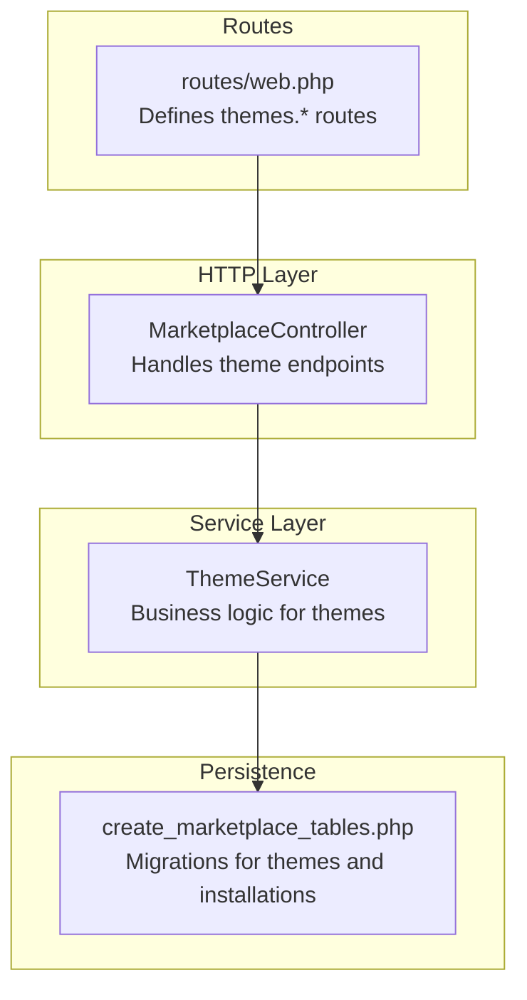
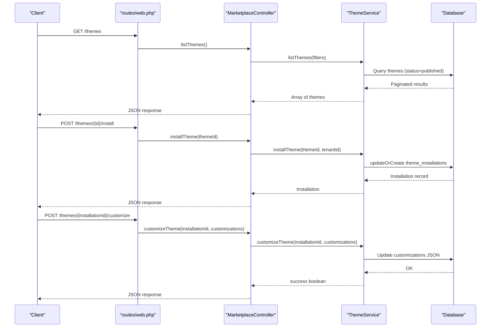
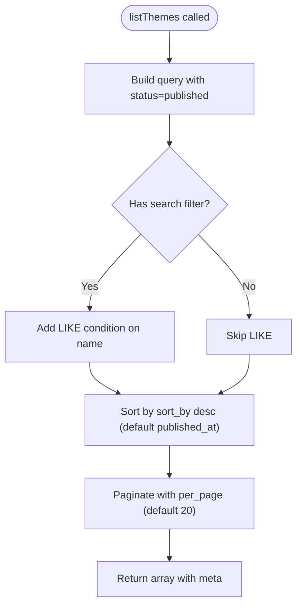
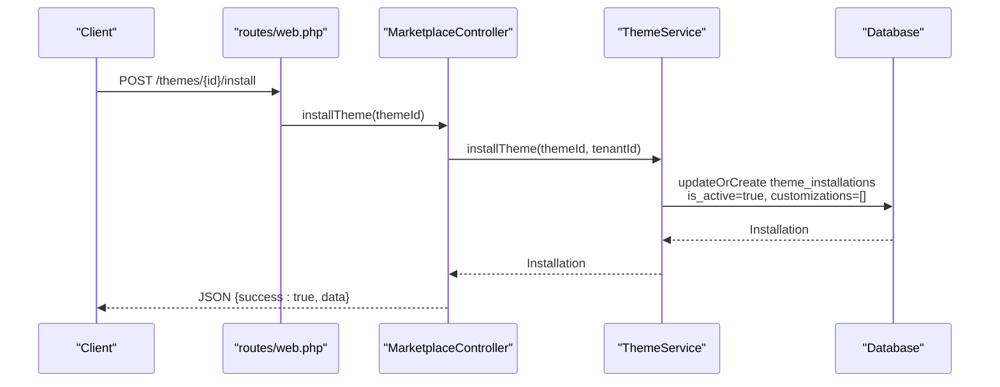
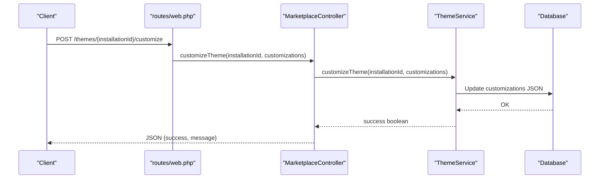
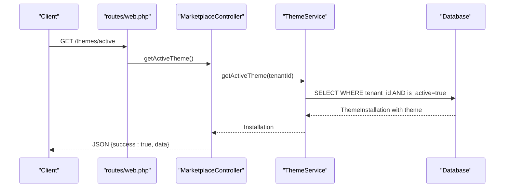
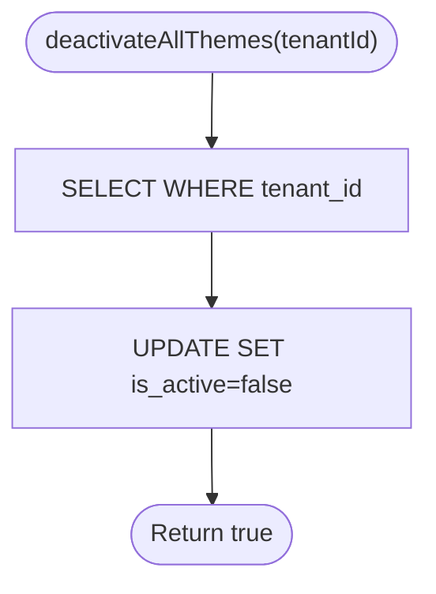
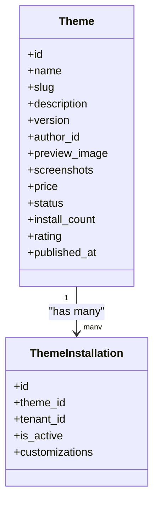
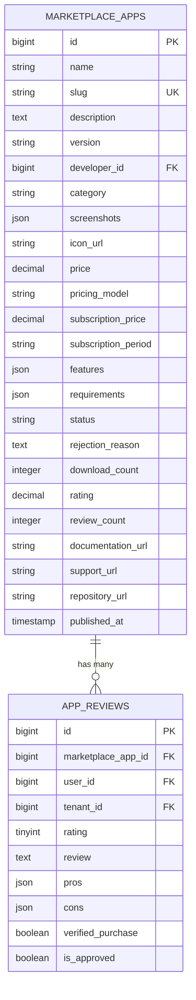
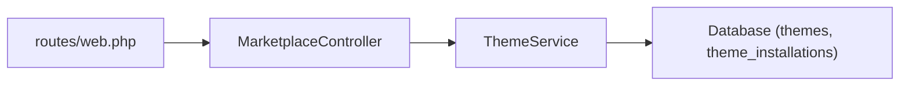

# Theme Marketplace

<cite>
**Referenced Files in This Document**
- [MarketplaceController.php](file://app/Http/Controllers/Marketplace/MarketplaceController.php)
- [ThemeService.php](file://app/Services/Marketplace/ThemeService.php)
- [create_marketplace_tables.php](file://database/migrations/2026_04_06_130000_create_marketplace_tables.php)
- [web.php](file://routes/web.php)
- [app.blade.php](file://resources/views/layouts/app.blade.php)
- [MOBILE_RESPONSIVE_IMPLEMENTATION.md](file://docs/MOBILE_RESPONSIVE_IMPLEMENTATION.md)
- [HEALTHCARE_MODAL_MOBILE_FIX_GUIDE.md](file://docs/HEALTHCARE_MODAL_MOBILE_FIX_GUIDE.md)
</cite>

## Table of Contents
1. [Introduction](#introduction)
2. [Project Structure](#project-structure)
3. [Core Components](#core-components)
4. [Architecture Overview](#architecture-overview)
5. [Detailed Component Analysis](#detailed-component-analysis)
6. [Dependency Analysis](#dependency-analysis)
7. [Performance Considerations](#performance-considerations)
8. [Troubleshooting Guide](#troubleshooting-guide)
9. [Conclusion](#conclusion)
10. [Appendices](#appendices)

## Introduction
This document describes the Theme Marketplace system within the qalcuityERP platform. It covers the theme browsing and discovery interface, filtering and sorting mechanisms, preview capabilities, installation and activation workflows, tenant-specific theme assignment, customization system, and lifecycle management from marketplace browsing to installation, customization, and deactivation. It also documents rating and review support, popularity metrics, and the foundational database schema enabling these features.

## Project Structure
The Theme Marketplace is implemented as part of the Marketplace module with dedicated controller endpoints, a service layer for business logic, and database migrations defining the data model. Routes expose the theme marketplace endpoints under the themes namespace.

**Diagram sources**
- [web.php:2942-2948](file://routes/web.php#L2942-L2948)
- [MarketplaceController.php:466-513](file://app/Http/Controllers/Marketplace/MarketplaceController.php#L466-L513)
- [ThemeService.php:13-85](file://app/Services/Marketplace/ThemeService.php#L13-L85)
- [create_marketplace_tables.php:166-195](file://database/migrations/2026_04_06_130000_create_marketplace_tables.php#L166-L195)

**Section sources**
- [web.php:2942-2948](file://routes/web.php#L2942-L2948)
- [MarketplaceController.php:466-513](file://app/Http/Controllers/Marketplace/MarketplaceController.php#L466-L513)
- [ThemeService.php:13-85](file://app/Services/Marketplace/ThemeService.php#L13-L85)
- [create_marketplace_tables.php:166-195](file://database/migrations/2026_04_06_130000_create_marketplace_tables.php#L166-L195)

## Core Components
- MarketplaceController: Exposes endpoints for listing themes, installing themes, customizing themes, and retrieving the active theme for a tenant.
- ThemeService: Implements theme listing, installation, customization persistence, retrieval of active theme, and deactivation of all themes for a tenant.
- Database Schema: Defines themes and theme_installations tables with appropriate indexes and JSON fields for customizations.

Key responsibilities:
- Discovery: listThemes supports search and sort_by pagination.
- Installation: installTheme creates or activates a tenant-theme installation.
- Customization: customizeTheme persists JSON-based customizations.
- Activation: getActiveTheme retrieves the currently active theme for a tenant.
- Deactivation: deactivateAllThemes toggles active state across all tenant themes.

**Section sources**
- [MarketplaceController.php:466-513](file://app/Http/Controllers/Marketplace/MarketplaceController.php#L466-L513)
- [ThemeService.php:13-85](file://app/Services/Marketplace/ThemeService.php#L13-L85)
- [create_marketplace_tables.php:166-195](file://database/migrations/2026_04_06_130000_create_marketplace_tables.php#L166-L195)

## Architecture Overview
The Theme Marketplace follows a layered architecture:
- HTTP layer: routes define endpoints; controller handles requests and delegates to services.
- Service layer: encapsulates business logic for theme operations.
- Persistence layer: migrations define relational schema with JSON fields for flexible customization.

**Diagram sources**
- [web.php:2942-2948](file://routes/web.php#L2942-L2948)
- [MarketplaceController.php:466-513](file://app/Http/Controllers/Marketplace/MarketplaceController.php#L466-L513)
- [ThemeService.php:13-85](file://app/Services/Marketplace/ThemeService.php#L13-L85)
- [create_marketplace_tables.php:166-195](file://database/migrations/2026_04_06_130000_create_marketplace_tables.php#L166-L195)

## Detailed Component Analysis

### Theme Listing and Discovery
- Endpoint: GET /themes
- Filters supported: search, sort_by, per_page
- Sorting defaults to published_at descending
- Pagination applied with default page size
- Author relationship is eager-loaded for richer listings

**Diagram sources**
- [ThemeService.php:13-26](file://app/Services/Marketplace/ThemeService.php#L13-L26)

**Section sources**
- [ThemeService.php:13-26](file://app/Services/Marketplace/ThemeService.php#L13-L26)
- [MarketplaceController.php:466-474](file://app/Http/Controllers/Marketplace/MarketplaceController.php#L466-L474)

### Theme Installation and Activation
- Endpoint: POST /themes/{id}/install
- Creates or updates a theme_installations record for the tenant
- Sets is_active to true on installation
- Initializes customizations as empty JSON

**Diagram sources**
- [web.php:2942-2948](file://routes/web.php#L2942-L2948)
- [MarketplaceController.php:476-487](file://app/Http/Controllers/Marketplace/MarketplaceController.php#L476-L487)
- [ThemeService.php:31-43](file://app/Services/Marketplace/ThemeService.php#L31-L43)

**Section sources**
- [MarketplaceController.php:476-487](file://app/Http/Controllers/Marketplace/MarketplaceController.php#L476-L487)
- [ThemeService.php:31-43](file://app/Services/Marketplace/ThemeService.php#L31-L43)
- [create_marketplace_tables.php:186-195](file://database/migrations/2026_04_06_130000_create_marketplace_tables.php#L186-L195)

### Theme Customization
- Endpoint: POST /themes/{installationId}/customize
- Accepts customizations as JSON payload
- Persists customizations to the theme_installations record
- Returns success/failure status

**Diagram sources**
- [web.php:2942-2948](file://routes/web.php#L2942-L2948)
- [MarketplaceController.php:489-500](file://app/Http/Controllers/Marketplace/MarketplaceController.php#L489-L500)
- [ThemeService.php:48-63](file://app/Services/Marketplace/ThemeService.php#L48-L63)

**Section sources**
- [MarketplaceController.php:489-500](file://app/Http/Controllers/Marketplace/MarketplaceController.php#L489-L500)
- [ThemeService.php:48-63](file://app/Services/Marketplace/ThemeService.php#L48-L63)
- [create_marketplace_tables.php:186-195](file://database/migrations/2026_04_06_130000_create_marketplace_tables.php#L186-L195)

### Active Theme Retrieval
- Endpoint: GET /themes/active
- Retrieves the single active theme for the authenticated tenant
- Eager-loads associated theme metadata

**Diagram sources**
- [web.php:2942-2948](file://routes/web.php#L2942-L2948)
- [MarketplaceController.php:502-513](file://app/Http/Controllers/Marketplace/MarketplaceController.php#L502-L513)
- [ThemeService.php:68-74](file://app/Services/Marketplace/ThemeService.php#L68-L74)

**Section sources**
- [MarketplaceController.php:502-513](file://app/Http/Controllers/Marketplace/MarketplaceController.php#L502-L513)
- [ThemeService.php:68-74](file://app/Services/Marketplace/ThemeService.php#L68-L74)

### Theme Deactivation
- Service method: deactivateAllThemes(tenantId)
- Sets is_active=false for all theme_installations of a tenant
- Useful during theme switching or maintenance

**Diagram sources**
- [ThemeService.php:79-85](file://app/Services/Marketplace/ThemeService.php#L79-L85)

**Section sources**
- [ThemeService.php:79-85](file://app/Services/Marketplace/ThemeService.php#L79-L85)

### Theme Preview and UI Integration
- Preview image and screenshots are stored in the themes table for discovery and preview.
- The application layout includes a theme toggle button, indicating runtime theme-aware UI integration.

**Diagram sources**
- [create_marketplace_tables.php:166-195](file://database/migrations/2026_04_06_130000_create_marketplace_tables.php#L166-L195)

**Section sources**
- [create_marketplace_tables.php:166-195](file://database/migrations/2026_04_06_130000_create_marketplace_tables.php#L166-L195)
- [app.blade.php:731-744](file://resources/views/layouts/app.blade.php#L731-L744)

### Rating and Review System
- The marketplace schema includes separate tables for marketplace_apps and app_reviews, supporting ratings, pros/cons, verification, and approval.
- While the Theme Marketplace currently exposes listing, installation, customization, and activation, the rating and review infrastructure exists for apps and can be extended to themes if needed.

**Diagram sources**
- [create_marketplace_tables.php:14-80](file://database/migrations/2026_04_06_130000_create_marketplace_tables.php#L14-L80)

**Section sources**
- [create_marketplace_tables.php:14-80](file://database/migrations/2026_04_06_130000_create_marketplace_tables.php#L14-L80)

### Versioning, Updates, and Rollback
- Themes table includes a version field for versioning.
- There is no explicit rollback mechanism documented for themes in the provided files; however, the presence of install_count and rating fields suggests popularity and quality signals that can inform update decisions.
- The broader system includes audit rollback functionality for other modules, which can serve as a reference pattern for future theme rollback features.

**Section sources**
- [create_marketplace_tables.php:166-184](file://database/migrations/2026_04_06_130000_create_marketplace_tables.php#L166-L184)
- [resources/views/audit/index.blade.php:505-533](file://resources/views/audit/index.blade.php#L505-L533)

## Dependency Analysis
- Routes depend on MarketplaceController methods.
- MarketplaceController depends on ThemeService.
- ThemeService depends on Theme and ThemeInstallation Eloquent models (defined in migrations).
- ThemeService uses database queries and JSON updates for customizations.

**Diagram sources**
- [web.php:2942-2948](file://routes/web.php#L2942-L2948)
- [MarketplaceController.php:466-513](file://app/Http/Controllers/Marketplace/MarketplaceController.php#L466-L513)
- [ThemeService.php:13-85](file://app/Services/Marketplace/ThemeService.php#L13-L85)
- [create_marketplace_tables.php:166-195](file://database/migrations/2026_04_06_130000_create_marketplace_tables.php#L166-L195)

**Section sources**
- [web.php:2942-2948](file://routes/web.php#L2942-L2948)
- [MarketplaceController.php:466-513](file://app/Http/Controllers/Marketplace/MarketplaceController.php#L466-L513)
- [ThemeService.php:13-85](file://app/Services/Marketplace/ThemeService.php#L13-L85)
- [create_marketplace_tables.php:166-195](file://database/migrations/2026_04_06_130000_create_marketplace_tables.php#L166-L195)

## Performance Considerations
- Indexes on themes: status, published_at improve listing performance.
- Pagination reduces payload sizes for listing endpoints.
- JSON fields for customizations enable flexible storage but should be used judiciously; consider normalization if customization sets grow large.
- Eager-loading author on theme listing avoids N+1 queries.

[No sources needed since this section provides general guidance]

## Troubleshooting Guide
Common issues and resolutions:
- Installation fails: Verify tenant association and that the theme exists and is published.
- Customization errors: Check JSON payload format and ensure installationId exists.
- Active theme not returned: Confirm is_active flag is set for a single installation; deactivation utilities can reset states.

Operational tips:
- Use the active theme endpoint to confirm current state.
- Deactivate all themes when switching to avoid conflicts.

**Section sources**
- [ThemeService.php:48-85](file://app/Services/Marketplace/ThemeService.php#L48-L85)
- [MarketplaceController.php:489-513](file://app/Http/Controllers/Marketplace/MarketplaceController.php#L489-L513)

## Conclusion
The Theme Marketplace provides a clean separation of concerns with controller endpoints, a focused service layer, and a well-structured schema supporting discovery, installation, customization, and activation. The system is extensible to incorporate advanced features such as theme ratings, reviews, and rollback procedures, while maintaining tenant isolation and performance through indexing and pagination.

[No sources needed since this section summarizes without analyzing specific files]

## Appendices

### API Reference: Theme Marketplace Endpoints
- GET /themes → listThemes(filters)
- POST /themes/{id}/install → installTheme(themeId)
- POST /themes/{installationId}/customize → customizeTheme(customizations)
- GET /themes/active → getActiveTheme()

**Section sources**
- [web.php:2942-2948](file://routes/web.php#L2942-L2948)
- [MarketplaceController.php:466-513](file://app/Http/Controllers/Marketplace/MarketplaceController.php#L466-L513)

### Responsive Design and Cross-Platform Compatibility
- The application layout includes a theme toggle button, indicating runtime theme switching support.
- Documentation references provide guidance for mobile responsiveness and accessibility touch targets.

**Section sources**
- [app.blade.php:731-744](file://resources/views/layouts/app.blade.php#L731-L744)
- [MOBILE_RESPONSIVE_IMPLEMENTATION.md:403-409](file://docs/MOBILE_RESPONSIVE_IMPLEMENTATION.md#L403-L409)
- [HEALTHCARE_MODAL_MOBILE_FIX_GUIDE.md:352-357](file://docs/HEALTHCARE_MODAL_MOBILE_FIX_GUIDE.md#L352-L357)