# Bandwidth Monitoring & Allocation

<cite>
**Referenced Files in This Document**
- [BandwidthAllocation.php](file://app/Models/BandwidthAllocation.php)
- [HotspotUser.php](file://app/Models/HotspotUser.php)
- [NetworkAlert.php](file://app/Models/NetworkAlert.php)
- [create_telecom_subscriptions_table.php](file://database/migrations/2026_04_04_000003_create_telecom_subscriptions_table.php)
- [create_hotspot_users_table.php](file://database/migrations/2026_04_04_000005_create_hotspot_users_table.php)
- [create_bandwidth_allocations_table.php](file://database/migrations/2026_04_04_000007_create_bandwidth_allocations_table.php)
- [create_usage_tracking_table.php](file://database/migrations/2026_04_04_000004_create_usage_tracking_table.php)
- [UsageTracking.php](file://app/Models/UsageTracking.php)
- [index.blade.php](file://resources/views/telecom/dashboard/index.blade.php)
- [usage.blade.php](file://resources/views/telecom/customers/usage.blade.php)
</cite>

## Table of Contents
1. [Introduction](#introduction)
2. [Project Structure](#project-structure)
3. [Core Components](#core-components)
4. [Architecture Overview](#architecture-overview)
5. [Detailed Component Analysis](#detailed-component-analysis)
6. [Dependency Analysis](#dependency-analysis)
7. [Performance Considerations](#performance-considerations)
8. [Troubleshooting Guide](#troubleshooting-guide)
9. [Conclusion](#conclusion)
10. [Appendices](#appendices)

## Introduction
This document describes the bandwidth monitoring and allocation subsystem implemented in the telecom module. It covers real-time usage tracking, bandwidth threshold detection, automatic allocation adjustments, and usage-based billing calculations. It also documents hotspot user bandwidth management, per-user data limits, priority-based allocation, traffic shaping policies, network alerting for bandwidth saturation, historical usage analytics, capacity planning tools, automated bandwidth throttling, integration with router adapters for live metrics collection, data aggregation algorithms, and reporting dashboards for network administrators.

## Project Structure
The bandwidth monitoring system spans models, migrations, and Blade views:
- Models define domain entities and relationships for subscriptions, hotspot users, bandwidth allocations, usage tracking, and network alerts.
- Migrations define the schema for telecom_subscriptions, hotspot_users, bandwidth_allocations, usage_tracking, and related indexes.
- Views render dashboard charts and customer usage portals.

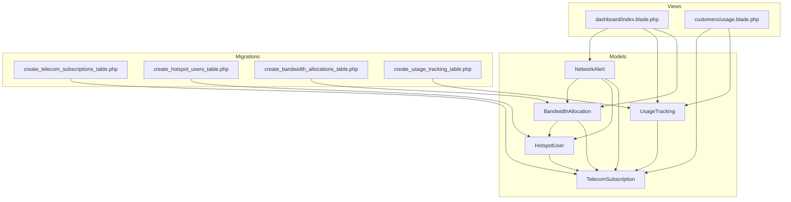

**Diagram sources**
- [BandwidthAllocation.php:10-187](file://app/Models/BandwidthAllocation.php#L10-L187)
- [HotspotUser.php:12-249](file://app/Models/HotspotUser.php#L12-L249)
- [create_telecom_subscriptions_table.php:13-64](file://database/migrations/2026_04_04_000003_create_telecom_subscriptions_table.php#L13-L64)
- [create_hotspot_users_table.php:13-66](file://database/migrations/2026_04_04_000005_create_hotspot_users_table.php#L13-L66)
- [create_bandwidth_allocations_table.php:13-56](file://database/migrations/2026_04_04_000007_create_bandwidth_allocations_table.php#L13-L56)
- [create_usage_tracking_table.php:13-56](file://database/migrations/2026_04_04_000004_create_usage_tracking_table.php#L13-L56)
- [index.blade.php:1-395](file://resources/views/telecom/dashboard/index.blade.php#L1-L395)
- [usage.blade.php:1-179](file://resources/views/telecom/customers/usage.blade.php#L1-L179)

**Section sources**
- [BandwidthAllocation.php:10-187](file://app/Models/BandwidthAllocation.php#L10-L187)
- [HotspotUser.php:12-249](file://app/Models/HotspotUser.php#L12-L249)
- [create_telecom_subscriptions_table.php:13-64](file://database/migrations/2026_04_04_000003_create_telecom_subscriptions_table.php#L13-L64)
- [create_hotspot_users_table.php:13-66](file://database/migrations/2026_04_04_000005_create_hotspot_users_table.php#L13-L66)
- [create_bandwidth_allocations_table.php:13-56](file://database/migrations/2026_04_04_000007_create_bandwidth_allocations_table.php#L13-L56)
- [create_usage_tracking_table.php:13-56](file://database/migrations/2026_04_04_000004_create_usage_tracking_table.php#L13-L56)
- [index.blade.php:1-395](file://resources/views/telecom/dashboard/index.blade.php#L1-L395)
- [usage.blade.php:1-179](file://resources/views/telecom/customers/usage.blade.php#L1-L179)

## Core Components
- BandwidthAllocation: Defines per-subscription/per-user bandwidth caps, guarantees, QoS queues, time-based rules, and current usage tracking.
- HotspotUser: Manages per-user credentials, rate/burst limits, quota, online status, and session metrics.
- TelecomSubscription: Tracks subscription lifecycle, billing cycles, quota usage/reset, and service priority.
- UsageTracking: Aggregates hourly/daily/weekly/monthly metrics, peak bandwidth, and session stats.
- NetworkAlert: Centralized alerting for bandwidth saturation, thresholds, acknowledgments, and resolutions.

Key capabilities:
- Real-time usage tracking via UsageTracking and BandwidthAllocation counters.
- Threshold detection via HotspotUser quota checks and NetworkAlert triggers.
- Automatic allocation adjustments via time-based rules and priority ordering.
- Usage-based billing via TelecomSubscription quota and billing cycle fields.
- Traffic shaping via queue_type and queue_parameters in BandwidthAllocation.
- Reporting dashboards via Blade templates with Chart.js visualizations.

**Section sources**
- [BandwidthAllocation.php:10-187](file://app/Models/BandwidthAllocation.php#L10-L187)
- [HotspotUser.php:12-249](file://app/Models/HotspotUser.php#L12-L249)
- [create_telecom_subscriptions_table.php:13-64](file://database/migrations/2026_04_04_000003_create_telecom_subscriptions_table.php#L13-L64)
- [create_usage_tracking_table.php:13-56](file://database/migrations/2026_04_04_000004_create_usage_tracking_table.php#L13-L56)
- [NetworkAlert.php:10-221](file://app/Models/NetworkAlert.php#L10-L221)

## Architecture Overview
The system integrates router-facing entities with tenant-scoped models and analytics dashboards. Router adapters feed live metrics into UsageTracking and BandwidthAllocation, which inform alerting and dynamic policy updates.

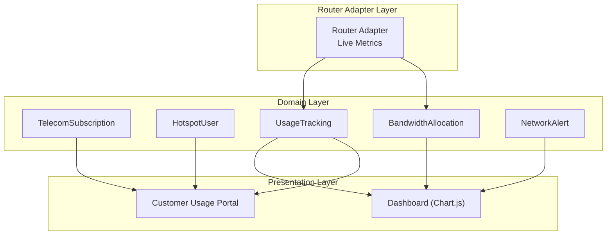

**Diagram sources**
- [index.blade.php:1-395](file://resources/views/telecom/dashboard/index.blade.php#L1-L395)
- [usage.blade.php:1-179](file://resources/views/telecom/customers/usage.blade.php#L1-L179)
- [create_usage_tracking_table.php:13-56](file://database/migrations/2026_04_04_000004_create_usage_tracking_table.php#L13-L56)
- [create_bandwidth_allocations_table.php:13-56](file://database/migrations/2026_04_04_000007_create_bandwidth_allocations_table.php#L13-L56)
- [NetworkAlert.php:10-221](file://app/Models/NetworkAlert.php#L10-L221)

## Detailed Component Analysis

### BandwidthAllocation Model
Responsibilities:
- Store allocation caps (max_download_kbps/max_upload_kbps) and guarantees.
- Define QoS queue parameters (priority, queue_type, queue_parameters).
- Enforce time-based activation windows and days/times.
- Track current_usage_bytes and last_updated_at for real-time monitoring.

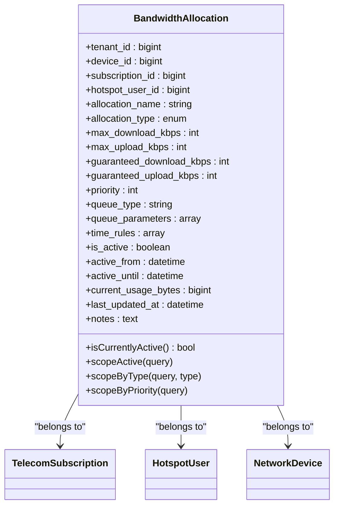

**Diagram sources**
- [BandwidthAllocation.php:10-187](file://app/Models/BandwidthAllocation.php#L10-L187)
- [create_bandwidth_allocations_table.php:13-56](file://database/migrations/2026_04_04_000007_create_bandwidth_allocations_table.php#L13-L56)

**Section sources**
- [BandwidthAllocation.php:10-187](file://app/Models/BandwidthAllocation.php#L10-L187)
- [create_bandwidth_allocations_table.php:13-56](file://database/migrations/2026_04_04_000007_create_bandwidth_allocations_table.php#L13-L56)

### HotspotUser Model
Responsibilities:
- Manage per-user credentials, MAC address, and authentication type.
- Apply rate_limit and burst_limit for traffic shaping.
- Track quota_bytes, quota_used_bytes, and quota_reset_at.
- Maintain online status, IP address, and session metrics.

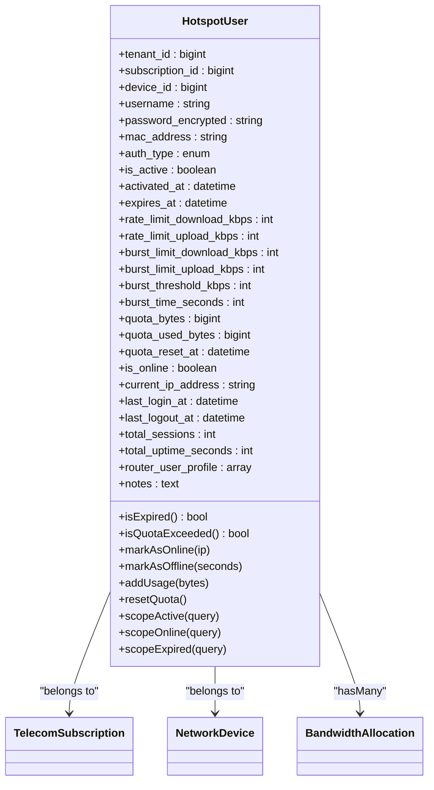

**Diagram sources**
- [HotspotUser.php:12-249](file://app/Models/HotspotUser.php#L12-L249)
- [create_hotspot_users_table.php:13-66](file://database/migrations/2026_04_04_000005_create_hotspot_users_table.php#L13-L66)
- [BandwidthAllocation.php:10-187](file://app/Models/BandwidthAllocation.php#L10-L187)

**Section sources**
- [HotspotUser.php:12-249](file://app/Models/HotspotUser.php#L12-L249)
- [create_hotspot_users_table.php:13-66](file://database/migrations/2026_04_04_000005_create_hotspot_users_table.php#L13-L66)

### UsageTracking Model and Aggregation
Responsibilities:
- Aggregate bytes_in/out/total, packets_in/out, sessions_count, and session_duration_seconds.
- Track peak_bandwidth_kbps and peak_usage_time.
- Support period_type (hourly/daily/weekly/monthly) and period_start/end for analytics.
- Provide formatted attributes for human-readable metrics.

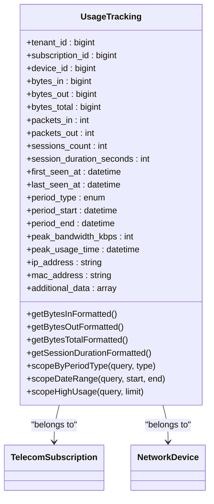

**Diagram sources**
- [UsageTracking.php:10-159](file://app/Models/UsageTracking.php#L10-L159)
- [create_usage_tracking_table.php:13-56](file://database/migrations/2026_04_04_000004_create_usage_tracking_table.php#L13-L56)

**Section sources**
- [UsageTracking.php:10-159](file://app/Models/UsageTracking.php#L10-L159)
- [create_usage_tracking_table.php:13-56](file://database/migrations/2026_04_04_000004_create_usage_tracking_table.php#L13-L56)

### NetworkAlert Model
Responsibilities:
- Capture alert_type, severity, title, message, and status (new/acknowledged/resolved/ignored).
- Store threshold_data and current_metrics for context.
- Track notification_sent, notified_users, and resolution notes.
- Provide scopes for unresolved/critical/alerts by device.

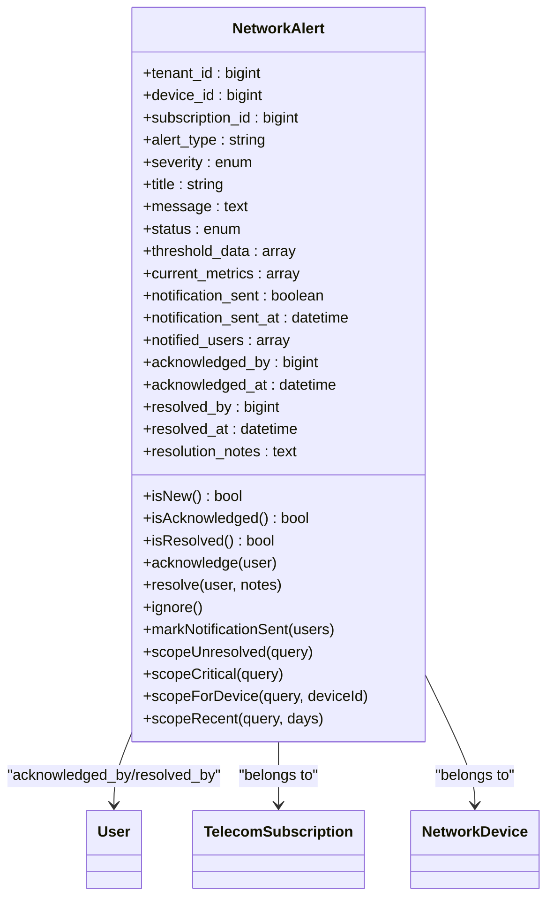

**Diagram sources**
- [NetworkAlert.php:10-221](file://app/Models/NetworkAlert.php#L10-L221)
- [create_telecom_subscriptions_table.php:13-64](file://database/migrations/2026_04_04_000003_create_telecom_subscriptions_table.php#L13-L64)
- [create_hotspot_users_table.php:13-66](file://database/migrations/2026_04_04_000005_create_hotspot_users_table.php#L13-L66)

**Section sources**
- [NetworkAlert.php:10-221](file://app/Models/NetworkAlert.php#L10-L221)

### TelecomSubscription Model
Responsibilities:
- Track subscription lifecycle (pending/active/suspended/cancelled/expired).
- Maintain billing cycle (monthly/quarterly/semi-annual/annual), next billing date, and quota tracking fields.
- Store network credentials (hotspot/pppoe/static) and MAC registration.
- Assign priority_level and current_price for billing and prioritization.

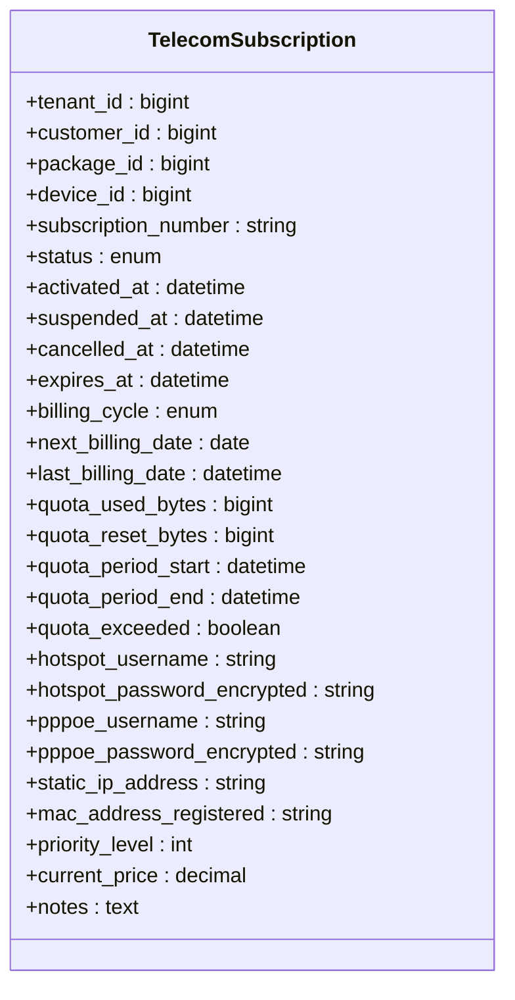

**Diagram sources**
- [create_telecom_subscriptions_table.php:13-64](file://database/migrations/2026_04_04_000003_create_telecom_subscriptions_table.php#L13-L64)

**Section sources**
- [create_telecom_subscriptions_table.php:13-64](file://database/migrations/2026_04_04_000003_create_telecom_subscriptions_table.php#L13-L64)

### Real-Time Usage Tracking Mechanism
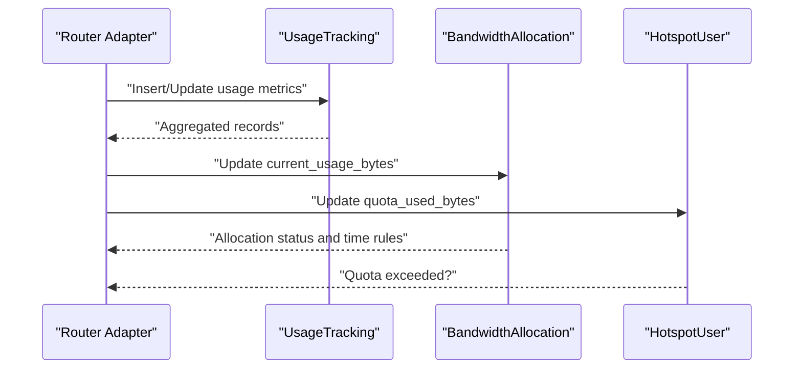

**Diagram sources**
- [create_usage_tracking_table.php:13-56](file://database/migrations/2026_04_04_000004_create_usage_tracking_table.php#L13-L56)
- [create_bandwidth_allocations_table.php:13-56](file://database/migrations/2026_04_04_000007_create_bandwidth_allocations_table.php#L13-L56)
- [HotspotUser.php:12-249](file://app/Models/HotspotUser.php#L12-L249)

### Bandwidth Threshold Detection and Alerting
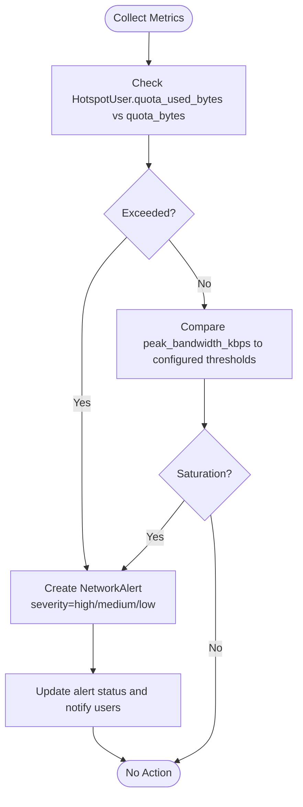

**Diagram sources**
- [HotspotUser.php:12-249](file://app/Models/HotspotUser.php#L12-L249)
- [create_usage_tracking_table.php:13-56](file://database/migrations/2026_04_04_000004_create_usage_tracking_table.php#L13-L56)
- [NetworkAlert.php:10-221](file://app/Models/NetworkAlert.php#L10-L221)

### Automatic Allocation Adjustments
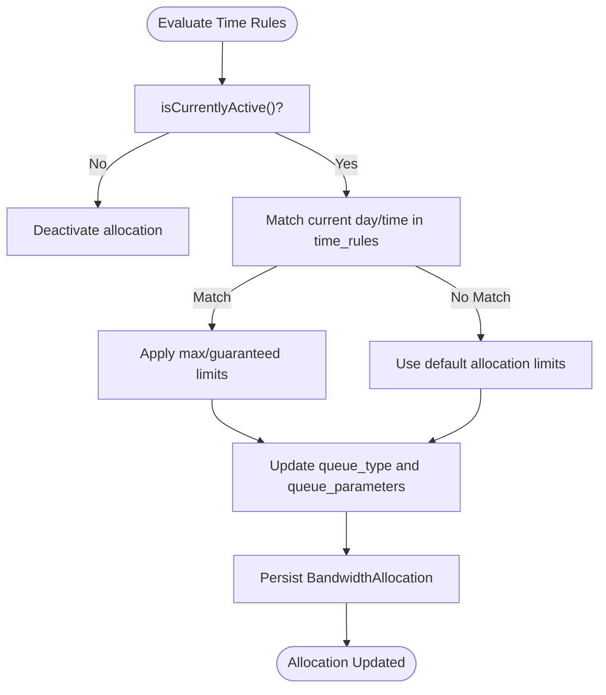

**Diagram sources**
- [BandwidthAllocation.php:84-129](file://app/Models/BandwidthAllocation.php#L84-L129)
- [create_bandwidth_allocations_table.php:13-56](file://database/migrations/2026_04_04_000007_create_bandwidth_allocations_table.php#L13-L56)

### Usage-Based Billing Calculations
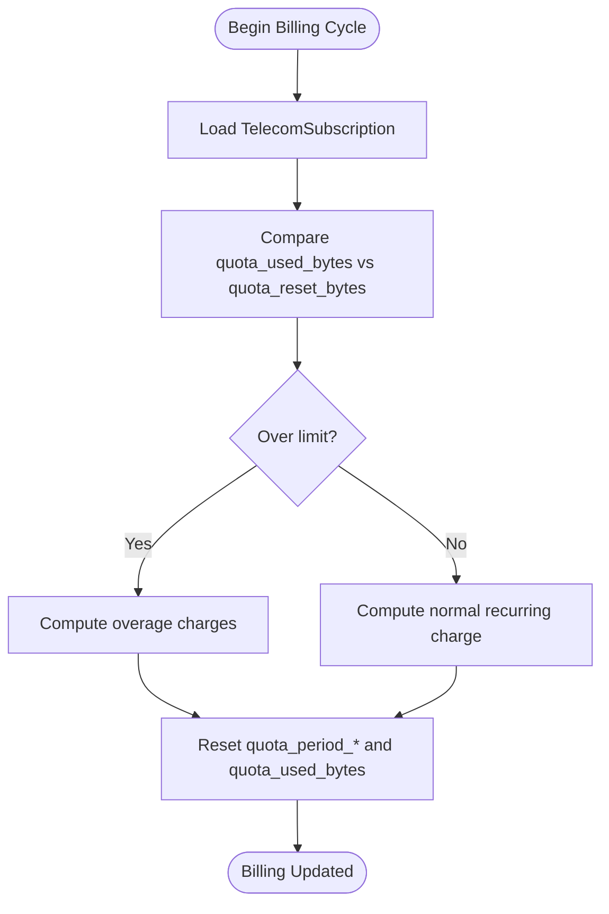

**Diagram sources**
- [create_telecom_subscriptions_table.php:13-64](file://database/migrations/2026_04_04_000003_create_telecom_subscriptions_table.php#L13-L64)

### Hotspot User Bandwidth Management and Per-User Data Limits
- Rate limiting and burst controls are enforced at the HotspotUser level.
- Quota management supports unlimited or fixed-byte limits with reset intervals.
- Online/offline state and session metrics enable granular user control.

**Section sources**
- [HotspotUser.php:12-249](file://app/Models/HotspotUser.php#L12-L249)
- [create_hotspot_users_table.php:13-66](file://database/migrations/2026_04_04_000005_create_hotspot_users_table.php#L13-L66)

### Priority-Based Allocation and Traffic Shaping
- BandwidthAllocation defines priority and queue_type with queue_parameters for advanced shaping (e.g., simple, PCQ, HFSC).
- Priority ordering ensures fair allocation and prevents starvation.

**Section sources**
- [BandwidthAllocation.php:10-187](file://app/Models/BandwidthAllocation.php#L10-L187)
- [create_bandwidth_allocations_table.php:13-56](file://database/migrations/2026_04_04_000007_create_bandwidth_allocations_table.php#L13-L56)

### Network Alerting for Bandwidth Saturation
- NetworkAlert captures threshold breaches and saturation events.
- Severity levels and status tracking support escalation and resolution workflows.

**Section sources**
- [NetworkAlert.php:10-221](file://app/Models/NetworkAlert.php#L10-L221)

### Historical Usage Analytics and Capacity Planning
- UsageTracking supports multiple period types and date-range queries for trend analysis.
- Dashboard charts visualize bandwidth usage and device status distributions.

**Section sources**
- [UsageTracking.php:10-159](file://app/Models/UsageTracking.php#L10-L159)
- [index.blade.php:142-194](file://resources/views/telecom/dashboard/index.blade.php#L142-L194)

### Automated Bandwidth Throttling
- Router adapters push metrics; BandwidthAllocation and HotspotUser enforce limits.
- Time-based rules dynamically adjust caps during peak/off-peak periods.

**Section sources**
- [BandwidthAllocation.php:84-129](file://app/Models/BandwidthAllocation.php#L84-L129)
- [HotspotUser.php:12-249](file://app/Models/HotspotUser.php#L12-L249)

### Integration with Router Adapters and Live Metrics Collection
- Router adapters populate UsageTracking and BandwidthAllocation.
- Indexes on tenant/device/subscription facilitate fast retrieval for dashboards and alerts.

**Section sources**
- [create_usage_tracking_table.php:52-56](file://database/migrations/2026_04_04_000004_create_usage_tracking_table.php#L52-L56)
- [create_bandwidth_allocations_table.php:53-56](file://database/migrations/2026_04_04_000007_create_bandwidth_allocations_table.php#L53-L56)

### Data Aggregation Algorithms
- Aggregation by period_type and period_start/end enables multi-resolution analytics.
- High-usage queries rank top consumers for capacity planning.

**Section sources**
- [UsageTracking.php:139-159](file://app/Models/UsageTracking.php#L139-L159)

### Reporting Dashboards for Administrators
- Dashboard renders real-time charts for bandwidth usage and device status.
- Customer portal displays per-customer quota usage and actions (suspend/reactivate/reset).

**Section sources**
- [index.blade.php:142-395](file://resources/views/telecom/dashboard/index.blade.php#L142-L395)
- [usage.blade.php:38-179](file://resources/views/telecom/customers/usage.blade.php#L38-L179)

## Dependency Analysis
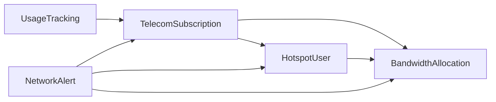

**Diagram sources**
- [create_telecom_subscriptions_table.php:13-64](file://database/migrations/2026_04_04_000003_create_telecom_subscriptions_table.php#L13-L64)
- [create_hotspot_users_table.php:13-66](file://database/migrations/2026_04_04_000005_create_hotspot_users_table.php#L13-L66)
- [create_bandwidth_allocations_table.php:13-56](file://database/migrations/2026_04_04_000007_create_bandwidth_allocations_table.php#L13-L56)
- [create_usage_tracking_table.php:13-56](file://database/migrations/2026_04_04_000004_create_usage_tracking_table.php#L13-L56)
- [NetworkAlert.php:10-221](file://app/Models/NetworkAlert.php#L10-L221)

**Section sources**
- [create_telecom_subscriptions_table.php:13-64](file://database/migrations/2026_04_04_000003_create_telecom_subscriptions_table.php#L13-L64)
- [create_hotspot_users_table.php:13-66](file://database/migrations/2026_04_04_000005_create_hotspot_users_table.php#L13-L66)
- [create_bandwidth_allocations_table.php:13-56](file://database/migrations/2026_04_04_000007_create_bandwidth_allocations_table.php#L13-L56)
- [create_usage_tracking_table.php:13-56](file://database/migrations/2026_04_04_000004_create_usage_tracking_table.php#L13-L56)
- [NetworkAlert.php:10-221](file://app/Models/NetworkAlert.php#L10-L221)

## Performance Considerations
- Use indexes on tenant_id, device_id, subscription_id, and period_start for fast analytics queries.
- Prefer batch updates for UsageTracking to minimize write amplification.
- Cache frequently accessed dashboard metrics to reduce database load.
- Implement periodic cleanup jobs for old UsageTracking records to control table growth.

## Troubleshooting Guide
- Quota not resetting: Verify quota_reset_at and quota_reset_bytes in TelecomSubscription and HotspotUser.
- Alerts not firing: Confirm NetworkAlert thresholds and status transitions; check notification_sent timestamps.
- Incorrect bandwidth spikes: Review UsageTracking peak_bandwidth_kbps and period boundaries; validate router adapter metrics.
- Allocation not applied: Ensure BandwidthAllocation.is_active and time_rules match current day/time.

**Section sources**
- [HotspotUser.php:12-249](file://app/Models/HotspotUser.php#L12-L249)
- [NetworkAlert.php:10-221](file://app/Models/NetworkAlert.php#L10-L221)
- [create_usage_tracking_table.php:13-56](file://database/migrations/2026_04_04_000004_create_usage_tracking_table.php#L13-L56)
- [BandwidthAllocation.php:84-129](file://app/Models/BandwidthAllocation.php#L84-L129)

## Conclusion
The bandwidth monitoring and allocation system provides a robust foundation for managing telecom usage across subscriptions and hotspot users. It supports real-time tracking, dynamic allocation adjustments, traffic shaping, alerting, and comprehensive analytics for informed capacity planning and billing decisions.

## Appendices
- Router adapter integration points: Populate UsageTracking and update BandwidthAllocation/HotsotUser.
- Dashboard customization: Extend Chart.js datasets and add new metrics in the dashboard view.
- Alert escalation: Configure severity thresholds and notification channels in NetworkAlert.