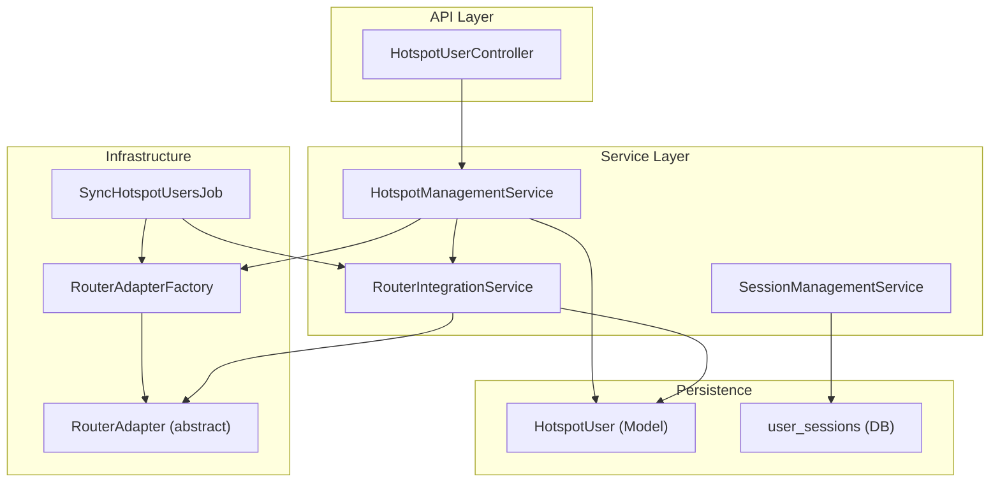
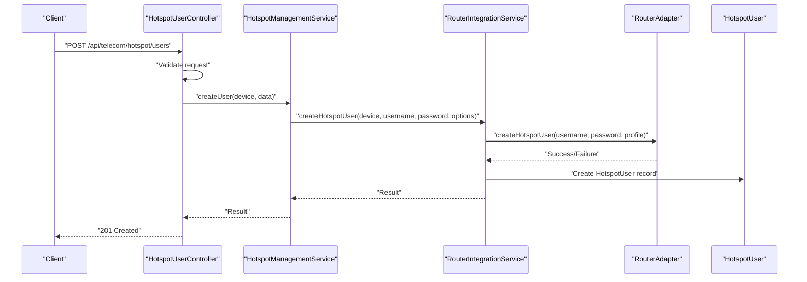
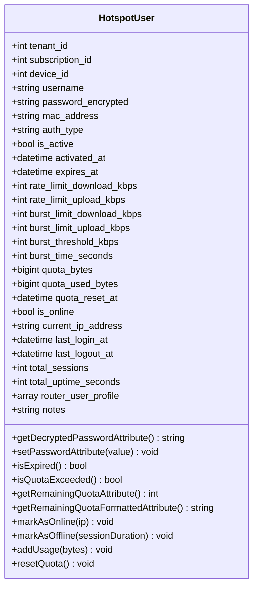
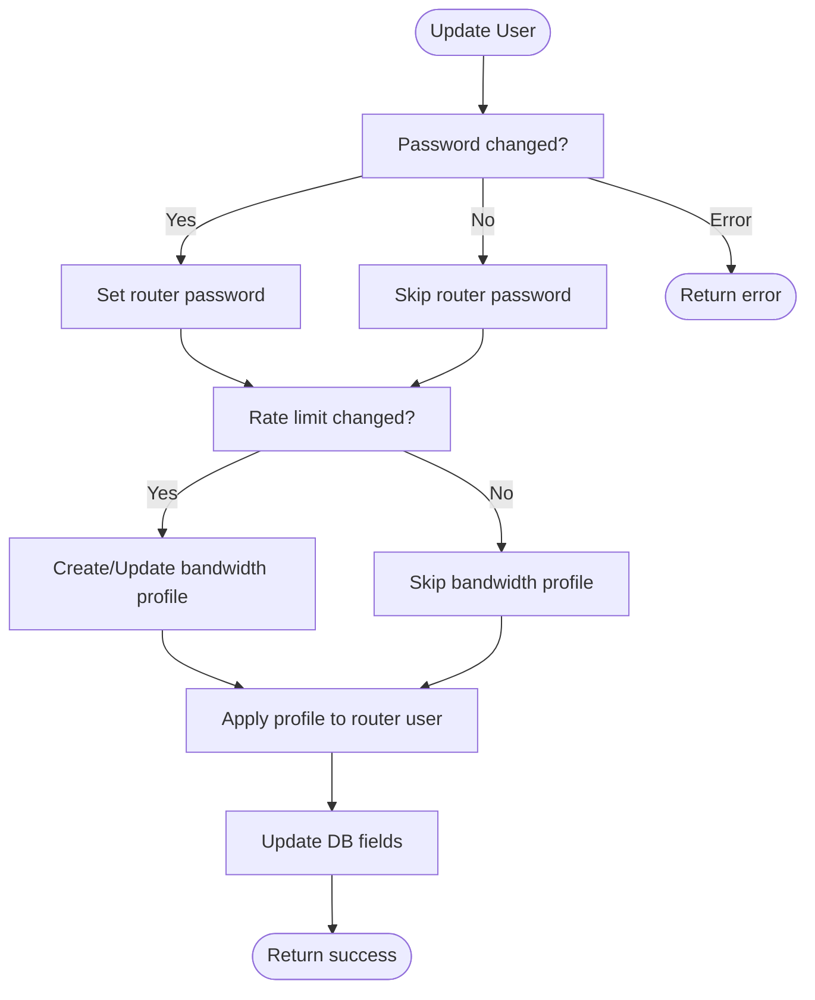
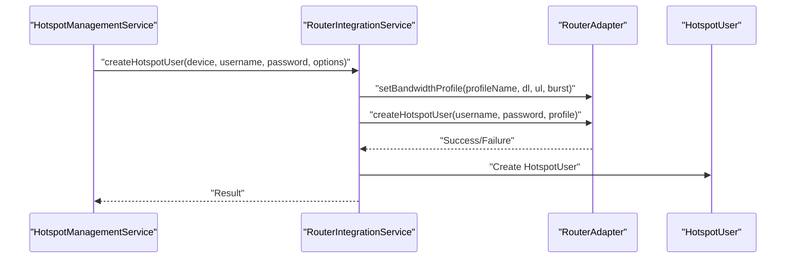
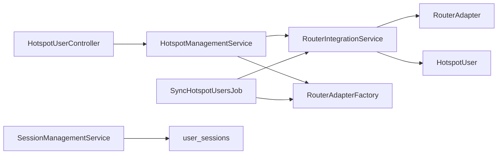

# Hotspot User Management & Authentication

<cite>
**Referenced Files in This Document**
- [HotspotUser.php](file://app/Models/HotspotUser.php)
- [HotspotUserController.php](file://app/Http/Controllers/Api/Telecom/HotspotUserController.php)
- [HotspotManagementService.php](file://app/Services/Telecom/HotspotManagementService.php)
- [RouterIntegrationService.php](file://app/Services/Telecom/RouterIntegrationService.php)
- [RouterAdapter.php](file://app/Services/Telecom/RouterAdapter.php)
- [RouterAdapterFactory.php](file://app/Services/Telecom/RouterAdapterFactory.php)
- [create_hotspot_users_table.php](file://database/migrations/2026_04_04_000005_create_hotspot_users_table.php)
- [create_security_compliance_tables.php](file://database/migrations/2026_04_06_110000_create_security_compliance_tables.php)
- [SyncHotspotUsersJob.php](file://app/Jobs/Telecom/SyncHotspotUsersJob.php)
- [SessionManagementService.php](file://app/Services/Security/SessionManagementService.php)
</cite>

## Table of Contents
1. [Introduction](#introduction)
2. [Project Structure](#project-structure)
3. [Core Components](#core-components)
4. [Architecture Overview](#architecture-overview)
5. [Detailed Component Analysis](#detailed-component-analysis)
6. [Dependency Analysis](#dependency-analysis)
7. [Performance Considerations](#performance-considerations)
8. [Troubleshooting Guide](#troubleshooting-guide)
9. [Conclusion](#conclusion)

## Introduction
This document describes the hotspot user management and authentication subsystem within the telecom module. It covers user registration workflows, router-backed authentication, session lifecycle tracking, device provisioning, bandwidth and quota controls, and operational synchronization. It also outlines integration points with router adapters, database synchronization jobs, and security/session management services.

## Project Structure
The hotspot subsystem spans models, controllers, services, migrations, and jobs:

- Models define user profiles, credentials, quotas, and session metrics.
- Controllers expose API endpoints for user creation, suspension, reactivation, and stats retrieval.
- Services orchestrate router adapter operations and database updates.
- Migrations define the persistent schema for users, sessions, and compliance logs.
- Jobs synchronize active users and online status across routers and the database.

**Diagram sources**
- [HotspotUserController.php:11-171](file://app/Http/Controllers/Api/Telecom/HotspotUserController.php#L11-L171)
- [HotspotManagementService.php:14-231](file://app/Services/Telecom/HotspotManagementService.php#L14-L231)
- [RouterIntegrationService.php:19-202](file://app/Services/Telecom/RouterIntegrationService.php#L19-L202)
- [RouterAdapter.php:14-198](file://app/Services/Telecom/RouterAdapter.php#L14-L198)
- [RouterAdapterFactory.php](file://app/Services/Telecom/RouterAdapterFactory.php)
- [SyncHotspotUsersJob.php:20-100](file://app/Jobs/Telecom/SyncHotspotUsersJob.php#L20-L100)
- [HotspotUser.php:12-250](file://app/Models/HotspotUser.php#L12-L250)
- [create_security_compliance_tables.php:156-180](file://database/migrations/2026_04_06_110000_create_security_compliance_tables.php#L156-L180)

**Section sources**
- [HotspotUserController.php:11-171](file://app/Http/Controllers/Api/Telecom/HotspotUserController.php#L11-L171)
- [HotspotManagementService.php:14-231](file://app/Services/Telecom/HotspotManagementService.php#L14-L231)
- [RouterIntegrationService.php:19-202](file://app/Services/Telecom/RouterIntegrationService.php#L19-L202)
- [RouterAdapter.php:14-198](file://app/Services/Telecom/RouterAdapter.php#L14-L198)
- [create_hotspot_users_table.php:7-77](file://database/migrations/2026_04_04_000005_create_hotspot_users_table.php#L7-L77)
- [create_security_compliance_tables.php:156-180](file://database/migrations/2026_04_06_110000_create_security_compliance_tables.php#L156-L180)
- [SyncHotspotUsersJob.php:20-100](file://app/Jobs/Telecom/SyncHotspotUsersJob.php#L20-L100)

## Core Components
- HotspotUser model: Stores credentials, rate limits, quota, online status, and usage metrics. Provides helpers to check expiration and quota, and to update online/offline state and usage.
- HotspotManagementService: Orchestrates user creation, updates, suspension/reactivation, and statistics retrieval via router adapters and router integration service.
- RouterIntegrationService: Coordinates router adapter operations, transactionally creates/updates/removes users, and synchronizes usage data.
- RouterAdapter (abstract): Defines the contract for router vendor integrations (create/update/remove user, bandwidth profiles, active users, usage, commands).
- HotspotUserController: API controller exposing endpoints for user management and stats.
- SyncHotspotUsersJob: Scheduled job to reconcile database online status with router’s active users.
- SessionManagementService: Tracks user sessions, device info, location, and expiration.

**Section sources**
- [HotspotUser.php:12-250](file://app/Models/HotspotUser.php#L12-L250)
- [HotspotManagementService.php:14-231](file://app/Services/Telecom/HotspotManagementService.php#L14-L231)
- [RouterIntegrationService.php:19-202](file://app/Services/Telecom/RouterIntegrationService.php#L19-L202)
- [RouterAdapter.php:14-198](file://app/Services/Telecom/RouterAdapter.php#L14-L198)
- [HotspotUserController.php:11-171](file://app/Http/Controllers/Api/Telecom/HotspotUserController.php#L11-L171)
- [SyncHotspotUsersJob.php:20-100](file://app/Jobs/Telecom/SyncHotspotUsersJob.php#L20-L100)
- [SessionManagementService.php:1-213](file://app/Services/Security/SessionManagementService.php#L1-L213)

## Architecture Overview
The system follows a layered architecture:
- API layer validates requests and delegates to services.
- Service layer coordinates router adapters and database persistence.
- Router adapters encapsulate vendor-specific operations.
- Background jobs keep router and database synchronized.
- Security/session services track and manage session lifecycle.

**Diagram sources**
- [HotspotUserController.php:25-79](file://app/Http/Controllers/Api/Telecom/HotspotUserController.php#L25-L79)
- [HotspotManagementService.php:30-50](file://app/Services/Telecom/HotspotManagementService.php#L30-L50)
- [RouterIntegrationService.php:76-116](file://app/Services/Telecom/RouterIntegrationService.php#L76-L116)
- [RouterAdapter.php:47](file://app/Services/Telecom/RouterAdapter.php#L47)

## Detailed Component Analysis

### HotspotUser Model
Responsibilities:
- Persist user credentials (encrypted), authentication type, activation/expiry, bandwidth limits, quota, and session metrics.
- Provide helpers to compute remaining quota, formatted sizes, and scopes for active/online/expired users.
- Update online/offline state and accumulate usage.

Key attributes and behaviors:
- Credentials: username (unique), encrypted password, optional MAC address.
- Access control: auth_type, is_active, activated_at, expires_at.
- Bandwidth: rate limits and burst parameters.
- Quota: quota_bytes, quota_used_bytes, quota_reset_at.
- Session metrics: is_online, current_ip_address, last_login_at, last_logout_at, total_sessions, total_uptime_seconds.
- Helpers: isExpired, isQuotaExceeded, remaining_quota, remaining_quota_formatted.
- Mutators: encrypted password storage; decrypted password accessor.

**Diagram sources**
- [HotspotUser.php:12-250](file://app/Models/HotspotUser.php#L12-L250)

**Section sources**
- [HotspotUser.php:12-250](file://app/Models/HotspotUser.php#L12-L250)
- [create_hotspot_users_table.php:13-66](file://database/migrations/2026_04_04_000005_create_hotspot_users_table.php#L13-L66)

### Hotspot Management Service
Responsibilities:
- Create users with generated or provided credentials and optional bandwidth/quota/expires/comment/subscription metadata.
- Update user attributes, including password and bandwidth profiles via router adapters.
- Suspend/reactivate users and disconnect active sessions.
- Retrieve user usage statistics from routers and present formatted metrics.

Processing logic highlights:
- Username/password defaults to random generation if not provided.
- Bandwidth profile updates create or update a per-user profile and apply it.
- Suspension toggles router state and optionally disconnects active sessions, then updates DB.
- Statistics aggregation merges router usage with stored quota and session counters.

**Diagram sources**
- [HotspotManagementService.php:59-101](file://app/Services/Telecom/HotspotManagementService.php#L59-L101)

**Section sources**
- [HotspotManagementService.php:30-50](file://app/Services/Telecom/HotspotManagementService.php#L30-L50)
- [HotspotManagementService.php:59-101](file://app/Services/Telecom/HotspotManagementService.php#L59-L101)
- [HotspotManagementService.php:120-173](file://app/Services/Telecom/HotspotManagementService.php#L120-L173)
- [HotspotManagementService.php:181-213](file://app/Services/Telecom/HotspotManagementService.php#L181-L213)

### Router Integration Service
Responsibilities:
- Provide a unified interface for router operations across vendors.
- Create users with optional bandwidth profile creation and comment metadata.
- Remove users from router and soft-delete from DB.
- Sync usage data and reconcile online status with router’s active users.

Operational details:
- Transactional creation: adapter operation followed by DB creation.
- Optional bandwidth profile creation when speeds are provided.
- Usage sync iterates active users, fetches detailed usage, and persists metrics.

**Diagram sources**
- [RouterIntegrationService.php:76-116](file://app/Services/Telecom/RouterIntegrationService.php#L76-L116)
- [RouterAdapter.php:89-98](file://app/Services/Telecom/RouterAdapter.php#L89-L98)

**Section sources**
- [RouterIntegrationService.php:76-116](file://app/Services/Telecom/RouterIntegrationService.php#L76-L116)
- [RouterIntegrationService.php:155-174](file://app/Services/Telecom/RouterIntegrationService.php#L155-L174)
- [RouterIntegrationService.php:182-202](file://app/Services/Telecom/RouterIntegrationService.php#L182-L202)

### Router Adapter Abstraction
Responsibilities:
- Define a vendor-neutral interface for router operations.
- Include methods for connectivity testing, system info, user CRUD, active users, usage, bandwidth profiles, interface stats, reboots, custom commands, and disconnection.

Implementation pattern:
- Concrete adapters implement the abstract methods for specific vendors.
- Utility methods (e.g., byte formatting, logging) are provided in the base class.

**Section sources**
- [RouterAdapter.php:14-198](file://app/Services/Telecom/RouterAdapter.php#L14-L198)

### API Controller: HotspotUserController
Endpoints:
- POST /api/telecom/hotspot/users: Create a user with device ownership validation.
- GET /api/telecom/hotspot/users/{id}/stats: Retrieve usage and quota statistics.
- POST /api/telecom/hotspot/users/{id}/suspend: Suspend a user.
- POST /api/telecom/hotspot/users/{id}/reactivate: Reactivate a user.

Validation and error handling:
- Validates presence of device_id and optional fields.
- Enforces tenant ownership checks.
- Returns structured error responses for validation failures and exceptions.

**Section sources**
- [HotspotUserController.php:25-79](file://app/Http/Controllers/Api/Telecom/HotspotUserController.php#L25-L79)
- [HotspotUserController.php:86-107](file://app/Http/Controllers/Api/Telecom/HotspotUserController.php#L86-L107)
- [HotspotUserController.php:114-138](file://app/Http/Controllers/Api/Telecom/HotspotUserController.php#L114-L138)
- [HotspotUserController.php:145-169](file://app/Http/Controllers/Api/Telecom/HotspotUserController.php#L145-L169)

### Background Synchronization: SyncHotspotUsersJob
Purpose:
- Periodically reconcile database online status with router’s active users.
- Mark users offline who are no longer reported by the router.
- Mark router-reported users as online and initialize last login metrics.

Behavior:
- Scans devices of type router/access_point.
- Queries adapter for active users and updates HotspotUser records accordingly.
- Emits logs on completion and per-device sync events.

**Section sources**
- [SyncHotspotUsersJob.php:33-57](file://app/Jobs/Telecom/SyncHotspotUsersJob.php#L33-L57)
- [SyncHotspotUsersJob.php:62-99](file://app/Jobs/Telecom/SyncHotspotUsersJob.php#L62-L99)

### Session Management and Security
Session tracking:
- Tracks device type, browser, platform, IP, location, and expiration.
- Marks sessions as current and updates last activity timestamps.
- Provides cleanup of expired or inactive sessions.

Compliance and audit:
- Dedicated user_sessions table captures device fingerprints, locations, and expiry.
- Supports GDPR consent recording and session deletion pathways.

**Section sources**
- [SessionManagementService.php:13-41](file://app/Services/Security/SessionManagementService.php#L13-L41)
- [SessionManagementService.php:172-177](file://app/Services/Security/SessionManagementService.php#L172-L177)
- [create_security_compliance_tables.php:156-180](file://database/migrations/2026_04_06_110000_create_security_compliance_tables.php#L156-L180)

## Dependency Analysis
High-level dependencies:
- HotspotUserController depends on HotspotManagementService.
- HotspotManagementService depends on RouterIntegrationService and RouterAdapterFactory.
- RouterIntegrationService depends on RouterAdapter implementations and HotspotUser model.
- SyncHotspotUsersJob depends on RouterAdapterFactory and RouterIntegrationService.
- SessionManagementService depends on UserSession model/table.

**Diagram sources**
- [HotspotUserController.php:11-18](file://app/Http/Controllers/Api/Telecom/HotspotUserController.php#L11-L18)
- [HotspotManagementService.php:16-21](file://app/Services/Telecom/HotspotManagementService.php#L16-L21)
- [RouterIntegrationService.php:19-202](file://app/Services/Telecom/RouterIntegrationService.php#L19-L202)
- [RouterAdapter.php:14-198](file://app/Services/Telecom/RouterAdapter.php#L14-L198)
- [SyncHotspotUsersJob.php:20-31](file://app/Jobs/Telecom/SyncHotspotUsersJob.php#L20-L31)
- [SessionManagementService.php:1-8](file://app/Services/Security/SessionManagementService.php#L1-L8)

**Section sources**
- [HotspotUserController.php:11-18](file://app/Http/Controllers/Api/Telecom/HotspotUserController.php#L11-L18)
- [HotspotManagementService.php:16-21](file://app/Services/Telecom/HotspotManagementService.php#L16-L21)
- [RouterIntegrationService.php:19-202](file://app/Services/Telecom/RouterIntegrationService.php#L19-L202)
- [RouterAdapter.php:14-198](file://app/Services/Telecom/RouterAdapter.php#L14-L198)
- [SyncHotspotUsersJob.php:20-31](file://app/Jobs/Telecom/SyncHotspotUsersJob.php#L20-L31)
- [SessionManagementService.php:1-8](file://app/Services/Security/SessionManagementService.php#L1-L8)

## Performance Considerations
- Batch reconciliation: The synchronization job iterates active users per device; ensure router APIs are efficient and avoid excessive polling.
- Bandwidth profile updates: Creating/updating profiles per user can be costly; consider caching profile names and batching updates.
- Encryption overhead: Password encryption occurs on write; minimize unnecessary writes to reduce overhead.
- Indexing: Leverage existing indexes on tenant_id, is_active, is_online, and username to optimize queries.
- Queue isolation: The job runs on a dedicated queue; ensure adequate worker capacity for high-density deployments.

## Troubleshooting Guide
Common issues and resolutions:
- Router connectivity failures during user creation/suspension: Verify device credentials and network reachability; inspect router adapter logs for detailed errors.
- Duplicate username conflicts: The schema enforces unique usernames per tenant; regenerate username or adjust uniqueness constraints.
- Session cleanup not removing stale sessions: Confirm scheduled cleanup runs and that sessions are marked inactive/expired as expected.
- Discrepancies between router and DB online status: Trigger manual sync job and review adapter response for active users.
- Quota not resetting: Use the model’s reset method and confirm quota_reset_at updates.

**Section sources**
- [RouterIntegrationService.php:56-64](file://app/Services/Telecom/RouterIntegrationService.php#L56-L64)
- [create_hotspot_users_table.php:62-66](file://database/migrations/2026_04_04_000005_create_hotspot_users_table.php#L62-L66)
- [SessionManagementService.php:172-177](file://app/Services/Security/SessionManagementService.php#L172-L177)
- [SyncHotspotUsersJob.php:62-99](file://app/Jobs/Telecom/SyncHotspotUsersJob.php#L62-L99)
- [HotspotUser.php:217-223](file://app/Models/HotspotUser.php#L217-L223)

## Conclusion
The hotspot subsystem integrates API-driven user management with router-backed authentication and session control. It provides robust mechanisms for provisioning, quota/bandwidth enforcement, online status reconciliation, and session lifecycle tracking. Extending vendor support involves implementing the RouterAdapter contract, while operational reliability benefits from scheduled synchronization and secure session management.