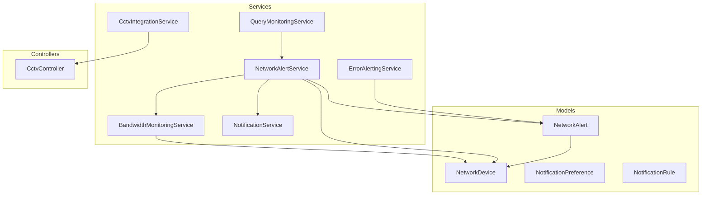
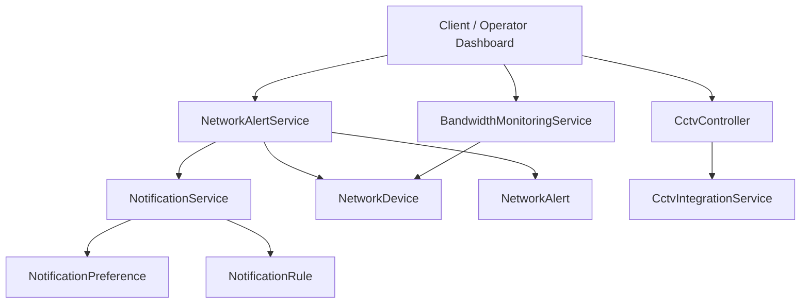
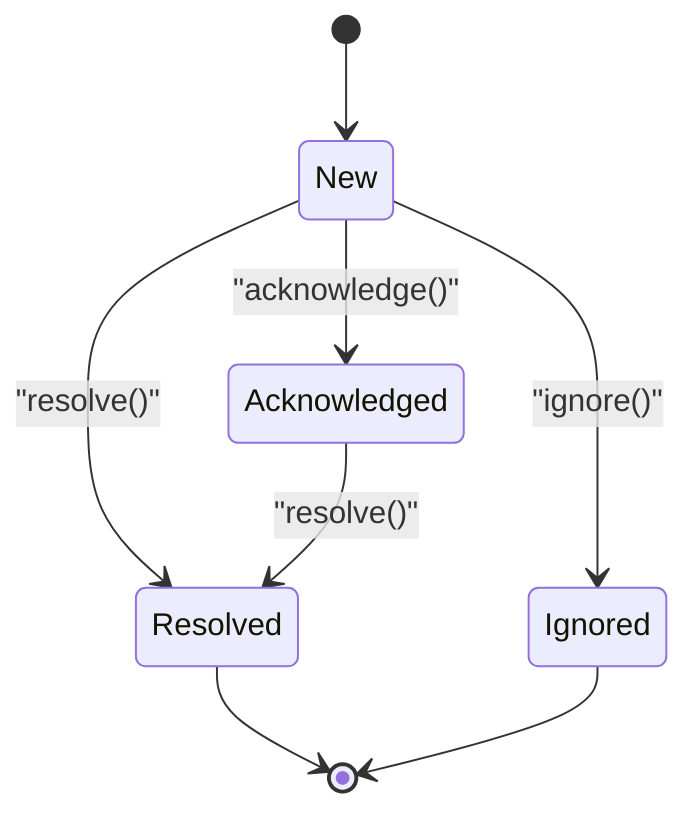
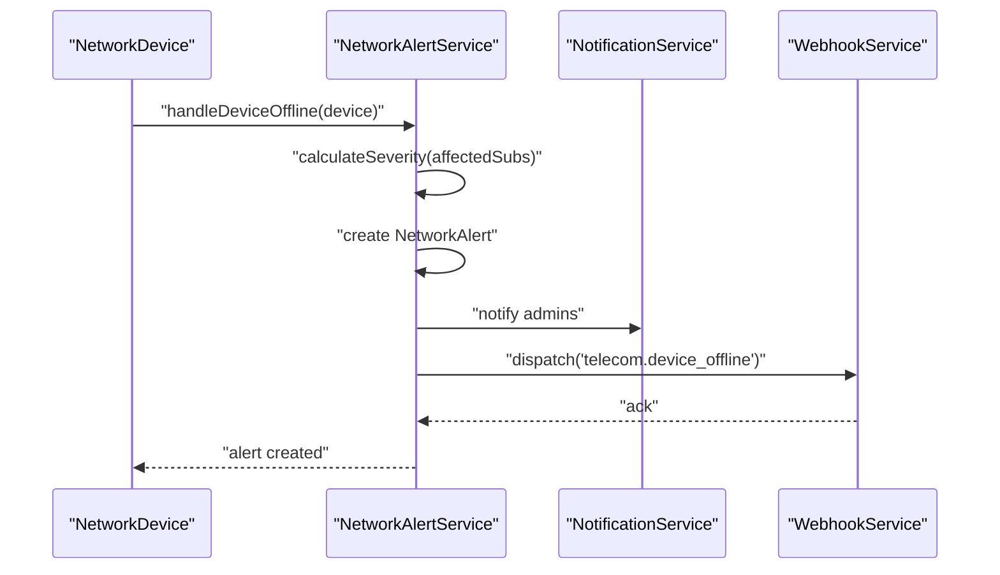
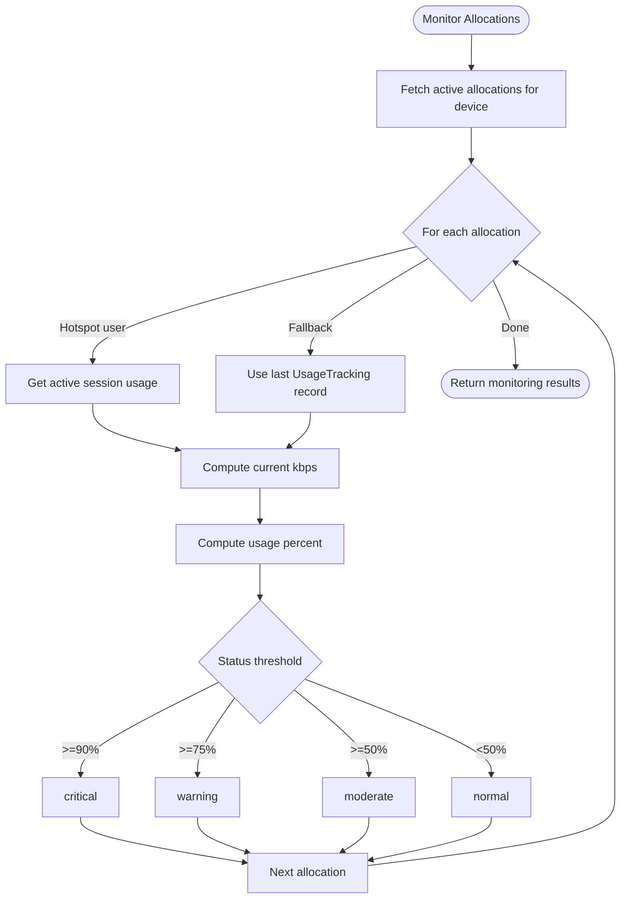
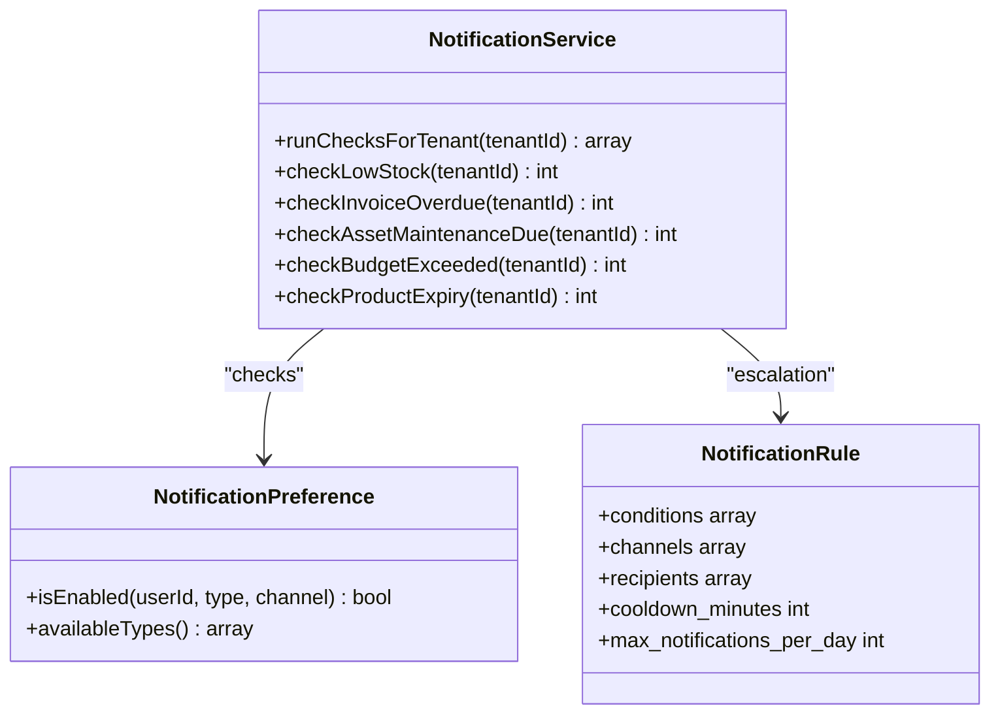
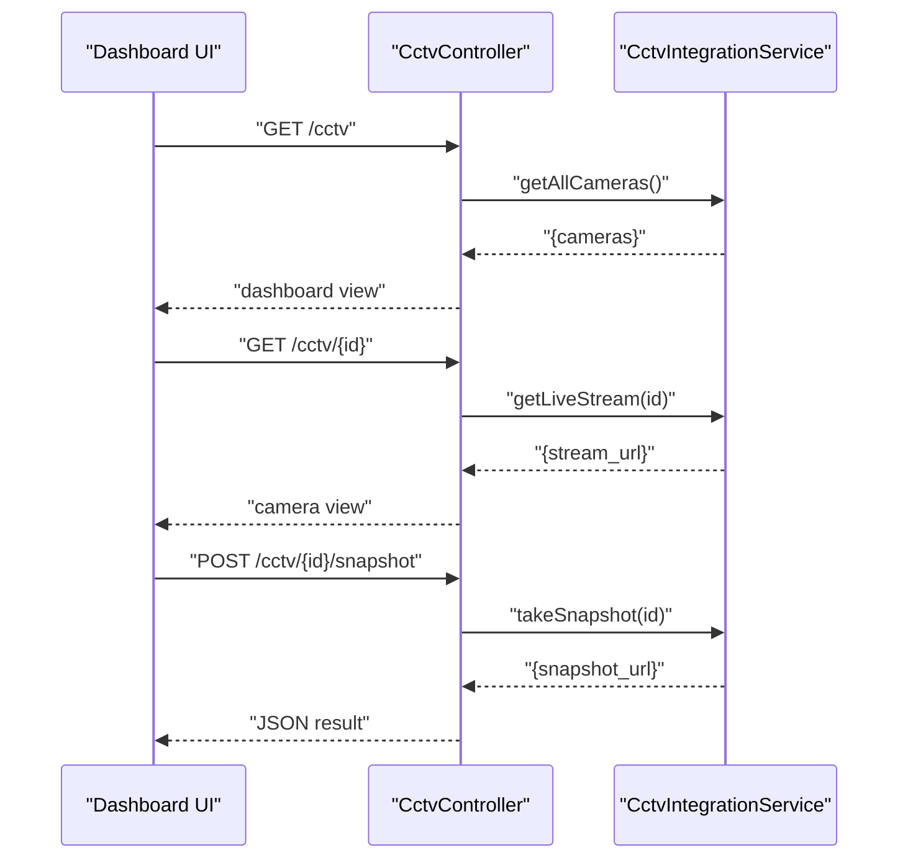
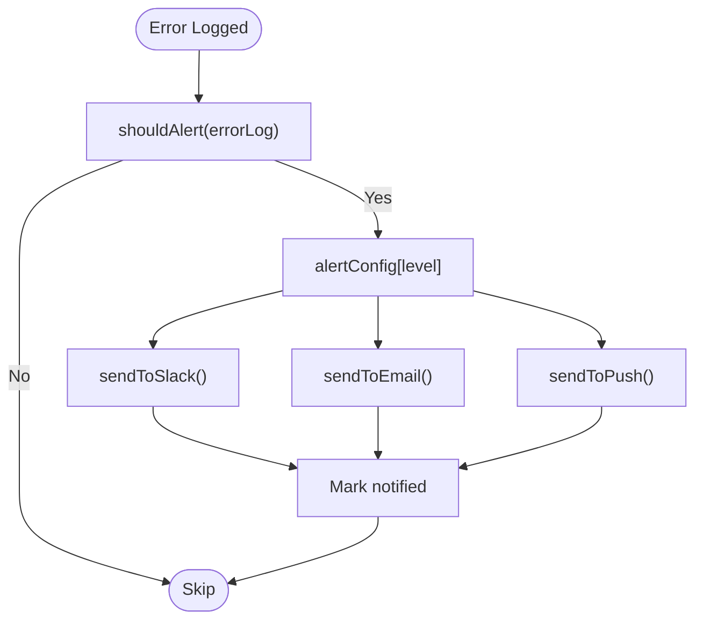
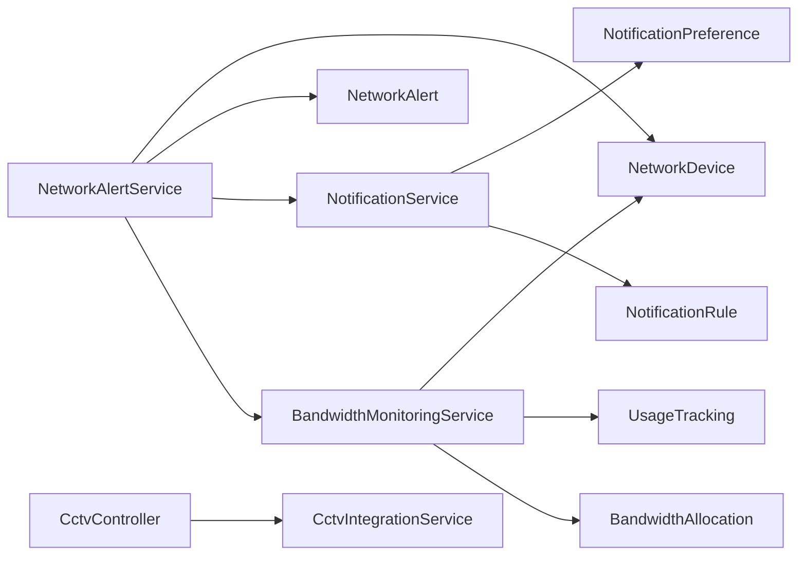

# Network Alerting & Monitoring Systems

<cite>
**Referenced Files in This Document**
- [NetworkAlert.php](file://app/Models/NetworkAlert.php)
- [NetworkDevice.php](file://app/Models/NetworkDevice.php)
- [NetworkAlertService.php](file://app/Services/Telecom/NetworkAlertService.php)
- [BandwidthMonitoringService.php](file://app/Services/Telecom/BandwidthMonitoringService.php)
- [NotificationService.php](file://app/Services/NotificationService.php)
- [NotificationPreference.php](file://app/Models/NotificationPreference.php)
- [NotificationRule.php](file://app/Models/NotificationRule.php)
- [CctvIntegrationService.php](file://app/Services/CctvIntegrationService.php)
- [CctvController.php](file://app/Http/Controllers/Security/CctvController.php)
- [ErrorAlertingService.php](file://app/Services/ErrorAlertingService.php)
- [QueryMonitoringService.php](file://app/Services/QueryMonitoringService.php)
</cite>

## Table of Contents
1. [Introduction](#introduction)
2. [Project Structure](#project-structure)
3. [Core Components](#core-components)
4. [Architecture Overview](#architecture-overview)
5. [Detailed Component Analysis](#detailed-component-analysis)
6. [Dependency Analysis](#dependency-analysis)
7. [Performance Considerations](#performance-considerations)
8. [Troubleshooting Guide](#troubleshooting-guide)
9. [Conclusion](#conclusion)

## Introduction
This document describes the network alerting and monitoring capabilities implemented in the system. It covers real-time network health monitoring, threshold-based alert triggering, multi-channel notification delivery (email, SMS placeholder, webhook), escalation policies, device connectivity alerts, bandwidth saturation warnings, configuration drift detection, security breach notifications, performance degradation alerts, alert filtering, historical trend analysis, automated remediation workflows, and integration with CCTV systems for physical security monitoring. It also documents alert dashboard interfaces, custom alert rules, team notification routing, and compliance reporting for network operations.

## Project Structure
The network monitoring and alerting system spans models, services, controllers, and supporting utilities:
- Models define the alert lifecycle, device metadata, and notification preferences/rules.
- Services encapsulate alert generation, notification dispatch, bandwidth monitoring, and CCTV integration.
- Controllers expose endpoints for dashboard and camera operations.
- Supporting services provide error alerting and query performance monitoring.

**Diagram sources**
- [NetworkAlert.php:10-221](file://app/Models/NetworkAlert.php#L10-L221)
- [NetworkDevice.php:13-191](file://app/Models/NetworkDevice.php#L13-L191)
- [NetworkAlertService.php:18-495](file://app/Services/Telecom/NetworkAlertService.php#L18-L495)
- [BandwidthMonitoringService.php:14-302](file://app/Services/Telecom/BandwidthMonitoringService.php#L14-L302)
- [NotificationService.php:21-579](file://app/Services/NotificationService.php#L21-L579)
- [CctvIntegrationService.php:10-421](file://app/Services/CctvIntegrationService.php#L10-L421)
- [CctvController.php:9-73](file://app/Http/Controllers/Security/CctvController.php#L9-L73)
- [ErrorAlertingService.php:17-302](file://app/Services/ErrorAlertingService.php#L17-L302)
- [QueryMonitoringService.php:8-110](file://app/Services/QueryMonitoringService.php#L8-L110)

**Section sources**
- [NetworkAlert.php:10-221](file://app/Models/NetworkAlert.php#L10-L221)
- [NetworkDevice.php:13-191](file://app/Models/NetworkDevice.php#L13-L191)
- [NetworkAlertService.php:18-495](file://app/Services/Telecom/NetworkAlertService.php#L18-L495)
- [BandwidthMonitoringService.php:14-302](file://app/Services/Telecom/BandwidthMonitoringService.php#L14-L302)
- [NotificationService.php:21-579](file://app/Services/NotificationService.php#L21-L579)
- [CctvIntegrationService.php:10-421](file://app/Services/CctvIntegrationService.php#L10-L421)
- [CctvController.php:9-73](file://app/Http/Controllers/Security/CctvController.php#L9-L73)
- [ErrorAlertingService.php:17-302](file://app/Services/ErrorAlertingService.php#L17-L302)
- [QueryMonitoringService.php:8-110](file://app/Services/QueryMonitoringService.php#L8-L110)

## Core Components
- NetworkAlert model: Stores alert metadata, severity, status, thresholds, metrics, and timestamps; supports scopes for unresolved, critical, device-specific, and recent alerts; provides helpers for acknowledgment, resolution, and status badges.
- NetworkDevice model: Tracks device identity, credentials, connectivity, capabilities, and relationships to subscriptions, users, and alerts; includes online/offline helpers and encryption for secrets.
- NetworkAlertService: Central orchestrator for telecom/network alerts—handles device offline/online, quota exceeded/warning, notification dispatch, webhook triggers, statistics, and resolution.
- BandwidthMonitoringService: Provides real-time and trend bandwidth analytics per device, top consumers, allocation usage, and status classification.
- NotificationService: General-purpose notification engine for low stock, missing reports, overdue invoices, asset maintenance, budget exceeded, and product expiry; integrates with NotificationPreference and NotificationRule.
- NotificationPreference and NotificationRule: Define user notification preferences and reusable alerting rules with channels, recipients, priorities, and cooldowns.
- CctvIntegrationService and CctvController: Integrate with NVR/CCTV backend to fetch streams, snapshots, recordings, motion detection, camera status, PTZ control, and alert webhook setup; controller exposes dashboard endpoints.
- ErrorAlertingService: Threshold-based error alerting with Slack/email/push channels and rate limiting.
- QueryMonitoringService: Monitors slow queries and detects N+1 patterns during runtime.

**Section sources**
- [NetworkAlert.php:10-221](file://app/Models/NetworkAlert.php#L10-L221)
- [NetworkDevice.php:13-191](file://app/Models/NetworkDevice.php#L13-L191)
- [NetworkAlertService.php:18-495](file://app/Services/Telecom/NetworkAlertService.php#L18-L495)
- [BandwidthMonitoringService.php:14-302](file://app/Services/Telecom/BandwidthMonitoringService.php#L14-L302)
- [NotificationService.php:21-579](file://app/Services/NotificationService.php#L21-L579)
- [NotificationPreference.php:8-86](file://app/Models/NotificationPreference.php#L8-L86)
- [NotificationRule.php:10-47](file://app/Models/NotificationRule.php#L10-L47)
- [CctvIntegrationService.php:10-421](file://app/Services/CctvIntegrationService.php#L10-L421)
- [CctvController.php:9-73](file://app/Http/Controllers/Security/CctvController.php#L9-L73)
- [ErrorAlertingService.php:17-302](file://app/Services/ErrorAlertingService.php#L17-L302)
- [QueryMonitoringService.php:8-110](file://app/Services/QueryMonitoringService.php#L8-L110)

## Architecture Overview
The system follows a layered architecture:
- Data Layer: Models persist alerts, devices, preferences, and rules.
- Service Layer: Domain services orchestrate alerting, notifications, bandwidth monitoring, and CCTV integration.
- Presentation Layer: Controllers expose endpoints for dashboards and camera views.
- External Integrations: Webhooks, third-party APIs (NVR), and notification channels.

**Diagram sources**
- [NetworkAlertService.php:18-495](file://app/Services/Telecom/NetworkAlertService.php#L18-L495)
- [BandwidthMonitoringService.php:14-302](file://app/Services/Telecom/BandwidthMonitoringService.php#L14-L302)
- [NotificationService.php:21-579](file://app/Services/NotificationService.php#L21-L579)
- [NotificationPreference.php:8-86](file://app/Models/NotificationPreference.php#L8-L86)
- [NotificationRule.php:10-47](file://app/Models/NotificationRule.php#L10-L47)
- [NetworkAlert.php:10-221](file://app/Models/NetworkAlert.php#L10-L221)
- [NetworkDevice.php:13-191](file://app/Models/NetworkDevice.php#L13-L191)
- [CctvController.php:9-73](file://app/Http/Controllers/Security/CctvController.php#L9-L73)
- [CctvIntegrationService.php:10-421](file://app/Services/CctvIntegrationService.php#L10-L421)

## Detailed Component Analysis

### Network Alert Lifecycle and Severity
- Alerts are created with severity and status, persisted via NetworkAlert model.
- Severity is derived from impact (e.g., number of affected subscriptions).
- Status transitions include new, acknowledged, resolved, ignored; helpers support state changes.
- Scopes enable filtering by unresolved, critical, device, and recency.

**Diagram sources**
- [NetworkAlert.php:87-140](file://app/Models/NetworkAlert.php#L87-L140)

**Section sources**
- [NetworkAlert.php:84-140](file://app/Models/NetworkAlert.php#L84-L140)

### Device Connectivity and Quota Monitoring
- Device offline/online events trigger alerts and recovery notifications.
- Quota exceeded/warning events are generated with metadata and severity.
- Notifications are sent to admins and customers; webhooks dispatched for external integrations.
- Downtime duration calculation supports remediation timing.

**Diagram sources**
- [NetworkAlertService.php:34-84](file://app/Services/Telecom/NetworkAlertService.php#L34-L84)

**Section sources**
- [NetworkAlertService.php:34-132](file://app/Services/Telecom/NetworkAlertService.php#L34-L132)

### Bandwidth Saturation and Trend Analysis
- Real-time bandwidth usage per interface is cached and aggregated.
- Historical trends are retrieved from usage tracking records.
- Allocation usage is monitored with status classification (normal, moderate, warning, critical).
- Top consumers are computed monthly across subscriptions.

**Diagram sources**
- [BandwidthMonitoringService.php:143-178](file://app/Services/Telecom/BandwidthMonitoringService.php#L143-L178)

**Section sources**
- [BandwidthMonitoringService.php:29-135](file://app/Services/Telecom/BandwidthMonitoringService.php#L29-L135)

### Notification Routing and Escalation
- NotificationService centralizes checks and dispatches in-app and email notifications.
- NotificationPreference defines per-user channel enablement; normalization handles dynamic types.
- NotificationRule defines reusable rules with conditions, channels, recipients, priority, cooldown, and daily caps.
- Team escalation occurs via admin/manager roles and tenant scoping.

**Diagram sources**
- [NotificationService.php:21-579](file://app/Services/NotificationService.php#L21-L579)
- [NotificationPreference.php:8-86](file://app/Models/NotificationPreference.php#L8-L86)
- [NotificationRule.php:10-47](file://app/Models/NotificationRule.php#L10-L47)

**Section sources**
- [NotificationService.php:28-31](file://app/Services/NotificationService.php#L28-L31)
- [NotificationPreference.php:64-77](file://app/Models/NotificationPreference.php#L64-L77)
- [NotificationRule.php:14-35](file://app/Models/NotificationRule.php#L14-L35)

### CCTV Integration for Physical Security
- CctvIntegrationService communicates with NVR to retrieve live streams, snapshots, recordings, motion detection, camera status, PTZ control, and set up motion alert webhooks.
- CctvController exposes endpoints for dashboard, camera view, snapshot capture, recordings, and motion detection.

**Diagram sources**
- [CctvController.php:21-71](file://app/Http/Controllers/Security/CctvController.php#L21-L71)
- [CctvIntegrationService.php:29-155](file://app/Services/CctvIntegrationService.php#L29-L155)

**Section sources**
- [CctvIntegrationService.php:29-284](file://app/Services/CctvIntegrationService.php#L29-L284)
- [CctvController.php:18-71](file://app/Http/Controllers/Security/CctvController.php#L18-L71)

### Error Alerting and Performance Degradation
- ErrorAlertingService applies thresholds per error type and level, sending alerts via Slack/webhook and email; marks logs as notified.
- QueryMonitoringService captures SQL queries during a window, computes totals and slow queries, and detects N+1 patterns.

**Diagram sources**
- [ErrorAlertingService.php:42-94](file://app/Services/ErrorAlertingService.php#L42-L94)

**Section sources**
- [ErrorAlertingService.php:42-94](file://app/Services/ErrorAlertingService.php#L42-L94)
- [QueryMonitoringService.php:16-79](file://app/Services/QueryMonitoringService.php#L16-L79)

## Dependency Analysis
- NetworkAlertService depends on NetworkDevice, NetworkAlert, TelecomSubscription, NotificationService, and WebhookService.
- BandwidthMonitoringService depends on NetworkDevice, UsageTracking, BandwidthAllocation, and router adapters.
- NotificationService depends on NotificationPreference, NotificationRule, and multiple domain models.
- CctvIntegrationService depends on tenant API settings and external NVR endpoints.
- ErrorAlertingService and QueryMonitoringService operate independently but complement alerting and performance monitoring.

**Diagram sources**
- [NetworkAlertService.php:18-495](file://app/Services/Telecom/NetworkAlertService.php#L18-L495)
- [BandwidthMonitoringService.php:14-302](file://app/Services/Telecom/BandwidthMonitoringService.php#L14-L302)
- [NotificationService.php:21-579](file://app/Services/NotificationService.php#L21-L579)
- [CctvController.php:9-73](file://app/Http/Controllers/Security/CctvController.php#L9-L73)
- [CctvIntegrationService.php:10-421](file://app/Services/CctvIntegrationService.php#L10-L421)

**Section sources**
- [NetworkAlertService.php:18-495](file://app/Services/Telecom/NetworkAlertService.php#L18-L495)
- [BandwidthMonitoringService.php:14-302](file://app/Services/Telecom/BandwidthMonitoringService.php#L14-L302)
- [NotificationService.php:21-579](file://app/Services/NotificationService.php#L21-L579)
- [CctvIntegrationService.php:10-421](file://app/Services/CctvIntegrationService.php#L10-L421)

## Performance Considerations
- Caching: BandwidthMonitoringService caches device bandwidth usage to reduce repeated adapter calls.
- Pagination and filtering: NetworkAlertService paginates alerts and supports filters by type/severity/device.
- Query monitoring: QueryMonitoringService listens to DB queries during a window to detect slowness and N+1 patterns.
- Rate limiting: ErrorAlertingService limits alert frequency per error type and level.

[No sources needed since this section provides general guidance]

## Troubleshooting Guide
- Device offline alerts: Verify device last_seen_at and status; confirm NotificationService recipients and NotificationPreference settings.
- Quota exceeded/warnings: Confirm TelecomSubscription usage metrics and package quotas; check webhook delivery and customer/admin notifications.
- Bandwidth saturation: Review allocation thresholds and current usage; inspect UsageTracking records and router adapter connectivity.
- CCTV issues: Validate NVR URL/API key; check camera configuration and network connectivity; review logs for motion/snapshot/export failures.
- Error alerts: Confirm threshold configuration and channel availability; inspect error logs and notification marking.
- Query performance: Use QueryMonitoringService to identify slow and N+1 queries; optimize Eloquent usage and eager loading.

**Section sources**
- [NetworkAlertService.php:34-132](file://app/Services/Telecom/NetworkAlertService.php#L34-L132)
- [BandwidthMonitoringService.php:143-178](file://app/Services/Telecom/BandwidthMonitoringService.php#L143-L178)
- [CctvIntegrationService.php:29-202](file://app/Services/CctvIntegrationService.php#L29-L202)
- [ErrorAlertingService.php:42-94](file://app/Services/ErrorAlertingService.php#L42-L94)
- [QueryMonitoringService.php:16-79](file://app/Services/QueryMonitoringService.php#L16-L79)

## Conclusion
The system provides a robust foundation for network alerting and monitoring, covering device connectivity, bandwidth saturation, and integrated CCTV security. It leverages threshold-based triggers, multi-channel notifications, escalation policies, and historical analytics. Extending SMS delivery, refining alert rules, and integrating remediation workflows would further strengthen the platform’s operational resilience.