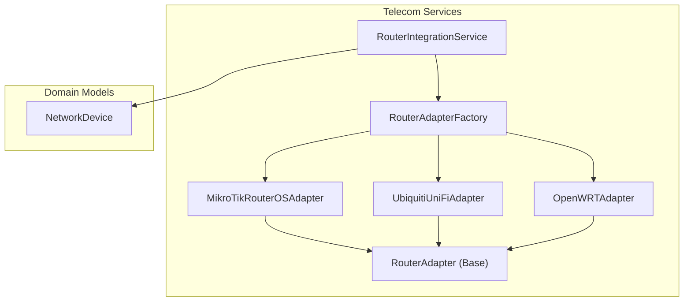
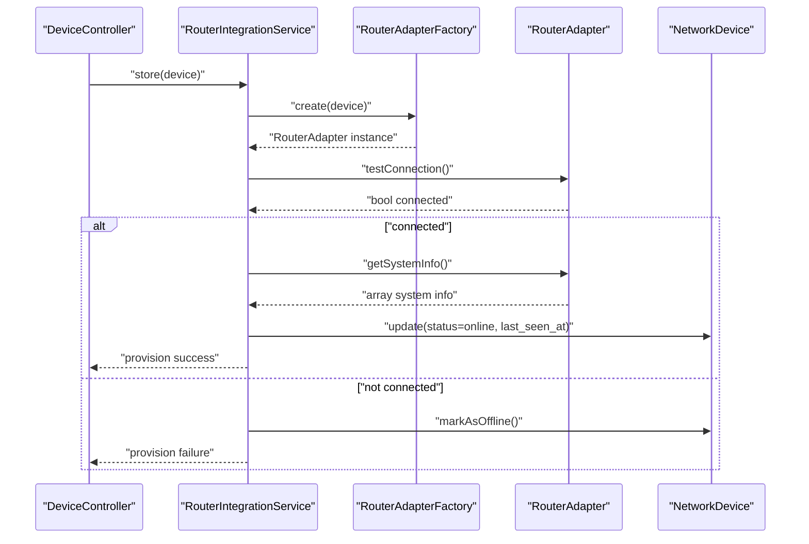
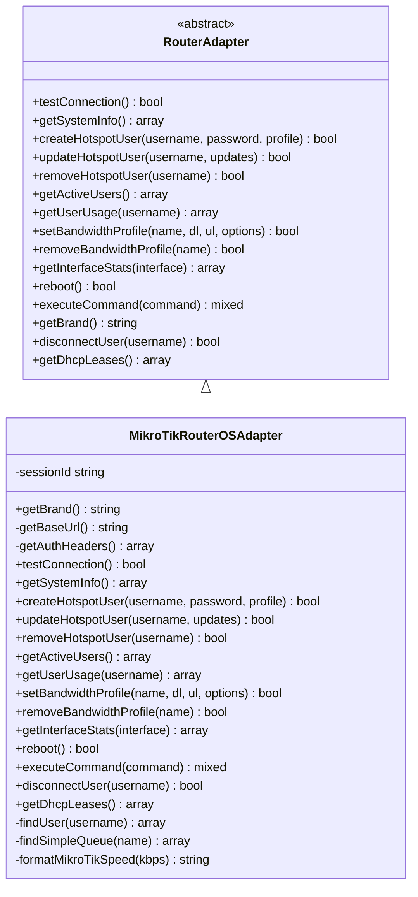
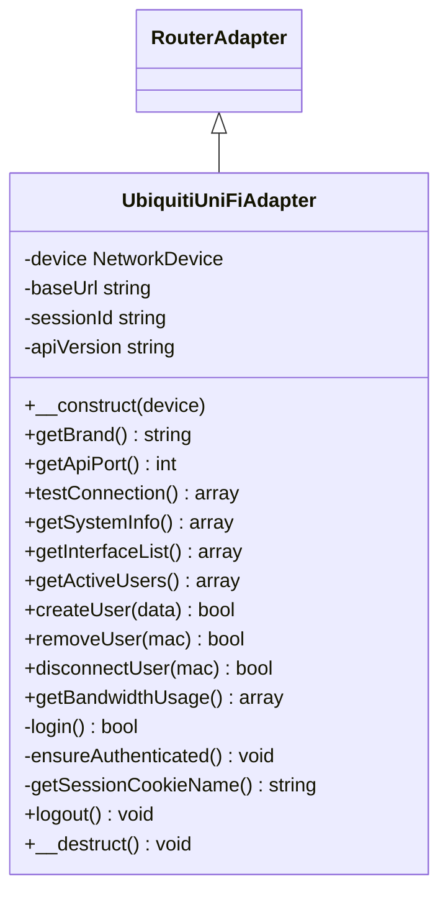
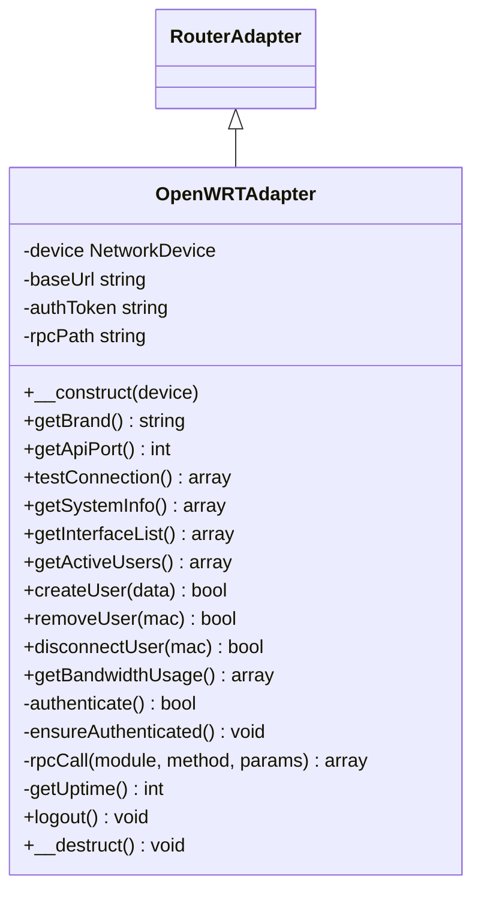
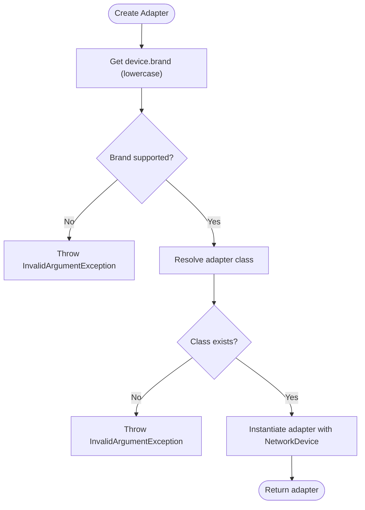
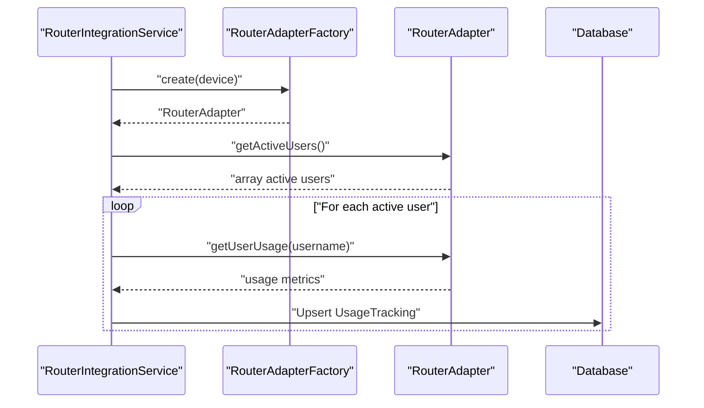
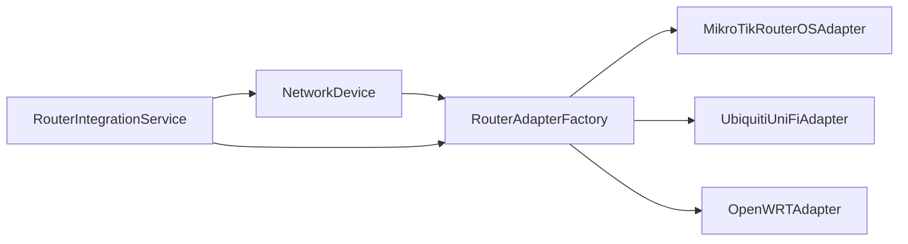

# Router OS Adapters & Hardware Integration

<cite>
**Referenced Files in This Document**
- [RouterAdapterFactory.php](file://app/Services/Telecom/RouterAdapterFactory.php)
- [RouterAdapter.php](file://app/Services/Telecom/RouterAdapter.php)
- [MikroTikRouterOSAdapter.php](file://app/Services/Telecom/MikroTikRouterOSAdapter.php)
- [UbiquitiUniFiAdapter.php](file://app/Services/Telecom/UbiquitiUniFiAdapter.php)
- [OpenWRTAdapter.php](file://app/Services/Telecom/OpenWRTAdapter.php)
- [RouterIntegrationService.php](file://app/Services/Telecom/RouterIntegrationService.php)
- [NetworkDevice.php](file://app/Models/NetworkDevice.php)
- [DeviceController.php](file://app/Http/Controllers/Api/Telecom/DeviceController.php)
- [MikroTikRouterOSAdapterTest.php](file://tests/Unit/Services/Telecom/MikroTikRouterOSAdapterTest.php)
</cite>

## Table of Contents
1. [Introduction](#introduction)
2. [Project Structure](#project-structure)
3. [Core Components](#core-components)
4. [Architecture Overview](#architecture-overview)
5. [Detailed Component Analysis](#detailed-component-analysis)
6. [Dependency Analysis](#dependency-analysis)
7. [Performance Considerations](#performance-considerations)
8. [Troubleshooting Guide](#troubleshooting-guide)
9. [Conclusion](#conclusion)
10. [Appendices](#appendices)

## Introduction
This document describes the router operating system adapters and hardware integration capabilities implemented in the telecom services module. It covers:
- MikroTik RouterOS adapter for RouterOS 7.x+ REST API, hotspot management, bandwidth shaping, and traffic monitoring
- Ubiquiti UniFi adapter for enterprise wireless management via UniFi Controller API
- OpenWRT adapter for open-source router firmware via LuCI RPC and shell commands
- A factory pattern for dynamic router adapter selection
- Device provisioning, health monitoring, and alerting workflows
- Network topology mapping and IoT device connectivity patterns
- Configuration templates, firmware update considerations, and troubleshooting procedures

## Project Structure
The router integration is organized under the telecom services namespace with a shared base adapter, brand-specific implementations, a factory for dynamic selection, and an orchestration service for provisioning and monitoring.

**Diagram sources**
- [RouterAdapterFactory.php:14-51](file://app/Services/Telecom/RouterAdapterFactory.php#L14-L51)
- [RouterAdapter.php:14-23](file://app/Services/Telecom/RouterAdapter.php#L14-L23)
- [MikroTikRouterOSAdapter.php:15-22](file://app/Services/Telecom/MikroTikRouterOSAdapter.php#L15-L22)
- [UbiquitiUniFiAdapter.php:15-41](file://app/Services/Telecom/UbiquitiUniFiAdapter.php#L15-L41)
- [OpenWRTAdapter.php:15-41](file://app/Services/Telecom/OpenWRTAdapter.php#L15-L41)
- [RouterIntegrationService.php:27-47](file://app/Services/Telecom/RouterIntegrationService.php#L27-L47)
- [NetworkDevice.php:13-44](file://app/Models/NetworkDevice.php#L13-L44)

**Section sources**
- [RouterAdapterFactory.php:14-51](file://app/Services/Telecom/RouterAdapterFactory.php#L14-L51)
- [RouterAdapter.php:14-23](file://app/Services/Telecom/RouterAdapter.php#L14-L23)
- [MikroTikRouterOSAdapter.php:15-22](file://app/Services/Telecom/MikroTikRouterOSAdapter.php#L15-L22)
- [UbiquitiUniFiAdapter.php:15-41](file://app/Services/Telecom/UbiquitiUniFiAdapter.php#L15-L41)
- [OpenWRTAdapter.php:15-41](file://app/Services/Telecom/OpenWRTAdapter.php#L15-L41)
- [RouterIntegrationService.php:27-47](file://app/Services/Telecom/RouterIntegrationService.php#L27-L47)
- [NetworkDevice.php:13-44](file://app/Models/NetworkDevice.php#L13-L44)

## Core Components
- RouterAdapterFactory: Maps brands to adapter classes and dynamically instantiates the appropriate adapter based on device metadata.
- RouterAdapter (Base): Defines the contract for router operations (connection testing, system info, user management, bandwidth profiles, interface stats, reboot, command execution, disconnection, DHCP leases).
- MikroTikRouterOSAdapter: Implements RouterAdapter for RouterOS 7.x+ REST API, supporting hotspot user lifecycle, bandwidth queues, active sessions, and basic command execution.
- UbiquitiUniFiAdapter: Implements RouterAdapter for UniFi Controller API, supporting device inventory, active clients, guest/voucher creation, user blocking/kick, bandwidth metrics, and session management.
- OpenWRTAdapter: Implements RouterAdapter for OpenWRT via LuCI RPC and shell commands, supporting system info, interface stats, DHCP leases, bandwidth limiting via tc, and iptables-based user blocking.
- RouterIntegrationService: Orchestrates provisioning, health checks, usage sync, and alerting across adapters.
- NetworkDevice: Domain model representing router/access point/firewall devices with encryption for credentials and status tracking.

**Section sources**
- [RouterAdapterFactory.php:19-24](file://app/Services/Telecom/RouterAdapterFactory.php#L19-L24)
- [RouterAdapter.php:25-143](file://app/Services/Telecom/RouterAdapter.php#L25-L143)
- [MikroTikRouterOSAdapter.php:15-497](file://app/Services/Telecom/MikroTikRouterOSAdapter.php#L15-L497)
- [UbiquitiUniFiAdapter.php:15-377](file://app/Services/Telecom/UbiquitiUniFiAdapter.php#L15-L377)
- [OpenWRTAdapter.php:15-441](file://app/Services/Telecom/OpenWRTAdapter.php#L15-L441)
- [RouterIntegrationService.php:27-394](file://app/Services/Telecom/RouterIntegrationService.php#L27-L394)
- [NetworkDevice.php:147-165](file://app/Models/NetworkDevice.php#L147-L165)

## Architecture Overview
The system follows a factory-driven adapter pattern with a central orchestration service. Device provisioning and monitoring are handled through the integration service, which selects the appropriate adapter based on device brand.

**Diagram sources**
- [DeviceController.php:27-38](file://app/Http/Controllers/Api/Telecom/DeviceController.php#L27-L38)
- [RouterIntegrationService.php:27-64](file://app/Services/Telecom/RouterIntegrationService.php#L27-L64)
- [RouterAdapterFactory.php:33-50](file://app/Services/Telecom/RouterAdapterFactory.php#L33-L50)
- [NetworkDevice.php:126-142](file://app/Models/NetworkDevice.php#L126-L142)

## Detailed Component Analysis

### MikroTik RouterOS Adapter
Implements RouterAdapter for RouterOS 7.x+ REST API:
- Authentication: Basic auth or session cookies depending on availability
- Connection testing: Validates REST endpoint reachability
- System info: Board/model/version, uptime, CPU/memory/HDD stats, architecture
- Hotspot management: Create/update/remove users, active sessions, per-user usage metrics
- Bandwidth management: Create/update/remove simple queue profiles with optional burst/priority
- Interfaces: Ethernet interface stats retrieval
- Operations: Reboot, disconnect active user, DHCP leases, and placeholder for command execution

**Diagram sources**
- [RouterAdapter.php:14-143](file://app/Services/Telecom/RouterAdapter.php#L14-L143)
- [MikroTikRouterOSAdapter.php:15-497](file://app/Services/Telecom/MikroTikRouterOSAdapter.php#L15-L497)

**Section sources**
- [MikroTikRouterOSAdapter.php:19-497](file://app/Services/Telecom/MikroTikRouterOSAdapter.php#L19-L497)

### Ubiquiti UniFi Adapter
Implements RouterAdapter for UniFi Controller API:
- Authentication: Session cookie-based login with version-aware cookie naming
- Connection testing: Login + system status fetch
- System info: Controller version, uptime, device/user counts
- Device inventory: AP list with status and user counts
- Active users: Client list with MAC/IP/host/channel/bytes/uptime
- User lifecycle: Create guest vouchers, block/unauthorize users, kick clients
- Bandwidth: Total bytes in/out and CPU/memory from sysinfo
- Session management: Login/logout with automatic session refresh

**Diagram sources**
- [RouterAdapter.php:14-143](file://app/Services/Telecom/RouterAdapter.php#L14-L143)
- [UbiquitiUniFiAdapter.php:15-377](file://app/Services/Telecom/UbiquitiUniFiAdapter.php#L15-L377)

**Section sources**
- [UbiquitiUniFiAdapter.php:22-377](file://app/Services/Telecom/UbiquitiUniFiAdapter.php#L22-L377)

### OpenWRT Adapter
Implements RouterAdapter for OpenWRT via LuCI RPC and shell commands:
- Authentication: JSON-RPC call to obtain auth token
- Connection testing: Authenticate + system info fetch
- System info: Hostname/model/firmware/kernel/uptime
- Interfaces: Dump network interfaces with IPv4 addresses and byte counters
- Active users: DHCP leases via RPC
- User lifecycle: Bandwidth limiting via tc and iptables-based blocking
- Bandwidth: Aggregate RX/TX from /proc/net/dev
- Session management: Destroy session on logout

**Diagram sources**
- [RouterAdapter.php:14-143](file://app/Services/Telecom/RouterAdapter.php#L14-L143)
- [OpenWRTAdapter.php:15-441](file://app/Services/Telecom/OpenWRTAdapter.php#L15-L441)

**Section sources**
- [OpenWRTAdapter.php:22-441](file://app/Services/Telecom/OpenWRTAdapter.php#L22-L441)

### Router Adapter Factory Pattern
The factory maps brand identifiers to adapter classes and supports registration of custom adapters. It validates brand support and ensures adapter class existence.

**Diagram sources**
- [RouterAdapterFactory.php:33-50](file://app/Services/Telecom/RouterAdapterFactory.php#L33-L50)

**Section sources**
- [RouterAdapterFactory.php:19-89](file://app/Services/Telecom/RouterAdapterFactory.php#L19-L89)

### Router Integration Orchestration
RouterIntegrationService orchestrates provisioning and monitoring:
- Device connection test: Selects adapter, tests connectivity, updates device status and firmware version
- Hotspot user provisioning: Creates bandwidth profile (if needed), creates user on router, persists to database
- Usage sync: Retrieves active users, computes usage, updates online/offline status and quota, writes usage tracking records
- Health monitoring: Checks connectivity and thresholds (CPU/memory), raises alerts
- Bandwidth allocation: Applies queue profiles to router based on allocation parameters

**Diagram sources**
- [RouterIntegrationService.php:182-253](file://app/Services/Telecom/RouterIntegrationService.php#L182-L253)

**Section sources**
- [RouterIntegrationService.php:27-394](file://app/Services/Telecom/RouterIntegrationService.php#L27-L394)

## Dependency Analysis
- RouterAdapterFactory depends on NetworkDevice and adapter classes; it enforces brand support and class existence.
- RouterAdapter defines the contract; all brand adapters extend it.
- RouterIntegrationService depends on RouterAdapterFactory and domain models for provisioning and monitoring.
- NetworkDevice encapsulates credentials (encrypted), status, and relations to related entities.

**Diagram sources**
- [RouterAdapterFactory.php:33-50](file://app/Services/Telecom/RouterAdapterFactory.php#L33-L50)
- [RouterIntegrationService.php:27-47](file://app/Services/Telecom/RouterIntegrationService.php#L27-L47)
- [NetworkDevice.php:13-44](file://app/Models/NetworkDevice.php#L13-L44)

**Section sources**
- [RouterAdapterFactory.php:33-50](file://app/Services/Telecom/RouterAdapterFactory.php#L33-L50)
- [RouterIntegrationService.php:27-47](file://app/Services/Telecom/RouterIntegrationService.php#L27-L47)
- [NetworkDevice.php:13-44](file://app/Models/NetworkDevice.php#L13-L44)

## Performance Considerations
- Connection timeouts: MikroTik adapter sets a short timeout for REST requests; adjust as needed for network latency.
- Batch operations: RouterIntegrationService syncs usage per active user; consider pagination or batching for large deployments.
- Logging overhead: Adapter logging uses a daily channel; ensure log rotation and retention policies are configured.
- Authentication caching: UniFi and OpenWRT adapters cache session tokens; ensure logout/refresh on failures to avoid stale sessions.
- Bandwidth shaping: MikroTik simple queues and OpenWRT tc rules can impact CPU usage under heavy traffic; monitor CPU load during peak usage.

[No sources needed since this section provides general guidance]

## Troubleshooting Guide
Common issues and resolutions:
- Unsupported brand: Ensure device brand matches supported brands; use factory registration for custom brands.
- Authentication failures: Verify credentials, ports, and protocols (HTTP/HTTPS). For UniFi, confirm controller version and cookie naming.
- Connection timeouts: Increase timeouts or reduce concurrent operations; check network connectivity and firewall rules.
- Missing decrypted credentials: NetworkDevice exposes a decrypted password attribute; ensure encryption/decryption keys are configured.
- Adapter method errors: Review adapter-specific error logs and HTTP response codes; validate API endpoints and payload formats.
- Health alerts: RouterIntegrationService creates alerts for offline devices and high CPU/memory; investigate root causes and remediate.

**Section sources**
- [RouterAdapterFactory.php:37-48](file://app/Services/Telecom/RouterAdapterFactory.php#L37-L48)
- [MikroTikRouterOSAdapter.php:51-72](file://app/Services/Telecom/MikroTikRouterOSAdapter.php#L51-L72)
- [UbiquitiUniFiAdapter.php:306-341](file://app/Services/Telecom/UbiquitiUniFiAdapter.php#L306-L341)
- [OpenWRTAdapter.php:329-362](file://app/Services/Telecom/OpenWRTAdapter.php#L329-L362)
- [RouterIntegrationService.php:301-344](file://app/Services/Telecom/RouterIntegrationService.php#L301-L344)

## Conclusion
The router OS adapters provide a robust, extensible foundation for managing diverse networking platforms. The factory pattern enables dynamic selection, while RouterIntegrationService streamlines provisioning, monitoring, and alerting. The adapters cover essential operations—authentication, system info, user management, bandwidth control, and traffic monitoring—while maintaining clear separation of concerns and strong error handling.

[No sources needed since this section summarizes without analyzing specific files]

## Appendices

### Device Provisioning Workflow
- Device registration: Controller validates brand and credentials, persists device metadata.
- Connection test: Adapter tested; device marked online/offline accordingly.
- System info sync: Firmware version and status recorded.
- Optional: Create bandwidth profile and hotspot user in a single transaction.

**Section sources**
- [DeviceController.php:27-38](file://app/Http/Controllers/Api/Telecom/DeviceController.php#L27-L38)
- [RouterIntegrationService.php:27-64](file://app/Services/Telecom/RouterIntegrationService.php#L27-L64)

### Network Topology Mapping and IoT Connectivity Patterns
- Device inventory: UniFi adapter lists APs and statuses; OpenWRT adapter enumerates interfaces and DHCP leases.
- Active clients: UniFi adapter retrieves client details; OpenWRT adapter reads DHCP leases.
- Bandwidth monitoring: MikroTik adapter aggregates per-user bytes; UniFi and OpenWRT adapters compute totals from system metrics.
- IoT patterns: Use DHCP leases and active client lists to correlate MAC/IP/hostnames; enforce bandwidth limits via tc or simple queues.

**Section sources**
- [UbiquitiUniFiAdapter.php:125-191](file://app/Services/Telecom/UbiquitiUniFiAdapter.php#L125-L191)
- [OpenWRTAdapter.php:126-185](file://app/Services/Telecom/OpenWRTAdapter.php#L126-L185)
- [MikroTikRouterOSAdapter.php:208-258](file://app/Services/Telecom/MikroTikRouterOSAdapter.php#L208-L258)

### Configuration Templates and Firmware Updates
- Configuration templates: RouterAdapter accepts a configuration array from NetworkDevice; use it to pass platform-specific options (e.g., HTTPS toggle for MikroTik).
- Firmware updates: The adapters do not implement firmware upgrade operations; use vendor-specific tools or APIs outside this module.

**Section sources**
- [RouterAdapter.php:19-23](file://app/Services/Telecom/RouterAdapter.php#L19-L23)
- [NetworkDevice.php:39-44](file://app/Models/NetworkDevice.php#L39-L44)

### Adapter Method Reference
- MikroTik: Connection test, system info, hotspot user CRUD, active users, per-user usage, bandwidth profiles, interface stats, reboot, disconnect user, DHCP leases.
- UniFi: Connection test, system info, device list, active users, create/remove/disconnect user, bandwidth usage, login/logout.
- OpenWRT: Connection test, system info, interface list, active users, create/remove/disconnect user, bandwidth usage, RPC calls, logout.

**Section sources**
- [MikroTikRouterOSAdapter.php:51-497](file://app/Services/Telecom/MikroTikRouterOSAdapter.php#L51-L497)
- [UbiquitiUniFiAdapter.php:55-377](file://app/Services/Telecom/UbiquitiUniFiAdapter.php#L55-L377)
- [OpenWRTAdapter.php:55-441](file://app/Services/Telecom/OpenWRTAdapter.php#L55-L441)

### Test Coverage Highlights
- Factory instantiation and brand validation
- Connection testing and error handling
- System info retrieval structure
- Hotspot user lifecycle operations
- Bandwidth profile management
- Active user and usage metrics

**Section sources**
- [MikroTikRouterOSAdapterTest.php:37-172](file://tests/Unit/Services/Telecom/MikroTikRouterOSAdapterTest.php#L37-L172)