# Telecom & ISP Management Module

<cite>
**Referenced Files in This Document**
- [RouterAdapter.php](file://app/Services/Telecom/RouterAdapter.php)
- [RouterAdapterFactory.php](file://app/Services/Telecom/RouterAdapterFactory.php)
- [MikroTikRouterOSAdapter.php](file://app/Services/Telecom/MikroTikRouterOSAdapter.php)
- [UbiquitiUniFiAdapter.php](file://app/Services/Telecom/UbiquitiUniFiAdapter.php)
- [OpenWRTAdapter.php](file://app/Services/Telecom/OpenWRTAdapter.php)
- [RouterIntegrationService.php](file://app/Services/Telecom/RouterIntegrationService.php)
- [BandwidthMonitoringService.php](file://app/Services/Telecom/BandwidthMonitoringService.php)
- [HotspotManagementService.php](file://app/Services/Telecom/HotspotManagementService.php)
- [UsageTrackingService.php](file://app/Services/Telecom/UsageTrackingService.php)
- [TelecomBillingIntegrationService.php](file://app/Services/Telecom/TelecomBillingIntegrationService.php)
- [TelecomReportsService.php](file://app/Services/Telecom/TelecomReportsService.php)
- [HotspotUserController.php](file://app/Http/Controllers/Api/Telecom/HotspotUserController.php)
- [api.php](file://routes/api.php)
- [HotspotUser.php](file://app/Models/HotspotUser.php)
- [NetworkDevice.php](file://app/Models/NetworkDevice.php)
- [TelecomSubscription.php](file://app/Models/TelecomSubscription.php)
- [InternetPackage.php](file://app/Models/InternetPackage.php)
- [NetworkAlert.php](file://app/Models/NetworkAlert.php)
- [2026_04_04_000003_create_telecom_subscriptions_table.php](file://database/migrations/2026_04_04_000003_create_telecom_subscriptions_table.php)
- [2026_04_04_000008_create_network_alerts_table.php](file://database/migrations/2026_04_04_000008_create_network_alerts_table.php)
- [NetworkAlertService.php](file://app/Services/Telecom/NetworkAlertService.php)
</cite>

## Table of Contents
1. [Introduction](#introduction)
2. [Project Structure](#project-structure)
3. [Core Components](#core-components)
4. [Architecture Overview](#architecture-overview)
5. [Detailed Component Analysis](#detailed-component-analysis)
6. [Dependency Analysis](#dependency-analysis)
7. [Performance Considerations](#performance-considerations)
8. [Troubleshooting Guide](#troubleshooting-guide)
9. [Conclusion](#conclusion)
10. [Appendices](#appendices)

## Introduction
This document describes the Telecom & ISP Management Module, focusing on router OS adapters for MikroTik, Ubiquiti UniFi, and OpenWRT platforms. It covers bandwidth monitoring and allocation, hotspot user management, automated billing integration, customer portal functionality, voucher generation and management, network alerting systems, and telecom-specific reporting features. It also documents router adapter factory patterns, usage tracking services, network device management, and integration touchpoints with payment gateways and subscription management.

## Project Structure
The module is organized around a service-oriented architecture with:
- Router abstraction and factory pattern for vendor-specific adapters
- Integration orchestration services for device operations
- Domain services for billing, usage tracking, and reporting
- API controllers exposing telecom endpoints
- Models representing subscriptions, devices, users, and alerts
- Database migrations defining telecom domain schema

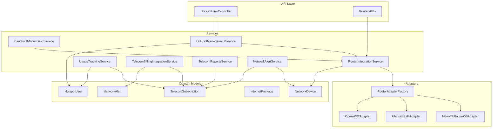

**Diagram sources**
- [HotspotUserController.php:1-42](file://app/Http/Controllers/Api/Telecom/HotspotUserController.php#L1-L42)
- [RouterIntegrationService.php:1-396](file://app/Services/Telecom/RouterIntegrationService.php#L1-L396)
- [RouterAdapterFactory.php:1-91](file://app/Services/Telecom/RouterAdapterFactory.php#L1-L91)
- [MikroTikRouterOSAdapter.php:1-55](file://app/Services/Telecom/MikroTikRouterOSAdapter.php#L1-L55)
- [UbiquitiUniFiAdapter.php:1-48](file://app/Services/Telecom/UbiquitiUniFiAdapter.php#L1-L48)
- [OpenWRTAdapter.php:1-442](file://app/Services/Telecom/OpenWRTAdapter.php#L1-L442)
- [HotspotManagementService.php:1-44](file://app/Services/Telecom/HotspotManagementService.php#L1-L44)
- [BandwidthMonitoringService.php:1-46](file://app/Services/Telecom/BandwidthMonitoringService.php#L1-L46)
- [UsageTrackingService.php:1-178](file://app/Services/Telecom/UsageTrackingService.php#L1-L178)
- [TelecomBillingIntegrationService.php:1-198](file://app/Services/Telecom/TelecomBillingIntegrationService.php#L1-L198)
- [TelecomReportsService.php:1-610](file://app/Services/Telecom/TelecomReportsService.php#L1-L610)
- [NetworkAlertService.php:74-494](file://app/Services/Telecom/NetworkAlertService.php#L74-L494)
- [HotspotUser.php:1-250](file://app/Models/HotspotUser.php#L1-L250)
- [NetworkDevice.php:1-191](file://app/Models/NetworkDevice.php#L1-L191)
- [TelecomSubscription.php:1-304](file://app/Models/TelecomSubscription.php#L1-L304)
- [InternetPackage.php:1-148](file://app/Models/InternetPackage.php#L1-L148)
- [NetworkAlert.php](file://app/Models/NetworkAlert.php)

**Section sources**
- [api.php:71-91](file://routes/api.php#L71-L91)

## Core Components
- RouterAdapter and RouterAdapterFactory: Abstract router operations and factory for vendor-specific adapters
- RouterIntegrationService: Orchestrates device operations, transactions, and persistence
- HotspotManagementService: Manages hotspot user lifecycle across adapters
- BandwidthMonitoringService: Aggregates device bandwidth metrics
- UsageTrackingService: Records and computes usage, quota, and alerts
- TelecomBillingIntegrationService: Generates invoices, handles payment events, and reconnects users
- TelecomReportsService: Produces telecom-specific analytics and exports
- NetworkAlertService: Creates and resolves device and subscription alerts
- Domain models: HotspotUser, NetworkDevice, TelecomSubscription, InternetPackage, NetworkAlert

**Section sources**
- [RouterAdapter.php:1-198](file://app/Services/Telecom/RouterAdapter.php#L1-L198)
- [RouterAdapterFactory.php:1-91](file://app/Services/Telecom/RouterAdapterFactory.php#L1-L91)
- [RouterIntegrationService.php:1-396](file://app/Services/Telecom/RouterIntegrationService.php#L1-L396)
- [HotspotManagementService.php:1-44](file://app/Services/Telecom/HotspotManagementService.php#L1-L44)
- [BandwidthMonitoringService.php:1-46](file://app/Services/Telecom/BandwidthMonitoringService.php#L1-L46)
- [UsageTrackingService.php:1-178](file://app/Services/Telecom/UsageTrackingService.php#L1-L178)
- [TelecomBillingIntegrationService.php:1-198](file://app/Services/Telecom/TelecomBillingIntegrationService.php#L1-L198)
- [TelecomReportsService.php:1-610](file://app/Services/Telecom/TelecomReportsService.php#L1-L610)
- [NetworkAlertService.php:74-494](file://app/Services/Telecom/NetworkAlertService.php#L74-L494)
- [HotspotUser.php:1-250](file://app/Models/HotspotUser.php#L1-L250)
- [NetworkDevice.php:1-191](file://app/Models/NetworkDevice.php#L1-L191)
- [TelecomSubscription.php:1-304](file://app/Models/TelecomSubscription.php#L1-L304)
- [InternetPackage.php:1-148](file://app/Models/InternetPackage.php#L1-L148)
- [NetworkAlert.php](file://app/Models/NetworkAlert.php)

## Architecture Overview
The module follows a layered architecture:
- API layer exposes endpoints for hotspot user management, usage tracking, and webhook integrations
- Service layer encapsulates business logic and orchestrates adapter operations
- Adapter layer abstracts router OS differences
- Persistence layer manages telecom domain entities

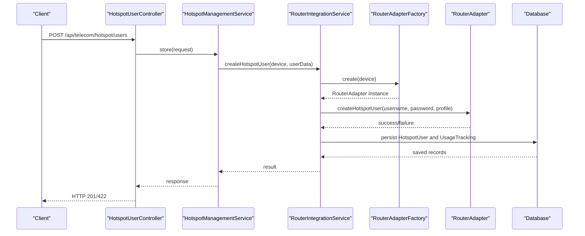

**Diagram sources**
- [HotspotUserController.php:1-42](file://app/Http/Controllers/Api/Telecom/HotspotUserController.php#L1-L42)
- [HotspotManagementService.php:1-44](file://app/Services/Telecom/HotspotManagementService.php#L1-L44)
- [RouterIntegrationService.php:76-143](file://app/Services/Telecom/RouterIntegrationService.php#L76-L143)
- [RouterAdapterFactory.php:33-51](file://app/Services/Telecom/RouterAdapterFactory.php#L33-L51)
- [RouterAdapter.php:40-71](file://app/Services/Telecom/RouterAdapter.php#L40-L71)

## Detailed Component Analysis

### Router Adapter Factory Pattern
The factory pattern centralizes adapter instantiation and supports extensibility.

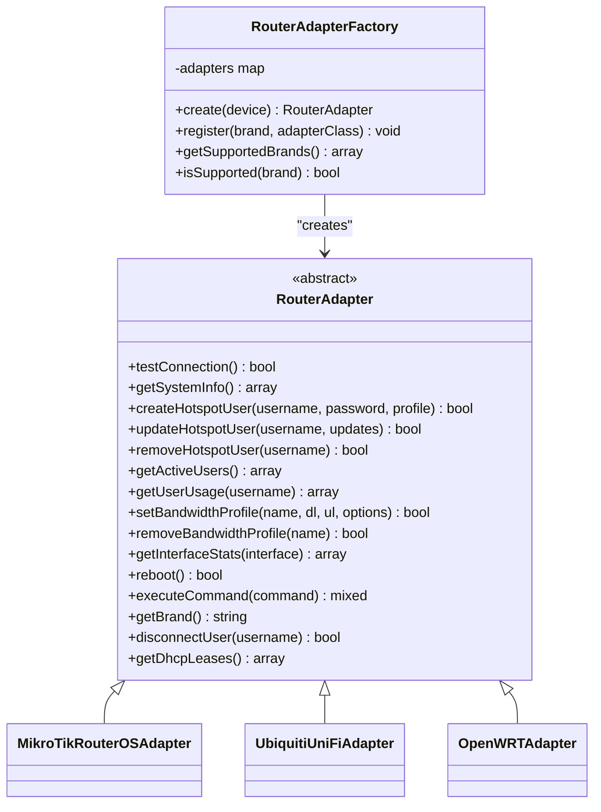

**Diagram sources**
- [RouterAdapter.php:1-198](file://app/Services/Telecom/RouterAdapter.php#L1-L198)
- [RouterAdapterFactory.php:1-91](file://app/Services/Telecom/RouterAdapterFactory.php#L1-L91)
- [MikroTikRouterOSAdapter.php:1-55](file://app/Services/Telecom/MikroTikRouterOSAdapter.php#L1-L55)
- [UbiquitiUniFiAdapter.php:1-48](file://app/Services/Telecom/UbiquitiUniFiAdapter.php#L1-L48)
- [OpenWRTAdapter.php:1-442](file://app/Services/Telecom/OpenWRTAdapter.php#L1-L442)

**Section sources**
- [RouterAdapterFactory.php:19-51](file://app/Services/Telecom/RouterAdapterFactory.php#L19-L51)
- [RouterAdapter.php:19-137](file://app/Services/Telecom/RouterAdapter.php#L19-L137)

### Router Adapters: MikroTik, Ubiquiti UniFi, OpenWRT
- MikroTikRouterOSAdapter: Implements RouterAdapter for RouterOS, supporting REST API authentication and operations.
- UbiquitiUniFiAdapter: Implements RouterAdapter for UniFi Controller/Cloud Key, validating credentials and building base URLs.
- OpenWRTAdapter: Implements RouterAdapterInterface for OpenWRT via LuCI RPC API, authenticating and invoking RPC calls.

Key capabilities:
- Authentication and session management
- System info retrieval
- Hotspot user CRUD
- Bandwidth profile management
- Interface statistics
- DHCP leases
- Reboot and custom commands

**Section sources**
- [MikroTikRouterOSAdapter.php:1-55](file://app/Services/Telecom/MikroTikRouterOSAdapter.php#L1-L55)
- [UbiquitiUniFiAdapter.php:1-48](file://app/Services/Telecom/UbiquitiUniFiAdapter.php#L1-L48)
- [OpenWRTAdapter.php:1-442](file://app/Services/Telecom/OpenWRTAdapter.php#L1-L442)

### Router Integration Orchestration
RouterIntegrationService coordinates device operations:
- Connection testing and status updates
- Hotspot user creation with transactional safety
- Usage synchronization to UsageTracking
- Bandwidth allocation application
- Device health checks and alert creation

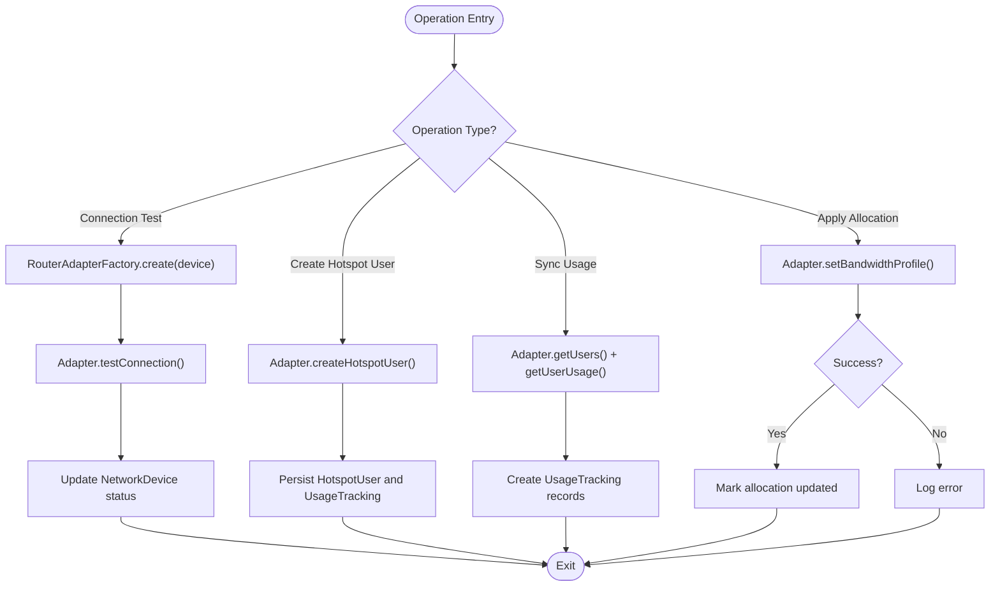

**Diagram sources**
- [RouterIntegrationService.php:27-345](file://app/Services/Telecom/RouterIntegrationService.php#L27-L345)
- [RouterAdapterFactory.php:33-51](file://app/Services/Telecom/RouterAdapterFactory.php#L33-L51)

**Section sources**
- [RouterIntegrationService.php:27-345](file://app/Services/Telecom/RouterIntegrationService.php#L27-L345)

### Bandwidth Monitoring and Allocation
- BandwidthMonitoringService aggregates interface statistics per device via adapters and caches results.
- RouterIntegrationService applies bandwidth allocations to routers and updates allocation metadata.

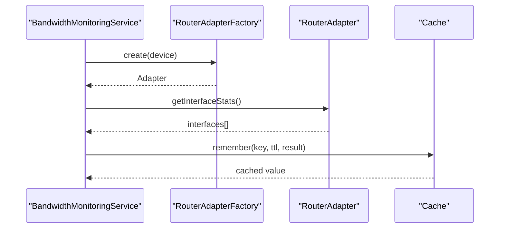

**Diagram sources**
- [BandwidthMonitoringService.php:29-46](file://app/Services/Telecom/BandwidthMonitoringService.php#L29-L46)
- [RouterAdapterFactory.php:33-51](file://app/Services/Telecom/RouterAdapterFactory.php#L33-L51)
- [RouterAdapter.php:100-106](file://app/Services/Telecom/RouterAdapter.php#L100-L106)

**Section sources**
- [BandwidthMonitoringService.php:29-46](file://app/Services/Telecom/BandwidthMonitoringService.php#L29-L46)
- [RouterIntegrationService.php:261-293](file://app/Services/Telecom/RouterIntegrationService.php#L261-L293)

### Hotspot User Management
- HotspotManagementService orchestrates user creation across adapters and persists HotspotUser records.
- API controller validates inputs and delegates to service layer.

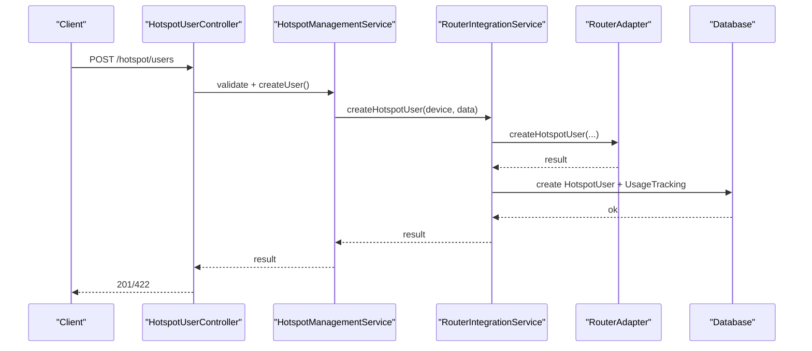

**Diagram sources**
- [HotspotUserController.php:25-42](file://app/Http/Controllers/Api/Telecom/HotspotUserController.php#L25-L42)
- [HotspotManagementService.php:30-44](file://app/Services/Telecom/HotspotManagementService.php#L30-L44)
- [RouterIntegrationService.php:76-143](file://app/Services/Telecom/RouterIntegrationService.php#L76-L143)

**Section sources**
- [HotspotUserController.php:25-42](file://app/Http/Controllers/Api/Telecom/HotspotUserController.php#L25-L42)
- [HotspotManagementService.php:30-44](file://app/Services/Telecom/HotspotManagementService.php#L30-L44)

### Usage Tracking and Quota Management
- UsageTrackingService records usage per subscription, updates quota, and triggers quota exceeded alerts.
- RouterIntegrationService syncs active users and usage metrics to UsageTracking.

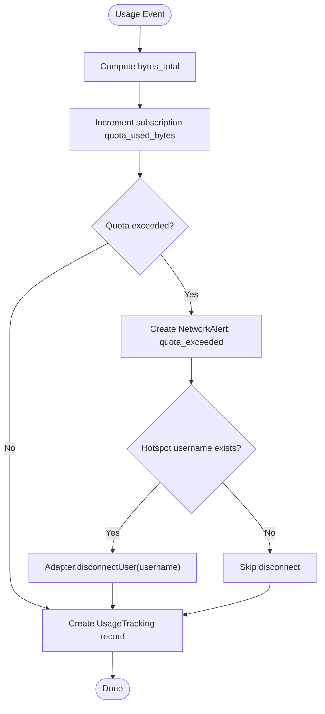

**Diagram sources**
- [UsageTrackingService.php:25-147](file://app/Services/Telecom/UsageTrackingService.php#L25-L147)
- [RouterIntegrationService.php:182-253](file://app/Services/Telecom/RouterIntegrationService.php#L182-L253)

**Section sources**
- [UsageTrackingService.php:25-147](file://app/Services/Telecom/UsageTrackingService.php#L25-L147)
- [RouterIntegrationService.php:182-253](file://app/Services/Telecom/RouterIntegrationService.php#L182-L253)

### Automated Billing Integration
- TelecomBillingIntegrationService generates invoices for subscriptions and handles payment success events.
- On payment success, it reactivates suspended subscriptions and reconnects users.

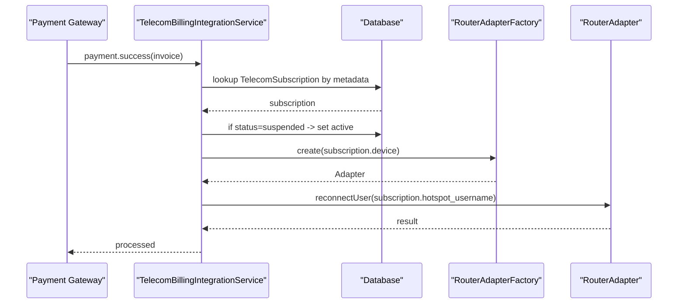

**Diagram sources**
- [TelecomBillingIntegrationService.php:175-198](file://app/Services/Telecom/TelecomBillingIntegrationService.php#L175-L198)
- [RouterAdapterFactory.php:33-51](file://app/Services/Telecom/RouterAdapterFactory.php#L33-L51)

**Section sources**
- [TelecomBillingIntegrationService.php:27-198](file://app/Services/Telecom/TelecomBillingIntegrationService.php#L27-L198)

### Network Alerting Systems
- NetworkAlertService monitors device status, detects offline events, and creates alerts.
- It calculates downtime, resolves previous alerts upon recovery, and notifies administrators.

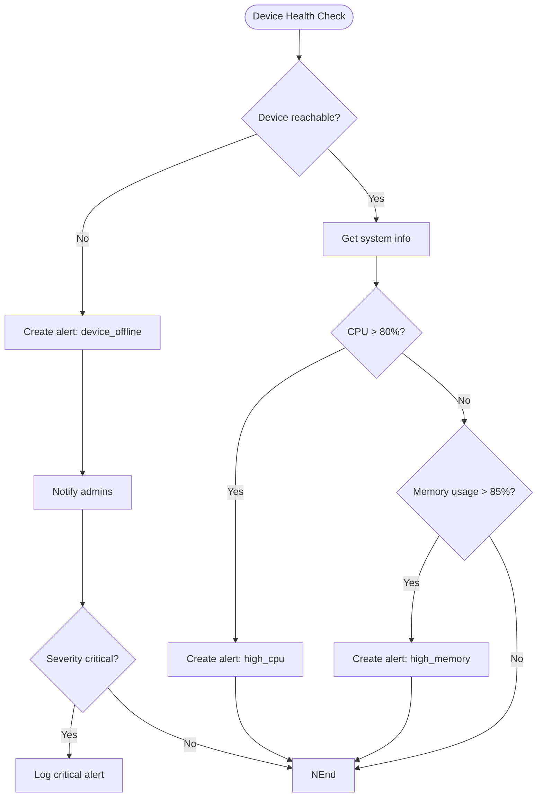

**Diagram sources**
- [NetworkAlertService.php:89-110](file://app/Services/Telecom/NetworkAlertService.php#L89-L110)
- [NetworkAlertService.php:301-344](file://app/Services/Telecom/NetworkAlertService.php#L301-L344)

**Section sources**
- [NetworkAlertService.php:89-110](file://app/Services/Telecom/NetworkAlertService.php#L89-L110)
- [NetworkAlertService.php:301-344](file://app/Services/Telecom/NetworkAlertService.php#L301-L344)

### Telecom Reporting Features
- TelecomReportsService produces revenue by package, bandwidth utilization, customer usage analytics, and top consumers reports.
- Provides export to Excel functionality.

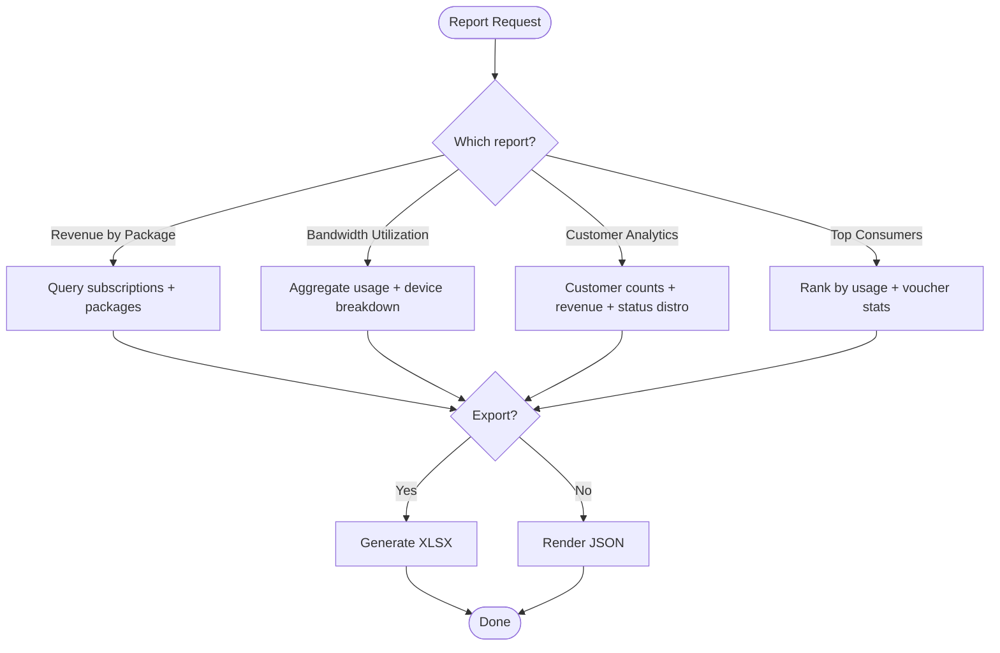

**Diagram sources**
- [TelecomReportsService.php:18-90](file://app/Services/Telecom/TelecomReportsService.php#L18-L90)
- [TelecomReportsService.php:95-192](file://app/Services/Telecom/TelecomReportsService.php#L95-L192)
- [TelecomReportsService.php:197-280](file://app/Services/Telecom/TelecomReportsService.php#L197-L280)
- [TelecomReportsService.php:285-374](file://app/Services/Telecom/TelecomReportsService.php#L285-L374)

**Section sources**
- [TelecomReportsService.php:18-374](file://app/Services/Telecom/TelecomReportsService.php#L18-L374)

### API Endpoints and Usage
- Hotspot user management endpoints under /api/telecom/hotspot
- Usage tracking endpoints under /api/telecom/usage
- Voucher endpoints under /api/telecom/vouchers
- Webhook endpoints for router usage and device alerts under /api/telecom/webhook

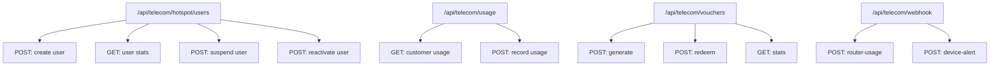

**Diagram sources**
- [api.php:71-91](file://routes/api.php#L71-L91)

**Section sources**
- [api.php:71-91](file://routes/api.php#L71-L91)

### Database Schema and Models
- TelecomSubscription: Tracks customer subscriptions, billing cycles, quotas, and router credentials
- InternetPackage: Defines pricing, speed, quota, and features for plans
- HotspotUser: Stores router user credentials, quotas, and usage stats
- NetworkDevice: Represents managed routers with credentials and status
- NetworkAlert: Captures device and subscription alerts with severity and resolution

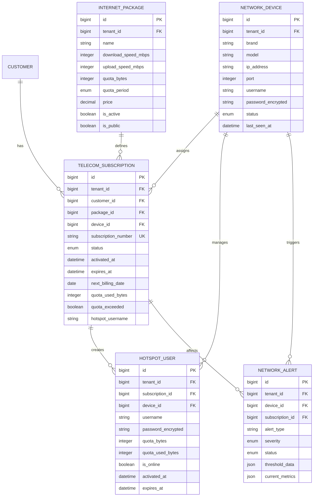

**Diagram sources**
- [2026_04_04_000003_create_telecom_subscriptions_table.php:13-33](file://database/migrations/2026_04_04_000003_create_telecom_subscriptions_table.php#L13-L33)
- [2026_04_04_000008_create_network_alerts_table.php:13-34](file://database/migrations/2026_04_04_000008_create_network_alerts_table.php#L13-L34)
- [TelecomSubscription.php:16-44](file://app/Models/TelecomSubscription.php#L16-L44)
- [InternetPackage.php:16-39](file://app/Models/InternetPackage.php#L16-L39)
- [HotspotUser.php:16-44](file://app/Models/HotspotUser.php#L16-L44)
- [NetworkDevice.php:17-37](file://app/Models/NetworkDevice.php#L17-L37)
- [NetworkAlert.php](file://app/Models/NetworkAlert.php)

**Section sources**
- [2026_04_04_000003_create_telecom_subscriptions_table.php:13-33](file://database/migrations/2026_04_04_000003_create_telecom_subscriptions_table.php#L13-L33)
- [2026_04_04_000008_create_network_alerts_table.php:13-34](file://database/migrations/2026_04_04_000008_create_network_alerts_table.php#L13-L34)
- [TelecomSubscription.php:16-44](file://app/Models/TelecomSubscription.php#L16-L44)
- [InternetPackage.php:16-39](file://app/Models/InternetPackage.php#L16-L39)
- [HotspotUser.php:16-44](file://app/Models/HotspotUser.php#L16-L44)
- [NetworkDevice.php:17-37](file://app/Models/NetworkDevice.php#L17-L37)
- [NetworkAlert.php](file://app/Models/NetworkAlert.php)

## Dependency Analysis
- RouterAdapterFactory depends on NetworkDevice brand field and adapter class registration
- RouterIntegrationService depends on RouterAdapterFactory and adapter contracts
- HotspotManagementService depends on RouterIntegrationService and HotspotUser model
- UsageTrackingService depends on TelecomSubscription and UsageTracking model
- TelecomBillingIntegrationService depends on Invoice and Notification/Webhook services
- TelecomReportsService depends on TelecomSubscription, InternetPackage, UsageTracking, Customer, and VoucherCode models
- NetworkAlertService depends on NetworkDevice, TelecomSubscription, and alert models

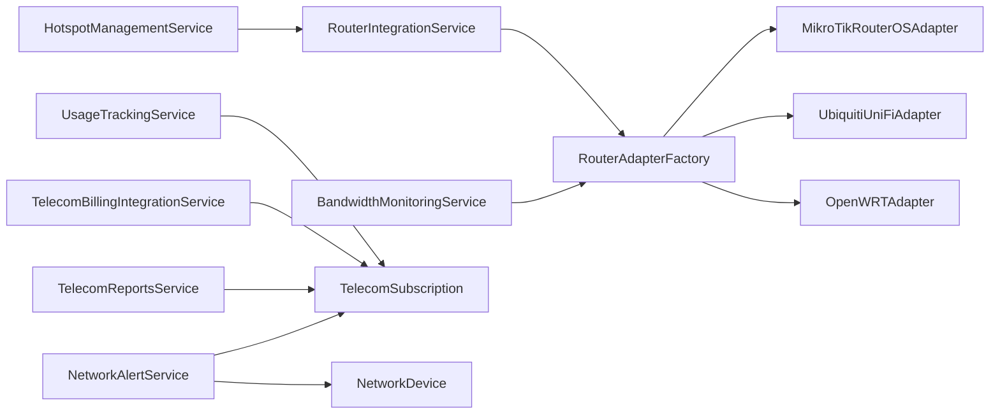

**Diagram sources**
- [RouterAdapterFactory.php:19-51](file://app/Services/Telecom/RouterAdapterFactory.php#L19-L51)
- [RouterIntegrationService.php:30-31](file://app/Services/Telecom/RouterIntegrationService.php#L30-L31)
- [HotspotManagementService.php:18-21](file://app/Services/Telecom/HotspotManagementService.php#L18-L21)
- [BandwidthMonitoringService.php:20-21](file://app/Services/Telecom/BandwidthMonitoringService.php#L20-L21)
- [UsageTrackingService.php:14-15](file://app/Services/Telecom/UsageTrackingService.php#L14-L15)
- [TelecomBillingIntegrationService.php:13-22](file://app/Services/Telecom/TelecomBillingIntegrationService.php#L13-L22)
- [TelecomReportsService.php:13-12](file://app/Services/Telecom/TelecomReportsService.php#L13-L12)
- [NetworkAlertService.php:74-84](file://app/Services/Telecom/NetworkAlertService.php#L74-L84)

**Section sources**
- [RouterAdapterFactory.php:19-51](file://app/Services/Telecom/RouterAdapterFactory.php#L19-L51)
- [RouterIntegrationService.php:30-31](file://app/Services/Telecom/RouterIntegrationService.php#L30-L31)
- [HotspotManagementService.php:18-21](file://app/Services/Telecom/HotspotManagementService.php#L18-L21)
- [BandwidthMonitoringService.php:20-21](file://app/Services/Telecom/BandwidthMonitoringService.php#L20-L21)
- [UsageTrackingService.php:14-15](file://app/Services/Telecom/UsageTrackingService.php#L14-L15)
- [TelecomBillingIntegrationService.php:13-22](file://app/Services/Telecom/TelecomBillingIntegrationService.php#L13-L22)
- [TelecomReportsService.php:13-12](file://app/Services/Telecom/TelecomReportsService.php#L13-L12)
- [NetworkAlertService.php:74-84](file://app/Services/Telecom/NetworkAlertService.php#L74-L84)

## Performance Considerations
- Caching: BandwidthMonitoringService caches device bandwidth results to reduce repeated adapter calls
- Transactions: RouterIntegrationService wraps device operations in transactions to maintain consistency
- Asynchronous jobs: Consider offloading heavy operations (e.g., bulk usage sync, report generation) to queued jobs
- Pagination: ReportsService paginates customer lists to avoid large result sets
- Indexing: Ensure database indexes on frequently queried fields (tenant_id, device_id, subscription_id, timestamps)

## Troubleshooting Guide
Common issues and resolutions:
- Unsupported router brand: RouterAdapterFactory throws an exception for unsupported brands; verify brand field and registration
- Authentication failures: OpenWRTAdapter and MikroTikRouterOSAdapter require valid credentials; check device credentials and ports
- Connection timeouts: RouterAdapter methods enforce timeouts; verify network reachability and firewall rules
- Quota exceeded: UsageTrackingService disconnects users when quota is exceeded; confirm router support for disconnectUser
- Offline devices: NetworkAlertService creates device_offline alerts; ensure last_seen_at updates and health checks

**Section sources**
- [RouterAdapterFactory.php:37-42](file://app/Services/Telecom/RouterAdapterFactory.php#L37-L42)
- [OpenWRTAdapter.php:55-93](file://app/Services/Telecom/OpenWRTAdapter.php#L55-L93)
- [MikroTikRouterOSAdapter.php:51-55](file://app/Services/Telecom/MikroTikRouterOSAdapter.php#L51-L55)
- [UsageTrackingService.php:136-146](file://app/Services/Telecom/UsageTrackingService.php#L136-L146)
- [NetworkAlertService.php:307-310](file://app/Services/Telecom/NetworkAlertService.php#L307-L310)

## Conclusion
The Telecom & ISP Management Module provides a robust, extensible foundation for ISP operations. Its adapter factory pattern enables vendor-neutral router management, while integrated services handle hotspot provisioning, bandwidth control, usage tracking, billing, and alerting. The module’s reporting and API surfaces support operational visibility and customer-facing integrations.

## Appendices
- API endpoint coverage includes hotspot user lifecycle, usage recording, voucher operations, and webhook integrations
- Compliance considerations: Encryption of sensitive credentials, secure webhook signatures, and audit trails for financial events
- Extensibility: New router adapters can be registered via RouterAdapterFactory; additional reports can be added to TelecomReportsService