# Telecom Billing Integration & Payment Processing

<cite>
**Referenced Files in This Document**
- [TelecomBillingIntegrationService.php](file://app/Services/Telecom/TelecomBillingIntegrationService.php)
- [TelecomSubscription.php](file://app/Models/TelecomSubscription.php)
- [InternetPackage.php](file://app/Models/InternetPackage.php)
- [UsageTracking.php](file://app/Models/UsageTracking.php)
- [BandwidthAllocation.php](file://app/Models/BandwidthAllocation.php)
- [NetworkDevice.php](file://app/Models/NetworkDevice.php)
- [RouterAdapterFactory.php](file://app/Services/Telecom/RouterAdapterFactory.php)
- [BandwidthMonitoringService.php](file://app/Services/Telecom/BandwidthMonitoringService.php)
- [UsageTrackingService.php](file://app/Services/Telecom/UsageTrackingService.php)
- [2026_04_04_000003_create_telecom_subscriptions_table.php](file://database/migrations/2026_04_04_000003_create_telecom_subscriptions_table.php)
- [SubscriptionBillingController.php](file://app/Http/Controllers/SubscriptionBillingController.php)
- [PaymentGatewayController.php](file://app/Http/Controllers/PaymentGatewayController.php)
- [SubscriptionPayment.php](file://app/Models/SubscriptionPayment.php)
- [TaxCalculationService.php](file://app/Services/TaxCalculationService.php)
- [payment-gateways.blade.php](file://resources/views/settings/payment-gateways.blade.php)
</cite>

## Table of Contents
1. [Introduction](#introduction)
2. [Project Structure](#project-structure)
3. [Core Components](#core-components)
4. [Architecture Overview](#architecture-overview)
5. [Detailed Component Analysis](#detailed-component-analysis)
6. [Dependency Analysis](#dependency-analysis)
7. [Performance Considerations](#performance-considerations)
8. [Troubleshooting Guide](#troubleshooting-guide)
9. [Conclusion](#conclusion)

## Introduction
This document provides comprehensive documentation for the telecom billing integration and payment processing systems within the ERP. It covers subscription management workflows, package configuration, automated billing generation, and payment processing integration. The system supports recurring billing cycles, proration calculations, usage-based billing, promotional pricing, and discount management. It also documents invoice generation, payment gateway integration, subscription upgrades/downgrades, cancellation workflows, and refund processing. Additionally, it explains billing cycle synchronization with router adapters, usage data correlation, tax calculation, and compliance reporting for telecom services.

## Project Structure
The telecom billing system is organized around dedicated service classes, models, and controllers that handle subscription lifecycle, usage tracking, bandwidth monitoring, and payment processing. The structure emphasizes separation of concerns with services encapsulating business logic and models representing domain entities.

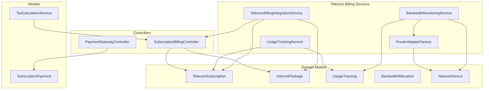

**Diagram sources**
- [TelecomBillingIntegrationService.php:1-162](file://app/Services/Telecom/TelecomBillingIntegrationService.php#L1-L162)
- [BandwidthMonitoringService.php:108-234](file://app/Services/Telecom/BandwidthMonitoringService.php#L108-L234)
- [UsageTrackingService.php:62-100](file://app/Services/Telecom/UsageTrackingService.php#L62-L100)
- [RouterAdapterFactory.php:1-91](file://app/Services/Telecom/RouterAdapterFactory.php#L1-L91)
- [TelecomSubscription.php:1-304](file://app/Models/TelecomSubscription.php#L1-L304)
- [InternetPackage.php:1-148](file://app/Models/InternetPackage.php#L1-L148)
- [UsageTracking.php:1-160](file://app/Models/UsageTracking.php#L1-L160)
- [BandwidthAllocation.php:1-188](file://app/Models/BandwidthAllocation.php#L1-L188)
- [NetworkDevice.php:1-191](file://app/Models/NetworkDevice.php#L1-L191)
- [SubscriptionBillingController.php:188-267](file://app/Http/Controllers/SubscriptionBillingController.php#L188-L267)
- [PaymentGatewayController.php:1-37](file://app/Http/Controllers/PaymentGatewayController.php#L1-L37)
- [SubscriptionPayment.php:1-28](file://app/Models/SubscriptionPayment.php#L1-L28)
- [TaxCalculationService.php](file://app/Services/TaxCalculationService.php)

**Section sources**
- [TelecomBillingIntegrationService.php:1-162](file://app/Services/Telecom/TelecomBillingIntegrationService.php#L1-L162)
- [RouterAdapterFactory.php:1-91](file://app/Services/Telecom/RouterAdapterFactory.php#L1-L91)
- [TelecomSubscription.php:1-304](file://app/Models/TelecomSubscription.php#L1-L304)
- [InternetPackage.php:1-148](file://app/Models/InternetPackage.php#L1-L148)
- [UsageTracking.php:1-160](file://app/Models/UsageTracking.php#L1-L160)
- [BandwidthAllocation.php:1-188](file://app/Models/BandwidthAllocation.php#L1-L188)
- [NetworkDevice.php:1-191](file://app/Models/NetworkDevice.php#L1-L191)
- [SubscriptionBillingController.php:188-267](file://app/Http/Controllers/SubscriptionBillingController.php#L188-L267)
- [PaymentGatewayController.php:1-37](file://app/Http/Controllers/PaymentGatewayController.php#L1-L37)
- [SubscriptionPayment.php:1-28](file://app/Models/SubscriptionPayment.php#L1-L28)
- [TaxCalculationService.php](file://app/Services/TaxCalculationService.php)

## Core Components
This section outlines the primary components responsible for telecom billing and payment processing.

- TelecomBillingIntegrationService: Generates invoices for telecom subscriptions, manages billing periods, applies discounts, calculates taxes, updates subscription billing dates, dispatches webhooks, and sends customer notifications.
- TelecomSubscription: Represents a customer's internet subscription, including status, billing cycle, quota tracking, and related associations.
- InternetPackage: Defines package configurations such as speed tiers, quotas, pricing, rollover policies, and overage charges.
- UsageTracking: Records bandwidth usage metrics per subscription and device for billing and monitoring.
- BandwidthAllocation: Manages QoS and bandwidth guarantees per subscription or hotspot user.
- NetworkDevice: Represents network infrastructure devices (e.g., routers) used for usage monitoring and router adapter integration.
- BandwidthMonitoringService: Monitors bandwidth allocations, detects overuse, correlates usage with router adapters, and provides top consumer insights.
- UsageTrackingService: Aggregates usage summaries for subscriptions across daily, weekly, and monthly periods.
- RouterAdapterFactory: Factory for creating router-specific adapters to synchronize billing with network device usage.
- SubscriptionBillingController: Handles subscription billing workflows, invoicing, journal entries, and billing cycle advancement.
- PaymentGatewayController: Processes payment requests via external gateways, records pending payments, and integrates with subscription plans.
- SubscriptionPayment: Tracks payment transactions against subscription plans with gateway metadata.
- TaxCalculationService: Provides tax calculation utilities integrated into billing processes.

**Section sources**
- [TelecomBillingIntegrationService.php:24-125](file://app/Services/Telecom/TelecomBillingIntegrationService.php#L24-L125)
- [TelecomSubscription.php:16-60](file://app/Models/TelecomSubscription.php#L16-L60)
- [InternetPackage.php:16-57](file://app/Models/InternetPackage.php#L16-L57)
- [UsageTracking.php:13-51](file://app/Models/UsageTracking.php#L13-L51)
- [BandwidthAllocation.php:13-49](file://app/Models/BandwidthAllocation.php#L13-L49)
- [NetworkDevice.php:17-44](file://app/Models/NetworkDevice.php#L17-L44)
- [BandwidthMonitoringService.php:108-234](file://app/Services/Telecom/BandwidthMonitoringService.php#L108-L234)
- [UsageTrackingService.php:62-100](file://app/Services/Telecom/UsageTrackingService.php#L62-L100)
- [RouterAdapterFactory.php:14-90](file://app/Services/Telecom/RouterAdapterFactory.php#L14-L90)
- [SubscriptionBillingController.php:188-267](file://app/Http/Controllers/SubscriptionBillingController.php#L188-L267)
- [PaymentGatewayController.php:14-37](file://app/Http/Controllers/PaymentGatewayController.php#L14-L37)
- [SubscriptionPayment.php:10-28](file://app/Models/SubscriptionPayment.php#L10-L28)
- [TaxCalculationService.php](file://app/Services/TaxCalculationService.php)

## Architecture Overview
The telecom billing architecture integrates subscription management, usage tracking, router adapter synchronization, and payment processing. The system generates invoices based on package pricing, billing cycles, and usage, while maintaining real-time visibility into bandwidth consumption.

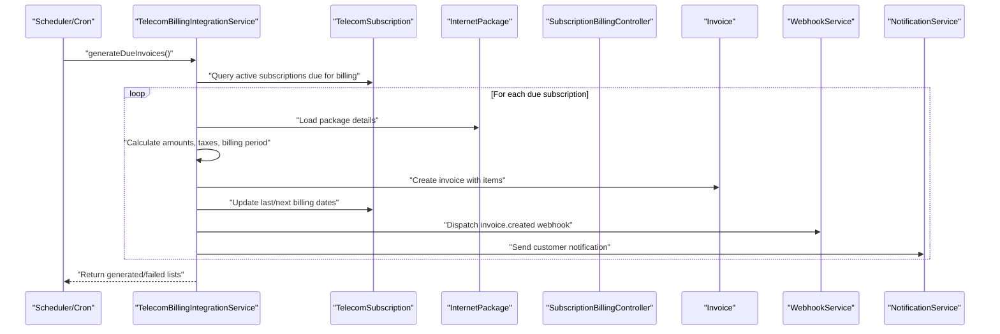

**Diagram sources**
- [TelecomBillingIntegrationService.php:127-162](file://app/Services/Telecom/TelecomBillingIntegrationService.php#L127-L162)
- [TelecomSubscription.php:273-302](file://app/Models/TelecomSubscription.php#L273-L302)
- [InternetPackage.php:16-57](file://app/Models/InternetPackage.php#L16-L57)
- [SubscriptionBillingController.php:188-267](file://app/Http/Controllers/SubscriptionBillingController.php#L188-L267)

## Detailed Component Analysis

### TelecomBillingIntegrationService
This service orchestrates automated billing generation for telecom subscriptions. It computes base amounts, applies discounts, calculates taxes, determines billing periods, creates invoices, updates subscription billing dates, and triggers webhooks and notifications.

Key responsibilities:
- Invoice generation with configurable amount, discount, tax rate, and period.
- Billing cycle determination based on package billing frequency.
- Subscription billing date updates after invoice creation.
- Webhook dispatch and customer notification on invoice creation.

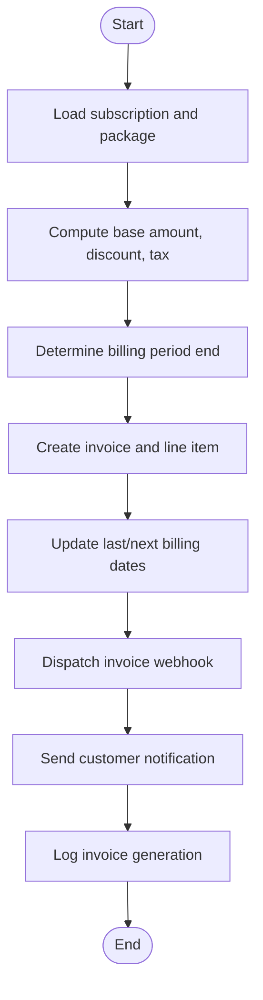

**Diagram sources**
- [TelecomBillingIntegrationService.php:27-125](file://app/Services/Telecom/TelecomBillingIntegrationService.php#L27-L125)

**Section sources**
- [TelecomBillingIntegrationService.php:24-125](file://app/Services/Telecom/TelecomBillingIntegrationService.php#L24-L125)

### TelecomSubscription Model
The model encapsulates subscription lifecycle, billing metadata, quota tracking, and sensitive credentials. It provides scopes for active/expired/quota-exceeded/expiring-soon subscriptions and utility methods for activation, suspension, cancellation, and quota reset.

Key capabilities:
- Status transitions and timestamps.
- Billing cycle and quota period management.
- Encrypted credential attributes for hotspot and PPPoE.
- Scopes for filtering subscriptions by status and expiration.

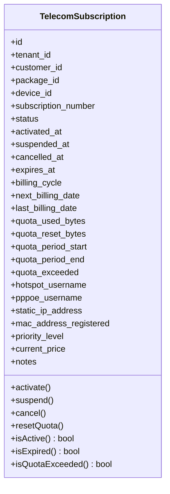

**Diagram sources**
- [TelecomSubscription.php:12-303](file://app/Models/TelecomSubscription.php#L12-L303)

**Section sources**
- [TelecomSubscription.php:16-60](file://app/Models/TelecomSubscription.php#L16-L60)
- [TelecomSubscription.php:131-203](file://app/Models/TelecomSubscription.php#L131-L203)

### InternetPackage Model
Defines package configurations including speed tiers, burst rates, quotas, rollover policies, pricing, installation fees, and overage charges. It provides helpers for unlimited quota detection, formatted pricing, and overage cost calculation.

Key capabilities:
- Unlimited quota detection and formatted quota display.
- Overage charge computation based on excess usage.
- Active/public/package ordering scopes.

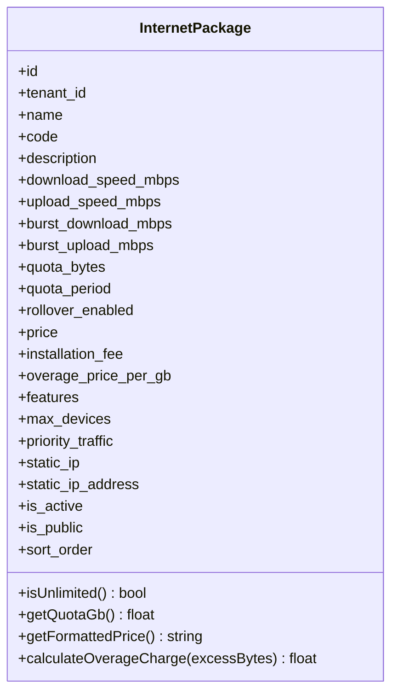

**Diagram sources**
- [InternetPackage.php:12-147](file://app/Models/InternetPackage.php#L12-L147)

**Section sources**
- [InternetPackage.php:83-146](file://app/Models/InternetPackage.php#L83-L146)

### UsageTracking and BandwidthAllocation Models
UsageTracking captures granular usage metrics per subscription/device for billing and reporting. BandwidthAllocation manages QoS policies, guaranteed/max bandwidth, priority levels, and time-based rules.

Key capabilities:
- Usage aggregation by period type and date range.
- High usage consumer identification.
- Allocation activity checks and time-based rule enforcement.
- Formatted bandwidth displays and priority ordering.

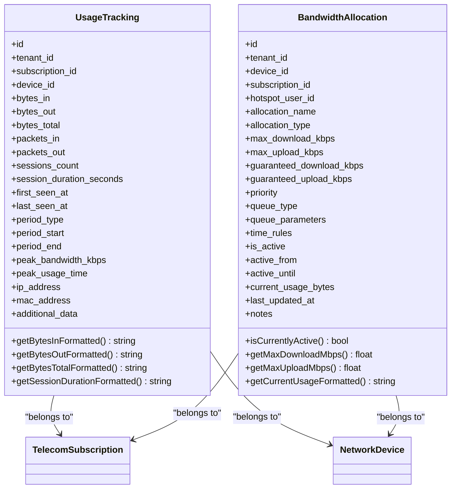

**Diagram sources**
- [UsageTracking.php:10-159](file://app/Models/UsageTracking.php#L10-L159)
- [BandwidthAllocation.php:10-187](file://app/Models/BandwidthAllocation.php#L10-L187)

**Section sources**
- [UsageTracking.php:13-51](file://app/Models/UsageTracking.php#L13-L51)
- [BandwidthAllocation.php:36-49](file://app/Models/BandwidthAllocation.php#L36-L49)
- [BandwidthAllocation.php:84-129](file://app/Models/BandwidthAllocation.php#L84-L129)

### BandwidthMonitoringService
Monitors bandwidth allocations, correlates usage with router adapters, detects overuse, and provides top consumer insights. It retrieves live usage from network devices and falls back to last known usage records.

Key capabilities:
- Top consumer reporting by total bytes.
- Allocation monitoring with usage percent and status.
- Router adapter integration for live user usage retrieval.

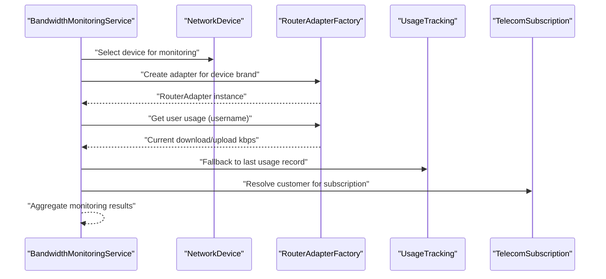

**Diagram sources**
- [BandwidthMonitoringService.php:186-234](file://app/Services/Telecom/BandwidthMonitoringService.php#L186-L234)
- [RouterAdapterFactory.php:33-51](file://app/Services/Telecom/RouterAdapterFactory.php#L33-L51)

**Section sources**
- [BandwidthMonitoringService.php:108-178](file://app/Services/Telecom/BandwidthMonitoringService.php#L108-L178)
- [BandwidthMonitoringService.php:186-234](file://app/Services/Telecom/BandwidthMonitoringService.php#L186-L234)

### UsageTrackingService
Aggregates usage summaries for subscriptions across daily, weekly, and monthly periods. It computes totals for downloads, uploads, total usage, average peak bandwidth, and record counts. It also calculates quota remaining and usage percentage for non-unlimited packages.

Key capabilities:
- Period-based usage aggregation.
- Quota remaining and usage percentage computation.
- Summary data for reporting and billing adjustments.

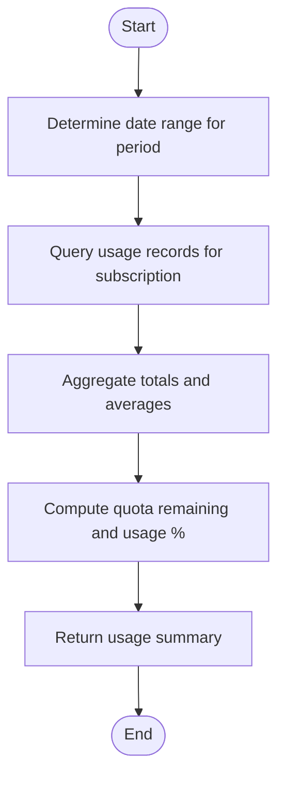

**Diagram sources**
- [UsageTrackingService.php:76-100](file://app/Services/Telecom/UsageTrackingService.php#L76-L100)

**Section sources**
- [UsageTrackingService.php:62-100](file://app/Services/Telecom/UsageTrackingService.php#L62-L100)

### RouterAdapterFactory
Provides factory-based instantiation of router-specific adapters for supported brands (e.g., MikroTik, Ubiquiti, OpenWRT). It validates brand support, ensures adapter class compatibility, and exposes registration and discovery utilities.

Key capabilities:
- Brand-to-adapter mapping.
- Adapter instantiation and validation.
- Supported brands enumeration and custom adapter registration.

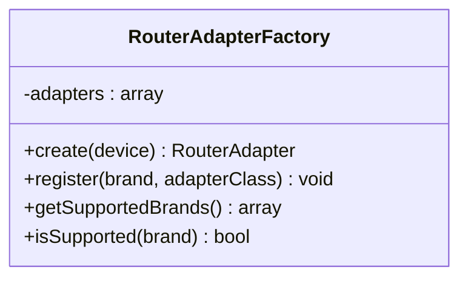

**Diagram sources**
- [RouterAdapterFactory.php:14-90](file://app/Services/Telecom/RouterAdapterFactory.php#L14-L90)

**Section sources**
- [RouterAdapterFactory.php:17-68](file://app/Services/Telecom/RouterAdapterFactory.php#L17-L68)

### SubscriptionBillingController
Handles subscription billing workflows including invoice creation, billing cycle advancement, and general ledger posting. It computes billing periods, applies discounts, and posts journal entries upon successful invoice creation.

Key capabilities:
- Invoice creation with billing period and amounts.
- Next billing date advancement based on package cycle.
- General ledger integration for invoice postings.

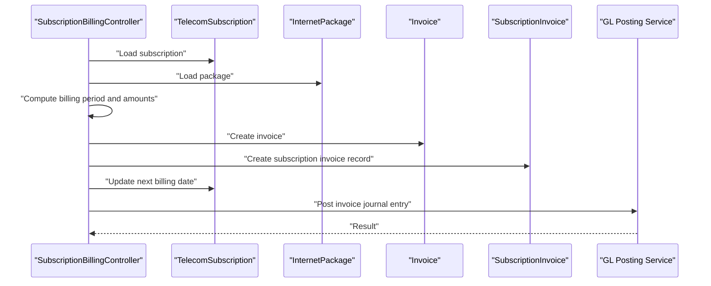

**Diagram sources**
- [SubscriptionBillingController.php:188-267](file://app/Http/Controllers/SubscriptionBillingController.php#L188-L267)

**Section sources**
- [SubscriptionBillingController.php:188-267](file://app/Http/Controllers/SubscriptionBillingController.php#L188-L267)

### PaymentGatewayController and SubscriptionPayment
Processes payment requests via external gateways, records pending payments, and integrates with subscription plans. It validates plan selection, constructs order identifiers, and persists payment metadata.

Key capabilities:
- Plan-based pricing calculation (monthly/yearly).
- Pending payment creation with gateway metadata.
- Integration with subscription payment models.

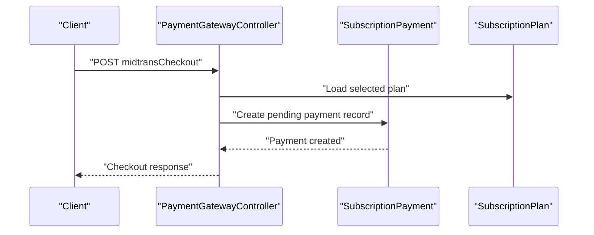

**Diagram sources**
- [PaymentGatewayController.php:18-37](file://app/Http/Controllers/PaymentGatewayController.php#L18-L37)
- [SubscriptionPayment.php:10-28](file://app/Models/SubscriptionPayment.php#L10-L28)

**Section sources**
- [PaymentGatewayController.php:14-37](file://app/Http/Controllers/PaymentGatewayController.php#L14-L37)
- [SubscriptionPayment.php:10-28](file://app/Models/SubscriptionPayment.php#L10-L28)

### Database Schema: Telecom Subscriptions
The telecom subscriptions table defines the core schema for managing subscription lifecycle, billing cycles, quota tracking, and associated identifiers. It includes tenant scoping, customer/package/device relationships, and billing metadata.

Key schema elements:
- Tenant-scoped foreign keys for isolation.
- Unique subscription number for reference.
- Status tracking with timestamps for activation/suspension/cancellation/expiration.
- Billing cycle and date fields for automation.
- Quota tracking fields for usage-based billing.

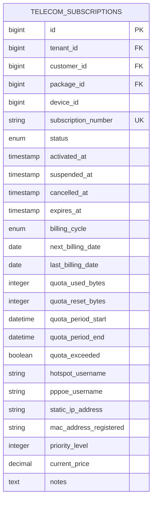

**Diagram sources**
- [2026_04_04_000003_create_telecom_subscriptions_table.php:13-33](file://database/migrations/2026_04_04_000003_create_telecom_subscriptions_table.php#L13-L33)

**Section sources**
- [2026_04_04_000003_create_telecom_subscriptions_table.php:13-33](file://database/migrations/2026_04_04_000003_create_telecom_subscriptions_table.php#L13-L33)

## Dependency Analysis
The telecom billing system exhibits cohesive service-layer design with clear model relationships and controller orchestration. Dependencies are primarily unidirectional, flowing from services to models and controllers to services.

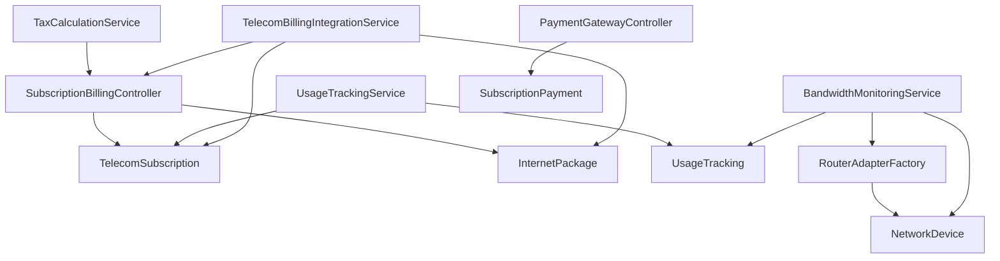

**Diagram sources**
- [TelecomBillingIntegrationService.php:1-162](file://app/Services/Telecom/TelecomBillingIntegrationService.php#L1-L162)
- [BandwidthMonitoringService.php:108-234](file://app/Services/Telecom/BandwidthMonitoringService.php#L108-L234)
- [RouterAdapterFactory.php:1-91](file://app/Services/Telecom/RouterAdapterFactory.php#L1-L91)
- [UsageTrackingService.php:62-100](file://app/Services/Telecom/UsageTrackingService.php#L62-L100)
- [SubscriptionBillingController.php:188-267](file://app/Http/Controllers/SubscriptionBillingController.php#L188-L267)
- [PaymentGatewayController.php:1-37](file://app/Http/Controllers/PaymentGatewayController.php#L1-L37)
- [SubscriptionPayment.php:1-28](file://app/Models/SubscriptionPayment.php#L1-L28)
- [TaxCalculationService.php](file://app/Services/TaxCalculationService.php)

**Section sources**
- [TelecomBillingIntegrationService.php:1-162](file://app/Services/Telecom/TelecomBillingIntegrationService.php#L1-L162)
- [BandwidthMonitoringService.php:108-234](file://app/Services/Telecom/BandwidthMonitoringService.php#L108-L234)
- [RouterAdapterFactory.php:1-91](file://app/Services/Telecom/RouterAdapterFactory.php#L1-L91)
- [UsageTrackingService.php:62-100](file://app/Services/Telecom/UsageTrackingService.php#L62-L100)
- [SubscriptionBillingController.php:188-267](file://app/Http/Controllers/SubscriptionBillingController.php#L188-L267)
- [PaymentGatewayController.php:1-37](file://app/Http/Controllers/PaymentGatewayController.php#L1-L37)
- [SubscriptionPayment.php:1-28](file://app/Models/SubscriptionPayment.php#L1-L28)
- [TaxCalculationService.php](file://app/Services/TaxCalculationService.php)

## Performance Considerations
- Batch processing: The billing service iterates over due subscriptions; consider pagination or chunking for large datasets to avoid memory pressure during invoice generation.
- Usage aggregation: UsageTrackingService performs aggregations across date ranges; ensure appropriate indexing on period_start and subscription_id for efficient queries.
- Router adapter calls: BandwidthMonitoringService may query router adapters for live usage; implement retry logic and timeouts to prevent blocking operations.
- Webhooks and notifications: Dispatching webhooks and sending notifications can be asynchronous to reduce transaction latency.
- Taxes and discounts: Centralize tax calculation and discount logic to minimize repeated computations and ensure consistency.

## Troubleshooting Guide
Common issues and resolutions:
- Unsupported router brand: RouterAdapterFactory throws exceptions for unsupported brands. Verify brand mapping and ensure the adapter class exists.
- Missing router adapter implementation: Adapter classes must extend the base RouterAdapter interface. Confirm class existence and inheritance.
- Payment gateway configuration: Payment gateway settings can be configured via the UI. Validate provider credentials, environment, and webhook secrets.
- Invoice generation failures: Review logs for failed invoice generation attempts and inspect subscription status and billing dates.
- Usage tracking discrepancies: Validate router adapter connectivity and ensure usage records are being populated correctly.

**Section sources**
- [RouterAdapterFactory.php:33-68](file://app/Services/Telecom/RouterAdapterFactory.php#L33-L68)
- [payment-gateways.blade.php:342-404](file://resources/views/settings/payment-gateways.blade.php#L342-L404)
- [TelecomBillingIntegrationService.php:142-161](file://app/Services/Telecom/TelecomBillingIntegrationService.php#L142-L161)

## Conclusion
The telecom billing integration and payment processing system provides a robust foundation for managing subscriptions, automated billing, usage-based pricing, and payment workflows. By leveraging service classes, models, and router adapter integration, the system supports recurring billing cycles, proration, promotional pricing, and discount management. The architecture enables scalability through batch processing, asynchronous notifications, and modular adapter support, while maintaining compliance through structured invoice generation and tax calculation.