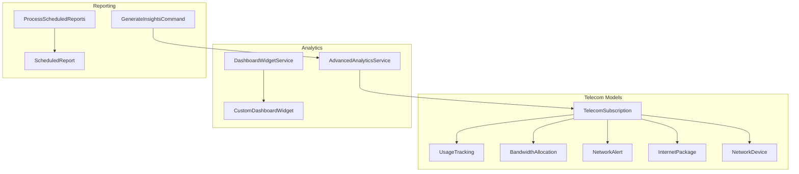
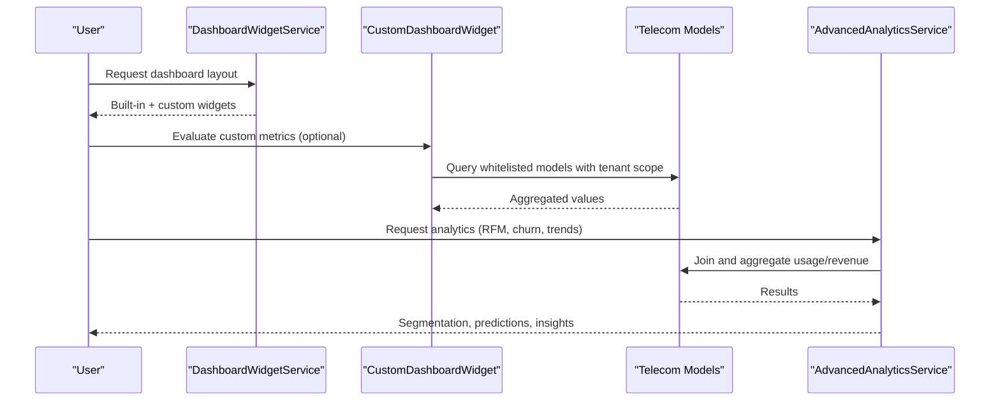
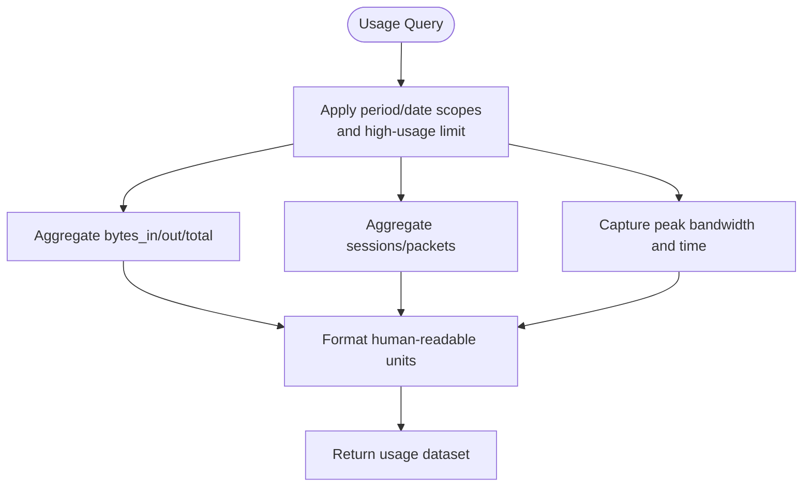
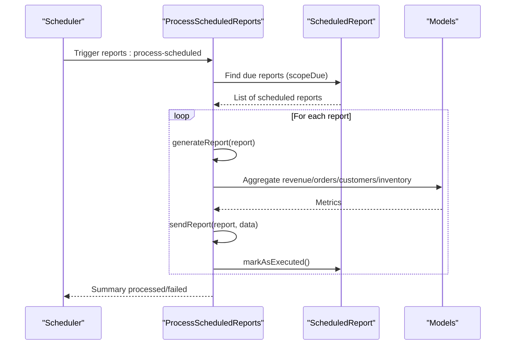
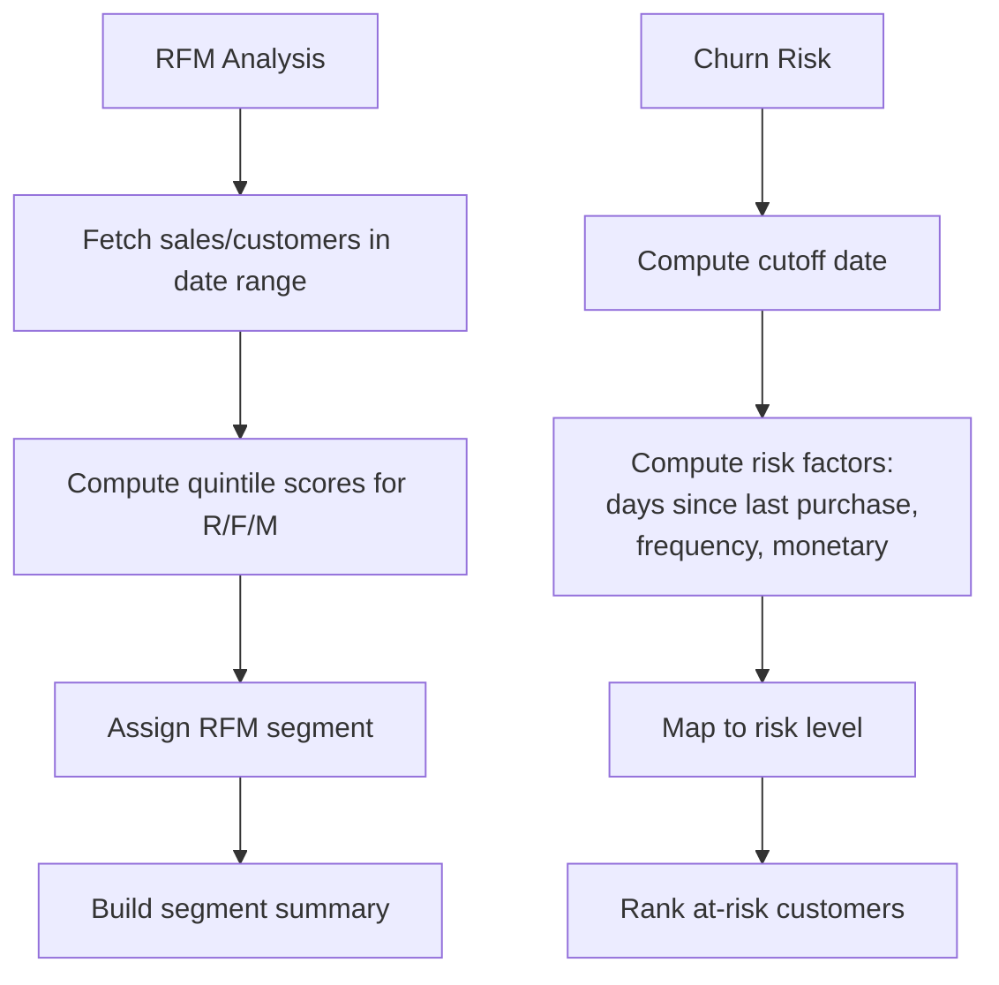
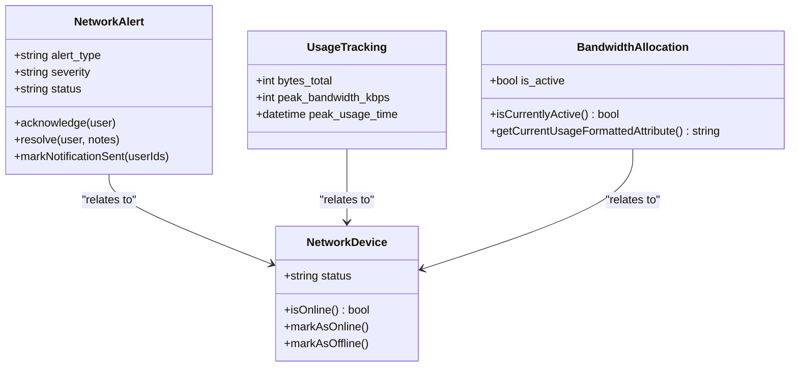
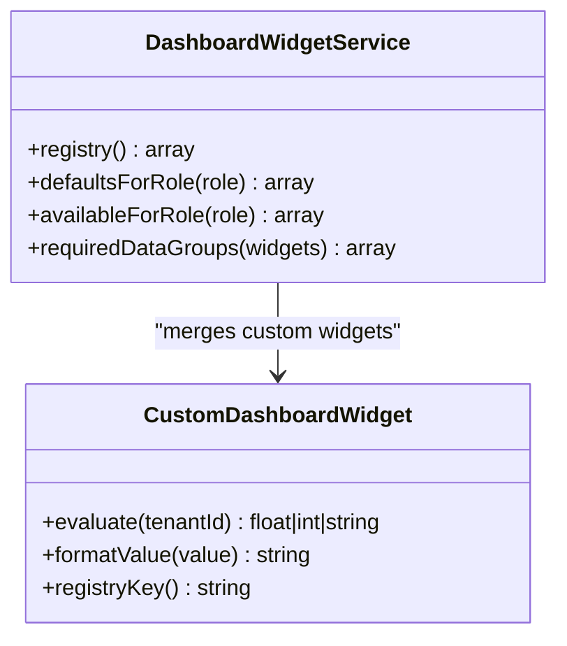
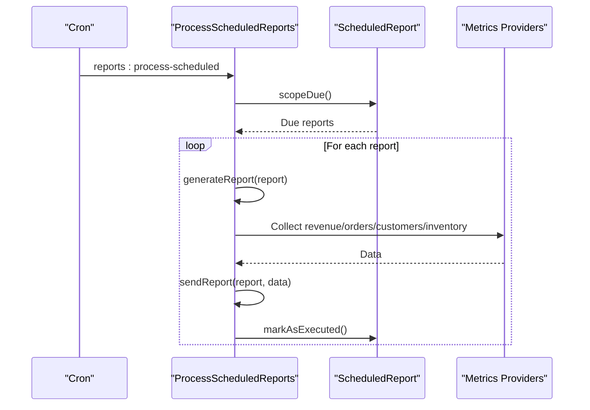
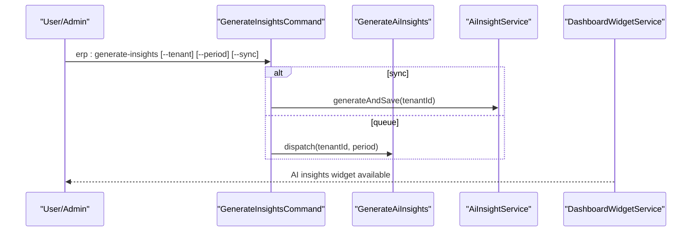
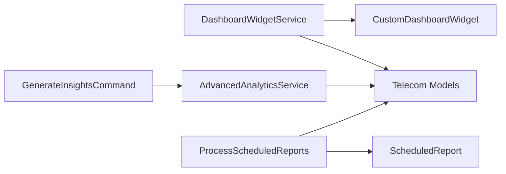

# Telecom Reporting & Analytics Dashboard

<cite>
**Referenced Files in This Document**
- [TelecomSubscription.php](file://app/Models/TelecomSubscription.php)
- [UsageTracking.php](file://app/Models/UsageTracking.php)
- [BandwidthAllocation.php](file://app/Models/BandwidthAllocation.php)
- [NetworkAlert.php](file://app/Models/NetworkAlert.php)
- [InternetPackage.php](file://app/Models/InternetPackage.php)
- [NetworkDevice.php](file://app/Models/NetworkDevice.php)
- [DashboardWidgetService.php](file://app/Services/DashboardWidgetService.php)
- [CustomDashboardWidget.php](file://app/Models/CustomDashboardWidget.php)
- [AdvancedAnalyticsService.php](file://app/Services/AdvancedAnalyticsService.php)
- [GenerateInsightsCommand.php](file://app/Console/Commands/GenerateInsightsCommand.php)
- [ProcessScheduledReports.php](file://app/Console/Commands/ProcessScheduledReports.php)
- [ScheduledReport.php](file://app/Models/ScheduledReport.php)
</cite>

## Table of Contents
1. [Introduction](#introduction)
2. [Project Structure](#project-structure)
3. [Core Components](#core-components)
4. [Architecture Overview](#architecture-overview)
5. [Detailed Component Analysis](#detailed-component-analysis)
6. [Dependency Analysis](#dependency-analysis)
7. [Performance Considerations](#performance-considerations)
8. [Troubleshooting Guide](#troubleshooting-guide)
9. [Conclusion](#conclusion)
10. [Appendices](#appendices)

## Introduction
This document describes the telecom reporting and analytics dashboard capabilities implemented in the codebase. It covers usage analytics, revenue reporting, customer segmentation, network performance metrics, and service quality indicators. It also documents real-time dashboard widgets, historical trend analysis, capacity utilization reports, customer churn prediction, and scheduled report generation. Integration touchpoints with external business intelligence tools are outlined conceptually, along with customizable report templates, data export capabilities, and compliance reporting considerations for telecommunications services.

## Project Structure
The telecom analytics domain is primarily implemented through:
- Domain models for subscriptions, usage, bandwidth allocation, network devices, and alerts
- A dashboard widget registry and custom widget engine
- Advanced analytics services for RFM, profitability, performance, churn risk, and seasonal trends
- Scheduled report processing and generation commands
- Support for tenant isolation and role-based dashboards

**Diagram sources**
- [TelecomSubscription.php:12-130](file://app/Models/TelecomSubscription.php#L12-L130)
- [UsageTracking.php:10-75](file://app/Models/UsageTracking.php#L10-L75)
- [BandwidthAllocation.php:10-81](file://app/Models/BandwidthAllocation.php#L10-L81)
- [NetworkAlert.php:10-66](file://app/Models/NetworkAlert.php#L10-L66)
- [InternetPackage.php:12-81](file://app/Models/InternetPackage.php#L12-L81)
- [NetworkDevice.php:13-113](file://app/Models/NetworkDevice.php#L13-L113)
- [DashboardWidgetService.php:15-167](file://app/Services/DashboardWidgetService.php#L15-L167)
- [CustomDashboardWidget.php:10-68](file://app/Models/CustomDashboardWidget.php#L10-L68)
- [AdvancedAnalyticsService.php:13-63](file://app/Services/AdvancedAnalyticsService.php#L13-L63)
- [ProcessScheduledReports.php:11-78](file://app/Console/Commands/ProcessScheduledReports.php#L11-L78)
- [ScheduledReport.php:8-48](file://app/Models/ScheduledReport.php#L8-L48)
- [GenerateInsightsCommand.php:22-67](file://app/Console/Commands/GenerateInsightsCommand.php#L22-L67)

**Section sources**
- [TelecomSubscription.php:12-130](file://app/Models/TelecomSubscription.php#L12-L130)
- [DashboardWidgetService.php:15-167](file://app/Services/DashboardWidgetService.php#L15-L167)
- [AdvancedAnalyticsService.php:13-63](file://app/Services/AdvancedAnalyticsService.php#L13-L63)
- [ProcessScheduledReports.php:11-78](file://app/Console/Commands/ProcessScheduledReports.php#L11-L78)

## Core Components
- TelecomSubscription: central entity for active, expired, and quota-exceeded subscriptions; supports activation/suspension/cancellation and quota reset logic.
- UsageTracking: per-period usage metrics (bytes in/out/total, packets, sessions, peak bandwidth, timestamps).
- BandwidthAllocation: device/subnet-level bandwidth limits, guarantees, priority, and time-based rules.
- NetworkAlert: severity/status-aware alerting with acknowledgment/resolution lifecycle.
- InternetPackage: plan definitions with speed tiers, quotas, rollover, and overage pricing.
- NetworkDevice: device inventory with online/offline status and hierarchical relationships.
- DashboardWidgetService: registry of built-in widgets, role-based defaults, and required data groups.
- CustomDashboardWidget: tenant-customizable widgets with safe evaluation against whitelisted models.
- AdvancedAnalyticsService: RFM segmentation, profitability matrix, employee performance, churn risk, seasonal trends.
- ProcessScheduledReports: scheduled report discovery, generation, delivery, and status tracking.
- ScheduledReport: persisted report definitions with metrics, filters, recipients, and scheduling.
- GenerateInsightsCommand: manual and queued AI insights generation per tenant and period.

**Section sources**
- [TelecomSubscription.php:12-303](file://app/Models/TelecomSubscription.php#L12-L303)
- [UsageTracking.php:10-159](file://app/Models/UsageTracking.php#L10-L159)
- [BandwidthAllocation.php:10-187](file://app/Models/BandwidthAllocation.php#L10-L187)
- [NetworkAlert.php:10-220](file://app/Models/NetworkAlert.php#L10-L220)
- [InternetPackage.php:12-147](file://app/Models/InternetPackage.php#L12-L147)
- [NetworkDevice.php:13-190](file://app/Models/NetworkDevice.php#L13-L190)
- [DashboardWidgetService.php:15-247](file://app/Services/DashboardWidgetService.php#L15-L247)
- [CustomDashboardWidget.php:10-151](file://app/Models/CustomDashboardWidget.php#L10-L151)
- [AdvancedAnalyticsService.php:13-800](file://app/Services/AdvancedAnalyticsService.php#L13-L800)
- [ProcessScheduledReports.php:11-205](file://app/Console/Commands/ProcessScheduledReports.php#L11-L205)
- [ScheduledReport.php:8-100](file://app/Models/ScheduledReport.php#L8-L100)
- [GenerateInsightsCommand.php:22-67](file://app/Console/Commands/GenerateInsightsCommand.php#L22-L67)

## Architecture Overview
The dashboard architecture integrates domain models with analytics services and a widget engine. Real-time dashboards rely on the widget registry and custom widgets. Historical analytics leverage advanced services and scheduled report processing.

**Diagram sources**
- [DashboardWidgetService.php:142-167](file://app/Services/DashboardWidgetService.php#L142-L167)
- [CustomDashboardWidget.php:58-81](file://app/Models/CustomDashboardWidget.php#L58-L81)
- [TelecomSubscription.php:102-130](file://app/Models/TelecomSubscription.php#L102-L130)
- [UsageTracking.php:64-75](file://app/Models/UsageTracking.php#L64-L75)
- [AdvancedAnalyticsService.php:68-144](file://app/Services/AdvancedAnalyticsService.php#L68-L144)

## Detailed Component Analysis

### Usage Analytics and Capacity Utilization
- UsageTracking captures per-period bytes, packets, sessions, and peak bandwidth with human-readable helpers.
- BandwidthAllocation defines max/guaranteed rates, priority, and time-based activation rules; includes formatted current usage.
- TelecomSubscription encapsulates quota usage and reset cycles, supporting “quota exceeded” checks.

**Diagram sources**
- [UsageTracking.php:139-159](file://app/Models/UsageTracking.php#L139-L159)
- [UsageTracking.php:123-134](file://app/Models/UsageTracking.php#L123-L134)
- [BandwidthAllocation.php:111-129](file://app/Models/BandwidthAllocation.php#L111-L129)
- [BandwidthAllocation.php:150-162](file://app/Models/BandwidthAllocation.php#L150-L162)

**Section sources**
- [UsageTracking.php:10-159](file://app/Models/UsageTracking.php#L10-L159)
- [BandwidthAllocation.php:10-187](file://app/Models/BandwidthAllocation.php#L10-L187)
- [TelecomSubscription.php:151-203](file://app/Models/TelecomSubscription.php#L151-L203)

### Revenue Reporting and Executive Summaries
- ScheduledReport and ProcessScheduledReports orchestrate recurring revenue, orders, customers, and inventory metrics.
- Revenue data aggregation is supported via invoice totals grouped by day.

**Diagram sources**
- [ProcessScheduledReports.php:30-78](file://app/Console/Commands/ProcessScheduledReports.php#L30-L78)
- [ScheduledReport.php:58-74](file://app/Models/ScheduledReport.php#L58-L74)
- [ProcessScheduledReports.php:127-144](file://app/Console/Commands/ProcessScheduledReports.php#L127-L144)

**Section sources**
- [ProcessScheduledReports.php:11-205](file://app/Console/Commands/ProcessScheduledReports.php#L11-L205)
- [ScheduledReport.php:8-100](file://app/Models/ScheduledReport.php#L8-L100)

### Customer Segmentation and Churn Prediction
- AdvancedAnalyticsService provides RFM segmentation and churn risk prediction based on recency, frequency, and monetary metrics.
- CustomDashboardWidget enables tenant-defined KPIs for segmentation and retention targets.

**Diagram sources**
- [AdvancedAnalyticsService.php:68-144](file://app/Services/AdvancedAnalyticsService.php#L68-L144)
- [AdvancedAnalyticsService.php:297-355](file://app/Services/AdvancedAnalyticsService.php#L297-L355)
- [CustomDashboardWidget.php:58-81](file://app/Models/CustomDashboardWidget.php#L58-L81)

**Section sources**
- [AdvancedAnalyticsService.php:68-144](file://app/Services/AdvancedAnalyticsService.php#L68-L144)
- [AdvancedAnalyticsService.php:297-355](file://app/Services/AdvancedAnalyticsService.php#L297-L355)
- [CustomDashboardWidget.php:58-81](file://app/Models/CustomDashboardWidget.php#L58-L81)

### Network Performance Metrics and Service Quality Indicators
- NetworkAlert tracks severity and status, with helpers for new/acknowledged/resolved states and notification lifecycle.
- NetworkDevice maintains online/offline status and hierarchical relationships; supports password encryption/decryption.
- UsageTracking and BandwidthAllocation feed peak bandwidth and utilization thresholds.

**Diagram sources**
- [NetworkAlert.php:10-131](file://app/Models/NetworkAlert.php#L10-L131)
- [NetworkAlert.php:184-187](file://app/Models/NetworkAlert.php#L184-L187)
- [NetworkDevice.php:118-143](file://app/Models/NetworkDevice.php#L118-L143)
- [UsageTracking.php:139-159](file://app/Models/UsageTracking.php#L139-L159)
- [BandwidthAllocation.php:86-106](file://app/Models/BandwidthAllocation.php#L86-L106)
- [BandwidthAllocation.php:150-162](file://app/Models/BandwidthAllocation.php#L150-L162)

**Section sources**
- [NetworkAlert.php:10-220](file://app/Models/NetworkAlert.php#L10-L220)
- [NetworkDevice.php:13-190](file://app/Models/NetworkDevice.php#L13-L190)
- [UsageTracking.php:10-159](file://app/Models/UsageTracking.php#L10-L159)
- [BandwidthAllocation.php:10-187](file://app/Models/BandwidthAllocation.php#L10-L187)

### Real-Time Dashboard Widgets and Customization
- DashboardWidgetService defines built-in widgets, role-based defaults, and required data groups.
- CustomDashboardWidget allows tenants to define custom KPIs with safe evaluation against whitelisted models and tenant scoping.

**Diagram sources**
- [DashboardWidgetService.php:15-247](file://app/Services/DashboardWidgetService.php#L15-L247)
- [CustomDashboardWidget.php:58-151](file://app/Models/CustomDashboardWidget.php#L58-L151)

**Section sources**
- [DashboardWidgetService.php:15-247](file://app/Services/DashboardWidgetService.php#L15-L247)
- [CustomDashboardWidget.php:10-151](file://app/Models/CustomDashboardWidget.php#L10-L151)

### Automated Report Generation and Scheduled Delivery
- ProcessScheduledReports discovers due reports, generates metrics, sends notifications, and updates status.
- ScheduledReport persists report definitions, recipients, filters, and scheduling cadence.

**Diagram sources**
- [ProcessScheduledReports.php:30-78](file://app/Console/Commands/ProcessScheduledReports.php#L30-L78)
- [ScheduledReport.php:58-99](file://app/Models/ScheduledReport.php#L58-L99)

**Section sources**
- [ProcessScheduledReports.php:11-205](file://app/Console/Commands/ProcessScheduledReports.php#L11-L205)
- [ScheduledReport.php:8-100](file://app/Models/ScheduledReport.php#L8-L100)

### AI Insights and Operational KPI Tracking
- GenerateInsightsCommand supports manual and queued generation of AI insights per tenant and period.
- DashboardWidgetService includes an AI insights widget category for operational KPIs.

**Diagram sources**
- [GenerateInsightsCommand.php:31-67](file://app/Console/Commands/GenerateInsightsCommand.php#L31-L67)
- [DashboardWidgetService.php:108-116](file://app/Services/DashboardWidgetService.php#L108-L116)

**Section sources**
- [GenerateInsightsCommand.php:22-67](file://app/Console/Commands/GenerateInsightsCommand.php#L22-L67)
- [DashboardWidgetService.php:108-116](file://app/Services/DashboardWidgetService.php#L108-L116)

### Competitive Benchmarking
- AdvancedAnalyticsService includes profitability matrix and quadrant classification suitable for benchmarking product performance against peers.
- RFM segmentation supports cohort comparisons and benchmark positioning.

**Section sources**
- [AdvancedAnalyticsService.php:149-223](file://app/Services/AdvancedAnalyticsService.php#L149-L223)
- [AdvancedAnalyticsService.php:68-144](file://app/Services/AdvancedAnalyticsService.php#L68-L144)

### Data Export Capabilities and BI Integration
- The codebase includes export-related artifacts (e.g., exports under app/Exports) and scheduled report processing, indicating potential for exporting datasets to various formats and integrating with BI tools via APIs or scheduled deliveries.
- For production-grade integrations, extend scheduled report generation to produce downloadable assets and expose endpoints for BI tool consumption.

[No sources needed since this section provides general guidance]

### Compliance Reporting Considerations
- Tenant isolation is enforced via traits on models, ensuring data segregation across tenants.
- Sensitive credentials (e.g., device passwords, hotspot/PPPoE passwords) are stored encrypted and exposed via decoders, reducing risk exposure.
- Audit-friendly fields (timestamps, statuses, acknowledgments) support compliance tracing.

**Section sources**
- [TelecomSubscription.php:229-268](file://app/Models/TelecomSubscription.php#L229-L268)
- [NetworkDevice.php:148-165](file://app/Models/NetworkDevice.php#L148-L165)

## Dependency Analysis
The telecom analytics stack exhibits low coupling between widgets and analytics services, with clear model boundaries. CustomDashboardWidget enforces a whitelist of allowed models to mitigate injection risks. Scheduled reports depend on model queries and email delivery.

**Diagram sources**
- [DashboardWidgetService.php:15-247](file://app/Services/DashboardWidgetService.php#L15-L247)
- [CustomDashboardWidget.php:70-81](file://app/Models/CustomDashboardWidget.php#L70-L81)
- [AdvancedAnalyticsService.php:13-63](file://app/Services/AdvancedAnalyticsService.php#L13-L63)
- [ProcessScheduledReports.php:30-78](file://app/Console/Commands/ProcessScheduledReports.php#L30-L78)
- [ScheduledReport.php:58-99](file://app/Models/ScheduledReport.php#L58-L99)
- [GenerateInsightsCommand.php:31-56](file://app/Console/Commands/GenerateInsightsCommand.php#L31-L56)

**Section sources**
- [DashboardWidgetService.php:15-247](file://app/Services/DashboardWidgetService.php#L15-L247)
- [CustomDashboardWidget.php:70-81](file://app/Models/CustomDashboardWidget.php#L70-L81)
- [AdvancedAnalyticsService.php:13-63](file://app/Services/AdvancedAnalyticsService.php#L13-L63)
- [ProcessScheduledReports.php:30-78](file://app/Console/Commands/ProcessScheduledReports.php#L30-L78)
- [ScheduledReport.php:58-99](file://app/Models/ScheduledReport.php#L58-L99)
- [GenerateInsightsCommand.php:31-56](file://app/Console/Commands/GenerateInsightsCommand.php#L31-L56)

## Performance Considerations
- Prefer scoped queries with date ranges and limits (e.g., UsageTracking high usage, TelecomSubscription expiring soon) to avoid heavy scans.
- Use aggregated metrics and precomputed attributes (human-readable formatting) to reduce client-side computation.
- Batch scheduled report processing and offload heavy analytics to queues to prevent blocking.
- Index frequently filtered columns (e.g., tenant_id, status, dates) to improve query performance.

[No sources needed since this section provides general guidance]

## Troubleshooting Guide
- Alerts not updating: verify NetworkAlert status transitions and acknowledgment/resolution flows.
- Devices marked offline: confirm last_seen_at updates and status transitions in NetworkDevice.
- Quota not resetting: inspect TelecomSubscription reset logic and package quota period mapping.
- Scheduled reports failing: review ProcessScheduledReports error logging and ScheduledReport failure markers.
- Custom widget errors: ensure model_class is whitelisted and where_conditions are sanitized.

**Section sources**
- [NetworkAlert.php:111-131](file://app/Models/NetworkAlert.php#L111-L131)
- [NetworkDevice.php:126-143](file://app/Models/NetworkDevice.php#L126-L143)
- [TelecomSubscription.php:195-203](file://app/Models/TelecomSubscription.php#L195-L203)
- [ProcessScheduledReports.php:62-70](file://app/Console/Commands/ProcessScheduledReports.php#L62-L70)
- [ScheduledReport.php:79-86](file://app/Models/ScheduledReport.php#L79-L86)
- [CustomDashboardWidget.php:101-109](file://app/Models/CustomDashboardWidget.php#L101-L109)

## Conclusion
The codebase provides a robust foundation for telecom reporting and analytics, including real-time dashboards, historical trend analysis, capacity utilization monitoring, customer segmentation, churn prediction, and scheduled reporting. Extending custom widgets, export formats, and BI integrations can further enhance executive visibility and compliance readiness.

[No sources needed since this section summarizes without analyzing specific files]

## Appendices
- API and UI endpoints for dashboard widgets and scheduled reports are not present in the referenced files; integrate via controllers or SPA endpoints as needed.
- Regulatory compliance can be strengthened by adding audit trails, data retention policies, and explicit export logs.

[No sources needed since this section provides general guidance]