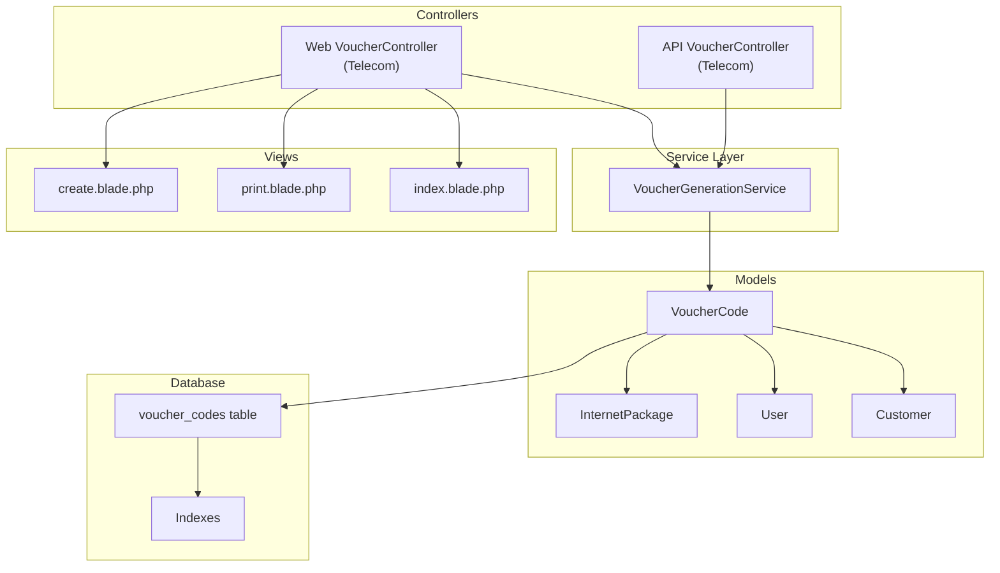
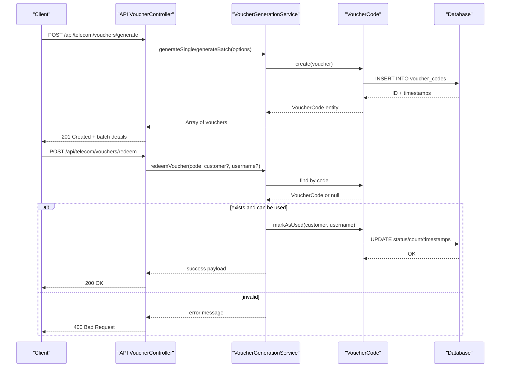
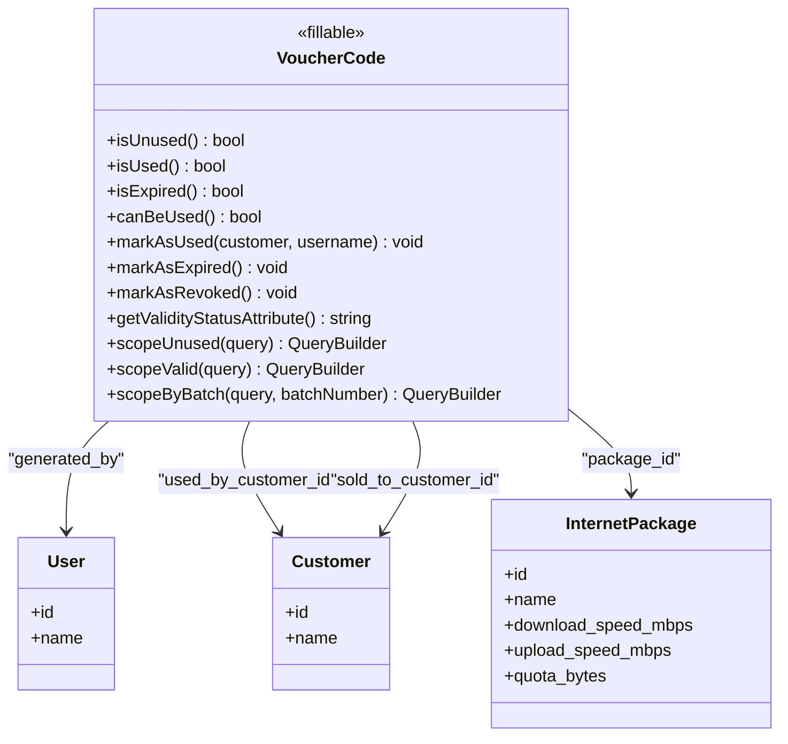
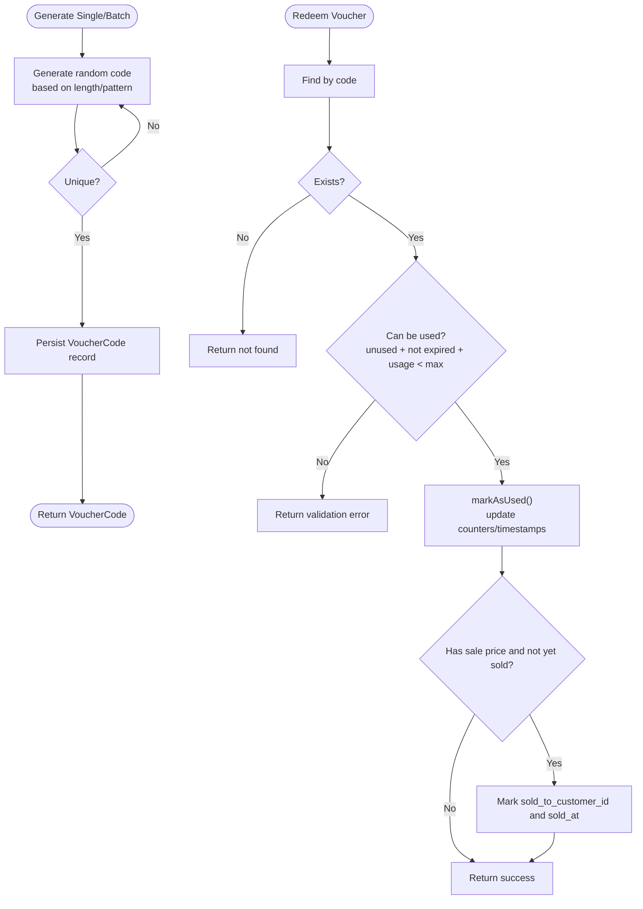
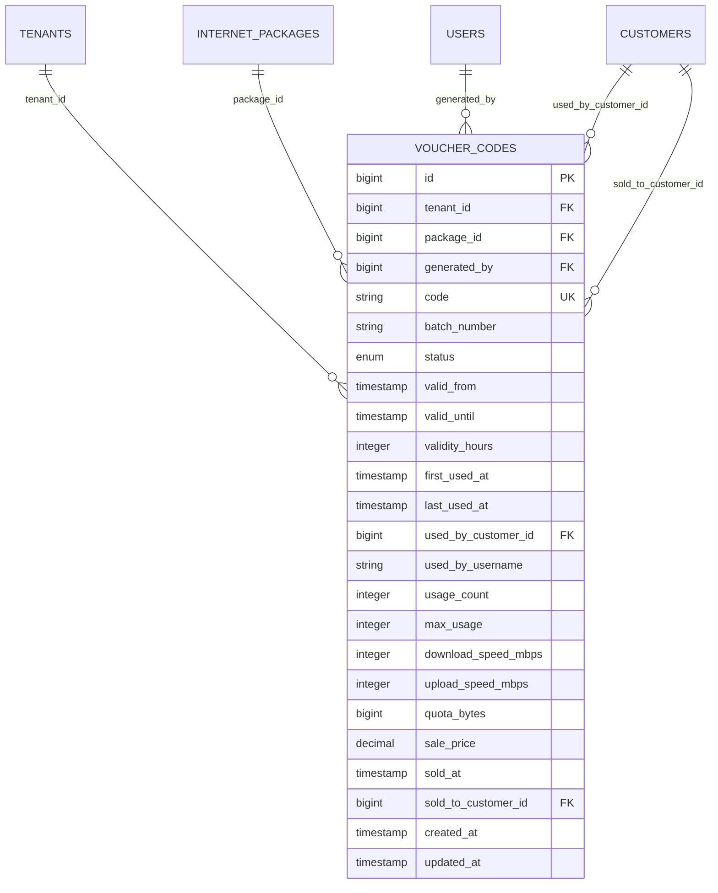
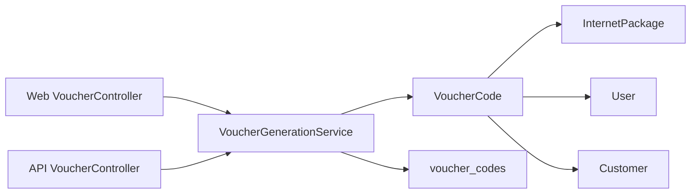

# Voucher Generation & Management System

<cite>
**Referenced Files in This Document**
- [VoucherCode.php](file://app/Models/VoucherCode.php)
- [VoucherGenerationService.php](file://app/Services/Telecom/VoucherGenerationService.php)
- [VoucherController.php (Web)](file://app/Http/Controllers/Telecom/VoucherController.php)
- [VoucherController.php (API)](file://app/Http/Controllers/Api/Telecom/VoucherController.php)
- [create_voucher.blade.php](file://resources/views/telecom/vouchers/create.blade.php)
- [print_vouchers.blade.php](file://resources/views/telecom/vouchers/print.blade.php)
- [index_vouchers.blade.php](file://resources/views/telecom/vouchers/index.blade.php)
- [create_voucher_codes_table.php](file://database/migrations/2026_04_04_000006_create_voucher_codes_table.php)
- [AnomalyDetectionService.php](file://app/Services/AnomalyDetectionService.php)
</cite>

## Table of Contents
1. [Introduction](#introduction)
2. [Project Structure](#project-structure)
3. [Core Components](#core-components)
4. [Architecture Overview](#architecture-overview)
5. [Detailed Component Analysis](#detailed-component-analysis)
6. [Dependency Analysis](#dependency-analysis)
7. [Performance Considerations](#performance-considerations)
8. [Troubleshooting Guide](#troubleshooting-guide)
9. [Conclusion](#conclusion)
10. [Appendices](#appendices)

## Introduction
This document describes the voucher generation and management system for the telecom module. It covers code generation algorithms, security token creation, activation/deactivation workflows, redemption tracking, bulk creation, branding options, expiration management, usage limits, validation mechanisms, integration with router adapters for immediate activation, real-time validation against active connections, and audit trail generation. It also documents reporting, analytics dashboards, fraud detection mechanisms, and integration with external marketing platforms for promotional campaigns.

## Project Structure
The voucher system spans models, services, controllers, Blade views, and database migrations. The web and API controllers share a common service for generation and redemption logic, while Blade templates provide admin UI for creation, printing, and analytics.

**Diagram sources**
- [VoucherController.php (Web):12-246](file://app/Http/Controllers/Telecom/VoucherController.php#L12-L246)
- [VoucherController.php (API):12-172](file://app/Http/Controllers/Api/Telecom/VoucherController.php#L12-L172)
- [VoucherGenerationService.php:12-208](file://app/Services/Telecom/VoucherGenerationService.php#L12-L208)
- [VoucherCode.php:10-224](file://app/Models/VoucherCode.php#L10-L224)
- [create_voucher_codes_table.php:13-58](file://database/migrations/2026_04_04_000006_create_voucher_codes_table.php#L13-L58)
- [create_voucher.blade.php:143-165](file://resources/views/telecom/vouchers/create.blade.php#L143-L165)
- [print_vouchers.blade.php:148-173](file://resources/views/telecom/vouchers/print.blade.php#L148-L173)
- [index_vouchers.blade.php:217-237](file://resources/views/telecom/vouchers/index.blade.php#L217-L237)

**Section sources**
- [VoucherController.php (Web):12-246](file://app/Http/Controllers/Telecom/VoucherController.php#L12-L246)
- [VoucherController.php (API):12-172](file://app/Http/Controllers/Api/Telecom/VoucherController.php#L12-L172)
- [VoucherGenerationService.php:12-208](file://app/Services/Telecom/VoucherGenerationService.php#L12-L208)
- [VoucherCode.php:10-224](file://app/Models/VoucherCode.php#L10-L224)
- [create_voucher_codes_table.php:13-58](file://database/migrations/2026_04_04_000006_create_voucher_codes_table.php#L13-L58)
- [create_voucher.blade.php:143-165](file://resources/views/telecom/vouchers/create.blade.php#L143-L165)
- [print_vouchers.blade.php:148-173](file://resources/views/telecom/vouchers/print.blade.php#L148-L173)
- [index_vouchers.blade.php:217-237](file://resources/views/telecom/vouchers/index.blade.php#L217-L237)

## Core Components
- VoucherCode model: encapsulates voucher lifecycle, validity checks, usage counters, and relations to tenant, package, user, and customer.
- VoucherGenerationService: generates single or batch codes, redeems codes, computes statistics, and enforces validation rules.
- Web VoucherController: admin UI for creation, printing, revocation, extension, and statistics.
- API VoucherController: programmatic endpoints for generation, redemption, and stats retrieval.
- Views: create, print, and index pages for voucher management and reporting.
- Database migration: defines the voucher_codes table with indexes and foreign keys.

**Section sources**
- [VoucherCode.php:10-224](file://app/Models/VoucherCode.php#L10-L224)
- [VoucherGenerationService.php:12-208](file://app/Services/Telecom/VoucherGenerationService.php#L12-L208)
- [VoucherController.php (Web):12-246](file://app/Http/Controllers/Telecom/VoucherController.php#L12-L246)
- [VoucherController.php (API):12-172](file://app/Http/Controllers/Api/Telecom/VoucherController.php#L12-L172)
- [create_voucher_codes_table.php:13-58](file://database/migrations/2026_04_04_000006_create_voucher_codes_table.php#L13-L58)

## Architecture Overview
The system follows a layered architecture:
- Presentation: Web and API controllers expose endpoints and views.
- Application: VoucherGenerationService orchestrates business logic.
- Domain: VoucherCode model manages state and validations.
- Persistence: voucher_codes table stores all attributes with appropriate indexes.

**Diagram sources**
- [VoucherController.php (API):26-91](file://app/Http/Controllers/Api/Telecom/VoucherController.php#L26-L91)
- [VoucherGenerationService.php:21-107](file://app/Services/Telecom/VoucherGenerationService.php#L21-L107)
- [VoucherCode.php:137-174](file://app/Models/VoucherCode.php#L137-L174)

## Detailed Component Analysis

### VoucherCode Model
Responsibilities:
- Define fillable and cast attributes for numeric, datetime, and decimal fields.
- Provide scopes for filtering (unused, valid, by batch).
- Enforce validity and usage rules via helper methods.
- Update usage counters and timestamps upon redemption.

Key behaviors:
- Status transitions: unused → used, unused → expired, unused → revoked.
- Validity checks: compares current time with valid_until; supports max_usage limit.
- Relations: tenant, package, generated_by user, used/sold customers.

**Diagram sources**
- [VoucherCode.php:10-224](file://app/Models/VoucherCode.php#L10-L224)

**Section sources**
- [VoucherCode.php:10-224](file://app/Models/VoucherCode.php#L10-L224)

### VoucherGenerationService
Responsibilities:
- Generate single or batch voucher codes with configurable length and pattern.
- Redeem vouchers with validation and optional sale tracking.
- Compute statistics per tenant and optionally per batch.
- Enforce uniqueness and error messaging.

Generation algorithm:
- Select character set based on pattern (numeric, alphabetic, alphanumeric).
- Randomly select characters of fixed length.
- Ensure uniqueness by checking existing codes; recursively retry if collision occurs.

Redemption workflow:
- Locate voucher by code.
- Validate status, expiry, and usage limits.
- Mark as used; update first/last used timestamps and counters.
- Optionally mark as sold if pricing metadata exists.

Statistics computation:
- Count totals per status.
- Sum revenue where applicable.
- Compute usage rate percentage.

**Diagram sources**
- [VoucherGenerationService.php:21-107](file://app/Services/Telecom/VoucherGenerationService.php#L21-L107)
- [VoucherGenerationService.php:150-178](file://app/Services/Telecom/VoucherGenerationService.php#L150-L178)

**Section sources**
- [VoucherGenerationService.php:12-208](file://app/Services/Telecom/VoucherGenerationService.php#L12-L208)

### Web VoucherController
Responsibilities:
- Render management UI, filters, and statistics.
- Generate vouchers (single or batch) with validation and persistence.
- Print vouchers as PDF with branding.
- Revoke unused, non-expired vouchers.
- Extend validity of expired vouchers and reactivate them.

UI features:
- Batch selection and filtering by status, batch number, package, and search term.
- Stats summary and top packages by usage.
- Print selected or batched unused vouchers.

**Section sources**
- [VoucherController.php (Web):24-246](file://app/Http/Controllers/Telecom/VoucherController.php#L24-L246)
- [create_voucher.blade.php:143-165](file://resources/views/telecom/vouchers/create.blade.php#L143-L165)
- [print_vouchers.blade.php:148-173](file://resources/views/telecom/vouchers/print.blade.php#L148-L173)
- [index_vouchers.blade.php:217-237](file://resources/views/telecom/vouchers/index.blade.php#L217-L237)

### API VoucherController
Responsibilities:
- Programmatic generation, redemption, and stats retrieval.
- Validation and error handling with structured responses.
- Logging of API requests for auditability.

Endpoints:
- POST /api/telecom/vouchers/generate
- POST /api/telecom/vouchers/redeem
- GET /api/telecom/vouchers/stats

**Section sources**
- [VoucherController.php (API):26-170](file://app/Http/Controllers/Api/Telecom/VoucherController.php#L26-L170)

### Database Schema: voucher_codes
Fields and constraints:
- Identity and tenant scoping.
- Unique code, batch number, and indexes for tenant/status/batch/code.
- Status enum with defaults.
- Validity timestamps and derived validity_hours.
- Usage tracking (count, timestamps, customer/user attribution).
- Optional bandwidth overrides and pricing metadata.
- Foreign keys to tenants, internet_packages, users, and customers.

**Diagram sources**
- [create_voucher_codes_table.php:13-58](file://database/migrations/2026_04_04_000006_create_voucher_codes_table.php#L13-L58)

**Section sources**
- [create_voucher_codes_table.php:13-58](file://database/migrations/2026_04_04_000006_create_voucher_codes_table.php#L13-L58)

## Dependency Analysis
- Controllers depend on VoucherGenerationService for business logic.
- Service depends on VoucherCode model for persistence and validation.
- VoucherCode model depends on related entities (tenant, package, user, customer).
- Views depend on controller-provided data for rendering.
- Database migration defines schema and indexes for performance.

**Diagram sources**
- [VoucherController.php (Web):12-246](file://app/Http/Controllers/Telecom/VoucherController.php#L12-L246)
- [VoucherController.php (API):12-172](file://app/Http/Controllers/Api/Telecom/VoucherController.php#L12-L172)
- [VoucherGenerationService.php:12-208](file://app/Services/Telecom/VoucherGenerationService.php#L12-L208)
- [VoucherCode.php:10-224](file://app/Models/VoucherCode.php#L10-L224)
- [create_voucher_codes_table.php:13-58](file://database/migrations/2026_04_04_000006_create_voucher_codes_table.php#L13-L58)

**Section sources**
- [VoucherController.php (Web):12-246](file://app/Http/Controllers/Telecom/VoucherController.php#L12-L246)
- [VoucherController.php (API):12-172](file://app/Http/Controllers/Api/Telecom/VoucherController.php#L12-L172)
- [VoucherGenerationService.php:12-208](file://app/Services/Telecom/VoucherGenerationService.php#L12-L208)
- [VoucherCode.php:10-224](file://app/Models/VoucherCode.php#L10-L224)
- [create_voucher_codes_table.php:13-58](file://database/migrations/2026_04_04_000006_create_voucher_codes_table.php#L13-L58)

## Performance Considerations
- Indexes on tenant_id, status, batch_number, and code support efficient filtering and uniqueness checks.
- Batch generation creates records sequentially; consider batching inserts for large quantities.
- Redemption updates counters and timestamps; ensure indexes on relevant columns are maintained.
- PDF printing queries unused vouchers; apply pagination or batch filtering to avoid large result sets.

[No sources needed since this section provides general guidance]

## Troubleshooting Guide
Common issues and resolutions:
- Voucher not found during redemption: verify code spelling and tenant scoping.
- Cannot redeem due to usage limits or expiry: check status, valid_until, and max_usage.
- Uniqueness collisions during generation: the generator retries automatically; ensure database constraints remain intact.
- Revocation failure: revoked vouchers that are already used cannot be revoked.
- Extending validity: only expired vouchers can be reactivated; ensure new expiry is set appropriately.

Operational logging:
- API controller logs request metadata for auditability.
- Consider adding audit trails for sensitive actions (generation, revocation, extension).

**Section sources**
- [VoucherGenerationService.php:72-107](file://app/Services/Telecom/VoucherGenerationService.php#L72-L107)
- [VoucherController.php (Web):209-244](file://app/Http/Controllers/Telecom/VoucherController.php#L209-L244)
- [VoucherController.php (API):82-90](file://app/Http/Controllers/Api/Telecom/VoucherController.php#L82-L90)

## Conclusion
The voucher system provides a robust foundation for generating, managing, and redeeming telecom access vouchers. It supports bulk creation, flexible code generation, expiration and usage controls, and administrative tools for monitoring and reporting. Integration points for router adapters, real-time validation, and audit trails can be added to further enhance operational control and compliance.

[No sources needed since this section summarizes without analyzing specific files]

## Appendices

### Security Token Creation
- The current implementation focuses on code generation and redemption without explicit cryptographic token creation. If tokens are required for router activation, integrate a secure token library and store hashed tokens with salted random values.

[No sources needed since this section provides general guidance]

### Activation/Deactivation Workflows
- Immediate activation via router adapter: implement a webhook or API endpoint to set status to unused/expired based on router events.
- Real-time validation: query VoucherCode.canBeUsed() or VoucherCode.isExpired() before granting access.
- Audit trail: log activation attempts and outcomes for compliance.

[No sources needed since this section provides general guidance]

### Redemption Tracking
- Track usage_count, first_used_at, last_used_at, used_by_customer_id, and used_by_username.
- Enforce max_usage and validity windows to prevent abuse.

**Section sources**
- [VoucherCode.php:137-174](file://app/Models/VoucherCode.php#L137-L174)

### Bulk Voucher Creation
- Use generateBatch() to create multiple codes with shared batch_number for grouping and reporting.
- Configure code_length, code_pattern, validity_hours, max_usage, and optional sale_price.

**Section sources**
- [VoucherGenerationService.php:50-62](file://app/Services/Telecom/VoucherGenerationService.php#L50-L62)

### Custom Branding Options
- Print template supports visual customization; adjust CSS in the print view to reflect brand colors and fonts.
- Include package-specific details (speed, quota) for branded receipts.

**Section sources**
- [print_vouchers.blade.php:55-173](file://resources/views/telecom/vouchers/print.blade.php#L55-L173)

### Expiration Date Management
- valid_from and valid_until define validity windows; validity_hours provides derived duration.
- Extend validity via web controller; expired vouchers can be reactivated.

**Section sources**
- [VoucherCode.php:117-122](file://app/Models/VoucherCode.php#L117-L122)
- [VoucherController.php (Web):227-244](file://app/Http/Controllers/Telecom/VoucherController.php#L227-L244)

### Usage Limits
- max_usage enforces redemption caps; usage_count increments on successful redemption.
- Validation ensures usage_count < max_usage before allowing redemption.

**Section sources**
- [VoucherGenerationService.php:83-88](file://app/Services/Telecom/VoucherGenerationService.php#L83-L88)
- [VoucherCode.php:127-132](file://app/Models/VoucherCode.php#L127-L132)

### Validation Mechanisms
- API and web controllers validate inputs and tenant scoping.
- Service layer centralizes validation logic and returns structured errors.

**Section sources**
- [VoucherController.php (API):29-39](file://app/Http/Controllers/Api/Telecom/VoucherController.php#L29-L39)
- [VoucherController.php (Web):95-104](file://app/Http/Controllers/Telecom/VoucherController.php#L95-L104)
- [VoucherGenerationService.php:72-88](file://app/Services/Telecom/VoucherGenerationService.php#L72-L88)

### Reporting and Analytics Dashboards
- Stats endpoint aggregates counts and revenue; top packages and recent activity are computed server-side.
- Extend dashboard widgets to visualize trends and anomalies.

**Section sources**
- [VoucherController.php (Web):176-204](file://app/Http/Controllers/Telecom/VoucherController.php#L176-L204)
- [VoucherGenerationService.php:116-145](file://app/Services/Telecom/VoucherGenerationService.php#L116-L145)

### Fraud Detection Mechanisms
- Integrate anomaly detection service to flag suspicious redemption patterns (e.g., bulk redemptions outside normal hours).
- Monitor repeated failures and unusual customer behavior.

**Section sources**
- [AnomalyDetectionService.php:171-189](file://app/Services/AnomalyDetectionService.php#L171-L189)

### Integration with External Marketing Platforms
- Expose campaign-specific batch_numbers and export redemption reports for promotional campaigns.
- Provide APIs for third-party systems to trigger generation and redemption events.

[No sources needed since this section provides general guidance]