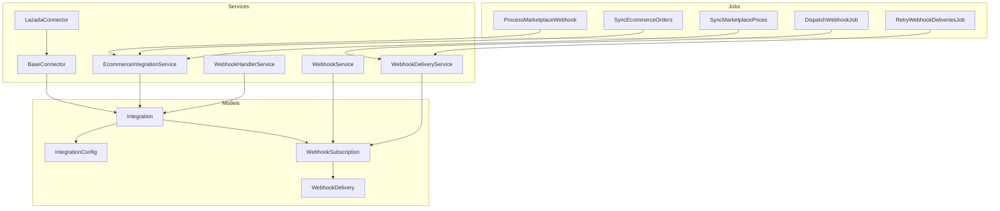
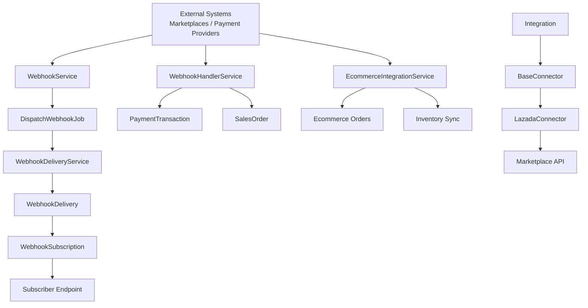
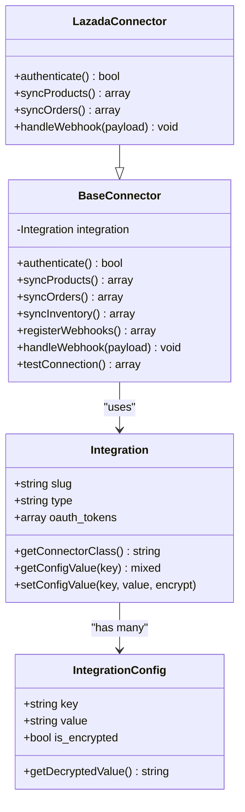
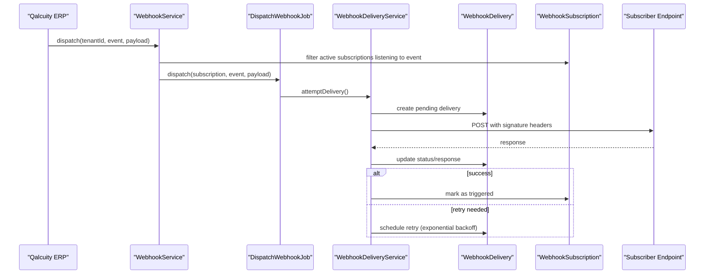
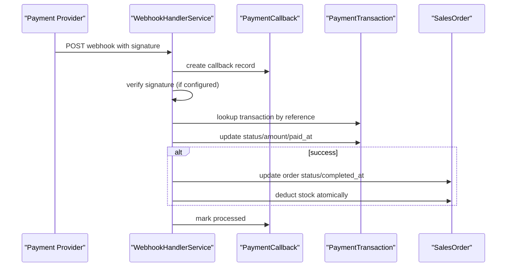
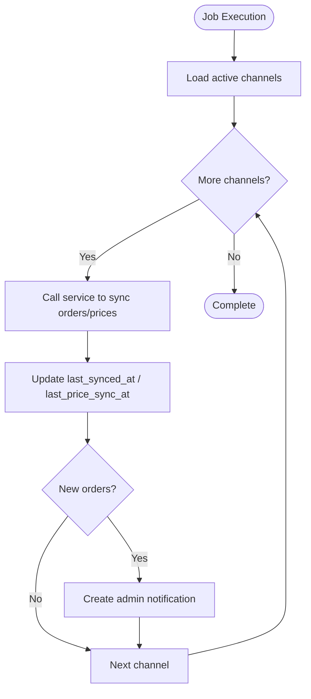
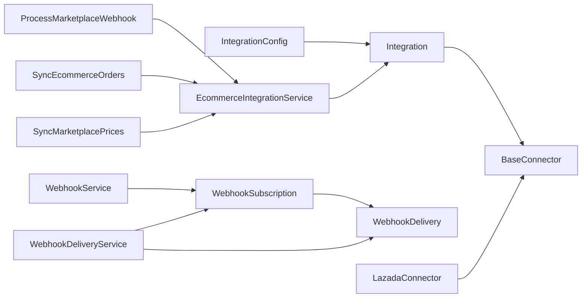

# Integration Ecosystem

<cite>
**Referenced Files in This Document**
- [Integration.php](file://app/Models/Integration.php)
- [IntegrationConfig.php](file://app/Models/IntegrationConfig.php)
- [WebhookSubscription.php](file://app/Models/WebhookSubscription.php)
- [WebhookDelivery.php](file://app/Models/WebhookDelivery.php)
- [BaseConnector.php](file://app/Services/Integrations/BaseConnector.php)
- [LazadaConnector.php](file://app/Services/Integrations/LazadaConnector.php)
- [EcommerceIntegrationService.php](file://app/Services/Integrations/EcommerceIntegrationService.php)
- [WebhookService.php](file://app/Services/WebhookService.php)
- [WebhookHandlerService.php](file://app/Services/WebhookHandlerService.php)
- [WebhookDeliveryService.php](file://app/Services/Integrations/WebhookDeliveryService.php)
- [ProcessMarketplaceWebhook.php](file://app/Jobs/ProcessMarketplaceWebhook.php)
- [SyncEcommerceOrders.php](file://app/Jobs/SyncEcommerceOrders.php)
- [SyncMarketplacePrices.php](file://app/Jobs/SyncMarketplacePrices.php)
- [DispatchWebhookJob.php](file://app/Jobs/DispatchWebhookJob.php)
- [RetryWebhookDeliveriesJob.php](file://app/Jobs/Integrations/RetryWebhookDeliveriesJob.php)
- [ProcessDeferredAmortization.php](file://app/Console/Commands/ProcessDeferredAmortization.php)
- [GenerateInsightsCommand.php](file://app/Console/Commands/GenerateInsightsCommand.php)
- [SendErpNotificationBatch.php](file://app/Jobs/SendErpNotificationBatch.php)
- [RetryFailedMarketplaceSyncs.php](file://app/Jobs/RetryFailedMarketplaceSyncs.php)
- [RetryFailedAmortization.php](file://app/Jobs/RetryFailedAmortization.php)
- [RetryFailedTelecomInvoices.php](file://app/Jobs/RetryFailedTelecomInvoices.php)
- [RetryFailedMarketplaceSyncs.php](file://app/Jobs/RetryFailedMarketplaceSyncs.php)
- [RetryFailedTelecomInvoices.php](file://app/Jobs/RetryFailedTelecomInvoices.php)
- [RetryFailedAmortization.php](file://app/Jobs/RetryFailedAmortization.php)
- [RetryWebhookDeliveriesJob.php](file://app/Jobs/Integrations/RetryWebhookDeliveriesJob.php)
- [RetryFailedMarketplaceSyncs.php](file://app/Jobs/RetryFailedMarketplaceSyncs.php)
- [RetryFailedTelecomInvoices.php](file://app/Jobs/RetryFailedTelecomInvoices.php)
- [RetryFailedAmortization.php](file://app/Jobs/RetryFailedAmortization.php)
- [RetryWebhookDeliveriesJob.php](file://app/Jobs/Integrations/RetryWebhookDeliveriesJob.php)
</cite>

## Table of Contents
1. [Introduction](#introduction)
2. [Project Structure](#project-structure)
3. [Core Components](#core-components)
4. [Architecture Overview](#architecture-overview)
5. [Detailed Component Analysis](#detailed-component-analysis)
6. [Dependency Analysis](#dependency-analysis)
7. [Performance Considerations](#performance-considerations)
8. [Troubleshooting Guide](#troubleshooting-guide)
9. [Conclusion](#conclusion)

## Introduction
This document describes Qalcuity ERP's integration ecosystem, covering marketplace integrations, third-party service connections, webhook management, and API connectors. It explains the integration framework, connector patterns, synchronization mechanisms, and operational controls such as retries, error handling, security, and monitoring. The goal is to help developers and operators understand how Qalcuity integrates with external systems and how to extend or troubleshoot the integration layer.

## Project Structure
The integration ecosystem spans models, services, jobs, and controllers that collectively enable:
- Marketplace integrations via connector classes
- Outbound webhooks to subscribers
- Inbound payment/webhook callbacks with verification
- Scheduled and queued synchronization jobs
- Idempotent processing and retry mechanisms

**Diagram sources**
- [Integration.php:1-175](file://app/Models/Integration.php#L1-L175)
- [IntegrationConfig.php:1-88](file://app/Models/IntegrationConfig.php#L1-L88)
- [WebhookSubscription.php:1-160](file://app/Models/WebhookSubscription.php#L1-L160)
- [WebhookDelivery.php:1-179](file://app/Models/WebhookDelivery.php#L1-L179)
- [BaseConnector.php:1-370](file://app/Services/Integrations/BaseConnector.php#L1-L370)
- [LazadaConnector.php:1-197](file://app/Services/Integrations/LazadaConnector.php#L1-L197)
- [EcommerceIntegrationService.php:1-252](file://app/Services/Integrations/EcommerceIntegrationService.php#L1-L252)
- [WebhookService.php:1-189](file://app/Services/WebhookService.php#L1-L189)
- [WebhookHandlerService.php:1-442](file://app/Services/WebhookHandlerService.php#L1-L442)
- [WebhookDeliveryService.php:1-369](file://app/Services/Integrations/WebhookDeliveryService.php#L1-L369)
- [ProcessMarketplaceWebhook.php:1-142](file://app/Jobs/ProcessMarketplaceWebhook.php#L1-L142)
- [SyncEcommerceOrders.php:1-98](file://app/Jobs/SyncEcommerceOrders.php#L1-L98)
- [SyncMarketplacePrices.php:1-66](file://app/Jobs/SyncMarketplacePrices.php#L1-L66)
- [DispatchWebhookJob.php](file://app/Jobs/DispatchWebhookJob.php)
- [RetryWebhookDeliveriesJob.php](file://app/Jobs/Integrations/RetryWebhookDeliveriesJob.php)

**Section sources**
- [Integration.php:1-175](file://app/Models/Integration.php#L1-L175)
- [IntegrationConfig.php:1-88](file://app/Models/IntegrationConfig.php#L1-L88)
- [WebhookSubscription.php:1-160](file://app/Models/WebhookSubscription.php#L1-L160)
- [WebhookDelivery.php:1-179](file://app/Models/WebhookDelivery.php#L1-L179)
- [BaseConnector.php:1-370](file://app/Services/Integrations/BaseConnector.php#L1-L370)
- [LazadaConnector.php:1-197](file://app/Services/Integrations/LazadaConnector.php#L1-L197)
- [EcommerceIntegrationService.php:1-252](file://app/Services/Integrations/EcommerceIntegrationService.php#L1-L252)
- [WebhookService.php:1-189](file://app/Services/WebhookService.php#L1-L189)
- [WebhookHandlerService.php:1-442](file://app/Services/WebhookHandlerService.php#L1-L442)
- [WebhookDeliveryService.php:1-369](file://app/Services/Integrations/WebhookDeliveryService.php#L1-L369)
- [ProcessMarketplaceWebhook.php:1-142](file://app/Jobs/ProcessMarketplaceWebhook.php#L1-L142)
- [SyncEcommerceOrders.php:1-98](file://app/Jobs/SyncEcommerceOrders.php#L1-L98)
- [SyncMarketplacePrices.php:1-66](file://app/Jobs/SyncMarketplacePrices.php#L1-L66)
- [DispatchWebhookJob.php](file://app/Jobs/DispatchWebhookJob.php)
- [RetryWebhookDeliveriesJob.php](file://app/Jobs/Integrations/RetryWebhookDeliveriesJob.php)

## Core Components
- Integration model: central entity representing a connection to a marketplace or service, with OAuth tokens, configuration keys, sync metadata, and helpers to load connector classes dynamically.
- IntegrationConfig: stores encrypted or plain configuration values per integration, categorized for API and sync settings.
- WebhookSubscription: defines subscriber endpoints, supported events, HMAC signatures, activation state, and event toggles.
- WebhookDelivery: tracks outbound webhook attempts, statuses, retries, and responses.
- BaseConnector: abstract foundation for marketplace connectors, providing HTTP client, rate limiting, retry logic, logging, and sync result persistence.
- LazadaConnector: concrete connector implementing product/order sync and webhook handling for Lazada.
- EcommerceIntegrationService: handles legacy or direct e-commerce platform integrations (Shopify, WooCommerce, Tokopedia) and order/inventory sync orchestration.
- WebhookService: manages outbound event dispatching, synchronous delivery, and signature generation with replay protection headers.
- WebhookHandlerService: processes inbound payment/webhook callbacks (Midtrans, Xendit), verifies signatures, updates transactions/orders, and ensures idempotency.
- WebhookDeliveryService: orchestrates asynchronous delivery with exponential backoff, retry scheduling, and delivery statistics.
- Jobs: ProcessMarketplaceWebhook, SyncEcommerceOrders, SyncMarketplacePrices, DispatchWebhookJob, RetryWebhookDeliveriesJob, and related retry jobs for marketplace and telecom amortization.

**Section sources**
- [Integration.php:1-175](file://app/Models/Integration.php#L1-L175)
- [IntegrationConfig.php:1-88](file://app/Models/IntegrationConfig.php#L1-L88)
- [WebhookSubscription.php:1-160](file://app/Models/WebhookSubscription.php#L1-L160)
- [WebhookDelivery.php:1-179](file://app/Models/WebhookDelivery.php#L1-L179)
- [BaseConnector.php:1-370](file://app/Services/Integrations/BaseConnector.php#L1-L370)
- [LazadaConnector.php:1-197](file://app/Services/Integrations/LazadaConnector.php#L1-L197)
- [EcommerceIntegrationService.php:1-252](file://app/Services/Integrations/EcommerceIntegrationService.php#L1-L252)
- [WebhookService.php:1-189](file://app/Services/WebhookService.php#L1-L189)
- [WebhookHandlerService.php:1-442](file://app/Services/WebhookHandlerService.php#L1-L442)
- [WebhookDeliveryService.php:1-369](file://app/Services/Integrations/WebhookDeliveryService.php#L1-L369)
- [ProcessMarketplaceWebhook.php:1-142](file://app/Jobs/ProcessMarketplaceWebhook.php#L1-L142)
- [SyncEcommerceOrders.php:1-98](file://app/Jobs/SyncEcommerceOrders.php#L1-L98)
- [SyncMarketplacePrices.php:1-66](file://app/Jobs/SyncMarketplacePrices.php#L1-L66)
- [DispatchWebhookJob.php](file://app/Jobs/DispatchWebhookJob.php)
- [RetryWebhookDeliveriesJob.php](file://app/Jobs/Integrations/RetryWebhookDeliveriesJob.php)

## Architecture Overview
The integration architecture combines:
- Connector pattern for marketplace APIs (BaseConnector + LazadaConnector)
- Outbound webhook delivery pipeline (WebhookService + WebhookDeliveryService + DispatchWebhookJob)
- Inbound webhook/payment callback processing (WebhookHandlerService)
- Synchronization jobs for orders/prices (SyncEcommerceOrders, SyncMarketplacePrices, ProcessMarketplaceWebhook)
- Idempotency and retry mechanisms for robust delivery and processing

**Diagram sources**
- [WebhookService.php:102-112](file://app/Services/WebhookService.php#L102-L112)
- [DispatchWebhookJob.php](file://app/Jobs/DispatchWebhookJob.php)
- [WebhookDeliveryService.php:37-53](file://app/Services/Integrations/WebhookDeliveryService.php#L37-L53)
- [WebhookDelivery.php:12-24](file://app/Models/WebhookDelivery.php#L12-L24)
- [WebhookSubscription.php:12-26](file://app/Models/WebhookSubscription.php#L12-L26)
- [WebhookHandlerService.php:24-151](file://app/Services/WebhookHandlerService.php#L24-L151)
- [EcommerceIntegrationService.php:15-50](file://app/Services/Integrations/EcommerceIntegrationService.php#L15-L50)
- [BaseConnector.php:46-52](file://app/Services/Integrations/BaseConnector.php#L46-L52)
- [LazadaConnector.php:21-27](file://app/Services/Integrations/LazadaConnector.php#L21-L27)

## Detailed Component Analysis

### Integration Framework and Connector Pattern
The connector pattern encapsulates marketplace-specific logic while sharing common infrastructure:
- BaseConnector sets up HTTP client, rate limiting, retries, logging, and sync result persistence.
- Concrete connectors (e.g., LazadaConnector) implement authentication, product/order sync, inventory sync, webhook registration, and payload handling.
- Integration model resolves the connector class dynamically using the slug, enabling extensible connector discovery.

**Diagram sources**
- [Integration.php:168-173](file://app/Models/Integration.php#L168-L173)
- [IntegrationConfig.php:41-62](file://app/Models/IntegrationConfig.php#L41-L62)
- [BaseConnector.php:18-111](file://app/Services/Integrations/BaseConnector.php#L18-L111)
- [LazadaConnector.php:15-43](file://app/Services/Integrations/LazadaConnector.php#L15-L43)

**Section sources**
- [BaseConnector.php:18-111](file://app/Services/Integrations/BaseConnector.php#L18-L111)
- [LazadaConnector.php:29-43](file://app/Services/Integrations/LazadaConnector.php#L29-L43)
- [Integration.php:168-173](file://app/Models/Integration.php#L168-L173)

### Outbound Webhook Management
Outbound webhooks are modeled and delivered as follows:
- WebhookSubscription defines endpoint URLs, events, HMAC secrets, activation, and signature verification helpers.
- WebhookDelivery tracks attempts, statuses, response codes/bodies, retry scheduling, and error messages.
- WebhookService dispatches events to subscribers and supports synchronous delivery with replay protection headers and signatures.
- WebhookDeliveryService performs asynchronous delivery with exponential backoff, retry scheduling, and statistics.

**Diagram sources**
- [WebhookService.php:102-112](file://app/Services/WebhookService.php#L102-L112)
- [DispatchWebhookJob.php](file://app/Jobs/DispatchWebhookJob.php)
- [WebhookDeliveryService.php:62-136](file://app/Services/Integrations/WebhookDeliveryService.php#L62-L136)
- [WebhookDelivery.php:12-30](file://app/Models/WebhookDelivery.php#L12-L30)
- [WebhookSubscription.php:74-88](file://app/Models/WebhookSubscription.php#L74-L88)

**Section sources**
- [WebhookSubscription.php:12-26](file://app/Models/WebhookSubscription.php#L12-L26)
- [WebhookDelivery.php:12-30](file://app/Models/WebhookDelivery.php#L12-L30)
- [WebhookService.php:102-187](file://app/Services/WebhookService.php#L102-L187)
- [WebhookDeliveryService.php:37-166](file://app/Services/Integrations/WebhookDeliveryService.php#L37-L166)

### Inbound Payment/Webhook Callback Processing
Inbound callbacks are processed securely:
- WebhookHandlerService validates signatures (when configured), prevents duplicates via idempotency, updates payment transactions, and completes sales orders with stock deduction.
- PaymentCallback records incoming payloads and processing outcomes for audit and retries.

**Diagram sources**
- [WebhookHandlerService.php:24-151](file://app/Services/WebhookHandlerService.php#L24-L151)
- [WebhookHandlerService.php:156-263](file://app/Services/WebhookHandlerService.php#L156-L263)
- [WebhookHandlerService.php:338-396](file://app/Services/WebhookHandlerService.php#L338-L396)

**Section sources**
- [WebhookHandlerService.php:24-151](file://app/Services/WebhookHandlerService.php#L24-L151)
- [WebhookHandlerService.php:156-263](file://app/Services/WebhookHandlerService.php#L156-L263)
- [WebhookHandlerService.php:338-396](file://app/Services/WebhookHandlerService.php#L338-L396)

### Synchronization Mechanisms
Synchronization jobs coordinate periodic or event-driven updates:
- SyncEcommerceOrders: iterates active channels, syncs orders, updates timestamps, and emits notifications on new orders.
- SyncMarketplacePrices: pushes price updates to enabled channels, aggregates failures, and notifies admins.
- ProcessMarketplaceWebhook: routes marketplace webhooks to appropriate handlers (orders, inventory, product) and logs reconciliation events.

**Diagram sources**
- [SyncEcommerceOrders.php:27-96](file://app/Jobs/SyncEcommerceOrders.php#L27-L96)
- [SyncMarketplacePrices.php:21-64](file://app/Jobs/SyncMarketplacePrices.php#L21-L64)
- [ProcessMarketplaceWebhook.php:22-50](file://app/Jobs/ProcessMarketplaceWebhook.php#L22-L50)

**Section sources**
- [SyncEcommerceOrders.php:27-96](file://app/Jobs/SyncEcommerceOrders.php#L27-L96)
- [SyncMarketplacePrices.php:21-64](file://app/Jobs/SyncMarketplacePrices.php#L21-L64)
- [ProcessMarketplaceWebhook.php:22-50](file://app/Jobs/ProcessMarketplaceWebhook.php#L22-L50)

### Integration Security and Authentication
Security measures include:
- OAuth token storage and rotation helpers on Integration and IntegrationConfig.
- HMAC signatures for outbound webhooks with shared secrets.
- Signature verification for inbound payment/webhook callbacks.
- Replay protection headers for outbound webhooks (timestamp, nonce).
- Idempotency checks for inbound callbacks to prevent duplicate processing.

**Section sources**
- [Integration.php:146-163](file://app/Models/Integration.php#L146-L163)
- [IntegrationConfig.php:41-62](file://app/Models/IntegrationConfig.php#L41-L62)
- [WebhookSubscription.php:74-88](file://app/Models/WebhookSubscription.php#L74-L88)
- [WebhookService.php:117-187](file://app/Services/WebhookService.php#L117-L187)
- [WebhookHandlerService.php:59-64](file://app/Services/WebhookHandlerService.php#L59-L64)
- [WebhookHandlerService.php:268-295](file://app/Services/WebhookHandlerService.php#L268-L295)

### Monitoring and Observability
Monitoring capabilities include:
- WebhookDeliveryService statistics (counts, success rates).
- IntegrationSyncLog creation via BaseConnector for sync operations.
- Notification emissions for sync errors and new orders.
- Logging of API calls, responses, and errors across connectors and services.

**Section sources**
- [WebhookDeliveryService.php:224-238](file://app/Services/Integrations/WebhookDeliveryService.php#L224-L238)
- [BaseConnector.php:220-242](file://app/Services/Integrations/BaseConnector.php#L220-L242)
- [SyncEcommerceOrders.php:56-91](file://app/Jobs/SyncEcommerceOrders.php#L56-L91)

## Dependency Analysis
The integration layer exhibits clear separation of concerns:
- Models define data contracts and relationships.
- Services encapsulate business logic and external API interactions.
- Jobs decouple long-running tasks from request lifecycle.
- Connectors depend on Integration model for configuration and OAuth tokens.

**Diagram sources**
- [Integration.php:41-59](file://app/Models/Integration.php#L41-L59)
- [IntegrationConfig.php:28-36](file://app/Models/IntegrationConfig.php#L28-L36)
- [WebhookSubscription.php:31-44](file://app/Models/WebhookSubscription.php#L31-L44)
- [WebhookDelivery.php:35-38](file://app/Models/WebhookDelivery.php#L35-L38)
- [WebhookService.php:102-112](file://app/Services/WebhookService.php#L102-L112)
- [WebhookDeliveryService.php:37-53](file://app/Services/Integrations/WebhookDeliveryService.php#L37-L53)
- [EcommerceIntegrationService.php:15-50](file://app/Services/Integrations/EcommerceIntegrationService.php#L15-L50)
- [LazadaConnector.php:21-27](file://app/Services/Integrations/LazadaConnector.php#L21-L27)
- [ProcessMarketplaceWebhook.php:22-50](file://app/Jobs/ProcessMarketplaceWebhook.php#L22-L50)
- [SyncEcommerceOrders.php:27-96](file://app/Jobs/SyncEcommerceOrders.php#L27-L96)
- [SyncMarketplacePrices.php:21-64](file://app/Jobs/SyncMarketplacePrices.php#L21-L64)

**Section sources**
- [Integration.php:41-59](file://app/Models/Integration.php#L41-L59)
- [IntegrationConfig.php:28-36](file://app/Models/IntegrationConfig.php#L28-L36)
- [WebhookSubscription.php:31-44](file://app/Models/WebhookSubscription.php#L31-L44)
- [WebhookDelivery.php:35-38](file://app/Models/WebhookDelivery.php#L35-L38)
- [WebhookService.php:102-112](file://app/Services/WebhookService.php#L102-L112)
- [WebhookDeliveryService.php:37-53](file://app/Services/Integrations/WebhookDeliveryService.php#L37-L53)
- [EcommerceIntegrationService.php:15-50](file://app/Services/Integrations/EcommerceIntegrationService.php#L15-L50)
- [LazadaConnector.php:21-27](file://app/Services/Integrations/LazadaConnector.php#L21-L27)
- [ProcessMarketplaceWebhook.php:22-50](file://app/Jobs/ProcessMarketplaceWebhook.php#L22-L50)
- [SyncEcommerceOrders.php:27-96](file://app/Jobs/SyncEcommerceOrders.php#L27-L96)
- [SyncMarketplacePrices.php:21-64](file://app/Jobs/SyncMarketplacePrices.php#L21-L64)

## Performance Considerations
- HTTP client configuration includes timeouts and retry policies to balance responsiveness and resilience.
- Rate limiting is enforced in BaseConnector to avoid provider throttling.
- Exponential backoff reduces load on downstream endpoints during failures.
- Queued jobs offload heavy work from web requests, improving latency.
- Atomic stock updates and row-level locking minimize race conditions during order completion.

[No sources needed since this section provides general guidance]

## Troubleshooting Guide
Common issues and remedies:
- Webhook delivery failures: inspect WebhookDelivery records, review response codes/bodies, and confirm retry scheduling. Use WebhookDeliveryService retry methods and monitor success rates.
- Signature verification failures: ensure correct secrets are configured and signatures are computed consistently (HMAC for inbound, HMAC-SHA256 for outbound).
- Duplicate inbound callbacks: idempotency checks prevent reprocessing; verify idempotency keys and previous callback records.
- Sync errors: review IntegrationSyncLog entries, check connector authentication, and validate API credentials and endpoints.
- Retry mechanisms: leverage retry jobs for marketplace syncs and webhook deliveries; configure max attempts and backoff delays appropriately.

**Section sources**
- [WebhookDelivery.php:72-120](file://app/Models/WebhookDelivery.php#L72-L120)
- [WebhookDeliveryService.php:143-166](file://app/Services/Integrations/WebhookDeliveryService.php#L143-L166)
- [WebhookHandlerService.php:28-43](file://app/Services/WebhookHandlerService.php#L28-L43)
- [WebhookHandlerService.php:59-64](file://app/Services/WebhookHandlerService.php#L59-L64)
- [BaseConnector.php:247-261](file://app/Services/Integrations/BaseConnector.php#L247-L261)
- [RetryWebhookDeliveriesJob.php](file://app/Jobs/Integrations/RetryWebhookDeliveriesJob.php)
- [RetryFailedMarketplaceSyncs.php](file://app/Jobs/RetryFailedMarketplaceSyncs.php)
- [RetryFailedTelecomInvoices.php](file://app/Jobs/RetryFailedTelecomInvoices.php)
- [RetryFailedAmortization.php](file://app/Jobs/RetryFailedAmortization.php)

## Conclusion
Qalcuity ERP's integration ecosystem provides a robust, extensible framework for connecting with marketplaces, payment providers, and subscribers. The connector pattern, webhook management, and synchronization jobs offer a clear path to integrate diverse third-party systems while maintaining security, reliability, and observability. Operators can extend the system by adding new connectors, configuring subscriptions, and leveraging built-in retry and monitoring capabilities.