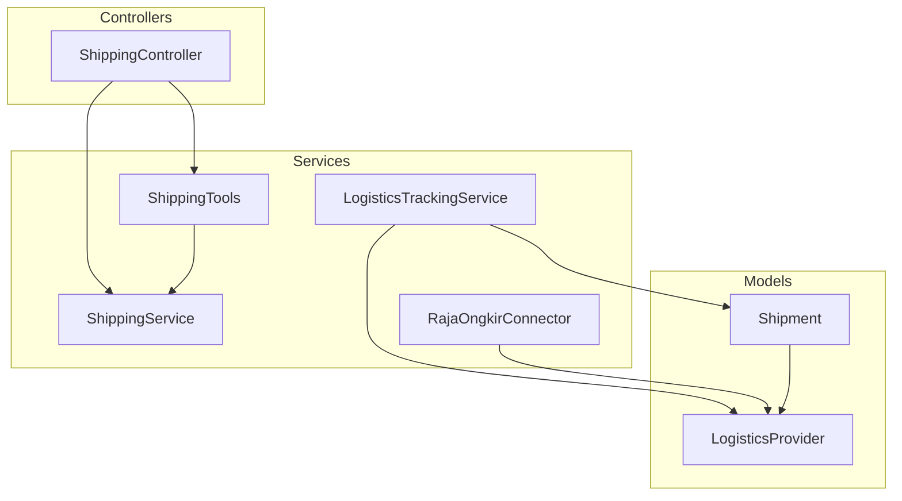
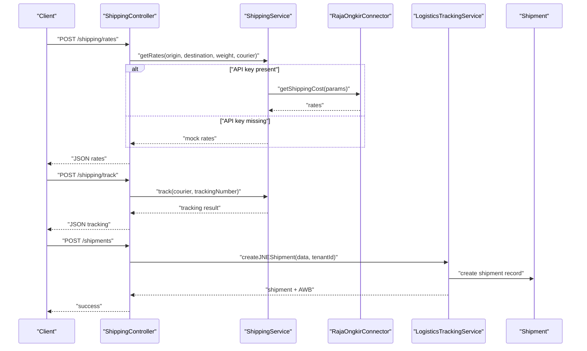
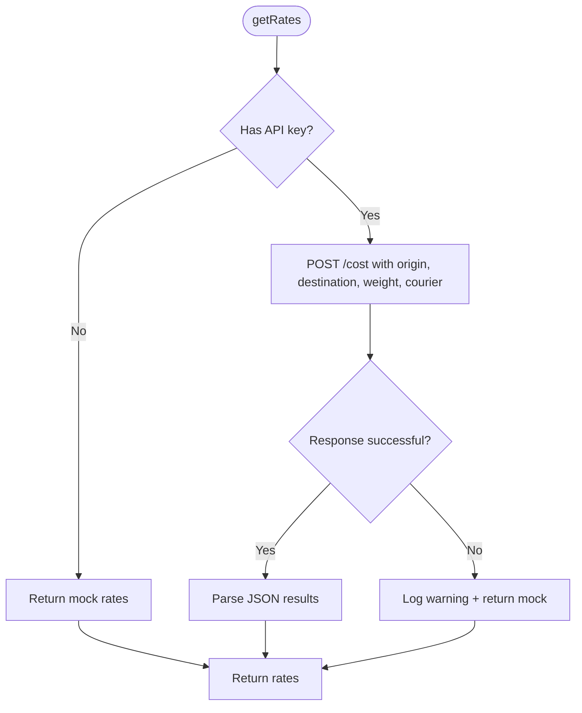
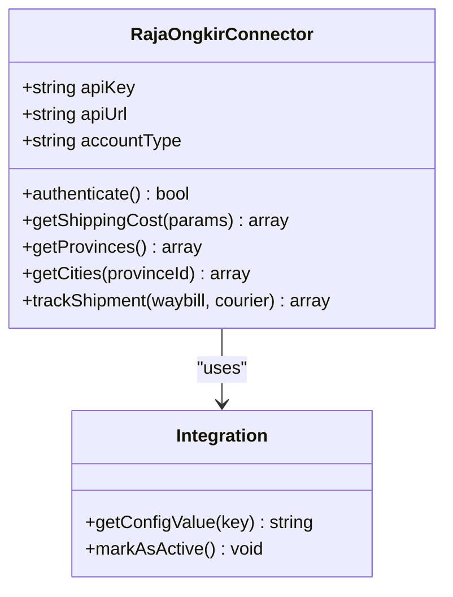
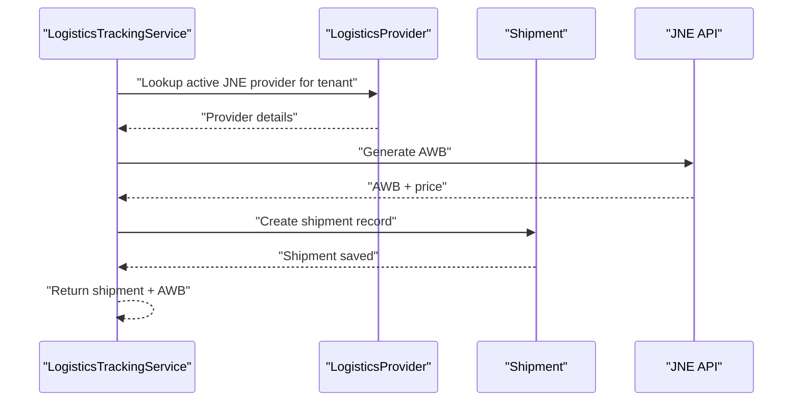
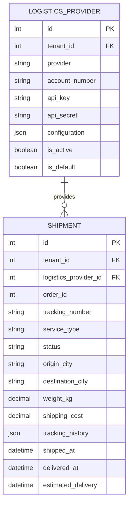
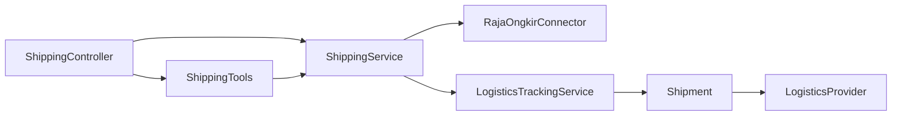

# Logistics & Tracking Integrations

<cite>
**Referenced Files in This Document**
- [ShippingService.php](file://app/Services/ShippingService.php)
- [RajaOngkirConnector.php](file://app/Services/Integrations/RajaOngkirConnector.php)
- [LogisticsTrackingService.php](file://app/Services/Integrations/LogisticsTrackingService.php)
- [Shipment.php](file://app/Models/Shipment.php)
- [LogisticsProvider.php](file://app/Models/LogisticsProvider.php)
- [ShippingController.php](file://app/Http/Controllers/ShippingController.php)
- [ShippingTools.php](file://app/Services/ERP/ShippingTools.php)
- [ConsignmentShipment.php](file://app/Models/ConsignmentShipment.php)
</cite>

## Table of Contents
1. [Introduction](#introduction)
2. [Project Structure](#project-structure)
3. [Core Components](#core-components)
4. [Architecture Overview](#architecture-overview)
5. [Detailed Component Analysis](#detailed-component-analysis)
6. [Dependency Analysis](#dependency-analysis)
7. [Performance Considerations](#performance-considerations)
8. [Troubleshooting Guide](#troubleshooting-guide)
9. [Conclusion](#conclusion)
10. [Appendices](#appendices)

## Introduction
This document explains the logistics and shipping integration capabilities implemented in the system. It covers:
- Shipping rate calculation via RajaOngkir and third-party providers
- Shipment tracking across multiple logistics providers
- Shipment lifecycle management and status synchronization
- Integration with major logistics providers (Indonesian couriers)
- Automated shipping label generation and manifest creation
- Examples for configuring providers, handling notifications, and managing return shipping processes
- Guidance on shipping cost optimization, tracking accuracy, and integration troubleshooting

## Project Structure
The logistics and tracking features are organized around three primary areas:
- Provider integrations: RajaOngkir connector and provider-specific tracking/logistic services
- Domain models: Shipment and LogisticsProvider entities
- Application services: ShippingService, LogisticsTrackingService, and ERP tooling

**Diagram sources**
- [ShippingController.php:10-80](file://app/Http/Controllers/ShippingController.php#L10-L80)
- [ShippingService.php:8-144](file://app/Services/ShippingService.php#L8-L144)
- [LogisticsTrackingService.php:10-191](file://app/Services/Integrations/LogisticsTrackingService.php#L10-L191)
- [RajaOngkirConnector.php:17-205](file://app/Services/Integrations/RajaOngkirConnector.php#L17-L205)
- [Shipment.php:10-49](file://app/Models/Shipment.php#L10-L49)
- [LogisticsProvider.php:10-40](file://app/Models/LogisticsProvider.php#L10-L40)

**Section sources**
- [ShippingController.php:10-80](file://app/Http/Controllers/ShippingController.php#L10-L80)
- [ShippingService.php:8-144](file://app/Services/ShippingService.php#L8-L144)
- [LogisticsTrackingService.php:10-191](file://app/Services/Integrations/LogisticsTrackingService.php#L10-L191)
- [RajaOngkirConnector.php:17-205](file://app/Services/Integrations/RajaOngkirConnector.php#L17-L205)
- [Shipment.php:10-49](file://app/Models/Shipment.php#L10-L49)
- [LogisticsProvider.php:10-40](file://app/Models/LogisticsProvider.php#L10-L40)

## Core Components
- ShippingService: Provides unified access to shipping rate calculation and tracking using RajaOngkir tiers and fallbacks.
- RajaOngkirConnector: A provider-specific connector for RajaOngkir with caching, authentication, and province/city lookup.
- LogisticsTrackingService: Manages shipment creation, tracking, and cost estimation for multiple providers (JNE, J&T, SiCepat).
- Shipment model: Central entity capturing shipment metadata, status, and tracking history.
- LogisticsProvider model: Stores provider credentials and configuration per tenant.
- ShippingController: HTTP entry points for rate checking, tracking, and shipment creation.
- ShippingTools: ERP tooling exposing standardized functions for rate checks, tracking, and shipment listing.

**Section sources**
- [ShippingService.php:8-144](file://app/Services/ShippingService.php#L8-L144)
- [RajaOngkirConnector.php:17-205](file://app/Services/Integrations/RajaOngkirConnector.php#L17-L205)
- [LogisticsTrackingService.php:10-191](file://app/Services/Integrations/LogisticsTrackingService.php#L10-L191)
- [Shipment.php:10-49](file://app/Models/Shipment.php#L10-L49)
- [LogisticsProvider.php:10-40](file://app/Models/LogisticsProvider.php#L10-L40)
- [ShippingController.php:10-80](file://app/Http/Controllers/ShippingController.php#L10-L80)
- [ShippingTools.php:8-82](file://app/Services/ERP/ShippingTools.php#L8-L82)

## Architecture Overview
The system integrates with RajaOngkir and provider-specific APIs to calculate rates, generate labels, and track packages. It supports caching for performance and graceful fallbacks when API keys are missing.

**Diagram sources**
- [ShippingController.php:24-78](file://app/Http/Controllers/ShippingController.php#L24-L78)
- [ShippingService.php:28-91](file://app/Services/ShippingService.php#L28-L91)
- [RajaOngkirConnector.php:57-103](file://app/Services/Integrations/RajaOngkirConnector.php#L57-L103)
- [LogisticsTrackingService.php:15-59](file://app/Services/Integrations/LogisticsTrackingService.php#L15-L59)
- [Shipment.php:14-38](file://app/Models/Shipment.php#L14-L38)

## Detailed Component Analysis

### ShippingService (RajaOngkir)
Responsibilities:
- Select base URL based on account tier (starter/basic/pro)
- Calculate shipping rates with fallback to mock rates when API key is absent
- Track shipments (Pro tier only)
- Fetch provinces and cities

Key behaviors:
- Uses HTTP client with timeouts and structured error logging
- Converts weight to grams and normalizes courier codes
- Returns structured results for rates and tracking

**Diagram sources**
- [ShippingService.php:28-60](file://app/Services/ShippingService.php#L28-L60)

**Section sources**
- [ShippingService.php:8-144](file://app/Services/ShippingService.php#L8-L144)

### RajaOngkirConnector
Responsibilities:
- Authenticate against RajaOngkir endpoints
- Retrieve provinces and cities with caching
- Calculate shipping costs with caching and error handling
- Track shipments (Pro tier) and return status/history

Key behaviors:
- Determines API URL based on account type
- Caches provinces for 24 hours and shipping costs for 1 hour
- Normalizes response data into a consistent shape

**Diagram sources**
- [RajaOngkirConnector.php:17-33](file://app/Services/Integrations/RajaOngkirConnector.php#L17-L33)
- [RajaOngkirConnector.php:35-52](file://app/Services/Integrations/RajaOngkirConnector.php#L35-L52)
- [RajaOngkirConnector.php:57-103](file://app/Services/Integrations/RajaOngkirConnector.php#L57-L103)
- [RajaOngkirConnector.php:108-153](file://app/Services/Integrations/RajaOngkirConnector.php#L108-L153)
- [RajaOngkirConnector.php:158-181](file://app/Services/Integrations/RajaOngkirConnector.php#L158-L181)

**Section sources**
- [RajaOngkirConnector.php:17-205](file://app/Services/Integrations/RajaOngkirConnector.php#L17-L205)

### LogisticsTrackingService
Responsibilities:
- Create shipments with JNE (AWB generation)
- Track shipments across JNE, J&T, and SiCepat
- Estimate shipping costs per provider
- Update shipment status and history

Key behaviors:
- Validates provider configuration before creating shipments
- Updates Shipment records with latest tracking status/history
- Provides provider-specific cost estimators

**Diagram sources**
- [LogisticsTrackingService.php:15-59](file://app/Services/Integrations/LogisticsTrackingService.php#L15-L59)
- [LogisticsProvider.php:14-29](file://app/Models/LogisticsProvider.php#L14-L29)
- [Shipment.php:14-38](file://app/Models/Shipment.php#L14-L38)

**Section sources**
- [LogisticsTrackingService.php:10-191](file://app/Services/Integrations/LogisticsTrackingService.php#L10-L191)
- [LogisticsProvider.php:10-40](file://app/Models/LogisticsProvider.php#L10-L40)
- [Shipment.php:10-49](file://app/Models/Shipment.php#L10-L49)

### Shipment and LogisticsProvider Models
Shipment captures:
- Tenant scoping, provider linkage, order association
- Origin/destination, weight, service type, shipping cost
- Status, tracking number, tracking history, timestamps

LogisticsProvider captures:
- Tenant-scoped provider credentials and configuration
- Active/default flags for provider selection

**Diagram sources**
- [Shipment.php:14-38](file://app/Models/Shipment.php#L14-L38)
- [LogisticsProvider.php:14-29](file://app/Models/LogisticsProvider.php#L14-L29)

**Section sources**
- [Shipment.php:10-49](file://app/Models/Shipment.php#L10-L49)
- [LogisticsProvider.php:10-40](file://app/Models/LogisticsProvider.php#L10-L40)

### ShippingController
Endpoints:
- GET /shipments: Paginate tenant’s shipments
- POST /shipping/rates: Validate and compute rates
- POST /shipping/track: Validate and fetch tracking
- POST /shipments: Create shipment record

Validation and responses are straightforward, delegating business logic to services.

**Section sources**
- [ShippingController.php:14-78](file://app/Http/Controllers/ShippingController.php#L14-L78)

### ShippingTools (ERP Tooling)
Defines standardized functions for external systems:
- check_shipping_rate: Validates and computes rates
- track_shipment: Tracks by courier and tracking number
- list_shipments: Lists tenant’s shipments with optional status filter

**Section sources**
- [ShippingTools.php:8-82](file://app/Services/ERP/ShippingTools.php#L8-L82)

### ConsignmentShipment
Supports consignment workflows with:
- Number generation
- Partner and warehouse linkage
- Item aggregation and remaining quantity computation

Useful for return and settlement processes in consignment scenarios.

**Section sources**
- [ConsignmentShipment.php:11-47](file://app/Models/ConsignmentShipment.php#L11-L47)

## Dependency Analysis
- Controllers depend on Services for business logic
- Services depend on Models for persistence and on external APIs for logistics data
- RajaOngkirConnector depends on Integration configuration and caches for performance
- LogisticsTrackingService depends on provider configuration and provider APIs
- Shipment model depends on LogisticsProvider for provider identity

**Diagram sources**
- [ShippingController.php:12-12](file://app/Http/Controllers/ShippingController.php#L12-L12)
- [ShippingService.php:5-7](file://app/Services/ShippingService.php#L5-L7)
- [RajaOngkirConnector.php:5-9](file://app/Services/Integrations/RajaOngkirConnector.php#L5-L9)
- [LogisticsTrackingService.php:5-8](file://app/Services/Integrations/LogisticsTrackingService.php#L5-L8)
- [Shipment.php:40-47](file://app/Models/Shipment.php#L40-L47)
- [LogisticsProvider.php:31-38](file://app/Models/LogisticsProvider.php#L31-L38)

**Section sources**
- [ShippingController.php:10-80](file://app/Http/Controllers/ShippingController.php#L10-L80)
- [ShippingService.php:8-144](file://app/Services/ShippingService.php#L8-L144)
- [RajaOngkirConnector.php:17-205](file://app/Services/Integrations/RajaOngkirConnector.php#L17-L205)
- [LogisticsTrackingService.php:10-191](file://app/Services/Integrations/LogisticsTrackingService.php#L10-L191)
- [Shipment.php:10-49](file://app/Models/Shipment.php#L10-L49)
- [LogisticsProvider.php:10-40](file://app/Models/LogisticsProvider.php#L10-L40)

## Performance Considerations
- Caching: RajaOngkirConnector caches provinces for 24 hours and shipping costs for 1 hour to reduce API calls and latency.
- Timeout and retries: HTTP requests use explicit timeouts; consider adding retry/backoff for transient failures.
- Weight normalization: Rates are computed using grams to avoid rounding errors.
- Batch operations: For high-volume shipping, batch rate queries and tracking updates to minimize network overhead.

[No sources needed since this section provides general guidance]

## Troubleshooting Guide
Common issues and resolutions:
- Missing API key:
  - Symptom: Fallback to mock rates and warnings in logs
  - Resolution: Configure RajaOngkir credentials and set account tier
- Pro-tier tracking unavailable:
  - Symptom: Tracking requires Pro tier
  - Resolution: Upgrade account tier or use alternative tracking methods
- Authentication failure:
  - Symptom: Connector marks integration inactive
  - Resolution: Verify API key and network connectivity
- Tracking updates not persisting:
  - Symptom: Shipment status/history not updated
  - Resolution: Ensure tracking endpoint returns deliver status and manifest; update logic handles unknown states gracefully
- Provider configuration errors:
  - Symptom: JNE shipment creation fails
  - Resolution: Confirm provider credentials and tenant-scoped provider records

**Section sources**
- [ShippingService.php:30-60](file://app/Services/ShippingService.php#L30-L60)
- [RajaOngkirConnector.php:35-52](file://app/Services/Integrations/RajaOngkirConnector.php#L35-L52)
- [LogisticsTrackingService.php:22-24](file://app/Services/Integrations/LogisticsTrackingService.php#L22-L24)

## Conclusion
The logistics and tracking integration provides a robust foundation for shipping operations:
- Unified rate calculation and tracking via RajaOngkir and provider connectors
- Tenant-scoped provider configuration and shipment lifecycle management
- Caching and fallback mechanisms for reliability
- Extensible design supporting additional providers and workflows

[No sources needed since this section summarizes without analyzing specific files]

## Appendices

### Configuration Examples
- RajaOngkir tier and API key:
  - Set tier and key in service configuration to select appropriate base URL and enable tracking
  - Reference: [ShippingService.php:14-23](file://app/Services/ShippingService.php#L14-L23), [RajaOngkirConnector.php:23-33](file://app/Services/Integrations/RajaOngkirConnector.php#L23-L33)
- Provider credentials:
  - Store provider credentials in LogisticsProvider and mark as active
  - Reference: [LogisticsProvider.php:14-29](file://app/Models/LogisticsProvider.php#L14-L29)
- Shipment creation:
  - Use controller endpoint or service method to create shipment records
  - Reference: [ShippingController.php:50-78](file://app/Http/Controllers/ShippingController.php#L50-L78), [LogisticsTrackingService.php:15-59](file://app/Services/Integrations/LogisticsTrackingService.php#L15-L59)

### Return Shipping Processes
- Use ConsignmentShipment for settlement and remaining quantity tracking
- Reference: [ConsignmentShipment.php:36-45](file://app/Models/ConsignmentShipment.php#L36-L45)