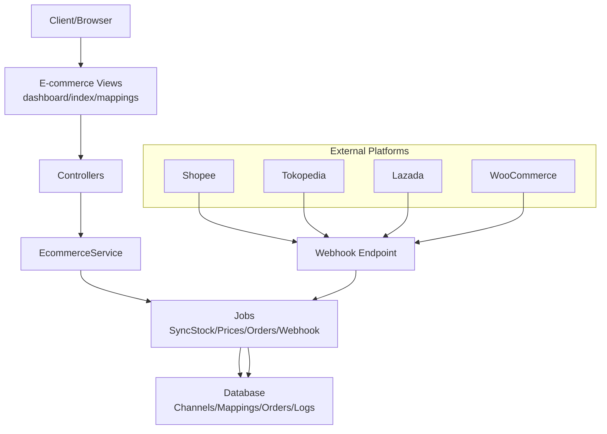
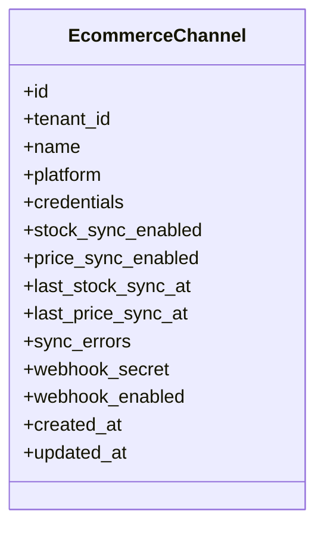
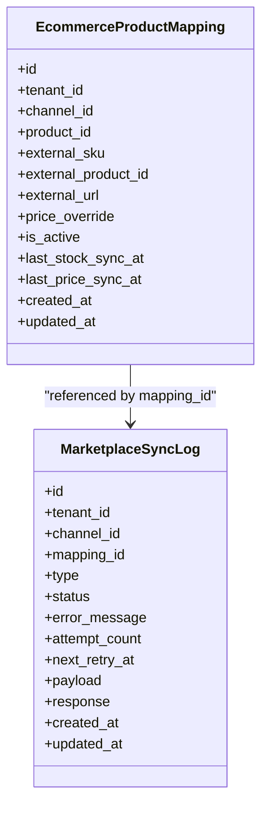
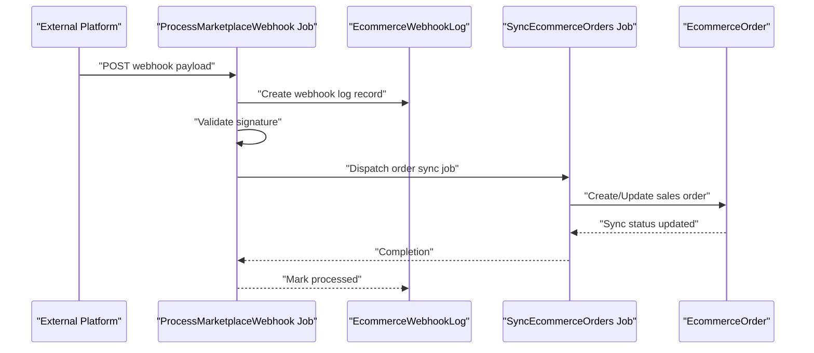
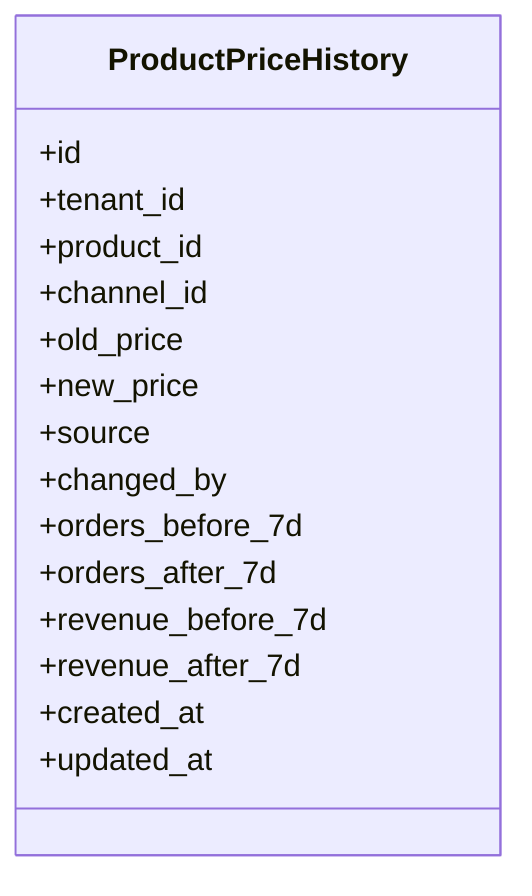
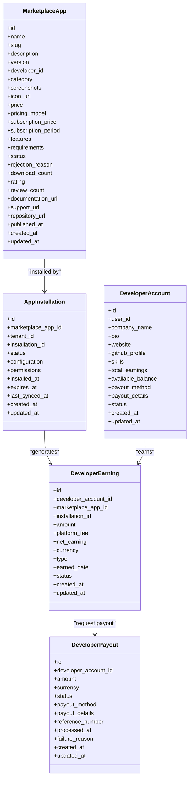
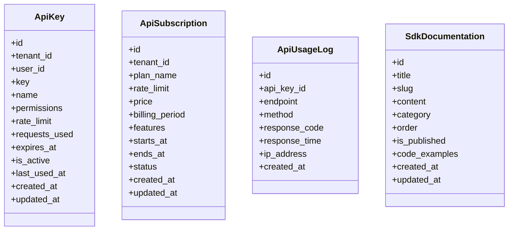
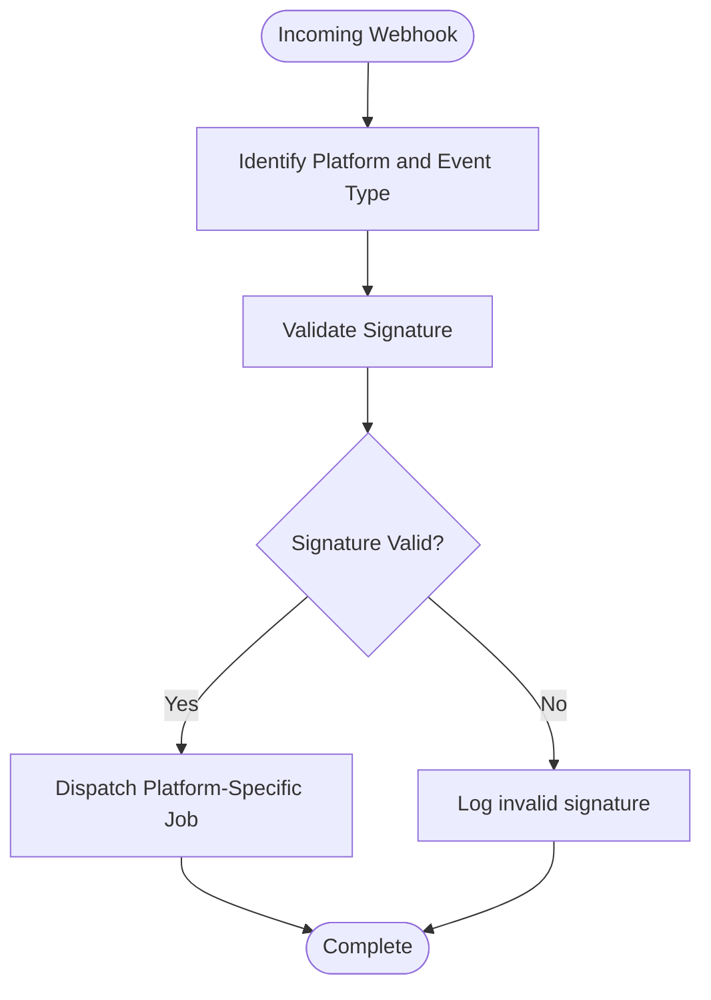
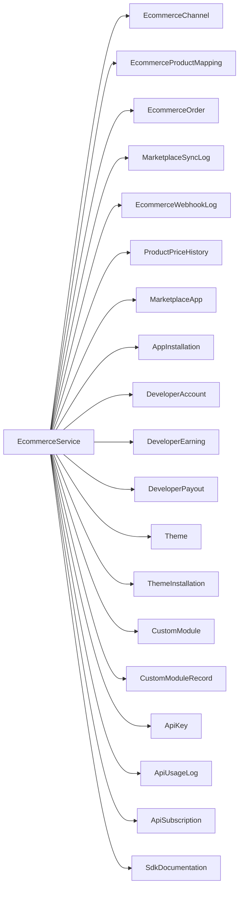

# Marketplace Integrations

<cite>
**Referenced Files in This Document**
- [2026_04_06_130000_create_marketplace_tables.php](file://database/migrations/2026_04_06_130000_create_marketplace_tables.php)
- [2026_04_02_200001_enhance_marketplace_integration.php](file://database/migrations/2026_04_02_200001_enhance_marketplace_integration.php)
- [2026_04_02_200002_marketplace_enhancement_tables.php](file://database/migrations/2026_04_02_200002_marketplace_enhancement_tables.php)
- [EcommerceService.php](file://app/Services/EcommerceService.php)
- [MarketplaceSyncService.php](file://app/Services/MarketplaceSyncService.php)
- [ProcessMarketplaceWebhook.php](file://app/Jobs/ProcessMarketplaceWebhook.php)
- [RetryFailedMarketplaceSyncs.php](file://app/Jobs/RetryFailedMarketplaceSyncs.php)
- [SyncEcommerceOrders.php](file://app/Jobs/SyncEcommerceOrders.php)
- [SyncMarketplacePrices.php](file://app/Jobs/SyncMarketplacePrices.php)
- [SyncMarketplaceStock.php](file://app/Jobs/SyncMarketplaceStock.php)
- [ecommerce-product-mapping-model.php](file://app/Models/EcommerceProductMapping.php)
- [ecommerce-channel-model.php](file://app/Models/EcommerceChannel.php)
- [ecommerce-order-model.php](file://app/Models/EcommerceOrder.php)
- [marketplace-sync-log-model.php](file://app/Models/MarketplaceSyncLog.php)
- [ecommerce-webhook-log-model.php](file://app/Models/EcommerceWebhookLog.php)
- [product-price-history-model.php](file://app/Models/ProductPriceHistory.php)
- [marketplace-app-model.php](file://app/Models/MarketplaceApp.php)
- [app-installation-model.php](file://app/Models/AppInstallation.php)
- [developer-account-model.php](file://app/Models/DeveloperAccount.php)
- [developer-earning-model.php](file://app/Models/DeveloperEarning.php)
- [developer-payout-model.php](file://app/Models/DeveloperPayout.php)
- [custom-module-model.php](file://app/Models/CustomModule.php)
- [custom-module-record-model.php](file://app/Models/CustomModuleRecord.php)
- [theme-model.php](file://app/Models/Theme.php)
- [theme-installation-model.php](file://app/Models/ThemeInstallation.php)
- [api-key-model.php](file://app/Models/ApiKey.php)
- [api-usage-log-model.php](file://app/Models/ApiUsageLog.php)
- [api-subscription-model.php](file://app/Models/ApiSubscription.php)
- [sdk-documentation-model.php](file://app/Models/SdkDocumentation.php)
- [ecommerce-orders.blade.php](file://resources/views/dashboard/widgets/ecommerce-orders.blade.php)
- [ecommerce-dashboard.blade.php](file://resources/views/ecommerce/dashboard.blade.php)
- [ecommerce-index.blade.php](file://resources/views/ecommerce/index.blade.php)
- [ecommerce-mappings.blade.php](file://resources/views/ecommerce/mappings.blade.php)
- [hotel-channels-configure.blade.php](file://resources/views/hotel/channels/configure.blade.php)
- [hotel-channels-index.blade.php](file://resources/views/hotel/channels/index.blade.php)
- [hotel-channels-logs.blade.php](file://resources/views/hotel/channels/logs.blade.php)
</cite>

## Table of Contents
1. [Introduction](#introduction)
2. [Project Structure](#project-structure)
3. [Core Components](#core-components)
4. [Architecture Overview](#architecture-overview)
5. [Detailed Component Analysis](#detailed-component-analysis)
6. [Dependency Analysis](#dependency-analysis)
7. [Performance Considerations](#performance-considerations)
8. [Troubleshooting Guide](#troubleshooting-guide)
9. [Conclusion](#conclusion)
10. [Appendices](#appendices)

## Introduction
This document describes the marketplace integration capabilities in Qalcuity ERP, focusing on e-commerce channel connectivity, product synchronization, order management, inventory updates, pricing coordination, and the marketplace monetization ecosystem. It covers the database schema supporting integrations, the services orchestrating synchronization, jobs driving background tasks, and the models representing marketplace entities. Guidance is included for configuration, sync scheduling, error handling, and troubleshooting.

## Project Structure
The marketplace integration spans migrations defining the data model, services coordinating synchronization and webhooks, jobs implementing background tasks, and models encapsulating domain entities. UI views support dashboard widgets and configuration screens for channels and marketplace apps.

```mermaid
graph TB
subgraph "Database Migrations"
M1["2026_04_06_130000_create_marketplace_tables.php"]
M2["2026_04_02_200001_enhance_marketplace_integration.php"]
M3["2026_04_02_200002_marketplace_enhancement_tables.php"]
end
subgraph "Services"
S1["EcommerceService.php"]
S2["MarketplaceSyncService.php"]
end
subgraph "Jobs"
J1["ProcessMarketplaceWebhook.php"]
J2["RetryFailedMarketplaceSyncs.php"]
J3["SyncEcommerceOrders.php"]
J4["SyncMarketplacePrices.php"]
J5["SyncMarketplaceStock.php"]
end
subgraph "Models"
MD1["EcommerceProductMapping.php"]
MD2["EcommerceChannel.php"]
MD3["EcommerceOrder.php"]
MD4["MarketplaceSyncLog.php"]
MD5["EcommerceWebhookLog.php"]
MD6["ProductPriceHistory.php"]
MD7["MarketplaceApp.php"]
MD8["AppInstallation.php"]
MD9["DeveloperAccount.php"]
MD10["DeveloperEarning.php"]
MD11["DeveloperPayout.php"]
MD12["CustomModule.php"]
MD13["CustomModuleRecord.php"]
MD14["Theme.php"]
MD15["ThemeInstallation.php"]
MD16["ApiKey.php"]
MD17["ApiUsageLog.php"]
MD18["ApiSubscription.php"]
MD19["SdkDocumentation.php"]
end
subgraph "Views"
V1["ecommerce-orders.blade.php"]
V2["ecommerce-dashboard.blade.php"]
V3["ecommerce-index.blade.php"]
V4["ecommerce-mappings.blade.php"]
V5["hotel-channels-configure.blade.php"]
V6["hotel-channels-index.blade.php"]
V7["hotel-channels-logs.blade.php"]
end
M1 --> S1
M2 --> S1
M3 --> S2
S1 --> J1
S1 --> J2
S1 --> J3
S1 --> J4
S1 --> J5
S2 --> MD4
S2 --> MD5
S2 --> MD6
S1 --> MD1
S1 --> MD2
S1 --> MD3
S1 --> MD7
S1 --> MD8
S1 --> MD9
S1 --> MD10
S1 --> MD11
S1 --> MD12
S1 --> MD13
S1 --> MD14
S1 --> MD15
S1 --> MD16
S1 --> MD17
S1 --> MD18
S1 --> MD19
V1 --> S1
V2 --> S1
V3 --> S1
V4 --> S1
V5 --> S1
V6 --> S1
V7 --> S1
```

**Diagram sources**
- [2026_04_06_130000_create_marketplace_tables.php:1-283](file://database/migrations/2026_04_06_130000_create_marketplace_tables.php#L1-L283)
- [2026_04_02_200001_enhance_marketplace_integration.php:1-73](file://database/migrations/2026_04_02_200001_enhance_marketplace_integration.php#L1-L73)
- [2026_04_02_200002_marketplace_enhancement_tables.php:1-119](file://database/migrations/2026_04_02_200002_marketplace_enhancement_tables.php#L1-L119)
- [EcommerceService.php](file://app/Services/EcommerceService.php)
- [MarketplaceSyncService.php](file://app/Services/MarketplaceSyncService.php)
- [ProcessMarketplaceWebhook.php](file://app/Jobs/ProcessMarketplaceWebhook.php)
- [RetryFailedMarketplaceSyncs.php](file://app/Jobs/RetryFailedMarketplaceSyncs.php)
- [SyncEcommerceOrders.php](file://app/Jobs/SyncEcommerceOrders.php)
- [SyncMarketplacePrices.php](file://app/Jobs/SyncMarketplacePrices.php)
- [SyncMarketplaceStock.php](file://app/Jobs/SyncMarketplaceStock.php)
- [ecommerce-product-mapping-model.php](file://app/Models/EcommerceProductMapping.php)
- [ecommerce-channel-model.php](file://app/Models/EcommerceChannel.php)
- [ecommerce-order-model.php](file://app/Models/EcommerceOrder.php)
- [marketplace-sync-log-model.php](file://app/Models/MarketplaceSyncLog.php)
- [ecommerce-webhook-log-model.php](file://app/Models/EcommerceWebhookLog.php)
- [product-price-history-model.php](file://app/Models/ProductPriceHistory.php)
- [marketplace-app-model.php](file://app/Models/MarketplaceApp.php)
- [app-installation-model.php](file://app/Models/AppInstallation.php)
- [developer-account-model.php](file://app/Models/DeveloperAccount.php)
- [developer-earning-model.php](file://app/Models/DeveloperEarning.php)
- [developer-payout-model.php](file://app/Models/DeveloperPayout.php)
- [custom-module-model.php](file://app/Models/CustomModule.php)
- [custom-module-record-model.php](file://app/Models/CustomModuleRecord.php)
- [theme-model.php](file://app/Models/Theme.php)
- [theme-installation-model.php](file://app/Models/ThemeInstallation.php)
- [api-key-model.php](file://app/Models/ApiKey.php)
- [api-usage-log-model.php](file://app/Models/ApiUsageLog.php)
- [api-subscription-model.php](file://app/Models/ApiSubscription.php)
- [sdk-documentation-model.php](file://app/Models/SdkDocumentation.php)
- [ecommerce-orders.blade.php](file://resources/views/dashboard/widgets/ecommerce-orders.blade.php)
- [ecommerce-dashboard.blade.php](file://resources/views/ecommerce/dashboard.blade.php)
- [ecommerce-index.blade.php](file://resources/views/ecommerce/index.blade.php)
- [ecommerce-mappings.blade.php](file://resources/views/ecommerce/mappings.blade.php)
- [hotel-channels-configure.blade.php](file://resources/views/hotel/channels/configure.blade.php)
- [hotel-channels-index.blade.php](file://resources/views/hotel/channels/index.blade.php)
- [hotel-channels-logs.blade.php](file://resources/views/hotel/channels/logs.blade.php)

**Section sources**
- [2026_04_06_130000_create_marketplace_tables.php:1-283](file://database/migrations/2026_04_06_130000_create_marketplace_tables.php#L1-L283)
- [2026_04_02_200001_enhance_marketplace_integration.php:1-73](file://database/migrations/2026_04_02_200001_enhance_marketplace_integration.php#L1-L73)
- [2026_04_02_200002_marketplace_enhancement_tables.php:1-119](file://database/migrations/2026_04_02_200002_marketplace_enhancement_tables.php#L1-L119)

## Core Components
- E-commerce channel management: Channels define platform connections, sync toggles, last sync timestamps, and webhook configuration.
- Product mapping: Links internal products to external SKUs and stores sync metadata and overrides.
- Order synchronization: Tracks order events and whether they were imported into sales orders.
- Webhook ingestion: Captures platform events, validates signatures, and logs processing outcomes.
- Price history: Records price changes with impact metrics around recent orders and revenue.
- Marketplace monetization: Supports third-party apps, installations, reviews, developer earnings, payouts, themes, custom modules, API keys, usage logs, subscriptions, and SDK documentation.

Key models and their roles:
- EcommerceChannel: Stores channel configuration and sync/webhook flags.
- EcommerceProductMapping: Maps internal product IDs to external identifiers and tracks last sync timestamps.
- EcommerceOrder: Represents orders from channels and sync status to sales orders.
- EcommerceWebhookLog: Logs incoming webhook events with signature validation and processing status.
- ProductPriceHistory: Tracks historical prices and related metrics.
- MarketplaceSyncLog: Centralized log for stock/price/order sync attempts and retries.
- MarketplaceApp, AppInstallation, DeveloperAccount, DeveloperEarning, DeveloperPayout: Support the marketplace app ecosystem and monetization.
- Theme, ThemeInstallation, CustomModule, CustomModuleRecord: Enable customization and module builder.
- ApiKey, ApiUsageLog, ApiSubscription, SdkDocumentation: Provide API access, rate limiting, billing, and developer resources.

**Section sources**
- [2026_04_06_130000_create_marketplace_tables.php:14-283](file://database/migrations/2026_04_06_130000_create_marketplace_tables.php#L14-L283)
- [2026_04_02_200001_enhance_marketplace_integration.php:11-72](file://database/migrations/2026_04_02_200001_enhance_marketplace_integration.php#L11-L72)
- [2026_04_02_200002_marketplace_enhancement_tables.php:14-119](file://database/migrations/2026_04_02_200002_marketplace_enhancement_tables.php#L14-L119)

## Architecture Overview
Qalcuity ERP integrates with e-commerce platforms via:
- Channel configuration and credentials stored per tenant.
- Product mapping to external SKUs with optional price overrides.
- Scheduled and event-driven synchronization:
  - Jobs trigger periodic syncs for stock, prices, and orders.
  - Webhooks process real-time events from platforms.
- Centralized logging for retries and error tracking.
- Marketplace monetization pipeline for app distribution, developer payouts, and API access.

**Diagram sources**
- [EcommerceService.php](file://app/Services/EcommerceService.php)
- [ProcessMarketplaceWebhook.php](file://app/Jobs/ProcessMarketplaceWebhook.php)
- [SyncMarketplaceStock.php](file://app/Jobs/SyncMarketplaceStock.php)
- [SyncMarketplacePrices.php](file://app/Jobs/SyncMarketplacePrices.php)
- [SyncEcommerceOrders.php](file://app/Jobs/SyncEcommerceOrders.php)
- [ecommerce-orders.blade.php](file://resources/views/dashboard/widgets/ecommerce-orders.blade.php)
- [ecommerce-dashboard.blade.php](file://resources/views/ecommerce/dashboard.blade.php)
- [ecommerce-index.blade.php](file://resources/views/ecommerce/index.blade.php)
- [ecommerce-mappings.blade.php](file://resources/views/ecommerce/mappings.blade.php)

## Detailed Component Analysis

### E-commerce Channel Management
- Purpose: Define and manage connection settings for each marketplace platform.
- Key attributes: enable/disable stock and price sync, track last successful sync timestamps, capture sync errors, and configure webhook secret and enablement.
- Integration points: Used by services to determine which channels require updates and by jobs to fetch/push data.

**Diagram sources**
- [2026_04_02_200001_enhance_marketplace_integration.php:39-52](file://database/migrations/2026_04_02_200001_enhance_marketplace_integration.php#L39-L52)
- [2026_04_02_200002_marketplace_enhancement_tables.php:85-90](file://database/migrations/2026_04_02_200002_marketplace_enhancement_tables.php#L85-L90)

**Section sources**
- [2026_04_02_200001_enhance_marketplace_integration.php:39-52](file://database/migrations/2026_04_02_200001_enhance_marketplace_integration.php#L39-L52)
- [2026_04_02_200002_marketplace_enhancement_tables.php:85-90](file://database/migrations/2026_04_02_200002_marketplace_enhancement_tables.php#L85-L90)

### Product Mapping and Synchronization
- Purpose: Maintain bidirectional mapping between internal products and external platform identifiers, track sync timestamps, and apply price overrides.
- Key attributes: tenant-scoped mapping, channel linkage, product linkage, external SKU/product ID, external URL, optional price override, activation flag, last sync timestamps.
- Synchronization logic: Jobs update stock and price based on mapping and channel settings; logs failures and retry timing.

**Diagram sources**
- [2026_04_02_200001_enhance_marketplace_integration.php:11-37](file://database/migrations/2026_04_02_200001_enhance_marketplace_integration.php#L11-L37)
- [2026_04_02_200002_marketplace_enhancement_tables.php:14-35](file://database/migrations/2026_04_02_200002_marketplace_enhancement_tables.php#L14-L35)

**Section sources**
- [2026_04_02_200001_enhance_marketplace_integration.php:11-37](file://database/migrations/2026_04_02_200001_enhance_marketplace_integration.php#L11-L37)
- [2026_04_02_200002_marketplace_enhancement_tables.php:14-35](file://database/migrations/2026_04_02_200002_marketplace_enhancement_tables.php#L14-L35)

### Order Management and Webhooks
- Purpose: Capture platform events, validate signatures, and orchestrate order creation/import into ERP.
- Webhook ingestion: Logs payload, signature, validity, and processed timestamp; supports platform and event type indexing.
- Order synchronization: Jobs poll or receive events to create/update sales orders; marks orders synced upon completion.

**Diagram sources**
- [ProcessMarketplaceWebhook.php](file://app/Jobs/ProcessMarketplaceWebhook.php)
- [SyncEcommerceOrders.php](file://app/Jobs/SyncEcommerceOrders.php)
- [ecommerce-webhook-log-model.php](file://app/Models/EcommerceWebhookLog.php)
- [ecommerce-order-model.php](file://app/Models/EcommerceOrder.php)

**Section sources**
- [2026_04_02_200002_marketplace_enhancement_tables.php:37-55](file://database/migrations/2026_04_02_200002_marketplace_enhancement_tables.php#L37-L55)
- [2026_04_02_200001_enhance_marketplace_integration.php:48-52](file://database/migrations/2026_04_02_200001_enhance_marketplace_integration.php#L48-L52)

### Pricing Coordination and History
- Purpose: Track price changes with impact metrics and support bulk/batch updates.
- Data model: Stores old/new prices, source of change, who changed it, and counts/revenue deltas around change window.

**Diagram sources**
- [2026_04_02_200002_marketplace_enhancement_tables.php:57-78](file://database/migrations/2026_04_02_200002_marketplace_enhancement_tables.php#L57-L78)

**Section sources**
- [2026_04_02_200002_marketplace_enhancement_tables.php:57-78](file://database/migrations/2026_04_02_200002_marketplace_enhancement_tables.php#L57-L78)

### Marketplace Monetization Service
- Purpose: Enable third-party developers to publish apps, manage installations, collect earnings, and handle payouts; provide themes and custom modules; expose API keys and usage analytics.
- Entities:
  - MarketplaceApp: app metadata, pricing, status, ratings.
  - AppInstallation: per-tenant installation with configuration and permissions.
  - DeveloperAccount: developer profile, balance, payout preferences.
  - DeveloperEarning: recorded earnings and platform fees.
  - DeveloperPayout: payout requests and statuses.
  - Theme and ThemeInstallation: theme distribution and activation.
  - CustomModule and CustomModuleRecord: module builder and records.
  - ApiKey, ApiUsageLog, ApiSubscription, SdkDocumentation: API access, rate limits, billing, and developer docs.

**Diagram sources**
- [2026_04_06_130000_create_marketplace_tables.php:14-134](file://database/migrations/2026_04_06_130000_create_marketplace_tables.php#L14-L134)

**Section sources**
- [2026_04_06_130000_create_marketplace_tables.php:14-134](file://database/migrations/2026_04_06_130000_create_marketplace_tables.php#L14-L134)

### Developer Integration Tools
- API Keys: per-tenant, per-user keys with permissions, rate limits, expiry, and usage tracking.
- API Subscriptions: plan-based rate limits and billing cycles.
- API Usage Logs: endpoint, method, response code/time, IP, and timestamps.
- SDK Documentation: categorized pages with code examples.

**Diagram sources**
- [2026_04_06_130000_create_marketplace_tables.php:198-259](file://database/migrations/2026_04_06_130000_create_marketplace_tables.php#L198-L259)

**Section sources**
- [2026_04_06_130000_create_marketplace_tables.php:198-259](file://database/migrations/2026_04_06_130000_create_marketplace_tables.php#L198-L259)

### Connector Implementations for Major Platforms
- Shopee, Tokopedia, Lazada, and WooCommerce are supported as platforms integrated via channel configuration and webhooks.
- Webhook logs capture platform and event type for filtering and diagnostics.
- Channel configuration enables/disables stock and price sync and stores webhook secret and enablement.

**Diagram sources**
- [ecommerce-webhook-log-model.php](file://app/Models/EcommerceWebhookLog.php)
- [ProcessMarketplaceWebhook.php](file://app/Jobs/ProcessMarketplaceWebhook.php)

**Section sources**
- [2026_04_02_200002_marketplace_enhancement_tables.php:37-55](file://database/migrations/2026_04_02_200002_marketplace_enhancement_tables.php#L37-L55)
- [2026_04_02_200001_enhance_marketplace_integration.php:39-52](file://database/migrations/2026_04_02_200001_enhance_marketplace_integration.php#L39-L52)

## Dependency Analysis
- Services depend on models and jobs to coordinate synchronization and webhook processing.
- Jobs depend on channel configuration and mapping to operate.
- Logs provide observability across the integration lifecycle.

**Diagram sources**
- [EcommerceService.php](file://app/Services/EcommerceService.php)
- [MarketplaceSyncService.php](file://app/Services/MarketplaceSyncService.php)
- [ecommerce-channel-model.php](file://app/Models/EcommerceChannel.php)
- [ecommerce-product-mapping-model.php](file://app/Models/EcommerceProductMapping.php)
- [ecommerce-order-model.php](file://app/Models/EcommerceOrder.php)
- [marketplace-sync-log-model.php](file://app/Models/MarketplaceSyncLog.php)
- [ecommerce-webhook-log-model.php](file://app/Models/EcommerceWebhookLog.php)
- [product-price-history-model.php](file://app/Models/ProductPriceHistory.php)
- [marketplace-app-model.php](file://app/Models/MarketplaceApp.php)
- [app-installation-model.php](file://app/Models/AppInstallation.php)
- [developer-account-model.php](file://app/Models/DeveloperAccount.php)
- [developer-earning-model.php](file://app/Models/DeveloperEarning.php)
- [developer-payout-model.php](file://app/Models/DeveloperPayout.php)
- [theme-model.php](file://app/Models/Theme.php)
- [theme-installation-model.php](file://app/Models/ThemeInstallation.php)
- [custom-module-model.php](file://app/Models/CustomModule.php)
- [custom-module-record-model.php](file://app/Models/CustomModuleRecord.php)
- [api-key-model.php](file://app/Models/ApiKey.php)
- [api-usage-log-model.php](file://app/Models/ApiUsageLog.php)
- [api-subscription-model.php](file://app/Models/ApiSubscription.php)
- [sdk-documentation-model.php](file://app/Models/SdkDocumentation.php)

**Section sources**
- [EcommerceService.php](file://app/Services/EcommerceService.php)
- [MarketplaceSyncService.php](file://app/Services/MarketplaceSyncService.php)

## Performance Considerations
- Indexing: Migrations define strategic indexes on channel/event/status and tenant/date combinations to speed up queries for logs, webhook processing, and price history.
- Retry scheduling: MarketplaceSyncLog includes attempt count and next retry timestamp to avoid hot loops and stagger retries.
- Background processing: Jobs decouple long-running operations (sync, webhook processing) from request threads.
- Rate limiting: API keys include rate limits and usage logs to prevent abuse and monitor consumption.

[No sources needed since this section provides general guidance]

## Troubleshooting Guide
Common issues and resolutions:
- Webhook signature validation fails:
  - Verify webhook secret matches platform configuration.
  - Check webhook logs for invalid signature entries and error messages.
- Sync job failures:
  - Inspect marketplace sync logs for error messages and next retry timestamps.
  - Confirm channel sync flags and last sync timestamps.
- Price override not applied:
  - Review product mapping for price override and activation status.
  - Check price history for recent changes and source.
- Order not imported:
  - Confirm order sync flag and that the order was marked as synced after import.
  - Review webhook logs for processing timestamps and errors.

Operational controls:
- Retry jobs for failed marketplace syncs.
- Monitor API usage logs for rate limit exhaustion.
- Validate API subscription status and plan limits.

**Section sources**
- [2026_04_02_200002_marketplace_enhancement_tables.php:14-35](file://database/migrations/2026_04_02_200002_marketplace_enhancement_tables.php#L14-L35)
- [2026_04_02_200002_marketplace_enhancement_tables.php:37-55](file://database/migrations/2026_04_02_200002_marketplace_enhancement_tables.php#L37-L55)
- [RetryFailedMarketplaceSyncs.php](file://app/Jobs/RetryFailedMarketplaceSyncs.php)
- [ecommerce-webhook-log-model.php](file://app/Models/EcommerceWebhookLog.php)
- [marketplace-sync-log-model.php](file://app/Models/MarketplaceSyncLog.php)

## Conclusion
Qalcuity ERP’s marketplace integration provides a robust foundation for connecting with major e-commerce platforms, synchronizing products and orders, managing inventory and pricing, and operating a monetization ecosystem for developers. The schema, services, jobs, and models collectively support reliable, observable, and extensible integrations with room for platform-specific connectors and enhancements.

[No sources needed since this section summarizes without analyzing specific files]

## Appendices

### Configuration Examples
- Channel configuration:
  - Enable stock and price sync flags.
  - Set webhook secret and enable webhook.
  - Configure credentials per platform.
- Product mapping:
  - Link internal product to external SKU.
  - Optionally set price override.
  - Activate mapping and review last sync timestamps.
- API keys:
  - Create per-tenant/per-user keys with permissions and rate limits.
  - Monitor usage logs and adjust subscription plans.

**Section sources**
- [2026_04_02_200001_enhance_marketplace_integration.php:39-52](file://database/migrations/2026_04_02_200001_enhance_marketplace_integration.php#L39-L52)
- [2026_04_02_200002_marketplace_enhancement_tables.php:85-90](file://database/migrations/2026_04_02_200002_marketplace_enhancement_tables.php#L85-L90)
- [2026_04_06_130000_create_marketplace_tables.php:198-259](file://database/migrations/2026_04_06_130000_create_marketplace_tables.php#L198-L259)

### Sync Frequency Settings
- Use scheduled jobs to run stock and price syncs at intervals appropriate for your volume.
- Leverage retry jobs to handle transient failures and back-off schedules.
- Monitor sync logs to tune frequencies and identify bottlenecks.

**Section sources**
- [SyncMarketplaceStock.php](file://app/Jobs/SyncMarketplaceStock.php)
- [SyncMarketplacePrices.php](file://app/Jobs/SyncMarketplacePrices.php)
- [RetryFailedMarketplaceSyncs.php](file://app/Jobs/RetryFailedMarketplaceSyncs.php)
- [marketplace-sync-log-model.php](file://app/Models/MarketplaceSyncLog.php)

### UI and Dashboards
- E-commerce dashboard widgets and listings provide visibility into orders and mappings.
- Hotel channel configuration and logs support channel management.

**Section sources**
- [ecommerce-orders.blade.php](file://resources/views/dashboard/widgets/ecommerce-orders.blade.php)
- [ecommerce-dashboard.blade.php](file://resources/views/ecommerce/dashboard.blade.php)
- [ecommerce-index.blade.php](file://resources/views/ecommerce/index.blade.php)
- [ecommerce-mappings.blade.php](file://resources/views/ecommerce/mappings.blade.php)
- [hotel-channels-configure.blade.php](file://resources/views/hotel/channels/configure.blade.php)
- [hotel-channels-index.blade.php](file://resources/views/hotel/channels/index.blade.php)
- [hotel-channels-logs.blade.php](file://resources/views/hotel/channels/logs.blade.php)