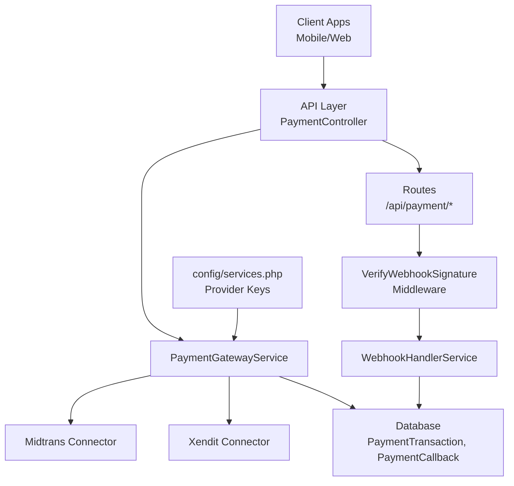
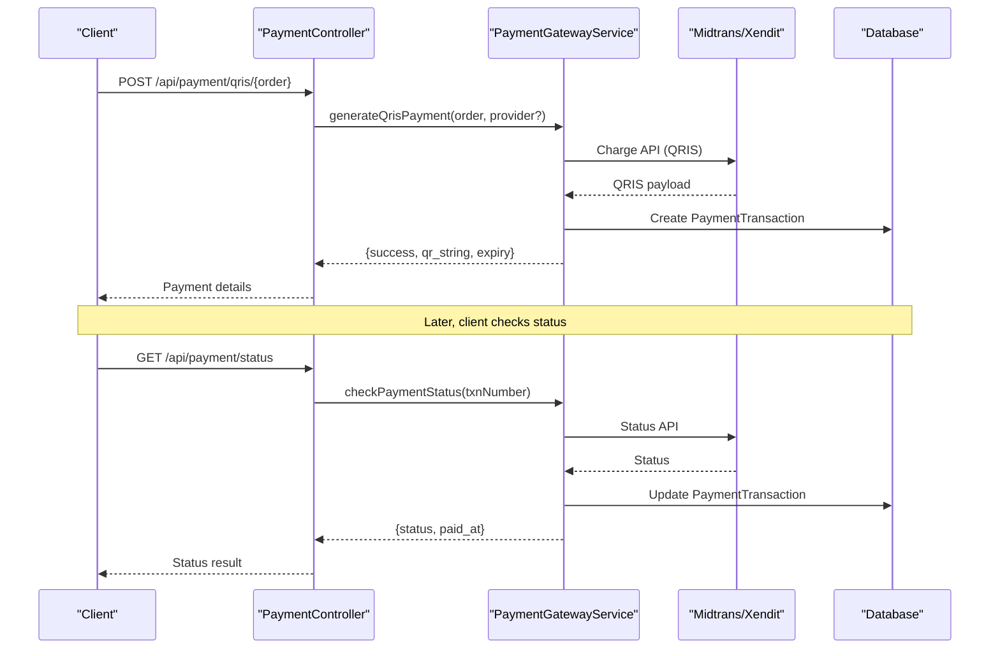
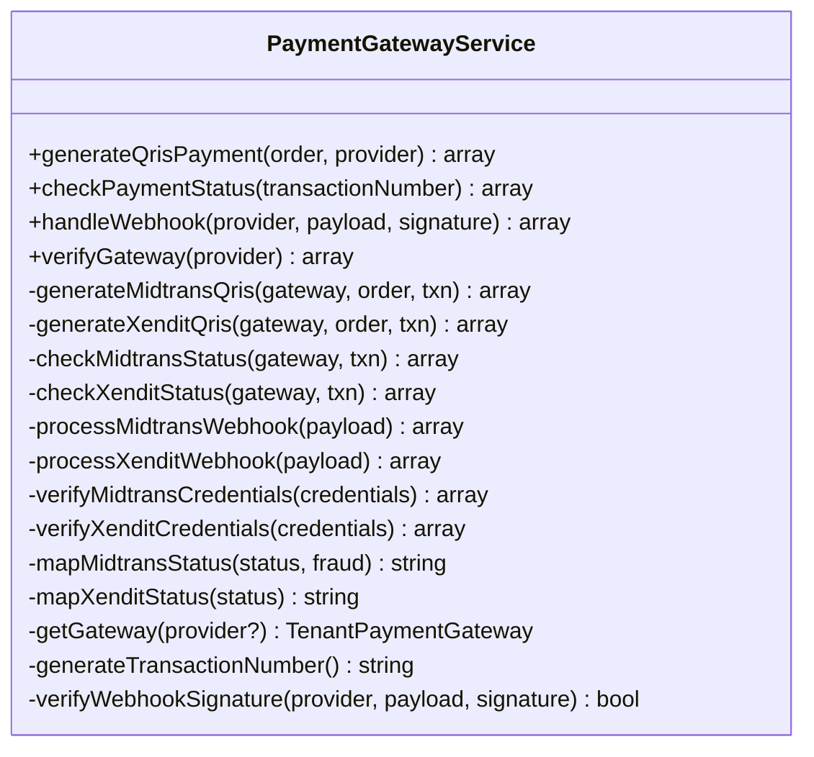
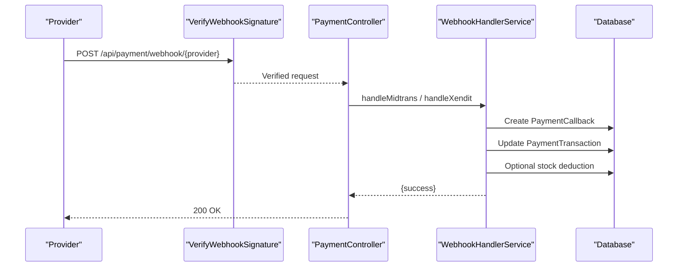
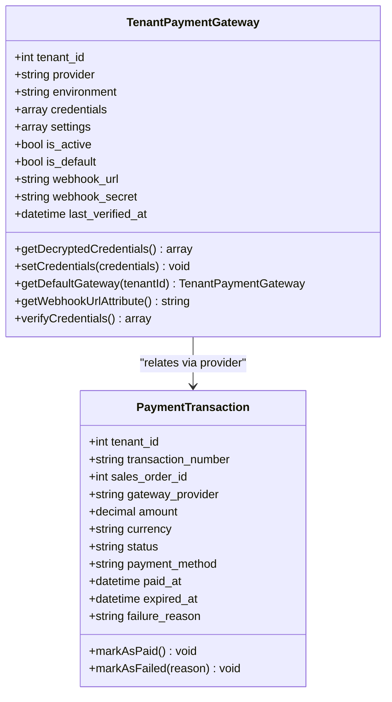
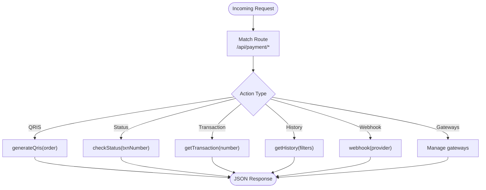
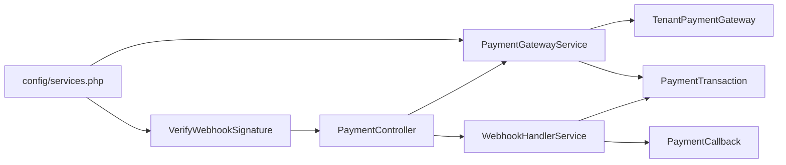

# Payment Gateway Integrations

<cite>
**Referenced Files in This Document**
- [PaymentGatewayService.php](file://app/Services/PaymentGatewayService.php)
- [WebhookHandlerService.php](file://app/Services/WebhookHandlerService.php)
- [WebhookIdempotencyService.php](file://app/Services/WebhookIdempotencyService.php)
- [VerifyWebhookSignature.php](file://app/Http/Middleware/VerifyWebhookSignature.php)
- [PaymentController.php](file://app/Http/Controllers/Api/PaymentController.php)
- [PaymentGatewayController.php](file://app/Http/Controllers/PaymentGatewayController.php)
- [PaymentGateway.php](file://app/Models/PaymentGateway.php)
- [TenantPaymentGateway.php](file://app/Models/TenantPaymentGateway.php)
- [PaymentTransaction.php](file://app/Models/PaymentTransaction.php)
- [PaymentCallback.php](file://app/Models/PaymentCallback.php)
- [api.php](file://routes/api.php)
- [services.php](file://config/services.php)
</cite>

## Table of Contents
1. [Introduction](#introduction)
2. [Project Structure](#project-structure)
3. [Core Components](#core-components)
4. [Architecture Overview](#architecture-overview)
5. [Detailed Component Analysis](#detailed-component-analysis)
6. [Dependency Analysis](#dependency-analysis)
7. [Performance Considerations](#performance-considerations)
8. [Troubleshooting Guide](#troubleshooting-guide)
9. [Conclusion](#conclusion)
10. [Appendices](#appendices)

## Introduction
This document explains the payment gateway integration capabilities implemented in the system. It covers the service architecture, connector implementations for Midtrans and Xendit, QRIS payment generation, payment status checking, webhook handling, transaction status tracking, and refund processing for telemedicine use cases. It also documents configuration options, error handling strategies, integration testing approaches, and security best practices including PCI compliance considerations, tokenization, and secure payment routing.

## Project Structure
The payment integration spans controllers, services, models, middleware, routes, and configuration:
- Controllers expose endpoints for QRIS generation, status checks, transaction retrieval, history, and webhook handling.
- Services encapsulate provider-specific logic, webhook processing, and idempotency.
- Models represent persisted entities for transactions, callbacks, and tenant-specific gateway configurations.
- Middleware verifies webhook signatures for Midtrans and Xendit.
- Routes define public and authenticated endpoints for payment operations and webhook testing.
- Configuration stores provider credentials and keys.

**Diagram sources**
- [PaymentController.php:14-287](file://app/Http/Controllers/Api/PaymentController.php#L14-L287)
- [PaymentGatewayService.php:13-637](file://app/Services/PaymentGatewayService.php#L13-L637)
- [WebhookHandlerService.php:12-442](file://app/Services/WebhookHandlerService.php#L12-L442)
- [VerifyWebhookSignature.php:14-59](file://app/Http/Middleware/VerifyWebhookSignature.php#L14-L59)
- [api.php:106-134](file://routes/api.php#L106-L134)
- [services.php:43-52](file://config/services.php#L43-L52)

**Section sources**
- [PaymentController.php:14-287](file://app/Http/Controllers/Api/PaymentController.php#L14-L287)
- [PaymentGatewayService.php:13-637](file://app/Services/PaymentGatewayService.php#L13-L637)
- [WebhookHandlerService.php:12-442](file://app/Services/WebhookHandlerService.php#L12-L442)
- [VerifyWebhookSignature.php:14-59](file://app/Http/Middleware/VerifyWebhookSignature.php#L14-L59)
- [api.php:106-134](file://routes/api.php#L106-L134)
- [services.php:43-52](file://config/services.php#L43-L52)

## Core Components
- PaymentGatewayService: Orchestrates QRIS payment creation, status checks, webhook verification, and provider credential verification for Midtrans and Xendit.
- WebhookHandlerService: Processes incoming webhook events, enforces idempotency, validates signatures, updates transactions, and triggers downstream actions (e.g., stock deduction).
- WebhookIdempotencyService: Prevents duplicate processing of webhooks using idempotency keys derived from payload characteristics.
- VerifyWebhookSignature Middleware: Validates webhook authenticity for Midtrans and Xendit using configured secrets/tokens.
- PaymentController: Exposes authenticated endpoints for QRIS generation, status checks, transaction retrieval, history, gateway configuration, and webhook testing.
- TenantPaymentGateway Model: Stores tenant-scoped gateway configurations with encrypted credentials and webhook settings.
- PaymentTransaction Model: Tracks payment lifecycle, amounts, statuses, and timestamps.
- PaymentCallback Model: Logs webhook events, verification results, and processing outcomes.
- Routes: Define endpoints under /api/payment for tenant self-service configuration and webhook handling.
- Configuration: Provider keys and tokens are loaded from config/services.php.

**Section sources**
- [PaymentGatewayService.php:13-637](file://app/Services/PaymentGatewayService.php#L13-L637)
- [WebhookHandlerService.php:12-442](file://app/Services/WebhookHandlerService.php#L12-L442)
- [WebhookIdempotencyService.php:144-183](file://app/Services/WebhookIdempotencyService.php#L144-L183)
- [VerifyWebhookSignature.php:14-59](file://app/Http/Middleware/VerifyWebhookSignature.php#L14-L59)
- [PaymentController.php:14-287](file://app/Http/Controllers/Api/PaymentController.php#L14-L287)
- [TenantPaymentGateway.php:11-152](file://app/Models/TenantPaymentGateway.php#L11-L152)
- [PaymentTransaction.php:10-60](file://app/Models/PaymentTransaction.php#L10-L60)
- [PaymentCallback.php:10-86](file://app/Models/PaymentCallback.php#L10-L86)
- [api.php:106-134](file://routes/api.php#L106-L134)
- [services.php:43-52](file://config/services.php#L43-L52)

## Architecture Overview
The system supports two primary QRIS providers (Midtrans and Xendit) with a unified service layer. Outbound requests to providers are initiated by PaymentGatewayService, while inbound webhooks are handled by WebhookHandlerService after signature verification.

**Diagram sources**
- [PaymentController.php:26-63](file://app/Http/Controllers/Api/PaymentController.php#L26-L63)
- [PaymentGatewayService.php:31-161](file://app/Services/PaymentGatewayService.php#L31-L161)
- [PaymentTransaction.php:10-60](file://app/Models/PaymentTransaction.php#L10-L60)

**Section sources**
- [PaymentController.php:26-63](file://app/Http/Controllers/Api/PaymentController.php#L26-L63)
- [PaymentGatewayService.php:31-161](file://app/Services/PaymentGatewayService.php#L31-L161)

## Detailed Component Analysis

### PaymentGatewayService
Responsibilities:
- Generate QRIS payments for SalesOrder via Midtrans or Xendit.
- Check payment status against provider APIs.
- Handle webhooks, verify signatures, and update transactions.
- Verify provider credentials.
- Manage transaction numbering and expiration.

Key behaviors:
- Provider selection: Default or explicit provider via constants.
- QRIS generation: Builds payload, posts to provider, persists transaction, and updates with gateway identifiers.
- Status polling: Calls provider status endpoint and maps to internal statuses.
- Webhook processing: Verifies signature, maps statuses, updates transaction, and completes related orders.
- Credential verification: Tests connectivity to provider endpoints.

**Diagram sources**
- [PaymentGatewayService.php:13-637](file://app/Services/PaymentGatewayService.php#L13-L637)

**Section sources**
- [PaymentGatewayService.php:13-637](file://app/Services/PaymentGatewayService.php#L13-L637)

### WebhookHandlerService
Responsibilities:
- Idempotent webhook processing using WebhookIdempotencyService.
- Signature verification for Midtrans and Xendit.
- Transaction updates and sales order completion.
- Stock deduction for completed orders.
- Retry mechanism for failed callbacks.

**Diagram sources**
- [VerifyWebhookSignature.php:14-59](file://app/Http/Middleware/VerifyWebhookSignature.php#L14-L59)
- [PaymentController.php:112-148](file://app/Http/Controllers/Api/PaymentController.php#L112-L148)
- [WebhookHandlerService.php:24-263](file://app/Services/WebhookHandlerService.php#L24-L263)
- [PaymentCallback.php:10-86](file://app/Models/PaymentCallback.php#L10-L86)
- [PaymentTransaction.php:10-60](file://app/Models/PaymentTransaction.php#L10-L60)

**Section sources**
- [WebhookHandlerService.php:12-442](file://app/Services/WebhookHandlerService.php#L12-L442)
- [VerifyWebhookSignature.php:14-59](file://app/Http/Middleware/VerifyWebhookSignature.php#L14-L59)
- [PaymentController.php:112-148](file://app/Http/Controllers/Api/PaymentController.php#L112-L148)

### TenantPaymentGateway and PaymentTransaction Models
- TenantPaymentGateway: Stores encrypted credentials, environment, webhook URL, and secret. Provides helpers to get/set credentials and default gateway.
- PaymentTransaction: Persists transaction records with amounts, statuses, timestamps, and links to related entities.

**Diagram sources**
- [TenantPaymentGateway.php:11-152](file://app/Models/TenantPaymentGateway.php#L11-L152)
- [PaymentTransaction.php:10-60](file://app/Models/PaymentTransaction.php#L10-L60)

**Section sources**
- [TenantPaymentGateway.php:11-152](file://app/Models/TenantPaymentGateway.php#L11-L152)
- [PaymentTransaction.php:10-60](file://app/Models/PaymentTransaction.php#L10-L60)

### PaymentController (API)
Endpoints:
- POST /api/payment/qris/{order}: Generate QRIS payment for an order.
- GET /api/payment/status: Check payment status by transaction number.
- GET /api/payment/transaction/{transactionNumber}: Retrieve transaction details.
- GET /api/payment/history: Paginated transaction history filtered by status.
- POST /api/payment/webhook/{provider}: Inbound webhook handler (signature-verified).
- GET/POST/DELETE /api/payment/gateways: Manage tenant gateway settings.
- POST /api/payment/gateways/test: Verify gateway credentials.
- POST /api/payment/gateways/{gateway}/toggle and DELETE: Toggle or remove gateway.

**Diagram sources**
- [PaymentController.php:26-287](file://app/Http/Controllers/Api/PaymentController.php#L26-L287)
- [api.php:106-134](file://routes/api.php#L106-L134)

**Section sources**
- [PaymentController.php:26-287](file://app/Http/Controllers/Api/PaymentController.php#L26-L287)
- [api.php:106-134](file://routes/api.php#L106-L134)

### Subscription Payment Integration (Midtrans/Xendit)
The legacy subscription payment controller demonstrates provider-specific flows for subscriptions:
- Midtrans: Uses Snap API to create sessions and finish/fail based on transaction status.
- Xendit: Creates invoices and handles webhook notifications.

These flows complement the unified QRIS service for order-level payments.

**Section sources**
- [PaymentGatewayController.php:18-275](file://app/Http/Controllers/PaymentGatewayController.php#L18-L275)

## Dependency Analysis
- Controllers depend on Services for business logic.
- Services depend on Models for persistence and Http client for provider APIs.
- Middleware depends on configuration for signature verification.
- Routes bind endpoints to controllers and services.

**Diagram sources**
- [PaymentController.php:14-287](file://app/Http/Controllers/Api/PaymentController.php#L14-L287)
- [PaymentGatewayService.php:13-637](file://app/Services/PaymentGatewayService.php#L13-L637)
- [WebhookHandlerService.php:12-442](file://app/Services/WebhookHandlerService.php#L12-L442)
- [VerifyWebhookSignature.php:14-59](file://app/Http/Middleware/VerifyWebhookSignature.php#L14-L59)
- [TenantPaymentGateway.php:11-152](file://app/Models/TenantPaymentGateway.php#L11-L152)
- [PaymentTransaction.php:10-60](file://app/Models/PaymentTransaction.php#L10-L60)
- [PaymentCallback.php:10-86](file://app/Models/PaymentCallback.php#L10-L86)
- [services.php:43-52](file://config/services.php#L43-L52)

**Section sources**
- [PaymentController.php:14-287](file://app/Http/Controllers/Api/PaymentController.php#L14-L287)
- [PaymentGatewayService.php:13-637](file://app/Services/PaymentGatewayService.php#L13-L637)
- [WebhookHandlerService.php:12-442](file://app/Services/WebhookHandlerService.php#L12-L442)
- [VerifyWebhookSignature.php:14-59](file://app/Http/Middleware/VerifyWebhookSignature.php#L14-L59)
- [TenantPaymentGateway.php:11-152](file://app/Models/TenantPaymentGateway.php#L11-L152)
- [PaymentTransaction.php:10-60](file://app/Models/PaymentTransaction.php#L10-L60)
- [PaymentCallback.php:10-86](file://app/Models/PaymentCallback.php#L10-L86)
- [services.php:43-52](file://config/services.php#L43-L52)

## Performance Considerations
- Idempotency: WebhookIdempotencyService prevents duplicate processing overhead.
- Batch operations: Use paginated history endpoints to avoid large payloads.
- Status caching: For frequently polled transactions, cache recent status results with TTL.
- Asynchronous retries: Use retry mechanisms for failed callbacks to reduce immediate failures.
- Connection pooling: Reuse HTTP clients and keep-alive connections to providers.

[No sources needed since this section provides general guidance]

## Troubleshooting Guide
Common issues and resolutions:
- Invalid webhook signature:
  - Ensure webhook secret is configured and matches provider expectations.
  - Verify middleware is applied to webhook routes.
- Transaction not found:
  - Confirm transaction_number exists and belongs to the tenant.
  - Check payload mapping for external_id/order_id differences between providers.
- Duplicate webhook processing:
  - Idempotency keys prevent reprocessing; inspect previous callback records.
- Credential verification failures:
  - Validate provider keys and environment mode (sandbox vs production).
- Stock deduction errors:
  - Inspect insufficient stock warnings and adjust inventory allocation.

Operational tools:
- Webhook testing endpoints for Midtrans/Xendit.
- History and stats endpoints for monitoring webhook processing.
- Retry failed callbacks job.

**Section sources**
- [VerifyWebhookSignature.php:14-59](file://app/Http/Middleware/VerifyWebhookSignature.php#L14-L59)
- [WebhookHandlerService.php:12-442](file://app/Services/WebhookHandlerService.php#L12-L442)
- [PaymentController.php:126-132](file://app/Http/Controllers/Api/PaymentController.php#L126-L132)

## Conclusion
The payment gateway integration provides a robust, provider-agnostic QRIS payment flow with strong webhook handling, idempotency, and tenant-scoped configuration. It supports Midtrans and Xendit, offers comprehensive transaction tracking, and includes mechanisms for status polling, webhook verification, and refund processing for telemedicine. The modular design enables easy extension to additional providers and improved operational observability.

[No sources needed since this section summarizes without analyzing specific files]

## Appendices

### Configuration Examples
- Provider credentials and environment:
  - Midtrans: server_key, client_key, is_production
  - Xendit: secret_key, webhook_token
- Tenant gateway settings:
  - provider, environment, credentials (encrypted), webhook_url, webhook_secret, is_active, is_default

**Section sources**
- [services.php:43-52](file://config/services.php#L43-L52)
- [PaymentController.php:172-210](file://app/Http/Controllers/Api/PaymentController.php#L172-L210)
- [TenantPaymentGateway.php:11-152](file://app/Models/TenantPaymentGateway.php#L11-L152)

### Error Handling Strategies
- Centralized exception logging in services and controllers.
- Structured error responses with descriptive messages.
- Idempotency and retry logic for webhook processing.
- Signature verification failures return unauthorized responses.

**Section sources**
- [PaymentGatewayService.php:93-103](file://app/Services/PaymentGatewayService.php#L93-L103)
- [WebhookHandlerService.php:143-150](file://app/Services/WebhookHandlerService.php#L143-L150)
- [VerifyWebhookSignature.php:24-32](file://app/Http/Middleware/VerifyWebhookSignature.php#L24-L32)

### Integration Testing Approaches
- Use webhook test endpoints to simulate provider events.
- Validate signature verification with mock payloads.
- Test status polling and transaction updates.
- Simulate duplicate callbacks to verify idempotency.

**Section sources**
- [api.php:126-132](file://routes/api.php#L126-L132)
- [PaymentController.php:126-132](file://app/Http/Controllers/Api/PaymentController.php#L126-L132)

### Security Best Practices and PCI Compliance
- Tokenization: Store only encrypted credentials; avoid retaining raw PAN or CVV.
- Secure routing: Enforce signature verification for all inbound webhooks.
- Least privilege: Restrict access to payment endpoints using bearer tokens.
- Logging: Avoid logging sensitive data; redact payloads where necessary.
- Idempotency: Prevent replay attacks via idempotency keys and callback deduplication.
- Environment isolation: Use separate sandbox and production environments per provider.

**Section sources**
- [TenantPaymentGateway.php:30-35](file://app/Models/TenantPaymentGateway.php#L30-L35)
- [VerifyWebhookSignature.php:14-59](file://app/Http/Middleware/VerifyWebhookSignature.php#L14-L59)
- [WebhookHandlerService.php:24-64](file://app/Services/WebhookHandlerService.php#L24-L64)

### Refund Processing (Telemedicine)
- Supported providers: Midtrans and Xendit.
- Process refund by invoking provider-specific refund methods.
- Update transaction status to refunded and reflect in related consultation records.

**Section sources**
- [TelemedicinePaymentService.php:225-260](file://app/Services/Healthcare/TelemedicinePaymentService.php#L225-L260)