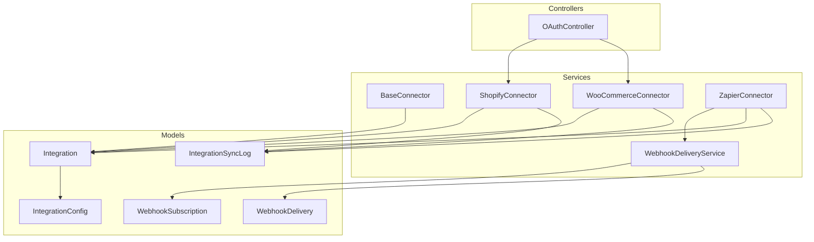
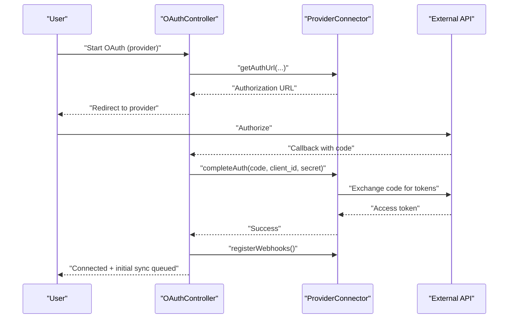
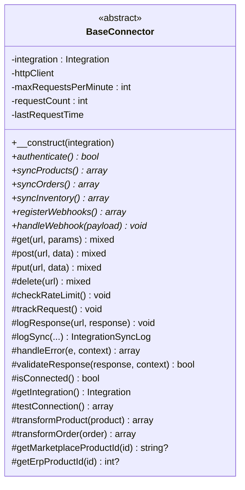
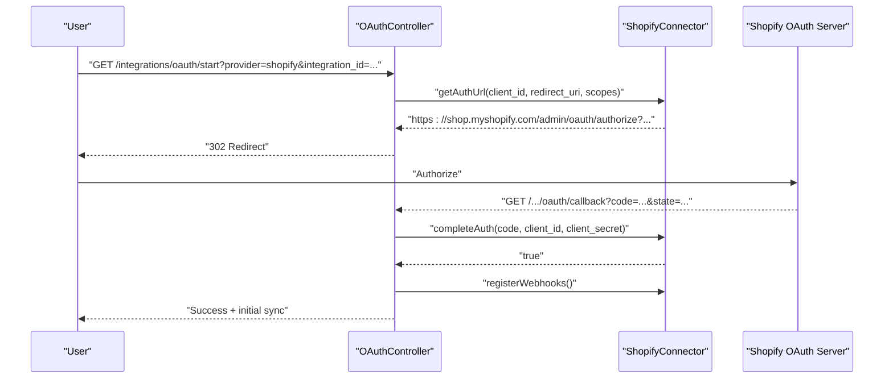
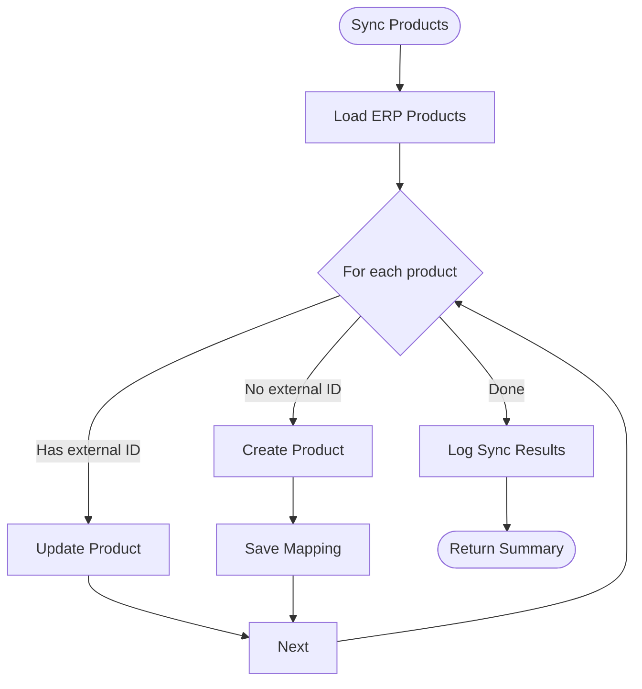
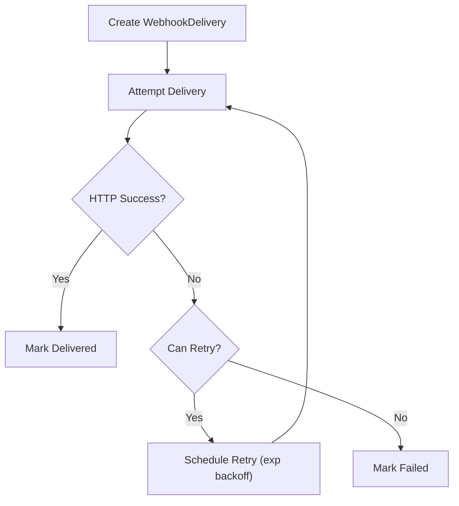
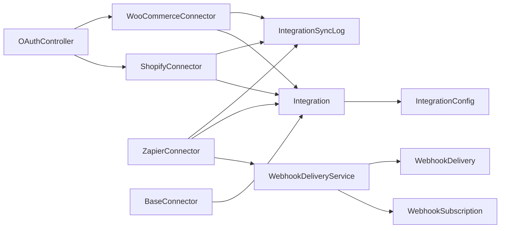

# Third-Party Connectors

<cite>
**Referenced Files in This Document**
- [BaseConnector.php](file://app/Services/Integrations/BaseConnector.php)
- [OAuthController.php](file://app/Http/Controllers/Integrations/OAuthController.php)
- [ShopifyConnector.php](file://app/Services/Integrations/ShopifyConnector.php)
- [WooCommerceConnector.php](file://app/Services/Integrations/WooCommerceConnector.php)
- [ZapierConnector.php](file://app/Services/Integrations/ZapierConnector.php)
- [WebhookDeliveryService.php](file://app/Services/Integrations/WebhookDeliveryService.php)
- [Integration.php](file://app/Models/Integration.php)
- [IntegrationConfig.php](file://app/Models/IntegrationConfig.php)
- [IntegrationSyncLog.php](file://app/Models/IntegrationSyncLog.php)
- [WebhookSubscription.php](file://app/Models/WebhookSubscription.php)
- [WebhookDelivery.php](file://app/Models/WebhookDelivery.php)
- [LazadaConnector.php](file://app/Services/Integrations/LazadaConnector.php)
- [GoogleController.php](file://app/Http/Controllers/Auth/GoogleController.php)
- [index.blade.php](file://resources/views/super-admin/settings/index.blade.php)
</cite>

## Table of Contents
1. [Introduction](#introduction)
2. [Project Structure](#project-structure)
3. [Core Components](#core-components)
4. [Architecture Overview](#architecture-overview)
5. [Detailed Component Analysis](#detailed-component-analysis)
6. [Dependency Analysis](#dependency-analysis)
7. [Performance Considerations](#performance-considerations)
8. [Troubleshooting Guide](#troubleshooting-guide)
9. [Conclusion](#conclusion)
10. [Appendices](#appendices)

## Introduction
This document describes the third-party connector framework and OAuth integration patterns used to connect external systems (marketplaces, CRM, and workflow platforms) to the ERP. It covers the base connector architecture, OAuth authentication flows, configuration management, and lifecycle operations. It also documents the Zapier connector implementation, custom connector development patterns, and operational practices for testing, monitoring, and maintenance.

## Project Structure
The integration system is organized around:
- A base connector class that defines the contract and shared capabilities
- Provider-specific connectors (Shopify, WooCommerce, Lazada, Zapier)
- OAuth orchestration controller
- Models for integration metadata, configuration, synchronization logs, and webhooks
- A webhook delivery service with retry and signature verification

**Diagram sources**
- [OAuthController.php:1-258](file://app/Http/Controllers/Integrations/OAuthController.php#L1-L258)
- [BaseConnector.php:1-370](file://app/Services/Integrations/BaseConnector.php#L1-L370)
- [ShopifyConnector.php:1-637](file://app/Services/Integrations/ShopifyConnector.php#L1-L637)
- [WooCommerceConnector.php:1-583](file://app/Services/Integrations/WooCommerceConnector.php#L1-L583)
- [ZapierConnector.php:1-190](file://app/Services/Integrations/ZapierConnector.php#L1-L190)
- [WebhookDeliveryService.php:1-369](file://app/Services/Integrations/WebhookDeliveryService.php#L1-L369)
- [Integration.php:1-175](file://app/Models/Integration.php#L1-L175)
- [IntegrationConfig.php:1-88](file://app/Models/IntegrationConfig.php#L1-L88)
- [IntegrationSyncLog.php:1-186](file://app/Models/IntegrationSyncLog.php#L1-L186)
- [WebhookSubscription.php:1-160](file://app/Models/WebhookSubscription.php#L1-L160)
- [WebhookDelivery.php:1-179](file://app/Models/WebhookDelivery.php#L1-L179)

**Section sources**
- [BaseConnector.php:1-370](file://app/Services/Integrations/BaseConnector.php#L1-L370)
- [OAuthController.php:1-258](file://app/Http/Controllers/Integrations/OAuthController.php#L1-L258)
- [Integration.php:1-175](file://app/Models/Integration.php#L1-L175)

## Core Components
- BaseConnector: Defines the abstract contract for connectors, shared HTTP helpers, rate limiting, logging, and sync logging. Provides defaults for product/order/inventory transforms and mapping helpers.
- Provider connectors: Implement provider-specific authentication, API URLs, request signing, sync logic, and webhook handling.
- OAuthController: Orchestrates OAuth initiation and callbacks, saves tokens, registers webhooks, and triggers initial sync jobs.
- Integration model: Stores integration metadata, OAuth tokens, configuration values, and helper methods for connectivity and token checks.
- IntegrationConfig: Encrypted key-value store for provider credentials and settings.
- WebhookDeliveryService: Manages webhook delivery with retries, exponential backoff, signatures, and delivery tracking.
- WebhookSubscription and WebhookDelivery: Persist webhook subscriptions and delivery attempts with retry scheduling.

**Section sources**
- [BaseConnector.php:69-111](file://app/Services/Integrations/BaseConnector.php#L69-L111)
- [Integration.php:144-173](file://app/Models/Integration.php#L144-L173)
- [IntegrationConfig.php:39-62](file://app/Models/IntegrationConfig.php#L39-L62)
- [WebhookDeliveryService.php:37-136](file://app/Services/Integrations/WebhookDeliveryService.php#L37-L136)
- [WebhookSubscription.php:75-88](file://app/Models/WebhookSubscription.php#L75-L88)
- [WebhookDelivery.php:103-120](file://app/Models/WebhookDelivery.php#L103-L120)

## Architecture Overview
The framework follows a layered pattern:
- Controller layer handles OAuth flows and user actions
- Service layer encapsulates provider-specific logic and shared utilities
- Model layer persists integration state, configuration, logs, and webhook records
- External APIs are accessed via HTTP clients with retry and rate-limit controls

**Diagram sources**
- [OAuthController.php:19-94](file://app/Http/Controllers/Integrations/OAuthController.php#L19-L94)
- [ShopifyConnector.php:105-154](file://app/Services/Integrations/ShopifyConnector.php#L105-L154)

## Detailed Component Analysis

### BaseConnector
- Responsibilities: Define abstract methods for authentication, sync, webhooks, and webhook handling; provide HTTP helpers, rate limiting, logging, and sync logging; offer default transforms and mapping helpers.
- Shared behaviors: HTTP GET/POST/PUT/DELETE wrappers with rate limiting; response validation; error handling; sync log creation; connection testing.

**Diagram sources**
- [BaseConnector.php:18-370](file://app/Services/Integrations/BaseConnector.php#L18-L370)

**Section sources**
- [BaseConnector.php:46-202](file://app/Services/Integrations/BaseConnector.php#L46-L202)
- [BaseConnector.php:217-280](file://app/Services/Integrations/BaseConnector.php#L217-L280)

### OAuthController
- Responsibilities: Validate requests, select provider, start OAuth, handle callbacks, save tokens, register webhooks, disconnect, and refresh tokens.
- Shopify flow: Builds authorization URL with scopes, state, and per-user grant; completes OAuth by exchanging code for tokens; registers webhooks and dispatches initial sync.
- WooCommerce flow: Manual setup with consumer key/secret; tests connection and registers webhooks.

**Diagram sources**
- [OAuthController.php:19-94](file://app/Http/Controllers/Integrations/OAuthController.php#L19-L94)
- [ShopifyConnector.php:105-154](file://app/Services/Integrations/ShopifyConnector.php#L105-L154)

**Section sources**
- [OAuthController.php:19-94](file://app/Http/Controllers/Integrations/OAuthController.php#L19-L94)
- [OAuthController.php:96-160](file://app/Http/Controllers/Integrations/OAuthController.php#L96-L160)

### ShopifyConnector
- Authentication: Uses X-Shopify-Access-Token header; tests by fetching shop info.
- OAuth: Generates authorization URL with scopes and state; exchanges code for access token; marks integration active.
- Sync: Products (create/update), Orders (pull), Inventory (push); maintains mapping table for external IDs.
- Webhooks: Registers topics and verifies signatures; delegates to handler.

**Diagram sources**
- [ShopifyConnector.php:163-235](file://app/Services/Integrations/ShopifyConnector.php#L163-L235)

**Section sources**
- [ShopifyConnector.php:74-100](file://app/Services/Integrations/ShopifyConnector.php#L74-L100)
- [ShopifyConnector.php:121-154](file://app/Services/Integrations/ShopifyConnector.php#L121-L154)
- [ShopifyConnector.php:163-235](file://app/Services/Integrations/ShopifyConnector.php#L163-L235)
- [ShopifyConnector.php:330-384](file://app/Services/Integrations/ShopifyConnector.php#L330-L384)
- [ShopifyConnector.php:457-513](file://app/Services/Integrations/ShopifyConnector.php#L457-L513)
- [ShopifyConnector.php:547-572](file://app/Services/Integrations/ShopifyConnector.php#L547-L572)
- [ShopifyConnector.php:577-635](file://app/Services/Integrations/ShopifyConnector.php#L577-L635)

### WooCommerceConnector
- Authentication: Uses OAuth 1.0a with consumer key/secret appended to URLs.
- Sync: Similar product/order/inventory operations with provider-specific transforms.
- Webhooks: Registers events and verifies signatures.

**Section sources**
- [WooCommerceConnector.php:61-87](file://app/Services/Integrations/WooCommerceConnector.php#L61-L87)
- [WooCommerceConnector.php:96-168](file://app/Services/Integrations/WooCommerceConnector.php#L96-L168)
- [WooCommerceConnector.php:281-335](file://app/Services/Integrations/WooCommerceConnector.php#L281-L335)
- [WooCommerceConnector.php:407-463](file://app/Services/Integrations/WooCommerceConnector.php#L407-L463)
- [WooCommerceConnector.php:497-520](file://app/Services/Integrations/WooCommerceConnector.php#L497-L520)
- [WooCommerceConnector.php:525-581](file://app/Services/Integrations/WooCommerceConnector.php#L525-L581)

### ZapierConnector
- Purpose: Sends events to Zapier/Make.com webhooks; does not perform marketplace sync.
- Authentication: Validates webhook URL by sending a test event; marks integration active on success.
- Event methods: invoice.created, order.created, payment.received, inventory.low_stock, customer.created.

**Section sources**
- [ZapierConnector.php:27-53](file://app/Services/Integrations/ZapierConnector.php#L27-L53)
- [ZapierConnector.php:58-94](file://app/Services/Integrations/ZapierConnector.php#L58-L94)
- [ZapierConnector.php:99-165](file://app/Services/Integrations/ZapierConnector.php#L99-L165)

### WebhookDeliveryService
- Responsibilities: Deliver webhook payloads with signature, retry with exponential backoff, track attempts, and maintain delivery records.
- Features: Immediate delivery, scheduled retries, max-attempts enforcement, stats aggregation, cleanup.

**Diagram sources**
- [WebhookDeliveryService.php:62-136](file://app/Services/Integrations/WebhookDeliveryService.php#L62-L136)
- [WebhookDelivery.php:103-120](file://app/Models/WebhookDelivery.php#L103-L120)

**Section sources**
- [WebhookDeliveryService.php:37-136](file://app/Services/Integrations/WebhookDeliveryService.php#L37-L136)
- [WebhookDelivery.php:72-120](file://app/Models/WebhookDelivery.php#L72-L120)

### Integration and Configuration Models
- Integration: Holds slug, type, status, oauth_tokens, config values, and helpers to get/set encrypted config and token expiration checks.
- IntegrationConfig: Encrypted key-value pairs for credentials and settings.
- IntegrationSyncLog: Records sync outcomes, counts, durations, and details.
- WebhookSubscription: Stores endpoint, secret, subscribed events, and activation state.
- WebhookDelivery: Tracks attempts, delays, responses, and retry scheduling.

**Section sources**
- [Integration.php:14-36](file://app/Models/Integration.php#L14-L36)
- [Integration.php:144-163](file://app/Models/Integration.php#L144-L163)
- [IntegrationConfig.php:39-62](file://app/Models/IntegrationConfig.php#L39-L62)
- [IntegrationSyncLog.php:12-27](file://app/Models/IntegrationSyncLog.php#L12-L27)
- [WebhookSubscription.php:12-26](file://app/Models/WebhookSubscription.php#L12-L26)
- [WebhookDelivery.php:12-30](file://app/Models/WebhookDelivery.php#L12-L30)

### Additional Connector: LazadaConnector
- Implements product and order sync against Lazada Open Platform API; uses app key/secret; creates mappings and logs sync results.

**Section sources**
- [LazadaConnector.php:29-43](file://app/Services/Integrations/LazadaConnector.php#L29-L43)
- [LazadaConnector.php:50-94](file://app/Services/Integrations/LazadaConnector.php#L50-L94)
- [LazadaConnector.php:156-180](file://app/Services/Integrations/LazadaConnector.php#L156-L180)

### OAuth Setup Examples
- Google OAuth login flow is handled by a dedicated controller and view instructions for setting up Google OAuth credentials in the admin panel.

**Section sources**
- [GoogleController.php:17-47](file://app/Http/Controllers/Auth/GoogleController.php#L17-L47)
- [index.blade.php:366-377](file://resources/views/super-admin/settings/index.blade.php#L366-L377)

## Dependency Analysis
- Controllers depend on provider connectors and models to manage state and persistence.
- Connectors depend on the base class, models for configuration and logs, and HTTP client for external calls.
- WebhookDeliveryService depends on WebhookSubscription and WebhookDelivery models.
- Integration model resolves connector class dynamically by slug.

**Diagram sources**
- [OAuthController.php:1-258](file://app/Http/Controllers/Integrations/OAuthController.php#L1-L258)
- [BaseConnector.php:1-370](file://app/Services/Integrations/BaseConnector.php#L1-L370)
- [ShopifyConnector.php:1-637](file://app/Services/Integrations/ShopifyConnector.php#L1-L637)
- [WooCommerceConnector.php:1-583](file://app/Services/Integrations/WooCommerceConnector.php#L1-L583)
- [ZapierConnector.php:1-190](file://app/Services/Integrations/ZapierConnector.php#L1-L190)
- [WebhookDeliveryService.php:1-369](file://app/Services/Integrations/WebhookDeliveryService.php#L1-L369)
- [Integration.php:168-173](file://app/Models/Integration.php#L168-L173)

**Section sources**
- [Integration.php:168-173](file://app/Models/Integration.php#L168-L173)

## Performance Considerations
- Rate limiting: BaseConnector enforces a per-minute cap with sleep and reset logic.
- Retries: HTTP client configured with retry attempts and delay; webhook delivery uses exponential backoff.
- Logging: API calls and sync operations are logged for observability and debugging.
- Recommendations: Tune maxRequestsPerMinute per provider limits; monitor sync durations and error rates; batch large syncs and stagger retries.

[No sources needed since this section provides general guidance]

## Troubleshooting Guide
- Authentication failures: Check provider credentials, scopes, and token expiration; use testConnection on connectors.
- Webhook delivery failures: Inspect WebhookDelivery records, signatures, and retry schedules; verify endpoint availability.
- Sync errors: Review IntegrationSyncLog entries for processed/failed counts and error messages.
- OAuth state mismatch: Ensure state parameter is preserved during redirect and validated on callback.

**Section sources**
- [BaseConnector.php:301-322](file://app/Services/Integrations/BaseConnector.php#L301-L322)
- [WebhookDelivery.php:103-120](file://app/Models/WebhookDelivery.php#L103-L120)
- [IntegrationSyncLog.php:112-184](file://app/Models/IntegrationSyncLog.php#L112-L184)
- [OAuthController.php:83-88](file://app/Http/Controllers/Integrations/OAuthController.php#L83-L88)

## Conclusion
The connector framework provides a robust, extensible foundation for integrating with multiple third-party systems. By adhering to the BaseConnector contract, implementing provider-specific logic, and leveraging the OAuthController and WebhookDeliveryService, teams can reliably manage authentication, synchronize data, and deliver events to external platforms while maintaining strong security and observability.

[No sources needed since this section summarizes without analyzing specific files]

## Appendices

### Building a Custom Connector
Steps:
- Extend BaseConnector and implement authenticate, syncProducts, syncOrders, syncInventory, registerWebhooks, and handleWebhook.
- Manage provider credentials via IntegrationConfig and store encrypted values.
- Use HTTP helpers and rate limiting; log sync outcomes via logSync.
- Register webhooks and verify signatures when applicable.

**Section sources**
- [BaseConnector.php:69-111](file://app/Services/Integrations/BaseConnector.php#L69-L111)
- [IntegrationConfig.php:39-62](file://app/Models/IntegrationConfig.php#L39-L62)

### OAuth Token Management
- Shopify: Access tokens are stored in oauth_tokens; no expiry field is set.
- General pattern: Store tokens in Integration.oauth_tokens; use Integration.isTokenExpired to check; refresh via connector.authenticate.

**Section sources**
- [Integration.php:144-163](file://app/Models/Integration.php#L144-L163)
- [ShopifyConnector.php:133-142](file://app/Services/Integrations/ShopifyConnector.php#L133-L142)

### Permission Scopes
- Shopify: Example scopes include read/write for products and orders; adjust as needed for your use case.
- Configure scopes in getAuthUrl and ensure provider supports requested permissions.

**Section sources**
- [ShopifyConnector.php:105-116](file://app/Services/Integrations/ShopifyConnector.php#L105-L116)

### Secure Credential Handling
- Use IntegrationConfig with encryption for sensitive values.
- Avoid logging raw secrets; mask or truncate in logs.
- Validate webhook signatures using shared secrets.

**Section sources**
- [IntegrationConfig.php:39-62](file://app/Models/IntegrationConfig.php#L39-L62)
- [WebhookSubscription.php:75-88](file://app/Models/WebhookSubscription.php#L75-L88)

### Testing, Monitoring, and Maintenance
- Use testConnection on connectors to validate setup.
- Monitor IntegrationSyncLog for success rates and durations.
- Use WebhookDeliveryService.getRecentDeliveries and getDeliveryStats for webhook health.
- Clean up old webhook deliveries periodically.

**Section sources**
- [BaseConnector.php:301-322](file://app/Services/Integrations/BaseConnector.php#L301-L322)
- [IntegrationSyncLog.php:112-184](file://app/Models/IntegrationSyncLog.php#L112-L184)
- [WebhookDeliveryService.php:224-251](file://app/Services/Integrations/WebhookDeliveryService.php#L224-L251)
- [WebhookDeliveryService.php:259-271](file://app/Services/Integrations/WebhookDeliveryService.php#L259-L271)