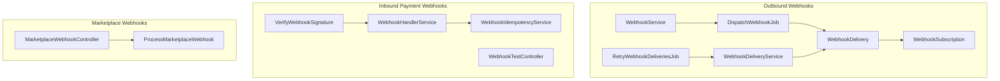
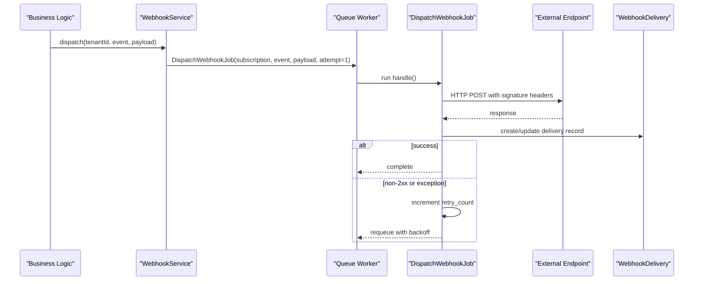
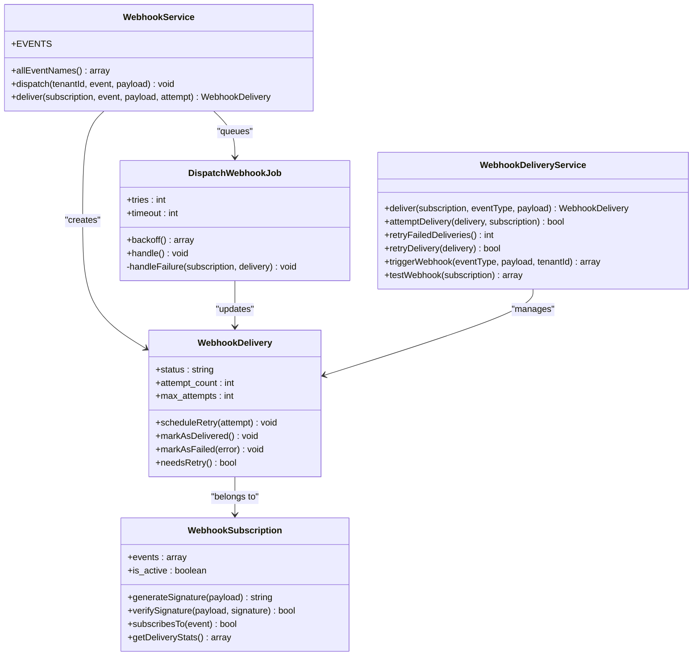
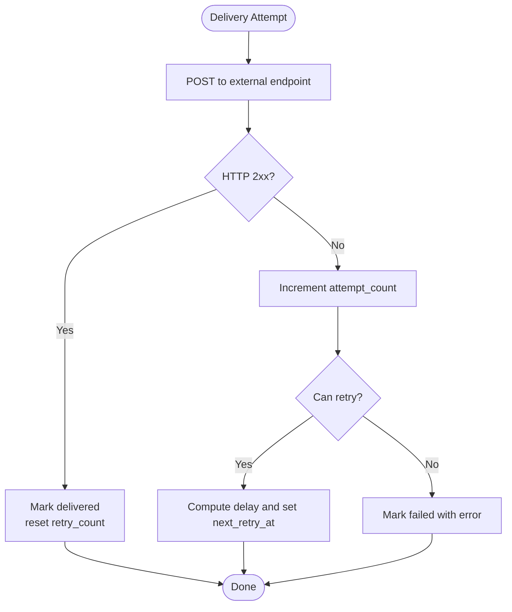
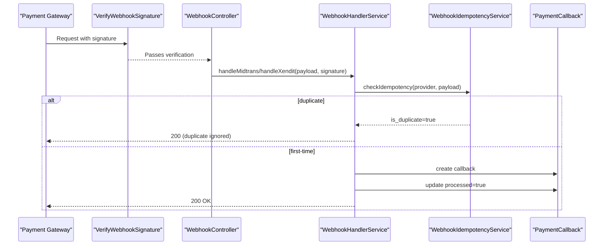
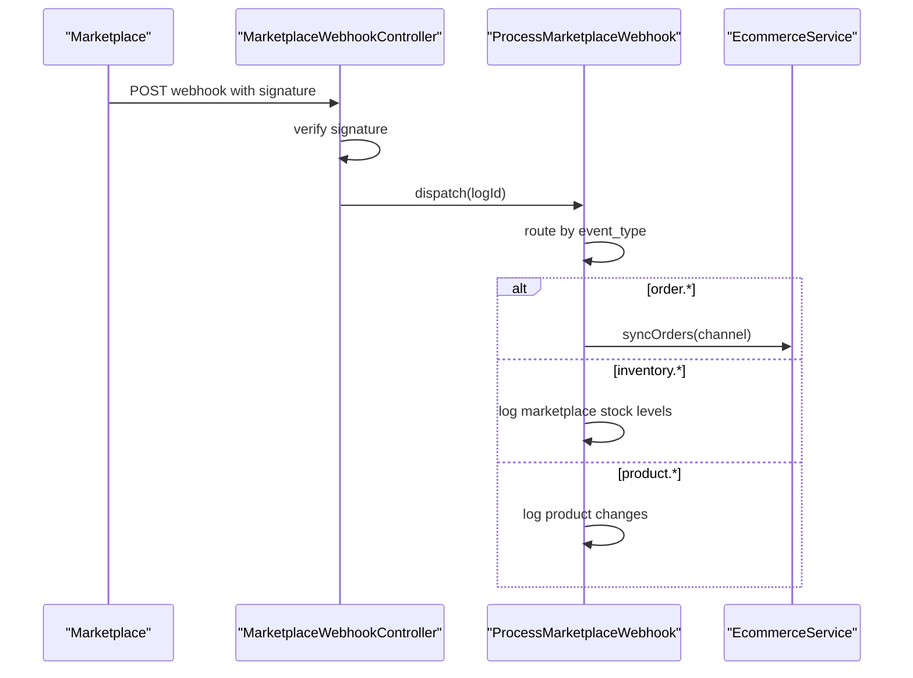
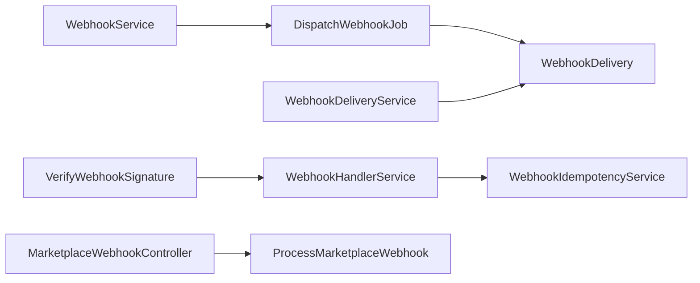

# Webhook Management

<cite>
**Referenced Files in This Document**
- [WebhookService.php](file://app/Services/WebhookService.php)
- [WebhookHandlerService.php](file://app/Services/WebhookHandlerService.php)
- [WebhookIdempotencyService.php](file://app/Services/WebhookIdempotencyService.php)
- [WebhookDeliveryService.php](file://app/Services/Integrations/WebhookDeliveryService.php)
- [DispatchWebhookJob.php](file://app/Jobs/DispatchWebhookJob.php)
- [RetryWebhookDeliveriesJob.php](file://app/Jobs/Integrations/RetryWebhookDeliveriesJob.php)
- [WebhookSubscription.php](file://app/Models/WebhookSubscription.php)
- [WebhookDelivery.php](file://app/Models/WebhookDelivery.php)
- [VerifyWebhookSignature.php](file://app/Http/Middleware/VerifyWebhookSignature.php)
- [DispatchesWebhooks.php](file://app/Traits/DispatchesWebhooks.php)
- [WebhookController.php](file://app/Http/Controllers/Integrations/WebhookController.php)
- [MarketplaceWebhookController.php](file://app/Http/Controllers/MarketplaceWebhookController.php)
- [ProcessMarketplaceWebhook.php](file://app/Jobs/ProcessMarketplaceWebhook.php)
- [WebhookTestController.php](file://app/Http/Controllers/Api/WebhookTestController.php)
</cite>

## Table of Contents
1. [Introduction](#introduction)
2. [Project Structure](#project-structure)
3. [Core Components](#core-components)
4. [Architecture Overview](#architecture-overview)
5. [Detailed Component Analysis](#detailed-component-analysis)
6. [Dependency Analysis](#dependency-analysis)
7. [Performance Considerations](#performance-considerations)
8. [Troubleshooting Guide](#troubleshooting-guide)
9. [Conclusion](#conclusion)
10. [Appendices](#appendices)

## Introduction
This document describes Qalcuity ERP’s webhook management system. It covers outbound webhooks (delivery, retries, idempotency), inbound payment webhooks (signature verification, payload handling), marketplace webhooks, and operational controls for monitoring and debugging. It also documents security measures, retry strategies, and practical guidance for integrating external systems.

## Project Structure
The webhook system spans services, jobs, models, middleware, traits, controllers, and connectors:
- Outbound webhooks: service, job, delivery tracking, retry orchestration
- Inbound payment webhooks: handler service, middleware, controllers
- Marketplace webhooks: controllers, jobs, logging
- Idempotency and replay protection for inbound payments

**Diagram sources**
- [WebhookService.php:11-189](file://app/Services/WebhookService.php#L11-L189)
- [DispatchWebhookJob.php:15-131](file://app/Jobs/DispatchWebhookJob.php#L15-L131)
- [WebhookDeliveryService.php:17-369](file://app/Services/Integrations/WebhookDeliveryService.php#L17-L369)
- [WebhookSubscription.php:8-160](file://app/Models/WebhookSubscription.php#L8-L160)
- [WebhookDelivery.php:8-179](file://app/Models/WebhookDelivery.php#L8-L179)
- [RetryWebhookDeliveriesJob.php:13-44](file://app/Jobs/Integrations/RetryWebhookDeliveriesJob.php#L13-L44)
- [WebhookHandlerService.php:12-442](file://app/Services/WebhookHandlerService.php#L12-L442)
- [VerifyWebhookSignature.php:14-60](file://app/Http/Middleware/VerifyWebhookSignature.php#L14-L60)
- [WebhookTestController.php:10-164](file://app/Http/Controllers/Api/WebhookTestController.php#L10-L164)
- [WebhookIdempotencyService.php:20-283](file://app/Services/WebhookIdempotencyService.php#L20-L283)
- [MarketplaceWebhookController.php:11-137](file://app/Http/Controllers/MarketplaceWebhookController.php#L11-L137)
- [ProcessMarketplaceWebhook.php:16-142](file://app/Jobs/ProcessMarketplaceWebhook.php#L16-L142)

**Section sources**
- [WebhookService.php:11-189](file://app/Services/WebhookService.php#L11-L189)
- [WebhookDeliveryService.php:17-369](file://app/Services/Integrations/WebhookDeliveryService.php#L17-L369)
- [DispatchWebhookJob.php:15-131](file://app/Jobs/DispatchWebhookJob.php#L15-L131)
- [WebhookSubscription.php:8-160](file://app/Models/WebhookSubscription.php#L8-L160)
- [WebhookDelivery.php:8-179](file://app/Models/WebhookDelivery.php#L8-L179)
- [RetryWebhookDeliveriesJob.php:13-44](file://app/Jobs/Integrations/RetryWebhookDeliveriesJob.php#L13-L44)
- [WebhookHandlerService.php:12-442](file://app/Services/WebhookHandlerService.php#L12-L442)
- [VerifyWebhookSignature.php:14-60](file://app/Http/Middleware/VerifyWebhookSignature.php#L14-L60)
- [WebhookTestController.php:10-164](file://app/Http/Controllers/Api/WebhookTestController.php#L10-L164)
- [WebhookIdempotencyService.php:20-283](file://app/Services/WebhookIdempotencyService.php#L20-L283)
- [MarketplaceWebhookController.php:11-137](file://app/Http/Controllers/MarketplaceWebhookController.php#L11-L137)
- [ProcessMarketplaceWebhook.php:16-142](file://app/Jobs/ProcessMarketplaceWebhook.php#L16-L142)

## Core Components
- Outbound webhooks
  - WebhookService: defines supported events, dispatches to subscriptions, synchronous delivery for tests
  - DispatchWebhookJob: queued delivery with exponential backoff and failure handling
  - WebhookDeliveryService: standalone delivery engine with retry scheduling and stats
  - WebhookSubscription and WebhookDelivery models: persistence and scopes
  - RetryWebhookDeliveriesJob: periodic retry runner
- Inbound payment webhooks
  - WebhookHandlerService: parses, validates, and processes Midtrans/Xendit webhooks with idempotency
  - VerifyWebhookSignature middleware: signature verification for selected gateways
  - WebhookTestController: test endpoints and history/retry/stats
  - WebhookIdempotencyService: replay protection and duplicate detection
- Marketplace webhooks
  - MarketplaceWebhookController: per-platform signature verification and logging
  - ProcessMarketplaceWebhook: categorizes and processes events (orders, inventory, products)

**Section sources**
- [WebhookService.php:11-189](file://app/Services/WebhookService.php#L11-L189)
- [DispatchWebhookJob.php:15-131](file://app/Jobs/DispatchWebhookJob.php#L15-L131)
- [WebhookDeliveryService.php:17-369](file://app/Services/Integrations/WebhookDeliveryService.php#L17-L369)
- [WebhookSubscription.php:8-160](file://app/Models/WebhookSubscription.php#L8-L160)
- [WebhookDelivery.php:8-179](file://app/Models/WebhookDelivery.php#L8-L179)
- [RetryWebhookDeliveriesJob.php:13-44](file://app/Jobs/Integrations/RetryWebhookDeliveriesJob.php#L13-L44)
- [WebhookHandlerService.php:12-442](file://app/Services/WebhookHandlerService.php#L12-L442)
- [VerifyWebhookSignature.php:14-60](file://app/Http/Middleware/VerifyWebhookSignature.php#L14-L60)
- [WebhookTestController.php:10-164](file://app/Http/Controllers/Api/WebhookTestController.php#L10-L164)
- [WebhookIdempotencyService.php:20-283](file://app/Services/WebhookIdempotencyService.php#L20-L283)
- [MarketplaceWebhookController.php:11-137](file://app/Http/Controllers/MarketplaceWebhookController.php#L11-L137)
- [ProcessMarketplaceWebhook.php:16-142](file://app/Jobs/ProcessMarketplaceWebhook.php#L16-L142)

## Architecture Overview
End-to-end flow for outbound webhooks:
- Event occurs → WebhookService dispatches to matching subscriptions → DispatchWebhookJob sends HTTP with signature → WebhookDelivery records outcome → RetryWebhookDeliveriesJob retries failed deliveries

**Diagram sources**
- [WebhookService.php:102-112](file://app/Services/WebhookService.php#L102-L112)
- [DispatchWebhookJob.php:40-118](file://app/Jobs/DispatchWebhookJob.php#L40-L118)
- [WebhookDelivery.php:12-30](file://app/Models/WebhookDelivery.php#L12-L30)

## Detailed Component Analysis

### Outbound Webhook Delivery Engine
- WebhookService
  - Defines supported events by domain and aggregates flat list
  - Dispatch method finds active subscriptions listening to an event and queues jobs
  - Deliver method performs synchronous HTTP delivery for tests/backward compatibility
  - Adds standardized headers including event, attempt, timestamp, nonce, and optional signature
- DispatchWebhookJob
  - Implements exponential backoff and retry limits
  - Creates delivery record, sets headers, posts payload, updates status
  - On failure, increments retry counters and auto-deactivates subscription after many failures
- WebhookDeliveryService
  - Standalone delivery engine with retry scheduling and delivery stats
  - Retries based on pending+next_retry_at, with capped attempts
- WebhookSubscription and WebhookDelivery
  - Scopes for filtering by status/event
  - Helpers for toggling activation, adding/removing events, computing stats

**Diagram sources**
- [WebhookService.php:11-189](file://app/Services/WebhookService.php#L11-L189)
- [DispatchWebhookJob.php:15-131](file://app/Jobs/DispatchWebhookJob.php#L15-L131)
- [WebhookDeliveryService.php:17-369](file://app/Services/Integrations/WebhookDeliveryService.php#L17-L369)
- [WebhookSubscription.php:8-160](file://app/Models/WebhookSubscription.php#L8-L160)
- [WebhookDelivery.php:8-179](file://app/Models/WebhookDelivery.php#L8-L179)

**Section sources**
- [WebhookService.php:11-189](file://app/Services/WebhookService.php#L11-L189)
- [DispatchWebhookJob.php:15-131](file://app/Jobs/DispatchWebhookJob.php#L15-L131)
- [WebhookDeliveryService.php:17-369](file://app/Services/Integrations/WebhookDeliveryService.php#L17-L369)
- [WebhookSubscription.php:8-160](file://app/Models/WebhookSubscription.php#L8-L160)
- [WebhookDelivery.php:8-179](file://app/Models/WebhookDelivery.php#L8-L179)

### Retry Strategies and Failure Handling
- DispatchWebhookJob
  - Uses tries and backoff array for exponential delays
  - On non-successful response or exceptions, updates delivery and triggers retry
  - Auto-disables subscription after many consecutive failures
- RetryWebhookDeliveriesJob
  - Periodic job invoking WebhookDeliveryService.retryFailedDeliveries
  - Iterates pending deliveries whose next_retry_at has passed
- WebhookDeliveryService
  - Schedules retry with fixed delays per attempt
  - Marks permanent failure after max attempts reached

**Diagram sources**
- [DispatchWebhookJob.php:78-118](file://app/Jobs/DispatchWebhookJob.php#L78-L118)
- [WebhookDeliveryService.php:103-136](file://app/Services/Integrations/WebhookDeliveryService.php#L103-L136)
- [RetryWebhookDeliveriesJob.php:26-41](file://app/Jobs/Integrations/RetryWebhookDeliveriesJob.php#L26-L41)

**Section sources**
- [DispatchWebhookJob.php:19-38](file://app/Jobs/DispatchWebhookJob.php#L19-L38)
- [DispatchWebhookJob.php:120-129](file://app/Jobs/DispatchWebhookJob.php#L120-L129)
- [RetryWebhookDeliveriesJob.php:17-20](file://app/Jobs/Integrations/RetryWebhookDeliveriesJob.php#L17-L20)
- [WebhookDeliveryService.php:103-136](file://app/Services/Integrations/WebhookDeliveryService.php#L103-L136)

### Inbound Payment Webhooks: Verification and Idempotency
- WebhookHandlerService
  - handleMidtrans and handleXendit: parse, verify signatures, map statuses, update transactions/orders, and mark processed
  - Uses WebhookIdempotencyService to detect duplicates and prevent replay attacks
- VerifyWebhookSignature middleware
  - Validates Midtrans/Xendit signatures for incoming requests
- WebhookIdempotencyService
  - Generates idempotency keys from event ID, order+status+amount, or payload hash
  - Checks cache and database; marks processed atomically

**Diagram sources**
- [VerifyWebhookSignature.php:16-33](file://app/Http/Middleware/VerifyWebhookSignature.php#L16-L33)
- [WebhookHandlerService.php:24-151](file://app/Services/WebhookHandlerService.php#L24-L151)
- [WebhookIdempotencyService.php:40-93](file://app/Services/WebhookIdempotencyService.php#L40-L93)

**Section sources**
- [WebhookHandlerService.php:24-151](file://app/Services/WebhookHandlerService.php#L24-L151)
- [VerifyWebhookSignature.php:16-33](file://app/Http/Middleware/VerifyWebhookSignature.php#L16-L33)
- [WebhookIdempotencyService.php:40-117](file://app/Services/WebhookIdempotencyService.php#L40-L117)

### Marketplace Webhooks
- MarketplaceWebhookController
  - Validates platform-specific signatures (Shopee, Tokopedia, Lazada)
  - Logs webhook events and dispatches ProcessMarketplaceWebhook
- ProcessMarketplaceWebhook
  - Routes by event category (order/inventory/product)
  - Triggers order sync, logs inventory changes, and logs product events

**Diagram sources**
- [MarketplaceWebhookController.php:17-135](file://app/Http/Controllers/MarketplaceWebhookController.php#L17-L135)
- [ProcessMarketplaceWebhook.php:22-98](file://app/Jobs/ProcessMarketplaceWebhook.php#L22-L98)

**Section sources**
- [MarketplaceWebhookController.php:17-135](file://app/Http/Controllers/MarketplaceWebhookController.php#L17-L135)
- [ProcessMarketplaceWebhook.php:22-142](file://app/Jobs/ProcessMarketplaceWebhook.php#L22-L142)

### Webhook Signing and Payload Formatting
- Outbound signing
  - WebhookService.deliver and DispatchWebhookJob add X-Qalcuity-Signature header using HMAC-SHA256(secret, body)
  - Additional headers include event, attempt, timestamp, nonce for replay protection
- Inbound verification
  - WebhookHandlerService verifies Midtrans/Xendit signatures
  - VerifyWebhookSignature middleware validates Midtrans/Xendit signatures for selected routes
  - Marketplace webhooks compute HMAC-SHA256 over raw body using channel secret

**Section sources**
- [WebhookService.php:117-187](file://app/Services/WebhookService.php#L117-L187)
- [DispatchWebhookJob.php:64-66](file://app/Jobs/DispatchWebhookJob.php#L64-L66)
- [WebhookHandlerService.php:268-295](file://app/Services/WebhookHandlerService.php#L268-L295)
- [VerifyWebhookSignature.php:35-58](file://app/Http/Middleware/VerifyWebhookSignature.php#L35-L58)
- [MarketplaceWebhookController.php:30-35](file://app/Http/Controllers/MarketplaceWebhookController.php#L30-L35)

### Monitoring and Debugging
- WebhookTestController
  - Provides test endpoints for Midtrans/Xendit payloads and signatures
  - Lists callback history, retries failed callbacks, and shows statistics
- WebhookDeliveryService
  - Offers delivery statistics and recent deliveries for a tenant
- WebhookIdempotencyService
  - Provides processing statistics and duplicate detection metrics

**Section sources**
- [WebhookTestController.php:15-162](file://app/Http/Controllers/Api/WebhookTestController.php#L15-L162)
- [WebhookDeliveryService.php:224-251](file://app/Services/Integrations/WebhookDeliveryService.php#L224-L251)
- [WebhookIdempotencyService.php:252-281](file://app/Services/WebhookIdempotencyService.php#L252-L281)

## Dependency Analysis
- Coupling and cohesion
  - WebhookService and DispatchWebhookJob encapsulate outbound delivery concerns
  - WebhookDeliveryService centralizes retry logic and delivery tracking
  - WebhookHandlerService coordinates inbound payment processing and idempotency
  - Marketplace controllers isolate platform-specific logic
- External dependencies
  - HTTP client for outbound deliveries
  - Queue workers for asynchronous processing
  - Cache for idempotency short-circuiting

**Diagram sources**
- [WebhookService.php:102-112](file://app/Services/WebhookService.php#L102-L112)
- [DispatchWebhookJob.php:40-118](file://app/Jobs/DispatchWebhookJob.php#L40-L118)
- [WebhookDeliveryService.php:37-53](file://app/Services/Integrations/WebhookDeliveryService.php#L37-L53)
- [WebhookHandlerService.php:24-151](file://app/Services/WebhookHandlerService.php#L24-L151)
- [WebhookIdempotencyService.php:40-117](file://app/Services/WebhookIdempotencyService.php#L40-L117)
- [MarketplaceWebhookController.php:17-135](file://app/Http/Controllers/MarketplaceWebhookController.php#L17-L135)
- [ProcessMarketplaceWebhook.php:22-98](file://app/Jobs/ProcessMarketplaceWebhook.php#L22-L98)
- [VerifyWebhookSignature.php:16-33](file://app/Http/Middleware/VerifyWebhookSignature.php#L16-L33)

**Section sources**
- [WebhookService.php:102-112](file://app/Services/WebhookService.php#L102-L112)
- [DispatchWebhookJob.php:40-118](file://app/Jobs/DispatchWebhookJob.php#L40-L118)
- [WebhookDeliveryService.php:37-53](file://app/Services/Integrations/WebhookDeliveryService.php#L37-L53)
- [WebhookHandlerService.php:24-151](file://app/Services/WebhookHandlerService.php#L24-L151)
- [WebhookIdempotencyService.php:40-117](file://app/Services/WebhookIdempotencyService.php#L40-L117)
- [MarketplaceWebhookController.php:17-135](file://app/Http/Controllers/MarketplaceWebhookController.php#L17-L135)
- [ProcessMarketplaceWebhook.php:22-98](file://app/Jobs/ProcessMarketplaceWebhook.php#L22-L98)
- [VerifyWebhookSignature.php:16-33](file://app/Http/Middleware/VerifyWebhookSignature.php#L16-L33)

## Performance Considerations
- Asynchronous delivery via queue reduces latency for event producers
- Exponential backoff prevents thundering herd on failing endpoints
- Idempotency cache minimizes repeated work and database lookups
- Retry job runs periodically to recover pending deliveries
- Payload size truncated in logs to limit overhead

[No sources needed since this section provides general guidance]

## Troubleshooting Guide
Common issues and remedies:
- Signature verification failures
  - Verify secrets are configured and signatures computed per provider rules
  - Use test endpoints to validate payloads and signatures
- Duplicate processing
  - Idempotency keys prevent replay; inspect duplicate counts and previous callbacks
- Delivery retries
  - Inspect retry counts, next retry timestamps, and auto-disable thresholds
  - Manually retry failed deliveries or rely on scheduled retry job
- Callback history and stats
  - Use WebhookTestController endpoints to review recent callbacks, errors, and provider breakdowns

**Section sources**
- [VerifyWebhookSignature.php:24-30](file://app/Http/Middleware/VerifyWebhookSignature.php#L24-L30)
- [WebhookIdempotencyService.php:40-93](file://app/Services/WebhookIdempotencyService.php#L40-L93)
- [DispatchWebhookJob.php:120-129](file://app/Jobs/DispatchWebhookJob.php#L120-L129)
- [WebhookTestController.php:91-162](file://app/Http/Controllers/Api/WebhookTestController.php#L91-L162)

## Conclusion
Qalcuity ERP’s webhook system combines robust outbound delivery with resilient retries, strong inbound verification, and idempotency safeguards. The modular design separates concerns across services, jobs, and controllers, enabling scalable integration with external systems while maintaining reliability and security.

[No sources needed since this section summarizes without analyzing specific files]

## Appendices

### Supported Outbound Events
Supported event categories and names are defined centrally for outbound webhooks.

**Section sources**
- [WebhookService.php:16-83](file://app/Services/WebhookService.php#L16-L83)

### Setting Up Outbound Webhooks
- Create a subscription with target URL, events, and optional secret
- Use the trait to fire events from controllers
- Monitor delivery status and retries via delivery records and retry job

**Section sources**
- [WebhookSubscription.php:12-26](file://app/Models/WebhookSubscription.php#L12-L26)
- [DispatchesWebhooks.php:13-25](file://app/Traits/DispatchesWebhooks.php#L13-L25)
- [WebhookDelivery.php:43-67](file://app/Models/WebhookDelivery.php#L43-L67)

### Implementing Inbound Webhook Endpoints
- Configure signature verification for each provider
- Parse and validate payloads
- Apply idempotency checks before processing
- Log outcomes and errors for auditing

**Section sources**
- [VerifyWebhookSignature.php:16-33](file://app/Http/Middleware/VerifyWebhookSignature.php#L16-L33)
- [WebhookHandlerService.php:24-151](file://app/Services/WebhookHandlerService.php#L24-L151)
- [WebhookIdempotencyService.php:40-117](file://app/Services/WebhookIdempotencyService.php#L40-L117)

### Security Considerations
- Always sign outbound payloads with HMAC-SHA256
- Verify inbound signatures using provider-specific rules
- Enforce idempotency to prevent replay attacks
- Limit sensitive data in logs and truncate long bodies
- Auto-disable subscriptions after excessive failures

**Section sources**
- [WebhookService.php:141-145](file://app/Services/WebhookService.php#L141-L145)
- [DispatchWebhookJob.php:64-66](file://app/Jobs/DispatchWebhookJob.php#L64-L66)
- [WebhookHandlerService.php:268-295](file://app/Services/WebhookHandlerService.php#L268-L295)
- [VerifyWebhookSignature.php:35-58](file://app/Http/Middleware/VerifyWebhookSignature.php#L35-L58)
- [DispatchWebhookJob.php:124-128](file://app/Jobs/DispatchWebhookJob.php#L124-L128)