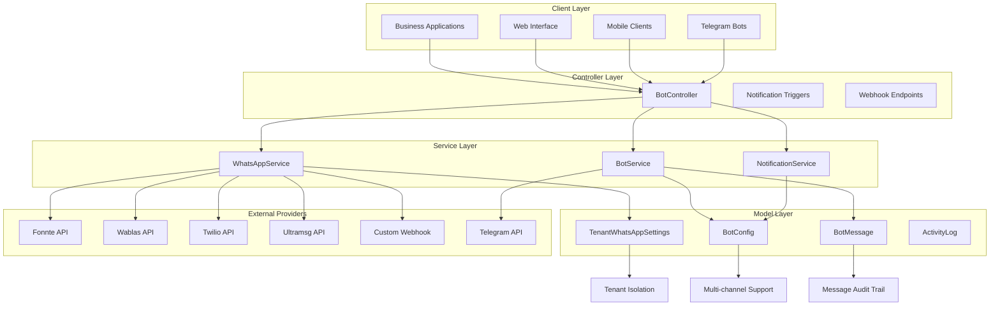
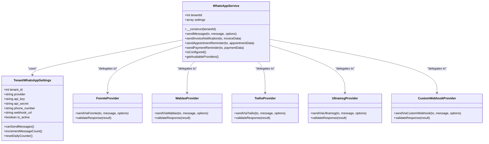
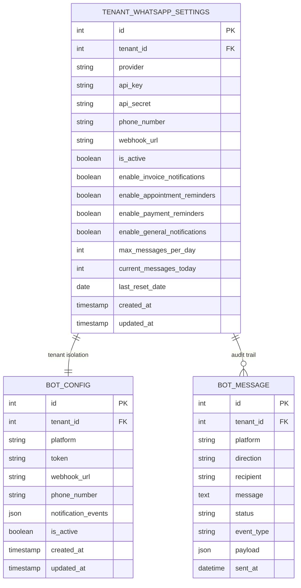
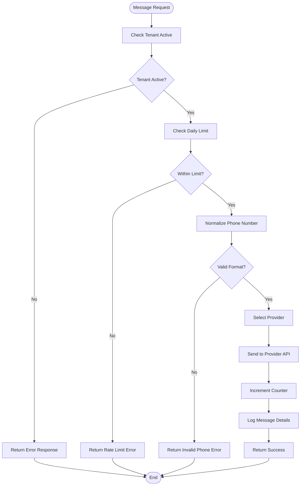
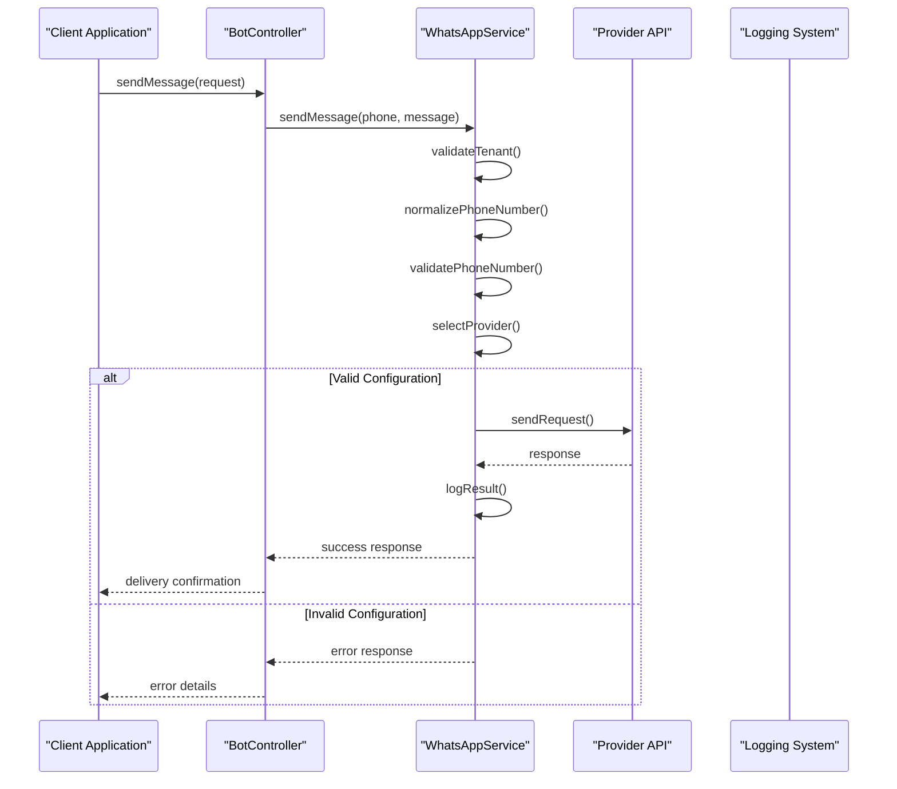
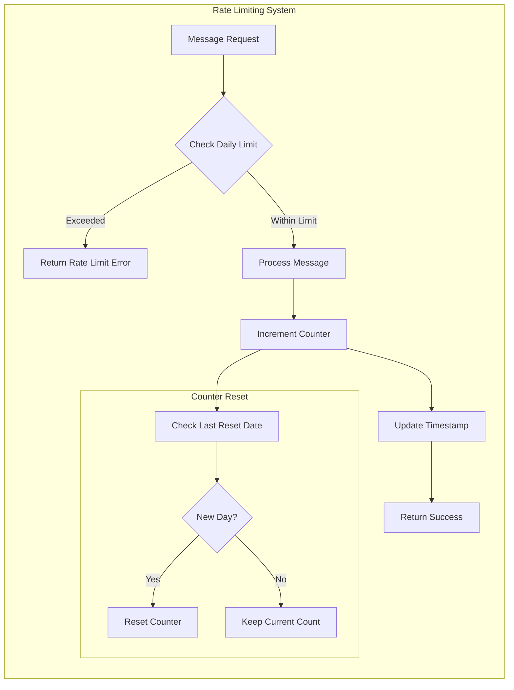
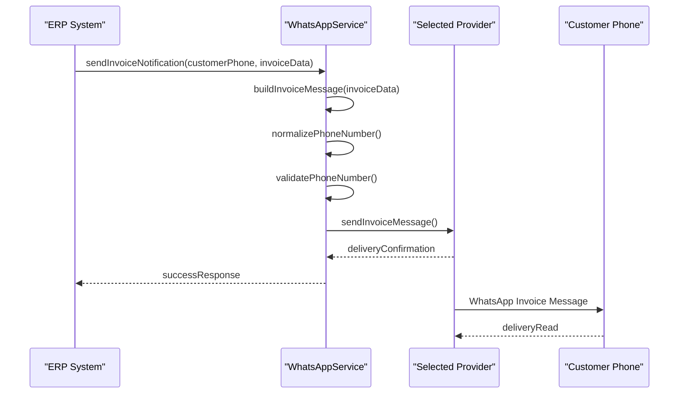

# WhatsApp Multi-Provider Integration

<cite>
**Referenced Files in This Document**
- [WhatsAppService.php](file://app/Services/WhatsAppService.php)
- [TenantWhatsAppSettings.php](file://app/Models/TenantWhatsAppSettings.php)
- [BotService.php](file://app/Services/BotService.php)
- [BotController.php](file://app/Http/Controllers/BotController.php)
- [BotConfig.php](file://app/Models/BotConfig.php)
- [BotMessage.php](file://app/Models/BotMessage.php)
- [2026_04_10_000003_create_tenant_whatsapp_settings_table.php](file://database/migrations/2026_04_10_000003_create_tenant_whatsapp_settings_table.php)
- [web.php](file://routes/web.php)
</cite>

## Update Summary
**Changes Made**
- Enhanced provider support matrix with comprehensive comparison table
- Added extensive rate limiting and monitoring capabilities
- Expanded automated notification system with business notifications
- Improved interactive customer service through enhanced bot functionality
- Updated provider implementation details with new features
- Enhanced troubleshooting guide with comprehensive diagnostic tools

## Table of Contents
1. [Introduction](#introduction)
2. [System Architecture](#system-architecture)
3. [Core Components](#core-components)
4. [Multi-Provider Support](#multi-provider-support)
5. [Tenant Configuration Management](#tenant-configuration-management)
6. [Message Processing Pipeline](#message-processing-pipeline)
7. [Provider Implementation Details](#provider-implementation-details)
8. [Rate Limiting and Monitoring](#rate-limiting-and-monitoring)
9. [Integration Examples](#integration-examples)
10. [Best Practices and Security](#best-practices-and-security)
11. [Troubleshooting Guide](#troubleshooting-guide)
12. [Conclusion](#conclusion)

## Introduction

The WhatsApp Multi-Provider Integration is a comprehensive messaging solution designed for multi-tenant applications, enabling seamless communication through various WhatsApp service providers. This system supports five distinct providers: Fonnte, Wablas, Twilio WhatsApp API, Ultramsg, and Custom Webhook, providing flexibility and redundancy for enterprise-grade messaging infrastructure.

The integration serves two primary use cases: automated business notifications (invoices, appointments, payments) and interactive customer service through WhatsApp Business API. Built with Laravel's modular architecture, it ensures scalability, maintainability, and tenant isolation while providing robust error handling and monitoring capabilities.

**Updated** Enhanced with comprehensive notification system including automated business notifications, appointment reminders, payment reminders, and interactive customer service through bot functionality.

## System Architecture

The WhatsApp integration follows a layered architecture pattern with clear separation of concerns:

**Diagram sources**
- [WhatsAppService.php:1-445](file://app/Services/WhatsAppService.php#L1-L445)
- [BotService.php:1-275](file://app/Services/BotService.php#L1-L275)
- [BotController.php:1-151](file://app/Http/Controllers/BotController.php#L1-L151)
- [TenantWhatsAppSettings.php:1-112](file://app/Models/TenantWhatsAppSettings.php#L1-L112)

The architecture ensures tenant isolation through dedicated configuration tables and provides multiple communication pathways for different business requirements.

## Core Components

### WhatsAppService Class

The central orchestrator for multi-provider WhatsApp messaging, implementing a provider-agnostic interface that abstracts the complexities of different API implementations.

**Key Features:**
- **Multi-Provider Support**: Unified interface for five different WhatsApp providers
- **Tenant Isolation**: Individual configuration per tenant with separate credentials
- **Message Templates**: Pre-built templates for invoices, appointments, and payments
- **Phone Number Validation**: International format normalization and validation
- **Error Handling**: Comprehensive error management with detailed logging

**Section sources**
- [WhatsAppService.php:20-124](file://app/Services/WhatsAppService.php#L20-L124)

### TenantWhatsAppSettings Model

Manages tenant-specific WhatsApp configurations with built-in rate limiting and feature toggles.

**Configuration Fields:**
- Provider selection (fonnte, wablas, twilio, ultramsg, custom)
- API credentials (key, secret, phone number)
- Feature enablement flags
- Rate limiting parameters
- Daily message counters

**Section sources**
- [TenantWhatsAppSettings.php:8-46](file://app/Models/TenantWhatsAppSettings.php#L8-L46)
- [2026_04_10_000003_create_tenant_whatsapp_settings_table.php:14-46](file://database/migrations/2026_04_10_000003_create_tenant_whatsapp_settings_table.php#L14-L46)

### BotService Class

Handles inbound WhatsApp messages and provides conversational AI capabilities through keyword-based command processing.

**Conversational Features:**
- Keyword-based command recognition
- Real-time business data queries
- Product search functionality
- Automated response generation
- Multi-platform support (Telegram + WhatsApp)

**Section sources**
- [BotService.php:24-64](file://app/Services/BotService.php#L24-L64)

## Multi-Provider Support

The integration supports five distinct WhatsApp providers, each optimized for specific use cases and regional requirements.

**Diagram sources**
- [WhatsAppService.php:106-124](file://app/Services/WhatsAppService.php#L106-L124)
- [TenantWhatsAppSettings.php:51-64](file://app/Models/TenantWhatsAppSettings.php#L51-L64)

### Enhanced Provider Comparison Matrix

| Provider | Best For | Authentication | Regional Support | Setup Complexity | Rate Limit | Features |
|----------|----------|----------------|------------------|------------------|------------|----------|
| **Fonnte** | Indonesia, Small Businesses | API Key | Indonesia, Malaysia | Low | 1000/day | Basic messaging, delivery status |
| **Wablas** | Enterprise, Custom Solutions | Token + Webhook | Indonesia | Medium | Configurable | Custom webhook, analytics |
| **Twilio** | Large Scale, Global | Account + Auth | Worldwide | High | 10000/day | Business API, compliance |
| **Ultramsg** | Southeast Asia | Instance + Token | Southeast Asia | Medium | 5000/day | Chat API, media support |
| **Custom** | Private APIs, Legacy Systems | Webhook URL | Any | Variable | Configurable | Flexible payloads |

**Section sources**
- [WhatsAppService.php:434-443](file://app/Services/WhatsAppService.php#L434-L443)

## Tenant Configuration Management

Each tenant maintains independent WhatsApp configurations through a dedicated settings table with comprehensive feature controls and rate limiting capabilities.

### Configuration Schema

**Diagram sources**
- [2026_04_10_000003_create_tenant_whatsapp_settings_table.php:16-42](file://database/migrations/2026_04_10_000003_create_tenant_whatsapp_settings_table.php#L16-L42)
- [BotConfig.php:9-21](file://app/Models/BotConfig.php#L9-L21)
- [BotMessage.php:9-18](file://app/Models/BotMessage.php#L9-L18)

### Enhanced Rate Limiting Implementation

The system implements intelligent rate limiting with daily reset functionality and comprehensive monitoring:

**Diagram sources**
- [TenantWhatsAppSettings.php:83-96](file://app/Models/TenantWhatsAppSettings.php#L83-L96)
- [WhatsAppService.php:84-124](file://app/Services/WhatsAppService.php#L84-L124)

**Section sources**
- [TenantWhatsAppSettings.php:68-96](file://app/Models/TenantWhatsAppSettings.php#L68-L96)

## Message Processing Pipeline

The integration processes messages through a structured pipeline that handles validation, routing, and delivery across multiple providers.

### Outbound Message Flow

**Diagram sources**
- [BotController.php:99-149](file://app/Http/Controllers/BotController.php#L99-L149)
- [WhatsAppService.php:84-124](file://app/Services/WhatsAppService.php#L84-L124)

### Inbound Message Processing

The system handles inbound WhatsApp messages through webhook endpoints with automatic tenant identification and response generation.

**Section sources**
- [BotController.php:100-149](file://app/Http/Controllers/BotController.php#L100-L149)
- [BotService.php:50-64](file://app/Services/BotService.php#L50-L64)

## Provider Implementation Details

### Fonnte Integration

Fonnte provides the simplest integration for Indonesian markets with minimal setup requirements.

**Implementation Features:**
- Basic API key authentication
- Direct message sending endpoint
- Real-time delivery status
- Comprehensive error reporting

**Section sources**
- [WhatsAppService.php:158-185](file://app/Services/WhatsAppService.php#L158-L185)

### Wablas Integration

Wablas offers enterprise-grade features with customizable webhook URLs and advanced message routing.

**Key Capabilities:**
- Custom webhook URL configuration
- Enhanced message validation
- Detailed delivery analytics
- Multi-device support

**Section sources**
- [WhatsAppService.php:190-215](file://app/Services/WhatsAppService.php#L190-L215)

### Twilio WhatsApp API

Twilio provides global scale with comprehensive compliance features and advanced analytics.

**Enterprise Features:**
- Full WhatsApp Business API compliance
- Advanced analytics and insights
- Multi-region deployment
- Enterprise security features

**Section sources**
- [WhatsAppService.php:220-250](file://app/Services/WhatsAppService.php#L220-L250)

### Ultramsg Integration

Ultramsg focuses on Southeast Asian markets with competitive pricing and local support.

**Regional Advantages:**
- Optimized for Southeast Asian networks
- Competitive pricing structure
- Local customer support
- Regional compliance features

**Section sources**
- [WhatsAppService.php:255-283](file://app/Services/WhatsAppService.php#L255-L283)

### Custom Webhook Implementation

Flexible webhook integration for proprietary systems and legacy infrastructure.

**Customization Options:**
- Arbitrary webhook URL configuration
- Custom payload formatting
- Flexible response handling
- Extensible architecture

**Section sources**
- [WhatsAppService.php:288-322](file://app/Services/WhatsAppService.php#L288-L322)

## Rate Limiting and Monitoring

The system implements comprehensive rate limiting and monitoring to ensure reliable operation across all providers.

### Daily Rate Limiting

**Diagram sources**
- [TenantWhatsAppSettings.php:68-96](file://app/Models/TenantWhatsAppSettings.php#L68-L96)

### Enhanced Message Template System

Pre-built templates ensure consistent messaging across all provider integrations:

**Available Templates:**
- **Invoice Notifications**: Professional billing statements with payment details
- **Appointment Reminders**: Doctor/patient scheduling confirmations
- **Payment Reminders**: Overdue account notifications with due dates

**Section sources**
- [WhatsAppService.php:129-151](file://app/Services/WhatsAppService.php#L129-L151)
- [WhatsAppService.php:329-398](file://app/Services/WhatsAppService.php#L329-L398)

## Integration Examples

### Automated Invoice Notifications

The system automatically generates and sends professional invoice notifications to customers:

**Diagram sources**
- [WhatsAppService.php:129-133](file://app/Services/WhatsAppService.php#L129-L133)
- [WhatsAppService.php:329-346](file://app/Services/WhatsAppService.php#L329-L346)

### Interactive Customer Service

The BotService enables conversational interactions through keyword-based commands:

**Supported Commands:**
- `/start` or `/help` - Display available commands
- `omzet` - Show today's revenue statistics
- `stok` - List low-stock products
- `invoice` - Display overdue invoices
- `customer` - Show total active customers
- `order` - Display pending orders
- `cari [keyword]` - Search for products

**Section sources**
- [BotService.php:72-166](file://app/Services/BotService.php#L72-L166)

## Best Practices and Security

### Security Implementation

The integration follows industry best practices for secure API communication:

**Security Measures:**
- **API Key Management**: Environment-based credential storage
- **Request Validation**: Comprehensive input sanitization
- **Error Handling**: Generic error responses to prevent information leakage
- **Logging**: Structured logging with sensitive data redaction
- **Rate Limiting**: Prevent abuse and ensure fair usage

### Performance Optimization

**Optimization Strategies:**
- **Connection Pooling**: Reuse HTTP connections for multiple requests
- **Asynchronous Processing**: Non-blocking message delivery
- **Caching**: Frequently accessed configuration caching
- **Retry Logic**: Intelligent retry mechanisms with exponential backoff

### Enhanced Monitoring and Analytics

**Monitoring Features:**
- **Delivery Tracking**: Real-time message status monitoring
- **Provider Metrics**: Performance analytics per provider
- **Error Analytics**: Comprehensive error tracking and reporting
- **Usage Analytics**: Message volume and pattern analysis
- **Audit Trail**: Complete message history with timestamps

## Troubleshooting Guide

### Common Issues and Solutions

**Configuration Problems:**
- **Issue**: "WhatsApp belum dikonfigurasi" (WhatsApp not configured)
- **Solution**: Verify tenant settings in `tenant_whatsapp_settings` table
- **Checklist**: API key present, provider selected, tenant active

**Phone Number Validation Failures:**
- **Issue**: Invalid phone number format
- **Solution**: Ensure numbers follow international format (62xxxxxxxxxx)
- **Validation**: Numbers starting with 0 are automatically converted to 62

**Provider API Errors:**
- **Fonnte**: Check API key validity and account balance
- **Wablas**: Verify webhook URL accessibility and token permissions
- **Twilio**: Confirm account verification and phone number registration
- **Ultramsg**: Validate instance ID and token configuration

**Rate Limit Exceeded:**
- **Issue**: Daily message limit reached
- **Solution**: Wait until next reset or upgrade plan
- **Monitoring**: Check `current_messages_today` and `last_reset_date`

### Enhanced Debugging Tools

**Diagnostic Commands:**
- **Configuration Check**: `TenantWhatsAppSettings::isConfigured($tenantId)`
- **Provider Test**: Manual API call to selected provider endpoint
- **Rate Limit Status**: `TenantWhatsAppSettings::canSendMessages()`
- **Message History**: Review `BotMessage` table for delivery logs
- **Activity Log**: Check `ActivityLog` for bot configuration changes

**Section sources**
- [WhatsAppService.php:86-123](file://app/Services/WhatsAppService.php#L86-L123)
- [TenantWhatsAppSettings.php:59-63](file://app/Models/TenantWhatsAppSettings.php#L59-L63)

## Conclusion

The WhatsApp Multi-Provider Integration delivers a robust, scalable solution for enterprise messaging needs. Its multi-tenant architecture ensures isolation and security while the provider-agnostic design provides flexibility and redundancy. The comprehensive feature set, including automated notifications, conversational AI, and advanced analytics, makes it suitable for organizations of all sizes.

Key strengths include:
- **Multi-Provider Support**: Five distinct providers for optimal regional coverage
- **Tenant Isolation**: Secure, independent configurations per tenant
- **Comprehensive Monitoring**: Real-time analytics and error tracking
- **Scalable Architecture**: Designed for high-volume, enterprise-grade usage
- **Flexible Integration**: Custom webhook support for proprietary systems
- **Enhanced Rate Limiting**: Intelligent message control with daily resets
- **Interactive Bot Service**: Multi-platform customer service automation

The system's modular design and extensive documentation make it easily maintainable and extensible for future requirements. Organizations can confidently deploy this integration knowing they have a reliable foundation for WhatsApp-based customer communications.