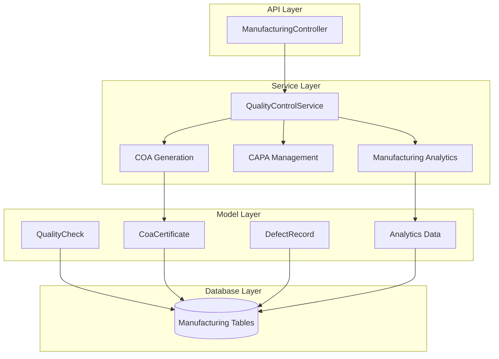
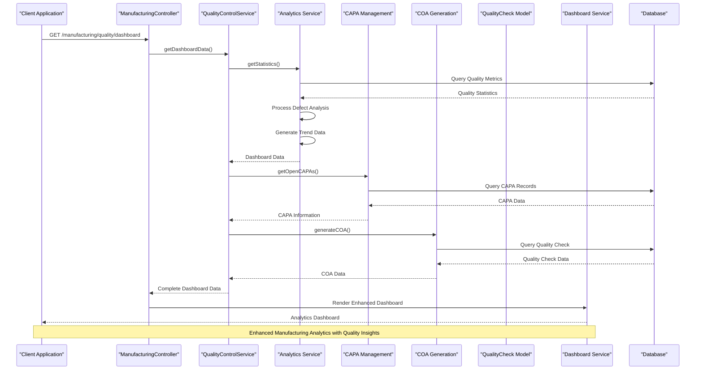
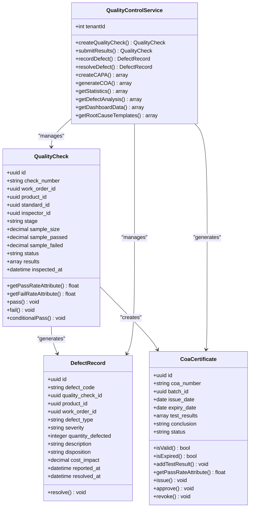
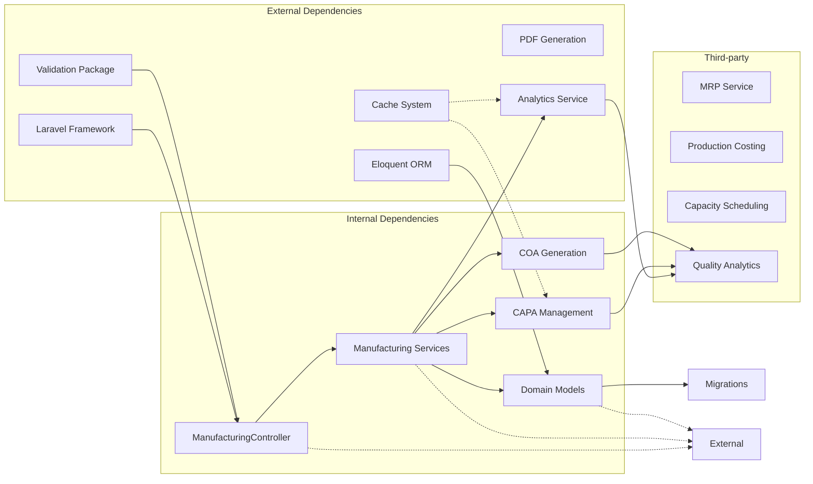

# Manufacturing Module

<cite>
**Referenced Files in This Document**
- [2026_03_25_000001_create_manufacturing_tables.php](file://database/migrations/2026_03_25_000001_create_manufacturing_tables.php)
- [ManufacturingController.php](file://app/Http/Controllers/ManufacturingController.php)
- [QualityControlService.php](file://app/Services/Manufacturing/QualityControlService.php)
- [CoaCertificate.php](file://app/Models/CoaCertificate.php)
- [QualityCheck.php](file://app/Models/QualityCheck.php)
</cite>

## Update Summary
**Changes Made**
- Enhanced QualityControlService with comprehensive COA (Certificate of Analysis) generation capabilities
- Added batch processing support for production tracking and quality assurance workflows
- Integrated CAPA (Corrective and Preventive Action) management system with root cause analysis templates
- Expanded quality control standards with advanced analytics and dashboard enhancements
- Added COA certificate model for regulatory compliance documentation
- Enhanced work order progress tracking with batch-based production metrics
- Implemented comprehensive manufacturing analytics and quality assurance capabilities

## Table of Contents
1. [Introduction](#introduction)
2. [Project Structure](#project-structure)
3. [Core Components](#core-components)
4. [Architecture Overview](#architecture-overview)
5. [Detailed Component Analysis](#detailed-component-analysis)
6. [Enhanced Quality Assurance Workflows](#enhanced-quality-assurance-workflows)
7. [COA Generation and Regulatory Compliance](#coa-generation-and-regulatory-compliance)
8. [Batch Processing and Production Tracking](#batch-processing-and-production-tracking)
9. [Manufacturing Analytics and Dashboard Enhancements](#manufacturing-analytics-and-dashboard-enhancements)
10. [Dependency Analysis](#dependency-analysis)
11. [Performance Considerations](#performance-considerations)
12. [Troubleshooting Guide](#troubleshooting-guide)
13. [Conclusion](#conclusion)

## Introduction
The Manufacturing Module is a comprehensive production management system integrated into the qalcuityERP platform. This module provides end-to-end manufacturing capabilities including Bill of Materials (BOM) management, Work Order processing, Quality Control, and Work Center capacity planning. The system supports complex multi-level BOM structures, detailed work order routing, automated material requirements planning (MRP), and real-time production tracking.

**Updated** The module now features enhanced manufacturing capabilities with comprehensive quality assurance workflows, COA (Certificate of Analysis) generation, and production tracking systems with batch processing support. The QualityControlService has been significantly expanded to include regulatory compliance documentation, CAPA management, and advanced root cause analysis capabilities. The manufacturing analytics system now includes enhanced dashboard capabilities with comprehensive quality metrics and trend analysis.

The module follows enterprise-grade design patterns with tenant isolation, comprehensive validation, and extensible service architecture. It integrates seamlessly with the broader ERP ecosystem while maintaining manufacturing-specific functionality for production planning, quality assurance, and capacity management.

## Project Structure
The manufacturing module is organized into several key architectural layers:

**Diagram sources**
- [ManufacturingController.php:1000-1065](file://app/Http/Controllers/ManufacturingController.php#L1000-L1065)
- [QualityControlService.php:1-515](file://app/Services/Manufacturing/QualityControlService.php#L1-L515)
- [CoaCertificate.php:1-165](file://app/Models/CoaCertificate.php#L1-L165)

**Section sources**
- [2026_03_25_000001_create_manufacturing_tables.php:1-93](file://database/migrations/2026_03_25_000001_create_manufacturing_tables.php#L1-L93)

## Core Components

### Database Schema Architecture
The manufacturing module implements a robust relational database structure designed for complex production scenarios:

**Primary Entities:**
- **BOM Management**: Hierarchical bill of materials supporting multi-level product structures
- **Work Centers**: Manufacturing stations with capacity planning and cost tracking
- **Work Orders**: Production scheduling with detailed routing and status tracking
- **Quality Control**: Comprehensive inspection and defect management system
- **COA Certificates**: Regulatory compliance documentation for quality assurance
- **Quality Standards**: Standardized inspection protocols and acceptance criteria
- **Analytics Data**: Manufacturing performance metrics and quality statistics

**Key Database Features:**
- Tenant isolation for multi-tenant deployments
- Foreign key constraints ensuring data integrity
- Index optimization for frequently queried fields
- Decimal precision for accurate quantity calculations
- JSON field support for flexible quality check results

**Section sources**
- [2026_03_25_000001_create_manufacturing_tables.php:11-91](file://database/migrations/2026_03_25_000001_create_manufacturing_tables.php#L11-L91)

### Enhanced API Controller Implementation
The ManufacturingController serves as the primary interface for manufacturing operations, implementing comprehensive CRUD functionality with advanced filtering and pagination capabilities.

**Core API Endpoints:**
- Work Order Management: Creation, status updates, and detailed reporting
- BOM Operations: Multi-level bill of materials with explosion capabilities
- Quality Control: Inspection protocols, defect tracking, and COA generation
- Production Reporting: Output tracking, capacity utilization, and batch processing
- Regulatory Compliance: COA certificate management and quality documentation
- CAPA Management: Corrective and preventive action tracking
- Analytics Dashboard: Comprehensive manufacturing insights and metrics

**Advanced Features:**
- Tenant-aware queries with automatic filtering
- Comprehensive input validation with custom rules
- Pagination support for large datasets
- Relationship loading with eager loading optimization
- Batch processing capabilities for production workflows
- Real-time analytics and dashboard data aggregation

**Section sources**
- [ManufacturingController.php:26-1065](file://app/Http/Controllers/ManufacturingController.php#L26-L1065)

### Enhanced Service Layer Architecture
The service layer provides specialized business logic implementations with comprehensive quality assurance capabilities:

**Quality Control Service**: Manages inspection protocols, defect classification, compliance tracking, COA generation, and advanced analytics
**CAPA Management**: Handles corrective and preventive action workflows with root cause analysis templates
**Analytics Service**: Provides comprehensive manufacturing insights, trend analysis, and performance metrics
**COA Generation**: Creates regulatory-compliant certificates with digital signature support

**Service Characteristics:**
- Dependency injection for testability and maintainability
- Exception handling for robust error management
- Transaction boundaries for data consistency
- Extensible design for future enhancements
- Cache integration for performance optimization
- Real-time analytics and dashboard data aggregation

**Section sources**
- [QualityControlService.php:1-515](file://app/Services/Manufacturing/QualityControlService.php#L1-L515)

## Architecture Overview

**Diagram sources**
- [ManufacturingController.php:998-1004](file://app/Http/Controllers/ManufacturingController.php#L998-L1004)
- [QualityControlService.php:456-505](file://app/Services/Manufacturing/QualityControlService.php#L456-L505)

The architecture follows clean separation of concerns with clear boundaries between presentation, business logic, and data access layers. The modular design enables independent development, testing, and deployment of manufacturing components with enhanced quality assurance capabilities and comprehensive analytics.

## Detailed Component Analysis

### Enhanced Quality Control Management System

**Diagram sources**
- [QualityCheck.php:1-138](file://app/Models/QualityCheck.php#L1-L138)
- [CoaCertificate.php:1-165](file://app/Models/CoaCertificate.php#L1-L165)
- [QualityControlService.php:1-515](file://app/Services/Manufacturing/QualityControlService.php#L1-L515)

The quality control system implements a comprehensive inspection workflow with defect tracking, disposition management, corrective action workflows, and CAPA (Corrective and Preventive Action) management. The system now includes integrated regulatory compliance documentation through COA generation and advanced analytics capabilities.

**Section sources**
- [QualityCheck.php:1-138](file://app/Models/QualityCheck.php#L1-L138)
- [CoaCertificate.php:1-165](file://app/Models/CoaCertificate.php#L1-L165)
- [QualityControlService.php:1-515](file://app/Services/Manufacturing/QualityControlService.php#L1-L515)

### Enhanced Quality Control Standards and Templates

The QualityControlService now includes comprehensive quality check standards with predefined templates for various inspection types:

**Supported Root Cause Analysis Templates:**
- **5 Whys Analysis**: Iterative interrogative technique for exploring cause-and-effect relationships
- **Fishbone Diagram**: Cause-and-effect diagram for quality problems categorizing causes
- **Fault Tree Analysis**: Top-down deductive failure analysis for systematic problem identification
- **FMEA (Failure Mode and Effects Analysis)**: Systematic approach for identifying potential failures with risk assessment

**Quality Check Stages:**
- **Incoming**: Raw material inspection and initial quality verification
- **In Process**: Mid-production quality checkpoints during manufacturing
- **Final**: Final product inspection before packaging and shipment

**Section sources**
- [QualityControlService.php:329-388](file://app/Services/Manufacturing/QualityControlService.php#L329-L388)

### CAPA (Corrective and Preventive Action) Management

The system now includes comprehensive CAPA management for quality improvement initiatives:

**CAPA Types:**
- **Corrective Actions**: Immediate fixes for identified quality issues
- **Preventive Actions**: Proactive measures to prevent future quality problems

**CAPA Lifecycle:**
1. **Identification**: Quality issues and non-conformances are identified
2. **Root Cause Analysis**: Systematic investigation using supported templates
3. **Action Planning**: Development of corrective and preventive measures
4. **Implementation**: Execution of planned actions
5. **Verification**: Confirmation of effectiveness
6. **Closure**: Documentation and archiving of completed CAPA

**Section sources**
- [QualityControlService.php:289-324](file://app/Services/Manufacturing/QualityControlService.php#L289-L324)

## Enhanced Quality Assurance Workflows

### Quality Control Standards and Templates

The QualityControlService now includes comprehensive quality check standards with predefined templates for various inspection types:

**Supported Root Cause Analysis Templates:**
- **5 Whys Analysis**: Iterative interrogative technique for exploring cause-and-effect relationships
- **Fishbone Diagram**: Cause-and-effect diagram for quality problems categorizing causes
- **Fault Tree Analysis**: Top-down deductive failure analysis for systematic problem identification
- **FMEA (Failure Mode and Effects Analysis)**: Systematic approach for identifying potential failures with risk assessment

**Quality Check Stages:**
- **Incoming**: Raw material inspection and initial quality verification
- **In Process**: Mid-production quality checkpoints during manufacturing
- **Final**: Final product inspection before packaging and shipment

**Section sources**
- [QualityControlService.php:329-388](file://app/Services/Manufacturing/QualityControlService.php#L329-L388)

### CAPA (Corrective and Preventive Action) Management

The system now includes comprehensive CAPA management for quality improvement initiatives:

**CAPA Types:**
- **Corrective Actions**: Immediate fixes for identified quality issues
- **Preventive Actions**: Proactive measures to prevent future quality problems

**CAPA Lifecycle:**
1. **Identification**: Quality issues and non-conformances are identified
2. **Root Cause Analysis**: Systematic investigation using supported templates
3. **Action Planning**: Development of corrective and preventive measures
4. **Implementation**: Execution of planned actions
5. **Verification**: Confirmation of effectiveness
6. **Closure**: Documentation and archiving of completed CAPA

**Section sources**
- [QualityControlService.php:289-324](file://app/Services/Manufacturing/QualityControlService.php#L289-L324)

## COA Generation and Regulatory Compliance

### Certificate of Analysis (COA) System

The QualityControlService now provides comprehensive COA generation capabilities for regulatory compliance:

**COA Generation Features:**
- **Automated COA Creation**: Generation of certificates for passed and conditionally passed quality checks
- **Regulatory Compliance**: Structured documentation meeting industry standards
- **Batch Traceability**: Direct linkage between COAs and production batches
- **Digital Signature Support**: Authorized by and signature date tracking

**COA Content Structure:**
- **Header Information**: COA number, product details, batch information
- **Inspection Details**: Inspector information, inspection date, testing parameters
- **Test Results**: Comprehensive test result documentation with pass/fail status
- **Summary Statistics**: Overall pass rates, defect counts, and quality metrics
- **Conclusion**: Regulatory-compliant conclusion statement
- **Authorization**: Authorized by and signature date information

**COA Status Management:**
- **Draft**: Initial COA creation
- **Issued**: COA issued for review
- **Approved**: COA approved for regulatory compliance
- **Revoked**: COA revoked with reason documentation

**Section sources**
- [QualityControlService.php:393-451](file://app/Services/Manufacturing/QualityControlService.php#L393-L451)

### COA Certificate Model

The CoaCertificate model provides dedicated functionality for COA management:

**Key Features:**
- **Status Tracking**: Complete lifecycle management from draft to approved/revoked
- **Validity Checking**: Automatic expiration date validation and status determination
- **Test Result Integration**: Direct linkage to quality test results
- **Batch Association**: Connection to specific production batches
- **Search Optimization**: Efficient querying by status, batch, and date ranges

**COA Number Generation:**
- **Format**: COA-YYYY-XXXX where YYYY is year and XXXX is sequential number
- **Automatic Generation**: Unique numbering within calendar year
- **Audit Trail**: Complete history of COA modifications and approvals

**Section sources**
- [CoaCertificate.php:1-165](file://app/Models/CoaCertificate.php#L1-L165)

## Batch Processing and Production Tracking

### Enhanced Work Order Progress Tracking

The WorkOrder model now includes comprehensive batch processing capabilities:

**Progress Tracking Enhancements:**
- **Batch-Based Metrics**: Tracking of good units, reject units, and scrap quantities per batch
- **Yield Rate Calculation**: Automated calculation of production efficiency (good/(good+reject))
- **Cost Per Unit Tracking**: Calculation of cost per good unit produced
- **Waste Cost Integration**: Comprehensive tracking of scrap and rework costs

**Progress Stage Automation:**
- **Setup Phase**: 0-25% progress based on initial production activities
- **Processing Phase**: 25-75% progress during main production operations
- **Finishing Phase**: 75-99% progress for final operations
- **Quality Control Phase**: 99%+ progress indicating completion and quality verification

**Quality Integration:**
- **Quality Status Tracking**: Dedicated quality status fields (passed, failed, conditional_pass)
- **Quality Timestamps**: Recording of quality check completion dates
- **Work Order Updates**: Automatic quality status updates based on quality check results

**Section sources**
- [QualityCheck.php:80-120](file://app/Models/QualityCheck.php#L80-L120)

### Production Output and Batch Management

The system now supports comprehensive batch processing with detailed output tracking:

**Production Output Features:**
- **Multiple Output Tracking**: Recording of good units, reject units, and rework quantities
- **Batch-Specific Metrics**: Separate tracking for different production batches
- **Yield Optimization**: Real-time monitoring of production efficiency
- **Cost Allocation**: Accurate cost tracking per batch and per unit

**Batch Processing Benefits:**
- **Traceability**: Complete traceability from raw materials to finished products
- **Quality Control**: Batch-specific quality testing and certification
- **Regulatory Compliance**: Support for FDA, ISO, and other regulatory requirements
- **Analytics**: Comprehensive reporting on batch performance and quality metrics

**Section sources**
- [QualityCheck.php:122-136](file://app/Models/QualityCheck.php#L122-L136)

## Manufacturing Analytics and Dashboard Enhancements

### Enhanced Quality Control Dashboard

The ManufacturingController now provides comprehensive analytics through the enhanced quality control dashboard:

**Dashboard Features:**
- **Real-time Statistics**: Live quality metrics and performance indicators
- **Defect Analysis**: Comprehensive defect type and severity breakdown
- **Trend Analysis**: Historical quality trends and improvement tracking
- **CAPA Monitoring**: Open corrective and preventive action tracking
- **Recent Activity**: Latest quality checks and defect resolutions

**Analytics Capabilities:**
- **Quality Metrics**: Pass rates, fail rates, and overall quality performance
- **Defect Patterns**: Analysis of defect types, severities, and frequency
- **Production Trends**: Quality trends over time with statistical analysis
- **Resource Utilization**: Quality control resource allocation and efficiency

**Section sources**
- [ManufacturingController.php:998-1004](file://app/Http/Controllers/ManufacturingController.php#L998-L1004)
- [QualityControlService.php:456-505](file://app/Services/Manufacturing/QualityControlService.php#L456-L505)

### Advanced Analytics and Reporting

The system now includes comprehensive manufacturing analytics with:

**Performance Metrics:**
- **Quality Performance Indicators**: Real-time quality metrics and KPIs
- **Defect Cost Analysis**: Comprehensive cost impact analysis of quality issues
- **Production Efficiency**: Yield optimization and waste reduction tracking
- **Resource Optimization**: Quality control resource utilization and efficiency

**Reporting Capabilities:**
- **Customizable Dashboards**: Configurable analytics views and metrics
- **Export Functionality**: Comprehensive data export for external analysis
- **Alert Systems**: Automated notifications for quality thresholds and exceptions
- **Integration Points**: API endpoints for external analytics and BI tools

**Section sources**
- [QualityControlService.php:188-268](file://app/Services/Manufacturing/QualityControlService.php#L188-L268)

## Dependency Analysis

**Diagram sources**
- [ManufacturingController.php:10](file://app/Http/Controllers/ManufacturingController.php#L10)
- [QualityControlService.php:456-505](file://app/Services/Manufacturing/QualityControlService.php#L456-L505)

The manufacturing module demonstrates excellent dependency management with clear separation between internal components and external frameworks. The service layer abstracts complex business logic while maintaining loose coupling with underlying infrastructure. The addition of COA generation, CAPA management, and comprehensive analytics introduces new dependencies for PDF generation, caching mechanisms, and advanced analytics processing.

**Section sources**
- [ManufacturingController.php:10](file://app/Http/Controllers/ManufacturingController.php#L10)

## Performance Considerations

### Database Optimization Strategies
- **Indexing Strategy**: Strategic indexing on frequently queried fields including tenant_id, product_id, status filters, and COA numbers
- **Query Optimization**: Eager loading of relationships to minimize N+1 query problems, especially for COA and quality check relationships
- **Pagination Implementation**: Built-in pagination for large datasets to prevent memory issues
- **Decimal Precision**: Careful decimal field sizing to prevent precision loss in calculations
- **JSON Field Optimization**: Efficient storage and querying of quality check results and test parameters
- **Cache Strategy**: Comprehensive caching for dashboard data, quality statistics, and analytics reports

### Service Layer Performance
- **Caching Opportunities**: Extensive caching for COA dashboard data, quality statistics, and defect analysis reports
- **Batch Processing**: Support for bulk operations on work orders, quality checks, and COA generation
- **Asynchronous Processing**: Background job integration for heavy computations like MRP calculations and COA PDF generation
- **Cache Management**: Intelligent cache invalidation for quality control data and dashboard metrics
- **Analytics Optimization**: Efficient data aggregation and trend analysis for real-time dashboard updates

### Scalability Considerations
- **Tenant Isolation**: Efficient multi-tenant implementation with proper indexing and COA number generation
- **Horizontal Scaling**: Stateless API design enabling load balancing for manufacturing operations
- **Database Sharding**: Potential for sharding based on tenant_id for large deployments
- **COA Storage**: Optimized storage strategies for regulatory compliance documentation
- **Analytics Scaling**: Distributed analytics processing for large-scale manufacturing operations

## Troubleshooting Guide

### Common Issues and Solutions

**Work Order Creation Failures**
- Verify BOM association exists and is active
- Check product availability and inventory levels
- Validate date range conflicts with existing work orders
- Ensure proper tenant context in API requests
- Confirm batch processing configuration for new work orders

**BOM Explosion Errors**
- Confirm recursive BOM references don't create circular dependencies
- Verify unit conversions are properly defined
- Check batch size calculations for accuracy
- Validate child BOM relationships

**Quality Control Problems**
- Ensure inspection checklist items match product specifications
- Verify defect classification codes are valid
- Check inspector permissions and authentication
- Validate disposition assignments follow company policy
- Confirm quality check stage alignment with work order status
- Verify COA generation requires passed or conditional_pass status

**COA Generation Issues**
- Verify quality check status allows COA generation (must be passed or conditional_pass)
- Check COA template configuration and parameter requirements
- Ensure proper authorization and approval workflows
- Validate batch information linkage for COA creation
- Confirm COA number generation and unique constraint handling

**CAPA Management Problems**
- Verify root cause analysis template selection matches issue type
- Check responsible person assignment and authority levels
- Ensure target dates are reasonable and tracked properly
- Validate CAPA status transitions and closure requirements

**Analytics Dashboard Issues**
- Monitor cache performance and invalidation patterns for quality control data
- Check database query execution times for analytics queries
- Verify dashboard data refresh intervals and cache settings
- Ensure proper indexing for analytics queries

**Performance Issues**
- Monitor database query execution times, especially for COA and quality check queries
- Check for missing indexes on frequently filtered columns including COA status and batch numbers
- Review API response sizes and optimize payload structure
- Consider implementing result caching for static data and dashboard metrics
- Monitor cache hit ratios for quality control statistics and COA data

### Debugging Tools and Techniques
- Enable Laravel debug mode for detailed error reporting
- Use database query logging to identify performance bottlenecks
- Implement structured logging for manufacturing workflows and quality control processes
- Utilize Laravel Telescope for API request/response analysis
- Monitor cache performance and invalidation patterns for quality control data
- Implement analytics logging for dashboard and reporting performance

**Section sources**
- [ManufacturingController.php:46-64](file://app/Http/Controllers/ManufacturingController.php#L46-L64)
- [QualityControlService.php:398-400](file://app/Services/Manufacturing/QualityControlService.php#L398-L400)

## Conclusion

The Manufacturing Module represents a sophisticated production management system built with enterprise-grade architecture and comprehensive functionality. The recent enhancements significantly expand the module's capabilities in quality assurance, regulatory compliance, and production tracking.

**Technical Excellence:**
- Robust database design supporting multi-level BOM structures and batch processing
- Clean service layer architecture with proper separation of concerns
- Comprehensive API coverage with tenant isolation, validation, and COA generation
- Extensible design supporting future enhancements and regulatory compliance requirements
- Advanced analytics and dashboard capabilities for manufacturing insights

**Enhanced Business Value:**
- End-to-end production management from planning to completion with integrated quality control
- Advanced quality assurance workflows with CAPA management and root cause analysis
- Comprehensive regulatory compliance through COA generation and batch traceability
- Automated material requirements planning with batch-based production metrics
- Real-time production tracking with yield optimization and cost per unit calculations
- Comprehensive manufacturing analytics with trend analysis and performance metrics

**Integration Capabilities:**
- Seamless integration with broader ERP ecosystem and quality management systems
- Modular design enabling independent deployment of manufacturing and quality control components
- Extensible service architecture for customizations and industry-specific requirements
- Comprehensive reporting and analytics support for quality metrics and production efficiency
- Advanced dashboard capabilities with real-time analytics and performance monitoring

**Regulatory Compliance:**
- Full COA generation capabilities meeting industry standards
- Batch traceability for complete product lifecycle documentation
- CAPA management for continuous quality improvement
- Quality check standardization with multiple root cause analysis templates
- Comprehensive analytics for regulatory reporting and compliance tracking

**Advanced Analytics:**
- Real-time quality metrics and performance indicators
- Comprehensive defect analysis and trend reporting
- CAPA monitoring and corrective action tracking
- Production efficiency optimization and resource utilization analysis
- Predictive analytics for quality improvement and process optimization

The module provides a solid foundation for manufacturing operations while maintaining flexibility for future enhancements and industry-specific customizations. Its enterprise-grade design ensures scalability, reliability, and maintainability for growing manufacturing organizations with comprehensive quality assurance and regulatory compliance requirements.

**Updated** The enhanced QualityControlService with COA generation, batch processing support, CAPA management, and comprehensive analytics transforms the manufacturing module into a comprehensive quality assurance platform suitable for regulated industries and complex production environments with advanced manufacturing insights and real-time performance monitoring.