# Notification Digest Service

<cite>
**Referenced Files in This Document**
- [NotificationDigestService.php](file://app/Services/NotificationDigestService.php)
- [NotificationEscalationService.php](file://app/Services/NotificationEscalationService.php)
- [SendNotificationDigest.php](file://app/Console/Commands/SendNotificationDigest.php)
- [ProcessNotificationEscalations.php](file://app/Console/Commands/ProcessNotificationEscalations.php)
- [NotificationDigestEmail.php](file://app/Notifications/NotificationDigestEmail.php)
- [NotificationEscalation.php](file://app/Models/NotificationEscalation.php)
- [ErpNotification.php](file://app/Models/ErpNotification.php)
- [NotificationPreference.php](file://app/Models/NotificationPreference.php)
- [2026_04_02_100002_create_notification_preferences_table.php](file://database/migrations/2026_04_02_100002_create_notification_preferences_table.php)
- [2026_04_10_000001_update_notification_preferences_add_channels.php](file://database/migrations/2026_04_10_000001_update_notification_preferences_add_channels.php)
- [2026_04_10_000002_create_notification_escalations_table.php](file://database/migrations/2026_04_10_000002_create_notification_escalations_table.php)
</cite>

## Update Summary
**Changes Made**
- Added comprehensive notification escalation system with three-tier escalation levels
- Enhanced notification preference model with multi-channel support (email, push, WhatsApp)
- Expanded digest functionality with improved statistics and user-specific processing
- Added quiet hours and Do Not Disturb (DND) support for intelligent notification delivery
- Integrated push notification service for real-time notification delivery
- Enhanced database schema with notification escalation tracking

## Table of Contents
1. [Introduction](#introduction)
2. [Project Structure](#project-structure)
3. [Core Components](#core-components)
4. [Architecture Overview](#architecture-overview)
5. [Detailed Component Analysis](#detailed-component-analysis)
6. [Enhanced Notification System](#enhanced-notification-system)
7. [Multi-Channel Notification Support](#multi-channel-notification-support)
8. [Dependency Analysis](#dependency-analysis)
9. [Performance Considerations](#performance-considerations)
10. [Troubleshooting Guide](#troubleshooting-guide)
11. [Conclusion](#conclusion)

## Introduction

The Notification Digest Service is a comprehensive notification management system integrated into the Qalcuity ERP platform. This service provides automated email summaries of user notifications, supporting daily and weekly digest frequencies with intelligent grouping by functional modules and priority levels. The system has been significantly enhanced with a three-tier escalation system, multi-channel notification support, and intelligent delivery scheduling.

The service operates on a tenant-aware architecture, supporting multi-tenant deployments with individual notification preferences per user. It integrates seamlessly with the existing notification infrastructure, providing both automated scheduling and on-demand notification delivery capabilities. The enhanced system now supports real-time push notifications, email digests, and automated escalation to ensure critical notifications receive proper attention.

## Project Structure

The notification system is organized across several key architectural layers within the Laravel application, now featuring enhanced components for escalation and multi-channel support:

```mermaid
graph TB
subgraph "Console Layer"
CMD[SendNotificationDigest Command]
ESC_CMD[ProcessNotificationEscalations Command]
end
subgraph "Service Layer"
DIGEST[NotificationDigestService]
ESCALATION[NotificationEscalationService]
PREF[NotificationPreference Model]
NOTIF[ErpNotification Model]
END
subgraph "Presentation Layer"
EMAIL[NotificationDigestEmail]
CTRL[NotificationController]
PREFCTRL[NotificationPreferenceController]
end
subgraph "Database Layer"
DB[(Notification Preferences)]
NOTIFDB[(ERP Notifications)]
ESC_DB[(Notification Escalations)]
USERS[(Users Table)]
end
subgraph "Support Services"
PUSH[Push Notification Service]
end
CMD --> DIGEST
ESC_CMD --> ESCALATION
DIGEST --> PREF
DIGEST --> NOTIF
ESCALATION --> NOTIF
ESCALATION --> ESC_DB
EMAIL --> NOTIF
CTRL --> NOTIF
PREFCTRL --> PREF
PREF --> DB
NOTIF --> NOTIFDB
ESC_DB --> DB
USERS --> DB
PUSH --> NOTIF
```

**Diagram sources**
- [SendNotificationDigest.php:1-93](file://app/Console/Commands/SendNotificationDigest.php#L1-L93)
- [ProcessNotificationEscalations.php:1-58](file://app/Console/Commands/ProcessNotificationEscalations.php#L1-L58)
- [NotificationDigestService.php:1-241](file://app/Services/NotificationDigestService.php#L1-L241)
- [NotificationEscalationService.php:1-200](file://app/Services/NotificationEscalationService.php#L1-L200)
- [NotificationDigestEmail.php:1-119](file://app/Notifications/NotificationDigestEmail.php#L1-L119)

**Section sources**
- [SendNotificationDigest.php:1-93](file://app/Console/Commands/SendNotificationDigest.php#L1-L93)
- [ProcessNotificationEscalations.php:1-58](file://app/Console/Commands/ProcessNotificationEscalations.php#L1-L58)
- [NotificationDigestService.php:1-241](file://app/Services/NotificationDigestService.php#L1-L241)
- [NotificationEscalationService.php:1-200](file://app/Services/NotificationEscalationService.php#L1-L200)

## Core Components

### NotificationDigestService

The central orchestrator responsible for generating and distributing notification digests. This service handles both automated scheduling and on-demand delivery, providing comprehensive notification summarization capabilities with enhanced statistics and user-specific processing.

Key responsibilities include:
- **Frequency-based Processing**: Supports daily and weekly digest generation with configurable time ranges
- **Intelligent Grouping**: Organizes notifications by functional modules (inventory, finance, HRM, AI, system, ecommerce, healthcare)
- **Statistics Calculation**: Provides detailed analytics on notification volume, read/unread status, and module distribution
- **User Preference Management**: Integrates with notification preferences to respect user communication settings including multi-channel preferences
- **Error Handling**: Implements robust error handling with comprehensive logging for monitoring and debugging
- **On-Demand Processing**: Supports manual triggering for specific users and frequencies

### NotificationEscalationService

**New Component** - Comprehensive escalation system that automatically escalates unread notifications to higher authority levels based on predefined timing thresholds.

Key responsibilities include:
- **Three-Tier Escalation**: Level 1 (Manager), Level 2 (Admin), Level 3 (Super Admin) escalation with configurable timing
- **Automatic Monitoring**: Tracks unread notifications and creates escalation records based on time thresholds
- **Hierarchical Routing**: Routes notifications through organizational hierarchy based on tenant context
- **Escalation Processing**: Automatically sends escalation notifications when original notifications remain unread
- **Statistics Tracking**: Provides comprehensive metrics on escalation effectiveness and resolution rates
- **Read Status Synchronization**: Marks escalation notifications as read when original notifications are accessed

### Enhanced NotificationPreference Model

**Updated Component** - Expanded preference system supporting multi-channel notification delivery with intelligent scheduling and module-specific controls.

Key enhancements include:
- **Multi-Channel Support**: Email, push, and WhatsApp notification delivery options
- **Digest Frequency Control**: Real-time, daily, weekly, and never delivery options
- **Quiet Hours Management**: Do Not Disturb (DND) mode with customizable quiet hour windows
- **Module-Level Preferences**: Granular control over notification types per functional area
- **Channel-Specific Controls**: Individual preference settings for each communication channel
- **Type Normalization**: Automatic mapping of notification types to preferred categories

**Section sources**
- [NotificationDigestService.php:11-241](file://app/Services/NotificationDigestService.php#L11-L241)
- [NotificationEscalationService.php:10-200](file://app/Services/NotificationEscalationService.php#L10-L200)
- [NotificationPreference.php:8-148](file://app/Models/NotificationPreference.php#L8-L148)

## Architecture Overview

The notification system follows a layered architecture pattern with clear separation of concerns and enhanced escalation capabilities:

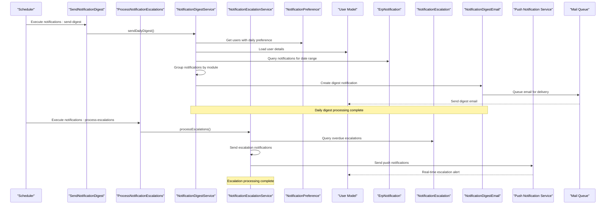

**Diagram sources**
- [SendNotificationDigest.php:40-91](file://app/Console/Commands/SendNotificationDigest.php#L40-L91)
- [ProcessNotificationEscalations.php:38-56](file://app/Console/Commands/ProcessNotificationEscalations.php#L38-L56)
- [NotificationDigestService.php:26-127](file://app/Services/NotificationDigestService.php#L26-L127)
- [NotificationEscalationService.php:69-88](file://app/Services/NotificationEscalationService.php#L69-L88)
- [NotificationDigestEmail.php:43-85](file://app/Notifications/NotificationDigestEmail.php#L43-L85)

The architecture ensures loose coupling between components while maintaining clear data flow and responsibility boundaries. The service leverages Laravel's built-in queuing system for asynchronous email processing and integrates with push notification services for real-time alerts.

## Detailed Component Analysis

### Service Layer Implementation

The enhanced notification system implements comprehensive processing pipelines with sophisticated grouping, escalation, and multi-channel delivery mechanisms:

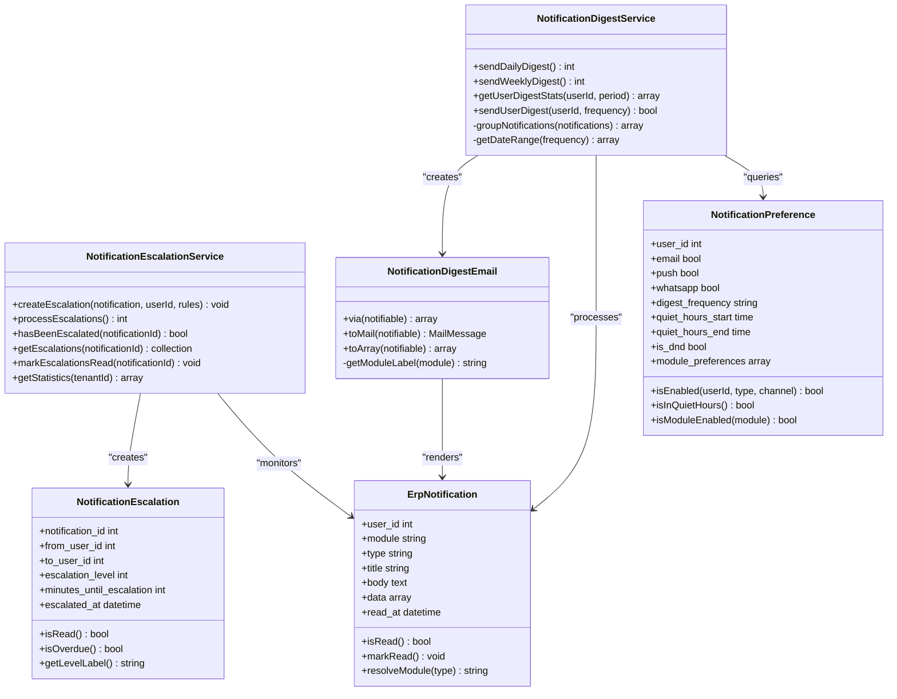

**Diagram sources**
- [NotificationDigestService.php:19-241](file://app/Services/NotificationDigestService.php#L19-L241)
- [NotificationEscalationService.php:18-200](file://app/Services/NotificationEscalationService.php#L18-L200)
- [NotificationPreference.php:8-148](file://app/Models/NotificationPreference.php#L8-L148)
- [ErpNotification.php:10-106](file://app/Models/ErpNotification.php#L10-L106)
- [NotificationDigestEmail.php:10-119](file://app/Notifications/NotificationDigestEmail.php#L10-L119)
- [NotificationEscalation.php:9-127](file://app/Models/NotificationEscalation.php#L9-L127)

#### Enhanced Notification Grouping Algorithm

The service implements an intelligent grouping mechanism that organizes notifications by functional modules with enhanced statistical aggregation and multi-channel awareness:

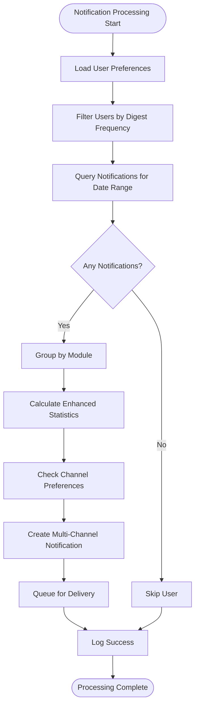

**Diagram sources**
- [NotificationDigestService.php:132-162](file://app/Services/NotificationDigestService.php#L132-L162)

#### Escalation Processing Flow

**New Component** - Comprehensive escalation system with hierarchical routing and timing-based triggers:

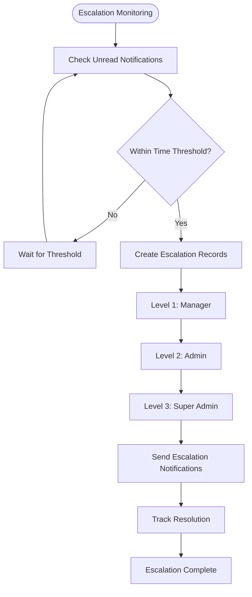

**Diagram sources**
- [NotificationEscalationService.php:28-62](file://app/Services/NotificationEscalationService.php#L28-L62)
- [NotificationEscalationService.php:93-118](file://app/Services/NotificationEscalationService.php#L93-L118)

#### Module Resolution System

The system includes a sophisticated module resolution mechanism that categorizes notifications based on their type prefixes with enhanced coverage:

| Module | Type Prefixes | Examples |
|--------|---------------|----------|
| inventory | low_stock, product_expiry, expiry_soon, expiry_expired | Low stock alerts, expiring products |
| finance | invoice_overdue_batch, invoice_overdue_summary, budget_alert | Overdue invoices, budget warnings |
| hrm | missing_report, asset_maintenance_due | Attendance reports, maintenance schedules |
| ai | ai_advisor, ai_digest | AI recommendations, digest summaries |
| system | trial_expiry, reminder | System reminders, trial expiration |
| ecommerce | ecommerce_sync, marketplace_sync, order-related | E-commerce integrations |
| healthcare | teleconsultation, patient, medical | Healthcare notifications |

**Section sources**
- [NotificationDigestService.php:132-162](file://app/Services/NotificationDigestService.php#L132-L162)
- [NotificationEscalationService.php:28-62](file://app/Services/NotificationEscalationService.php#L28-L62)
- [ErpNotification.php:72-104](file://app/Models/ErpNotification.php#L72-L104)

### Enhanced User Preference Management

The notification preference system provides granular control over communication channels, digest frequencies, and intelligent delivery scheduling:

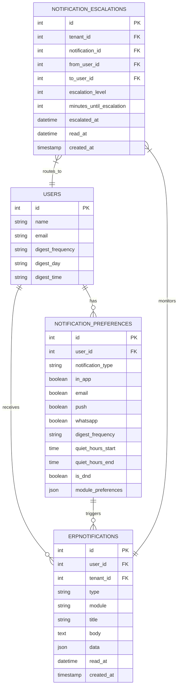

**Diagram sources**
- [NotificationPreference.php:8-148](file://app/Models/NotificationPreference.php#L8-L148)
- [ErpNotification.php:10-106](file://app/Models/ErpNotification.php#L10-L106)
- [NotificationEscalation.php:9-127](file://app/Models/NotificationEscalation.php#L9-L127)

**Section sources**
- [NotificationPreference.php:8-148](file://app/Models/NotificationPreference.php#L8-L148)
- [2026_04_02_100002_create_notification_preferences_table.php:10-26](file://database/migrations/2026_04_02_100002_create_notification_preferences_table.php#L10-L26)
- [2026_04_10_000001_update_notification_preferences_add_channels.php:16-30](file://database/migrations/2026_04_10_000001_update_notification_preferences_add_channels.php#L16-L30)
- [2026_04_10_000002_create_notification_escalations_table.php:16-38](file://database/migrations/2026_04_10_000002_create_notification_escalations_table.php#L16-L38)

### Enhanced Email Template System

The notification digest email template provides a professional, structured presentation of summarized information with enhanced module organization:

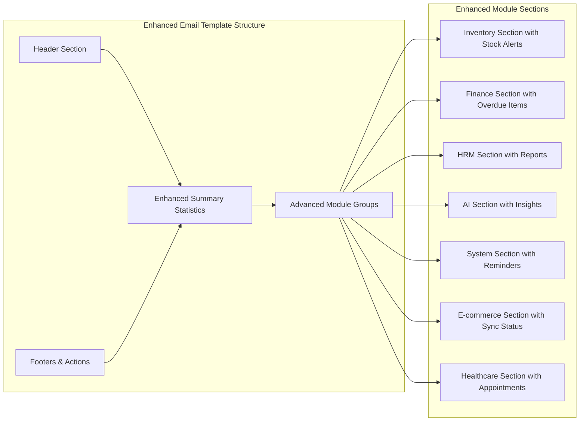

**Diagram sources**
- [NotificationDigestEmail.php:43-85](file://app/Notifications/NotificationDigestEmail.php#L43-L85)

**Section sources**
- [NotificationDigestEmail.php:43-119](file://app/Notifications/NotificationDigestEmail.php#L43-L119)

## Enhanced Notification System

### Three-Tier Escalation Architecture

**New Component** - Comprehensive escalation system designed to ensure critical notifications receive proper attention through hierarchical routing:

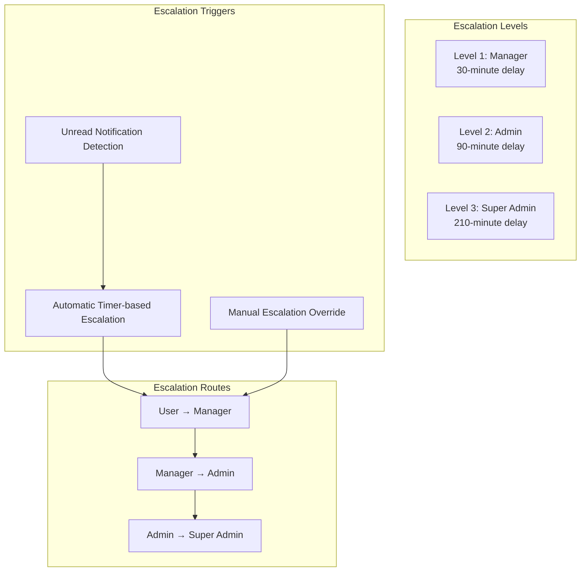

**Diagram sources**
- [NotificationEscalationService.php:13-17](file://app/Services/NotificationEscalationService.php#L13-L17)
- [NotificationEscalationService.php:28-62](file://app/Services/NotificationEscalationService.php#L28-L62)

#### Escalation Timing Configuration

The escalation system uses configurable timing thresholds to ensure appropriate escalation progression:

| Escalation Level | Time Threshold | Target Role | Escalation Trigger |
|------------------|----------------|-------------|-------------------|
| Level 1 | 30 minutes | Manager | First unread threshold |
| Level 2 | 90 minutes | Admin | Second unread threshold |
| Level 3 | 210 minutes | Super Admin | Third unread threshold |

#### Escalation Target Resolution

The system automatically resolves escalation targets based on organizational hierarchy and tenant context:

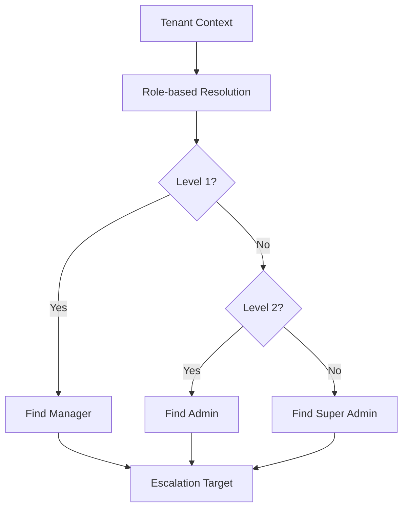

**Diagram sources**
- [NotificationEscalationService.php:127-141](file://app/Services/NotificationEscalationService.php#L127-L141)

**Section sources**
- [NotificationEscalationService.php:10-200](file://app/Services/NotificationEscalationService.php#L10-L200)
- [NotificationEscalation.php:98-125](file://app/Models/NotificationEscalation.php#L98-L125)

## Multi-Channel Notification Support

### Channel-Aware Notification Delivery

**Enhanced Component** - Comprehensive multi-channel notification system supporting email, push, and WhatsApp delivery with intelligent channel selection:

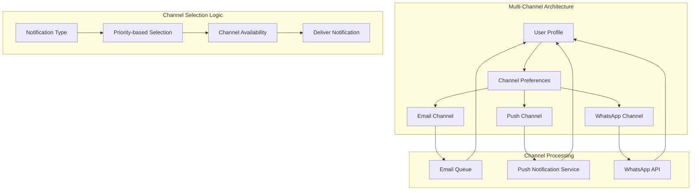

**Diagram sources**
- [NotificationPreference.php:73-87](file://app/Models/NotificationPreference.php#L73-L87)
- [ErpNotification.php:24-40](file://app/Models/ErpNotification.php#L24-L40)

#### Channel Preference Management

The enhanced preference system allows granular control over notification delivery channels:

| Channel | Purpose | Default | Configuration |
|---------|---------|---------|---------------|
| Email | Digest emails, formal notifications | Enabled | Daily/Weekly/Real-time |
| Push | Real-time browser/mobile alerts | Enabled | Instant delivery |
| WhatsApp | Urgent notifications, mobile alerts | Enabled | SMS-style delivery |

#### Intelligent Channel Selection

The system automatically selects appropriate channels based on notification type, user preferences, and delivery urgency:

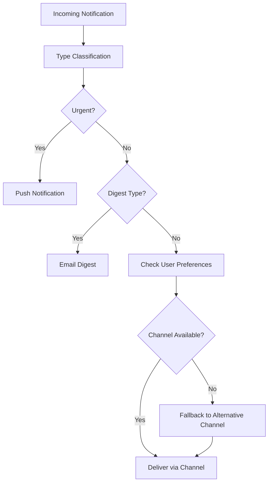

**Diagram sources**
- [NotificationPreference.php:73-87](file://app/Models/NotificationPreference.php#L73-L87)
- [NotificationPreference.php:138-146](file://app/Models/NotificationPreference.php#L138-L146)

**Section sources**
- [NotificationPreference.php:8-148](file://app/Models/NotificationPreference.php#L8-L148)
- [ErpNotification.php:24-40](file://app/Models/ErpNotification.php#L24-L40)

## Dependency Analysis

The enhanced notification system maintains minimal external dependencies while integrating effectively with the Laravel ecosystem and third-party services:

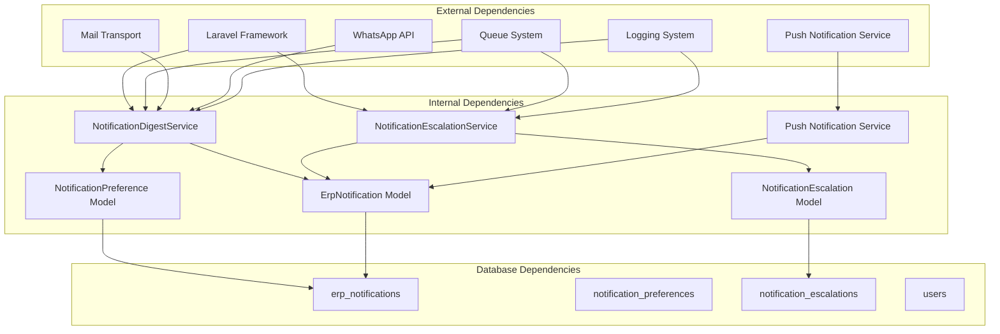

**Diagram sources**
- [NotificationDigestService.php:5-9](file://app/Services/NotificationDigestService.php#L5-L9)
- [NotificationEscalationService.php:5-8](file://app/Services/NotificationEscalationService.php#L5-L8)
- [NotificationDigestEmail.php:5-8](file://app/Notifications/NotificationDigestEmail.php#L5-L8)

The enhanced service demonstrates excellent separation of concerns with clear dependency directions:
- **Service Layer**: Depends on Models and External Services (downward dependency)
- **Model Layer**: Provides data access and business logic (business layer)
- **Controller Layer**: Uses Service Layer (service consumer)
- **Database Layer**: Provides data access (data provider)
- **Framework Layer**: Provides infrastructure services (infrastructure provider)
- **Third-Party Services**: External APIs and services (external dependencies)

**Section sources**
- [NotificationDigestService.php:1-241](file://app/Services/NotificationDigestService.php#L1-L241)
- [NotificationEscalationService.php:1-200](file://app/Services/NotificationEscalationService.php#L1-L200)
- [NotificationDigestEmail.php:1-119](file://app/Notifications/NotificationDigestEmail.php#L1-L119)

## Performance Considerations

The enhanced notification system is designed with scalability and performance in mind, incorporating optimizations for multi-channel delivery and escalation processing:

### Query Optimization
- **Selective Indexing**: Database queries leverage appropriate indexing on user_id, created_at, module, and escalation fields
- **Efficient Filtering**: User preference queries use targeted filters to minimize result sets
- **Batch Processing**: Notifications are processed in batches to prevent memory exhaustion
- **Escalation Scoping**: Dedicated scopes for unread, pending, and overdue escalations optimize query performance

### Memory Management
- **Lazy Loading**: Large notification collections use lazy evaluation to minimize memory footprint
- **Chunked Processing**: Large datasets are processed in manageable chunks
- **Resource Cleanup**: Proper resource deallocation after processing completion
- **Channel-Specific Processing**: Separate processing paths for different notification channels

### Queue Integration Benefits
- **Asynchronous Processing**: Email generation and escalation processing occur outside request lifecycle
- **Parallel Execution**: Multiple digests and escalations can be processed concurrently
- **Failure Resilience**: Failed deliveries are automatically retried across multiple channels
- **Channel Load Balancing**: Distribution of notification load across available channels

### Escalation Performance Optimizations
- **Index-Based Queries**: Escalation queries utilize optimized indexes for tenant, notification, and escalation level
- **Batch Escalation Processing**: Multiple escalations processed in single database operations
- **Memory-Efficient Statistics**: Aggregated statistics computed efficiently without loading full datasets

**Section sources**
- [NotificationEscalation.php:76-96](file://app/Models/NotificationEscalation.php#L76-L96)
- [NotificationDigestService.php:66-68](file://app/Services/NotificationDigestService.php#L66-L68)

## Troubleshooting Guide

### Common Issues and Solutions

#### Digest Emails Not Being Sent
**Symptoms**: Users report missing notification digests despite having preferences enabled.

**Diagnosis Steps**:
1. Verify cron job execution: `php artisan schedule:list`
2. Check command execution: `php artisan notifications:send-digest --daily`
3. Review queue worker status: `php artisan queue:work`
4. Monitor log files for errors
5. Verify user email addresses and channel preferences

**Potential Causes**:
- Incorrect user preferences configuration
- Database connectivity issues
- Email transport configuration problems
- Queue worker not running
- Channel preference conflicts

#### Escalation Notifications Not Working
**Symptoms**: Escalation notifications not being sent despite unread notifications.

**Diagnosis Steps**:
1. Verify escalation command execution: `php artisan notifications:process-escalations`
2. Check escalation database entries: `SELECT * FROM notification_escalations WHERE read_at IS NULL`
3. Review escalation timing thresholds
4. Verify user role assignments for escalation targets
5. Monitor escalation processing logs

**Potential Causes**:
- Escalation processing command not scheduled
- Missing escalation target users (managers/admins/super admins)
- Incorrect tenant context resolution
- Database connection issues
- Role assignment problems

#### Multi-Channel Delivery Issues
**Symptoms**: Notifications not delivered via expected channels (email, push, WhatsApp).

**Diagnosis Steps**:
1. Check user channel preferences: `SELECT * FROM notification_preferences WHERE user_id = ?`
2. Verify channel-specific configurations
3. Test individual channel delivery
4. Review channel-specific error logs
5. Validate third-party service credentials

**Potential Causes**:
- Disabled channel preferences
- Invalid third-party service credentials
- Network connectivity issues
- Channel-specific service outages
- User device/browser compatibility issues

#### Performance Degradation
**Symptoms**: Slow digest processing, escalation processing, or overall notification system performance.

**Mitigation Strategies**:
1. Implement pagination for large notification sets
2. Add database query optimization indexes
3. Configure queue worker scaling
4. Monitor memory usage patterns
5. Optimize channel-specific processing
6. Review escalation query performance

#### Data Integrity Issues
**Symptoms**: Inconsistent notification counts, missing notifications, or escalation tracking problems.

**Resolution Steps**:
1. Validate notification timestamps and timezone settings
2. Check module resolution logic for edge cases
3. Verify user preference synchronization
4. Review database transaction isolation levels
5. Validate escalation target resolution
6. Check channel preference normalization

**Section sources**
- [SendNotificationDigest.php:62-91](file://app/Console/Commands/SendNotificationDigest.php#L62-L91)
- [ProcessNotificationEscalations.php:38-56](file://app/Console/Commands/ProcessNotificationEscalations.php#L38-L56)
- [NotificationDigestService.php:66-68](file://app/Services/NotificationDigestService.php#L66-L68)

## Conclusion

The enhanced Notification Digest Service represents a comprehensive, enterprise-grade solution for managing notification overload and ensuring critical information reaches the right people through the right channels. The service successfully balances functionality with performance, providing users with valuable summary information while maintaining system efficiency and reliability.

**Key Enhancements Made**:

### Core System Improvements
- **Three-Tier Escalation System**: Implemented hierarchical notification escalation with configurable timing thresholds
- **Multi-Channel Support**: Added comprehensive support for email, push, and WhatsApp delivery channels
- **Enhanced Preference Management**: Expanded notification preferences with intelligent scheduling and module controls
- **Real-Time Push Notifications**: Integrated push notification service for instant alert delivery
- **Quiet Hours Management**: Added Do Not Disturb (DND) mode with customizable scheduling

### Architectural Advantages
- **Comprehensive Coverage**: Supports multiple digest frequencies, escalation levels, and delivery channels
- **Scalable Architecture**: Leverages Laravel's queuing system for reliable, asynchronous processing
- **User-Centric Design**: Respects individual preferences with granular control over communication methods
- **Robust Error Handling**: Implements comprehensive logging and monitoring capabilities
- **Tenant Awareness**: Supports multi-tenant deployments with isolated notification processing
- **Performance Optimization**: Designed with scalability and memory efficiency in mind

### Future Extensibility
The service architecture provides an excellent foundation for future enhancements, including:
- Additional escalation levels and routing rules
- Advanced filtering and segmentation capabilities
- Integration with additional notification channels
- Enhanced analytics and reporting features
- Machine learning-based notification prioritization
- Advanced scheduling and delivery optimization

The enhanced notification system demonstrates exceptional engineering quality with clear separation of concerns, comprehensive error handling, and scalable architecture that can grow with the enterprise needs while maintaining backward compatibility and system reliability.