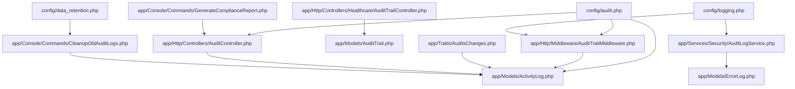
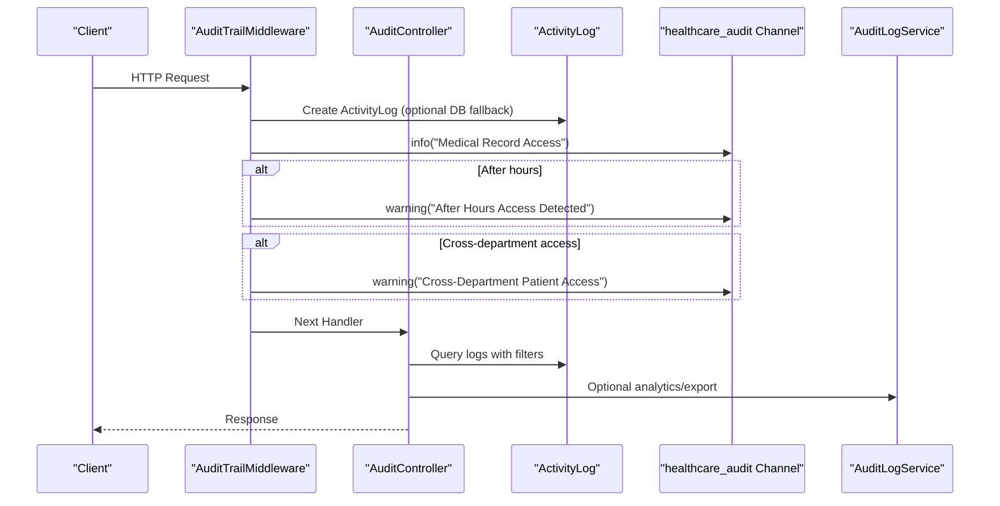
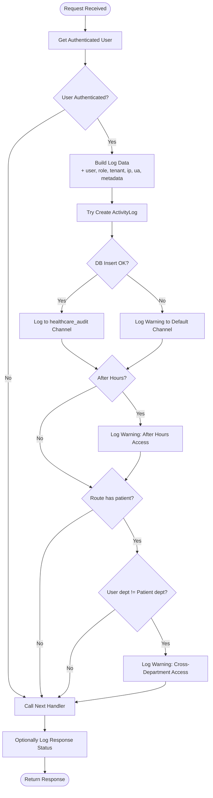
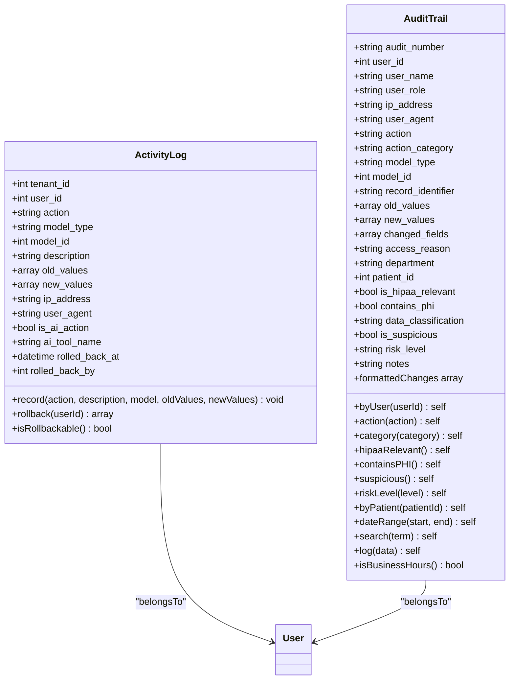
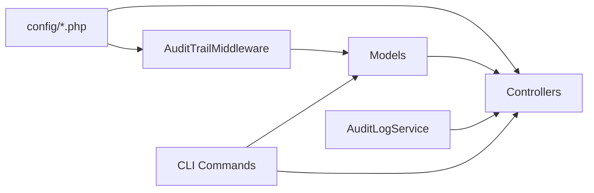

# Audit Trail & Monitoring

<cite>
**Referenced Files in This Document**
- [audit.php](file://config/audit.php)
- [logging.php](file://config/logging.php)
- [data_retention.php](file://config/data_retention.php)
- [AuditTrailMiddleware.php](file://app/Http/Middleware/AuditTrailMiddleware.php)
- [AuditTrail.php](file://app/Models/AuditTrail.php)
- [ActivityLog.php](file://app/Models/ActivityLog.php)
- [AuditLogService.php](file://app/Services/Security/AuditLogService.php)
- [AuditsChanges.php](file://app/Traits/AuditsChanges.php)
- [AuditController.php](file://app/Http/Controllers/AuditController.php)
- [AuditTrailController.php](file://app/Http/Controllers/Healthcare/AuditTrailController.php)
- [CleanupOldAuditLogs.php](file://app/Console/Commands/CleanupOldAuditLogs.php)
- [GenerateComplianceReport.php](file://app/Console/Commands/GenerateComplianceReport.php)
- [ErrorLog.php](file://app/Models/ErrorLog.php)
</cite>

## Table of Contents
1. [Introduction](#introduction)
2. [Project Structure](#project-structure)
3. [Core Components](#core-components)
4. [Architecture Overview](#architecture-overview)
5. [Detailed Component Analysis](#detailed-component-analysis)
6. [Dependency Analysis](#dependency-analysis)
7. [Performance Considerations](#performance-considerations)
8. [Troubleshooting Guide](#troubleshooting-guide)
9. [Conclusion](#conclusion)
10. [Appendices](#appendices)

## Introduction
This document provides comprehensive audit trail and monitoring documentation for Qalcuity ERP. It covers audit logging implementation, activity tracking, compliance reporting, middleware-based audit logging, log formatting, retention policies, real-time monitoring capabilities, audit log queries, user activity analysis, security event detection, customization, log aggregation, and integration with external monitoring systems. The goal is to enable administrators and auditors to track user actions, monitor security events, maintain compliance, and troubleshoot issues effectively.

## Project Structure
The audit and monitoring capabilities are implemented across configuration, middleware, models, services, controllers, commands, and logging channels. Key areas include:
- Configuration for audit retention and global exclusions
- Logging channels tailored for healthcare audit, security, and compliance
- Middleware for request-level audit logging
- Models for structured audit trails and activity logs
- Services for security event logging and analytics
- Controllers for audit UI, exports, and compliance reporting
- Commands for cleanup and compliance report generation
- Data retention policies for archival and compliance holds

**Diagram sources**
- [audit.php:1-44](file://config/audit.php#L1-L44)
- [logging.php:1-216](file://config/logging.php#L1-L216)
- [data_retention.php:1-293](file://config/data_retention.php#L1-L293)
- [AuditTrailMiddleware.php:1-130](file://app/Http/Middleware/AuditTrailMiddleware.php#L1-L130)
- [AuditsChanges.php:1-105](file://app/Traits/AuditsChanges.php#L1-L105)
- [ActivityLog.php:1-216](file://app/Models/ActivityLog.php#L1-L216)
- [AuditTrail.php:1-245](file://app/Models/AuditTrail.php#L1-L245)
- [AuditLogService.php:1-214](file://app/Services/Security/AuditLogService.php#L1-L214)
- [AuditController.php:1-345](file://app/Http/Controllers/AuditController.php#L1-L345)
- [AuditTrailController.php:1-93](file://app/Http/Controllers/Healthcare/AuditTrailController.php#L1-L93)
- [CleanupOldAuditLogs.php:1-181](file://app/Console/Commands/CleanupOldAuditLogs.php#L1-L181)
- [GenerateComplianceReport.php:1-254](file://app/Console/Commands/GenerateComplianceReport.php#L1-L254)
- [ErrorLog.php:1-213](file://app/Models/ErrorLog.php#L1-L213)

**Section sources**
- [audit.php:1-44](file://config/audit.php#L1-L44)
- [logging.php:1-216](file://config/logging.php#L1-L216)
- [data_retention.php:1-293](file://config/data_retention.php#L1-L293)

## Core Components
- Audit configuration: retention policy, rollback enablement, and global excluded fields
- Logging channels: healthcare audit, security, and compliance channels with processors and permissions
- Audit middleware: request-level logging with after-hours detection and cross-department alerts
- Activity and audit trail models: structured logging with scopes, formatting helpers, and rollback support
- Security audit service: event logging, filtering, summaries, device detection, CSV export
- Controllers: audit UI, exports, compliance CSV, and healthcare-specific audit views
- Commands: cleanup of old audit logs with archiving and retention enforcement
- Compliance report generator: monthly healthcare compliance report creation
- Error logging model: structured error tracking with severity, resolution, and notifications

**Section sources**
- [audit.php:1-44](file://config/audit.php#L1-L44)
- [logging.php:155-212](file://config/logging.php#L155-L212)
- [AuditTrailMiddleware.php:1-130](file://app/Http/Middleware/AuditTrailMiddleware.php#L1-L130)
- [ActivityLog.php:1-216](file://app/Models/ActivityLog.php#L1-L216)
- [AuditTrail.php:1-245](file://app/Models/AuditTrail.php#L1-L245)
- [AuditLogService.php:1-214](file://app/Services/Security/AuditLogService.php#L1-L214)
- [AuditController.php:1-345](file://app/Http/Controllers/AuditController.php#L1-L345)
- [AuditTrailController.php:1-93](file://app/Http/Controllers/Healthcare/AuditTrailController.php#L1-L93)
- [CleanupOldAuditLogs.php:1-181](file://app/Console/Commands/CleanupOldAuditLogs.php#L1-L181)
- [GenerateComplianceReport.php:1-254](file://app/Console/Commands/GenerateComplianceReport.php#L1-L254)
- [ErrorLog.php:1-213](file://app/Models/ErrorLog.php#L1-L213)

## Architecture Overview
The audit and monitoring architecture integrates configuration-driven behavior, middleware-based request logging, model-based persistence, service-layer analytics, controller-based UI and exports, and CLI commands for maintenance and reporting.

**Diagram sources**
- [AuditTrailMiddleware.php:17-107](file://app/Http/Middleware/AuditTrailMiddleware.php#L17-L107)
- [AuditController.php:10-61](file://app/Http/Controllers/AuditController.php#L10-L61)
- [ActivityLog.php:153-177](file://app/Models/ActivityLog.php#L153-L177)
- [logging.php:155-176](file://config/logging.php#L155-L176)
- [AuditLogService.php:108-143](file://app/Services/Security/AuditLogService.php#L108-L143)

## Detailed Component Analysis

### Audit Configuration
- Retention policy: configurable days for audit trail retention; purge via command
- Rollback enablement: admin-controlled rollback capability for compatible entries
- Global excludes: sensitive fields excluded from snapshots globally

**Section sources**
- [audit.php:14-41](file://config/audit.php#L14-L41)

### Logging Channels for Audit, Security, and Compliance
- healthcare_audit: daily rotation, extended retention for compliance, processors enriching context with user/tenant/session/IP
- healthcare_security: security incident logging with IP and user context
- healthcare_compliance: dedicated compliance channel for regulatory needs

**Section sources**
- [logging.php:155-212](file://config/logging.php#L155-L212)

### Audit Trail Middleware
- Captures user, tenant, action, resource, URL, IP, user agent, timestamp
- Creates ActivityLog entries with metadata including route, session, and after-hours flag
- Emits healthcare_audit channel logs for compliance
- Flags after-hours access and cross-department access attempts
- Optionally logs response completion status

**Diagram sources**
- [AuditTrailMiddleware.php:17-107](file://app/Http/Middleware/AuditTrailMiddleware.php#L17-L107)

**Section sources**
- [AuditTrailMiddleware.php:17-128](file://app/Http/Middleware/AuditTrailMiddleware.php#L17-L128)

### Activity and Audit Trail Models
- ActivityLog: central activity log with AI-aware recording, rollback support, and tenant scoping
- AuditTrail: structured audit entries with HIPAA flags, risk levels, and comprehensive scopes

**Diagram sources**
- [ActivityLog.php:42-177](file://app/Models/ActivityLog.php#L42-L177)
- [AuditTrail.php:12-129](file://app/Models/AuditTrail.php#L12-L129)

**Section sources**
- [ActivityLog.php:1-216](file://app/Models/ActivityLog.php#L1-L216)
- [AuditTrail.php:1-245](file://app/Models/AuditTrail.php#L1-L245)

### Security Audit Service
- Centralized logging of security events (login/logout, CRUD, permission changes)
- Filtering by event type, user, date range, model type/id, and success
- User activity summary by event type
- Device type detection from user agent
- CSV export of filtered logs

**Section sources**
- [AuditLogService.php:1-214](file://app/Services/Security/AuditLogService.php#L1-L214)

### Audit Controllers
- AuditController: index with filters, AJAX detail view, rollback endpoint, CSV export, compliance CSV export
- AuditTrailController: healthcare audit listing, detail, filtering, export

**Section sources**
- [AuditController.php:1-345](file://app/Http/Controllers/AuditController.php#L1-L345)
- [AuditTrailController.php:1-93](file://app/Http/Controllers/Healthcare/AuditTrailController.php#L1-L93)

### Data Retention and Cleanup
- Data retention policies define archival periods for various data types
- Cleanup command archives and deletes old audit logs, with optional tenant targeting and confirmation
- Log file cleanup for healthcare audit, security, and compliance channels

**Section sources**
- [data_retention.php:16-292](file://config/data_retention.php#L16-L292)
- [CleanupOldAuditLogs.php:1-181](file://app/Console/Commands/CleanupOldAuditLogs.php#L1-L181)

### Compliance Reporting
- Monthly healthcare compliance report generation with configurable format (PDF, Excel, JSON)
- Aggregates access audit stats, user access review, data retention, backup status, and placeholders for privacy and security metrics

**Section sources**
- [GenerateComplianceReport.php:1-254](file://app/Console/Commands/GenerateComplianceReport.php#L1-L254)

### Error Logging
- Structured error logging with severity levels, resolution tracking, notifications, and occurrence counting
- Scopes for unresolved, critical, recent, and tenant-specific errors

**Section sources**
- [ErrorLog.php:1-213](file://app/Models/ErrorLog.php#L1-L213)

## Dependency Analysis
The audit system exhibits clear separation of concerns:
- Configuration drives behavior (retention, rollback, exclusions)
- Middleware captures request-level activity and emits channel logs
- Models persist structured audit data with rollback and tenant scoping
- Services encapsulate analytics and export logic
- Controllers expose UI and APIs for viewing, exporting, and generating reports
- Commands manage lifecycle operations (cleanup, compliance reports)

**Diagram sources**
- [audit.php:1-44](file://config/audit.php#L1-L44)
- [logging.php:155-212](file://config/logging.php#L155-L212)
- [data_retention.php:1-293](file://config/data_retention.php#L1-L293)
- [AuditTrailMiddleware.php:1-130](file://app/Http/Middleware/AuditTrailMiddleware.php#L1-L130)
- [ActivityLog.php:1-216](file://app/Models/ActivityLog.php#L1-L216)
- [AuditTrail.php:1-245](file://app/Models/AuditTrail.php#L1-L245)
- [AuditLogService.php:1-214](file://app/Services/Security/AuditLogService.php#L1-L214)
- [AuditController.php:1-345](file://app/Http/Controllers/AuditController.php#L1-L345)
- [AuditTrailController.php:1-93](file://app/Http/Controllers/Healthcare/AuditTrailController.php#L1-L93)
- [CleanupOldAuditLogs.php:1-181](file://app/Console/Commands/CleanupOldAuditLogs.php#L1-L181)
- [GenerateComplianceReport.php:1-254](file://app/Console/Commands/GenerateComplianceReport.php#L1-L254)

**Section sources**
- [audit.php:1-44](file://config/audit.php#L1-L44)
- [logging.php:155-212](file://config/logging.php#L155-L212)
- [data_retention.php:1-293](file://config/data_retention.php#L1-L293)
- [AuditTrailMiddleware.php:1-130](file://app/Http/Middleware/AuditTrailMiddleware.php#L1-L130)
- [ActivityLog.php:1-216](file://app/Models/ActivityLog.php#L1-L216)
- [AuditTrail.php:1-245](file://app/Models/AuditTrail.php#L1-L245)
- [AuditLogService.php:1-214](file://app/Services/Security/AuditLogService.php#L1-L214)
- [AuditController.php:1-345](file://app/Http/Controllers/AuditController.php#L1-L345)
- [AuditTrailController.php:1-93](file://app/Http/Controllers/Healthcare/AuditTrailController.php#L1-L93)
- [CleanupOldAuditLogs.php:1-181](file://app/Console/Commands/CleanupOldAuditLogs.php#L1-L181)
- [GenerateComplianceReport.php:1-254](file://app/Console/Commands/GenerateComplianceReport.php#L1-L254)

## Performance Considerations
- Batch deletion in cleanup command prevents memory spikes
- Pagination in controllers limits payload sizes
- CSV streaming reduces memory usage for large exports
- Indexes on tenant_id, created_at, and model_type improve query performance
- Consider partitioning or offloading healthcare audit logs to external systems for very large deployments

[No sources needed since this section provides general guidance]

## Troubleshooting Guide
- Audit logs not appearing:
  - Verify healthcare_audit channel path and permissions
  - Confirm middleware is attached to relevant routes
  - Check database connectivity for ActivityLog creation
- Rollback failures:
  - Ensure rollback is enabled and entry is rollbackable
  - Review conflicts returned by rollback operation
- Compliance report generation errors:
  - Validate tenant selection and date range
  - Check storage disk availability for report output
- Excessive log volume:
  - Adjust retention days and cleanup frequency
  - Use filters and date ranges in controllers and services

**Section sources**
- [logging.php:155-176](file://config/logging.php#L155-L176)
- [AuditTrailMiddleware.php:38-63](file://app/Http/Middleware/AuditTrailMiddleware.php#L38-L63)
- [ActivityLog.php:78-151](file://app/Models/ActivityLog.php#L78-L151)
- [AuditController.php:120-162](file://app/Http/Controllers/AuditController.php#L120-L162)
- [GenerateComplianceReport.php:30-63](file://app/Console/Commands/GenerateComplianceReport.php#L30-L63)

## Conclusion
Qalcuity ERP’s audit trail and monitoring system combines configuration-driven policies, middleware-based request logging, structured models, robust services, and CLI automation to deliver comprehensive activity tracking, compliance reporting, and security event detection. Administrators can enforce retention, customize logging, analyze user activity, and integrate with external monitoring systems through standardized channels and exports.

[No sources needed since this section summarizes without analyzing specific files]

## Appendices

### Audit Log Queries and Filters
- ActivityLog filters: action, user_id, is_ai_action, date range, module (model_type)
- AuditTrail filters: action_type, module, user_id, date range
- Compliance CSV export: date range, user, module, integrity hash

**Section sources**
- [AuditController.php:10-61](file://app/Http/Controllers/AuditController.php#L10-L61)
- [AuditTrailController.php:11-46](file://app/Http/Controllers/Healthcare/AuditTrailController.php#L11-L46)

### Real-Time Monitoring Capabilities
- Middleware detects after-hours and cross-department access and logs warnings
- Security events captured via AuditLogService
- Healthcare channels emit structured logs enriched with context

**Section sources**
- [AuditTrailMiddleware.php:66-92](file://app/Http/Middleware/AuditTrailMiddleware.php#L66-L92)
- [AuditLogService.php:37-103](file://app/Services/Security/AuditLogService.php#L37-L103)
- [logging.php:155-199](file://config/logging.php#L155-L199)

### Audit Trail Customization
- Global excluded fields in audit config
- Model-level exclusion via AuditsChanges trait
- Middleware resource type parameterization

**Section sources**
- [audit.php:36-41](file://config/audit.php#L36-L41)
- [AuditsChanges.php:16-24](file://app/Traits/AuditsChanges.php#L16-L24)
- [AuditTrailMiddleware.php:17-36](file://app/Http/Middleware/AuditTrailMiddleware.php#L17-L36)

### Log Aggregation and External Integration
- Healthcare channels support processors and file permissions for secure aggregation
- Papertrail and Slack channels available for alerting
- CSV and JSON exports suitable for ingestion by SIEM or audit tools

**Section sources**
- [logging.php:85-153](file://config/logging.php#L85-L153)
- [AuditController.php:167-205](file://app/Http/Controllers/AuditController.php#L167-L205)
- [GenerateComplianceReport.php:206-252](file://app/Console/Commands/GenerateComplianceReport.php#L206-L252)