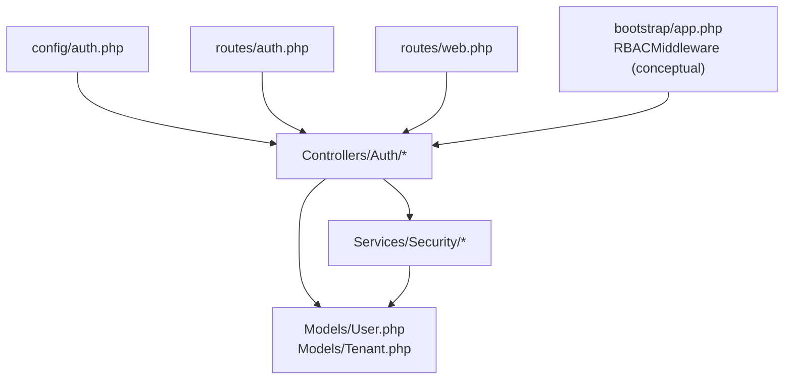
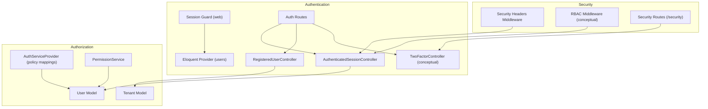
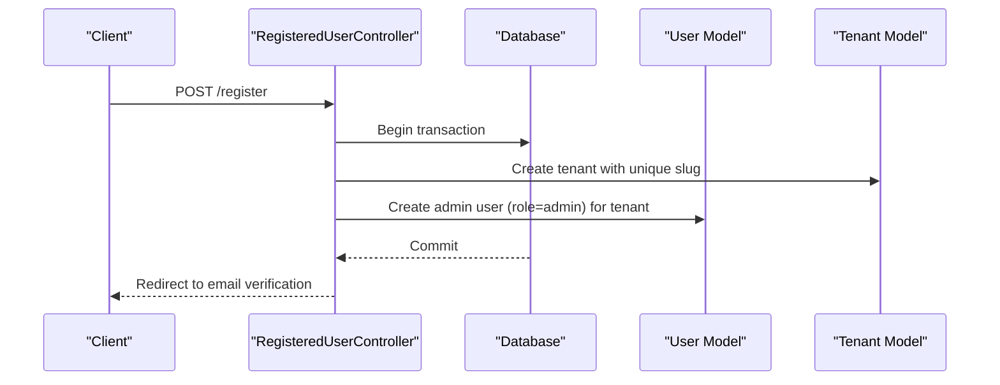
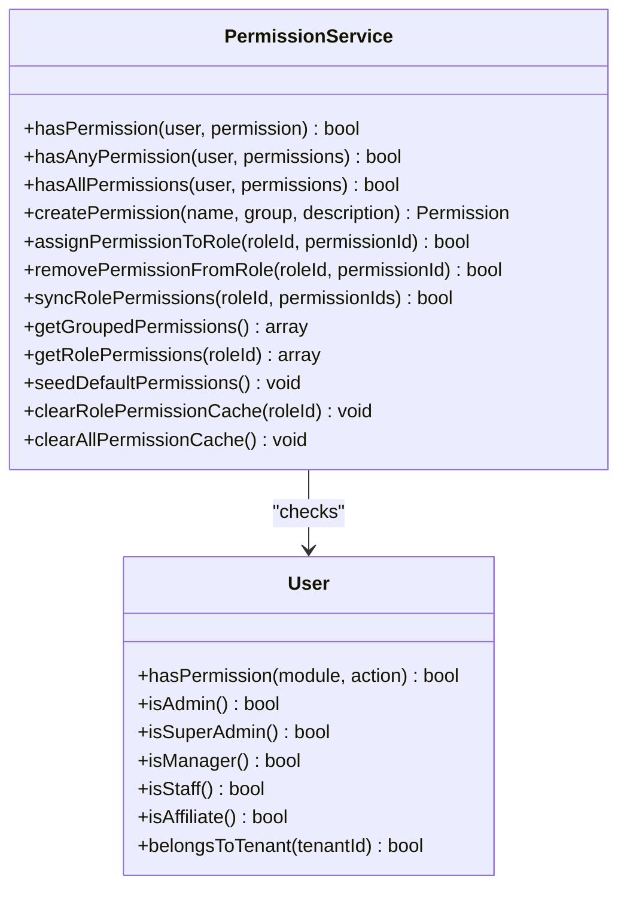
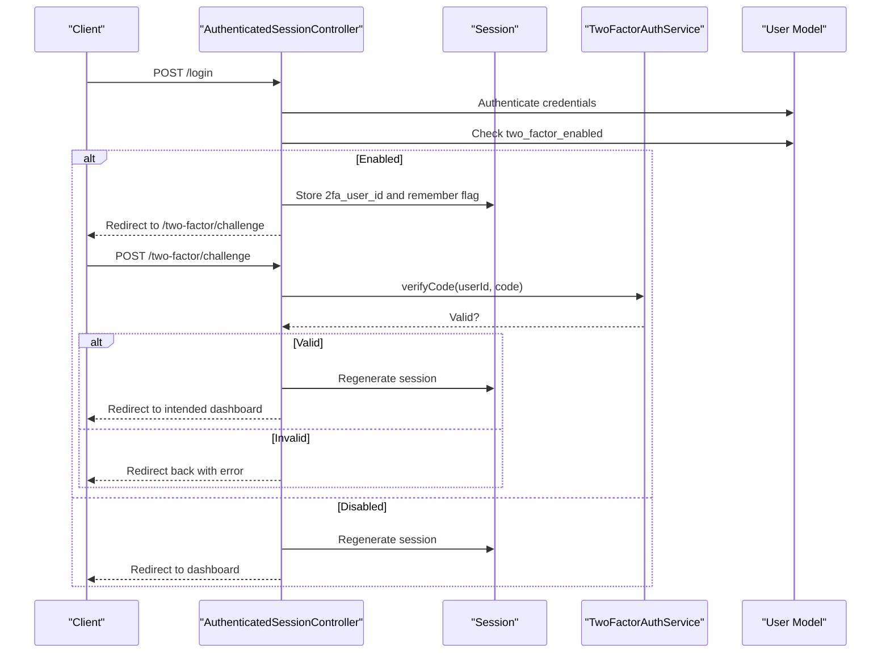
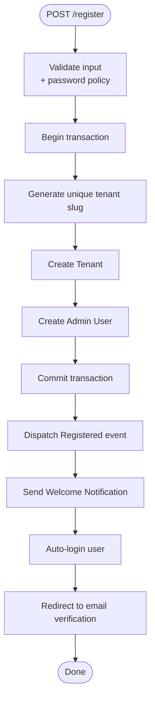
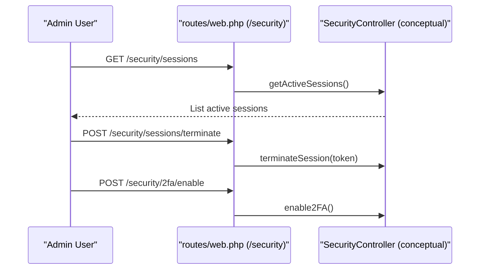
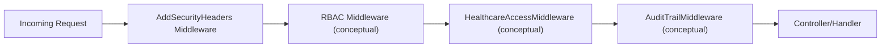
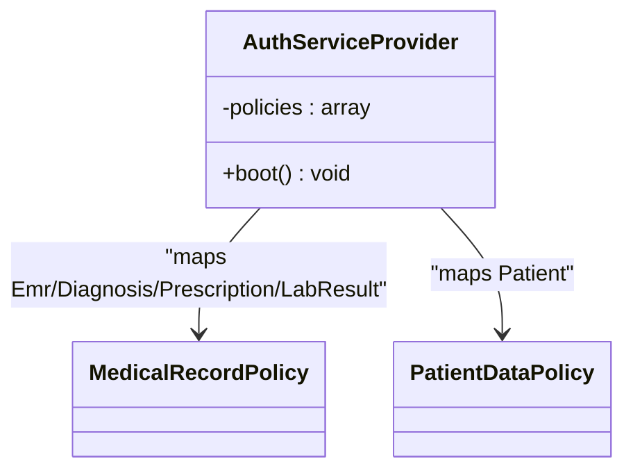
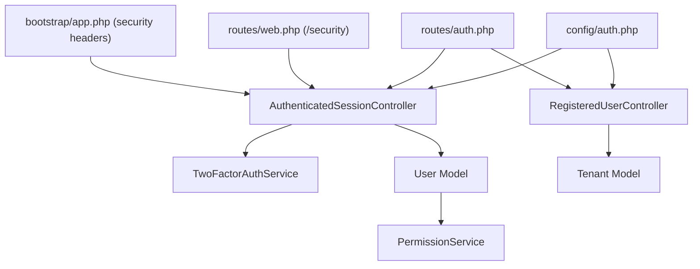

# Authentication & Authorization

<cite>
**Referenced Files in This Document**
- [AuthServiceProvider.php](file://app/Providers/AuthServiceProvider.php)
- [auth.php](file://config/auth.php)
- [auth.php](file://routes/auth.php)
- [web.php](file://routes/web.php)
- [AuthenticatedSessionController.php](file://app/Http/Controllers/Auth/AuthenticatedSessionController.php)
- [RegisteredUserController.php](file://app/Http/Controllers/Auth/RegisteredUserController.php)
- [PermissionService.php](file://app/Services/Security/PermissionService.php)
- [TwoFactorAuthService.php](file://app/Services/Security/TwoFactorAuthService.php)
- [User.php](file://app/Models/User.php)
- [Tenant.php](file://app/Models/Tenant.php)
- [app.php](file://bootstrap/app.php)
</cite>

## Table of Contents
1. [Introduction](#introduction)
2. [Project Structure](#project-structure)
3. [Core Components](#core-components)
4. [Architecture Overview](#architecture-overview)
5. [Detailed Component Analysis](#detailed-component-analysis)
6. [Dependency Analysis](#dependency-analysis)
7. [Performance Considerations](#performance-considerations)
8. [Troubleshooting Guide](#troubleshooting-guide)
9. [Conclusion](#conclusion)
10. [Appendices](#appendices)

## Introduction
This document explains the authentication and authorization mechanisms in Qalcuity ERP with a focus on multi-tenancy, role-based access control (RBAC), permission management, and tenant isolation. It covers middleware-driven security checks, user registration flows, password policies, two-factor authentication (2FA), tenant switching, session management, and access control patterns. Practical examples demonstrate how to implement custom permissions, role hierarchies, and tenant-specific access rules.

## Project Structure
Authentication and authorization span configuration, routing, controllers, services, models, and middleware. The following diagram highlights the primary components involved in authentication and authorization.

**Diagram sources**
- [auth.php:1-118](file://config/auth.php#L1-L118)
- [auth.php:1-73](file://routes/auth.php#L1-L73)
- [web.php:2599-2617](file://routes/web.php#L2599-L2617)
- [AuthenticatedSessionController.php:1-81](file://app/Http/Controllers/Auth/AuthenticatedSessionController.php#L1-L81)
- [RegisteredUserController.php:1-117](file://app/Http/Controllers/Auth/RegisteredUserController.php#L1-L117)
- [PermissionService.php:1-277](file://app/Services/Security/PermissionService.php#L1-L277)
- [TwoFactorAuthService.php:1-239](file://app/Services/Security/TwoFactorAuthService.php#L1-L239)
- [User.php:1-280](file://app/Models/User.php#L1-L280)
- [Tenant.php:1-223](file://app/Models/Tenant.php#L1-L223)
- [app.php:32-41](file://bootstrap/app.php#L32-L41)

**Section sources**
- [auth.php:1-118](file://config/auth.php#L1-L118)
- [auth.php:1-73](file://routes/auth.php#L1-L73)
- [web.php:2599-2617](file://routes/web.php#L2599-L2617)
- [AuthenticatedSessionController.php:1-81](file://app/Http/Controllers/Auth/AuthenticatedSessionController.php#L1-L81)
- [RegisteredUserController.php:1-117](file://app/Http/Controllers/Auth/RegisteredUserController.php#L1-L117)
- [PermissionService.php:1-277](file://app/Services/Security/PermissionService.php#L1-L277)
- [TwoFactorAuthService.php:1-239](file://app/Services/Security/TwoFactorAuthService.php#L1-L239)
- [User.php:1-280](file://app/Models/User.php#L1-L280)
- [Tenant.php:1-223](file://app/Models/Tenant.php#L1-L223)
- [app.php:32-41](file://bootstrap/app.php#L32-L41)

## Core Components
- Authentication configuration and guards/providers define how users are authenticated and retrieved.
- Routes group authentication endpoints for registration, login, password reset, email verification, and 2FA challenge/verification.
- Controllers orchestrate the login flow, handle 2FA gating, manage logout, and drive user registration with tenant creation.
- Services encapsulate permission checks and 2FA lifecycle operations.
- Models provide tenant-aware user roles and granular permission helpers.
- Middleware integrates security headers and healthcare-specific access controls.

Key implementation references:
- Authentication defaults, guards, providers, and password reset configuration: [auth.php:1-118](file://config/auth.php#L1-L118)
- Authentication routes (registration, login, password reset, email verification, 2FA): [auth.php:1-73](file://routes/auth.php#L1-L73)
- Security routes (2FA management, sessions): [web.php:2599-2617](file://routes/web.php#L2599-L2617)
- Login controller behavior and 2FA gating: [AuthenticatedSessionController.php:1-81](file://app/Http/Controllers/Auth/AuthenticatedSessionController.php#L1-L81)
- Registration controller creating tenants and admin users: [RegisteredUserController.php:1-117](file://app/Http/Controllers/Auth/RegisteredUserController.php#L1-L117)
- Permission service (RBAC): [PermissionService.php:1-277](file://app/Services/Security/PermissionService.php#L1-L277)
- 2FA service: [TwoFactorAuthService.php:1-239](file://app/Services/Security/TwoFactorAuthService.php#L1-L239)
- User model role helpers and tenant membership: [User.php:105-137](file://app/Models/User.php#L105-L137)
- Tenant model and module enablement: [Tenant.php:64-75](file://app/Models/Tenant.php#L64-L75)
- Security middleware registration: [app.php:32-41](file://bootstrap/app.php#L32-L41)

**Section sources**
- [auth.php:1-118](file://config/auth.php#L1-L118)
- [auth.php:1-73](file://routes/auth.php#L1-L73)
- [web.php:2599-2617](file://routes/web.php#L2599-L2617)
- [AuthenticatedSessionController.php:1-81](file://app/Http/Controllers/Auth/AuthenticatedSessionController.php#L1-L81)
- [RegisteredUserController.php:1-117](file://app/Http/Controllers/Auth/RegisteredUserController.php#L1-L117)
- [PermissionService.php:1-277](file://app/Services/Security/PermissionService.php#L1-L277)
- [TwoFactorAuthService.php:1-239](file://app/Services/Security/TwoFactorAuthService.php#L1-L239)
- [User.php:105-137](file://app/Models/User.php#L105-L137)
- [Tenant.php:64-75](file://app/Models/Tenant.php#L64-L75)
- [app.php:32-41](file://bootstrap/app.php#L32-L41)

## Architecture Overview
The authentication and authorization architecture combines Laravel’s built-in authentication with custom services and models to support multi-tenancy and granular access control.

**Diagram sources**
- [auth.php:40-74](file://config/auth.php#L40-L74)
- [auth.php:1-73](file://routes/auth.php#L1-L73)
- [web.php:2599-2617](file://routes/web.php#L2599-L2617)
- [AuthenticatedSessionController.php:1-81](file://app/Http/Controllers/Auth/AuthenticatedSessionController.php#L1-L81)
- [RegisteredUserController.php:1-117](file://app/Http/Controllers/Auth/RegisteredUserController.php#L1-L117)
- [AuthServiceProvider.php:14-42](file://app/Providers/AuthServiceProvider.php#L14-L42)
- [PermissionService.php:1-277](file://app/Services/Security/PermissionService.php#L1-L277)
- [User.php:105-137](file://app/Models/User.php#L105-L137)
- [Tenant.php:64-75](file://app/Models/Tenant.php#L64-L75)
- [app.php:32-41](file://bootstrap/app.php#L32-L41)

## Detailed Component Analysis

### Multi-Tenant Authentication and Tenant Isolation
- Tenant creation during registration ensures each sign-up spawns a tenant and an admin user bound to that tenant.
- Users belong to a tenant via a foreign key; super-admins bypass tenant binding.
- Tenant membership is enforced via helper methods and model relationships.

**Diagram sources**
- [RegisteredUserController.php:27-115](file://app/Http/Controllers/Auth/RegisteredUserController.php#L27-L115)
- [Tenant.php:1-223](file://app/Models/Tenant.php#L1-L223)
- [User.php:61-64](file://app/Models/User.php#L61-L64)

**Section sources**
- [RegisteredUserController.php:27-115](file://app/Http/Controllers/Auth/RegisteredUserController.php#L27-L115)
- [Tenant.php:1-223](file://app/Models/Tenant.php#L1-L223)
- [User.php:254-257](file://app/Models/User.php#L254-L257)

### Role-Based Access Control (RBAC) and Permission Management
- PermissionService centralizes permission checks, caching, and administration.
- Users are associated with roles; permissions are cached per role to reduce database queries.
- Default permissions are seeded for common modules (users, invoices, products, reports, settings, security).
- Helper methods allow checking “any” or “all” permissions.

**Diagram sources**
- [PermissionService.php:1-277](file://app/Services/Security/PermissionService.php#L1-L277)
- [User.php:105-137](file://app/Models/User.php#L105-L137)
- [User.php:262-265](file://app/Models/User.php#L262-L265)

**Section sources**
- [PermissionService.php:1-277](file://app/Services/Security/PermissionService.php#L1-L277)
- [User.php:105-137](file://app/Models/User.php#L105-L137)
- [User.php:262-265](file://app/Models/User.php#L262-L265)

### Two-Factor Authentication (2FA)
- 2FA is optional for regular users but mandatory for admins post-login.
- The 2FA service generates secret keys, recovery codes, QR URLs, and verifies codes or recovery codes.
- Login flow stores user ID in session and redirects to a 2FA challenge endpoint before final authentication.

**Diagram sources**
- [AuthenticatedSessionController.php:27-60](file://app/Http/Controllers/Auth/AuthenticatedSessionController.php#L27-L60)
- [TwoFactorAuthService.php:104-131](file://app/Services/Security/TwoFactorAuthService.php#L104-L131)
- [auth.php:43-46](file://routes/auth.php#L43-L46)

**Section sources**
- [AuthenticatedSessionController.php:27-60](file://app/Http/Controllers/Auth/AuthenticatedSessionController.php#L27-L60)
- [TwoFactorAuthService.php:104-131](file://app/Services/Security/TwoFactorAuthService.php#L104-L131)
- [auth.php:43-46](file://routes/auth.php#L43-L46)

### User Registration Flow and Password Policies
- Registration validates company name, user details, and enforces a strong password policy.
- Creates tenant and admin user atomically within a transaction.
- Sends verification notifications and in-app welcome notifications.

**Diagram sources**
- [RegisteredUserController.php:29-115](file://app/Http/Controllers/Auth/RegisteredUserController.php#L29-L115)
- [auth.php:95-102](file://config/auth.php#L95-L102)

**Section sources**
- [RegisteredUserController.php:29-115](file://app/Http/Controllers/Auth/RegisteredUserController.php#L29-L115)
- [auth.php:95-102](file://config/auth.php#L95-L102)

### Tenant Switching Mechanisms
- The application exposes security routes for managing sessions and 2FA, enabling tenant administrators to terminate other sessions and enforce 2FA.
- While explicit “switch tenant” endpoints are not visible in the referenced files, the presence of tenant-scoped users and admin roles supports building tenant switching flows at the UI and controller level.

**Diagram sources**
- [web.php:2599-2617](file://routes/web.php#L2599-L2617)

**Section sources**
- [web.php:2599-2617](file://routes/web.php#L2599-L2617)

### Middleware Implementations for Security Checks
- Security headers middleware is registered globally to harden responses.
- Healthcare module middleware includes access control, audit trail, RBAC, and business hours enforcement.

**Diagram sources**
- [app.php:32-41](file://bootstrap/app.php#L32-L41)

**Section sources**
- [app.php:32-41](file://bootstrap/app.php#L32-L41)

### Access Control Patterns
- Policy mappings for medical records and patient data are registered in the AuthServiceProvider.
- Controllers and services use permission checks and role helpers to gate actions.

**Diagram sources**
- [AuthServiceProvider.php:14-42](file://app/Providers/AuthServiceProvider.php#L14-L42)

**Section sources**
- [AuthServiceProvider.php:14-42](file://app/Providers/AuthServiceProvider.php#L14-L42)

### Examples: Implementing Custom Permissions, Role Hierarchies, and Tenant-Specific Rules
- Custom permissions: Use PermissionService::createPermission to add domain-specific permissions and group them logically.
- Role hierarchies: Extend User role helpers or introduce hierarchical roles (e.g., manager > staff) and adjust PermissionService to reflect inherited permissions.
- Tenant-specific rules: Combine User::belongsToTenant with PermissionService checks to enforce tenant-scoped access.

Implementation references:
- Creating permissions: [PermissionService.php:73-81](file://app/Services/Security/PermissionService.php#L73-L81)
- Assigning/removing permissions: [PermissionService.php:86-133](file://app/Services/Security/PermissionService.php#L86-L133)
- Checking permissions: [PermissionService.php:19-40](file://app/Services/Security/PermissionService.php#L19-L40)
- Role helpers: [User.php:105-137](file://app/Models/User.php#L105-L137)
- Tenant membership: [User.php:254-257](file://app/Models/User.php#L254-L257)

**Section sources**
- [PermissionService.php:73-133](file://app/Services/Security/PermissionService.php#L73-L133)
- [PermissionService.php:19-40](file://app/Services/Security/PermissionService.php#L19-L40)
- [User.php:105-137](file://app/Models/User.php#L105-L137)
- [User.php:254-257](file://app/Models/User.php#L254-L257)

## Dependency Analysis
The following diagram shows key dependencies among authentication and authorization components.

**Diagram sources**
- [auth.php:1-118](file://config/auth.php#L1-L118)
- [auth.php:1-73](file://routes/auth.php#L1-L73)
- [web.php:2599-2617](file://routes/web.php#L2599-L2617)
- [AuthenticatedSessionController.php:1-81](file://app/Http/Controllers/Auth/AuthenticatedSessionController.php#L1-L81)
- [RegisteredUserController.php:1-117](file://app/Http/Controllers/Auth/RegisteredUserController.php#L1-L117)
- [PermissionService.php:1-277](file://app/Services/Security/PermissionService.php#L1-L277)
- [TwoFactorAuthService.php:1-239](file://app/Services/Security/TwoFactorAuthService.php#L1-L239)
- [User.php:1-280](file://app/Models/User.php#L1-L280)
- [Tenant.php:1-223](file://app/Models/Tenant.php#L1-L223)
- [app.php:32-41](file://bootstrap/app.php#L32-L41)

**Section sources**
- [auth.php:1-118](file://config/auth.php#L1-L118)
- [auth.php:1-73](file://routes/auth.php#L1-L73)
- [web.php:2599-2617](file://routes/web.php#L2599-L2617)
- [AuthenticatedSessionController.php:1-81](file://app/Http/Controllers/Auth/AuthenticatedSessionController.php#L1-L81)
- [RegisteredUserController.php:1-117](file://app/Http/Controllers/Auth/RegisteredUserController.php#L1-L117)
- [PermissionService.php:1-277](file://app/Services/Security/PermissionService.php#L1-L277)
- [TwoFactorAuthService.php:1-239](file://app/Services/Security/TwoFactorAuthService.php#L1-L239)
- [User.php:1-280](file://app/Models/User.php#L1-L280)
- [Tenant.php:1-223](file://app/Models/Tenant.php#L1-L223)
- [app.php:32-41](file://bootstrap/app.php#L32-L41)

## Performance Considerations
- Caching: PermissionService caches role permissions and grouped permissions to minimize database load. Use cache invalidation methods after permission changes.
- Transactions: Registration uses atomic transactions to ensure tenant and user consistency.
- Middleware overhead: Security headers middleware adds minimal overhead; keep custom middleware efficient and cache results where appropriate.

[No sources needed since this section provides general guidance]

## Troubleshooting Guide
- 2FA verification failures: Confirm secret key encryption/decryption and code validation logic in the 2FA service.
- Permission denied errors: Verify role-to-permission assignments and cache invalidation after updates.
- Session termination issues: Ensure session tokens are correctly managed and invalidated in security routes.
- Email verification: Check rate-limiting and signed URL middleware for verification links.

**Section sources**
- [TwoFactorAuthService.php:104-131](file://app/Services/Security/TwoFactorAuthService.php#L104-L131)
- [PermissionService.php:258-275](file://app/Services/Security/PermissionService.php#L258-L275)
- [web.php:2613-2617](file://routes/web.php#L2613-L2617)
- [auth.php:52-58](file://routes/auth.php#L52-L58)

## Conclusion
Qalcuity ERP implements a robust, multi-tenant authentication and authorization system. It leverages Laravel’s authentication foundation with custom services for RBAC and 2FA, enforces tenant isolation via user-tenant relationships, and integrates security headers and healthcare-specific middleware. The PermissionService and User model helpers provide flexible, scalable access control suitable for customization and extension.

[No sources needed since this section summarizes without analyzing specific files]

## Appendices

### Appendix A: Authentication Defaults and Guards
- Defaults: web guard and users password broker.
- Guard: session driver with Eloquent provider.
- Provider: Eloquent model for users.
- Password reset: configurable table, expiry, and throttle.

**Section sources**
- [auth.php:18-102](file://config/auth.php#L18-L102)

### Appendix B: Security Middleware Registration
- Security headers middleware registered globally.
- Healthcare module middleware includes access control, audit, RBAC, and business hours.

**Section sources**
- [app.php:32-41](file://bootstrap/app.php#L32-L41)