# Data Protection & Encryption

<cite>
**Referenced Files in This Document**
- [EncryptionService.php](file://app/Services/Security/EncryptionService.php)
- [BelongsToTenant.php](file://app/Traits/BelongsToTenant.php)
- [Tenant.php](file://app/Models/Tenant.php)
- [data_retention.php](file://config/data_retention.php)
- [DataArchivalService.php](file://app/Services/DataArchivalService.php)
- [ArchiveDataCommand.php](file://app/Console/Commands/ArchiveDataCommand.php)
- [RegulatoryComplianceService.php](file://app/Services/RegulatoryComplianceService.php)
- [2026_04_08_1400001_create_regulatory_compliance_tables.php](file://database/migrations/2026_04_08_1400001_create_regulatory_compliance_tables.php)
- [GenerateComplianceReport.php](file://app/Console/Commands/GenerateComplianceReport.php)
- [TenantDataMigrationService.php](file://app/Services/TenantDataMigrationService.php)
- [README.md](file://README.md)
- [composer.lock](file://composer.lock)
</cite>

## Table of Contents
1. [Introduction](#introduction)
2. [Project Structure](#project-structure)
3. [Core Components](#core-components)
4. [Architecture Overview](#architecture-overview)
5. [Detailed Component Analysis](#detailed-component-analysis)
6. [Dependency Analysis](#dependency-analysis)
7. [Performance Considerations](#performance-considerations)
8. [Troubleshooting Guide](#troubleshooting-guide)
9. [Conclusion](#conclusion)
10. [Appendices](#appendices)

## Introduction
This document provides comprehensive data protection and encryption guidance for Qalcuity ERP with a focus on multi-tenant data isolation, encryption, data masking/anonymization, and regulatory compliance. It documents current implementation patterns, configuration-driven policies, and operational procedures for secure data handling, including encryption algorithms, key management, secure transmission, data retention, backups, and anonymization workflows aligned with HIPAA and Permenkes frameworks.

## Project Structure
Qalcuity ERP organizes data protection capabilities across services, traits, configuration, and migrations:
- Multi-tenant isolation is enforced via a global model scope and automatic tenant scoping.
- Encryption services wrap Laravel’s encryption primitives and track key metadata.
- Data retention and archival are policy-driven and executed via console commands and services.
- Regulatory compliance includes anonymization, backups, audit trails, and compliance reporting.
- Migrations define compliance-relevant tables for audit, anonymization, backups, and disaster recovery.

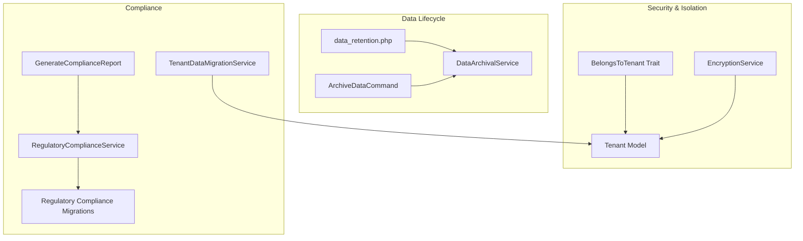

**Diagram sources**
- [BelongsToTenant.php:37-100](file://app/Traits/BelongsToTenant.php#L37-L100)
- [EncryptionService.php:13-90](file://app/Services/Security/EncryptionService.php#L13-L90)
- [Tenant.php:10-118](file://app/Models/Tenant.php#L10-L118)
- [data_retention.php:16-292](file://config/data_retention.php#L16-L292)
- [DataArchivalService.php:113-217](file://app/Services/DataArchivalService.php#L113-L217)
- [ArchiveDataCommand.php:28-104](file://app/Console/Commands/ArchiveDataCommand.php#L28-L104)
- [RegulatoryComplianceService.php:17-234](file://app/Services/RegulatoryComplianceService.php#L17-L234)
- [2026_04_08_1400001_create_regulatory_compliance_tables.php:21-327](file://database/migrations/2026_04_08_1400001_create_regulatory_compliance_tables.php#L21-L327)
- [GenerateComplianceReport.php:30-101](file://app/Console/Commands/GenerateComplianceReport.php#L30-L101)
- [TenantDataMigrationService.php:27-393](file://app/Services/TenantDataMigrationService.php#L27-L393)

**Section sources**
- [BelongsToTenant.php:37-100](file://app/Traits/BelongsToTenant.php#L37-L100)
- [EncryptionService.php:13-90](file://app/Services/Security/EncryptionService.php#L13-L90)
- [data_retention.php:16-292](file://config/data_retention.php#L16-L292)
- [DataArchivalService.php:113-217](file://app/Services/DataArchivalService.php#L113-L217)
- [ArchiveDataCommand.php:28-104](file://app/Console/Commands/ArchiveDataCommand.php#L28-L104)
- [RegulatoryComplianceService.php:17-234](file://app/Services/RegulatoryComplianceService.php#L17-L234)
- [2026_04_08_1400001_create_regulatory_compliance_tables.php:21-327](file://database/migrations/2026_04_08_1400001_create_regulatory_compliance_tables.php#L21-L327)
- [GenerateComplianceReport.php:30-101](file://app/Console/Commands/GenerateComplianceReport.php#L30-L101)
- [TenantDataMigrationService.php:27-393](file://app/Services/TenantDataMigrationService.php#L27-L393)

## Core Components
- Multi-tenant isolation via a global scope and automatic tenant scoping on creation.
- Encryption service leveraging Laravel’s encryption with key metadata tracking.
- Policy-driven data retention and archival with configurable schedules and batch sizes.
- Regulatory compliance workflows for anonymization, backups, audit trails, and compliance reports.
- Migration and consolidation utilities for tenant restructuring with conflict resolution and backups.

**Section sources**
- [BelongsToTenant.php:37-100](file://app/Traits/BelongsToTenant.php#L37-L100)
- [EncryptionService.php:13-90](file://app/Services/Security/EncryptionService.php#L13-L90)
- [data_retention.php:16-292](file://config/data_retention.php#L16-L292)
- [DataArchivalService.php:113-217](file://app/Services/DataArchivalService.php#L113-L217)
- [RegulatoryComplianceService.php:101-234](file://app/Services/RegulatoryComplianceService.php#L101-L234)
- [TenantDataMigrationService.php:27-393](file://app/Services/TenantDataMigrationService.php#L27-L393)

## Architecture Overview
The system enforces tenant isolation at the persistence layer and supports encryption and anonymization workflows aligned with healthcare compliance.

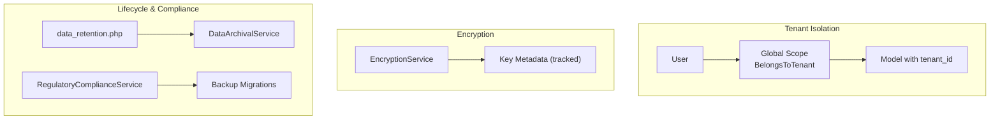

**Diagram sources**
- [BelongsToTenant.php:37-100](file://app/Traits/BelongsToTenant.php#L37-L100)
- [EncryptionService.php:95-120](file://app/Services/Security/EncryptionService.php#L95-L120)
- [data_retention.php:16-292](file://config/data_retention.php#L16-L292)
- [DataArchivalService.php:113-217](file://app/Services/DataArchivalService.php#L113-L217)
- [RegulatoryComplianceService.php:181-234](file://app/Services/RegulatoryComplianceService.php#L181-L234)
- [2026_04_08_1400001_create_regulatory_compliance_tables.php:217-263](file://database/migrations/2026_04_08_1400001_create_regulatory_compliance_tables.php#L217-L263)

## Detailed Component Analysis

### Multi-Tenant Data Isolation
- Global scope filters queries by tenant_id for all models using the trait, except for super_admin users and guest contexts.
- Automatic tenant_id assignment on model creation ensures new records belong to the current user’s tenant.
- Bypass scopes enable administrative access across tenants when necessary.

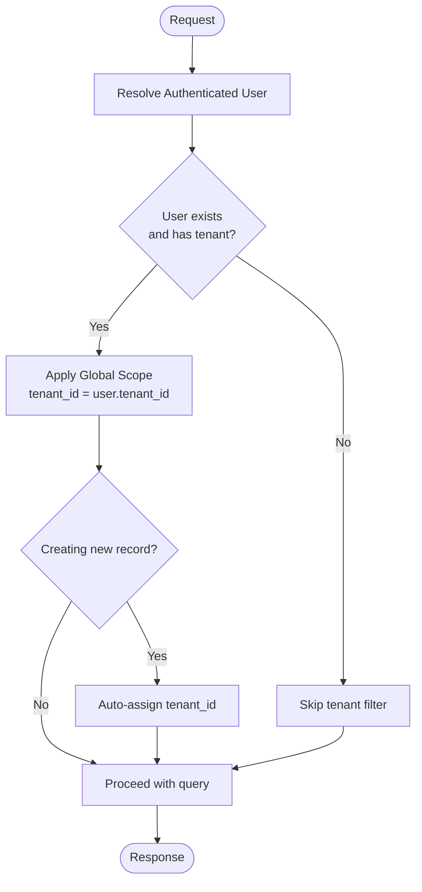

**Diagram sources**
- [BelongsToTenant.php:37-100](file://app/Traits/BelongsToTenant.php#L37-L100)

**Section sources**
- [BelongsToTenant.php:37-100](file://app/Traits/BelongsToTenant.php#L37-L100)
- [Tenant.php:10-118](file://app/Models/Tenant.php#L10-L118)

### Field-Level Encryption and Key Management
- EncryptionService uses Laravel’s encryption primitives for confidentiality.
- Key metadata is tracked per tenant and key name; rotation deactivates old keys and creates new ones.
- Hashing for searchability uses HMAC-SHA256 keyed by the application key.

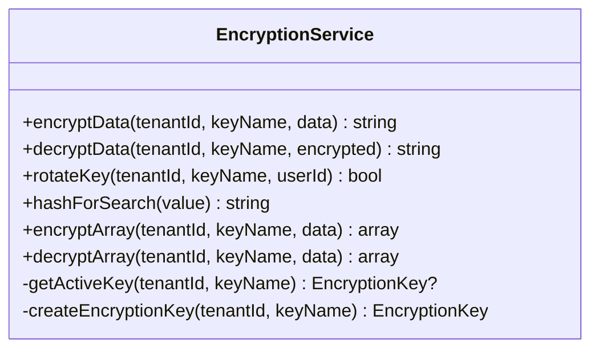

**Diagram sources**
- [EncryptionService.php:13-168](file://app/Services/Security/EncryptionService.php#L13-L168)

**Section sources**
- [EncryptionService.php:13-168](file://app/Services/Security/EncryptionService.php#L13-L168)

### Data Masking and Anonymization
- RegulatoryComplianceService orchestrates anonymization requests with support for multiple methods (pseudonymization, generalization, suppression, noise addition).
- Anonymization logs track approvals, methods, fields, and compliance metadata.
- Backup procedures mark backups as encrypted and compliant.

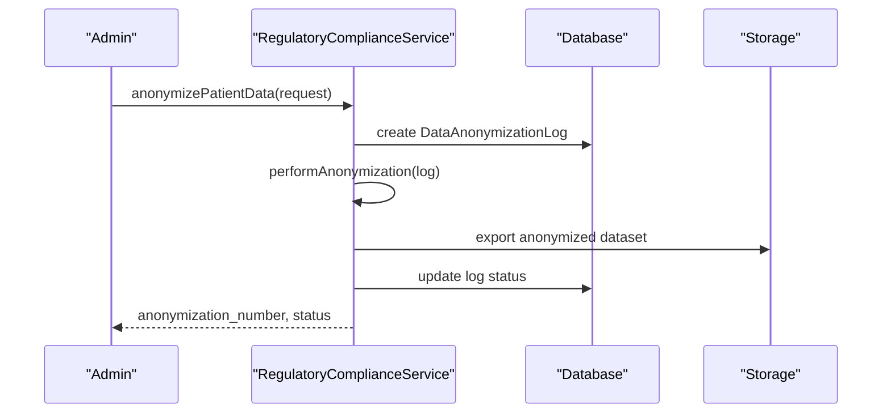

**Diagram sources**
- [RegulatoryComplianceService.php:101-134](file://app/Services/RegulatoryComplianceService.php#L101-L134)
- [RegulatoryComplianceService.php:375-392](file://app/Services/RegulatoryComplianceService.php#L375-L392)
- [2026_04_08_1400001_create_regulatory_compliance_tables.php:124-167](file://database/migrations/2026_04_08_1400001_create_regulatory_compliance_tables.php#L124-L167)

**Section sources**
- [RegulatoryComplianceService.php:101-134](file://app/Services/RegulatoryComplianceService.php#L101-L134)
- [RegulatoryComplianceService.php:375-392](file://app/Services/RegulatoryComplianceService.php#L375-L392)
- [2026_04_08_1400001_create_regulatory_compliance_tables.php:124-167](file://database/migrations/2026_04_08_1400001_create_regulatory_compliance_tables.php#L124-L167)

### Secure Data Transmission
- The platform enforces HTTPS in production and recommends SSL termination and forced HTTPS.
- Encryption in transit is ensured by HTTPS/TLS; cryptographic libraries are available via Composer.

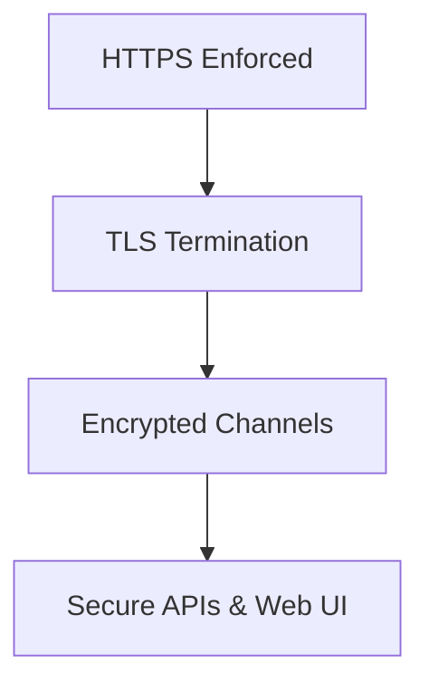

**Diagram sources**
- [README.md:563-576](file://README.md#L563-L576)
- [composer.lock:4281-4342](file://composer.lock#L4281-L4342)

**Section sources**
- [README.md:563-576](file://README.md#L563-L576)
- [composer.lock:4281-4342](file://composer.lock#L4281-L4342)

### Data Retention and Lifecycle Management
- Configurable retention periods per data type (e.g., activity logs, AI usage logs, anomaly alerts).
- Automated archival via console command and service with batching and dry-run support.
- Compliance holds and soft deletes for sensitive data categories.

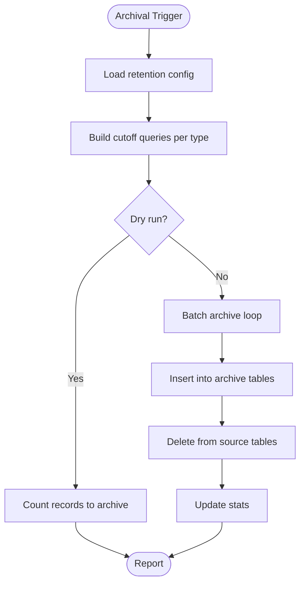

**Diagram sources**
- [data_retention.php:16-292](file://config/data_retention.php#L16-L292)
- [DataArchivalService.php:113-217](file://app/Services/DataArchivalService.php#L113-L217)
- [ArchiveDataCommand.php:28-104](file://app/Console/Commands/ArchiveDataCommand.php#L28-L104)

**Section sources**
- [data_retention.php:16-292](file://config/data_retention.php#L16-L292)
- [DataArchivalService.php:113-217](file://app/Services/DataArchivalService.php#L113-L217)
- [ArchiveDataCommand.php:28-104](file://app/Console/Commands/ArchiveDataCommand.php#L28-L104)

### Encrypted Backups and Disaster Recovery
- Backup logs capture backup metadata, encryption status, storage provider, and retention.
- Backup creation sets encryption flags and compliance attributes.
- Disaster recovery logs track incidents, severity, affected systems, and recovery metrics.

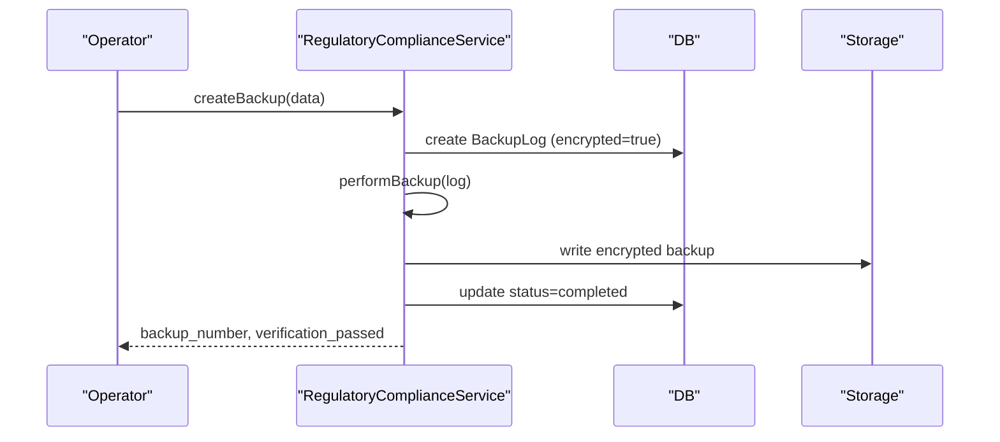

**Diagram sources**
- [RegulatoryComplianceService.php:181-234](file://app/Services/RegulatoryComplianceService.php#L181-L234)
- [2026_04_08_1400001_create_regulatory_compliance_tables.php:217-263](file://database/migrations/2026_04_08_1400001_create_regulatory_compliance_tables.php#L217-L263)

**Section sources**
- [RegulatoryComplianceService.php:181-234](file://app/Services/RegulatoryComplianceService.php#L181-L234)
- [2026_04_08_1400001_create_regulatory_compliance_tables.php:217-263](file://database/migrations/2026_04_08_1400001_create_regulatory_compliance_tables.php#L217-L263)

### GDPR Alignment and Access Control
- Access checks integrate role-based authorization and business-hour constraints.
- Audit trails capture access reasons, departments, and PHI classification.
- Compliance reports support HIPAA and Permenkes frameworks with requirement checks and scoring.

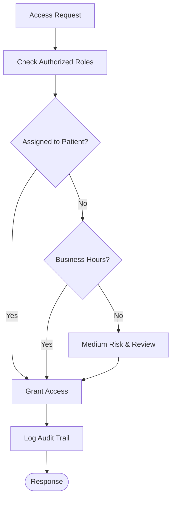

**Diagram sources**
- [RegulatoryComplianceService.php:43-96](file://app/Services/RegulatoryComplianceService.php#L43-L96)
- [RegulatoryComplianceService.php:22-38](file://app/Services/RegulatoryComplianceService.php#L22-L38)
- [2026_04_08_1400001_create_regulatory_compliance_tables.php:21-72](file://database/migrations/2026_04_08_1400001_create_regulatory_compliance_tables.php#L21-L72)

**Section sources**
- [RegulatoryComplianceService.php:43-96](file://app/Services/RegulatoryComplianceService.php#L43-L96)
- [RegulatoryComplianceService.php:22-38](file://app/Services/RegulatoryComplianceService.php#L22-L38)
- [2026_04_08_1400001_create_regulatory_compliance_tables.php:21-72](file://database/migrations/2026_04_08_1400001_create_regulatory_compliance_tables.php#L21-L72)

### Tenant Data Separation and Restructuring
- TenantDataMigrationService supports merging, splitting, and transferring data between tenants with conflict resolution and optional validation and backup steps.

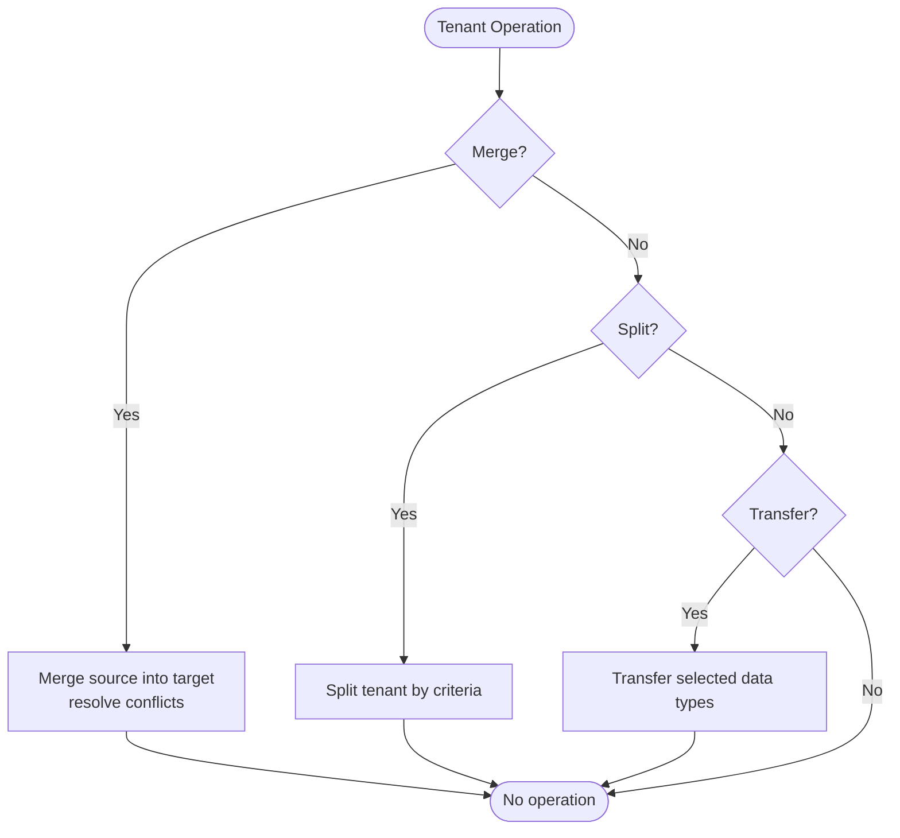

**Diagram sources**
- [TenantDataMigrationService.php:38-393](file://app/Services/TenantDataMigrationService.php#L38-L393)
- [data_retention.php:130-168](file://config/data_retention.php#L130-L168)

**Section sources**
- [TenantDataMigrationService.php:38-393](file://app/Services/TenantDataMigrationService.php#L38-L393)
- [data_retention.php:130-168](file://config/data_retention.php#L130-L168)

## Dependency Analysis
- EncryptionService depends on Laravel’s encryption and tracks key metadata via a model relationship (not shown in this diff).
- BelongsToTenant trait depends on authenticated user context and model creation hooks.
- RegulatoryComplianceService depends on compliance-related models and migrations.
- DataArchivalService depends on retention configuration and database schema.
- TenantDataMigrationService depends on tenant and related business models.

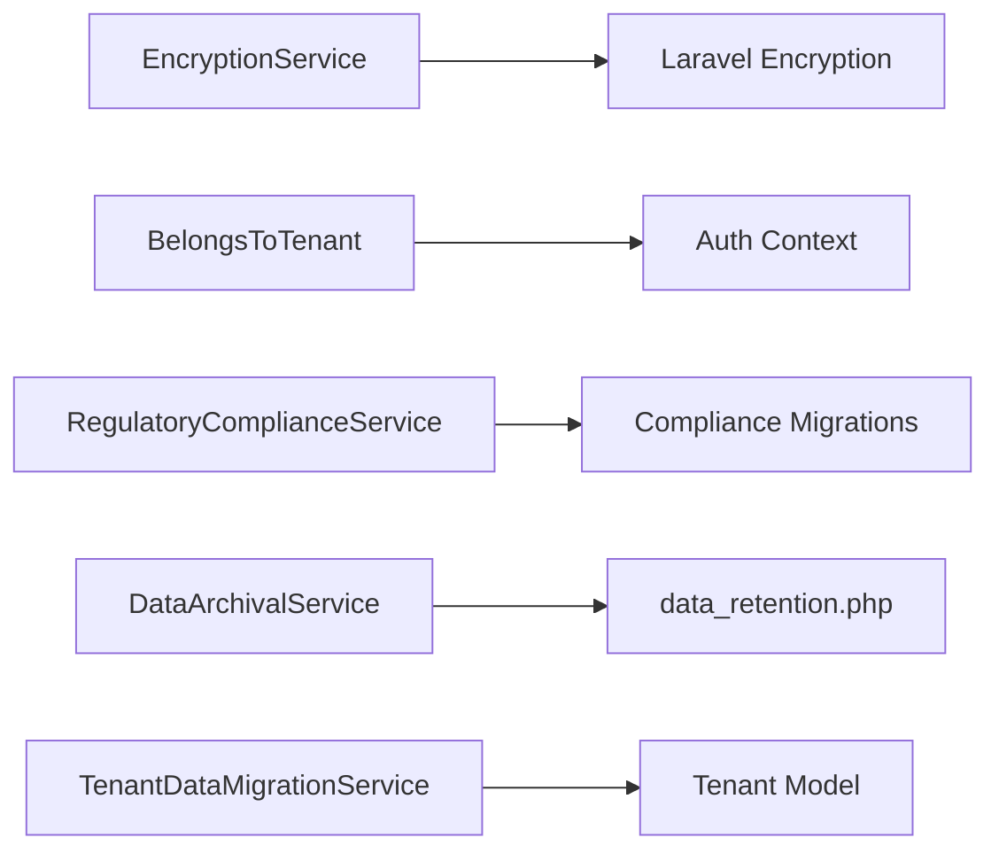

**Diagram sources**
- [EncryptionService.php:13-90](file://app/Services/Security/EncryptionService.php#L13-L90)
- [BelongsToTenant.php:37-100](file://app/Traits/BelongsToTenant.php#L37-L100)
- [RegulatoryComplianceService.php:17-234](file://app/Services/RegulatoryComplianceService.php#L17-L234)
- [2026_04_08_1400001_create_regulatory_compliance_tables.php:21-327](file://database/migrations/2026_04_08_1400001_create_regulatory_compliance_tables.php#L21-L327)
- [data_retention.php:16-292](file://config/data_retention.php#L16-L292)
- [TenantDataMigrationService.php:27-393](file://app/Services/TenantDataMigrationService.php#L27-L393)

**Section sources**
- [EncryptionService.php:13-90](file://app/Services/Security/EncryptionService.php#L13-L90)
- [BelongsToTenant.php:37-100](file://app/Traits/BelongsToTenant.php#L37-L100)
- [RegulatoryComplianceService.php:17-234](file://app/Services/RegulatoryComplianceService.php#L17-L234)
- [2026_04_08_1400001_create_regulatory_compliance_tables.php:21-327](file://database/migrations/2026_04_08_1400001_create_regulatory_compliance_tables.php#L21-L327)
- [data_retention.php:16-292](file://config/data_retention.php#L16-L292)
- [TenantDataMigrationService.php:27-393](file://app/Services/TenantDataMigrationService.php#L27-L393)

## Performance Considerations
- EncryptionService encrypts arrays and hashes values for searchability; consider indexing hashed fields where applicable.
- DataArchivalService batches operations and supports dry runs to minimize downtime and risk.
- RegulatoryComplianceService performs backup and anonymization in transactions to maintain consistency.
- Use environment-specific configuration for retention and scheduling to balance compliance and performance.

[No sources needed since this section provides general guidance]

## Troubleshooting Guide
- Encryption failures: Check application key and logs; verify key metadata creation and rotation.
- Tenant isolation issues: Confirm global scope is applied and user has a valid tenant association.
- Archival failures: Review dry-run output, batch sizes, and database connectivity.
- Compliance report generation: Validate framework checks and storage paths.

**Section sources**
- [EncryptionService.php:25-34](file://app/Services/Security/EncryptionService.php#L25-L34)
- [BelongsToTenant.php:47-53](file://app/Traits/BelongsToTenant.php#L47-L53)
- [ArchiveDataCommand.php:120-140](file://app/Console/Commands/ArchiveDataCommand.php#L120-L140)
- [GenerateComplianceReport.php:50-58](file://app/Console/Commands/GenerateComplianceReport.php#L50-L58)

## Conclusion
Qalcuity ERP implements robust multi-tenant isolation, encryption, anonymization, and compliance workflows. Policies are configurable, operations are auditable, and automated tools support secure lifecycle management. Align operational procedures with the documented components to ensure strong data protection and regulatory adherence.

[No sources needed since this section summarizes without analyzing specific files]

## Appendices

### Appendix A: Regulatory Compliance Tables Overview
- Audit trails, anonymization logs, compliance reports, backup logs, and disaster recovery logs are defined in dedicated migrations.

**Section sources**
- [2026_04_08_1400001_create_regulatory_compliance_tables.php:21-327](file://database/migrations/2026_04_08_1400001_create_regulatory_compliance_tables.php#L21-L327)

### Appendix B: Data Retention Categories
- Examples include activity logs, AI usage logs, anomaly alerts, chat messages, notifications, error logs, harvest logs, livestock health records, and stock movements.

**Section sources**
- [data_retention.php:16-292](file://config/data_retention.php#L16-L292)
- [DataArchivalService.php:33-104](file://app/Services/DataArchivalService.php#L33-L104)