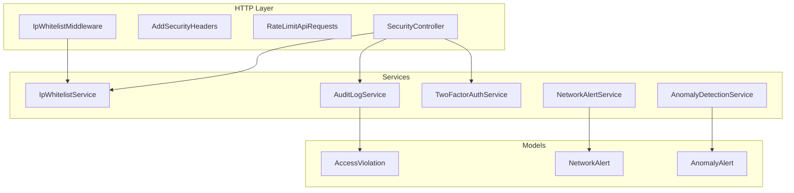
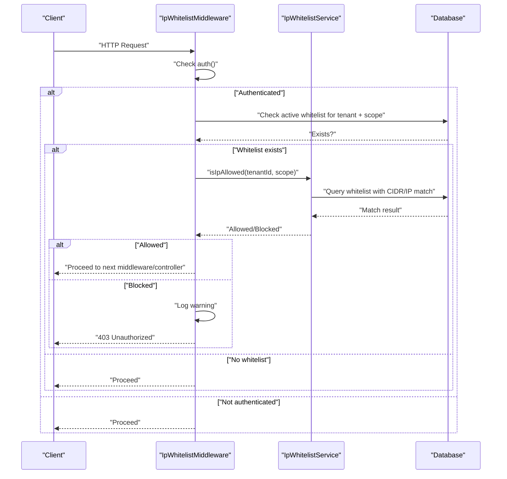
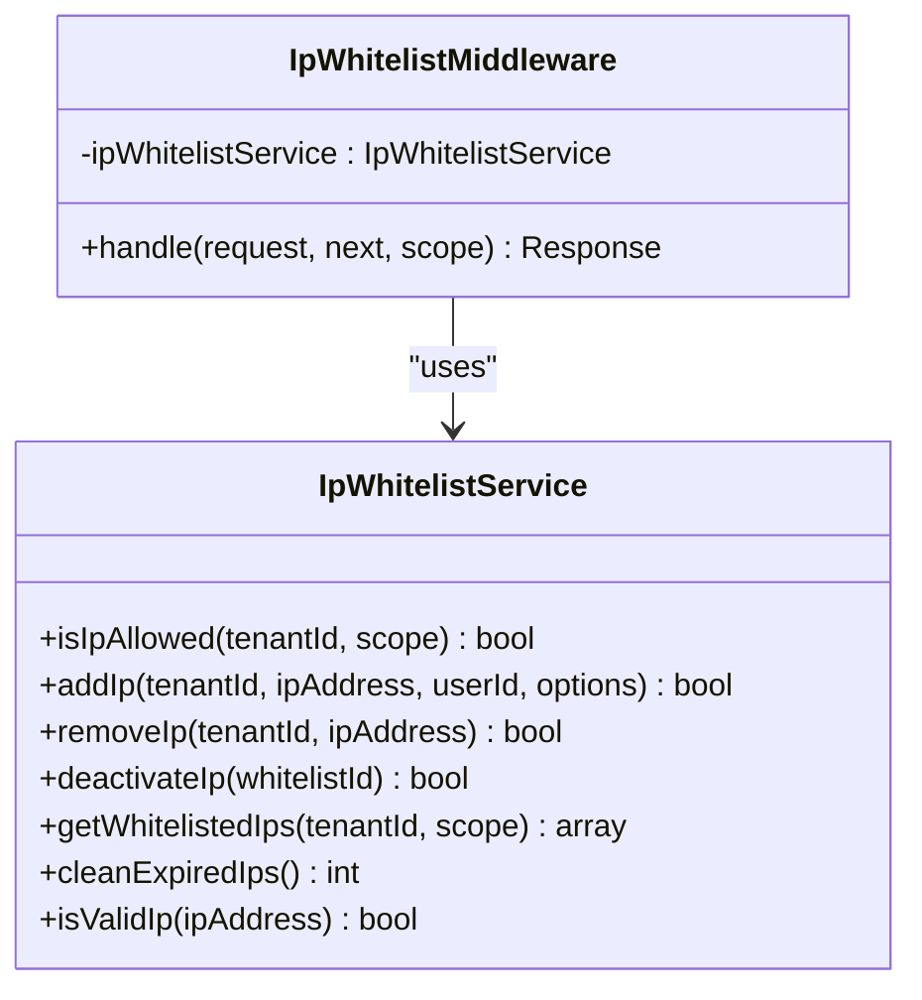
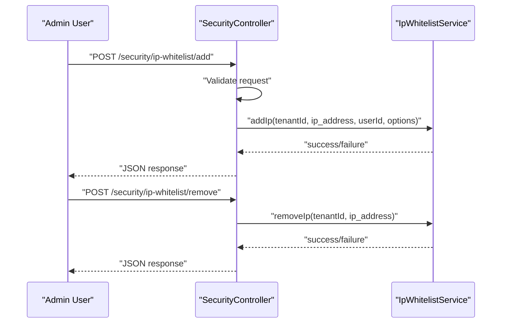
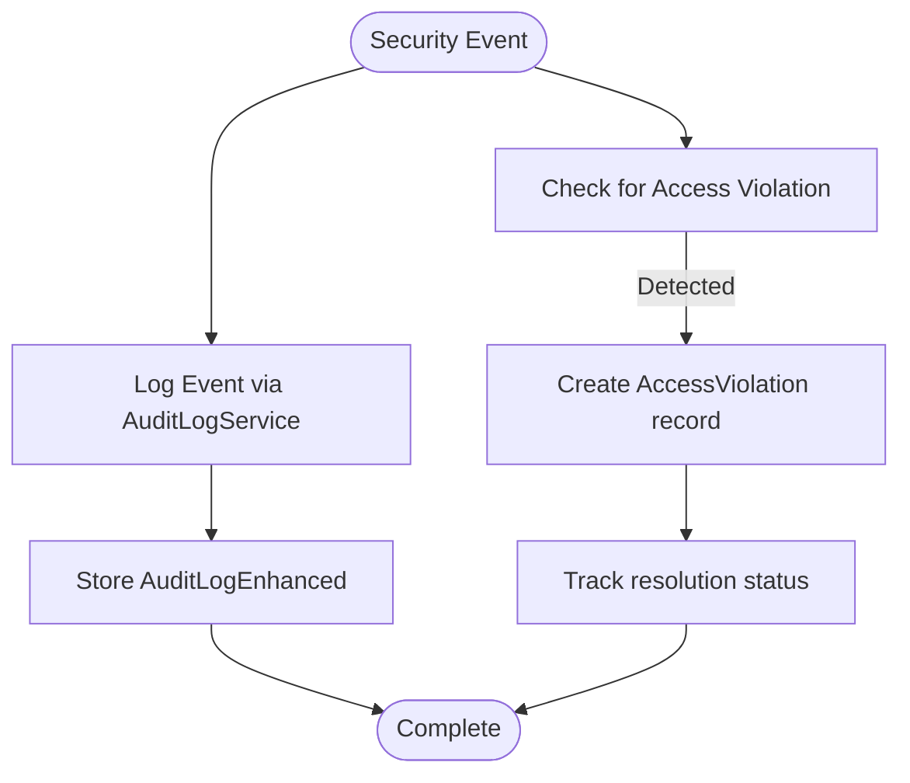
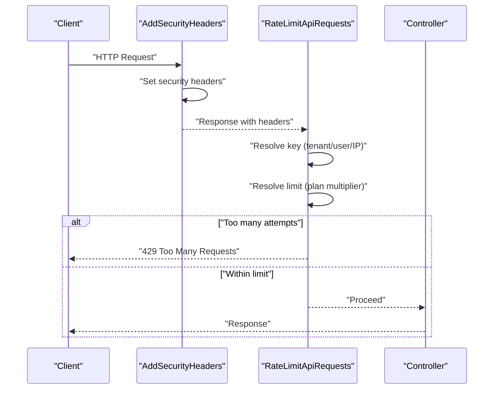
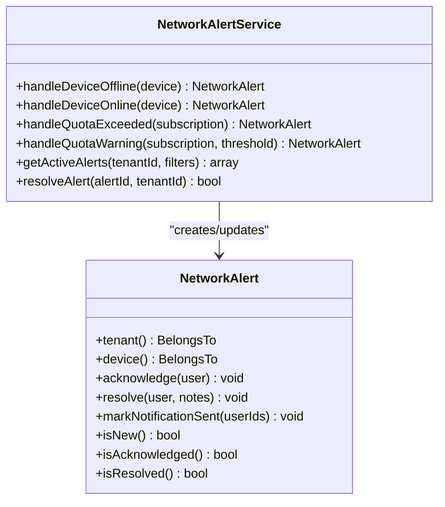
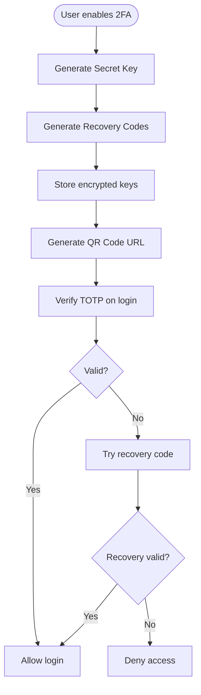
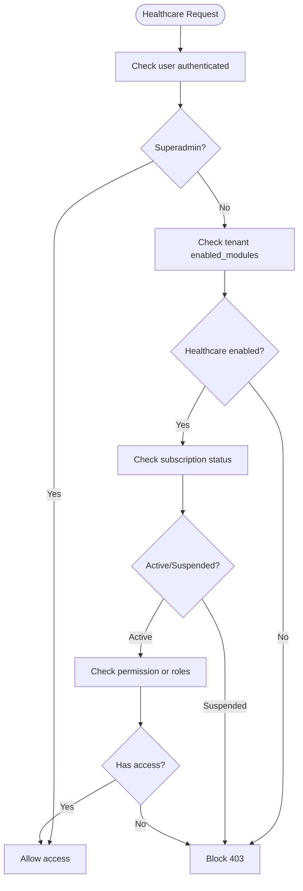
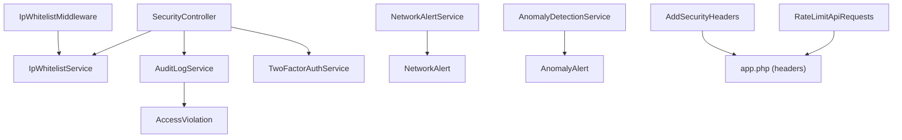

# IP Whitelisting & Security Controls

<cite>
**Referenced Files in This Document**
- [IpWhitelistService.php](file://app/Services/Security/IpWhitelistService.php)
- [IpWhitelistMiddleware.php](file://app/Http/Middleware/IpWhitelistMiddleware.php)
- [SecurityController.php](file://app/Http/Controllers/Security/SecurityController.php)
- [web.php](file://routes/web.php)
- [AuditLogService.php](file://app/Services/Security/AuditLogService.php)
- [AddSecurityHeaders.php](file://app/Http/Middleware/AddSecurityHeaders.php)
- [RateLimitApiRequests.php](file://app/Http/Middleware/RateLimitApiRequests.php)
- [NetworkAlertService.php](file://app/Services/Telecom/NetworkAlertService.php)
- [NetworkAlert.php](file://app/Models/NetworkAlert.php)
- [AnomalyDetectionService.php](file://app/Services/AnomalyDetectionService.php)
- [AccessViolation.php](file://app/Models/AccessViolation.php)
- [RegulatoryComplianceService.php](file://app/Services/RegulatoryComplianceService.php)
- [app.php](file://bootstrap/app.php)
- [app.php](file://config/app.php)
- [TwoFactorAuthService.php](file://app/Services/Security/TwoFactorAuthService.php)
- [HealthcareAccessMiddleware.php](file://app/Http/Middleware/HealthcareAccessMiddleware.php)
- [app.php](file://app/Http/Middleware/SecurityHeaders.php)
</cite>

## Table of Contents
1. [Introduction](#introduction)
2. [Project Structure](#project-structure)
3. [Core Components](#core-components)
4. [Architecture Overview](#architecture-overview)
5. [Detailed Component Analysis](#detailed-component-analysis)
6. [Dependency Analysis](#dependency-analysis)
7. [Performance Considerations](#performance-considerations)
8. [Troubleshooting Guide](#troubleshooting-guide)
9. [Conclusion](#conclusion)

## Introduction
This document provides comprehensive IP whitelisting and security controls documentation for Qalcuity ERP. It covers IP address restriction mechanisms, access violation logging, and security breach detection. It details whitelist configuration, dynamic IP management, and automated security alerts. Additionally, it outlines network security policies, intrusion detection, and security incident response procedures, along with API security, rate limiting, and protections against common web attacks.

## Project Structure
Qalcuity ERP implements security controls through dedicated services, middleware, controllers, and models. The IP whitelisting feature is centered around a service and middleware pair, while broader security measures include audit logging, rate limiting, two-factor authentication, and network alerting.

**Diagram sources**
- [IpWhitelistMiddleware.php:1-62](file://app/Http/Middleware/IpWhitelistMiddleware.php#L1-L62)
- [IpWhitelistService.php:1-160](file://app/Services/Security/IpWhitelistService.php#L1-L160)
- [SecurityController.php:1-38](file://app/Http/Controllers/Security/SecurityController.php#L1-L38)
- [AuditLogService.php:1-214](file://app/Services/Security/AuditLogService.php#L1-L214)
- [TwoFactorAuthService.php:1-239](file://app/Services/Security/TwoFactorAuthService.php#L1-L239)
- [NetworkAlertService.php:1-495](file://app/Services/Telecom/NetworkAlertService.php#L1-L495)
- [NetworkAlert.php:1-221](file://app/Models/NetworkAlert.php#L1-L221)
- [AnomalyDetectionService.php:1-287](file://app/Services/AnomalyDetectionService.php#L1-L287)
- [AccessViolation.php:1-54](file://app/Models/AccessViolation.php#L1-L54)

**Section sources**
- [IpWhitelistService.php:1-160](file://app/Services/Security/IpWhitelistService.php#L1-L160)
- [IpWhitelistMiddleware.php:1-62](file://app/Http/Middleware/IpWhitelistMiddleware.php#L1-L62)
- [SecurityController.php:1-38](file://app/Http/Controllers/Security/SecurityController.php#L1-L38)
- [AuditLogService.php:1-214](file://app/Services/Security/AuditLogService.php#L1-L214)
- [AddSecurityHeaders.php:1-79](file://app/Http/Middleware/AddSecurityHeaders.php#L1-L79)
- [RateLimitApiRequests.php:1-118](file://app/Http/Middleware/RateLimitApiRequests.php#L1-L118)
- [NetworkAlertService.php:1-495](file://app/Services/Telecom/NetworkAlertService.php#L1-L495)
- [NetworkAlert.php:1-221](file://app/Models/NetworkAlert.php#L1-L221)
- [AnomalyDetectionService.php:1-287](file://app/Services/AnomalyDetectionService.php#L1-L287)
- [AccessViolation.php:1-54](file://app/Models/AccessViolation.php#L1-L54)

## Core Components
- IP Whitelist Service: Validates and manages IP entries per tenant and scope, supports CIDR ranges and expiration.
- IP Whitelist Middleware: Enforces IP restrictions for authenticated users based on active whitelist entries.
- Security Controller: Provides endpoints to manage whitelist entries and audit logs.
- Audit Logging Service: Centralized logging for security events, login/logout, and CRUD operations.
- Security Headers Middleware: Adds CSP, frame options, XSS protection, referrer policy, and permissions policy.
- Rate Limiting Middleware: Per-tenant, per-endpoint rate limiting with plan-based multipliers.
- Network Alert Service: Detects and handles network device and telecom quota events with notifications.
- Anomaly Detection Service: Identifies unusual transactions, journal imbalances, duplicates, fraud patterns, price anomalies, and stock mismatches.
- Access Violation Model: Tracks unauthorized access attempts and compliance violations.
- Two-Factor Authentication Service: Manages TOTP-based 2FA setup, verification, and recovery codes.

**Section sources**
- [IpWhitelistService.php:1-160](file://app/Services/Security/IpWhitelistService.php#L1-L160)
- [IpWhitelistMiddleware.php:1-62](file://app/Http/Middleware/IpWhitelistMiddleware.php#L1-L62)
- [SecurityController.php:116-199](file://app/Http/Controllers/Security/SecurityController.php#L116-L199)
- [AuditLogService.php:13-81](file://app/Services/Security/AuditLogService.php#L13-L81)
- [AddSecurityHeaders.php:19-47](file://app/Http/Middleware/AddSecurityHeaders.php#L19-L47)
- [RateLimitApiRequests.php:24-87](file://app/Http/Middleware/RateLimitApiRequests.php#L24-L87)
- [NetworkAlertService.php:34-84](file://app/Services/Telecom/NetworkAlertService.php#L34-L84)
- [AnomalyDetectionService.php:22-66](file://app/Services/AnomalyDetectionService.php#L22-L66)
- [AccessViolation.php:12-32](file://app/Models/AccessViolation.php#L12-L32)
- [TwoFactorAuthService.php:22-99](file://app/Services/Security/TwoFactorAuthService.php#L22-L99)

## Architecture Overview
The security architecture integrates IP whitelisting enforcement, centralized audit logging, robust HTTP security headers, per-tenant rate limiting, anomaly detection, and network alerting. Controllers orchestrate service interactions, while middleware enforces runtime policies.

**Diagram sources**
- [IpWhitelistMiddleware.php:22-60](file://app/Http/Middleware/IpWhitelistMiddleware.php#L22-L60)
- [IpWhitelistService.php:13-31](file://app/Services/Security/IpWhitelistService.php#L13-L31)

**Section sources**
- [IpWhitelistMiddleware.php:1-62](file://app/Http/Middleware/IpWhitelistMiddleware.php#L1-L62)
- [IpWhitelistService.php:1-160](file://app/Services/Security/IpWhitelistService.php#L1-L160)

## Detailed Component Analysis

### IP Whitelist Service and Middleware
- Whitelist validation supports single IPs and CIDR notation, with expiration handling and cleanup.
- Middleware enforces IP restrictions only for authenticated users and scopes (admin, api, all).
- Unauthorized attempts are logged with contextual metadata.

**Diagram sources**
- [IpWhitelistService.php:8-160](file://app/Services/Security/IpWhitelistService.php#L8-L160)
- [IpWhitelistMiddleware.php:10-62](file://app/Http/Middleware/IpWhitelistMiddleware.php#L10-L62)

**Section sources**
- [IpWhitelistService.php:13-160](file://app/Services/Security/IpWhitelistService.php#L13-L160)
- [IpWhitelistMiddleware.php:22-60](file://app/Http/Middleware/IpWhitelistMiddleware.php#L22-L60)

### Security Controller for Whitelist Management
- Provides endpoints to list, add, remove, and deactivate whitelist entries.
- Validates IP format and applies scope constraints.

**Diagram sources**
- [SecurityController.php:125-183](file://app/Http/Controllers/Security/SecurityController.php#L125-L183)
- [web.php:2619-2625](file://routes/web.php#L2619-L2625)

**Section sources**
- [SecurityController.php:116-199](file://app/Http/Controllers/Security/SecurityController.php#L116-L199)
- [web.php:2619-2625](file://routes/web.php#L2619-L2625)

### Audit Logging and Access Violations
- AuditLogService centralizes logging of security events, login/logout, and CRUD operations with device detection and export capabilities.
- AccessViolation model captures unauthorized access attempts with auto-generated violation numbers and resolution tracking.

**Diagram sources**
- [AuditLogService.php:13-81](file://app/Services/Security/AuditLogService.php#L13-L81)
- [AccessViolation.php:41-54](file://app/Models/AccessViolation.php#L41-L54)

**Section sources**
- [AuditLogService.php:13-214](file://app/Services/Security/AuditLogService.php#L13-L214)
- [AccessViolation.php:12-54](file://app/Models/AccessViolation.php#L12-L54)

### Security Headers and API Security
- AddSecurityHeaders middleware sets CSP, X-Frame-Options, X-Content-Type-Options, X-XSS-Protection, referrer policy, and permissions policy.
- RateLimitApiRequests provides per-tenant, per-endpoint rate limiting with plan-based multipliers and standardized rate limit headers.

**Diagram sources**
- [AddSecurityHeaders.php:19-47](file://app/Http/Middleware/AddSecurityHeaders.php#L19-L47)
- [RateLimitApiRequests.php:24-87](file://app/Http/Middleware/RateLimitApiRequests.php#L24-L87)

**Section sources**
- [AddSecurityHeaders.php:19-79](file://app/Http/Middleware/AddSecurityHeaders.php#L19-L79)
- [RateLimitApiRequests.php:24-118](file://app/Http/Middleware/RateLimitApiRequests.php#L24-L118)

### Intrusion Detection and Automated Alerts
- NetworkAlertService detects device offline/online and telecom quota events, calculates severity, sends notifications, and triggers webhooks.
- NetworkAlert model tracks alert lifecycle, acknowledgments, resolutions, and user notifications.
- AnomalyDetectionService identifies financial and inventory anomalies and stores them as AnomalyAlert records.

**Diagram sources**
- [NetworkAlertService.php:34-132](file://app/Services/Telecom/NetworkAlertService.php#L34-L132)
- [NetworkAlert.php:10-131](file://app/Models/NetworkAlert.php#L10-L131)

**Section sources**
- [NetworkAlertService.php:34-495](file://app/Services/Telecom/NetworkAlertService.php#L34-L495)
- [NetworkAlert.php:13-131](file://app/Models/NetworkAlert.php#L13-L131)
- [AnomalyDetectionService.php:22-66](file://app/Services/AnomalyDetectionService.php#L22-L66)

### Two-Factor Authentication
- TwoFactorAuthService manages TOTP secret generation, QR code URL creation, verification, recovery code usage, and status retrieval.

**Diagram sources**
- [TwoFactorAuthService.php:22-131](file://app/Services/Security/TwoFactorAuthService.php#L22-L131)

**Section sources**
- [TwoFactorAuthService.php:22-239](file://app/Services/Security/TwoFactorAuthService.php#L22-L239)

### Healthcare Module Access Control
- HealthcareAccessMiddleware enforces role-based access, tenant module enablement, subscription status, and optional permission checks.

**Diagram sources**
- [HealthcareAccessMiddleware.php:16-67](file://app/Http/Middleware/HealthcareAccessMiddleware.php#L16-L67)

**Section sources**
- [HealthcareAccessMiddleware.php:16-67](file://app/Http/Middleware/HealthcareAccessMiddleware.php#L16-L67)

## Dependency Analysis
The following diagram shows key dependencies among security components:

**Diagram sources**
- [IpWhitelistMiddleware.php:10-17](file://app/Http/Middleware/IpWhitelistMiddleware.php#L10-L17)
- [IpWhitelistService.php:8-9](file://app/Services/Security/IpWhitelistService.php#L8-L9)
- [SecurityController.php:15-38](file://app/Http/Controllers/Security/SecurityController.php#L15-L38)
- [AuditLogService.php:5-6](file://app/Services/Security/AuditLogService.php#L5-L6)
- [TwoFactorAuthService.php:5-7](file://app/Services/Security/TwoFactorAuthService.php#L5-L7)
- [NetworkAlertService.php:5-10](file://app/Services/Telecom/NetworkAlertService.php#L5-L10)
- [NetworkAlert.php:5-8](file://app/Models/NetworkAlert.php#L5-L8)
- [AnomalyDetectionService.php:5-10](file://app/Services/AnomalyDetectionService.php#L5-L10)
- [AccessViolation.php:5-7](file://app/Models/AccessViolation.php#L5-L7)
- [AddSecurityHeaders.php:19-47](file://app/Http/Middleware/AddSecurityHeaders.php#L19-L47)
- [RateLimitApiRequests.php:24-87](file://app/Http/Middleware/RateLimitApiRequests.php#L24-L87)
- [app.php:1-127](file://config/app.php#L1-L127)

**Section sources**
- [app.php:32-41](file://bootstrap/app.php#L32-L41)
- [AddSecurityHeaders.php:19-79](file://app/Http/Middleware/AddSecurityHeaders.php#L19-L79)
- [RateLimitApiRequests.php:24-118](file://app/Http/Middleware/RateLimitApiRequests.php#L24-L118)

## Performance Considerations
- IP whitelist queries use indexed tenant and scope fields with CIDR matching; ensure proper indexing on ip_address and tenant_id for optimal performance.
- Rate limiting uses per-minute limits keyed by tenant/user/IP; consider Redis-backed stores for distributed environments.
- Audit logging and anomaly detection process large datasets; paginate and filter results to avoid heavy queries.
- Network alerting triggers notifications and webhooks; batch notifications and throttle webhook dispatches under load.

## Troubleshooting Guide
- IP Whitelist Blocked: Verify active whitelist entries for the tenant and scope, ensure IP/CIDR format is valid, and confirm the user is authenticated.
- Unauthorized Access Attempt: Check warning logs emitted by the middleware and review AccessViolation records for resolution.
- Rate Limit Exceeded: Inspect rate limiter keys and plan multipliers; adjust limits or upgrade tenant plan accordingly.
- Security Headers Missing: Confirm middleware registration and environment configuration for production HSTS.
- Network Alerts Not Sent: Validate notification service configuration, webhook endpoints, and alert severity thresholds.

**Section sources**
- [IpWhitelistMiddleware.php:44-56](file://app/Http/Middleware/IpWhitelistMiddleware.php#L44-L56)
- [AuditLogService.php:13-32](file://app/Services/Security/AuditLogService.php#L13-L32)
- [RateLimitApiRequests.php:32-44](file://app/Http/Middleware/RateLimitApiRequests.php#L32-L44)
- [AddSecurityHeaders.php:42-48](file://app/Http/Middleware/AddSecurityHeaders.php#L42-L48)
- [NetworkAlertService.php:341-360](file://app/Services/Telecom/NetworkAlertService.php#L341-L360)

## Conclusion
Qalcuity ERP implements a layered security model combining IP whitelisting, comprehensive audit logging, strict HTTP security headers, per-tenant rate limiting, anomaly detection, and network alerting. These controls collectively strengthen access governance, detect suspicious activities, and support automated incident response. Administrators should regularly review whitelist configurations, monitor audit trails, and maintain up-to-date security policies aligned with organizational risk tolerance.