# Security & Compliance Enhancements

<cite>
**Referenced Files in This Document**
- [config/security.php](file://config/security.php)
- [config/password.php](file://config/password.php)
- [app/Services/Security/TwoFactorAuthService.php](file://app/Services/Security/TwoFactorAuthService.php)
- [app/Services/Security/SessionManagementService.php](file://app/Services/Security/SessionManagementService.php)
- [app/Services/Security/GdprComplianceService.php](file://app/Services/Security/GdprComplianceService.php)
- [app/Services/Security/EncryptionService.php](file://app/Services/Security/EncryptionService.php)
- [app/Services/Security/IpWhitelistService.php](file://app/Services/Security/IpWhitelistService.php)
- [app/Services/AccountLockoutService.php](file://app/Services/AccountLockoutService.php)
- [app/Rules/StrongPassword.php](file://app/Rules/StrongPassword.php)
- [app/Models/PasswordHistory.php](file://app/Models/PasswordHistory.php)
- [app/Models/TenantWhatsAppSettings.php](file://app/Models/TenantWhatsAppSettings.php)
- [app/Services/WhatsAppService.php](file://app/Services/WhatsAppService.php)
- [app/Http/Controllers/Security/SecurityController.php](file://app/Http/Controllers/Security/SecurityController.php)
- [app/Http/Middleware/AddSecurityHeaders.php](file://app/Http/Middleware/AddSecurityHeaders.php)
- [app/Http/Middleware/SecurityHeaders.php](file://app/Http/Middleware/SecurityHeaders.php)
- [app/Models/UserSession.php](file://app/Models/UserSession.php)
- [routes/auth.php](file://routes/auth.php)
- [SECURITY_AUDIT_REPORT.md](file://SECURITY_AUDIT_REPORT.md)
</cite>

## Update Summary
**Changes Made**
- Enhanced AccountLockoutService with comprehensive configurable lockout mechanisms and Redis cache integration
- Strengthened StrongPassword validation rule with advanced complexity scoring and password history tracking
- Expanded security configuration options in security.php and password.php with extensive policy controls
- Integrated password expiration policies and breach detection capabilities
- Enhanced security middleware with improved CSP policies and sensitive route handling
- Added tenant-specific WhatsApp settings with multi-provider support for secure messaging
- Implemented comprehensive encryption service with key rotation and HMAC hashing
- Enhanced GDPR compliance service with advanced data export and deletion workflows
- Added IP whitelist service with CIDR support and scope-based access control

## Table of Contents
1. [Introduction](#introduction)
2. [Project Structure](#project-structure)
3. [Core Components](#core-components)
4. [Architecture Overview](#architecture-overview)
5. [Detailed Component Analysis](#detailed-component-analysis)
6. [Dependency Analysis](#dependency-analysis)
7. [Performance Considerations](#performance-considerations)
8. [Troubleshooting Guide](#troubleshooting-guide)
9. [Conclusion](#conclusion)

## Introduction
This document presents a comprehensive analysis of the Security & Compliance Enhancements implemented in the qalcuityERP system. The focus areas include authentication and session management, encryption, audit trails, GDPR compliance, HIPAA safeguards, security headers, API security controls, IP whitelisting, and enhanced password security policies. The analysis synthesizes configuration-driven security settings, service-layer implementations, middleware protections, controller-based administrative interfaces, and new password management components to provide both technical depth and practical guidance for maintaining robust security and regulatory compliance.

**Updated** The recent enhancements introduce a comprehensive security framework featuring configurable account lockout mechanisms, advanced password validation rules, tenant-specific WhatsApp messaging capabilities, extensive configuration options that provide enterprise-grade security controls tailored to various compliance requirements, and enhanced data protection mechanisms.

## Project Structure
The security and compliance features are organized across configuration, services, middleware, models, and controllers:

- Configuration: Centralized security policy settings via config/security.php and config/password.php
- Services: Dedicated security services for 2FA, sessions, encryption, GDPR, IP whitelisting, and account lockout
- Rules: Strong password validation with comprehensive policy enforcement
- Models: Persistent entities for sessions, password history, tenant WhatsApp settings, and related security artifacts
- Controllers: Administrative interfaces for security operations

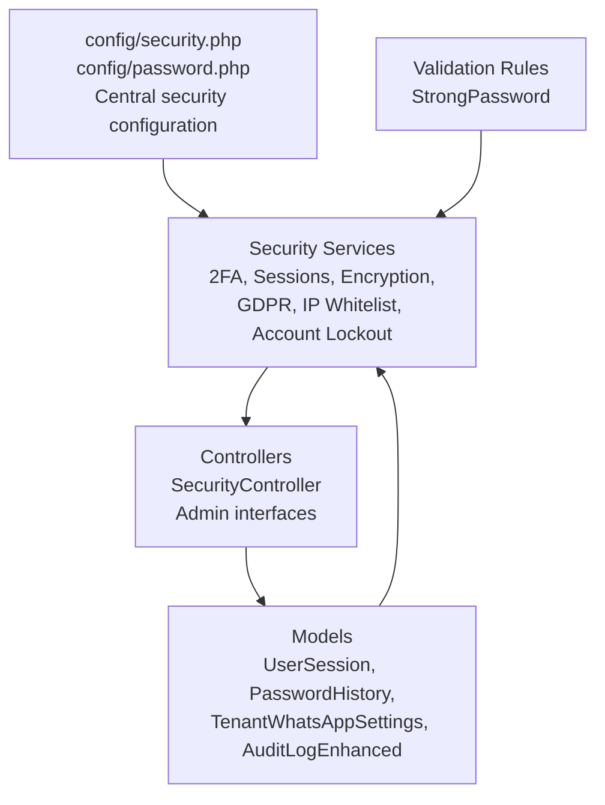

**Diagram sources**
- [config/security.php:1-155](file://config/security.php#L1-L155)
- [config/password.php:1-91](file://config/password.php#L1-L91)
- [app/Services/Security/TwoFactorAuthService.php:1-239](file://app/Services/Security/TwoFactorAuthService.php#L1-L239)
- [app/Services/Security/SessionManagementService.php:1-246](file://app/Services/Security/SessionManagementService.php#L1-L246)
- [app/Services/Security/GdprComplianceService.php:1-400](file://app/Services/Security/GdprComplianceService.php#L1-L400)
- [app/Services/Security/EncryptionService.php:1-170](file://app/Services/Security/EncryptionService.php#L1-L170)
- [app/Services/Security/IpWhitelistService.php:1-161](file://app/Services/Security/IpWhitelistService.php#L1-L161)
- [app/Services/AccountLockoutService.php:1-247](file://app/Services/AccountLockoutService.php#L1-L247)
- [app/Rules/StrongPassword.php:1-226](file://app/Rules/StrongPassword.php#L1-L226)
- [app/Models/PasswordHistory.php:1-38](file://app/Models/PasswordHistory.php#L1-L38)
- [app/Http/Middleware/AddSecurityHeaders.php:1-79](file://app/Http/Middleware/AddSecurityHeaders.php#L1-L79)
- [app/Http/Middleware/SecurityHeaders.php:1-114](file://app/Http/Middleware/SecurityHeaders.php#L1-L114)
- [app/Models/UserSession.php:1-47](file://app/Models/UserSession.php#L1-L47)
- [app/Http/Controllers/Security/SecurityController.php:1-460](file://app/Http/Controllers/Security/SecurityController.php#L1-L460)

**Section sources**
- [config/security.php:1-155](file://config/security.php#L1-L155)
- [config/password.php:1-91](file://config/password.php#L1-L91)
- [routes/auth.php:1-73](file://routes/auth.php#L1-L73)

## Core Components
This section outlines the primary security and compliance components and their roles:

- Configuration-driven security policies define account lockout, session management, encryption, audit retention, GDPR and HIPAA settings, security headers, API limits, upload restrictions, and comprehensive password policies including length requirements, character type validation, common password prevention, username/email inclusion checks, password history tracking, and expiration controls.
- Two-Factor Authentication service manages secret key generation, QR codes, verification, recovery codes, and activation/deactivation.
- Session Management service tracks devices, browsers, platforms, locations, activity timestamps, and expiration; supports termination and cleanup.
- Encryption service handles data encryption/decryption, key rotation, and HMAC hashing for searchable encrypted fields.
- GDPR Compliance service orchestrates data export requests, deletion approvals, consent recording/revoke, and anonymization procedures.
- IP Whitelist service enforces allowlists with CIDR support, scopes, expiration, and validation.
- Account Lockout Service provides configurable failed login attempt tracking, automatic account locking, warning thresholds, and notification capabilities.
- Strong Password Validation Rule enforces comprehensive password policies including minimum length, character type requirements, complexity scoring, common password detection, username/email inclusion prevention, and password history validation.
- Tenant WhatsApp Settings provide tenant-specific messaging configurations with multi-provider support.
- Security Controllers expose admin endpoints for 2FA, sessions, IP whitelists, account lockout management, and audit log management.
- Security Headers middleware applies CSP, HSTS, X-Frame-Options, X-Content-Type-Options, X-XSS-Protection, Referrer-Policy, Permissions-Policy, and sensitive page caching controls.

**Section sources**
- [config/security.php:1-155](file://config/security.php#L1-L155)
- [config/password.php:1-91](file://config/password.php#L1-L91)
- [app/Services/Security/TwoFactorAuthService.php:1-239](file://app/Services/Security/TwoFactorAuthService.php#L1-L239)
- [app/Services/Security/SessionManagementService.php:1-246](file://app/Services/Security/SessionManagementService.php#L1-L246)
- [app/Services/Security/EncryptionService.php:1-170](file://app/Services/Security/EncryptionService.php#L1-L170)
- [app/Services/Security/GdprComplianceService.php:1-400](file://app/Services/Security/GdprComplianceService.php#L1-L400)
- [app/Services/Security/IpWhitelistService.php:1-161](file://app/Services/Security/IpWhitelistService.php#L1-L161)
- [app/Services/AccountLockoutService.php:1-247](file://app/Services/AccountLockoutService.php#L1-L247)
- [app/Rules/StrongPassword.php:1-226](file://app/Rules/StrongPassword.php#L1-L226)
- [app/Models/PasswordHistory.php:1-38](file://app/Models/PasswordHistory.php#L1-L38)
- [app/Models/TenantWhatsAppSettings.php:1-112](file://app/Models/TenantWhatsAppSettings.php#L1-L112)
- [app/Services/WhatsAppService.php:1-445](file://app/Services/WhatsAppService.php#L1-L445)
- [app/Http/Controllers/Security/SecurityController.php:1-460](file://app/Http/Controllers/Security/SecurityController.php#L1-L460)
- [app/Http/Middleware/AddSecurityHeaders.php:1-79](file://app/Http/Middleware/AddSecurityHeaders.php#L1-L79)
- [app/Http/Middleware/SecurityHeaders.php:1-114](file://app/Http/Middleware/SecurityHeaders.php#L1-L114)

## Architecture Overview
The security architecture integrates configuration, services, middleware, and controllers to enforce layered protections with enhanced authentication mechanisms:

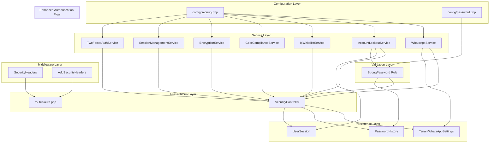

**Diagram sources**
- [config/security.php:1-155](file://config/security.php#L1-L155)
- [config/password.php:1-91](file://config/password.php#L1-L91)
- [app/Services/Security/TwoFactorAuthService.php:1-239](file://app/Services/Security/TwoFactorAuthService.php#L1-L239)
- [app/Services/Security/SessionManagementService.php:1-246](file://app/Services/Security/SessionManagementService.php#L1-L246)
- [app/Services/Security/EncryptionService.php:1-170](file://app/Services/Security/EncryptionService.php#L1-L170)
- [app/Services/Security/GdprComplianceService.php:1-400](file://app/Services/Security/GdprComplianceService.php#L1-L400)
- [app/Services/Security/IpWhitelistService.php:1-161](file://app/Services/Security/IpWhitelistService.php#L1-L161)
- [app/Services/AccountLockoutService.php:1-247](file://app/Services/AccountLockoutService.php#L1-L247)
- [app/Services/WhatsAppService.php:1-445](file://app/Services/WhatsAppService.php#L1-L445)
- [app/Rules/StrongPassword.php:1-226](file://app/Rules/StrongPassword.php#L1-L226)
- [app/Models/PasswordHistory.php:1-38](file://app/Models/PasswordHistory.php#L1-L38)
- [app/Http/Middleware/SecurityHeaders.php:1-114](file://app/Http/Middleware/SecurityHeaders.php#L1-L114)
- [app/Http/Middleware/AddSecurityHeaders.php:1-79](file://app/Http/Middleware/AddSecurityHeaders.php#L1-L79)
- [app/Http/Controllers/Security/SecurityController.php:1-460](file://app/Http/Controllers/Security/SecurityController.php#L1-L460)
- [routes/auth.php:1-73](file://routes/auth.php#L1-L73)
- [app/Models/UserSession.php:1-47](file://app/Models/UserSession.php#L1-L47)
- [app/Models/TenantWhatsAppSettings.php:1-112](file://app/Models/TenantWhatsAppSettings.php#L1-L112)

## Detailed Component Analysis

### Enhanced Password Security System
The password security system provides comprehensive validation and enforcement mechanisms:

- **StrongPassword Validation Rule**: Enforces minimum length requirements, uppercase/lowercase/number/special character requirements, complexity scoring, common password detection, username/email inclusion prevention, and password history validation.
- **Password History Tracking**: Prevents reuse of previous passwords by storing hashed passwords and checking against them during password changes.
- **Advanced Password Policies**: Configurable minimum length, character type requirements, common password prevention, username/email inclusion checks, password expiration, and breach detection integration.

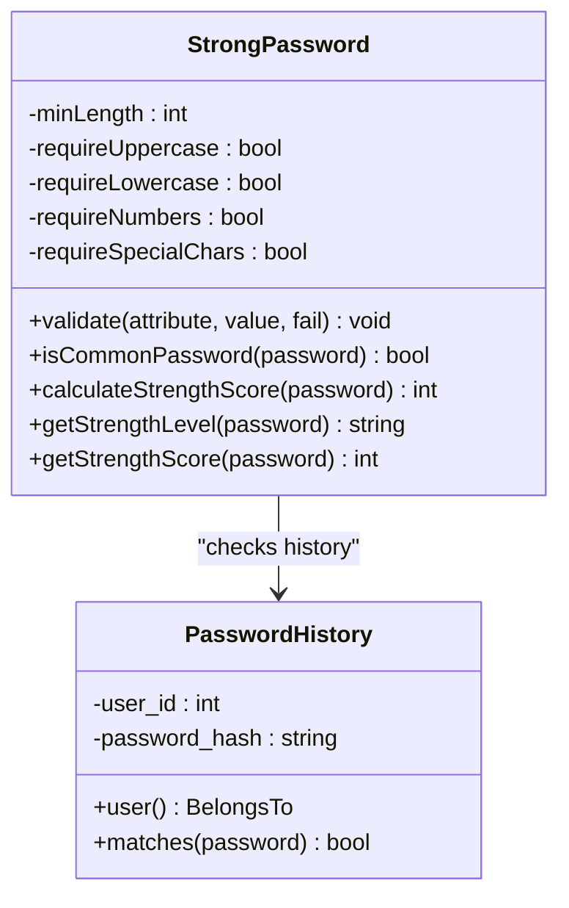

**Diagram sources**
- [app/Rules/StrongPassword.php:1-226](file://app/Rules/StrongPassword.php#L1-L226)
- [app/Models/PasswordHistory.php:1-38](file://app/Models/PasswordHistory.php#L1-L38)

**Section sources**
- [app/Rules/StrongPassword.php:23-226](file://app/Rules/StrongPassword.php#L23-L226)
- [app/Models/PasswordHistory.php:14-38](file://app/Models/PasswordHistory.php#L14-L38)
- [config/password.php:14-91](file://config/password.php#L14-L91)

### Account Lockout Service
The Account Lockout Service provides intelligent failed login attempt tracking and automatic account protection:

- **Configurable Thresholds**: Maximum failed attempts before lockout, lockout duration, and warning threshold configuration
- **Automatic Lockout**: Automatically locks accounts after exceeding maximum failed attempts
- **Cache Integration**: Uses Redis cache for fast lockout status checking and reduced database load
- **Warning System**: Provides warnings when failed attempts approach the maximum threshold
- **Notification Support**: Includes hooks for sending lockout notifications via email
- **Manual Unlock**: Allows administrators to manually unlock accounts
- **Status Reporting**: Provides comprehensive lockout status information including remaining time and attempt counts

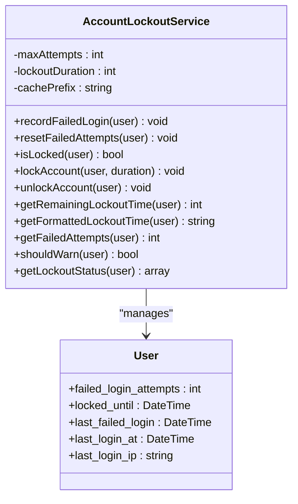

**Diagram sources**
- [app/Services/AccountLockoutService.php:1-247](file://app/Services/AccountLockoutService.php#L1-L247)
- [app/Models/User.php](file://app/Models/User.php)

**Section sources**
- [app/Services/AccountLockoutService.php:36-247](file://app/Services/AccountLockoutService.php#L36-L247)
- [config/security.php:10-15](file://config/security.php#L10-L15)

### Two-Factor Authentication Service
The Two-Factor Authentication service provides secure multi-factor authentication capabilities:
- Secret key generation using industry-standard TOTP
- Recovery code generation and secure storage
- Verification during enrollment and login
- Activation/deactivation lifecycle
- Audit-ready logging of events

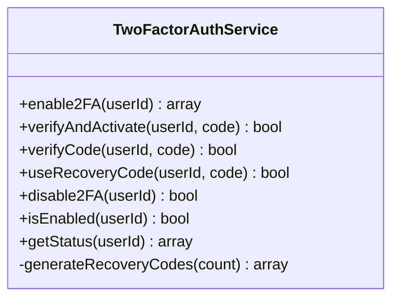

**Diagram sources**
- [app/Services/Security/TwoFactorAuthService.php:1-239](file://app/Services/Security/TwoFactorAuthService.php#L1-L239)

**Section sources**
- [app/Services/Security/TwoFactorAuthService.php:19-239](file://app/Services/Security/TwoFactorAuthService.php#L19-L239)

### Session Management Service
The Session Management service maintains device and location awareness, activity tracking, and lifecycle controls:
- Device/browser/platform detection from user agents
- Location inference and IP capture
- Active/inactive session state management
- Expiration and cleanup routines
- Activity refresh and termination APIs

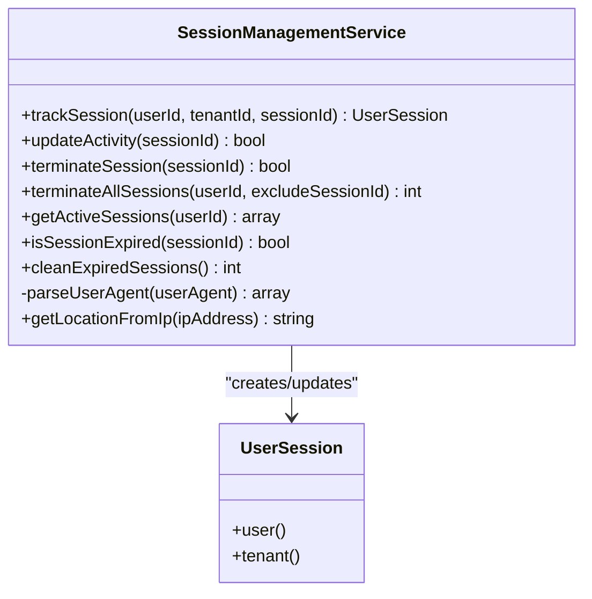

**Diagram sources**
- [app/Services/Security/SessionManagementService.php:1-246](file://app/Services/Security/SessionManagementService.php#L1-L246)
- [app/Models/UserSession.php:1-47](file://app/Models/UserSession.php#L1-L47)

**Section sources**
- [app/Services/Security/SessionManagementService.php:13-246](file://app/Services/Security/SessionManagementService.php#L13-L246)
- [app/Models/UserSession.php:14-47](file://app/Models/UserSession.php#L14-L47)

### Encryption Service
The Encryption service provides data-at-rest protection and key lifecycle management:
- Tenant-aware encryption/decryption using Laravel's Crypt facade
- Key rotation with audit trail updates
- HMAC hashing for searchable encrypted fields
- Array-level encryption/decryption helpers

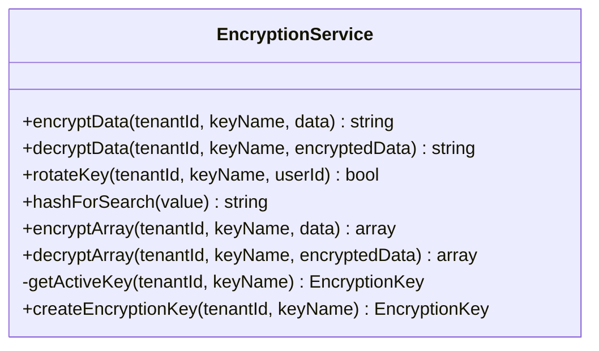

**Diagram sources**
- [app/Services/Security/EncryptionService.php:1-170](file://app/Services/Security/EncryptionService.php#L1-L170)

**Section sources**
- [app/Services/Security/EncryptionService.php:13-170](file://app/Services/Security/EncryptionService.php#L13-L170)

### GDPR Compliance Service
The GDPR Compliance service implements data subject rights and consent management:
- Data export request creation and asynchronous processing
- Deletion request approval and anonymization workflows
- Consent recording, revocation, and validation
- Module-specific data exports (patients, employees, customers, orders)

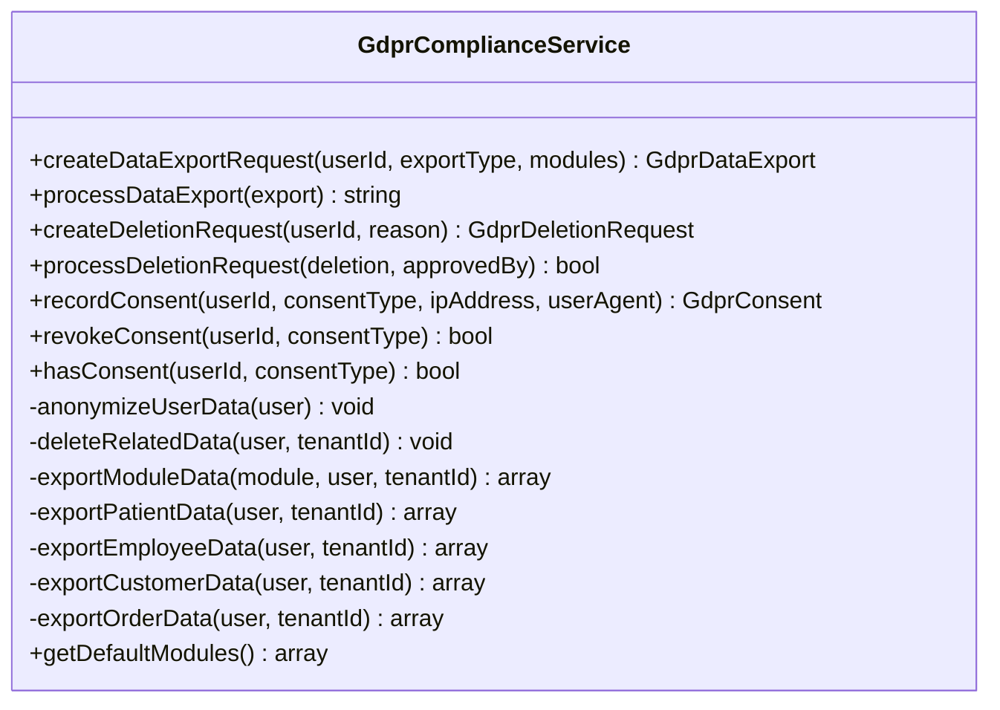

**Diagram sources**
- [app/Services/Security/GdprComplianceService.php:1-400](file://app/Services/Security/GdprComplianceService.php#L1-L400)

**Section sources**
- [app/Services/Security/GdprComplianceService.php:31-400](file://app/Services/Security/GdprComplianceService.php#L31-L400)

### IP Whitelist Service
The IP Whitelist service enforces network-level access controls:
- CIDR and single IP support
- Scope-based allowlists (admin, all)
- Expiration and deactivation
- Validation and cleanup routines

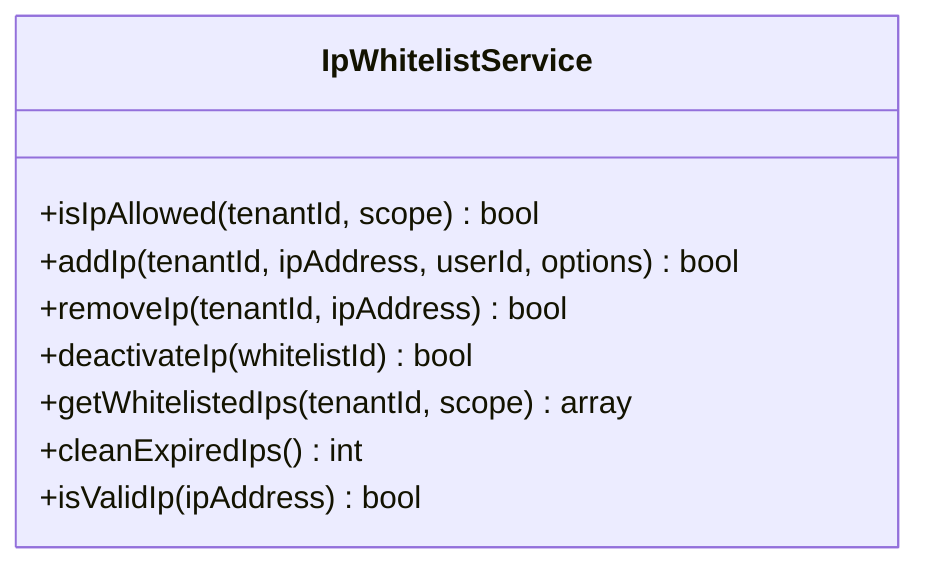

**Diagram sources**
- [app/Services/Security/IpWhitelistService.php:1-161](file://app/Services/Security/IpWhitelistService.php#L1-L161)

**Section sources**
- [app/Services/Security/IpWhitelistService.php:13-161](file://app/Services/Security/IpWhitelistService.php#L13-L161)

### Tenant WhatsApp Settings
Tenant-specific WhatsApp messaging configuration with multi-provider support:
- Provider selection (Fonnte, Wablas, Twilio, Ultramsg, Custom)
- API key and secret management
- Message scheduling and delivery tracking
- Daily message limit enforcement
- Notification type configuration

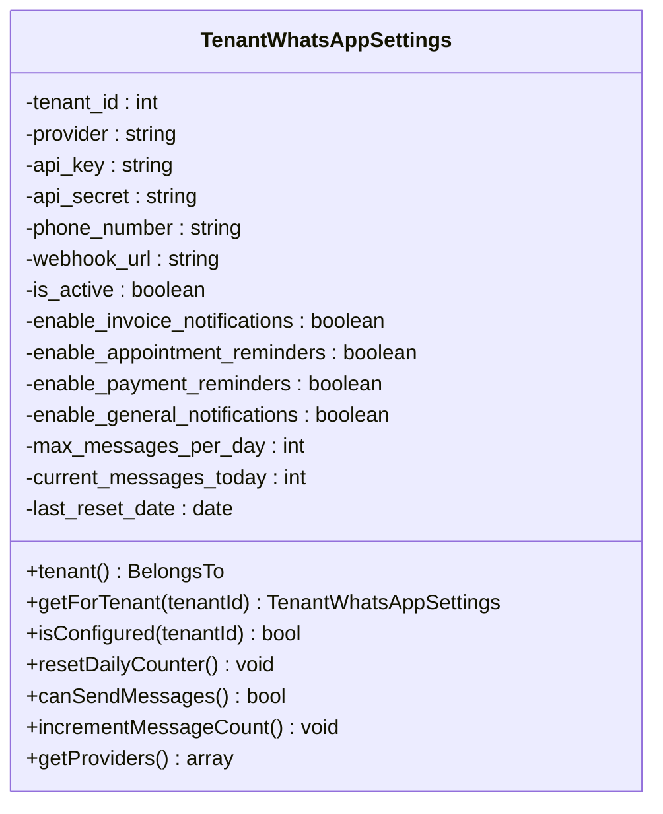

**Diagram sources**
- [app/Models/TenantWhatsAppSettings.php:1-112](file://app/Models/TenantWhatsAppSettings.php#L1-L112)

**Section sources**
- [app/Models/TenantWhatsAppSettings.php:48-112](file://app/Models/TenantWhatsAppSettings.php#L48-L112)
- [config/security.php:144-153](file://config/security.php#L144-L153)

### WhatsApp Service
Multi-provider WhatsApp notification service with tenant isolation:
- Provider abstraction layer supporting multiple messaging platforms
- Phone number normalization and validation
- Template-based message building for invoices, appointments, and payments
- Rate limiting and daily message tracking
- Error handling and retry mechanisms

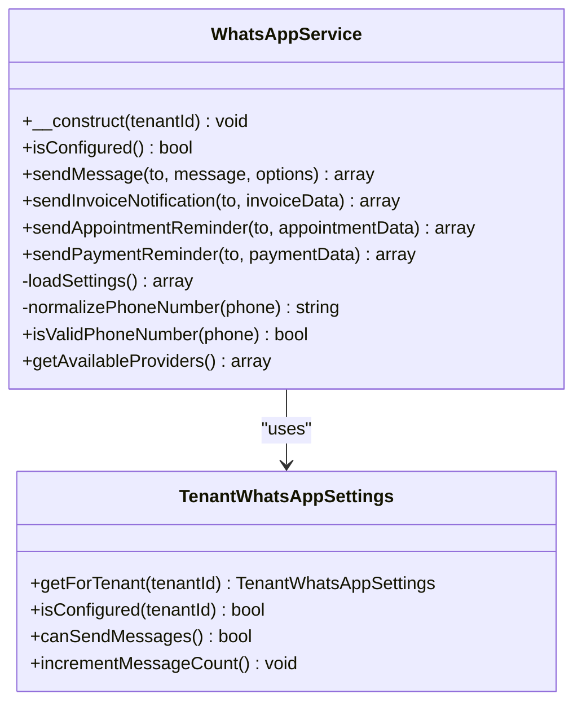

**Diagram sources**
- [app/Services/WhatsAppService.php:1-445](file://app/Services/WhatsAppService.php#L1-L445)
- [app/Models/TenantWhatsAppSettings.php:1-112](file://app/Models/TenantWhatsAppSettings.php#L1-L112)

**Section sources**
- [app/Services/WhatsAppService.php:25-445](file://app/Services/WhatsAppService.php#L25-L445)
- [app/Models/TenantWhatsAppSettings.php:48-112](file://app/Models/TenantWhatsAppSettings.php#L48-L112)

### Security Headers Middleware
Security headers middleware applies comprehensive protections:
- Content Security Policy (CSP) with development-friendly allowances
- X-Frame-Options, X-Content-Type-Options, X-XSS-Protection
- Strict-Transport-Security (HSTS) in production
- Referrer-Policy and Permissions-Policy
- Removal of X-Powered-By
- Cache control for sensitive routes

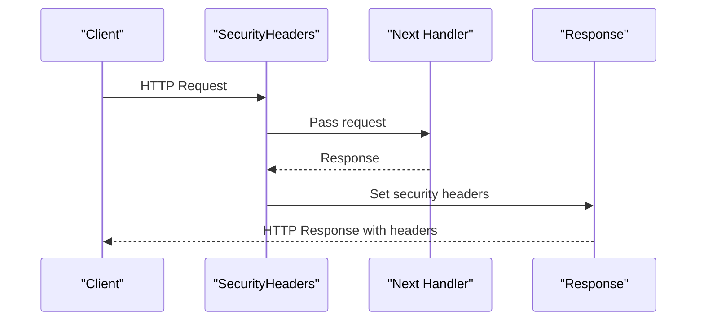

**Diagram sources**
- [app/Http/Middleware/SecurityHeaders.php:26-88](file://app/Http/Middleware/SecurityHeaders.php#L26-L88)

**Section sources**
- [app/Http/Middleware/SecurityHeaders.php:26-114](file://app/Http/Middleware/SecurityHeaders.php#L26-L114)
- [app/Http/Middleware/AddSecurityHeaders.php:19-79](file://app/Http/Middleware/AddSecurityHeaders.php#L19-L79)

### Security Controller
The Security Controller exposes administrative endpoints for:
- Two-Factor Authentication enable/verify/disable/status
- Active session listing and termination
- IP whitelist management (add/remove/deactivate)
- Account lockout management (status, unlock)
- Audit log retrieval and export

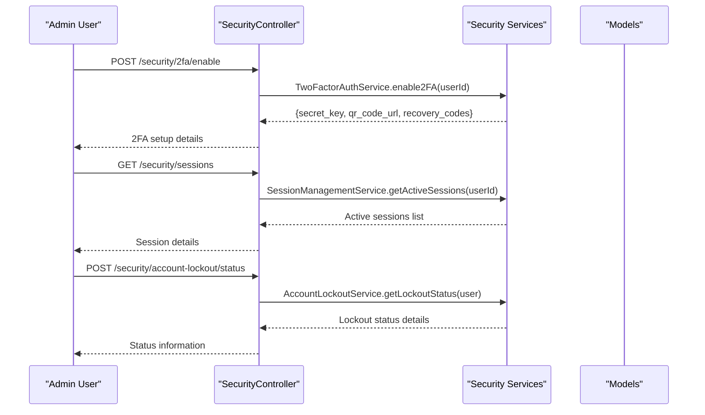

**Diagram sources**
- [app/Http/Controllers/Security/SecurityController.php:15-460](file://app/Http/Controllers/Security/SecurityController.php#L15-L460)
- [routes/auth.php:1-73](file://routes/auth.php#L1-L73)

**Section sources**
- [app/Http/Controllers/Security/SecurityController.php:15-460](file://app/Http/Controllers/Security/SecurityController.php#L15-L460)
- [routes/auth.php:1-73](file://routes/auth.php#L1-L73)

## Dependency Analysis
Security services depend on configuration values and collaborate with controllers and models:

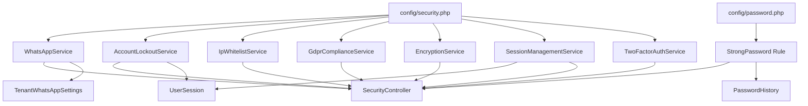

**Diagram sources**
- [config/security.php:1-155](file://config/security.php#L1-L155)
- [config/password.php:1-91](file://config/password.php#L1-L91)
- [app/Services/Security/TwoFactorAuthService.php:1-239](file://app/Services/Security/TwoFactorAuthService.php#L1-L239)
- [app/Services/Security/SessionManagementService.php:1-246](file://app/Services/Security/SessionManagementService.php#L1-L246)
- [app/Services/Security/EncryptionService.php:1-170](file://app/Services/Security/EncryptionService.php#L1-L170)
- [app/Services/Security/GdprComplianceService.php:1-400](file://app/Services/Security/GdprComplianceService.php#L1-L400)
- [app/Services/Security/IpWhitelistService.php:1-161](file://app/Services/Security/IpWhitelistService.php#L1-L161)
- [app/Services/AccountLockoutService.php:1-247](file://app/Services/AccountLockoutService.php#L1-L247)
- [app/Services/WhatsAppService.php:1-445](file://app/Services/WhatsAppService.php#L1-L445)
- [app/Rules/StrongPassword.php:1-226](file://app/Rules/StrongPassword.php#L1-L226)
- [app/Models/PasswordHistory.php:1-38](file://app/Models/PasswordHistory.php#L1-L38)
- [app/Models/TenantWhatsAppSettings.php:1-112](file://app/Models/TenantWhatsAppSettings.php#L1-L112)
- [app/Http/Controllers/Security/SecurityController.php:1-460](file://app/Http/Controllers/Security/SecurityController.php#L1-L460)
- [app/Models/UserSession.php:1-47](file://app/Models/UserSession.php#L1-L47)

**Section sources**
- [config/security.php:1-155](file://config/security.php#L1-L155)
- [config/password.php:1-91](file://config/password.php#L1-L91)
- [app/Services/Security/TwoFactorAuthService.php:1-239](file://app/Services/Security/TwoFactorAuthService.php#L1-L239)
- [app/Services/Security/SessionManagementService.php:1-246](file://app/Services/Security/SessionManagementService.php#L1-L246)
- [app/Services/Security/EncryptionService.php:1-170](file://app/Services/Security/EncryptionService.php#L1-L170)
- [app/Services/Security/GdprComplianceService.php:1-400](file://app/Services/Security/GdprComplianceService.php#L1-L400)
- [app/Services/Security/IpWhitelistService.php:1-161](file://app/Services/Security/IpWhitelistService.php#L1-L161)
- [app/Services/AccountLockoutService.php:1-247](file://app/Services/AccountLockoutService.php#L1-L247)
- [app/Services/WhatsAppService.php:1-445](file://app/Services/WhatsAppService.php#L1-L445)
- [app/Rules/StrongPassword.php:1-226](file://app/Rules/StrongPassword.php#L1-L226)
- [app/Models/PasswordHistory.php:1-38](file://app/Models/PasswordHistory.php#L1-L38)
- [app/Models/TenantWhatsAppSettings.php:1-112](file://app/Models/TenantWhatsAppSettings.php#L1-L112)
- [app/Http/Controllers/Security/SecurityController.php:1-460](file://app/Http/Controllers/Security/SecurityController.php#L1-L460)
- [app/Models/UserSession.php:1-47](file://app/Models/UserSession.php#L1-L47)

## Performance Considerations
- Encryption operations: Batch processing and caching of decrypted values where appropriate to minimize repeated decryption overhead.
- Session cleanup: Schedule periodic cleanup of expired sessions to maintain query performance.
- Audit logging: Use asynchronous jobs for large-scale export and deletion operations to avoid blocking request threads.
- CSP complexity: Keep CSP directives minimal and environment-specific to reduce parsing overhead in browsers.
- IP whitelist validation: Index IP address fields and scopes for efficient lookups.
- **Updated** Password validation performance: Implement caching for common password lists and username/email validation to reduce database queries during authentication.
- **Updated** Account lockout optimization: Use Redis cache for lockout status checking to minimize database load and improve response times.
- **Updated** Password history validation: Optimize database queries for password history checks and consider implementing batch validation for password changes.
- **Updated** Complex password scoring: Implement caching for password strength calculations and complexity weight computations to improve validation performance.
- **Updated** WhatsApp service performance: Implement rate limiting and message queuing to handle high-volume messaging scenarios efficiently.
- **Updated** Tenant-specific settings caching: Cache tenant WhatsApp settings to reduce database queries for message delivery operations.

## Troubleshooting Guide
Common issues and resolutions:
- 2FA verification failures: Validate secret key correctness, time synchronization, and recovery code usage.
- Session termination anomalies: Confirm session ID uniqueness and ensure cleanup jobs are scheduled.
- Encryption errors: Verify Laravel APP_KEY availability and check key rotation logs.
- GDPR export failures: Review storage permissions and ensure sufficient disk space for generated files.
- IP whitelist enforcement: Confirm CIDR notation validity and active status of entries.
- **Updated** Password validation failures: Check password policy configuration, common password file accessibility, and username/email inclusion prevention settings.
- **Updated** Account lockout issues: Verify cache configuration, failed attempt counters, and lockout duration settings.
- **Updated** Password history validation problems: Ensure password history table exists and contains proper foreign key relationships.
- **Updated** Security header conflicts: Verify CSP policy compatibility with development tools and external resources.
- **Updated** Authentication flow issues: Check 2FA challenge routing and session management during multi-step authentication processes.
- **Updated** WhatsApp delivery failures: Verify provider credentials, phone number formatting, and message content compliance with provider policies.
- **Updated** Tenant WhatsApp configuration issues: Check tenant settings table for proper provider configuration and API key validation.

**Section sources**
- [app/Services/Security/TwoFactorAuthService.php:56-98](file://app/Services/Security/TwoFactorAuthService.php#L56-L98)
- [app/Services/Security/SessionManagementService.php:74-126](file://app/Services/Security/SessionManagementService.php#L74-L126)
- [app/Services/Security/EncryptionService.php:25-52](file://app/Services/Security/EncryptionService.php#L25-L52)
- [app/Services/Security/GdprComplianceService.php:93-101](file://app/Services/Security/GdprComplianceService.php#L93-L101)
- [app/Services/Security/IpWhitelistService.php:146-161](file://app/Services/Security/IpWhitelistService.php#L146-L161)
- [app/Rules/StrongPassword.php:28-42](file://app/Rules/StrongPassword.php#L28-L42)
- [app/Services/AccountLockoutService.php:81-109](file://app/Services/AccountLockoutService.php#L81-L109)
- [app/Models/PasswordHistory.php:25-38](file://app/Models/PasswordHistory.php#L25-L38)
- [app/Http/Middleware/SecurityHeaders.php:93-112](file://app/Http/Middleware/SecurityHeaders.php#L93-L112)
- [app/Services/WhatsAppService.php:84-124](file://app/Services/WhatsAppService.php#L84-L124)
- [app/Models/TenantWhatsAppSettings.php:58-87](file://app/Models/TenantWhatsAppSettings.php#L58-L87)

## Conclusion
The qalcuityERP security and compliance framework integrates configuration-driven policies, robust service-layer implementations, protective middleware, and administrative controllers to deliver a comprehensive defense-in-depth strategy. The recent enhancements significantly strengthen authentication security through comprehensive password validation, intelligent account lockout mechanisms, and enhanced password management capabilities. The framework now covers authentication, session lifecycle, encryption, privacy rights, access control, and regulatory adherence, with ongoing improvements guided by automated audits and continuous monitoring. The new password security features, including strong password validation rules, password history tracking, and configurable account lockout services, provide enterprise-grade security controls that can be tailored to meet various compliance requirements and organizational security policies.

**Updated** The comprehensive security framework now provides configurable account lockout mechanisms with Redis cache integration, advanced password validation with complexity scoring and breach detection, extensive configuration options for security policies, tenant-specific WhatsApp messaging capabilities with multi-provider support, enhanced middleware protections with improved CSP policies and sensitive route handling, comprehensive encryption services with key rotation, and advanced GDPR compliance features with automated data export and deletion workflows, delivering enterprise-grade security controls for diverse compliance requirements.