# Security & Compliance

<cite>
**Referenced Files in This Document**
- [app.php](file://bootstrap/app.php)
- [SecurityController.php](file://app/Http/Controllers/Security/SecurityController.php)
- [web.php](file://routes/web.php)
- [auth.php](file://routes/auth.php)
- [AddSecurityHeaders.php](file://app/Http/Middleware/AddSecurityHeaders.php)
- [RBACMiddleware.php](file://app/Http/Middleware/RBACMiddleware.php)
- [AuditTrailMiddleware.php](file://app/Http/Middleware/AuditTrailMiddleware.php)
- [TwoFactorAuthService.php](file://app/Services/Security/TwoFactorAuthService.php)
- [TwoFactorService.php](file://app/Services/TwoFactorService.php)
- [EncryptionService.php](file://app/Services/Security/EncryptionService.php)
- [SessionManagementService.php](file://app/Services/Security/SessionManagementService.php)
- [IpWhitelistService.php](file://app/Services/Security/IpWhitelistService.php)
- [AuditLogService.php](file://app/Services/Security/AuditLogService.php)
- [GdprComplianceService.php](file://app/Services/Security/GdprComplianceService.php)
- [TenantIsolationService.php](file://app/Services/TenantIsolationService.php)
- [audit.php](file://config/audit.php)
- [healthcare.php](file://config/healthcare.php)
- [2026_04_06_110000_create_security_compliance_tables.php](file://database/migrations/2026_04_06_110000_create_security_compliance_tables.php)
- [2026_04_08_1400001_create_regulatory_compliance_tables.php](file://database/migrations/2026_04_08_1400001_create_regulatory_compliance_tables.php)
- [GenerateComplianceReport.php](file://app/Console/Commands/GenerateComplianceReport.php)
- [ComplianceReportController.php](file://app/Http/Controllers/Healthcare/ComplianceReportController.php)
- [TwoFactorController.php](file://app/Http/Controllers/Auth/TwoFactorController.php)
- [challenge.blade.php](file://resources/views/auth/two-factor/challenge.blade.php)
- [setup.blade.php](file://resources/views/auth/two-factor/setup.blade.php)
- [HEALTHCARE_REGULATORY_COMPLIANCE.md](file://docs/HEALTHCARE_REGULATORY_COMPLIANCE.md)
</cite>

## Table of Contents
1. [Introduction](#introduction)
2. [Project Structure](#project-structure)
3. [Core Components](#core-components)
4. [Architecture Overview](#architecture-overview)
5. [Detailed Component Analysis](#detailed-component-analysis)
6. [Dependency Analysis](#dependency-analysis)
7. [Performance Considerations](#performance-considerations)
8. [Troubleshooting Guide](#troubleshooting-guide)
9. [Conclusion](#conclusion)
10. [Appendices](#appendices)

## Introduction
This document provides comprehensive security and compliance documentation for Qalcuity ERP. It covers multi-tenant security isolation, role-based access control (RBAC), audit trails, and data encryption. It also documents security middleware, IP whitelisting, two-factor authentication (2FA), and GDPR compliance features. Additionally, it outlines security best practices, vulnerability assessment procedures, and compliance reporting capabilities across healthcare and other industries.

## Project Structure
Security and compliance features are implemented across middleware, controllers, services, configuration files, database migrations, and console commands. The routes define dedicated security and compliance endpoints, while middleware enforces runtime protections. Services encapsulate business logic for 2FA, encryption, session management, IP whitelisting, audit logging, and GDPR compliance. Configuration files govern retention, RBAC strictness, and healthcare-specific security and compliance behavior.

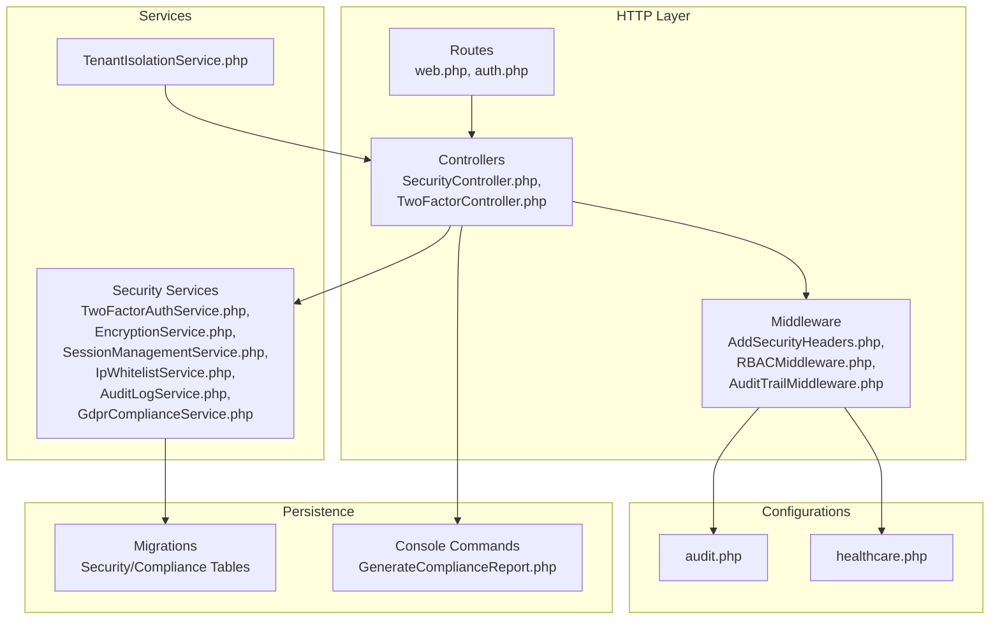

**Diagram sources**
- [web.php:2584-2647](file://routes/web.php#L2584-L2647)
- [auth.php:31-61](file://routes/auth.php#L31-L61)
- [SecurityController.php:15-38](file://app/Http/Controllers/Security/SecurityController.php#L15-L38)
- [AddSecurityHeaders.php:14-79](file://app/Http/Middleware/AddSecurityHeaders.php#L14-L79)
- [RBACMiddleware.php:9-177](file://app/Http/Middleware/RBACMiddleware.php#L9-L177)
- [AuditTrailMiddleware.php:10-130](file://app/Http/Middleware/AuditTrailMiddleware.php#L10-L130)
- [TwoFactorAuthService.php:10-238](file://app/Services/Security/TwoFactorAuthService.php#L10-L238)
- [EncryptionService.php:8-170](file://app/Services/Security/EncryptionService.php#L8-L170)
- [SessionManagementService.php:8-246](file://app/Services/Security/SessionManagementService.php#L8-L246)
- [IpWhitelistService.php:8-161](file://app/Services/Security/IpWhitelistService.php#L8-L161)
- [AuditLogService.php:8-214](file://app/Services/Security/AuditLogService.php#L8-L214)
- [GdprComplianceService.php:8-47](file://app/Services/Security/GdprComplianceService.php#L8-L47)
- [TenantIsolationService.php:16-43](file://app/Services/TenantIsolationService.php#L16-L43)
- [audit.php:1-44](file://config/audit.php#L1-L44)
- [healthcare.php:1-251](file://config/healthcare.php#L1-L251)
- [2026_04_06_110000_create_security_compliance_tables.php:207-241](file://database/migrations/2026_04_06_110000_create_security_compliance_tables.php#L207-L241)
- [2026_04_08_1400001_create_regulatory_compliance_tables.php:144-201](file://database/migrations/2026_04_08_1400001_create_regulatory_compliance_tables.php#L144-L201)
- [GenerateComplianceReport.php:78-105](file://app/Console/Commands/GenerateComplianceReport.php#L78-L105)

**Section sources**
- [web.php:2584-2647](file://routes/web.php#L2584-L2647)
- [auth.php:31-61](file://routes/auth.php#L31-L61)
- [bootstrap/app.php:32-41](file://bootstrap/app.php#L32-L41)

## Core Components
- Multi-tenant isolation: Enforced via TenantIsolationService and tenant_id scoping across models and controllers.
- RBAC: Implemented via RBACMiddleware with role-to-permissions mapping and wildcard support.
- Audit trail: Real-time logging via AuditTrailMiddleware and centralized AuditLogService with configurable retention.
- Data encryption: EncryptionService manages encryption keys and hashing for searchable fields.
- Session management: SessionManagementService tracks devices, locations, and session lifecycle.
- IP whitelisting: IpWhitelistService validates and manages allowed IPs with CIDR support.
- 2FA: TwoFactorAuthService and TwoFactorService provide secret generation, verification, and recovery codes.
- GDPR: GdprComplianceService handles consent recording and withdrawal, and integrates with data requests.
- Compliance reporting: GenerateComplianceReport console command and ComplianceReportController manage regulatory reports.

**Section sources**
- [TenantIsolationService.php:16-43](file://app/Services/TenantIsolationService.php#L16-L43)
- [RBACMiddleware.php:9-177](file://app/Http/Middleware/RBACMiddleware.php#L9-L177)
- [AuditTrailMiddleware.php:10-130](file://app/Http/Middleware/AuditTrailMiddleware.php#L10-L130)
- [AuditLogService.php:8-214](file://app/Services/Security/AuditLogService.php#L8-L214)
- [EncryptionService.php:8-170](file://app/Services/Security/EncryptionService.php#L8-L170)
- [SessionManagementService.php:8-246](file://app/Services/Security/SessionManagementService.php#L8-L246)
- [IpWhitelistService.php:8-161](file://app/Services/Security/IpWhitelistService.php#L8-L161)
- [TwoFactorAuthService.php:10-238](file://app/Services/Security/TwoFactorAuthService.php#L10-L238)
- [TwoFactorService.php:12-99](file://app/Services/TwoFactorService.php#L12-L99)
- [GdprComplianceService.php:8-47](file://app/Services/Security/GdprComplianceService.php#L8-L47)
- [GenerateComplianceReport.php:78-105](file://app/Console/Commands/GenerateComplianceReport.php#L78-L105)
- [ComplianceReportController.php:9-43](file://app/Http/Controllers/Healthcare/ComplianceReportController.php#L9-L43)

## Architecture Overview
The security architecture combines middleware-driven runtime protections, service-layer business logic, and persistent audit/compliance artifacts. Controllers expose secure endpoints grouped under /security and /compliance routes. Configurations in healthcare.php and audit.php govern behavior such as business hours, retention, and RBAC strictness.

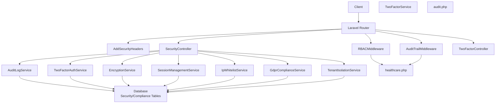

**Diagram sources**
- [bootstrap/app.php:32-41](file://bootstrap/app.php#L32-L41)
- [RBACMiddleware.php:9-177](file://app/Http/Middleware/RBACMiddleware.php#L9-L177)
- [AuditTrailMiddleware.php:10-130](file://app/Http/Middleware/AuditTrailMiddleware.php#L10-L130)
- [SecurityController.php:15-38](file://app/Http/Controllers/Security/SecurityController.php#L15-L38)
- [TwoFactorController.php:14-147](file://app/Http/Controllers/Auth/TwoFactorController.php#L14-L147)
- [TwoFactorAuthService.php:10-238](file://app/Services/Security/TwoFactorAuthService.php#L10-L238)
- [TwoFactorService.php:12-99](file://app/Services/TwoFactorService.php#L12-L99)
- [EncryptionService.php:8-170](file://app/Services/Security/EncryptionService.php#L8-L170)
- [SessionManagementService.php:8-246](file://app/Services/Security/SessionManagementService.php#L8-L246)
- [IpWhitelistService.php:8-161](file://app/Services/Security/IpWhitelistService.php#L8-L161)
- [AuditLogService.php:8-214](file://app/Services/Security/AuditLogService.php#L8-L214)
- [GdprComplianceService.php:8-47](file://app/Services/Security/GdprComplianceService.php#L8-L47)
- [TenantIsolationService.php:16-43](file://app/Services/TenantIsolationService.php#L16-L43)
- [audit.php:1-44](file://config/audit.php#L1-L44)
- [healthcare.php:1-251](file://config/healthcare.php#L1-L251)

## Detailed Component Analysis

### Multi-Tenant Security Isolation
- Purpose: Ensure tenant boundary enforcement across all data access and mutations.
- Implementation:
  - TenantIsolationService provides safe find and ownership assertion helpers.
  - Controllers and policies should use tenant_id scoping and isolation checks.
  - Middleware can enforce tenant-aware routing and logging.

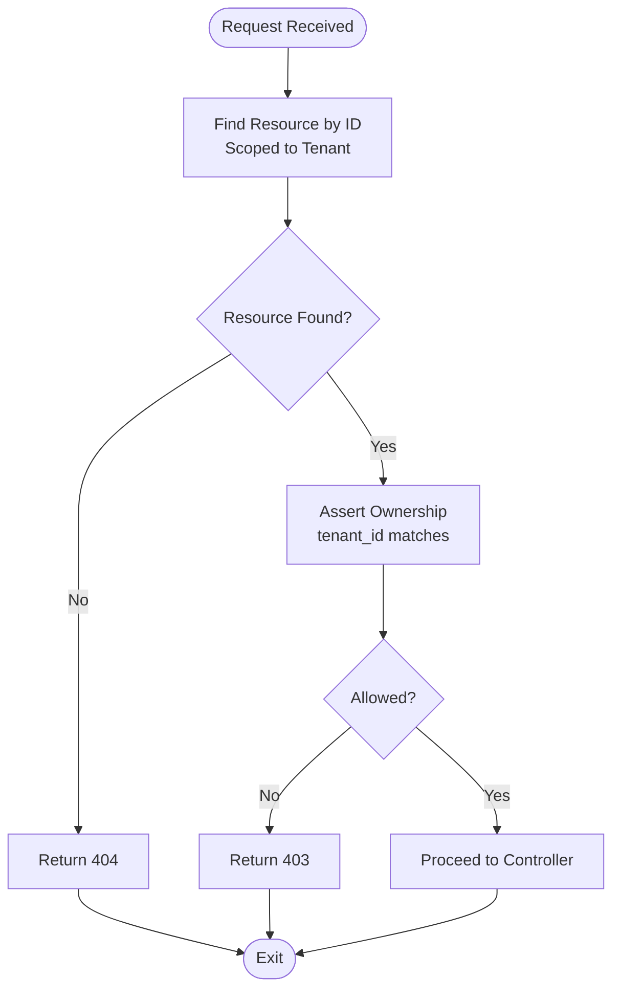

**Diagram sources**
- [TenantIsolationService.php:25-43](file://app/Services/TenantIsolationService.php#L25-L43)

**Section sources**
- [TenantIsolationService.php:16-43](file://app/Services/TenantIsolationService.php#L16-L43)

### Role-Based Access Control (RBAC)
- Purpose: Enforce role-based permissions with wildcard support and superadmin bypass.
- Implementation:
  - RBACMiddleware defines role-to-permissions mapping and checks.
  - Supports wildcard patterns (e.g., healthcare.patients.*) and exact matches.
  - Unauthorized attempts are logged and blocked with 403.

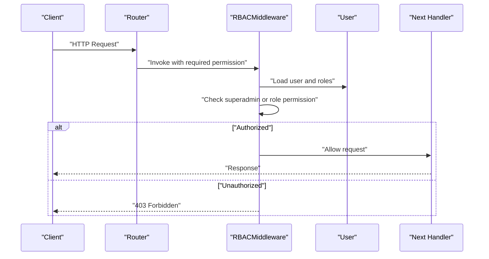

**Diagram sources**
- [RBACMiddleware.php:86-115](file://app/Http/Middleware/RBACMiddleware.php#L86-L115)

**Section sources**
- [RBACMiddleware.php:9-177](file://app/Http/Middleware/RBACMiddleware.php#L9-L177)

### Audit Trail Implementation
- Purpose: Comprehensive logging of access and changes for compliance and monitoring.
- Implementation:
  - AuditTrailMiddleware logs access events, after-hours access, and cross-department access.
  - AuditLogService centralizes event logging, CRUD operations, permission changes, and exports.
  - Configurable retention and rollback support via audit.php.

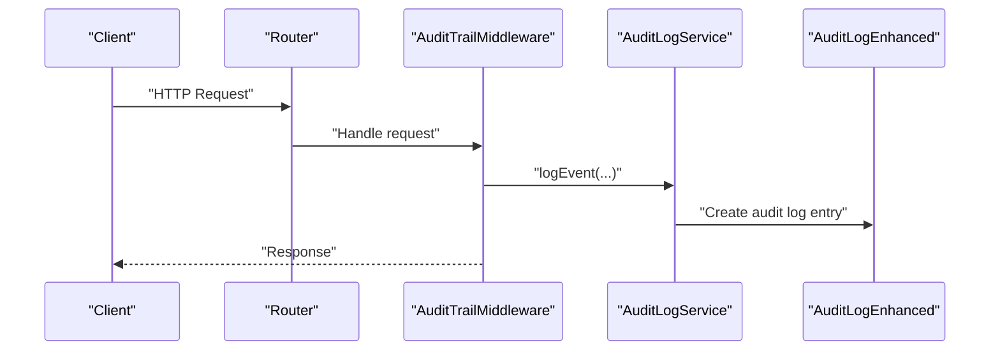

**Diagram sources**
- [AuditTrailMiddleware.php:17-107](file://app/Http/Middleware/AuditTrailMiddleware.php#L17-L107)
- [AuditLogService.php:13-81](file://app/Services/Security/AuditLogService.php#L13-L81)

**Section sources**
- [AuditTrailMiddleware.php:10-130](file://app/Http/Middleware/AuditTrailMiddleware.php#L10-L130)
- [AuditLogService.php:8-214](file://app/Services/Security/AuditLogService.php#L8-L214)
- [audit.php:1-44](file://config/audit.php#L1-L44)

### Data Encryption
- Purpose: Protect sensitive data at rest and in transit; support key rotation.
- Implementation:
  - EncryptionService manages encryption keys and supports rotation.
  - Hashing for searchable fields using HMAC-SHA256 with app key.
  - Array encryption/decryption helpers for batch operations.

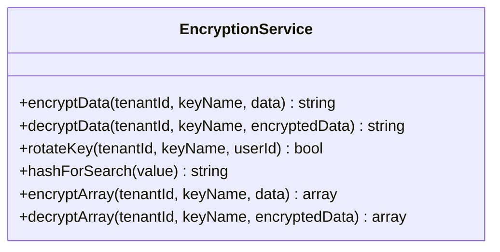

**Diagram sources**
- [EncryptionService.php:8-170](file://app/Services/Security/EncryptionService.php#L8-L170)

**Section sources**
- [EncryptionService.php:8-170](file://app/Services/Security/EncryptionService.php#L8-L170)

### Session Management
- Purpose: Track and control user sessions, detect suspicious activity, and support termination.
- Implementation:
  - SessionManagementService tracks device info, platform, browser, IP, and location.
  - Provides activity updates, termination, and cleanup of expired sessions.

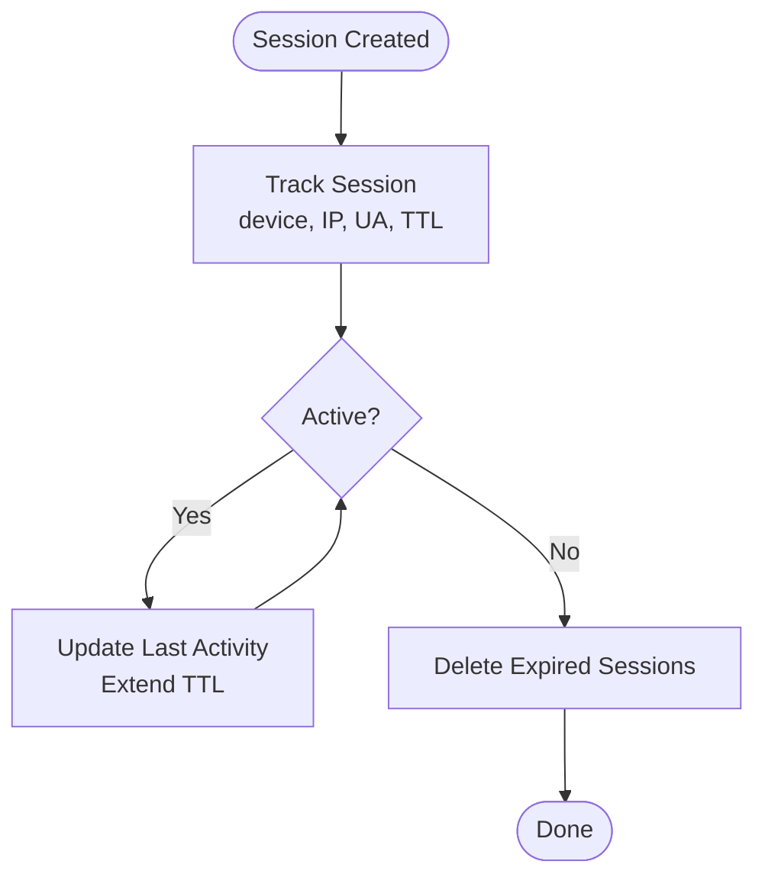

**Diagram sources**
- [SessionManagementService.php:13-177](file://app/Services/Security/SessionManagementService.php#L13-L177)

**Section sources**
- [SessionManagementService.php:8-246](file://app/Services/Security/SessionManagementService.php#L8-L246)

### IP Whitelisting
- Purpose: Restrict administrative access to trusted IPs with CIDR support and expiration.
- Implementation:
  - IpWhitelistService validates IPs, supports scopes (admin/all), and expires entries.
  - Provides APIs to add/remove/deactivate entries and clean expired ones.

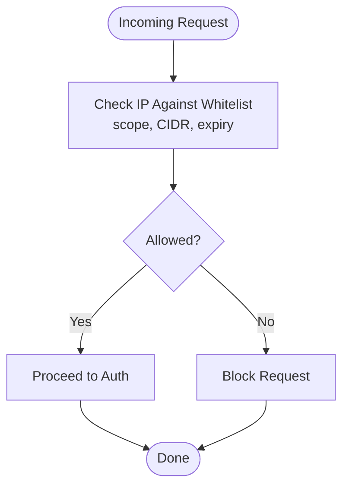

**Diagram sources**
- [IpWhitelistService.php:13-31](file://app/Services/Security/IpWhitelistService.php#L13-L31)

**Section sources**
- [IpWhitelistService.php:8-161](file://app/Services/Security/IpWhitelistService.php#L8-L161)

### Two-Factor Authentication (2FA)
- Purpose: Strengthen authentication with time-based OTP and recovery codes.
- Implementation:
  - TwoFactorAuthService generates secrets, verifies codes, and manages activation.
  - TwoFactorService integrates with user model fields and QR code generation.
  - Routes and views support setup, verification, and recovery code regeneration.

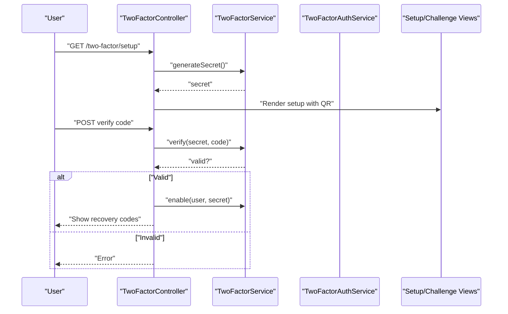

**Diagram sources**
- [TwoFactorController.php:23-58](file://app/Http/Controllers/Auth/TwoFactorController.php#L23-L58)
- [TwoFactorController.php:96-129](file://app/Http/Controllers/Auth/TwoFactorController.php#L96-L129)
- [TwoFactorService.php:24-60](file://app/Services/TwoFactorService.php#L24-L60)
- [TwoFactorAuthService.php:22-99](file://app/Services/Security/TwoFactorAuthService.php#L22-L99)
- [auth.php:43-46](file://routes/auth.php#L43-L46)
- [challenge.blade.php:13-27](file://resources/views/auth/two-factor/challenge.blade.php#L13-L27)
- [setup.blade.php:31-33](file://resources/views/auth/two-factor/setup.blade.php#L31-L33)

**Section sources**
- [TwoFactorAuthService.php:10-238](file://app/Services/Security/TwoFactorAuthService.php#L10-L238)
- [TwoFactorService.php:12-99](file://app/Services/TwoFactorService.php#L12-L99)
- [TwoFactorController.php:14-147](file://app/Http/Controllers/Auth/TwoFactorController.php#L14-L147)
- [auth.php:31-61](file://routes/auth.php#L31-L61)
- [challenge.blade.php:1-27](file://resources/views/auth/two-factor/challenge.blade.php#L1-L27)
- [setup.blade.php:28-62](file://resources/views/auth/two-factor/setup.blade.php#L28-L62)

### GDPR Compliance Features
- Purpose: Manage consent, data requests, and privacy controls aligned with GDPR.
- Implementation:
  - GdprComplianceService records and withdraws consent, and coordinates with data requests.
  - SecurityController exposes endpoints to manage data requests and consent.

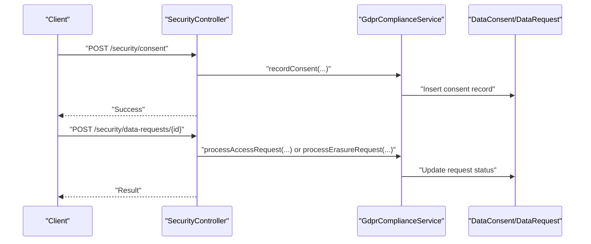

**Diagram sources**
- [SecurityController.php:312-341](file://app/Http/Controllers/Security/SecurityController.php#L312-L341)
- [GdprComplianceService.php:13-47](file://app/Services/Security/GdprComplianceService.php#L13-L47)

**Section sources**
- [SecurityController.php:15-38](file://app/Http/Controllers/Security/SecurityController.php#L15-L38)
- [SecurityController.php:312-341](file://app/Http/Controllers/Security/SecurityController.php#L312-L341)
- [GdprComplianceService.php:8-47](file://app/Services/Security/GdprComplianceService.php#L8-L47)

### Regulatory Compliance Reporting
- Purpose: Generate compliance reports across frameworks (e.g., HIPAA) and track findings.
- Implementation:
  - GenerateComplianceReport console command aggregates metrics and outputs in multiple formats.
  - ComplianceReportController lists and manages compliance reports.
  - RegulatoryComplianceService runs checks and produces structured reports.

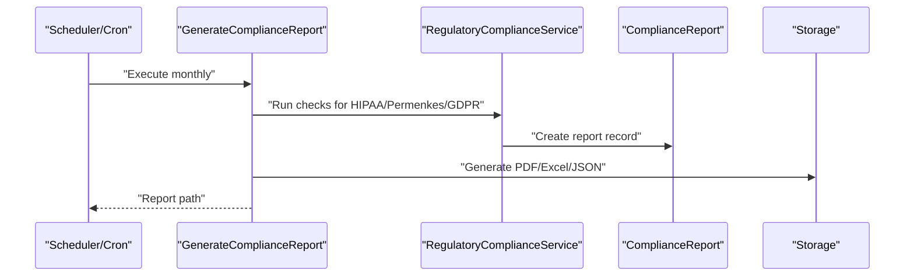

**Diagram sources**
- [GenerateComplianceReport.php:78-105](file://app/Console/Commands/GenerateComplianceReport.php#L78-L105)
- [GenerateComplianceReport.php:184-228](file://app/Console/Commands/GenerateComplianceReport.php#L184-L228)
- [ComplianceReportController.php:9-43](file://app/Http/Controllers/Healthcare/ComplianceReportController.php#L9-L43)
- [2026_04_08_1400001_create_regulatory_compliance_tables.php:144-201](file://database/migrations/2026_04_08_1400001_create_regulatory_compliance_tables.php#L144-L201)

**Section sources**
- [GenerateComplianceReport.php:78-105](file://app/Console/Commands/GenerateComplianceReport.php#L78-L105)
- [GenerateComplianceReport.php:184-228](file://app/Console/Commands/GenerateComplianceReport.php#L184-L228)
- [ComplianceReportController.php:9-43](file://app/Http/Controllers/Healthcare/ComplianceReportController.php#L9-L43)
- [2026_04_08_1400001_create_regulatory_compliance_tables.php:144-201](file://database/migrations/2026_04_08_1400001_create_regulatory_compliance_tables.php#L144-L201)

## Dependency Analysis
- Controllers depend on services for business logic.
- Middleware depends on configuration files for behavior.
- Services persist to database tables defined in migrations.
- Routes group endpoints by domain (security, compliance).

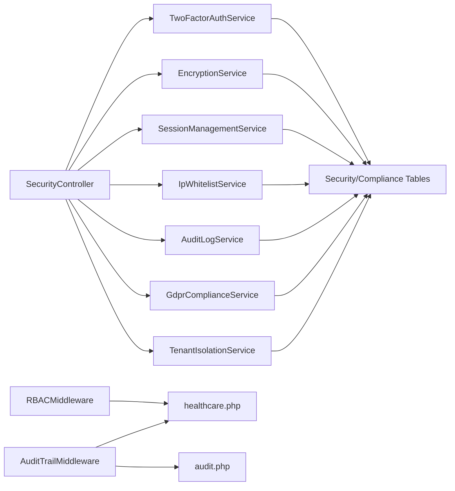

**Diagram sources**
- [SecurityController.php:15-38](file://app/Http/Controllers/Security/SecurityController.php#L15-L38)
- [RBACMiddleware.php:9-177](file://app/Http/Middleware/RBACMiddleware.php#L9-L177)
- [AuditTrailMiddleware.php:10-130](file://app/Http/Middleware/AuditTrailMiddleware.php#L10-L130)
- [audit.php:1-44](file://config/audit.php#L1-L44)
- [healthcare.php:1-251](file://config/healthcare.php#L1-L251)
- [2026_04_06_110000_create_security_compliance_tables.php:207-241](file://database/migrations/2026_04_06_110000_create_security_compliance_tables.php#L207-L241)

**Section sources**
- [web.php:2584-2647](file://routes/web.php#L2584-L2647)
- [bootstrap/app.php:32-41](file://bootstrap/app.php#L32-L41)

## Performance Considerations
- Middleware overhead: AuditTrailMiddleware and RBACMiddleware add minimal overhead but should avoid heavy operations in hot paths.
- Database writes: AuditLogService and TenantIsolationService write to disk; ensure proper indexing on tenant_id and timestamps.
- Encryption: EncryptionService uses Laravel’s Crypt; consider batching and caching decrypted values where appropriate.
- Session cleanup: Regularly run cleanup jobs for expired sessions and whitelisted IPs to maintain performance.

## Troubleshooting Guide
- 2FA issues:
  - Verify time synchronization on devices.
  - Confirm secret decryption and code verification in TwoFactorAuthService.
  - Review TwoFactorController error messages and session state.
- Audit logging failures:
  - Check database availability and fallback to file logging.
  - Validate retention settings in audit.php and ensure purge jobs run.
- IP whitelist problems:
  - Validate CIDR notation and IP ranges.
  - Confirm scope and expiry logic in IpWhitelistService.
- Session anomalies:
  - Investigate device/platform mismatches and geolocation fields.
  - Use SessionManagementService to terminate suspicious sessions.

**Section sources**
- [TwoFactorAuthService.php:69-99](file://app/Services/Security/TwoFactorAuthService.php#L69-L99)
- [TwoFactorController.php:96-129](file://app/Http/Controllers/Auth/TwoFactorController.php#L96-L129)
- [AuditTrailMiddleware.php:38-60](file://app/Http/Middleware/AuditTrailMiddleware.php#L38-L60)
- [audit.php:14-41](file://config/audit.php#L14-L41)
- [IpWhitelistService.php:146-159](file://app/Services/Security/IpWhitelistService.php#L146-L159)
- [SessionManagementService.php:158-167](file://app/Services/Security/SessionManagementService.php#L158-L167)

## Conclusion
Qalcuity ERP implements a robust, layered security and compliance framework. Multi-tenant isolation, RBAC, comprehensive audit trails, encryption, session management, IP whitelisting, and 2FA provide strong runtime protections. GDPR features and regulatory reporting capabilities support compliance across industries, particularly healthcare. Adhering to the best practices and procedures outlined here ensures continued security and regulatory adherence.

## Appendices

### Security Middleware Overview
- AddSecurityHeaders: Sets CSP, X-Frame-Options, X-Content-Type-Options, X-XSS-Protection, Referrer-Policy, and Permissions-Policy.
- RBACMiddleware: Enforces role-based permissions with wildcards and superadmin bypass.
- AuditTrailMiddleware: Logs access, after-hours usage, and cross-department access with configurable channels.

**Section sources**
- [AddSecurityHeaders.php:14-79](file://app/Http/Middleware/AddSecurityHeaders.php#L14-L79)
- [RBACMiddleware.php:9-177](file://app/Http/Middleware/RBACMiddleware.php#L9-L177)
- [AuditTrailMiddleware.php:10-130](file://app/Http/Middleware/AuditTrailMiddleware.php#L10-L130)

### Database Schema Highlights
- Security/Compliance tables include security_events, ip_whitelist, user_sessions, audit_logs_enhanced, data_requests, data_consents, encryption_keys, role_permission, permissions, two_factor_auth.
- Regulatory compliance tables include anonymization_requests, compliance_reports, access_violations.

**Section sources**
- [2026_04_06_110000_create_security_compliance_tables.php:207-241](file://database/migrations/2026_04_06_110000_create_security_compliance_tables.php#L207-L241)
- [2026_04_08_1400001_create_regulatory_compliance_tables.php:144-201](file://database/migrations/2026_04_08_1400001_create_regulatory_compliance_tables.php#L144-L201)

### Regulatory Compliance References
- HIPAA and healthcare compliance guidance is documented in project documentation and enforced via middleware and services.

**Section sources**
- [HEALTHCARE_REGULATORY_COMPLIANCE.md:140-182](file://docs/HEALTHCARE_REGULATORY_COMPLIANCE.md#L140-L182)