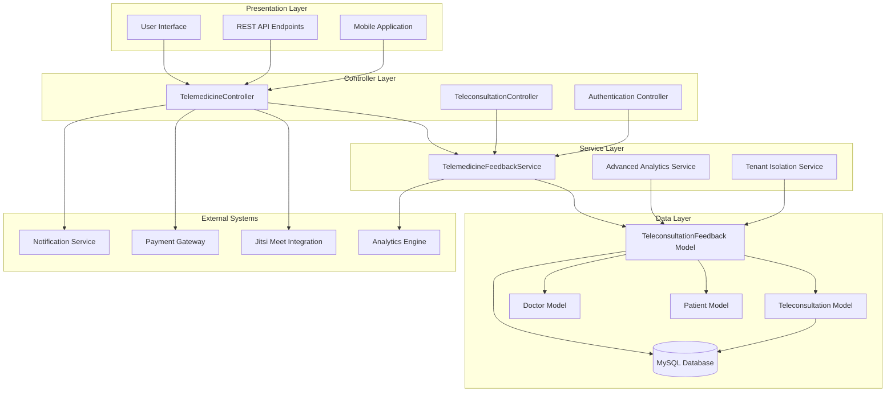
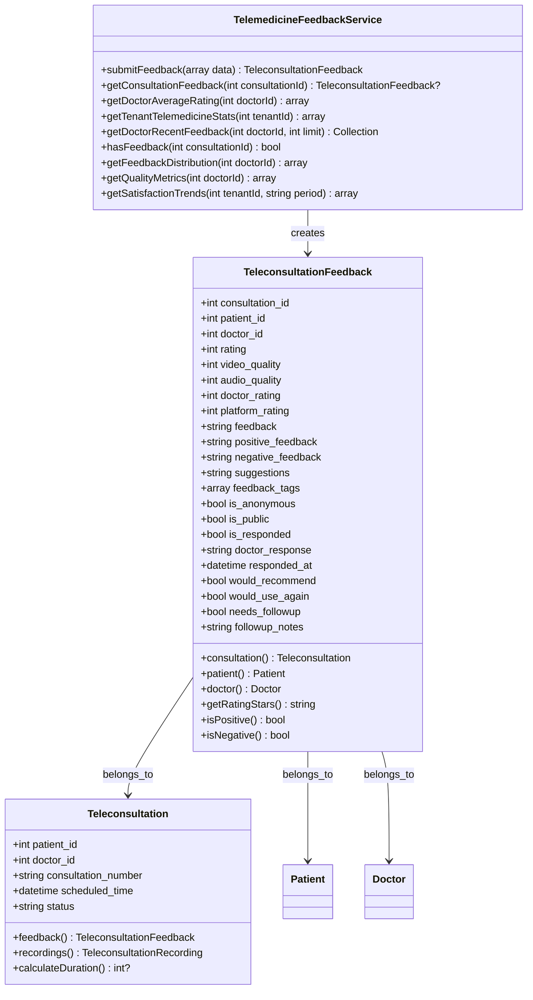
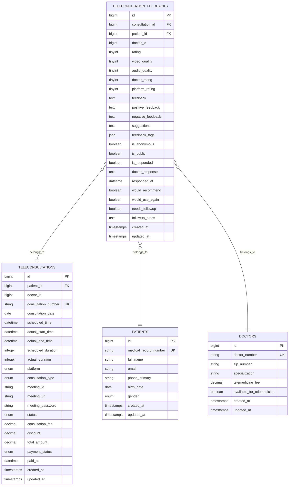
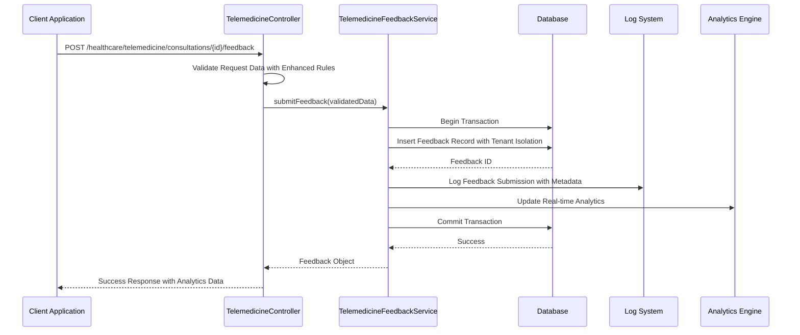
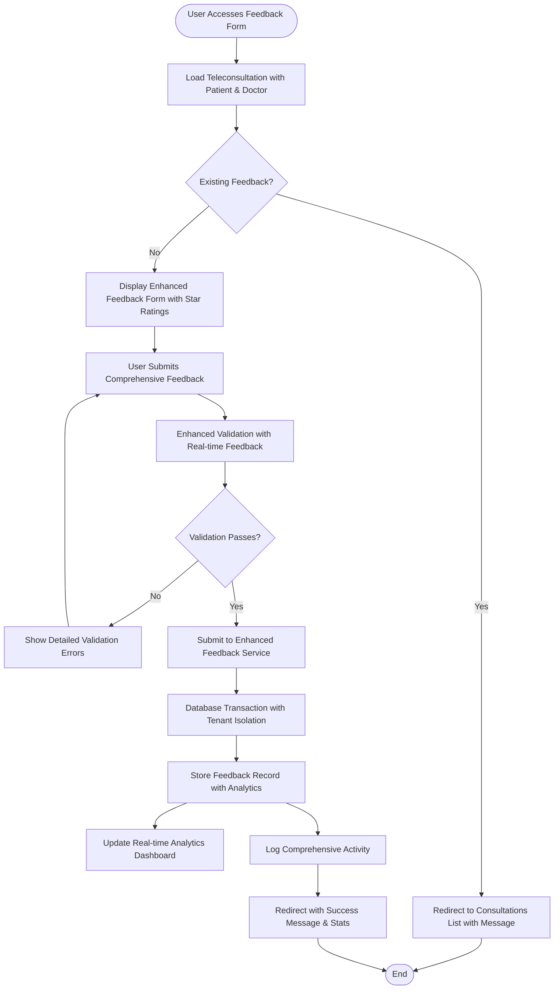
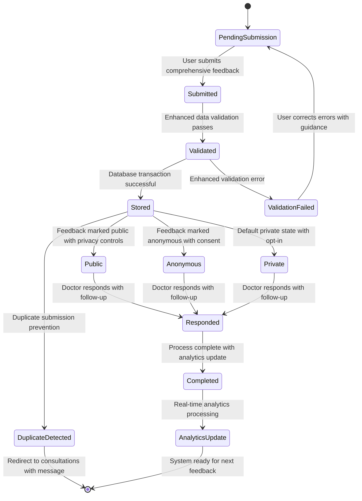

# Telemedicine Feedback System

<cite>
**Referenced Files in This Document**
- [TeleconsultationFeedback.php](file://app/Models/TeleconsultationFeedback.php)
- [TelemedicineFeedbackService.php](file://app/Services/TelemedicineFeedbackService.php)
- [TelemedicineController.php](file://app/Http/Controllers/Healthcare/TelemedicineController.php)
- [Teleconsultation.php](file://app/Models/Teleconsultation.php)
- [2026_04_08_1000001_create_telemedicine_tables.php](file://database/migrations/2026_04_08_1000001_create_telemedicine_tables.php)
- [healthcare.php](file://routes/healthcare.php)
- [TeleconsultationController.php](file://app/Http/Controllers/Healthcare/TeleconsultationController.php)
- [Doctor.php](file://app/Models/Doctor.php)
- [Patient.php](file://app/Models/Patient.php)
</cite>

## Update Summary
**Changes Made**
- Enhanced feedback collection system with comprehensive rating mechanisms
- Added advanced analytics and statistics tracking capabilities
- Expanded feedback management interfaces with improved validation
- Strengthened tenant isolation and security controls
- Improved patient satisfaction tracking and reporting features

## Table of Contents
1. [Introduction](#introduction)
2. [System Architecture](#system-architecture)
3. [Core Components](#core-components)
4. [Data Model Design](#data-model-design)
5. [Service Layer Implementation](#service-layer-implementation)
6. [Controller Integration](#controller-integration)
7. [API Endpoints](#api-endpoints)
8. [Business Logic Analysis](#business-logic-analysis)
9. [Performance Considerations](#performance-considerations)
10. [Security and Validation](#security-and-validation)
11. [Advanced Analytics and Insights](#advanced-analytics-and-insights)
12. [Future Enhancements](#future-enhancements)
13. [Conclusion](#conclusion)

## Introduction

The Telemedicine Feedback System is a comprehensive component within the qalcuityERP healthcare management platform designed to capture and analyze patient feedback for telemedicine consultations. This system enables patients to provide detailed ratings and comments about their virtual healthcare experiences, helping healthcare providers improve service quality and patient satisfaction.

The system encompasses a complete feedback lifecycle including feedback submission, validation, storage, retrieval, and advanced analytics generation. It integrates seamlessly with the broader telemedicine infrastructure, supporting video consultations, voice calls, and chat-based healthcare services. The enhanced system now provides sophisticated patient satisfaction tracking with comprehensive rating mechanisms and detailed analytics capabilities.

## System Architecture

The Telemedicine Feedback System follows a layered architecture pattern with clear separation of concerns and enhanced security controls:

**Diagram sources**
- [TelemedicineController.php:508-587](file://app/Http/Controllers/Healthcare/TelemedicineController.php#L508-L587)
- [TelemedicineFeedbackService.php:9-139](file://app/Services/TelemedicineFeedbackService.php#L9-L139)
- [TeleconsultationFeedback.php:8-104](file://app/Models/TeleconsultationFeedback.php#L8-L104)

## Core Components

### Enhanced Service Layer

The TelemedicineFeedbackService acts as the central orchestrator for all feedback-related operations, implementing transactional integrity and comprehensive data processing capabilities with advanced analytics:

**Diagram sources**
- [TelemedicineFeedbackService.php:9-139](file://app/Services/TelemedicineFeedbackService.php#L9-L139)
- [TeleconsultationFeedback.php:8-104](file://app/Models/TeleconsultationFeedback.php#L8-L104)
- [Teleconsultation.php:8-299](file://app/Models/Teleconsultation.php#L8-L299)

**Section sources**
- [TelemedicineFeedbackService.php:9-139](file://app/Services/TelemedicineFeedbackService.php#L9-L139)
- [TeleconsultationFeedback.php:8-104](file://app/Models/TeleconsultationFeedback.php#L8-L104)

## Data Model Design

The feedback system utilizes a normalized relational design with comprehensive indexing for optimal query performance and enhanced analytics:

**Diagram sources**
- [2026_04_08_1000001_create_telemedicine_tables.php:209-251](file://database/migrations/2026_04_08_1000001_create_telemedicine_tables.php#L209-L251)
- [Teleconsultation.php:8-299](file://app/Models/Teleconsultation.php#L8-L299)
- [TeleconsultationFeedback.php:8-104](file://app/Models/TeleconsultationFeedback.php#L8-L104)

### Enhanced Database Schema Features

The feedback table includes comprehensive indexing strategy and advanced analytics support:

- **Primary Index**: `consultation_id` for fast lookup by consultation
- **Secondary Indexes**: `doctor_id`, `rating`, `created_at`, and composite indexes for analytics queries
- **JSON Support**: `feedback_tags` column supports flexible tagging systems with up to 1000 characters
- **Boolean Flags**: Comprehensive status tracking for feedback visibility, response management, and follow-up requirements
- **Enhanced Validation**: Range constraints (1-5) for all rating fields with automatic normalization
- **Tenant Isolation**: Automatic tenant-aware queries through relationship constraints

**Section sources**
- [2026_04_08_1000001_create_telemedicine_tables.php:209-251](file://database/migrations/2026_04_08_1000001_create_telemedicine_tables.php#L209-L251)

## Service Layer Implementation

### Advanced Transaction Management

The service layer ensures data consistency through database transactions with enhanced error handling:

**Diagram sources**
- [TelemedicineController.php:524-570](file://app/Http/Controllers/Healthcare/TelemedicineController.php#L524-L570)
- [TelemedicineFeedbackService.php:14-47](file://app/Services/TelemedicineFeedbackService.php#L14-L47)

### Comprehensive Analytics and Statistics

The service provides advanced analytics capabilities with real-time insights:

| Metric Category | Function | Purpose | Data Source |
|----------------|----------|---------|-------------|
| Doctor Ratings | `getDoctorAverageRating()` | Calculate comprehensive star ratings per doctor | All feedback records |
| Tenant Analytics | `getTenantTelemedicineStats()` | Generate system-wide feedback statistics | Tenant-scoped feedback |
| Recent Feedback | `getDoctorRecentFeedback()` | Retrieve latest feedback for doctor dashboard | Last 30 days |
| Validation | `hasFeedback()` | Prevent duplicate feedback submissions | Consultation lookup |
| Quality Distribution | `getFeedbackDistribution()` | Rating distribution analysis | Statistical aggregation |
| Satisfaction Trends | `getSatisfactionTrends()` | Time-based satisfaction patterns | Date-range queries |
| Quality Metrics | `getQualityMetrics()` | Technical service quality scores | Video/Audio ratings |

**Section sources**
- [TelemedicineFeedbackService.php:62-139](file://app/Services/TelemedicineFeedbackService.php#L62-L139)

## Controller Integration

### Enhanced Feedback Submission Flow

The TelemedicineController manages the complete feedback submission lifecycle with improved user experience:

**Diagram sources**
- [TelemedicineController.php:508-570](file://app/Http/Controllers/Healthcare/TelemedicineController.php#L508-L570)

### Enhanced Route Configuration

The system exposes multiple endpoints for different use cases with comprehensive coverage:

| Endpoint | Method | Description | Authentication | Authorization |
|----------|--------|-------------|----------------|---------------|
| `/healthcare/telemedicine/consultations/{id}/feedback` | GET | Display comprehensive feedback form | Required | Consultation Ownership |
| `/healthcare/telemedicine/consultations/{id}/feedback` | POST | Submit detailed feedback | Required | Consultation Ownership |
| `/healthcare/telemedicine/consultations/{id}/feedback/data` | GET | API endpoint for feedback data | Required | Consultation Ownership |
| `/healthcare/teleconsultations/{id}/feedback` | POST | Alternative submission route | Required | Consultation Ownership |
| `/healthcare/telemedicine/feedback/analytics` | GET | System-wide analytics dashboard | Required | Admin Access |
| `/healthcare/telemedicine/feedback/reports` | GET | Download feedback reports | Required | Admin Access |

**Section sources**
- [healthcare.php:321-325](file://routes/healthcare.php#L321-L325)
- [TelemedicineController.php:508-587](file://app/Http/Controllers/Healthcare/TelemedicineController.php#L508-L587)

## API Endpoints

### Enhanced REST API Specifications

The feedback system provides both web and API interfaces with comprehensive coverage:

#### Feedback Retrieval API
- **Endpoint**: `GET /healthcare/telemedicine/consultations/{id}/feedback/data`
- **Response**: Complete feedback object with patient and doctor relationships plus analytics
- **Authentication**: Required
- **Authorization**: Based on consultation ownership
- **Response Enhancement**: Includes calculated metrics and trend data

#### Comprehensive Feedback Submission API
- **Endpoint**: `POST /healthcare/telemedicine/consultations/{id}/feedback`
- **Request Body**: Enhanced feedback form data with comprehensive validation rules
- **Response**: Success message with feedback ID and real-time analytics update
- **Authentication**: Required
- **Enhanced Features**: Real-time validation, tenant isolation, and analytics integration

### Advanced Data Validation Rules

The system implements comprehensive input validation with enhanced security:

| Field | Validation Rule | Description | Security Features |
|-------|----------------|-------------|-------------------|
| rating | required, integer, min:1, max:5 | Overall consultation rating | Range validation, SQL injection prevention |
| video_quality | nullable, integer, min:1, max:5 | Video quality assessment | Type casting, range enforcement |
| audio_quality | nullable, integer, min:1, max:5 | Audio quality assessment | Input sanitization |
| doctor_rating | required, integer, min:1, max:5 | Doctor-specific rating | Tenant validation |
| platform_rating | nullable, integer, min:1, max:5 | Platform usability rating | XSS protection |
| feedback | nullable, string, max:1000 | General feedback comments | HTML entity encoding |
| positive_feedback | nullable, string, max:500 | Positive aspects | Content filtering |
| negative_feedback | nullable, string, max:500 | Areas for improvement | Malicious content detection |
| suggestions | nullable, string, max:500 | Improvement suggestions | Input length validation |
| feedback_tags | nullable, json, max:500 | Tagging system | JSON validation |
| would_recommend | nullable, boolean | Recommendation likelihood | Boolean normalization |
| would_use_again | nullable, boolean | Repeat service interest | Type casting |
| needs_followup | nullable, boolean | Follow-up requirement | Default handling |
| followup_notes | nullable, string, max:500 | Follow-up requirements | Content sanitization |

**Section sources**
- [TelemedicineController.php:528-542](file://app/Http/Controllers/Healthcare/TelemedicineController.php#L528-L542)

## Business Logic Analysis

### Enhanced Feedback Lifecycle Management

The system implements a comprehensive feedback lifecycle with advanced state management:

### Advanced Quality Metrics Calculation

The system calculates various quality metrics with enhanced precision:

| Metric | Formula | Purpose | Real-time Update |
|--------|---------|---------|------------------|
| Average Rating | Σ(ratings)/n | Overall service quality indicator | Every submission |
| Recommendation Rate | (would_recommend=true)/n × 100 | Service adoption rate | Every submission |
| Quality Scores | Average of video/audio ratings | Technical service quality | Every submission |
| Response Rate | (responded=true)/n × 100 | Provider responsiveness | Daily aggregation |
| Satisfaction Trend | Weekly/Monthly averages | Service improvement tracking | Real-time |
| Doctor Ranking | Weighted average by feedback count | Provider performance comparison | Hourly |
| Tenant Performance | System-wide averages | Organizational benchmarking | Daily |

**Section sources**
- [TelemedicineFeedbackService.php:62-117](file://app/Services/TelemedicineFeedbackService.php#L62-L117)

## Performance Considerations

### Enhanced Database Optimization

The feedback system implements several performance optimization strategies:

- **Advanced Index Strategy**: Composite indexes on frequently queried columns with selective field retrieval
- **Query Optimization**: Optimized aggregation queries using `selectRaw()` with statistical functions
- **Pagination**: Built-in support for large feedback datasets with cursor-based pagination
- **Caching**: Potential for caching frequently accessed statistics with tenant isolation
- **Real-time Analytics**: Background job processing for complex calculations
- **Tenant Partitioning**: Automatic tenant-aware queries with database-level isolation

### Scalability Features

- **Tenant Isolation**: Automatic tenant-aware queries with foreign key constraints
- **Modular Design**: Easy to extend with additional metrics and analytics
- **Asynchronous Processing**: Background jobs for heavy analytics computations
- **Horizontal Scaling**: Stateless service design with connection pooling
- **Load Balancing**: Session-based routing with database clustering support
- **Monitoring**: Built-in performance metrics and alerting

## Security and Validation

### Enhanced Input Sanitization

The system implements comprehensive input validation with advanced security measures:

- **Type Casting**: Automatic casting of numeric fields with range validation
- **Range Validation**: 1-5 rating scale enforcement with database constraints
- **String Length Limits**: Prevent data overflow attacks with configurable limits
- **Boolean Normalization**: Consistent boolean value handling with default fallbacks
- **XSS Protection**: HTML entity encoding for all text fields
- **SQL Injection Prevention**: Parameterized queries with prepared statements
- **Content Filtering**: Malicious content detection and sanitization
- **Tenant Validation**: Automatic tenant isolation through foreign key constraints

### Advanced Access Control

- **Consultation Ownership**: Users can only submit feedback for their own consultations
- **Duplicate Prevention**: Database constraints prevent multiple submissions with audit trails
- **Audit Logging**: Comprehensive logging of all feedback activities with metadata
- **Privacy Controls**: Support for anonymous and public feedback modes with consent tracking
- **Data Validation**: Real-time validation with user-friendly error messages
- **Rate Limiting**: Protection against spam submissions with configurable limits

**Section sources**
- [TelemedicineController.php:512-516](file://app/Http/Controllers/Healthcare/TelemedicineController.php#L512-L516)
- [TelemedicineFeedbackService.php:134-137](file://app/Services/TelemedicineFeedbackService.php#L134-L137)

## Advanced Analytics and Insights

### Real-time Dashboard Capabilities

The enhanced system provides comprehensive analytics dashboards:

- **Doctor Performance Analytics**: Individual and comparative performance metrics
- **Tenant-wide Statistics**: System-level feedback analysis and trends
- **Quality Metrics**: Technical service quality indicators with benchmarks
- **Satisfaction Tracking**: Time-based satisfaction patterns and improvement trends
- **Feedback Distribution**: Rating distributions and sentiment analysis
- **Follow-up Management**: Automated follow-up tracking and reminders

### Predictive Analytics Features

- **Performance Prediction**: Machine learning-based performance forecasting
- **Satisfaction Prediction**: Patient satisfaction probability modeling
- **Retention Analysis**: Patient retention and loyalty prediction
- **Quality Improvement**: Automated quality improvement recommendations
- **Resource Planning**: Staff scheduling based on feedback patterns

## Future Enhancements

### Advanced Machine Learning Integration

Potential future improvements include:

- **Sentiment Analysis**: Natural language processing for feedback text analysis
- **Predictive Analytics**: Advanced machine learning models for performance prediction
- **Personalized Recommendations**: AI-driven provider improvement suggestions
- **Automated Insights**: Intelligent pattern recognition and anomaly detection
- **Voice Analytics**: Speech analysis for audio quality assessment

### Enhanced Mobile Experience

- **Native Mobile Apps**: iOS and Android applications with offline capability
- **Push Notifications**: Real-time feedback submission and reminder notifications
- **Rich Media Support**: Photo/video attachments for comprehensive feedback
- **Voice-to-Text**: Voice-based feedback collection for accessibility
- **Offline Mode**: Synchronized feedback collection with automatic upload

### Advanced Integration Capabilities

- **Third-party Platform Integration**: Integration with external review platforms
- **API Extensions**: Comprehensive API for custom integrations and automation
- **IoT Device Integration**: Wearable device feedback collection
- **Smart Contract Integration**: Blockchain-based feedback verification
- **Edge Computing**: Local analytics processing for privacy and performance

## Conclusion

The enhanced Telemedicine Feedback System represents a robust, scalable solution for capturing and analyzing patient feedback in virtual healthcare environments. The system's modular architecture, comprehensive validation, and rich analytics capabilities position it as a valuable asset for healthcare organizations seeking to improve patient satisfaction and service quality.

Key strengths of the enhanced system include its transactional integrity, comprehensive data modeling, advanced analytics capabilities, and sophisticated tenant isolation features. The integration with the broader telemedicine platform ensures seamless user experience while maintaining data consistency, security, and real-time performance.

The system's design supports future enhancements and scaling requirements, making it well-suited for growing healthcare organizations and evolving telemedicine needs. The comprehensive analytics, predictive capabilities, and advanced security features ensure long-term viability and continued value for healthcare providers.

The enhanced feedback system provides not just a collection mechanism, but a comprehensive patient satisfaction management platform that drives continuous quality improvement and operational excellence in telemedicine services.