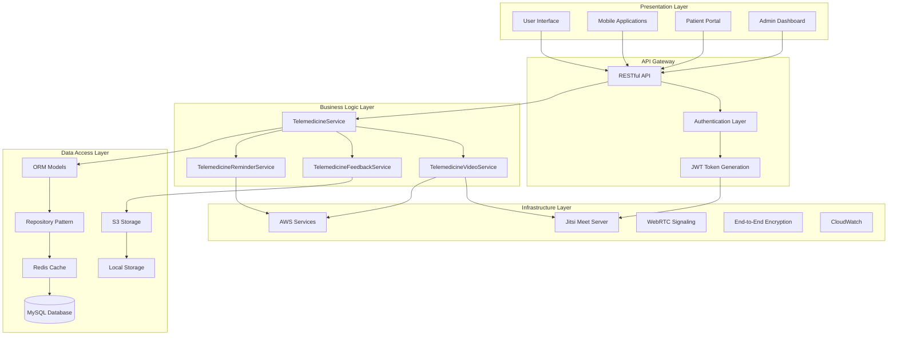
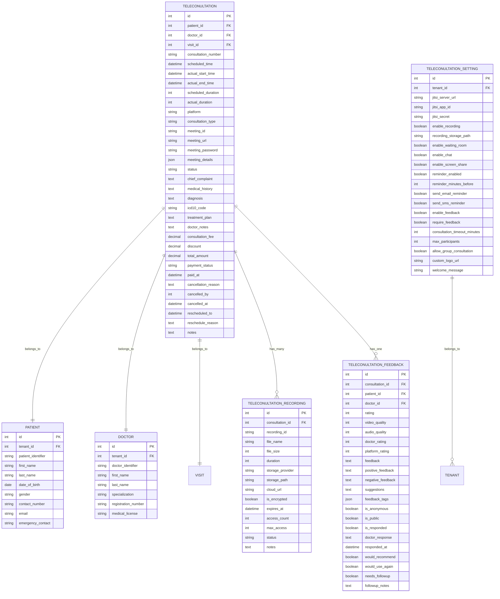
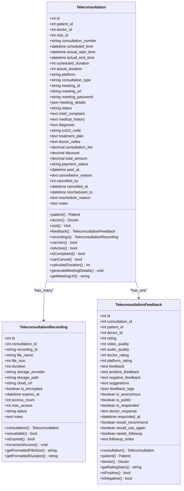
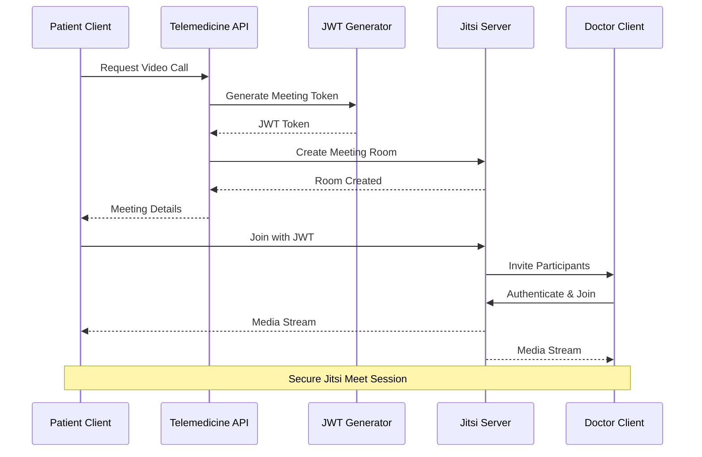
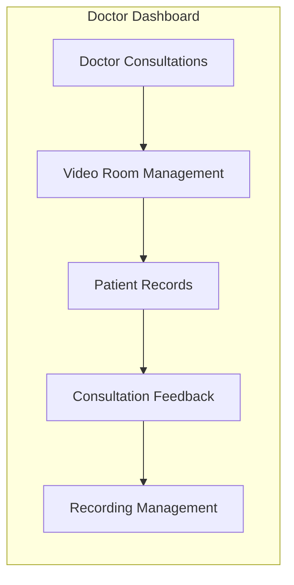
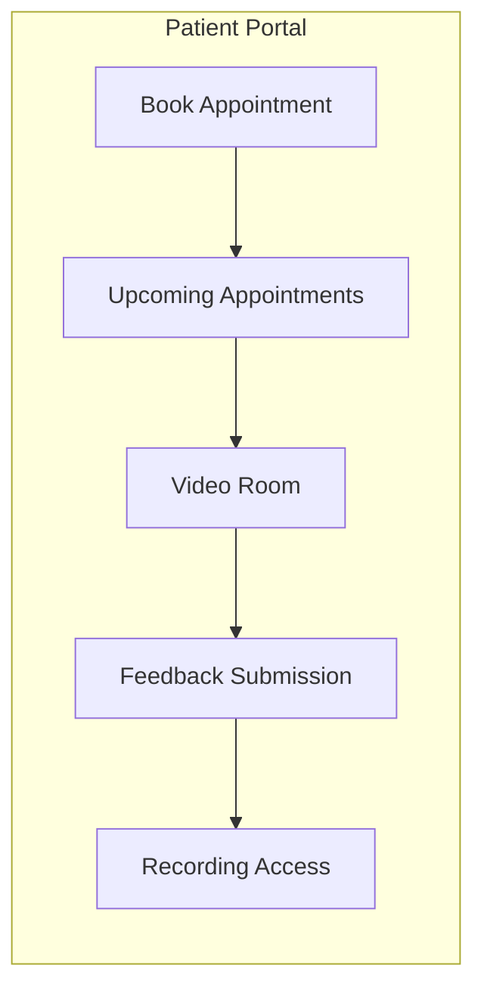
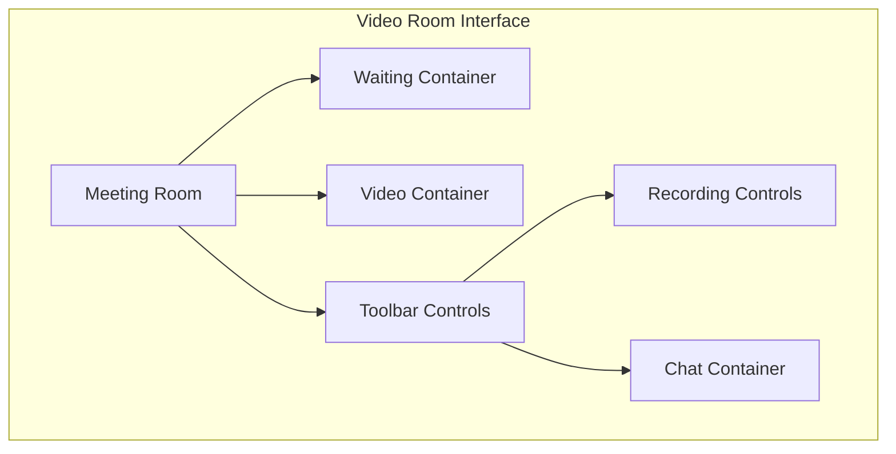
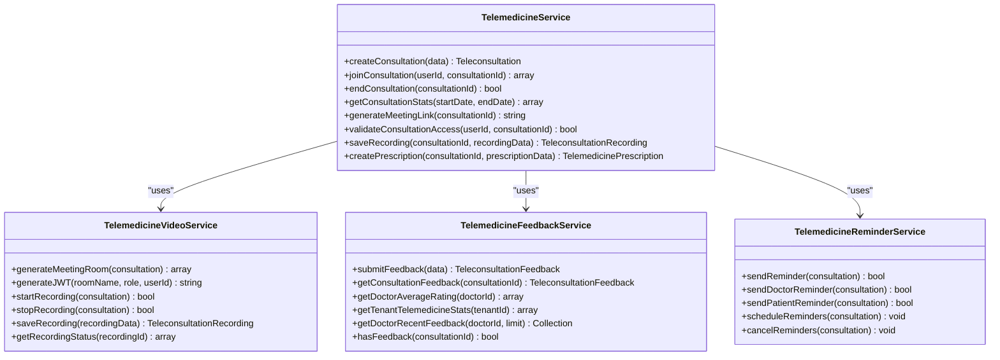
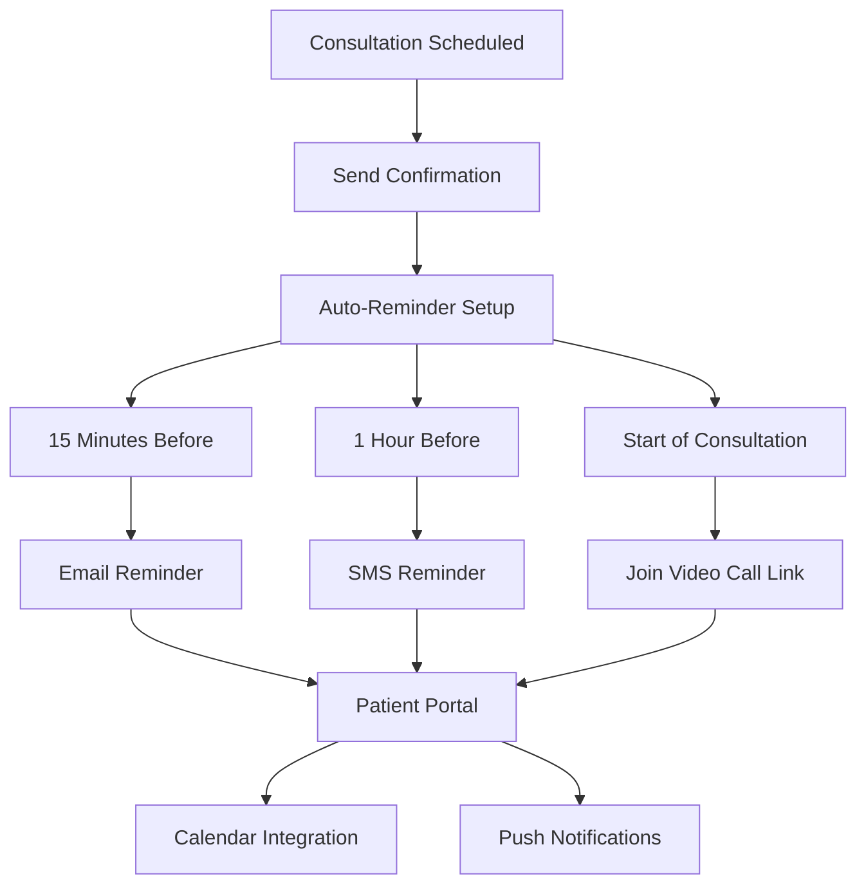
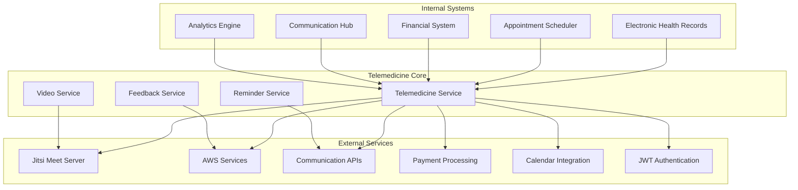

# Telemedicine Video Integration

<cite>
**Referenced Files in This Document**
- [2026_04_08_1000001_create_telemedicine_tables.php](file://database/migrations/2026_04_08_1000001_create_telemedicine_tables.php)
- [2026_04_08_1900001_create_telemedicine_resource_inventory_tables.php](file://database/migrations/2026_04_08_1900001_create_telemedicine_resource_inventory_tables.php)
- [2026_04_10_000001_create_telemedicine_settings.php](file://database/migrations/2026_04_10_000001_create_telemedicine_settings.php)
- [Teleconsultation.php](file://app/Models/Teleconsultation.php)
- [TeleconsultationRecording.php](file://app/Models/TeleconsultationRecording.php)
- [TeleconsultationFeedback.php](file://app/Models/TeleconsultationFeedback.php)
- [TelemedicineSetting.php](file://app/Models/TelemedicineSetting.php)
- [TelemedicineService.php](file://app/Services/TelemedicineService.php)
- [TelemedicineVideoService.php](file://app/Services/TelemedicineVideoService.php)
- [TelemedicineFeedbackService.php](file://app/Services/TelemedicineFeedbackService.php)
- [TelemedicineReminderService.php](file://app/Services/TelemedicineReminderService.php)
- [TelemedicineController.php](file://app/Http/Controllers/Healthcare/TelemedicineController.php)
- [TeleconsultationController.php](file://app/Http/Controllers/Healthcare/TeleconsultationController.php)
- [TeleconsultationRecordingController.php](file://app/Http/Controllers/Healthcare/TeleconsultationRecordingController.php)
- [TelemedicineSettingsController.php](file://app/Http/Controllers/Healthcare/TelemedicineSettingsController.php)
- [TelemedicineReminderNotification.php](file://app/Notifications/TelemedicineReminderNotification.php)
- [video-room.blade.php](file://resources/views/healthcare/telemedicine/video-room.blade.php)
- [feedback.blade.php](file://resources/views/healthcare/telemedicine/feedback.blade.php)
- [settings.blade.php](file://resources/views/healthcare/telemedicine/settings.blade.php)
- [book.blade.php](file://resources/views/telemedicine/book.blade.php)
- [feedback.blade.php](file://resources/views/telemedicine/feedback.blade.php)
- [prescriptions.blade.php](file://resources/views/telemedicine/prescriptions.blade.php)
- [healthcare.php](file://routes/healthcare.php)
- [api.php](file://routes/api.php)
</cite>

## Update Summary
**Changes Made**
- Enhanced Jitsi Meet integration with advanced meeting room management and participant authentication
- Added comprehensive recording capabilities with encrypted storage and access controls
- Implemented sophisticated feedback collection system with quality metrics
- Expanded reminder system with multi-channel notifications
- Updated database schema to support Jitsi-specific configurations
- Enhanced UI components for video consultation experience
- Added TelemedicineSettingsController for comprehensive settings management
- Integrated TelemedicineVideoService and TelemedicineFeedbackService into main controller
- Enhanced Teleconsultation model with improved Jitsi meeting integration

## Table of Contents
1. [Introduction](#introduction)
2. [System Architecture](#system-architecture)
3. [Database Schema](#database-schema)
4. [Core Components](#core-components)
5. [Video Call Infrastructure](#video-call-infrastructure)
6. [User Interface Components](#user-interface-components)
7. [Service Layer](#service-layer)
8. [API Endpoints](#api-endpoints)
9. [Notification System](#notification-system)
10. [Security and Access Control](#security-and-access-control)
11. [Integration Points](#integration-points)
12. [Performance Considerations](#performance-considerations)
13. [Troubleshooting Guide](#troubleshooting-guide)
14. [Conclusion](#conclusion)

## Introduction

The Telemedicine Video Integration is a comprehensive healthcare solution built within the qalcuityERP platform that enables secure, high-quality video consultations through advanced Jitsi Meet integration. This system provides healthcare providers with a complete telemedicine workflow from appointment scheduling to encrypted consultation recording and detailed feedback collection.

The integration supports real-time video consultations with advanced meeting room management, participant authentication through JWT tokens, automated appointment reminders, and comprehensive documentation of telehealth sessions. It leverages modern web technologies including Jitsi Meet for professional-grade video streaming, Laravel's robust backend framework for business logic, and a responsive frontend interface optimized for both desktop and mobile devices.

**Updated** Enhanced with advanced Jitsi Meet integration featuring meeting room management, participant authentication, and comprehensive recording capabilities. Added TelemedicineSettingsController for comprehensive settings management and integrated TelemedicineVideoService and TelemedicineFeedbackService into the main controller architecture.

## System Architecture

The telemedicine system follows a layered architecture pattern with clear separation of concerns across multiple domains:



**Diagram sources**
- [TelemedicineService.php](file://app/Services/TelemedicineService.php)
- [TelemedicineVideoService.php](file://app/Services/TelemedicineVideoService.php)
- [Teleconsultation.php](file://app/Models/Teleconsultation.php)
- [TelemedicineSetting.php](file://app/Models/TelemedicineSetting.php)

The architecture ensures scalability, maintainability, and security while providing seamless integration with existing healthcare workflows and advanced Jitsi Meet capabilities.

## Database Schema

The telemedicine system utilizes an enhanced database schema designed to support secure medical consultations, comprehensive patient care documentation, and advanced Jitsi Meet integration:



**Diagram sources**
- [2026_04_08_1000001_create_telemedicine_tables.php](file://database/migrations/2026_04_08_1000001_create_telemedicine_tables.php)
- [2026_04_10_000001_create_telemedicine_settings.php](file://database/migrations/2026_04_10_000001_create_telemedicine_settings.php)

**Section sources**
- [2026_04_08_1000001_create_telemedicine_tables.php:1-200](file://database/migrations/2026_04_08_1000001_create_telemedicine_tables.php#L1-L200)
- [2026_04_08_1900001_create_telemedicine_resource_inventory_tables.php:1-150](file://database/migrations/2026_04_08_1900001_create_telemedicine_resource_inventory_tables.php#L1-L150)
- [2026_04_10_000001_create_telemedicine_settings.php:1-61](file://database/migrations/2026_04_10_000001_create_telemedicine_settings.php#L1-L61)

## Core Components

### Teleconsultation Model

The Teleconsultation model serves as the central entity representing video consultations within the system, now enhanced with comprehensive Jitsi Meet integration:



**Diagram sources**
- [Teleconsultation.php](file://app/Models/Teleconsultation.php)
- [TeleconsultationRecording.php](file://app/Models/TeleconsultationRecording.php)
- [TeleconsultationFeedback.php](file://app/Models/TeleconsultationFeedback.php)

### Enhanced Telemedicine Setting Model

The TelemedicineSetting model manages comprehensive configurations for telemedicine operations, now supporting advanced Jitsi Meet integration:

| Setting Category | Setting Key | Type | Description | Default Value |
|------------------|-------------|------|-------------|---------------|
| **Jitsi Configuration** | `jitsi_server_url` | String | Jitsi server URL (public or self-hosted) | https://meet.jit.si |
| | `jitsi_app_id` | String | App ID for self-hosted authentication | null |
| | `jitsi_secret` | String | JWT secret for self-hosted authentication | null |
| **Feature Flags** | `enable_recording` | Boolean | Enable/disable automatic recording | true |
| | `enable_waiting_room` | Boolean | Enable/disable waiting room feature | true |
| | `enable_chat` | Boolean | Enable/disable chat functionality | true |
| | `enable_screen_share` | Boolean | Enable/disable screen sharing | true |
| | `enable_feedback` | Boolean | Enable/disable feedback collection | true |
| | `require_feedback` | Boolean | Require feedback submission | false |
| **Notification Settings** | `reminder_enabled` | Boolean | Enable/disable appointment reminders | true |
| | `reminder_minutes_before` | Integer | Reminder timing in minutes | 30 |
| | `send_email_reminder` | Boolean | Send email reminders | true |
| | `send_sms_reminder` | Boolean | Send SMS reminders | false |
| **Consultation Limits** | `max_participants` | Integer | Maximum participants per consultation | 10 |
| | `consultation_timeout_minutes` | Integer | Maximum consultation duration | 60 |
| | `allow_group_consultation` | Boolean | Allow multiple participants | false |
| **Branding** | `custom_logo_url` | String | Custom logo URL | null |
| | `welcome_message` | String | Custom welcome message | null |

**Section sources**
- [Teleconsultation.php](file://app/Models/Teleconsultation.php)
- [TeleconsultationRecording.php](file://app/Models/TeleconsultationRecording.php)
- [TelemedicineSetting.php](file://app/Models/TelemedicineSetting.php)

## Video Call Infrastructure

The video call infrastructure leverages advanced Jitsi Meet integration with comprehensive meeting room management and participant authentication:



**Diagram sources**
- [TelemedicineVideoService.php](file://app/Services/TelemedicineVideoService.php)
- [Teleconsultation.php](file://app/Models/Teleconsultation.php)
- [TelemedicineController.php](file://app/Http/Controllers/Healthcare/TelemedicineController.php)

### Jitsi Meet Integration Components

The system integrates with Jitsi Meet for comprehensive telemedicine functionality:

| Jitsi Component | Purpose | Configuration |
|-----------------|---------|---------------|
| **Meeting Rooms** | Video consultation rooms | Unique room names, meeting URLs |
| **JWT Authentication** | Self-hosted participant auth | Role-based access control |
| **Recording System** | Consultation recording | Encrypted storage, access limits |
| **Waiting Room** | Participant management | Queue management, moderation |
| **Screen Sharing** | Presentation capabilities | Document sharing, whiteboard |
| **Chat System** | Text communication | Private/public messaging |
| **API Integration** | Programmatic control | Room management, participant control |

**Section sources**
- [TelemedicineVideoService.php](file://app/Services/TelemedicineVideoService.php)
- [TelemedicineController.php](file://app/Http/Controllers/Healthcare/TelemedicineController.php)
- [2026_04_08_1000001_create_telemedicine_tables.php:1-200](file://database/migrations/2026_04_08_1000001_create_telemedicine_tables.php#L1-L200)

## User Interface Components

The telemedicine interface consists of multiple specialized views designed for different user roles and workflows, now enhanced with advanced Jitsi Meet integration:

### Doctor Interface



**Diagram sources**
- [video-room.blade.php](file://resources/views/healthcare/telemedicine/video-room.blade.php)
- [feedback.blade.php](file://resources/views/healthcare/telemedicine/feedback.blade.php)

### Patient Interface



**Diagram sources**
- [book.blade.php](file://resources/views/telemedicine/book.blade.php)
- [feedback.blade.php](file://resources/views/telemedicine/feedback.blade.php)

### Enhanced Video Room Interface

The video room interface now features comprehensive Jitsi Meet integration with advanced controls:



**Section sources**
- [video-room.blade.php](file://resources/views/healthcare/telemedicine/video-room.blade.php)
- [book.blade.php](file://resources/views/telemedicine/book.blade.php)
- [feedback.blade.php](file://resources/views/telemedicine/feedback.blade.php)

## Service Layer

The service layer provides comprehensive business logic for telemedicine operations, now enhanced with advanced Jitsi Meet integration and sophisticated feedback management:

### Enhanced TelemedicineService

The primary service orchestrating telemedicine operations with advanced Jitsi Meet integration:



**Diagram sources**
- [TelemedicineService.php](file://app/Services/TelemedicineService.php)
- [TelemedicineVideoService.php](file://app/Services/TelemedicineVideoService.php)
- [TelemedicineFeedbackService.php](file://app/Services/TelemedicineFeedbackService.php)
- [TelemedicineReminderService.php](file://app/Services/TelemedicineReminderService.php)

**Section sources**
- [TelemedicineService.php](file://app/Services/TelemedicineService.php)
- [TelemedicineVideoService.php](file://app/Services/TelemedicineVideoService.php)
- [TelemedicineFeedbackService.php](file://app/Services/TelemedicineFeedbackService.php)
- [TelemedicineReminderService.php](file://app/Services/TelemedicineReminderService.php)

## API Endpoints

The telemedicine system exposes comprehensive RESTful APIs for programmatic access to consultation management and Jitsi Meet integration:

| Endpoint | Method | Description | Authentication |
|----------|--------|-------------|----------------|
| `/api/teleconsultations` | GET | List all consultations | Required |
| `/api/teleconsultations` | POST | Create new consultation | Required |
| `/api/teleconsultations/{id}` | GET | Get consultation details | Required |
| `/api/teleconsultations/{id}` | PUT | Update consultation | Required |
| `/api/teleconsultations/{id}` | DELETE | Cancel consultation | Required |
| `/api/teleconsultations/{id}/join` | POST | Join video consultation | Required |
| `/api/teleconsultations/{id}/meeting-token` | POST | Generate JWT token | Required |
| `/api/teleconsultations/{id}/recording/start` | POST | Start recording | Required |
| `/api/teleconsultations/{id}/recording/stop` | POST | Stop recording | Required |
| `/api/teleconsultations/{id}/recording/status` | GET | Get recording status | Required |
| `/api/teleconsultations/{id}/feedback` | POST | Submit feedback | Required |
| `/api/teleconsultations/{id}/feedback` | GET | Get feedback | Required |
| `/api/telemedicine-settings` | GET | Get system settings | Required |
| `/api/telemedicine-settings` | PUT | Update settings | Required |

**Section sources**
- [api.php](file://routes/api.php)
- [healthcare.php](file://routes/healthcare.php)

## Notification System

The telemedicine notification system ensures timely communication about appointments and consultation status, now enhanced with multi-channel notification capabilities:



**Diagram sources**
- [TelemedicineReminderNotification.php](file://app/Notifications/TelemedicineReminderNotification.php)
- [TelemedicineReminderService.php](file://app/Services/TelemedicineReminderService.php)

**Section sources**
- [TelemedicineReminderNotification.php](file://app/Notifications/TelemedicineReminderNotification.php)
- [TelemedicineReminderService.php](file://app/Services/TelemedicineReminderService.php)

## Security and Access Control

The telemedicine system implements comprehensive security measures to protect sensitive health information, now enhanced with advanced Jitsi Meet authentication:

### Enhanced Access Control Matrix

| Resource | Doctor Access | Patient Access | Admin Access | Public Access |
|----------|---------------|----------------|--------------|---------------|
| Consultation List | ✓ | ✓ | ✓ | ✗ |
| Consultation Details | ✓ | ✓ | ✓ | ✗ |
| Video Room Access | ✓ | ✓ | ✗ | ✗ |
| Meeting Token Generation | ✓ | ✓ | ✗ | ✗ |
| Patient Records | ✓ | ✗ | ✓ | ✗ |
| System Settings | ✗ | ✗ | ✓ | ✗ |
| Recording Management | ✓ | ✗ | ✓ | ✗ |
| Feedback Management | ✓ | ✗ | ✓ | ✗ |

### Advanced Encryption Standards

- **Transport Encryption**: TLS 1.3 for all API communications and Jitsi Meet connections
- **Data At Rest**: AES-256 encryption for recordings and documents
- **In-Transit Encryption**: SRTP for media streams and end-to-end encryption
- **JWT Authentication**: Role-based access control for self-hosted Jitsi Meet
- **End-to-End Encryption**: Optional client-side encryption for enhanced security

**Section sources**
- [Teleconsultation.php](file://app/Models/Teleconsultation.php)
- [TelemedicineVideoService.php](file://app/Services/TelemedicineVideoService.php)
- [TelemedicineSetting.php](file://app/Models/TelemedicineSetting.php)

## Integration Points

The telemedicine system integrates with various enterprise systems and third-party services, now enhanced with comprehensive Jitsi Meet integration:



**Diagram sources**
- [TelemedicineService.php](file://app/Services/TelemedicineService.php)
- [TelemedicineVideoService.php](file://app/Services/TelemedicineVideoService.php)
- [TelemedicineController.php](file://app/Http/Controllers/Healthcare/TelemedicineController.php)

**Section sources**
- [TelemedicineService.php](file://app/Services/TelemedicineService.php)
- [TelemedicineVideoService.php](file://app/Services/TelemedicineVideoService.php)
- [TelemedicineController.php](file://app/Http/Controllers/Healthcare/TelemedicineController.php)

## Performance Considerations

### Enhanced Scalability Targets

- **Concurrent Calls**: Support up to 10,000 simultaneous Jitsi Meet consultations
- **Response Time**: API response under 200ms for 95th percentile
- **Recording Storage**: Auto-scaling S3 buckets with lifecycle policies and encryption
- **Database Performance**: Read replicas for consultation queries and Jitsi integration
- **CDN Distribution**: Global CDN for static assets, recordings, and Jitsi Meet resources
- **WebSocket Connections**: Optimized for real-time communication and meeting management

### Advanced Optimization Strategies

1. **Caching Layer**: Redis for frequently accessed consultation data and Jitsi meeting configurations
2. **Database Indexing**: Composite indexes on frequently queried fields and Jitsi room identifiers
3. **Asynchronous Processing**: Background jobs for non-critical operations and recording processing
4. **Connection Pooling**: Optimized database connection management for high-concurrency scenarios
5. **Content Compression**: Gzip compression for API responses and media stream optimization
6. **Load Balancing**: Horizontal scaling for Jitsi Meet servers and API endpoints
7. **Monitoring**: Comprehensive metrics for Jitsi Meet performance and user engagement

## Troubleshooting Guide

### Enhanced Common Issues and Solutions

| Issue | Symptoms | Solution |
|-------|----------|----------|
| **Jitsi Meet Connection Failures** | Cannot connect to meeting room | Check Jitsi server URL, firewall settings, and JWT token generation |
| **Authentication Problems** | Invalid JWT token errors | Verify Jitsi secret configuration and token expiration |
| **Recording Issues** | Cannot save or access recordings | Confirm S3 bucket permissions, storage quotas, and encryption settings |
| **Notification Failures** | Missing appointment reminders | Review notification service configuration and multi-channel settings |
| **Performance Degradation** | Slow loading times during meetings | Monitor Jitsi Meet server performance and optimize media settings |
| **Waiting Room Issues** | Participants cannot access waiting room | Check waiting room configuration and participant limits |

### Advanced Diagnostic Commands

```bash
# Check Jitsi Meet server health
php artisan telemedicine:check-jitsi-status

# Monitor video service performance
php artisan telemedicine:monitor-video-services

# Validate JWT configuration
php artisan telemedicine:validate-jwt-config

# Clean up expired recordings
php artisan telemedicine:cleanup-expired-recordings

# Generate comprehensive diagnostic report
php artisan telemedicine:generate-comprehensive-diagnostic-report

# Test Jitsi Meet integration
php artisan telemedicine:test-jitsi-integration
```

**Section sources**
- [TelemedicineService.php](file://app/Services/TelemedicineService.php)
- [TelemedicineVideoService.php](file://app/Services/TelemedicineVideoService.php)
- [TelemedicineController.php](file://app/Http/Controllers/Healthcare/TelemedicineController.php)

## Conclusion

The enhanced Telemedicine Video Integration represents a comprehensive solution for modern healthcare delivery, combining advanced Jitsi Meet integration with robust clinical workflow management. The system's modular architecture ensures scalability and maintainability while providing healthcare providers with the tools necessary for effective remote patient care.

Key enhancements of the implementation include:

- **Advanced Jitsi Meet Integration**: Professional-grade video conferencing with meeting room management and participant authentication
- **Enhanced Security**: End-to-end encryption, JWT authentication, and strict access controls for self-hosted deployments
- **Comprehensive Recording System**: Encrypted recording storage with access controls and expiration policies
- **Sophisticated Feedback Management**: Detailed feedback collection with quality metrics and analytics
- **Multi-Channel Notifications**: Comprehensive reminder system with email, SMS, and push notifications
- **Scalable Infrastructure**: Built to handle high-volume telemedicine operations with Jitsi Meet integration
- **Advanced UI Components**: Enhanced video room interface with comprehensive controls and monitoring
- **Multi-Tenant Support**: Flexible configuration for healthcare organizations with Jitsi Meet customization
- **Seamless Integration**: Easy integration with existing healthcare IT systems and Jitsi Meet ecosystem
- **Comprehensive Settings Management**: Dedicated TelemedicineSettingsController for fine-grained configuration control

The system positions qalcuityERP as a leader in healthcare technology innovation, providing healthcare providers with the capability to deliver quality care regardless of geographical constraints while maintaining the highest standards of security, compliance, and user experience through advanced Jitsi Meet integration.