# Tour Travel Module

<cite>
**Referenced Files in This Document**
- [TourTravelAnalyticsController.php](file://app/Http/Controllers/TourTravel/TourTravelAnalyticsController.php)
- [TourPackageController.php](file://app/Http/Controllers/TourTravel/TourPackageController.php)
- [TourBookingController.php](file://app/Http/Controllers/TourTravel/TourBookingController.php)
- [TourTravelApiController.php](file://app/Http/Controllers/Api/TourTravelApiController.php)
- [TourPackage.php](file://app/Models/TourPackage.php)
- [TourBooking.php](file://app/Models/TourBooking.php)
- [TourSupplier.php](file://app/Models/TourSupplier.php)
- [ItineraryDay.php](file://app/Models/ItineraryDay.php)
- [BookingPassenger.php](file://app/Models/BookingPassenger.php)
- [VisaApplication.php](file://app/Models/VisaApplication.php)
- [TravelDocument.php](file://app/Models/TravelDocument.php)
- [PackageSupplierAllocation.php](file://app/Models/PackageSupplierAllocation.php)
- [index.blade.php](file://resources/views/tour-travel/analytics/index.blade.php)
- [index.blade.php](file://resources/views/tour-travel/packages/index.blade.php)
- [index.blade.php](file://resources/views/tour-travel/bookings/index.blade.php)
</cite>

## Update Summary
**Changes Made**
- Added comprehensive Tour Travel Analytics Dashboard with real-time metrics and visualizations
- Enhanced API endpoints with vehicle management capabilities
- Expanded booking management with advanced payment tracking and guide assignment
- Improved package management with detailed supplier allocation and cost tracking
- Added comprehensive analytics with monthly trends, status distribution, and destination insights

## Table of Contents
1. [Introduction](#introduction)
2. [Project Structure](#project-structure)
3. [Core Components](#core-components)
4. [Architecture Overview](#architecture-overview)
5. [Detailed Component Analysis](#detailed-component-analysis)
6. [Analytics Dashboard](#analytics-dashboard)
7. [Data Models](#data-models)
8. [API Endpoints](#api-endpoints)
9. [Business Workflows](#business-workflows)
10. [Performance Considerations](#performance-considerations)
11. [Troubleshooting Guide](#troubleshooting-guide)
12. [Conclusion](#conclusion)

## Introduction

The Tour Travel Module is a comprehensive travel management system integrated into the qalcuityERP platform. This module handles tour package creation, booking management, supplier coordination, visa applications, and travel document management. The system supports multi-tenant architecture, allowing different organizations to maintain separate travel operations while sharing the same infrastructure.

**Updated** The module now includes a sophisticated analytics dashboard providing real-time insights into booking performance, revenue tracking, and operational metrics. The analytics system features interactive charts, comprehensive reporting, and actionable business intelligence.

The module encompasses four main areas: tour package management, booking and customer relationship management, operational support including suppliers, visas, and travel documents, and comprehensive analytics and reporting. It provides both web-based interfaces and RESTful API endpoints for seamless integration with various client applications.

## Project Structure

The Tour Travel Module follows Laravel's MVC architecture pattern with clear separation of concerns and enhanced analytics capabilities:

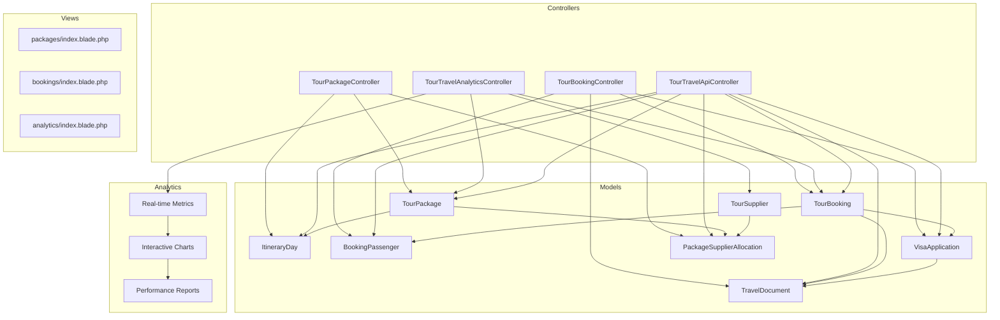

**Diagram sources**
- [TourPackageController.php:17-229](file://app/Http/Controllers/TourTravel/TourPackageController.php#L17-L229)
- [TourBookingController.php:12-202](file://app/Http/Controllers/TourTravel/TourBookingController.php#L12-L202)
- [TourTravelAnalyticsController.php:12-95](file://app/Http/Controllers/TourTravel/TourTravelAnalyticsController.php#L12-L95)
- [TourTravelApiController.php:12-182](file://app/Http/Controllers/Api/TourTravelApiController.php#L12-L182)

**Section sources**
- [TourPackageController.php:1-229](file://app/Http/Controllers/TourTravel/TourPackageController.php#L1-L229)
- [TourBookingController.php:1-202](file://app/Http/Controllers/TourTravel/TourBookingController.php#L1-L202)
- [TourTravelAnalyticsController.php:1-95](file://app/Http/Controllers/TourTravel/TourTravelAnalyticsController.php#L1-L95)
- [TourTravelApiController.php:1-182](file://app/Http/Controllers/Api/TourTravelApiController.php#L1-L182)

## Core Components

### Tour Package Management System

The Tour Package Management System handles the creation, modification, and lifecycle management of travel packages. It includes comprehensive package information, detailed itineraries, supplier allocations, and real-time availability tracking.

Key features include:
- Package creation with detailed pricing and availability
- Multi-day itinerary management with activities and accommodations
- Supplier allocation and cost tracking
- Status management (draft, active, inactive, archived)
- Profit margin calculations and reporting

### Booking Management System

The Booking Management System processes customer reservations, manages passenger information, handles payment processing, and tracks booking lifecycle stages from initial inquiry to completion.

**Updated** Enhanced with advanced payment tracking, guide assignment capabilities, and comprehensive booking status management.

Core functionalities:
- Customer booking creation with passenger details
- Payment tracking and status updates with partial payments
- Booking status management (pending, confirmed, paid, cancelled, completed)
- Guide assignment and special request handling
- Revenue tracking and reporting

### Analytics Dashboard System

**New** The Analytics Dashboard provides comprehensive business intelligence with real-time metrics, interactive visualizations, and actionable insights.

Key features include:
- Real-time booking statistics and revenue tracking
- Monthly trend analysis with interactive charts
- Package performance ranking and revenue analysis
- Popular destination insights and market trends
- Interactive pie charts and bar graphs for data visualization

### Supplier Coordination System

The Supplier Coordination System manages relationships with external service providers including hotels, transportation companies, activity providers, and visa agents. It tracks supplier performance, service allocations, and cost calculations.

### Document Management System

The Document Management System handles all travel-related documentation including passports, visas, tickets, insurance policies, and other essential travel documents with expiry tracking and compliance monitoring.

**Section sources**
- [TourPackageController.php:19-46](file://app/Http/Controllers/TourTravel/TourPackageController.php#L19-L46)
- [TourBookingController.php:14-38](file://app/Http/Controllers/TourTravel/TourBookingController.php#L14-L38)
- [TourTravelAnalyticsController.php:24-94](file://app/Http/Controllers/TourTravel/TourTravelAnalyticsController.php#L24-L94)

## Architecture Overview

The Tour Travel Module implements a layered architecture with clear separation between presentation, business logic, and data persistence layers, enhanced with analytics capabilities:

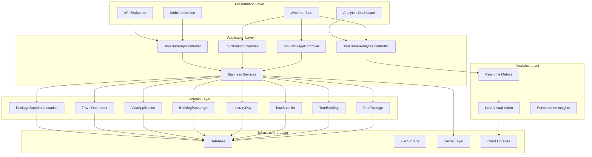

**Diagram sources**
- [TourPackageController.php:17-229](file://app/Http/Controllers/TourTravel/TourPackageController.php#L17-L229)
- [TourBookingController.php:12-202](file://app/Http/Controllers/TourTravel/TourBookingController.php#L12-L202)
- [TourTravelAnalyticsController.php:12-95](file://app/Http/Controllers/TourTravel/TourTravelAnalyticsController.php#L12-L95)
- [TourTravelApiController.php:12-182](file://app/Http/Controllers/Api/TourTravelApiController.php#L12-L182)

## Detailed Component Analysis

### Tour Package Controller

The Tour Package Controller serves as the primary interface for managing tour packages, handling CRUD operations, and coordinating complex package workflows.

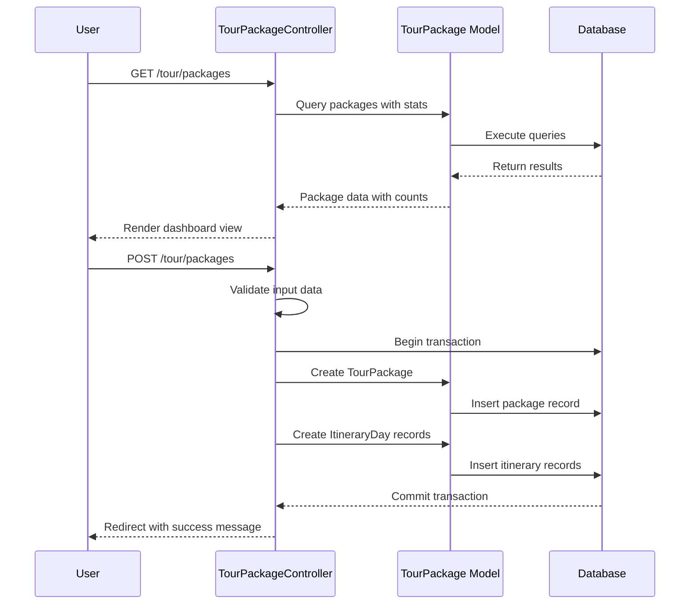

**Diagram sources**
- [TourPackageController.php:22-111](file://app/Http/Controllers/TourTravel/TourPackageController.php#L22-L111)
- [TourPackage.php:163-196](file://app/Models/TourPackage.php#L163-L196)

Key responsibilities include:
- Dashboard statistics generation
- Package creation with validation
- Itinerary day management
- Supplier allocation coordination
- Package status management

**Section sources**
- [TourPackageController.php:17-229](file://app/Http/Controllers/TourTravel/TourPackageController.php#L17-L229)

### Tour Booking Controller

The Tour Booking Controller manages the complete booking lifecycle from initial reservation to trip completion, handling customer interactions and payment processing.

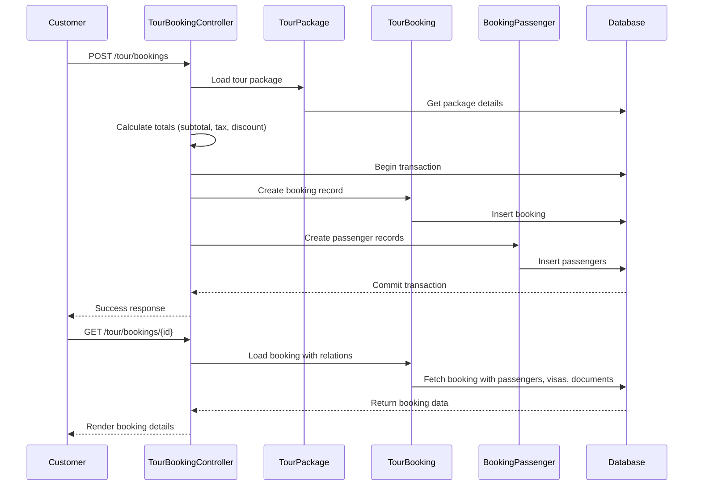

**Diagram sources**
- [TourBookingController.php:56-133](file://app/Http/Controllers/TourTravel/TourBookingController.php#L56-L133)
- [TourBooking.php:163-194](file://app/Models/TourBooking.php#L163-L194)

**Section sources**
- [TourBookingController.php:12-202](file://app/Http/Controllers/TourTravel/TourBookingController.php#L12-L202)

### Tour Travel Analytics Controller

**New** The Tour Travel Analytics Controller provides comprehensive business intelligence and reporting capabilities for travel operations.

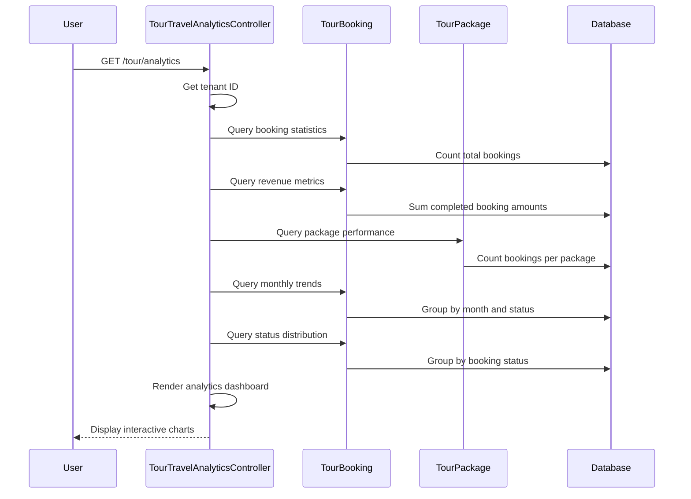

**Diagram sources**
- [TourTravelAnalyticsController.php:24-94](file://app/Http/Controllers/TourTravel/TourTravelAnalyticsController.php#L24-L94)

Key analytics capabilities:
- Real-time booking statistics and revenue tracking
- Monthly trend analysis with interactive charts
- Package performance ranking and revenue analysis
- Popular destination insights and market trends
- Booking status distribution visualization

**Section sources**
- [TourTravelAnalyticsController.php:12-95](file://app/Http/Controllers/TourTravel/TourTravelAnalyticsController.php#L12-L95)

### API Controller

The Tour Travel API Controller provides RESTful endpoints for external integrations and mobile applications, supporting CRUD operations for packages, bookings, itineraries, and vehicle management.

**Updated** Enhanced with comprehensive vehicle management capabilities and expanded booking status controls.

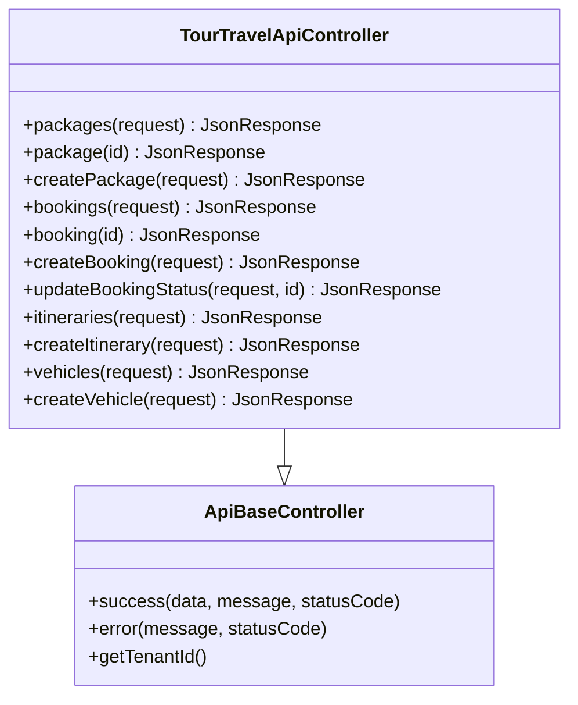

**Diagram sources**
- [TourTravelApiController.php:12-182](file://app/Http/Controllers/Api/TourTravelApiController.php#L12-L182)

**Section sources**
- [TourTravelApiController.php:1-182](file://app/Http/Controllers/Api/TourTravelApiController.php#L1-L182)

## Analytics Dashboard

**New** The Analytics Dashboard provides comprehensive business intelligence with real-time metrics, interactive visualizations, and actionable insights.

### Dashboard Layout and Components

The analytics dashboard features a responsive grid layout with key metrics cards, interactive charts, and sortable tables:

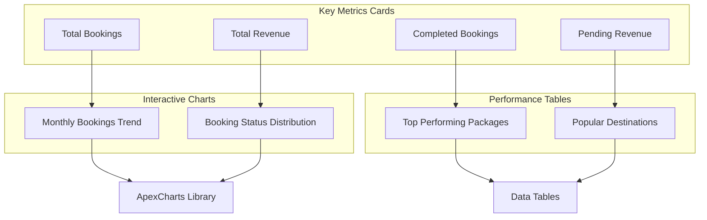

**Diagram sources**
- [index.blade.php:12-193](file://resources/views/tour-travel/analytics/index.blade.php#L12-L193)

### Real-time Metrics Collection

The analytics system collects comprehensive metrics through optimized database queries:

**Booking Statistics:**
- Total bookings count with tenant filtering
- Status-specific booking counts (confirmed, completed, cancelled)
- Revenue tracking with completed booking aggregation
- Pending revenue calculation with outstanding balances

**Performance Analytics:**
- Package performance ranking by booking volume and revenue
- Monthly trend analysis with 12-month historical data
- Destination popularity analysis with booking and revenue metrics
- Status distribution visualization for operational insights

**Section sources**
- [TourTravelAnalyticsController.php:28-85](file://app/Http/Controllers/TourTravel/TourTravelAnalyticsController.php#L28-L85)
- [index.blade.php:11-193](file://resources/views/tour-travel/analytics/index.blade.php#L11-L193)

## Data Models

The Tour Travel Module implements a comprehensive entity relationship model that supports complex travel operations:

```mermaid
erDiagram
TOUR_PACKAGE {
int id PK
int tenant_id FK
string package_code
string name
string destination
string category
int duration_days
int duration_nights
decimal price_per_person
decimal cost_per_person
string currency
string status
date valid_from
date valid_until
json inclusions
json exclusions
string terms_conditions
string cancellation_policy
int sort_order
boolean is_featured
int created_by FK
datetime created_at
datetime updated_at
datetime deleted_at
}
ITINERARY_DAY {
int id PK
int tour_package_id FK
int day_number
string title
text description
json activities
string accommodation
json meals
string transport_mode
int sort_order
datetime created_at
datetime updated_at
}
TOUR_BOOKING {
int id PK
int tenant_id FK
string booking_number
int tour_package_id FK
int customer_id FK
string customer_name
string customer_email
string customer_phone
date departure_date
int adults
int children
int infants
decimal unit_price
decimal discount_amount
decimal tax_amount
string currency
string status
string payment_status
decimal total_amount
decimal paid_amount
date payment_due_date
text special_requests
text notes
int assigned_guide FK
datetime confirmed_at
datetime cancelled_at
string cancellation_reason
int created_by FK
datetime created_at
datetime updated_at
datetime deleted_at
}
BOOKING_PASSENGER {
int id PK
int tour_booking_id FK
string full_name
string passport_number
date passport_expiry
string nationality
date date_of_birth
string gender
string phone
string email
string type
string dietary_requirements
string medical_conditions
string special_assistance
datetime created_at
datetime updated_at
}
TOUR_SUPPLIER {
int id PK
int tenant_id FK
string supplier_code
string name
string type
string description
string contact_person
string contact_phone
string contact_email
string address
string city
string country
string website
decimal rating
string notes
string status
int created_by FK
datetime created_at
datetime updated_at
datetime deleted_at
}
PACKAGE_SUPPLIER_ALLOCATION {
int id PK
int tour_package_id FK
int supplier_id FK
string service_type
string service_description
int day_number
decimal cost_per_unit
string unit_type
json details
datetime created_at
datetime updated_at
}
VISA_APPLICATION {
int id PK
int tenant_id FK
int tour_booking_id FK
int passenger_id FK
string application_number
string destination_country
string visa_type
string applicant_name
string passport_number
date passport_expiry
date application_date
date intended_travel_date
string status
date submission_date
date approval_date
date expiry_date
decimal fee_amount
string currency
json requirements_checklist
text notes
int agent_id FK
datetime created_at
datetime updated_at
datetime deleted_at
}
TRAVEL_DOCUMENT {
int id PK
int tenant_id FK
int tour_booking_id FK
int passenger_id FK
int visa_application_id FK
string document_type
string document_number
string file_path
string file_name
string mime_type
int file_size
date issue_date
date expiry_date
text notes
int uploaded_by FK
datetime created_at
datetime updated_at
}
TOUR_PACKAGE ||--o{ ITINERARY_DAY : contains
TOUR_PACKAGE ||--o{ PACKAGE_SUPPLIER_ALLOCATION : allocates
TOUR_PACKAGE ||--o{ TOUR_BOOKING : offers
TOUR_BOOKING ||--o{ BOOKING_PASSENGER : includes
TOUR_BOOKING ||--o{ VISA_APPLICATION : requires
TOUR_BOOKING ||--o{ TRAVEL_DOCUMENT : generates
VISA_APPLICATION ||--o{ TRAVEL_DOCUMENT : creates
BOOKING_PASSENGER ||--o{ TRAVEL_DOCUMENT : holds
```

**Diagram sources**
- [TourPackage.php:13-197](file://app/Models/TourPackage.php#L13-L197)
- [TourBooking.php:13-195](file://app/Models/TourBooking.php#L13-L195)
- [ItineraryDay.php:9-54](file://app/Models/ItineraryDay.php#L9-L54)
- [BookingPassenger.php:9-68](file://app/Models/BookingPassenger.php#L9-L68)
- [TourSupplier.php:13-89](file://app/Models/TourSupplier.php#L13-L89)
- [PackageSupplierAllocation.php:9-52](file://app/Models/PackageSupplierAllocation.php#L9-L52)
- [VisaApplication.php:12-112](file://app/Models/VisaApplication.php#L12-L112)
- [TravelDocument.php:11-104](file://app/Models/TravelDocument.php#L11-L104)

### Model Relationships Analysis

The data model demonstrates sophisticated relationships supporting complex travel operations:

**Tour Package Relationships:**
- One-to-Many with ItineraryDay for detailed day-by-day planning
- One-to-Many with PackageSupplierAllocation for cost breakdown
- One-to-Many with TourBooking for revenue tracking

**Booking Relationships:**
- Many-to-One with TourPackage for service provision
- One-to-Many with BookingPassenger for individual traveler management
- One-to-Many with VisaApplication for immigration requirements
- One-to-Many with TravelDocument for compliance tracking

**Supplier Relationships:**
- One-to-Many with PackageSupplierAllocation for service provision tracking

**Section sources**
- [TourPackage.php:61-84](file://app/Models/TourPackage.php#L61-L84)
- [TourBooking.php:64-102](file://app/Models/TourBooking.php#L64-L102)
- [BookingPassenger.php:34-47](file://app/Models/BookingPassenger.php#L34-L47)

## API Endpoints

The Tour Travel API provides comprehensive RESTful endpoints for external integration:

### Package Management Endpoints

| Endpoint | Method | Description |
|----------|--------|-------------|
| `/api/tour/packages` | GET | Retrieve paginated tour packages with optional filters |
| `/api/tour/packages/{id}` | GET | Get specific tour package details |
| `/api/tour/packages` | POST | Create new tour package |
| `/api/tour/packages/{id}` | PUT/PATCH | Update tour package |
| `/api/tour/packages/{id}` | DELETE | Delete tour package |

### Booking Management Endpoints

| Endpoint | Method | Description |
|----------|--------|-------------|
| `/api/tour/bookings` | GET | Retrieve paginated bookings with filters |
| `/api/tour/bookings/{id}` | GET | Get booking details |
| `/api/tour/bookings` | POST | Create new booking |
| `/api/tour/bookings/{id}` | PUT/PATCH | Update booking status |
| `/api/tour/bookings/{id}` | DELETE | Cancel booking |

### Itinerary Management Endpoints

| Endpoint | Method | Description |
|----------|--------|-------------|
| `/api/tour/itineraries` | GET | Retrieve paginated itineraries |
| `/api/tour/itineraries/{id}` | GET | Get itinerary details |
| `/api/tour/itineraries` | POST | Create new itinerary |

### Vehicle Management Endpoints

**New** Enhanced with comprehensive vehicle management capabilities:

| Endpoint | Method | Description |
|----------|--------|-------------|
| `/api/tour/vehicles` | GET | Retrieve paginated vehicles with type and status filters |
| `/api/tour/vehicles/{id}` | GET | Get vehicle details |
| `/api/tour/vehicles` | POST | Create new vehicle with validation |
| `/api/tour/vehicles/{id}` | PUT/PATCH | Update vehicle status and details |
| `/api/tour/vehicles/{id}` | DELETE | Remove vehicle from fleet |

**Section sources**
- [TourTravelApiController.php:14-181](file://app/Http/Controllers/Api/TourTravelApiController.php#L14-L181)

## Business Workflows

### Package Creation Workflow

The package creation process involves multiple validation steps and data persistence operations:

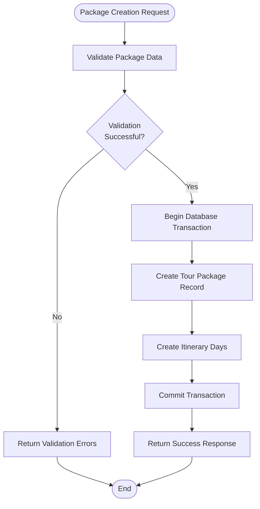

**Diagram sources**
- [TourPackageController.php:59-111](file://app/Http/Controllers/TourTravel/TourPackageController.php#L59-L111)

### Booking Process Workflow

The booking process encompasses customer reservation, payment processing, and document generation:

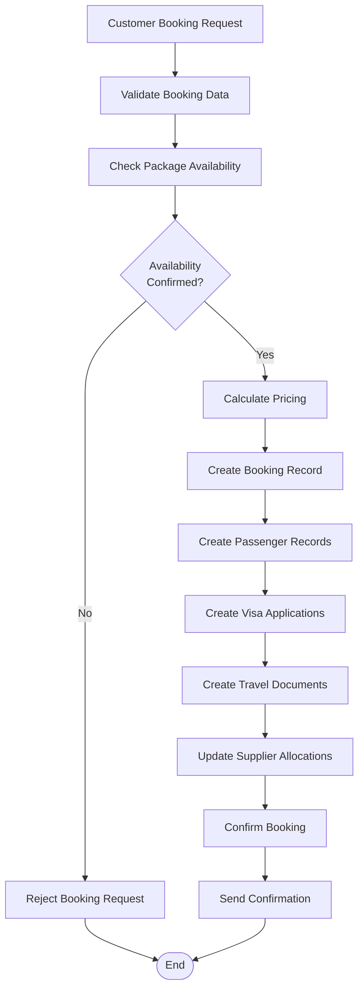

**Diagram sources**
- [TourBookingController.php:56-116](file://app/Http/Controllers/TourTravel/TourBookingController.php#L56-L116)

### Analytics Data Processing Workflow

**New** The analytics system processes large volumes of data to generate real-time insights:

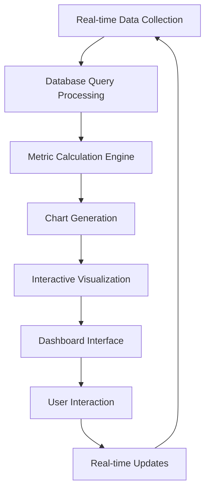

**Diagram sources**
- [TourTravelAnalyticsController.php:28-85](file://app/Http/Controllers/TourTravel/TourTravelAnalyticsController.php#L28-L85)

### Supplier Allocation Workflow

Supplier coordination involves cost calculation and allocation tracking:

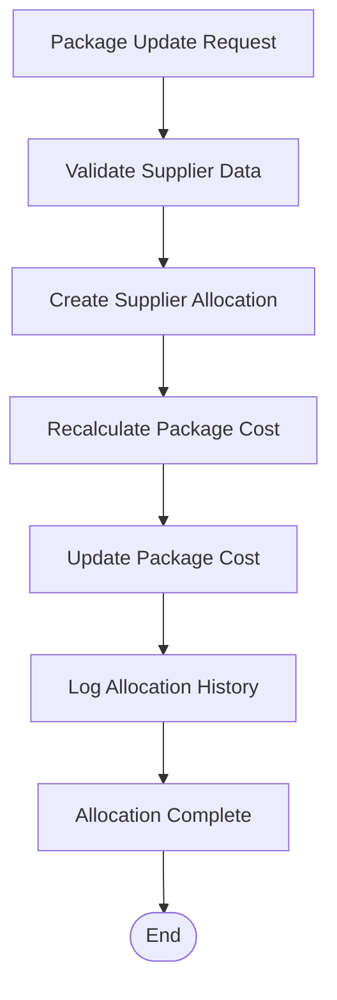

**Diagram sources**
- [TourPackageController.php:198-227](file://app/Http/Controllers/TourTravel/TourPackageController.php#L198-L227)

**Section sources**
- [TourPackageController.php:173-227](file://app/Http/Controllers/TourTravel/TourPackageController.php#L173-L227)
- [TourBookingController.php:138-200](file://app/Http/Controllers/TourTravel/TourBookingController.php#L138-L200)
- [TourTravelAnalyticsController.php:24-94](file://app/Http/Controllers/TourTravel/TourTravelAnalyticsController.php#L24-L94)

## Performance Considerations

### Database Optimization

The module implements several performance optimization strategies:

**Indexing Strategy:**
- Tenant ID indexing for multi-tenant isolation
- Status field indexing for filtering operations
- Date-based indexing for historical queries
- Foreign key indexing for relationship queries

**Query Optimization:**
- Eager loading of relationships to prevent N+1 queries
- Selective field retrieval using fillable arrays
- Pagination for large dataset handling
- Aggregation queries for dashboard statistics

**Caching Strategy:**
- Frequently accessed package data caching
- Supplier allocation cost caching
- User preference caching
- API response caching for static data
- Analytics data caching for dashboard performance

### Scalability Considerations

**Horizontal Scaling:**
- Multi-tenant architecture enables tenant isolation
- Stateless controller design supports load balancing
- Database connection pooling for concurrent requests
- Asynchronous job processing for heavy operations

**Resource Management:**
- File upload optimization with cloud storage integration
- Image compression for document attachments
- Efficient pagination for large datasets
- Database query optimization for complex joins
- Chart library optimization for large datasets

### Analytics Performance Optimization

**New** Analytics system optimizations include:

**Data Aggregation:**
- Pre-computed metrics for frequently accessed reports
- Cached chart data with configurable refresh intervals
- Optimized database queries with proper indexing
- Efficient data serialization for chart rendering

**Frontend Performance:**
- Chart.js library optimization for large datasets
- Lazy loading of chart components
- Responsive design for mobile analytics access
- Efficient DOM manipulation for real-time updates

## Troubleshooting Guide

### Common Issues and Solutions

**Package Creation Failures:**
- Verify tenant ID authentication
- Check required field validations
- Ensure unique package codes
- Validate supplier allocations

**Booking Processing Errors:**
- Confirm package availability
- Validate passenger data completeness
- Check payment gateway integration
- Review visa application requirements

**Analytics Dashboard Issues:**
- Verify chart library dependencies
- Check database connection for metric queries
- Ensure proper timezone configuration
- Validate tenant filtering for multi-tenant access

**API Integration Problems:**
- Verify authentication tokens
- Check endpoint URL correctness
- Validate request payload format
- Review response status codes

**Performance Issues:**
- Monitor database query execution times
- Check memory usage patterns
- Review pagination limits
- Analyze file upload performance

### Error Handling Patterns

The module implements comprehensive error handling across all components:

**Validation Errors:**
- Input validation failures return structured error responses
- Form validation errors preserve user input
- Database constraint violations handled gracefully

**Business Logic Errors:**
- Package availability conflicts resolved with user feedback
- Booking conflicts detected and reported
- Supplier allocation errors logged and recoverable
- Analytics query errors handled with fallback data

**System Errors:**
- Database connection failures handled with retry logic
- File upload errors managed with fallback mechanisms
- External API failures isolated with timeout handling
- Chart rendering errors handled with empty state displays

**Section sources**
- [TourPackageController.php:108-110](file://app/Http/Controllers/TourTravel/TourPackageController.php#L108-L110)
- [TourBookingController.php:113-115](file://app/Http/Controllers/TourTravel/TourBookingController.php#L113-L115)
- [TourTravelAnalyticsController.php:17-20](file://app/Http/Controllers/TourTravel/TourTravelAnalyticsController.php#L17-L20)

## Conclusion

The Tour Travel Module represents a comprehensive solution for travel management within the qalcuityERP ecosystem. Its modular architecture, robust data modeling, extensive API coverage, and sophisticated analytics capabilities enable seamless integration with various business processes and external systems.

**Updated** The module now provides comprehensive business intelligence through its analytics dashboard, featuring real-time metrics, interactive visualizations, and actionable insights. The analytics system enhances decision-making capabilities with monthly trend analysis, performance tracking, and market insights.

Key strengths of the module include:

**Technical Excellence:**
- Clean MVC architecture with proper separation of concerns
- Comprehensive validation and error handling
- Multi-tenant support for scalable deployment
- RESTful API design for modern integration
- Sophisticated analytics and data visualization capabilities

**Business Value:**
- Complete travel lifecycle management
- Real-time supplier coordination
- Automated document management
- Comprehensive reporting and analytics
- Interactive dashboards for operational insights

**Extensibility:**
- Modular design supports future enhancements
- Plugin architecture for additional services
- API-first approach enables third-party integrations
- Configurable workflows for diverse business needs
- Analytics framework supports custom reporting

The module provides a solid foundation for travel operations while maintaining flexibility for customization and growth. Its implementation demonstrates best practices in enterprise software development, combining technical excellence with practical business functionality and comprehensive analytics capabilities.