# Troubleshooting & Support

<cite>
**Referenced Files in This Document**
- [CustomExceptionHandler.php](file://app/Exceptions/CustomExceptionHandler.php)
- [TransactionException.php](file://app/Exceptions/TransactionException.php)
- [logging.php](file://config/logging.php)
- [queue.php](file://config/queue.php)
- [database.php](file://config/database.php)
- [ErrorLog.php](file://app/Models/ErrorLog.php)
- [ErrorAlertingService.php](file://app/Services/ErrorAlertingService.php)
- [ErrorContextEnricher.php](file://app/Services/ErrorContextEnricher.php)
- [ActionableErrorService.php](file://app/Services/ActionableErrorService.php)
- [CleanupOldData.php](file://app/Console/Commands/CleanupOldData.php)
- [CleanupExpiredApiTokens.php](file://app/Console/Commands/CleanupExpiredApiTokens.php)
- [optimize_mysql.sql](file://optimize_mysql.sql)
- [README.md](file://README.md)
</cite>

## Table of Contents
1. [Introduction](#introduction)
2. [Project Structure](#project-structure)
3. [Core Components](#core-components)
4. [Architecture Overview](#architecture-overview)
5. [Detailed Component Analysis](#detailed-component-analysis)
6. [Dependency Analysis](#dependency-analysis)
7. [Performance Considerations](#performance-considerations)
8. [Troubleshooting Guide](#troubleshooting-guide)
9. [Conclusion](#conclusion)
10. [Appendices](#appendices)

## Introduction
This document provides comprehensive troubleshooting and support guidance for Qalcuity ERP. It covers common issues, error diagnosis, resolution procedures, and operational best practices. It documents the error logging system, exception handling patterns, debugging techniques, performance troubleshooting, database optimization, queue processing issues, and support escalation procedures. It also outlines self-service tools and diagnostic utilities to help administrators and support teams quickly identify and resolve problems.

## Project Structure
Qalcuity ERP follows a layered Laravel architecture with dedicated modules for error handling, logging, queue processing, and database connectivity. Key areas relevant to troubleshooting include:
- Exception handling and rendering
- Centralized error logging and alerting
- Context enrichment for diagnostics
- Queue configuration and monitoring
- Database configuration and optimization
- Console maintenance commands for cleanup and hygiene
- Operational troubleshooting and deployment guidance

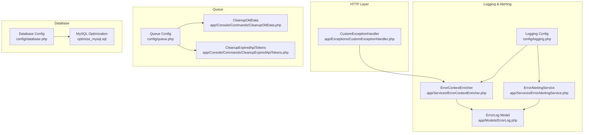

**Diagram sources**
- [CustomExceptionHandler.php:1-290](file://app/Exceptions/CustomExceptionHandler.php#L1-L290)
- [ErrorContextEnricher.php:1-320](file://app/Services/ErrorContextEnricher.php#L1-L320)
- [ErrorAlertingService.php:1-302](file://app/Services/ErrorAlertingService.php#L1-L302)
- [ErrorLog.php:1-213](file://app/Models/ErrorLog.php#L1-L213)
- [logging.php:1-216](file://config/logging.php#L1-L216)
- [queue.php:1-130](file://config/queue.php#L1-L130)
- [database.php:1-185](file://config/database.php#L1-L185)
- [optimize_mysql.sql:1-23](file://optimize_mysql.sql#L1-L23)
- [CleanupOldData.php:1-62](file://app/Console/Commands/CleanupOldData.php#L1-L62)
- [CleanupExpiredApiTokens.php:1-123](file://app/Console/Commands/CleanupExpiredApiTokens.php#L1-L123)

**Section sources**
- [CustomExceptionHandler.php:1-290](file://app/Exceptions/CustomExceptionHandler.php#L1-L290)
- [logging.php:1-216](file://config/logging.php#L1-L216)
- [queue.php:1-130](file://config/queue.php#L1-L130)
- [database.php:1-185](file://config/database.php#L1-L185)
- [optimize_mysql.sql:1-23](file://optimize_mysql.sql#L1-L23)
- [CleanupOldData.php:1-62](file://app/Console/Commands/CleanupOldData.php#L1-L62)
- [CleanupExpiredApiTokens.php:1-123](file://app/Console/Commands/CleanupExpiredApiTokens.php#L1-L123)

## Core Components
- Exception Handler: Centralizes rendering and logging of exceptions, determines log levels, and prevents infinite recursion by delegating reporting to a bootstrap-level callback.
- Error Logging Model: Stores structured error records with context, occurrence tracking, and resolution metadata.
- Context Enricher: Captures request, user, tenant, and system context for accurate diagnostics.
- Alerting Service: Sends real-time alerts for critical errors via Slack and email, with thresholds and deduplication.
- Queue Configuration: Defines queue backends, retry policies, and failed job handling.
- Database Configuration: Provides connection settings for SQLite, MySQL/MariaDB, PostgreSQL, and SQL Server, plus Redis options.
- Maintenance Commands: Automates cleanup of old backups, restore points, action logs, and expired API tokens.
- MySQL Optimization Script: Provides development-focused tuning for faster migrations.

**Section sources**
- [CustomExceptionHandler.php:1-290](file://app/Exceptions/CustomExceptionHandler.php#L1-L290)
- [ErrorLog.php:1-213](file://app/Models/ErrorLog.php#L1-L213)
- [ErrorContextEnricher.php:1-320](file://app/Services/ErrorContextEnricher.php#L1-L320)
- [ErrorAlertingService.php:1-302](file://app/Services/ErrorAlertingService.php#L1-L302)
- [queue.php:1-130](file://config/queue.php#L1-L130)
- [database.php:1-185](file://config/database.php#L1-L185)
- [CleanupOldData.php:1-62](file://app/Console/Commands/CleanupOldData.php#L1-L62)
- [CleanupExpiredApiTokens.php:1-123](file://app/Console/Commands/CleanupExpiredApiTokens.php#L1-L123)
- [optimize_mysql.sql:1-23](file://optimize_mysql.sql#L1-L23)

## Architecture Overview
The error handling and support architecture integrates HTTP exception rendering, centralized logging, context enrichment, and alerting. It ensures that critical errors are captured, enriched, and surfaced to operators while maintaining operational stability.

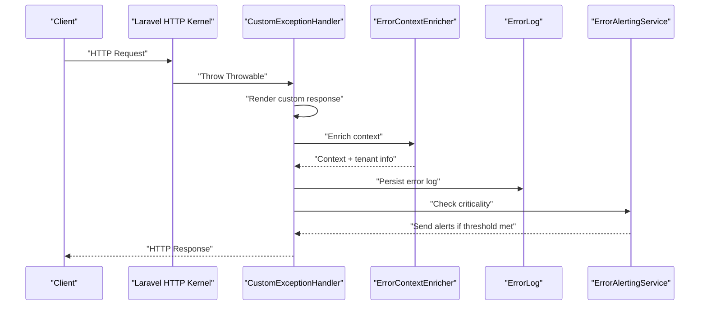

**Diagram sources**
- [CustomExceptionHandler.php:45-112](file://app/Exceptions/CustomExceptionHandler.php#L45-L112)
- [ErrorContextEnricher.php:229-269](file://app/Services/ErrorContextEnricher.php#L229-L269)
- [ErrorLog.php:1-213](file://app/Models/ErrorLog.php#L1-L213)
- [ErrorAlertingService.php:42-94](file://app/Services/ErrorAlertingService.php#L42-L94)

## Detailed Component Analysis

### Exception Handling and Rendering
- CustomExceptionHandler renders tailored responses for common exceptions (not found, validation, authentication) and delegates reporting to a bootstrap-level callback to avoid recursion.
- Determines log levels based on exception type and HTTP status codes, and sets context including tenant and user identifiers.

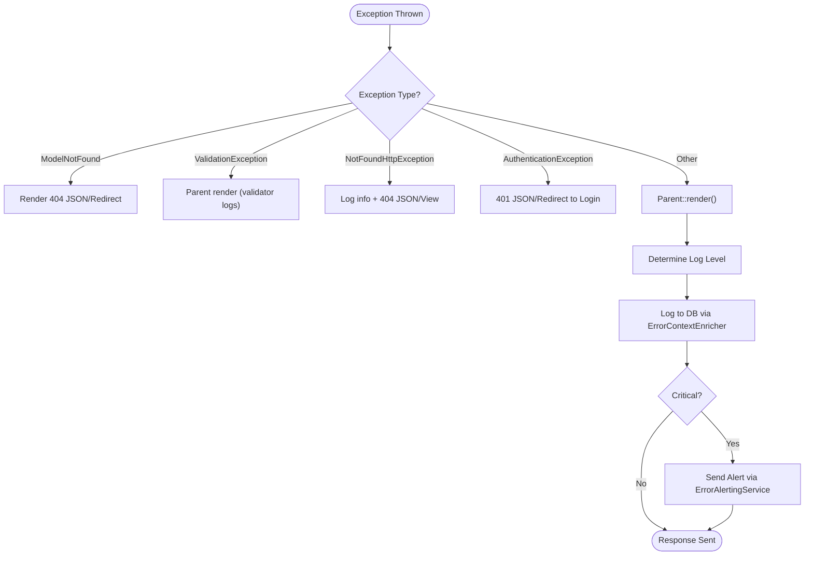

**Diagram sources**
- [CustomExceptionHandler.php:45-260](file://app/Exceptions/CustomExceptionHandler.php#L45-L260)

**Section sources**
- [CustomExceptionHandler.php:1-290](file://app/Exceptions/CustomExceptionHandler.php#L1-L290)

### Error Logging Model and Resolution
- ErrorLog persists structured error entries with fields for level, type, message, stack trace, tenant/user context, request data, and occurrence tracking.
- Provides scopes for unresolved/critical/recent errors and helper methods for resolution, occurrence counting, and UI-friendly severity mapping.

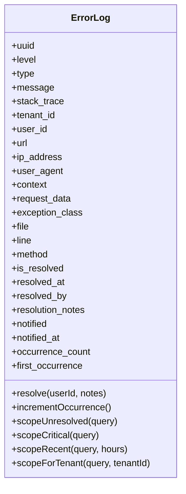

**Diagram sources**
- [ErrorLog.php:1-213](file://app/Models/ErrorLog.php#L1-L213)

**Section sources**
- [ErrorLog.php:1-213](file://app/Models/ErrorLog.php#L1-L213)

### Context Enrichment for Diagnostics
- ErrorContextEnricher captures request, user, tenant, and system context, sanitizes sensitive input, and resolves tenant ID from multiple sources to ensure accurate triaging.

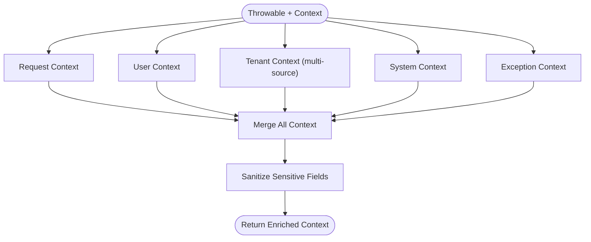

**Diagram sources**
- [ErrorContextEnricher.php:24-206](file://app/Services/ErrorContextEnricher.php#L24-L206)

**Section sources**
- [ErrorContextEnricher.php:1-320](file://app/Services/ErrorContextEnricher.php#L1-L320)

### Alerting for Critical Errors
- ErrorAlertingService sends alerts to Slack and email based on configured levels and thresholds, marks notifications, and logs failures independently.

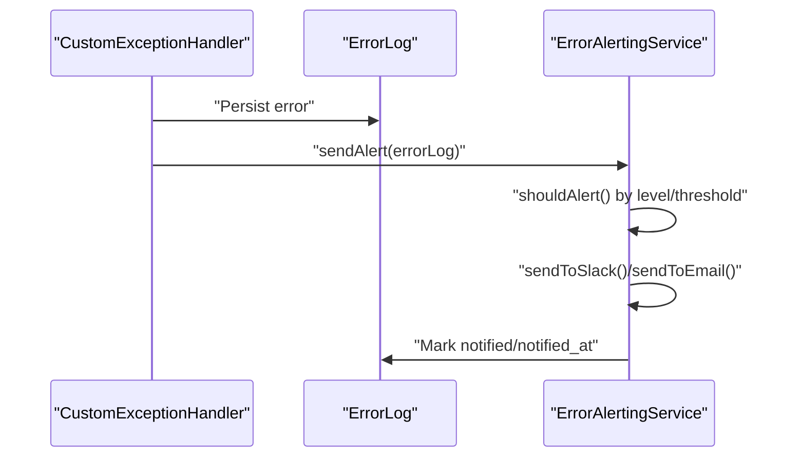

**Diagram sources**
- [ErrorAlertingService.php:42-94](file://app/Services/ErrorAlertingService.php#L42-L94)
- [CustomExceptionHandler.php:93-112](file://app/Exceptions/CustomExceptionHandler.php#L93-L112)

**Section sources**
- [ErrorAlertingService.php:1-302](file://app/Services/ErrorAlertingService.php#L1-L302)
- [CustomExceptionHandler.php:93-112](file://app/Exceptions/CustomExceptionHandler.php#L93-L112)

### Queue Processing Troubleshooting
- Queue configuration supports multiple backends (database, beanstalkd, SQS, Redis) with retry and failed job handling.
- Maintenance commands automate cleanup of old backups, restore points, and expired/inactive API tokens.

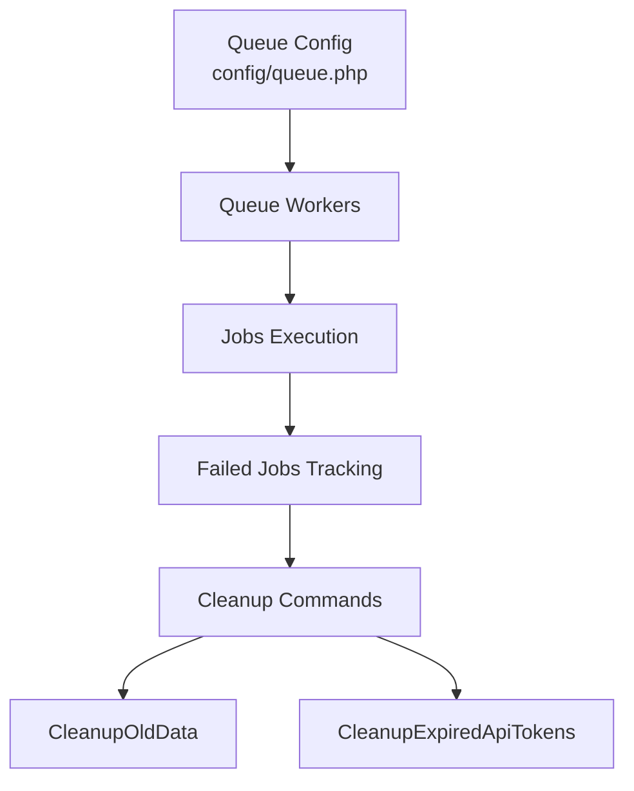

**Diagram sources**
- [queue.php:1-130](file://config/queue.php#L1-L130)
- [CleanupOldData.php:1-62](file://app/Console/Commands/CleanupOldData.php#L1-L62)
- [CleanupExpiredApiTokens.php:1-123](file://app/Console/Commands/CleanupExpiredApiTokens.php#L1-L123)

**Section sources**
- [queue.php:1-130](file://config/queue.php#L1-L130)
- [CleanupOldData.php:1-62](file://app/Console/Commands/CleanupOldData.php#L1-L62)
- [CleanupExpiredApiTokens.php:1-123](file://app/Console/Commands/CleanupExpiredApiTokens.php#L1-L123)

### Database Configuration and Optimization
- Database configuration supports multiple drivers with connection parameters and Redis options.
- MySQL optimization script provides development-focused tuning for faster migrations.

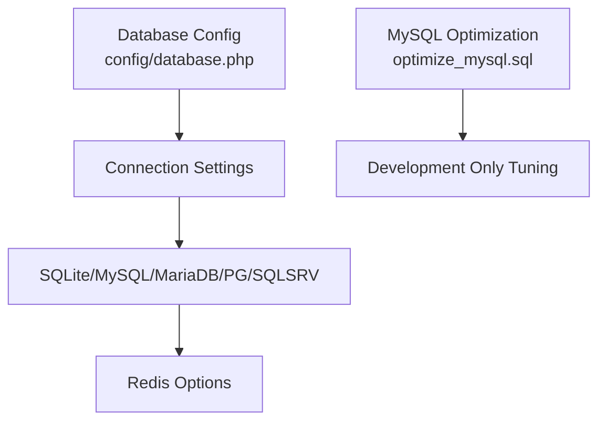

**Diagram sources**
- [database.php:1-185](file://config/database.php#L1-L185)
- [optimize_mysql.sql:1-23](file://optimize_mysql.sql#L1-L23)

**Section sources**
- [database.php:1-185](file://config/database.php#L1-L185)
- [optimize_mysql.sql:1-23](file://optimize_mysql.sql#L1-L23)

### Transaction-Level Error Semantics
- TransactionException encapsulates transaction failure semantics with typed contexts and helpers for rollback and compensation scenarios.

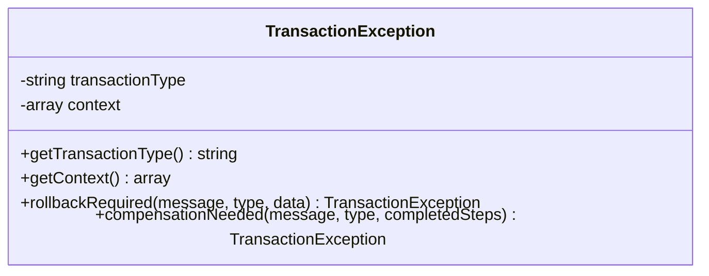

**Diagram sources**
- [TransactionException.php:1-66](file://app/Exceptions/TransactionException.php#L1-L66)

**Section sources**
- [TransactionException.php:1-66](file://app/Exceptions/TransactionException.php#L1-L66)

### Actionable Error Service (Enhanced)
- ActionableErrorService provides user-friendly error messages with suggested solutions, severity levels, and statistics for dashboard visibility.

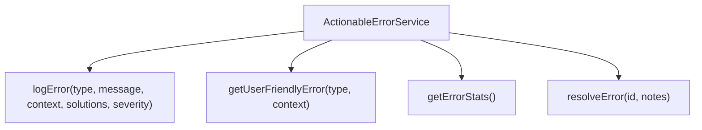

**Diagram sources**
- [ActionableErrorService.php:1-206](file://app/Services/ActionableErrorService.php#L1-L206)

**Section sources**
- [ActionableErrorService.php:1-206](file://app/Services/ActionableErrorService.php#L1-L206)

## Dependency Analysis
- Exception handling depends on logging configuration and the error logging model.
- Alerting depends on Slack webhook configuration and email recipients.
- Queue processing depends on queue configuration and failed job tracking.
- Database operations depend on driver-specific configurations and Redis settings.

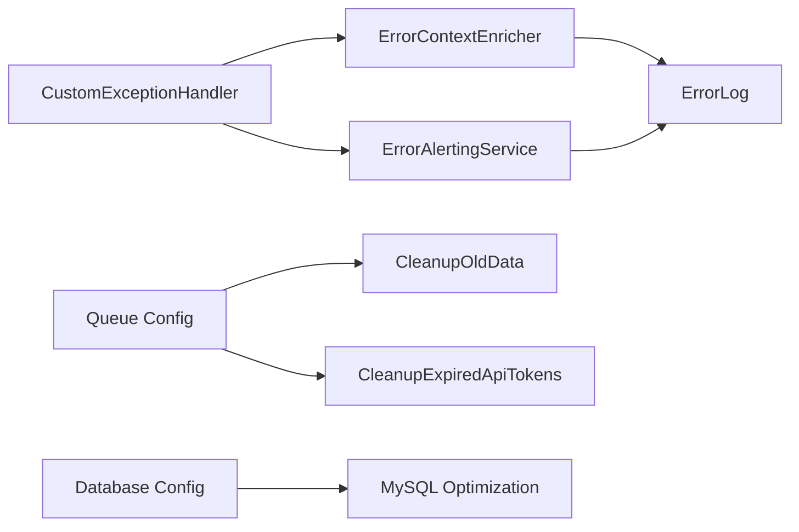

**Diagram sources**
- [CustomExceptionHandler.php:1-290](file://app/Exceptions/CustomExceptionHandler.php#L1-L290)
- [ErrorContextEnricher.php:1-320](file://app/Services/ErrorContextEnricher.php#L1-L320)
- [ErrorAlertingService.php:1-302](file://app/Services/ErrorAlertingService.php#L1-L302)
- [ErrorLog.php:1-213](file://app/Models/ErrorLog.php#L1-L213)
- [queue.php:1-130](file://config/queue.php#L1-L130)
- [CleanupOldData.php:1-62](file://app/Console/Commands/CleanupOldData.php#L1-L62)
- [CleanupExpiredApiTokens.php:1-123](file://app/Console/Commands/CleanupExpiredApiTokens.php#L1-L123)
- [database.php:1-185](file://config/database.php#L1-L185)
- [optimize_mysql.sql:1-23](file://optimize_mysql.sql#L1-L23)

**Section sources**
- [CustomExceptionHandler.php:1-290](file://app/Exceptions/CustomExceptionHandler.php#L1-L290)
- [ErrorAlertingService.php:1-302](file://app/Services/ErrorAlertingService.php#L1-L302)
- [queue.php:1-130](file://config/queue.php#L1-L130)
- [database.php:1-185](file://config/database.php#L1-L185)

## Performance Considerations
- Enable production caching for configuration, routes, views, and events to reduce overhead.
- Monitor queue worker throughput and adjust process counts and retry intervals.
- Use appropriate database connection settings and Redis clustering for scale.
- Apply MySQL optimization only in development environments as indicated by the script comments.

[No sources needed since this section provides general guidance]

## Troubleshooting Guide

### Error Diagnosis and Resolution Procedures
- Review the centralized error logs and alert notifications for recent critical errors.
- Use the context enrichment to identify tenant, user, and request details associated with the error.
- For recurring errors, check occurrence counts and first occurrence timestamps to assess impact.
- Resolve errors via the administrative interface or programmatic resolution methods.

**Section sources**
- [ErrorLog.php:125-142](file://app/Models/ErrorLog.php#L125-L142)
- [ErrorContextEnricher.php:229-269](file://app/Services/ErrorContextEnricher.php#L229-L269)
- [ErrorAlertingService.php:42-94](file://app/Services/ErrorAlertingService.php#L42-L94)

### Exception Handling Patterns
- Authentication failures return 401 responses; redirect to login for web requests.
- Validation failures are rendered by the parent handler; avoid logging validation errors to the database to reduce noise.
- Model not found returns 404 responses with JSON for APIs and user-friendly messages for web.
- Not found pages are logged with request metadata for auditing.

**Section sources**
- [CustomExceptionHandler.php:173-243](file://app/Exceptions/CustomExceptionHandler.php#L173-L243)

### Debugging Techniques
- Tail Laravel logs for runtime errors and queue worker logs for job failures.
- Verify APP_KEY presence and clear caches if encountering 500 errors after deployment.
- Confirm Nginx rewrite rules target the public directory and index.php.

**Section sources**
- [README.md:508-559](file://README.md#L508-L559)

### Performance Troubleshooting
- Confirm production caching is enabled and autoloader is optimized.
- Monitor queue backlog and failed job counts; investigate retry_after and block_for settings.
- Adjust database connection parameters and Redis options for workload characteristics.

**Section sources**
- [README.md:434-449](file://README.md#L434-L449)
- [queue.php:38-90](file://config/queue.php#L38-L90)
- [database.php:146-182](file://config/database.php#L146-L182)

### Database Optimization
- Use the provided MySQL optimization script only in development to accelerate migrations.
- Ensure foreign key constraints are re-enabled after bulk operations.

**Section sources**
- [optimize_mysql.sql:1-23](file://optimize_mysql.sql#L1-L23)

### Queue Processing Issues
- Verify Supervisor status and restart workers if idle or stuck.
- Inspect failed jobs and retry or investigate causes.
- Confirm queue:table exists and migrations are applied.

**Section sources**
- [README.md:525-538](file://README.md#L525-L538)
- [queue.php:123-127](file://config/queue.php#L123-L127)

### Maintenance and Hygiene
- Run CleanupOldData to remove expired backups, restore points, and action logs.
- Run CleanupExpiredApiTokens to remove expired and inactive API tokens with dry-run support.

**Section sources**
- [CleanupOldData.php:1-62](file://app/Console/Commands/CleanupOldData.php#L1-L62)
- [CleanupExpiredApiTokens.php:1-123](file://app/Console/Commands/CleanupExpiredApiTokens.php#L1-L123)

### Support Escalation and Bug Reporting
- Use the actionable error service to generate user-friendly messages with suggested solutions.
- Leverage Slack/email alerts for critical incidents to escalate quickly.
- Reference the operational checklist to ensure environment readiness before escalation.

**Section sources**
- [ActionableErrorService.php:1-206](file://app/Services/ActionableErrorService.php#L1-L206)
- [ErrorAlertingService.php:42-94](file://app/Services/ErrorAlertingService.php#L42-L94)
- [README.md:563-576](file://README.md#L563-L576)

### Community Resources
- Consult the project’s README for deployment and troubleshooting guidance.
- Explore module-specific documentation under the docs directory for specialized areas.

**Section sources**
- [README.md:1-576](file://README.md#L1-L576)

## Conclusion
Qalcuity ERP provides a robust, layered approach to error handling, logging, and alerting, complemented by queue and database configuration options and maintenance commands. By leveraging the centralized logging model, context enrichment, and alerting mechanisms, support teams can diagnose and resolve issues efficiently. Adhering to the operational best practices and using the self-service tools outlined here will improve system reliability and reduce downtime.

[No sources needed since this section summarizes without analyzing specific files]

## Appendices

### Self-Service Diagnostic Utilities
- Tail logs for immediate insight into runtime issues.
- Use maintenance commands for routine cleanup and hygiene.
- Validate environment configuration against the operational checklist.

**Section sources**
- [README.md:508-559](file://README.md#L508-L559)
- [CleanupOldData.php:1-62](file://app/Console/Commands/CleanupOldData.php#L1-L62)
- [CleanupExpiredApiTokens.php:1-123](file://app/Console/Commands/CleanupExpiredApiTokens.php#L1-L123)
- [README.md:563-576](file://README.md#L563-L576)